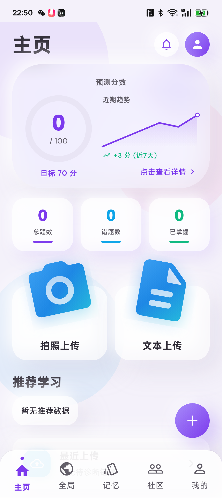
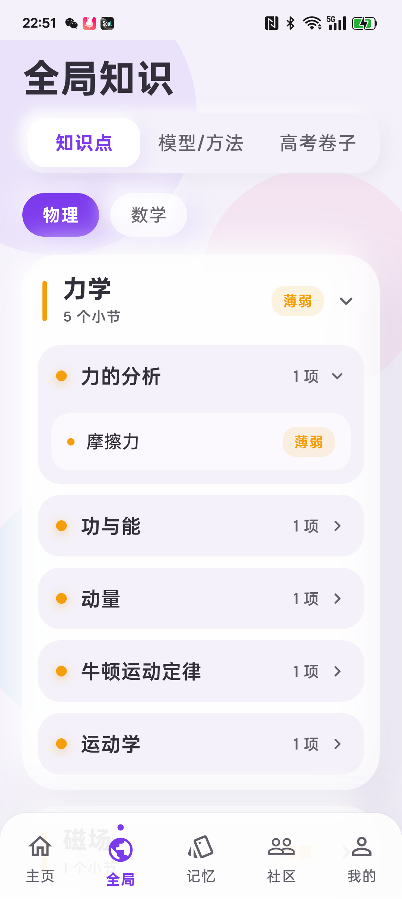
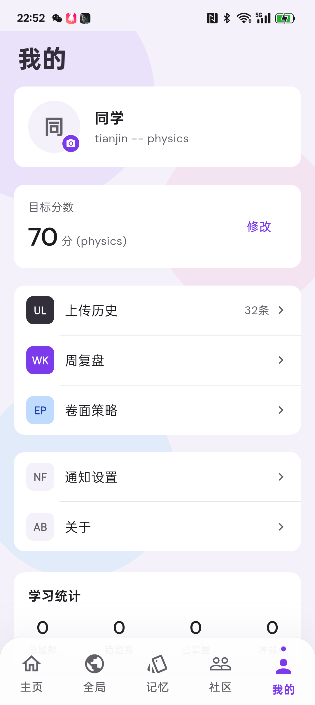
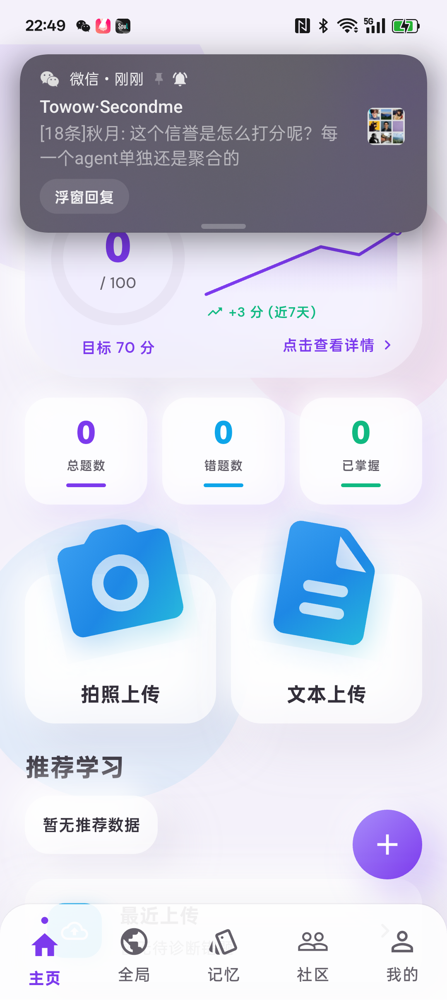

# 安卓真机后端联调验证报告

- 生成时间: 2026-02-28
- 项目路径: `D:\AI\AI+high school homework\EchoMind-AI_Error_Tracker\echomind_app`
- 测试设备: `PGP110 (Android 15, a1a9a75)`
- App 包名: `com.example.echomind_app`
- 后端基地址: `http://8.130.16.212:8001/api`

## 1. 测试目标

1. 启动安卓真机调试，验证 App 可安装、可冷启动、可进入业务页。
2. 检验后端端口与接口实现状态（鉴权前后）。
3. 形成截图证据与问题清单，供后续修复与回归。

## 2. 执行步骤（实测）

1. 设备连通性检查
- `adb devices` 识别到真机 `a1a9a75`。
- `flutter devices` 识别到 Android 设备 `PGP110`。

2. 端口连通性检查
- 执行 `Test-NetConnection 8.130.16.212 -Port 8001`。
- 结果: `TcpTestSucceeded = True`。

3. 后端接口批量探测（脚本）
- 登录账号用于鉴权联调: `18222830713`（调试账号）。
- 结果文件:
  - `docs/testing/test_result/backend_probe_results.json`
  - `docs/testing/test_result/backend_probe_results.txt`
  - `docs/testing/test_result/backend_probe_summary.json`

4. 真机安装与启动
- 执行 `flutter install -d a1a9a75 --debug` 安装成功。
- 执行 `flutter run -d a1a9a75 --debug`，设备端成功进入 Flutter 页面。
- 冷启动复测: `am force-stop + monkey` 后仍可进入页面。

5. 真机截图采集
- 截图目录: `docs/testing/test_result/screenshots/`

## 3. 后端接口探测结果

### 3.1 总览

- 总检查数: `31`
- 成功: `23`
- 失败: `8`
- 登录: 成功（token 长度 `165`）

### 3.2 失败项说明

1. 预期失败（未带 token）
- `/dashboard` `403`
- `/recommendations` `403`
- `/questions/history` `403`
- `/prediction/score` `403`
- `/weekly-review` `403`
- `/strategy` `403`
- `/community/requests` `403`

说明: 这些属于受保护接口，无 token 返回 `403`，符合当前后端权限策略。

2. 非预期失败（带 token）
- `/exams/question-types` `404`

说明: 该接口当前在后端未找到或路由未挂载，前端对应模块会显示错误态，需后端补齐实现或修正路由。

### 3.3 关键通过项（带 token）

- `GET /auth/me` `200`
- `GET /dashboard` `200`
- `GET /recommendations` `200`
- `GET /questions/history` `200`
- `GET /questions/aggregate` `200`
- `GET /knowledge/tree` `200`
- `GET /models/tree` `200`
- `GET /knowledge/kp_friction` `200`（动态 ID）
- `GET /models/model_energy_method` `200`（动态 ID）
- `GET /prediction/score` `200`
- `GET /flashcards` `200`
- `GET /weekly-review` `200`
- `GET /strategy` `200`
- `GET /strategy/templates` `200`
- `GET /community/requests` `200`
- `GET /community/feedback` `200`
- `GET /diagnosis/session` `200`
- `GET /models/training/session` `200`

补充: `questions/history` 当前返回空列表，故未获取到可用于 `/questions/{id}` 的动态题目 ID。

## 4. 真机截图证据

1. 首页（冷启动后）

2. 全局知识页

3. 我的页

4. 冷启动复测截图

## 5. 结论

1. 后端端口 `8001` 可达，登录与绝大多数核心接口可用。
2. 真机安装、运行、冷启动链路已跑通，页面可正常展示真实后端数据。
3. 当前主要后端阻塞点为 `GET /exams/question-types` 返回 `404`。

## 6. 建议的下一步

1. 后端优先补齐 `GET /exams/question-types` 或确认正确路由并同步前端。
2. 为接口增加统一错误码与请求 ID，便于自动化回归报告追踪。
3. 增加“带 token 的全链路 UI 集成测试”到 CI（覆盖首页、全局、个人、周复盘、策略）。
