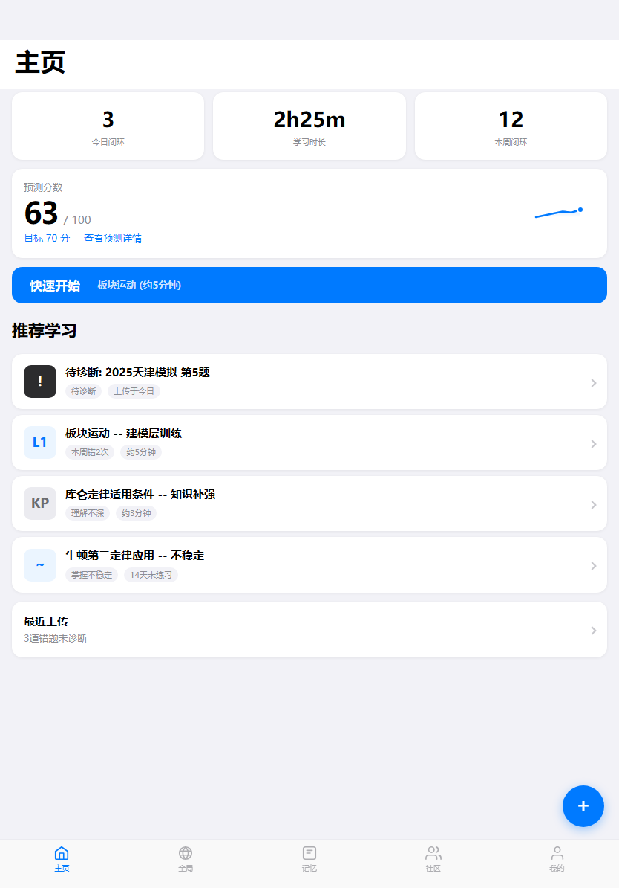
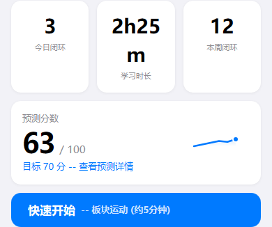
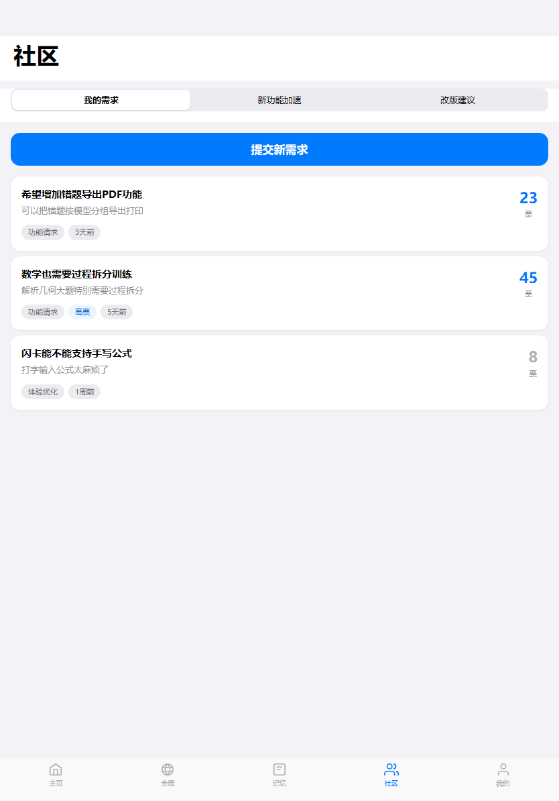
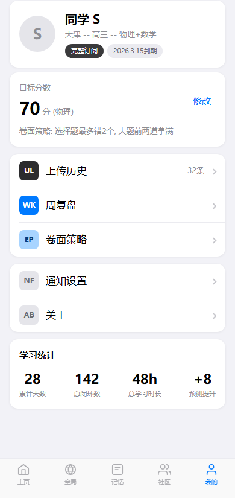
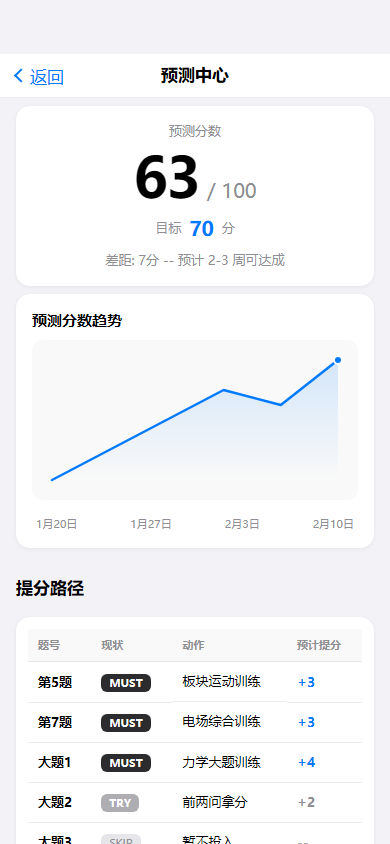
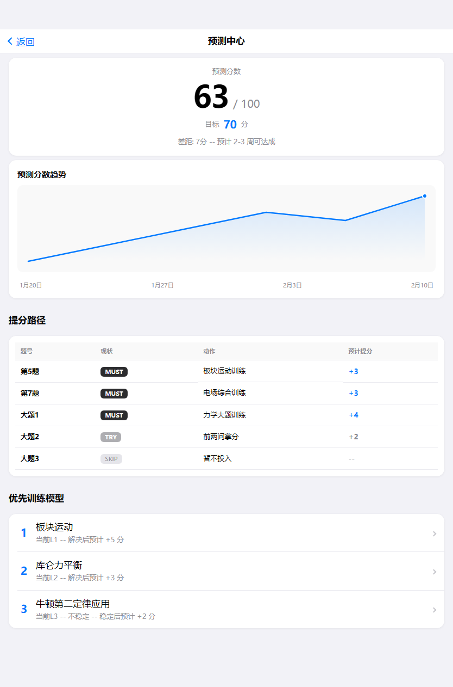
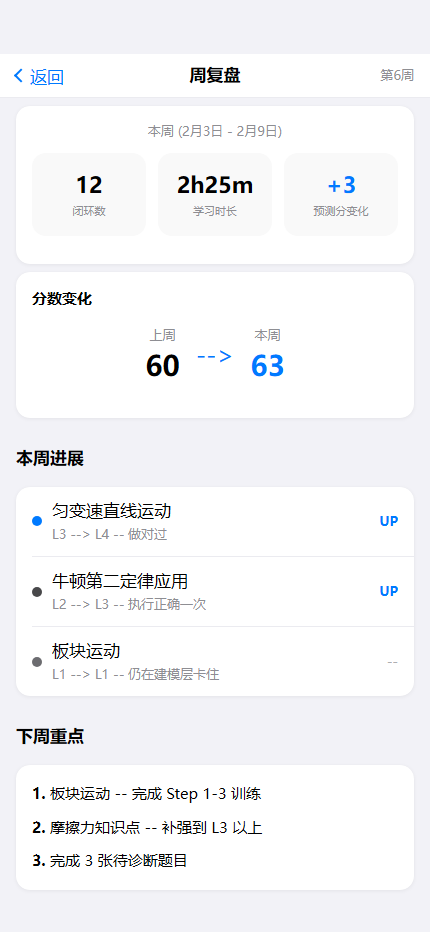
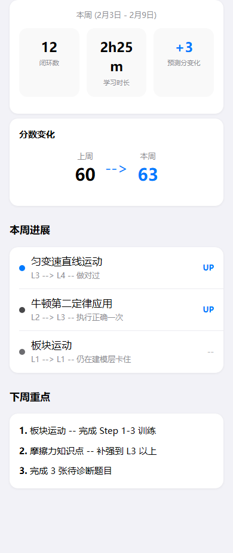

# HTML页面组件功能截图核对手册（第一阶段）

本手册用于人工校正 HTML 前端功能与布局规则，并作为下一阶段 Flutter 迁移输入。

## 契约类型

```ts
type CaptureSpec = {
  page_id: string;
  route_id: string;
  viewports: ['390x844', '430x932', '834x1194'];
  component_ids: string[];
  state_scenarios?: StateScenario[];
};

type StateScenario = {
  scenario_id: string;
  action_js: string;
  target_components: string[];
  wait_ms: number;
};

type ComponentDocSpec = {
  component_id: string;
  component_image: string;
  basic_function: string;
  layout_contract: string;
  text_overflow_rule: string;
  responsive_rule: string;
  input_output: string;
};
```

# index

- 页面目的: 首页负责汇总学习状态、推荐下一步学习动作，并提供上传快捷入口，是错题闭环的主入口。
- 路由标识: `home`
- 组件树: `top-frame -> top-dashboard -> recommendation-list -> recent-upload -> action-overlay`
- 页面格式规范: 顶部导航区位于上层，正文从其下方开始排布，禁止正文上移重叠。 底部浮层固定贴底，主内容预留底部安全区，避免按钮被遮挡。 正文列表与卡片使用自然文档流，内容增多后应推动后续模块下移。 适配策略为手机到平板单列自适应，不使用手机壳固定宽高。

## 页面截图

- 视口 `390x844`


- 视口 `430x932`


- 视口 `834x1194`


## top-frame


- 功能说明: 页面顶栏组件，承载返回、标题和顶部导航语义。
- 布局契约: 位于页面上方固定区域，不与正文内容重叠。
- 超长文本/数字规范: 标题单行省略，避免顶栏高度波动。
- 响应式规范: 不同宽度下保持左右安全边距与点击区域。
- 输入/输出: 输入: `pageData.top-frame` 与页面状态。输出: 无跨页跳转，主要为页内展示/状态切换。

## top-dashboard



- 功能说明: top dashboard 负责该区域的核心信息展示与交互承接。
- 布局契约: 统计卡区域位于内容前段，数值与摘要信息需要稳定对齐。
- 超长文本/数字规范: 标题建议单行省略；描述使用两行截断或自动换行；超长无空格词允许断词。
- 响应式规范: 窄屏自动换行排列卡片，平板维持单列分组不跳层。
- 输入/输出: 输入: `pageData.top-dashboard` 与页面状态。输出: 可触发路由跳转: modelTraining、predictionCenter。

## recommendation-list


- 功能说明: recommendation list 负责该区域的核心信息展示与交互承接。
- 布局契约: 列表区采用自然文档流纵向扩展，列表增长后应推动后续区域下移。
- 超长文本/数字规范: 标题建议单行省略；描述使用两行截断或自动换行；超长无空格词允许断词。
- 响应式规范: 在窄屏保持单列；在长屏增加可视条目但不改变信息层级。
- 输入/输出: 输入: `pageData.recommendation-list` 与页面状态。输出: 可触发路由跳转: aiDiagnosis。

## recent-upload


- 功能说明: recent upload 负责该区域的核心信息展示与交互承接。
- 布局契约: 功能块位于页面主内容区，跟随文档流渲染并保持上下间距一致。
- 超长文本/数字规范: 标题建议单行省略；描述使用两行截断或自动换行；超长无空格词允许断词。
- 响应式规范: 在不同宽度下保持单列结构，允许容器宽度自适应。
- 输入/输出: 输入: `pageData.recent-upload` 与页面状态。输出: 可触发路由跳转: uploadHistory。

## action-overlay


- 功能说明: 底部浮层交互组件（输入框/FAB/发送），负责关键动作入口。
- 布局契约: 固定贴底显示，需与主内容留出安全区，避免遮挡主操作按钮。
- 超长文本/数字规范: 输入占位文案使用单行省略；发送按钮文案保持短文本。
- 响应式规范: 在长屏/平板仍贴底，横向空间增大时输入框优先扩展宽度。
- 输入/输出: 输入: `pageData.action-overlay` 与页面状态。输出: 可触发路由跳转: uploadMenu。

## 人工修正位

- 需要人工补充的业务逻辑:
- 需要人工确认的交互边界:
- 需要人工调整的文本与适配规则:

# community

- 页面目的: 社区页承载需求反馈与版本建议，采用三选栏切换同层内容板块。
- 路由标识: `community`
- 组件树: `top-frame-and-tabs -> board-my-requests -> board-feature-boost -> board-feedback`
- 页面格式规范: 顶部导航区位于上层，正文从其下方开始排布，禁止正文上移重叠。 正文列表与卡片使用自然文档流，内容增多后应推动后续模块下移。 适配策略为手机到平板单列自适应，不使用手机壳固定宽高。

## 页面截图

- 视口 `390x844`


- 视口 `430x932`


- 视口 `834x1194`


## top-frame-and-tabs


- 功能说明: 社区页顶栏与三选栏组合组件，负责板块切换入口。
- 布局契约: 顶部区域固定，内容区由当前tab内容承载。
- 超长文本/数字规范: tab标题单行省略，避免挤压点击区域。
- 响应式规范: 宽屏下等比分配tab宽度，窄屏保持可读和可点。
- 输入/输出: 输入: `pageData.top-frame-and-tabs` 与页面状态。输出: 无跨页跳转，主要为页内展示/状态切换。

## board-my-requests


- 状态 `tab-0`


- 功能说明: board my requests 负责该区域的核心信息展示与交互承接。
- 布局契约: 功能块位于页面主内容区，跟随文档流渲染并保持上下间距一致。
- 超长文本/数字规范: 标题建议单行省略；描述使用两行截断或自动换行；超长无空格词允许断词。
- 响应式规范: 在不同宽度下保持单列结构，允许容器宽度自适应。
- 输入/输出: 输入: `pageData.board-my-requests` 与页面状态。输出: 无跨页跳转，主要为页内展示/状态切换。

## board-feature-boost

_默认状态未捕获到该组件截图，见状态截图或缺失清单。_

- 状态 `tab-1`


- 功能说明: board feature boost 负责该区域的核心信息展示与交互承接。
- 布局契约: 功能块位于页面主内容区，跟随文档流渲染并保持上下间距一致。
- 超长文本/数字规范: 标题建议单行省略；描述使用两行截断或自动换行；超长无空格词允许断词。
- 响应式规范: 在不同宽度下保持单列结构，允许容器宽度自适应。
- 输入/输出: 输入: `pageData.board-feature-boost` 与页面状态。输出: 无跨页跳转，主要为页内展示/状态切换。

## board-feedback

_默认状态未捕获到该组件截图，见状态截图或缺失清单。_

- 状态 `tab-2`


- 功能说明: board feedback 负责该区域的核心信息展示与交互承接。
- 布局契约: 功能块位于页面主内容区，跟随文档流渲染并保持上下间距一致。
- 超长文本/数字规范: 标题建议单行省略；描述使用两行截断或自动换行；超长无空格词允许断词。
- 响应式规范: 在不同宽度下保持单列结构，允许容器宽度自适应。
- 输入/输出: 输入: `pageData.board-feedback` 与页面状态。输出: 无跨页跳转，主要为页内展示/状态切换。

## 人工修正位

- 需要人工补充的业务逻辑:
- 需要人工确认的交互边界:
- 需要人工调整的文本与适配规则:

# memory

- 页面目的: 记忆页展示今日复习状态与卡片分类，连接闪卡复习流程。
- 路由标识: `memory`
- 组件树: `top-frame -> review-dashboard -> card-category-list`
- 页面格式规范: 顶部导航区位于上层，正文从其下方开始排布，禁止正文上移重叠。 正文列表与卡片使用自然文档流，内容增多后应推动后续模块下移。 适配策略为手机到平板单列自适应，不使用手机壳固定宽高。

## 页面截图

- 视口 `390x844`


- 视口 `430x932`


- 视口 `834x1194`


## top-frame


- 功能说明: 页面顶栏组件，承载返回、标题和顶部导航语义。
- 布局契约: 位于页面上方固定区域，不与正文内容重叠。
- 超长文本/数字规范: 标题单行省略，避免顶栏高度波动。
- 响应式规范: 不同宽度下保持左右安全边距与点击区域。
- 输入/输出: 输入: `pageData.top-frame` 与页面状态。输出: 无跨页跳转，主要为页内展示/状态切换。

## review-dashboard


- 功能说明: review dashboard 负责该区域的核心信息展示与交互承接。
- 布局契约: 统计卡区域位于内容前段，数值与摘要信息需要稳定对齐。
- 超长文本/数字规范: 标题建议单行省略；描述使用两行截断或自动换行；超长无空格词允许断词。
- 响应式规范: 窄屏自动换行排列卡片，平板维持单列分组不跳层。
- 输入/输出: 输入: `pageData.review-dashboard` 与页面状态。输出: 可触发路由跳转: flashcardReview。

## card-category-list


- 功能说明: card category list 负责该区域的核心信息展示与交互承接。
- 布局契约: 列表区采用自然文档流纵向扩展，列表增长后应推动后续区域下移。
- 超长文本/数字规范: 标题建议单行省略；描述使用两行截断或自动换行；超长无空格词允许断词。
- 响应式规范: 在窄屏保持单列；在长屏增加可视条目但不改变信息层级。
- 输入/输出: 输入: `pageData.card-category-list` 与页面状态。输出: 无跨页跳转，主要为页内展示/状态切换。

## 人工修正位

- 需要人工补充的业务逻辑:
- 需要人工确认的交互边界:
- 需要人工调整的文本与适配规则:

# profile

- 页面目的: 我的页面集中展示用户信息、目标分、功能入口和学习统计。
- 路由标识: `profile`
- 组件树: `top-frame -> user-info-card -> target-score-card -> three-row-navigation -> two-row-navigation -> learning-stats`
- 页面格式规范: 顶部导航区位于上层，正文从其下方开始排布，禁止正文上移重叠。 正文列表与卡片使用自然文档流，内容增多后应推动后续模块下移。 适配策略为手机到平板单列自适应，不使用手机壳固定宽高。

## 页面截图

- 视口 `390x844`


- 视口 `430x932`


- 视口 `834x1194`


## top-frame


- 功能说明: 页面顶栏组件，承载返回、标题和顶部导航语义。
- 布局契约: 位于页面上方固定区域，不与正文内容重叠。
- 超长文本/数字规范: 标题单行省略，避免顶栏高度波动。
- 响应式规范: 不同宽度下保持左右安全边距与点击区域。
- 输入/输出: 输入: `pageData.top-frame` 与页面状态。输出: 无跨页跳转，主要为页内展示/状态切换。

## user-info-card



- 功能说明: user info card 负责该区域的核心信息展示与交互承接。
- 布局契约: 功能块位于页面主内容区，跟随文档流渲染并保持上下间距一致。
- 超长文本/数字规范: 标题建议单行省略；描述使用两行截断或自动换行；超长无空格词允许断词。
- 响应式规范: 在不同宽度下保持单列结构，允许容器宽度自适应。
- 输入/输出: 输入: `pageData.user-info-card` 与页面状态。输出: 无跨页跳转，主要为页内展示/状态切换。

## target-score-card


- 功能说明: target score card 负责该区域的核心信息展示与交互承接。
- 布局契约: 统计卡区域位于内容前段，数值与摘要信息需要稳定对齐。
- 超长文本/数字规范: 标题建议单行省略；描述使用两行截断或自动换行；超长无空格词允许断词。
- 响应式规范: 窄屏自动换行排列卡片，平板维持单列分组不跳层。
- 输入/输出: 输入: `pageData.target-score-card` 与页面状态。输出: 无跨页跳转，主要为页内展示/状态切换。

## three-row-navigation


- 功能说明: three row navigation 负责该区域的核心信息展示与交互承接。
- 布局契约: 功能块位于页面主内容区，跟随文档流渲染并保持上下间距一致。
- 超长文本/数字规范: 标题建议单行省略；描述使用两行截断或自动换行；超长无空格词允许断词。
- 响应式规范: 在不同宽度下保持单列结构，允许容器宽度自适应。
- 输入/输出: 输入: `pageData.three-row-navigation` 与页面状态。输出: 可触发路由跳转: registerStrategy、uploadHistory、weeklyReview。

## two-row-navigation


- 功能说明: two row navigation 负责该区域的核心信息展示与交互承接。
- 布局契约: 功能块位于页面主内容区，跟随文档流渲染并保持上下间距一致。
- 超长文本/数字规范: 标题建议单行省略；描述使用两行截断或自动换行；超长无空格词允许断词。
- 响应式规范: 在不同宽度下保持单列结构，允许容器宽度自适应。
- 输入/输出: 输入: `pageData.two-row-navigation` 与页面状态。输出: 无跨页跳转，主要为页内展示/状态切换。

## learning-stats


- 功能说明: learning stats 负责该区域的核心信息展示与交互承接。
- 布局契约: 功能块位于页面主内容区，跟随文档流渲染并保持上下间距一致。
- 超长文本/数字规范: 标题建议单行省略；描述使用两行截断或自动换行；超长无空格词允许断词。
- 响应式规范: 在不同宽度下保持单列结构，允许容器宽度自适应。
- 输入/输出: 输入: `pageData.learning-stats` 与页面状态。输出: 无跨页跳转，主要为页内展示/状态切换。

## 人工修正位

- 需要人工补充的业务逻辑:
- 需要人工确认的交互边界:
- 需要人工调整的文本与适配规则:

# global-knowledge

- 页面目的: 全局知识点页用于浏览可折叠知识树，定位知识点并进入知识详情。
- 路由标识: `globalKnowledge`
- 组件树: `top-frame -> knowledge-tree`
- 页面格式规范: 顶部导航区位于上层，正文从其下方开始排布，禁止正文上移重叠。 正文列表与卡片使用自然文档流，内容增多后应推动后续模块下移。 适配策略为手机到平板单列自适应，不使用手机壳固定宽高。

## 页面截图

- 视口 `390x844`


- 视口 `430x932`


- 视口 `834x1194`


## top-frame


- 功能说明: 页面顶栏组件，承载返回、标题和顶部导航语义。
- 布局契约: 位于页面上方固定区域，不与正文内容重叠。
- 超长文本/数字规范: 标题单行省略，避免顶栏高度波动。
- 响应式规范: 不同宽度下保持左右安全边距与点击区域。
- 输入/输出: 输入: `pageData.top-frame` 与页面状态。输出: 可触发路由跳转: globalExam、globalModel。

## knowledge-tree


- 功能说明: 多层可折叠知识树组件，承载章节/节/知识点层级展开收起。
- 布局契约: 树节点使用自然文档流纵向展开，展开后下方模块必须被推移。
- 超长文本/数字规范: 节点标题优先两行截断；超长专业术语允许断词换行。
- 响应式规范: 缩窄时保持缩进层级与点击区域；平板下单列拉伸，不做双列。
- 输入/输出: 输入: `pageData.knowledge-tree` 与页面状态。输出: 可触发路由跳转: knowledgeDetail。

## 人工修正位

- 需要人工补充的业务逻辑:
- 需要人工确认的交互边界:
- 需要人工调整的文本与适配规则:

# global-model

- 页面目的: 全局模型页用于浏览可折叠模型树，定位训练模型并进入模型详情。
- 路由标识: `globalModel`
- 组件树: `top-frame -> model-tree`
- 页面格式规范: 顶部导航区位于上层，正文从其下方开始排布，禁止正文上移重叠。 正文列表与卡片使用自然文档流，内容增多后应推动后续模块下移。 适配策略为手机到平板单列自适应，不使用手机壳固定宽高。

## 页面截图

- 视口 `390x844`


- 视口 `430x932`


- 视口 `834x1194`


## top-frame


- 功能说明: 页面顶栏组件，承载返回、标题和顶部导航语义。
- 布局契约: 位于页面上方固定区域，不与正文内容重叠。
- 超长文本/数字规范: 标题单行省略，避免顶栏高度波动。
- 响应式规范: 不同宽度下保持左右安全边距与点击区域。
- 输入/输出: 输入: `pageData.top-frame` 与页面状态。输出: 可触发路由跳转: globalExam、globalKnowledge。

## model-tree


- 功能说明: 多层可折叠模型树组件，承载模型节点与子问题层级。
- 布局契约: 树结构展开后高度自增长，禁止固定高度裁剪内容。
- 超长文本/数字规范: 模型名称支持两行截断，必要时自动换行保留语义。
- 响应式规范: 不同宽度下保留层级缩进与节点间距，避免层级错位。
- 输入/输出: 输入: `pageData.model-tree` 与页面状态。输出: 可触发路由跳转: modelDetail。

## 人工修正位

- 需要人工补充的业务逻辑:
- 需要人工确认的交互边界:
- 需要人工调整的文本与适配规则:

# global-exam

- 页面目的: 全局高考卷页用于卷面热力图分析和题型/卷子入口导航。
- 路由标识: `globalExam`
- 组件树: `top-frame -> exam-heatmap -> question-type-browser -> recent-exams`
- 页面格式规范: 顶部导航区位于上层，正文从其下方开始排布，禁止正文上移重叠。 正文列表与卡片使用自然文档流，内容增多后应推动后续模块下移。 适配策略为手机到平板单列自适应，不使用手机壳固定宽高。

## 页面截图

- 视口 `390x844`


- 视口 `430x932`


- 视口 `834x1194`


## top-frame


- 功能说明: 页面顶栏组件，承载返回、标题和顶部导航语义。
- 布局契约: 位于页面上方固定区域，不与正文内容重叠。
- 超长文本/数字规范: 标题单行省略，避免顶栏高度波动。
- 响应式规范: 不同宽度下保持左右安全边距与点击区域。
- 输入/输出: 输入: `pageData.top-frame` 与页面状态。输出: 可触发路由跳转: globalKnowledge、globalModel。

## exam-heatmap


- 功能说明: 卷面热力图组件，基于题号与掌握状态渲染格子，参数变化会直接影响图形结果。
- 布局契约: 网格区域随容器宽度自适应换列，不允许固定列宽写死导致遮挡。
- 超长文本/数字规范: 格子内题号/分值保持短文本；图例说明使用自动换行，不省略关键含义。
- 响应式规范: 窄屏优先保证格子可点按；宽屏增加每行列数但保持触控面积。
- 输入/输出: 输入: `pageData.exam-heatmap` 与页面状态。输出: 可触发路由跳转: questionAggregate。

## question-type-browser


- 功能说明: question type browser 负责该区域的核心信息展示与交互承接。
- 布局契约: 功能块位于页面主内容区，跟随文档流渲染并保持上下间距一致。
- 超长文本/数字规范: 标题建议单行省略；描述使用两行截断或自动换行；超长无空格词允许断词。
- 响应式规范: 在不同宽度下保持单列结构，允许容器宽度自适应。
- 输入/输出: 输入: `pageData.question-type-browser` 与页面状态。输出: 可触发路由跳转: questionAggregate、uploadMenu。

## recent-exams


- 功能说明: recent exams 负责该区域的核心信息展示与交互承接。
- 布局契约: 功能块位于页面主内容区，跟随文档流渲染并保持上下间距一致。
- 超长文本/数字规范: 标题建议单行省略；描述使用两行截断或自动换行；超长无空格词允许断词。
- 响应式规范: 在不同宽度下保持单列结构，允许容器宽度自适应。
- 输入/输出: 输入: `pageData.recent-exams` 与页面状态。输出: 可触发路由跳转: uploadHistory。

## 人工修正位

- 需要人工补充的业务逻辑:
- 需要人工确认的交互边界:
- 需要人工调整的文本与适配规则:

# ai-diagnosis

- 页面目的: AI诊断页基于题目上下文进行追问分析，并引导进入训练。
- 路由标识: `aiDiagnosis`
- 组件树: `top-frame -> main-content -> action-overlay`
- 页面格式规范: 顶部导航区位于上层，正文从其下方开始排布，禁止正文上移重叠。 底部浮层固定贴底，主内容预留底部安全区，避免按钮被遮挡。 正文列表与卡片使用自然文档流，内容增多后应推动后续模块下移。 适配策略为手机到平板单列自适应，不使用手机壳固定宽高。

## 页面截图

- 视口 `390x844`


- 视口 `430x932`


- 视口 `834x1194`


## top-frame


- 功能说明: 页面顶栏组件，承载返回、标题和顶部导航语义。
- 布局契约: 位于页面上方固定区域，不与正文内容重叠。
- 超长文本/数字规范: 标题单行省略，避免顶栏高度波动。
- 响应式规范: 不同宽度下保持左右安全边距与点击区域。
- 输入/输出: 输入: `pageData.top-frame` 与页面状态。输出: 可触发路由跳转: questionDetail。

## main-content


- 功能说明: main content 负责该区域的核心信息展示与交互承接。
- 布局契约: 对话主体位于主滚动区，需与底部输入区解耦，避免输入条遮挡消息。
- 超长文本/数字规范: 标题建议单行省略；描述使用两行截断或自动换行；超长无空格词允许断词。
- 响应式规范: 窄屏优先消息可读；长屏扩大对话可视高度。
- 输入/输出: 输入: `pageData.main-content` 与页面状态。输出: 可触发路由跳转: modelTraining、questionDetail。

## action-overlay


- 功能说明: 底部浮层交互组件（输入框/FAB/发送），负责关键动作入口。
- 布局契约: 固定贴底显示，需与主内容留出安全区，避免遮挡主操作按钮。
- 超长文本/数字规范: 输入占位文案使用单行省略；发送按钮文案保持短文本。
- 响应式规范: 在长屏/平板仍贴底，横向空间增大时输入框优先扩展宽度。
- 输入/输出: 输入: `pageData.action-overlay` 与页面状态。输出: 无跨页跳转，主要为页内展示/状态切换。

## 人工修正位

- 需要人工补充的业务逻辑:
- 需要人工确认的交互边界:
- 需要人工调整的文本与适配规则:

# flashcard-review

- 页面目的: 闪卡复习页提供卡片翻转和记忆反馈闭环。
- 路由标识: `flashcardReview`
- 组件树: `top-frame -> flashcard`
- 页面格式规范: 顶部导航区位于上层，正文从其下方开始排布，禁止正文上移重叠。 正文列表与卡片使用自然文档流，内容增多后应推动后续模块下移。 适配策略为手机到平板单列自适应，不使用手机壳固定宽高。

## 页面截图

- 视口 `390x844`


- 视口 `430x932`


- 视口 `834x1194`


## top-frame


- 功能说明: 页面顶栏组件，承载返回、标题和顶部导航语义。
- 布局契约: 位于页面上方固定区域，不与正文内容重叠。
- 超长文本/数字规范: 标题单行省略，避免顶栏高度波动。
- 响应式规范: 不同宽度下保持左右安全边距与点击区域。
- 输入/输出: 输入: `pageData.top-frame` 与页面状态。输出: 可触发路由跳转: memory。

## flashcard


- 功能说明: flashcard 负责该区域的核心信息展示与交互承接。
- 布局契约: 作为底部交互区固定贴底，主滚动内容必须避让，不得被覆盖。
- 超长文本/数字规范: 标题建议单行省略；描述使用两行截断或自动换行；超长无空格词允许断词。
- 响应式规范: 在窄屏优先保留输入与发送按钮可达；在宽屏单列拉伸输入区域。
- 输入/输出: 输入: `pageData.flashcard` 与页面状态。输出: 无跨页跳转，主要为页内展示/状态切换。

## 人工修正位

- 需要人工补充的业务逻辑:
- 需要人工确认的交互边界:
- 需要人工调整的文本与适配规则:

# knowledge-detail

- 页面目的: 知识点详情页展示掌握度、概念检测记录和关联模型入口。
- 路由标识: `knowledgeDetail`
- 组件树: `top-frame -> mastery-dashboard -> concept-test-records -> related-models`
- 页面格式规范: 顶部导航区位于上层，正文从其下方开始排布，禁止正文上移重叠。 正文列表与卡片使用自然文档流，内容增多后应推动后续模块下移。 适配策略为手机到平板单列自适应，不使用手机壳固定宽高。

## 页面截图

- 视口 `390x844`


- 视口 `430x932`


- 视口 `834x1194`


## top-frame


- 功能说明: 页面顶栏组件，承载返回、标题和顶部导航语义。
- 布局契约: 位于页面上方固定区域，不与正文内容重叠。
- 超长文本/数字规范: 标题单行省略，避免顶栏高度波动。
- 响应式规范: 不同宽度下保持左右安全边距与点击区域。
- 输入/输出: 输入: `pageData.top-frame` 与页面状态。输出: 可触发路由跳转: globalKnowledge。

## mastery-dashboard


- 功能说明: mastery dashboard 负责该区域的核心信息展示与交互承接。
- 布局契约: 统计卡区域位于内容前段，数值与摘要信息需要稳定对齐。
- 超长文本/数字规范: 标题建议单行省略；描述使用两行截断或自动换行；超长无空格词允许断词。
- 响应式规范: 窄屏自动换行排列卡片，平板维持单列分组不跳层。
- 输入/输出: 输入: `pageData.mastery-dashboard` 与页面状态。输出: 可触发路由跳转: knowledgeLearning。

## concept-test-records


- 功能说明: concept test records 负责该区域的核心信息展示与交互承接。
- 布局契约: 功能块位于页面主内容区，跟随文档流渲染并保持上下间距一致。
- 超长文本/数字规范: 标题建议单行省略；描述使用两行截断或自动换行；超长无空格词允许断词。
- 响应式规范: 在不同宽度下保持单列结构，允许容器宽度自适应。
- 输入/输出: 输入: `pageData.concept-test-records` 与页面状态。输出: 无跨页跳转，主要为页内展示/状态切换。

## related-models


- 功能说明: related models 负责该区域的核心信息展示与交互承接。
- 布局契约: 功能块位于页面主内容区，跟随文档流渲染并保持上下间距一致。
- 超长文本/数字规范: 标题建议单行省略；描述使用两行截断或自动换行；超长无空格词允许断词。
- 响应式规范: 在不同宽度下保持单列结构，允许容器宽度自适应。
- 输入/输出: 输入: `pageData.related-models` 与页面状态。输出: 可触发路由跳转: modelDetail。

## 人工修正位

- 需要人工补充的业务逻辑:
- 需要人工确认的交互边界:
- 需要人工调整的文本与适配规则:

# knowledge-learning

- 页面目的: 知识点学习页采用五阶段学习导航，核心是AI学习对话。
- 路由标识: `knowledgeLearning`
- 组件树: `top-frame -> step-stage-nav -> learning-dialogue -> step-1-concept-present -> step-2-understanding-check -> step-3-discrimination-training -> step-4-practical-application -> step-5-concept-test -> action-overlay`
- 页面格式规范: 顶部导航区位于上层，正文从其下方开始排布，禁止正文上移重叠。 阶段导航为粘性层，切换步骤只替换步骤卡，不重建对话区。 底部浮层固定贴底，主内容预留底部安全区，避免按钮被遮挡。 正文列表与卡片使用自然文档流，内容增多后应推动后续模块下移。 适配策略为手机到平板单列自适应，不使用手机壳固定宽高。

## 页面截图

- 视口 `390x844`


- 视口 `430x932`


- 视口 `834x1194`


## top-frame


- 功能说明: 页面顶栏组件，承载返回、标题和顶部导航语义。
- 布局契约: 位于页面上方固定区域，不与正文内容重叠。
- 超长文本/数字规范: 标题单行省略，避免顶栏高度波动。
- 响应式规范: 不同宽度下保持左右安全边距与点击区域。
- 输入/输出: 输入: `pageData.top-frame` 与页面状态。输出: 可触发路由跳转: knowledgeDetail。

## step-stage-nav


- 功能说明: 阶段导航组件，用于切换学习/训练步骤状态。
- 布局契约: 顶部粘性区域，切换步骤仅替换步骤卡，不重建对话区。
- 超长文本/数字规范: 阶段名称使用单行省略，保证导航行高度稳定。
- 响应式规范: 窄屏允许横向滚动或压缩间距，保持可点击性。
- 输入/输出: 输入: `pageData.step-stage-nav` 与页面状态。输出: 无跨页跳转，主要为页内展示/状态切换。

## learning-dialogue


- 功能说明: learning dialogue 负责该区域的核心信息展示与交互承接。
- 布局契约: 对话主体位于主滚动区，需与底部输入区解耦，避免输入条遮挡消息。
- 超长文本/数字规范: 标题建议单行省略；描述使用两行截断或自动换行；超长无空格词允许断词。
- 响应式规范: 窄屏优先消息可读；长屏扩大对话可视高度。
- 输入/输出: 输入: `pageData.learning-dialogue` 与页面状态。输出: 无跨页跳转，主要为页内展示/状态切换。

## step-1-concept-present


- 状态 `step-1`


- 功能说明: step 1 concept present 负责该区域的核心信息展示与交互承接。
- 布局契约: 功能块位于页面主内容区，跟随文档流渲染并保持上下间距一致。
- 超长文本/数字规范: 标题建议单行省略；描述使用两行截断或自动换行；超长无空格词允许断词。
- 响应式规范: 在不同宽度下保持单列结构，允许容器宽度自适应。
- 输入/输出: 输入: `pageData.step-1-concept-present` 与页面状态。输出: 无跨页跳转，主要为页内展示/状态切换。

## step-2-understanding-check


- 状态 `step-2`


- 功能说明: step 2 understanding check 负责该区域的核心信息展示与交互承接。
- 布局契约: 功能块位于页面主内容区，跟随文档流渲染并保持上下间距一致。
- 超长文本/数字规范: 标题建议单行省略；描述使用两行截断或自动换行；超长无空格词允许断词。
- 响应式规范: 在不同宽度下保持单列结构，允许容器宽度自适应。
- 输入/输出: 输入: `pageData.step-2-understanding-check` 与页面状态。输出: 无跨页跳转，主要为页内展示/状态切换。

## step-3-discrimination-training


- 状态 `step-3`


- 功能说明: step 3 discrimination training 负责该区域的核心信息展示与交互承接。
- 布局契约: 功能块位于页面主内容区，跟随文档流渲染并保持上下间距一致。
- 超长文本/数字规范: 标题建议单行省略；描述使用两行截断或自动换行；超长无空格词允许断词。
- 响应式规范: 在不同宽度下保持单列结构，允许容器宽度自适应。
- 输入/输出: 输入: `pageData.step-3-discrimination-training` 与页面状态。输出: 无跨页跳转，主要为页内展示/状态切换。

## step-4-practical-application


- 状态 `step-4`


- 功能说明: step 4 practical application 负责该区域的核心信息展示与交互承接。
- 布局契约: 功能块位于页面主内容区，跟随文档流渲染并保持上下间距一致。
- 超长文本/数字规范: 标题建议单行省略；描述使用两行截断或自动换行；超长无空格词允许断词。
- 响应式规范: 在不同宽度下保持单列结构，允许容器宽度自适应。
- 输入/输出: 输入: `pageData.step-4-practical-application` 与页面状态。输出: 无跨页跳转，主要为页内展示/状态切换。

## step-5-concept-test


- 状态 `step-5`


- 功能说明: step 5 concept test 负责该区域的核心信息展示与交互承接。
- 布局契约: 功能块位于页面主内容区，跟随文档流渲染并保持上下间距一致。
- 超长文本/数字规范: 标题建议单行省略；描述使用两行截断或自动换行；超长无空格词允许断词。
- 响应式规范: 在不同宽度下保持单列结构，允许容器宽度自适应。
- 输入/输出: 输入: `pageData.step-5-concept-test` 与页面状态。输出: 无跨页跳转，主要为页内展示/状态切换。

## action-overlay


- 功能说明: 底部浮层交互组件（输入框/FAB/发送），负责关键动作入口。
- 布局契约: 固定贴底显示，需与主内容留出安全区，避免遮挡主操作按钮。
- 超长文本/数字规范: 输入占位文案使用单行省略；发送按钮文案保持短文本。
- 响应式规范: 在长屏/平板仍贴底，横向空间增大时输入框优先扩展宽度。
- 输入/输出: 输入: `pageData.action-overlay` 与页面状态。输出: 无跨页跳转，主要为页内展示/状态切换。

## 人工修正位

- 需要人工补充的业务逻辑:
- 需要人工确认的交互边界:
- 需要人工调整的文本与适配规则:

# model-detail

- 页面目的: 模型详情页汇总掌握度、前置知识、相关题目和训练记录。
- 路由标识: `modelDetail`
- 组件树: `top-frame -> mastery-dashboard -> prerequisite-knowledge-list -> related-question-list -> training-record-list`
- 页面格式规范: 顶部导航区位于上层，正文从其下方开始排布，禁止正文上移重叠。 正文列表与卡片使用自然文档流，内容增多后应推动后续模块下移。 适配策略为手机到平板单列自适应，不使用手机壳固定宽高。

## 页面截图

- 视口 `390x844`


- 视口 `430x932`


- 视口 `834x1194`


## top-frame


- 功能说明: 页面顶栏组件，承载返回、标题和顶部导航语义。
- 布局契约: 位于页面上方固定区域，不与正文内容重叠。
- 超长文本/数字规范: 标题单行省略，避免顶栏高度波动。
- 响应式规范: 不同宽度下保持左右安全边距与点击区域。
- 输入/输出: 输入: `pageData.top-frame` 与页面状态。输出: 可触发路由跳转: globalModel。

## mastery-dashboard


- 功能说明: mastery dashboard 负责该区域的核心信息展示与交互承接。
- 布局契约: 统计卡区域位于内容前段，数值与摘要信息需要稳定对齐。
- 超长文本/数字规范: 标题建议单行省略；描述使用两行截断或自动换行；超长无空格词允许断词。
- 响应式规范: 窄屏自动换行排列卡片，平板维持单列分组不跳层。
- 输入/输出: 输入: `pageData.mastery-dashboard` 与页面状态。输出: 可触发路由跳转: modelTraining。

## prerequisite-knowledge-list


- 功能说明: prerequisite knowledge list 负责该区域的核心信息展示与交互承接。
- 布局契约: 列表区采用自然文档流纵向扩展，列表增长后应推动后续区域下移。
- 超长文本/数字规范: 标题建议单行省略；描述使用两行截断或自动换行；超长无空格词允许断词。
- 响应式规范: 在窄屏保持单列；在长屏增加可视条目但不改变信息层级。
- 输入/输出: 输入: `pageData.prerequisite-knowledge-list` 与页面状态。输出: 可触发路由跳转: knowledgeDetail。

## related-question-list


- 功能说明: related question list 负责该区域的核心信息展示与交互承接。
- 布局契约: 列表区采用自然文档流纵向扩展，列表增长后应推动后续区域下移。
- 超长文本/数字规范: 标题建议单行省略；描述使用两行截断或自动换行；超长无空格词允许断词。
- 响应式规范: 在窄屏保持单列；在长屏增加可视条目但不改变信息层级。
- 输入/输出: 输入: `pageData.related-question-list` 与页面状态。输出: 可触发路由跳转: questionDetail。

## training-record-list


- 功能说明: training record list 负责该区域的核心信息展示与交互承接。
- 布局契约: 列表区采用自然文档流纵向扩展，列表增长后应推动后续区域下移。
- 超长文本/数字规范: 标题建议单行省略；描述使用两行截断或自动换行；超长无空格词允许断词。
- 响应式规范: 在窄屏保持单列；在长屏增加可视条目但不改变信息层级。
- 输入/输出: 输入: `pageData.training-record-list` 与页面状态。输出: 无跨页跳转，主要为页内展示/状态切换。

## 人工修正位

- 需要人工补充的业务逻辑:
- 需要人工确认的交互边界:
- 需要人工调整的文本与适配规则:

# model-training

- 页面目的: 模型训练页采用多阶段导航，阶段切换与对话区解耦。
- 路由标识: `modelTraining`
- 组件树: `top-frame -> step-stage-nav -> training-dialogue -> step-1-identification-training -> step-2-decision-training -> step-3-equation-training -> step-4-trap-analysis -> step-5-complete-solve -> step-6-variation-training -> action-overlay`
- 页面格式规范: 顶部导航区位于上层，正文从其下方开始排布，禁止正文上移重叠。 阶段导航为粘性层，切换步骤只替换步骤卡，不重建对话区。 底部浮层固定贴底，主内容预留底部安全区，避免按钮被遮挡。 正文列表与卡片使用自然文档流，内容增多后应推动后续模块下移。 适配策略为手机到平板单列自适应，不使用手机壳固定宽高。

## 页面截图

- 视口 `390x844`


- 视口 `430x932`


- 视口 `834x1194`


## top-frame


- 功能说明: 页面顶栏组件，承载返回、标题和顶部导航语义。
- 布局契约: 位于页面上方固定区域，不与正文内容重叠。
- 超长文本/数字规范: 标题单行省略，避免顶栏高度波动。
- 响应式规范: 不同宽度下保持左右安全边距与点击区域。
- 输入/输出: 输入: `pageData.top-frame` 与页面状态。输出: 可触发路由跳转: modelDetail。

## step-stage-nav


- 功能说明: 阶段导航组件，用于切换学习/训练步骤状态。
- 布局契约: 顶部粘性区域，切换步骤仅替换步骤卡，不重建对话区。
- 超长文本/数字规范: 阶段名称使用单行省略，保证导航行高度稳定。
- 响应式规范: 窄屏允许横向滚动或压缩间距，保持可点击性。
- 输入/输出: 输入: `pageData.step-stage-nav` 与页面状态。输出: 无跨页跳转，主要为页内展示/状态切换。

## training-dialogue


- 功能说明: training dialogue 负责该区域的核心信息展示与交互承接。
- 布局契约: 对话主体位于主滚动区，需与底部输入区解耦，避免输入条遮挡消息。
- 超长文本/数字规范: 标题建议单行省略；描述使用两行截断或自动换行；超长无空格词允许断词。
- 响应式规范: 窄屏优先消息可读；长屏扩大对话可视高度。
- 输入/输出: 输入: `pageData.training-dialogue` 与页面状态。输出: 无跨页跳转，主要为页内展示/状态切换。

## step-1-identification-training


- 状态 `step-1`


- 功能说明: step 1 identification training 负责该区域的核心信息展示与交互承接。
- 布局契约: 功能块位于页面主内容区，跟随文档流渲染并保持上下间距一致。
- 超长文本/数字规范: 标题建议单行省略；描述使用两行截断或自动换行；超长无空格词允许断词。
- 响应式规范: 在不同宽度下保持单列结构，允许容器宽度自适应。
- 输入/输出: 输入: `pageData.step-1-identification-training` 与页面状态。输出: 无跨页跳转，主要为页内展示/状态切换。

## step-2-decision-training


- 状态 `step-2`


- 功能说明: step 2 decision training 负责该区域的核心信息展示与交互承接。
- 布局契约: 功能块位于页面主内容区，跟随文档流渲染并保持上下间距一致。
- 超长文本/数字规范: 标题建议单行省略；描述使用两行截断或自动换行；超长无空格词允许断词。
- 响应式规范: 在不同宽度下保持单列结构，允许容器宽度自适应。
- 输入/输出: 输入: `pageData.step-2-decision-training` 与页面状态。输出: 无跨页跳转，主要为页内展示/状态切换。

## step-3-equation-training


- 状态 `step-3`


- 功能说明: step 3 equation training 负责该区域的核心信息展示与交互承接。
- 布局契约: 功能块位于页面主内容区，跟随文档流渲染并保持上下间距一致。
- 超长文本/数字规范: 标题建议单行省略；描述使用两行截断或自动换行；超长无空格词允许断词。
- 响应式规范: 在不同宽度下保持单列结构，允许容器宽度自适应。
- 输入/输出: 输入: `pageData.step-3-equation-training` 与页面状态。输出: 无跨页跳转，主要为页内展示/状态切换。

## step-4-trap-analysis


- 状态 `step-4`


- 功能说明: step 4 trap analysis 负责该区域的核心信息展示与交互承接。
- 布局契约: 功能块位于页面主内容区，跟随文档流渲染并保持上下间距一致。
- 超长文本/数字规范: 标题建议单行省略；描述使用两行截断或自动换行；超长无空格词允许断词。
- 响应式规范: 在不同宽度下保持单列结构，允许容器宽度自适应。
- 输入/输出: 输入: `pageData.step-4-trap-analysis` 与页面状态。输出: 无跨页跳转，主要为页内展示/状态切换。

## step-5-complete-solve


- 状态 `step-5`


- 功能说明: step 5 complete solve 负责该区域的核心信息展示与交互承接。
- 布局契约: 功能块位于页面主内容区，跟随文档流渲染并保持上下间距一致。
- 超长文本/数字规范: 标题建议单行省略；描述使用两行截断或自动换行；超长无空格词允许断词。
- 响应式规范: 在不同宽度下保持单列结构，允许容器宽度自适应。
- 输入/输出: 输入: `pageData.step-5-complete-solve` 与页面状态。输出: 无跨页跳转，主要为页内展示/状态切换。

## step-6-variation-training


- 状态 `step-6`


- 功能说明: step 6 variation training 负责该区域的核心信息展示与交互承接。
- 布局契约: 功能块位于页面主内容区，跟随文档流渲染并保持上下间距一致。
- 超长文本/数字规范: 标题建议单行省略；描述使用两行截断或自动换行；超长无空格词允许断词。
- 响应式规范: 在不同宽度下保持单列结构，允许容器宽度自适应。
- 输入/输出: 输入: `pageData.step-6-variation-training` 与页面状态。输出: 无跨页跳转，主要为页内展示/状态切换。

## action-overlay


- 功能说明: 底部浮层交互组件（输入框/FAB/发送），负责关键动作入口。
- 布局契约: 固定贴底显示，需与主内容留出安全区，避免遮挡主操作按钮。
- 超长文本/数字规范: 输入占位文案使用单行省略；发送按钮文案保持短文本。
- 响应式规范: 在长屏/平板仍贴底，横向空间增大时输入框优先扩展宽度。
- 输入/输出: 输入: `pageData.action-overlay` 与页面状态。输出: 无跨页跳转，主要为页内展示/状态切换。

## 人工修正位

- 需要人工补充的业务逻辑:
- 需要人工确认的交互边界:
- 需要人工调整的文本与适配规则:

# prediction-center

- 页面目的: 预测中心页展示预测分、趋势、提分路径和优先训练模型。
- 路由标识: `predictionCenter`
- 组件树: `top-frame -> score-card -> trend-card -> score-path-table -> priority-model-list`
- 页面格式规范: 顶部导航区位于上层，正文从其下方开始排布，禁止正文上移重叠。 正文列表与卡片使用自然文档流，内容增多后应推动后续模块下移。 适配策略为手机到平板单列自适应，不使用手机壳固定宽高。

## 页面截图

- 视口 `390x844`


- 视口 `430x932`


- 视口 `834x1194`


## top-frame


- 功能说明: 页面顶栏组件，承载返回、标题和顶部导航语义。
- 布局契约: 位于页面上方固定区域，不与正文内容重叠。
- 超长文本/数字规范: 标题单行省略，避免顶栏高度波动。
- 响应式规范: 不同宽度下保持左右安全边距与点击区域。
- 输入/输出: 输入: `pageData.top-frame` 与页面状态。输出: 可触发路由跳转: home。

## score-card


- 功能说明: score card 负责该区域的核心信息展示与交互承接。
- 布局契约: 统计卡区域位于内容前段，数值与摘要信息需要稳定对齐。
- 超长文本/数字规范: 标题建议单行省略；描述使用两行截断或自动换行；超长无空格词允许断词。
- 响应式规范: 窄屏自动换行排列卡片，平板维持单列分组不跳层。
- 输入/输出: 输入: `pageData.score-card` 与页面状态。输出: 无跨页跳转，主要为页内展示/状态切换。

## trend-card


- 功能说明: trend card 负责该区域的核心信息展示与交互承接。
- 布局契约: 统计卡区域位于内容前段，数值与摘要信息需要稳定对齐。
- 超长文本/数字规范: 标题建议单行省略；描述使用两行截断或自动换行；超长无空格词允许断词。
- 响应式规范: 窄屏自动换行排列卡片，平板维持单列分组不跳层。
- 输入/输出: 输入: `pageData.trend-card` 与页面状态。输出: 无跨页跳转，主要为页内展示/状态切换。

## score-path-table


- 功能说明: score path table 负责该区域的核心信息展示与交互承接。
- 布局契约: 功能块位于页面主内容区，跟随文档流渲染并保持上下间距一致。
- 超长文本/数字规范: 标题建议单行省略；描述使用两行截断或自动换行；超长无空格词允许断词。
- 响应式规范: 在不同宽度下保持单列结构，允许容器宽度自适应。
- 输入/输出: 输入: `pageData.score-path-table` 与页面状态。输出: 可触发路由跳转: questionAggregate。

## priority-model-list


- 功能说明: priority model list 负责该区域的核心信息展示与交互承接。
- 布局契约: 列表区采用自然文档流纵向扩展，列表增长后应推动后续区域下移。
- 超长文本/数字规范: 标题建议单行省略；描述使用两行截断或自动换行；超长无空格词允许断词。
- 响应式规范: 在窄屏保持单列；在长屏增加可视条目但不改变信息层级。
- 输入/输出: 输入: `pageData.priority-model-list` 与页面状态。输出: 可触发路由跳转: modelDetail。

## 人工修正位

- 需要人工补充的业务逻辑:
- 需要人工确认的交互边界:
- 需要人工调整的文本与适配规则:

# question-aggregate

- 页面目的: 单题统计页聚焦题号层面的做题表现与考情分析。
- 路由标识: `questionAggregate`
- 组件树: `top-frame -> single-question-dashboard -> exam-analysis -> question-history-list`
- 页面格式规范: 顶部导航区位于上层，正文从其下方开始排布，禁止正文上移重叠。 正文列表与卡片使用自然文档流，内容增多后应推动后续模块下移。 适配策略为手机到平板单列自适应，不使用手机壳固定宽高。

## 页面截图

- 视口 `390x844`


- 视口 `430x932`


- 视口 `834x1194`


## top-frame


- 功能说明: 页面顶栏组件，承载返回、标题和顶部导航语义。
- 布局契约: 位于页面上方固定区域，不与正文内容重叠。
- 超长文本/数字规范: 标题单行省略，避免顶栏高度波动。
- 响应式规范: 不同宽度下保持左右安全边距与点击区域。
- 输入/输出: 输入: `pageData.top-frame` 与页面状态。输出: 可触发路由跳转: globalExam。

## single-question-dashboard


- 功能说明: single question dashboard 负责该区域的核心信息展示与交互承接。
- 布局契约: 统计卡区域位于内容前段，数值与摘要信息需要稳定对齐。
- 超长文本/数字规范: 标题建议单行省略；描述使用两行截断或自动换行；超长无空格词允许断词。
- 响应式规范: 窄屏自动换行排列卡片，平板维持单列分组不跳层。
- 输入/输出: 输入: `pageData.single-question-dashboard` 与页面状态。输出: 无跨页跳转，主要为页内展示/状态切换。

## exam-analysis


- 功能说明: exam analysis 负责该区域的核心信息展示与交互承接。
- 布局契约: 功能块位于页面主内容区，跟随文档流渲染并保持上下间距一致。
- 超长文本/数字规范: 标题建议单行省略；描述使用两行截断或自动换行；超长无空格词允许断词。
- 响应式规范: 在不同宽度下保持单列结构，允许容器宽度自适应。
- 输入/输出: 输入: `pageData.exam-analysis` 与页面状态。输出: 无跨页跳转，主要为页内展示/状态切换。

## question-history-list


- 功能说明: question history list 负责该区域的核心信息展示与交互承接。
- 布局契约: 列表区采用自然文档流纵向扩展，列表增长后应推动后续区域下移。
- 超长文本/数字规范: 标题建议单行省略；描述使用两行截断或自动换行；超长无空格词允许断词。
- 响应式规范: 在窄屏保持单列；在长屏增加可视条目但不改变信息层级。
- 输入/输出: 输入: `pageData.question-history-list` 与页面状态。输出: 可触发路由跳转: questionDetail。

## 人工修正位

- 需要人工补充的业务逻辑:
- 需要人工确认的交互边界:
- 需要人工调整的文本与适配规则:

# question-detail

- 页面目的: 题目详情页展示题干、答题结果、关联模型/知识点及来源信息。
- 路由标识: `questionDetail`
- 组件树: `top-frame -> question-content -> answer-result -> question-relations -> question-source`
- 页面格式规范: 顶部导航区位于上层，正文从其下方开始排布，禁止正文上移重叠。 正文列表与卡片使用自然文档流，内容增多后应推动后续模块下移。 适配策略为手机到平板单列自适应，不使用手机壳固定宽高。

## 页面截图

- 视口 `390x844`


- 视口 `430x932`


- 视口 `834x1194`


## top-frame


- 功能说明: 页面顶栏组件，承载返回、标题和顶部导航语义。
- 布局契约: 位于页面上方固定区域，不与正文内容重叠。
- 超长文本/数字规范: 标题单行省略，避免顶栏高度波动。
- 响应式规范: 不同宽度下保持左右安全边距与点击区域。
- 输入/输出: 输入: `pageData.top-frame` 与页面状态。输出: 可触发路由跳转: questionAggregate。

## question-content


- 功能说明: question content 负责该区域的核心信息展示与交互承接。
- 布局契约: 功能块位于页面主内容区，跟随文档流渲染并保持上下间距一致。
- 超长文本/数字规范: 标题建议单行省略；描述使用两行截断或自动换行；超长无空格词允许断词。
- 响应式规范: 在不同宽度下保持单列结构，允许容器宽度自适应。
- 输入/输出: 输入: `pageData.question-content` 与页面状态。输出: 无跨页跳转，主要为页内展示/状态切换。

## answer-result


- 功能说明: answer result 负责该区域的核心信息展示与交互承接。
- 布局契约: 功能块位于页面主内容区，跟随文档流渲染并保持上下间距一致。
- 超长文本/数字规范: 标题建议单行省略；描述使用两行截断或自动换行；超长无空格词允许断词。
- 响应式规范: 在不同宽度下保持单列结构，允许容器宽度自适应。
- 输入/输出: 输入: `pageData.answer-result` 与页面状态。输出: 可触发路由跳转: aiDiagnosis。

## question-relations


- 功能说明: question relations 负责该区域的核心信息展示与交互承接。
- 布局契约: 功能块位于页面主内容区，跟随文档流渲染并保持上下间距一致。
- 超长文本/数字规范: 标题建议单行省略；描述使用两行截断或自动换行；超长无空格词允许断词。
- 响应式规范: 在不同宽度下保持单列结构，允许容器宽度自适应。
- 输入/输出: 输入: `pageData.question-relations` 与页面状态。输出: 可触发路由跳转: knowledgeDetail、modelDetail。

## question-source


- 功能说明: question source 负责该区域的核心信息展示与交互承接。
- 布局契约: 功能块位于页面主内容区，跟随文档流渲染并保持上下间距一致。
- 超长文本/数字规范: 标题建议单行省略；描述使用两行截断或自动换行；超长无空格词允许断词。
- 响应式规范: 在不同宽度下保持单列结构，允许容器宽度自适应。
- 输入/输出: 输入: `pageData.question-source` 与页面状态。输出: 无跨页跳转，主要为页内展示/状态切换。

## 人工修正位

- 需要人工补充的业务逻辑:
- 需要人工确认的交互边界:
- 需要人工调整的文本与适配规则:

# upload-history

- 页面目的: 上传历史页按筛选与日期分组展示错题记录，支持回看与追溯。
- 路由标识: `uploadHistory`
- 组件树: `top-frame -> history-panel -> history-filter -> history-date-scroll -> history-record-list`
- 页面格式规范: 顶部导航区位于上层，正文从其下方开始排布，禁止正文上移重叠。 正文列表与卡片使用自然文档流，内容增多后应推动后续模块下移。 适配策略为手机到平板单列自适应，不使用手机壳固定宽高。

## 页面截图

- 视口 `390x844`


- 视口 `430x932`


- 视口 `834x1194`


## top-frame


- 功能说明: 页面顶栏组件，承载返回、标题和顶部导航语义。
- 布局契约: 位于页面上方固定区域，不与正文内容重叠。
- 超长文本/数字规范: 标题单行省略，避免顶栏高度波动。
- 响应式规范: 不同宽度下保持左右安全边距与点击区域。
- 输入/输出: 输入: `pageData.top-frame` 与页面状态。输出: 可触发路由跳转: home。

## history-panel


- 功能说明: history panel 负责该区域的核心信息展示与交互承接。
- 布局契约: 列表区采用自然文档流纵向扩展，列表增长后应推动后续区域下移。
- 超长文本/数字规范: 标题建议单行省略；描述使用两行截断或自动换行；超长无空格词允许断词。
- 响应式规范: 在窄屏保持单列；在长屏增加可视条目但不改变信息层级。
- 输入/输出: 输入: `pageData.history-panel` 与页面状态。输出: 无跨页跳转，主要为页内展示/状态切换。

## history-filter


- 功能说明: history filter 负责该区域的核心信息展示与交互承接。
- 布局契约: 列表区采用自然文档流纵向扩展，列表增长后应推动后续区域下移。
- 超长文本/数字规范: 标题建议单行省略；描述使用两行截断或自动换行；超长无空格词允许断词。
- 响应式规范: 在窄屏保持单列；在长屏增加可视条目但不改变信息层级。
- 输入/输出: 输入: `pageData.history-filter` 与页面状态。输出: 无跨页跳转，主要为页内展示/状态切换。

## history-date-scroll


- 功能说明: history date scroll 负责该区域的核心信息展示与交互承接。
- 布局契约: 列表区采用自然文档流纵向扩展，列表增长后应推动后续区域下移。
- 超长文本/数字规范: 标题建议单行省略；描述使用两行截断或自动换行；超长无空格词允许断词。
- 响应式规范: 在窄屏保持单列；在长屏增加可视条目但不改变信息层级。
- 输入/输出: 输入: `pageData.history-date-scroll` 与页面状态。输出: 无跨页跳转，主要为页内展示/状态切换。

## history-record-list


- 功能说明: history record list 负责该区域的核心信息展示与交互承接。
- 布局契约: 列表区采用自然文档流纵向扩展，列表增长后应推动后续区域下移。
- 超长文本/数字规范: 标题建议单行省略；描述使用两行截断或自动换行；超长无空格词允许断词。
- 响应式规范: 在窄屏保持单列；在长屏增加可视条目但不改变信息层级。
- 输入/输出: 输入: `pageData.history-record-list` 与页面状态。输出: 可触发路由跳转: questionDetail。

## 人工修正位

- 需要人工补充的业务逻辑:
- 需要人工确认的交互边界:
- 需要人工调整的文本与适配规则:

# weekly-review

- 页面目的: 周复盘页总结本周学习变化并给出下周重点建议。
- 路由标识: `weeklyReview`
- 组件树: `top-frame -> weekly-dashboard -> score-change -> weekly-progress -> next-week-focus`
- 页面格式规范: 顶部导航区位于上层，正文从其下方开始排布，禁止正文上移重叠。 正文列表与卡片使用自然文档流，内容增多后应推动后续模块下移。 适配策略为手机到平板单列自适应，不使用手机壳固定宽高。

## 页面截图

- 视口 `390x844`


- 视口 `430x932`


- 视口 `834x1194`


## top-frame


- 功能说明: 页面顶栏组件，承载返回、标题和顶部导航语义。
- 布局契约: 位于页面上方固定区域，不与正文内容重叠。
- 超长文本/数字规范: 标题单行省略，避免顶栏高度波动。
- 响应式规范: 不同宽度下保持左右安全边距与点击区域。
- 输入/输出: 输入: `pageData.top-frame` 与页面状态。输出: 可触发路由跳转: profile。

## weekly-dashboard



- 功能说明: weekly dashboard 负责该区域的核心信息展示与交互承接。
- 布局契约: 统计卡区域位于内容前段，数值与摘要信息需要稳定对齐。
- 超长文本/数字规范: 标题建议单行省略；描述使用两行截断或自动换行；超长无空格词允许断词。
- 响应式规范: 窄屏自动换行排列卡片，平板维持单列分组不跳层。
- 输入/输出: 输入: `pageData.weekly-dashboard` 与页面状态。输出: 无跨页跳转，主要为页内展示/状态切换。

## score-change


- 功能说明: score change 负责该区域的核心信息展示与交互承接。
- 布局契约: 功能块位于页面主内容区，跟随文档流渲染并保持上下间距一致。
- 超长文本/数字规范: 标题建议单行省略；描述使用两行截断或自动换行；超长无空格词允许断词。
- 响应式规范: 在不同宽度下保持单列结构，允许容器宽度自适应。
- 输入/输出: 输入: `pageData.score-change` 与页面状态。输出: 无跨页跳转，主要为页内展示/状态切换。

## weekly-progress


- 功能说明: weekly progress 负责该区域的核心信息展示与交互承接。
- 布局契约: 列表区采用自然文档流纵向扩展，列表增长后应推动后续区域下移。
- 超长文本/数字规范: 标题建议单行省略；描述使用两行截断或自动换行；超长无空格词允许断词。
- 响应式规范: 在窄屏保持单列；在长屏增加可视条目但不改变信息层级。
- 输入/输出: 输入: `pageData.weekly-progress` 与页面状态。输出: 无跨页跳转，主要为页内展示/状态切换。

## next-week-focus


- 功能说明: next week focus 负责该区域的核心信息展示与交互承接。
- 布局契约: 功能块位于页面主内容区，跟随文档流渲染并保持上下间距一致。
- 超长文本/数字规范: 标题建议单行省略；描述使用两行截断或自动换行；超长无空格词允许断词。
- 响应式规范: 在不同宽度下保持单列结构，允许容器宽度自适应。
- 输入/输出: 输入: `pageData.next-week-focus` 与页面状态。输出: 无跨页跳转，主要为页内展示/状态切换。

## 人工修正位

- 需要人工补充的业务逻辑:
- 需要人工确认的交互边界:
- 需要人工调整的文本与适配规则:

# upload-menu

- 页面目的: 上传菜单占位页用于承接上传入口路由，保障链路完整。
- 路由标识: `uploadMenu`
- 组件树: `top-frame -> main-content`
- 页面格式规范: 顶部导航区位于上层，正文从其下方开始排布，禁止正文上移重叠。 正文列表与卡片使用自然文档流，内容增多后应推动后续模块下移。 适配策略为手机到平板单列自适应，不使用手机壳固定宽高。

## 页面截图

- 视口 `390x844`


- 视口 `430x932`


- 视口 `834x1194`


## top-frame


- 功能说明: 页面顶栏组件，承载返回、标题和顶部导航语义。
- 布局契约: 位于页面上方固定区域，不与正文内容重叠。
- 超长文本/数字规范: 标题单行省略，避免顶栏高度波动。
- 响应式规范: 不同宽度下保持左右安全边距与点击区域。
- 输入/输出: 输入: `pageData.top-frame` 与页面状态。输出: 可触发路由跳转: home。

## main-content


- 功能说明: main content 负责该区域的核心信息展示与交互承接。
- 布局契约: 功能块位于页面主内容区，跟随文档流渲染并保持上下间距一致。
- 超长文本/数字规范: 标题建议单行省略；描述使用两行截断或自动换行；超长无空格词允许断词。
- 响应式规范: 在不同宽度下保持单列结构，允许容器宽度自适应。
- 输入/输出: 输入: `pageData.main-content` 与页面状态。输出: 可触发路由跳转: home。

## 人工修正位

- 需要人工补充的业务逻辑:
- 需要人工确认的交互边界:
- 需要人工调整的文本与适配规则:

# register-strategy

- 页面目的: 学习策略占位页用于承接策略入口路由，保障链路完整。
- 路由标识: `registerStrategy`
- 组件树: `top-frame -> main-content`
- 页面格式规范: 顶部导航区位于上层，正文从其下方开始排布，禁止正文上移重叠。 正文列表与卡片使用自然文档流，内容增多后应推动后续模块下移。 适配策略为手机到平板单列自适应，不使用手机壳固定宽高。

## 页面截图

- 视口 `390x844`


- 视口 `430x932`


- 视口 `834x1194`


## top-frame


- 功能说明: 页面顶栏组件，承载返回、标题和顶部导航语义。
- 布局契约: 位于页面上方固定区域，不与正文内容重叠。
- 超长文本/数字规范: 标题单行省略，避免顶栏高度波动。
- 响应式规范: 不同宽度下保持左右安全边距与点击区域。
- 输入/输出: 输入: `pageData.top-frame` 与页面状态。输出: 可触发路由跳转: profile。

## main-content


- 功能说明: main content 负责该区域的核心信息展示与交互承接。
- 布局契约: 功能块位于页面主内容区，跟随文档流渲染并保持上下间距一致。
- 超长文本/数字规范: 标题建议单行省略；描述使用两行截断或自动换行；超长无空格词允许断词。
- 响应式规范: 在不同宽度下保持单列结构，允许容器宽度自适应。
- 输入/输出: 输入: `pageData.main-content` 与页面状态。输出: 可触发路由跳转: profile。

## 人工修正位

- 需要人工补充的业务逻辑:
- 需要人工确认的交互边界:
- 需要人工调整的文本与适配规则:
