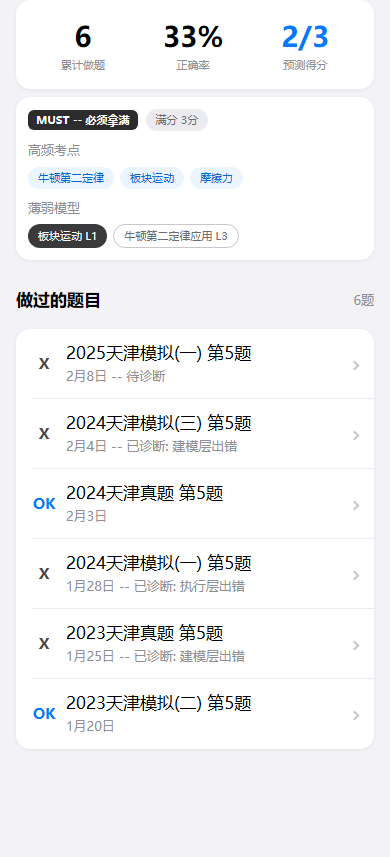

# question-aggregate（单题聚合）

## 设计目的

按题号查看历史表现与薄弱点。

## 路由标识

`questionAggregate`

## 组件树

```text
question-aggregate
├─ top-frame
├─ single-question-dashboard
├─ exam-analysis
└─ question-history-list
```

## 页面格式规范

顶部导航区位于上层，正文从其下方开始排布，禁止正文上移重叠。正文列表与卡片使用自然文档流，内容增多后应推动后续模块下移。适配策略为手机到平板单列自适应，不使用手机壳固定宽高。

## 页面跳转

- 来源: `global-exam` (exam-heatmap / question-type-browser)
- 去向: `question-detail` (question-history-list)

## 页面截图

- 视口 `390x844`


- 视口 `430x932`


- 视口 `834x1194`


---

## 组件详情

### top-frame


- 功能说明: 返回与题号标题。
- 布局契约: 位于页面上方固定区域，不与正文内容重叠。
- 输入/输出: 输入: `pageData.top-frame`。输出: 可触发路由跳转: globalExam。

### single-question-dashboard



- 功能说明: 做题次数、正确率、预测得分。
- 布局契约: 统计卡区域位于内容前段，数值与摘要信息需要稳定对齐。
- 响应式规范: 窄屏自动换行排列卡片，平板维持单列分组不跳层。
- 输入/输出: 输入: `pageData.single-question-dashboard`。输出: 无跨页跳转。

### exam-analysis


- 功能说明: 态度与关联薄弱信息。
- 布局契约: 功能块位于页面主内容区，跟随文档流渲染并保持上下间距一致。
- 响应式规范: 在不同宽度下保持单列结构，允许容器宽度自适应。
- 输入/输出: 输入: `pageData.exam-analysis`。输出: 无跨页跳转。

### question-history-list


- 功能说明: 该题号历史题目列表。
- 布局契约: 列表区采用自然文档流纵向扩展，列表增长后应推动后续区域下移。
- 响应式规范: 在窄屏保持单列；在长屏增加可视条目但不改变信息层级。
- 输入/输出: 输入: `pageData.question-history-list`。输出: 可触发路由跳转: questionDetail。
