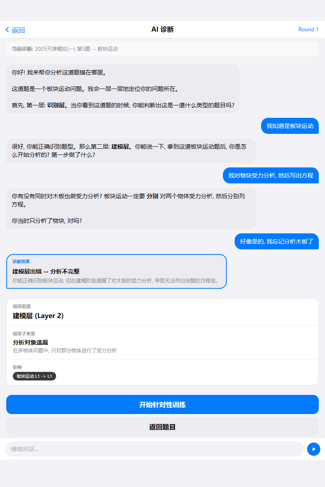

# ai-diagnosis（AI诊断）

## 设计目的

对单题错误进行对话式定位。

## 路由标识

`aiDiagnosis`

## 组件树

```text
ai-diagnosis
├─ top-frame
├─ main-content
└─ action-overlay
```

## 页面格式规范

顶部导航区位于上层，正文从其下方开始排布，禁止正文上移重叠。底部浮层固定贴底，主内容预留底部安全区，避免按钮被遮挡。正文列表与卡片使用自然文档流，内容增多后应推动后续模块下移。适配策略为手机到平板单列自适应，不使用手机壳固定宽高。

## 页面跳转

- 来源: `question-detail` (answer-result) / `index` (recommendation-list)
- 去向: `model-training` (main-content) / `question-detail` (top-frame返回)

## 页面截图

- 视口 `390x844`


- 视口 `430x932`


- 视口 `834x1194`


---

## 组件详情

### top-frame


- 功能说明: 返回与标题。
- 布局契约: 位于页面上方固定区域，不与正文内容重叠。
- 输入/输出: 输入: `pageData.top-frame`。输出: 可触发路由跳转: questionDetail。

### main-content


- 功能说明: 题目引用、诊断对话、结论与行动按钮。
- 布局契约: 对话主体位于主滚动区，需与底部输入区解耦，避免输入条遮挡消息。
- 响应式规范: 窄屏优先消息可读；长屏扩大对话可视高度。
- 输入/输出: 输入: `pageData.main-content`。输出: 可触发路由跳转: modelTraining、questionDetail。

### action-overlay


- 功能说明: 底部浮层交互组件（输入框/FAB/发送），负责关键动作入口。
- 布局契约: 固定贴底显示，需与主内容留出安全区，避免遮挡主操作按钮。
- 响应式规范: 在长屏/平板仍贴底，横向空间增大时输入框优先扩展宽度。
- 输入/输出: 输入: `pageData.action-overlay`。输出: 无跨页跳转。
