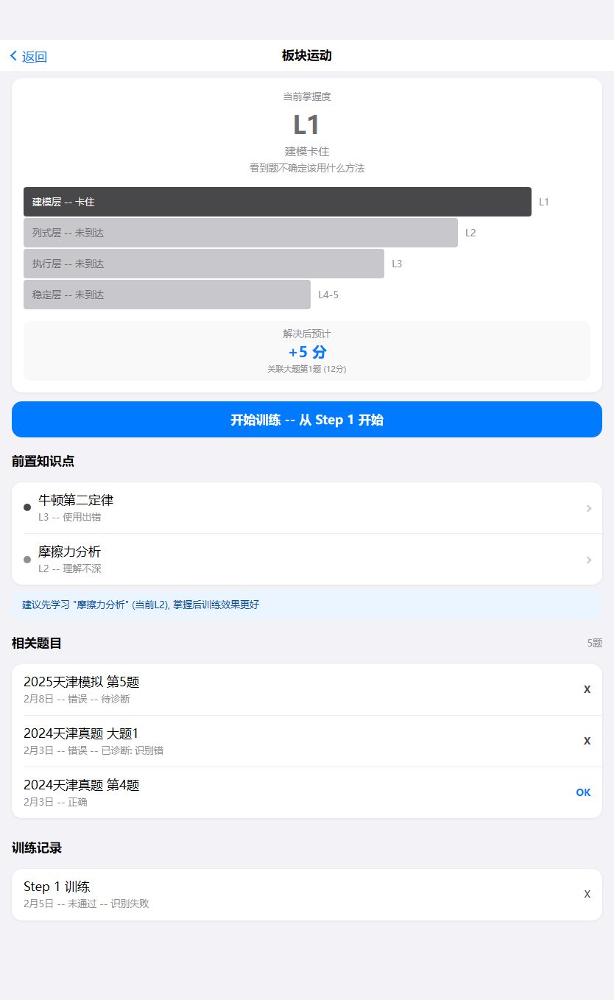
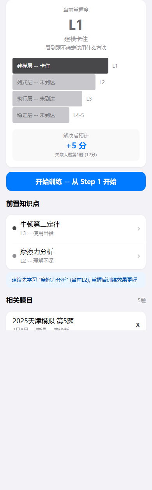

# model-detail（模型详情）

## 设计目的

围绕模型进行训练决策。

## 路由标识

`modelDetail`

## 组件树

```text
model-detail
├─ top-frame
├─ mastery-dashboard
├─ prerequisite-knowledge-list
├─ related-question-list
└─ training-record-list
```

## 页面格式规范

顶部导航区位于上层，正文从其下方开始排布，禁止正文上移重叠。正文列表与卡片使用自然文档流，内容增多后应推动后续模块下移。适配策略为手机到平板单列自适应，不使用手机壳固定宽高。

## 页面跳转

- 来源: `global-model` (model-tree) / `index` / `question-detail` (question-relations)
- 去向: `model-training` (mastery-dashboard) / `knowledge-detail` (prerequisite-knowledge-list) / `question-detail` (related-question-list)

## 页面截图

- 视口 `390x844`


- 视口 `430x932`


- 视口 `834x1194`


---

## 组件详情

### top-frame


- 功能说明: 返回与模型名。
- 布局契约: 位于页面上方固定区域，不与正文内容重叠。
- 输入/输出: 输入: `pageData.top-frame`。输出: 可触发路由跳转: globalModel。

### mastery-dashboard



- 功能说明: 掌握漏斗与训练入口。
- 布局契约: 统计卡区域位于内容前段，数值与摘要信息需要稳定对齐。
- 响应式规范: 窄屏自动换行排列卡片，平板维持单列分组不跳层。
- 输入/输出: 输入: `pageData.mastery-dashboard`。输出: 可触发路由跳转: modelTraining。

### prerequisite-knowledge-list


- 功能说明: 前置知识点与补强建议。
- 布局契约: 列表区采用自然文档流纵向扩展，列表增长后应推动后续区域下移。
- 输入/输出: 输入: `pageData.prerequisite-knowledge-list`。输出: 可触发路由跳转: knowledgeDetail。

### related-question-list


- 功能说明: 关联题目列表。
- 布局契约: 列表区采用自然文档流纵向扩展，列表增长后应推动后续区域下移。
- 输入/输出: 输入: `pageData.related-question-list`。输出: 可触发路由跳转: questionDetail。

### training-record-list


- 功能说明: 训练历史记录。
- 布局契约: 列表区采用自然文档流纵向扩展，列表增长后应推动后续区域下移。
- 输入/输出: 输入: `pageData.training-record-list`。输出: 无跨页跳转。
