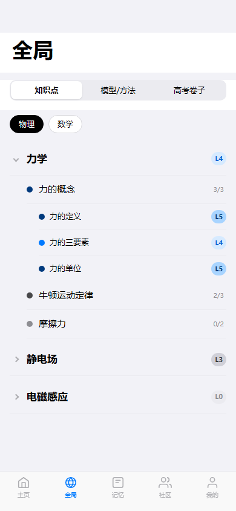
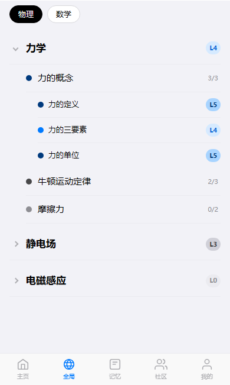

# 任务 03：global-knowledge 全局知识点（已完成 — 验证与补齐）

> 开始前请先阅读 `00_总起说明_每个任务必读.md`

## 任务目标

全局知识点页已基本实现，本任务为验证与补齐。

## 参考资料

- 页面说明：`docs/第二阶段_html转flutter/18个html页面的分别说明文档/03_global-knowledge_全局知识点.md`
- 页面截图：`docs/第一阶段_html细化/html截图验证/global-knowledge/full/global-knowledge__390x844__full.png`
- 组件截图：`docs/第一阶段_html细化/html截图验证/global-knowledge/components/`

## 目标文件

- `echomind_app/lib/features/global_knowledge/global_knowledge_page.dart`
- `echomind_app/lib/features/global_knowledge/widgets/` 下所有组件

## 组件清单

| 组件 | 功能 | 跳转 |
|------|------|------|
| top-frame | 全局标题与子tab（知识点/模型/高考卷） | globalExam, globalModel |
| knowledge-tree | 可折叠知识树（章节/节/知识点） | knowledgeDetail |

## 页面结构

```
PageShell(tabIndex: 1) → ListView [TopFrame, KnowledgeTree]
```

## 输出要求

1. **截图留档**：保存页面效果截图到 `docs/第二阶段_html转flutter/截图验证/03_global-knowledge_全局知识点_完成效果.png`
2. **完成说明**：创建 `docs/第二阶段_html转flutter/18个页面的完成说明文档/03_global-knowledge_全局知识点_完成说明.md`，内容包括：实现的组件列表、与截图的差异说明、路由跳转验证结果、已知问题或遗留项
3. **拉起下一任务**：完成后自动读取 `04_global-model_全局模型.md` 并开始执行下一个页面的工作流

---

# 附录：页面说明文档（global-knowledge 全局知识点）

## 设计目的

全局浏览知识点掌握结构。

## 路由标识

`globalKnowledge`

## 组件树

```text
global-knowledge
├─ top-frame
└─ knowledge-tree
```

## 页面格式规范

顶部导航区位于上层，正文从其下方开始排布，禁止正文上移重叠。正文列表与卡片使用自然文档流，内容增多后应推动后续模块下移。适配策略为手机到平板单列自适应，不使用手机壳固定宽高。

## 页面跳转

- `global-knowledge` <-> `global-model` <-> `global-exam`（顶部tab互切）
- `knowledge-tree` -> `knowledge-detail`

## 页面截图

- 视口 `390x844`


- 视口 `430x932`


- 视口 `834x1194`


---

## 组件详情

### top-frame


- 功能说明: 页面顶栏组件，承载返回、标题和顶部导航语义。
- 布局契约: 位于页面上方固定区域，不与正文内容重叠。
- 超长文本/数字规范: 标题单行省略，避免顶栏高度波动。
- 响应式规范: 不同宽度下保持左右安全边距与点击区域。
- 输入/输出: 输入: `pageData.top-frame`。输出: 可触发路由跳转: globalExam、globalModel。

### knowledge-tree



- 功能说明: 多层可折叠知识树组件，承载章节/节/知识点层级展开收起。
- 布局契约: 树节点使用自然文档流纵向展开，展开后下方模块必须被推移。
- 超长文本/数字规范: 节点标题优先两行截断；超长专业术语允许断词换行。
- 响应式规范: 缩窄时保持缩进层级与点击区域；平板下单列拉伸，不做双列。
- 输入/输出: 输入: `pageData.knowledge-tree`。输出: 可触发路由跳转: knowledgeDetail。
