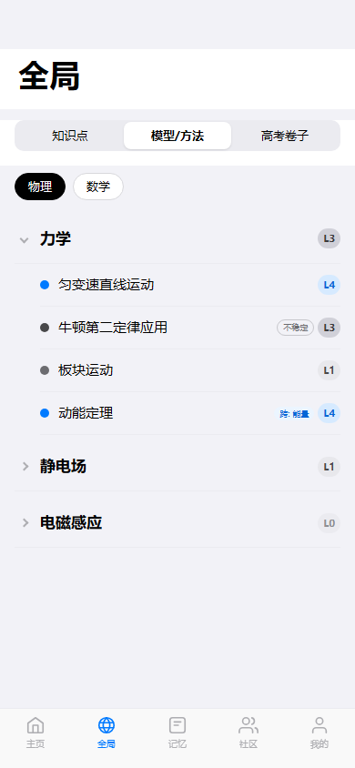

# 任务 04：global-model 全局模型（待实现）

> 开始前请先阅读 `00_总起说明_每个任务必读.md`

## 任务目标

将 global-model 页面从 stub 实现为完整页面。该页面与 global-knowledge 结构高度相似（树形列表），可参考其实现模式。

## 参考资料

- 页面说明：`docs/第二阶段_html转flutter/18个html页面的分别说明文档/04_global-model_全局模型.md`
- 页面截图：`docs/第一阶段_html细化/html截图验证/global-model/full/global-model__390x844__full.png`
- 组件截图：`docs/第一阶段_html细化/html截图验证/global-model/components/`
- 参考已完成页面：`echomind_app/lib/features/global_knowledge/` （结构相似）

## 目标文件

- `echomind_app/lib/features/global_model/global_model_page.dart`
- `echomind_app/lib/features/global_model/widgets/top_frame_widget.dart`
- `echomind_app/lib/features/global_model/widgets/model_tree_widget.dart`

## 工作流

1. 读取页面说明文档，查看全页截图和组件截图
2. 读取 global_knowledge 的实现代码作为参考模式
3. 读取当前 stub 文件
4. 实现 TopFrameWidget：顶部标题 + 三个子tab（知识点/模型/高考卷），当前高亮"模型"
5. 实现 ModelTreeWidget：可折叠模型树，展示模型节点与子问题层级
6. 组装页面
7. 对照截图自检

## 组件清单

| 组件 | 功能 | 跳转 |
|------|------|------|
| top-frame | 全局标题与子tab，当前高亮"模型" | globalExam, globalKnowledge |
| model-tree | 可折叠模型树与子问题层级 | modelDetail |

## 页面结构

```
Scaffold → SafeArea → ListView [TopFrame, ModelTree]
```

## HTML 参考（仅取文案和数据）

- HTML 源码：`html前端——component纯净组件拆解版/pages/global-model/`
- mock 数据：`html前端——component纯净组件拆解版/mock-data/pages/global-model.json`（如存在）

## 输出要求

1. **截图留档**：保存页面效果截图到 `docs/第二阶段_html转flutter/截图验证/04_global-model_全局模型_完成效果.png`
2. **完成说明**：创建 `docs/第二阶段_html转flutter/18个页面的完成说明文档/04_global-model_全局模型_完成说明.md`，内容包括：实现的组件列表、与截图的差异说明、路由跳转验证结果、已知问题或遗留项
3. **拉起下一任务**：完成后自动读取 `05_global-exam_全局高考卷.md` 并开始执行下一个页面的工作流

---

# 附录：页面说明文档（global-model 全局模型）

## 设计目的

全局浏览模型/方法结构。

## 路由标识

`globalModel`

## 组件树

```text
global-model
├─ top-frame
└─ model-tree
```

## 页面格式规范

顶部导航区位于上层，正文从其下方开始排布，禁止正文上移重叠。正文列表与卡片使用自然文档流，内容增多后应推动后续模块下移。适配策略为手机到平板单列自适应，不使用手机壳固定宽高。

## 页面跳转

- `global-knowledge` <-> `global-model` <-> `global-exam`（顶部tab互切）
- `model-tree` -> `model-detail`

## 页面截图

- 视口 `390x844`


- 视口 `430x932`


- 视口 `834x1194`


---

## 组件详情

### top-frame


- 功能说明: 页面顶栏组件，承载返回、标题和顶部导航语义。
- 布局契约: 位于页面上方固定区域，不与正文内容重叠。
- 超长文本/数字规范: 标题单行省略，避免顶栏高度波动。
- 响应式规范: 不同宽度下保持左右安全边距与点击区域。
- 输入/输出: 输入: `pageData.top-frame`。输出: 可触发路由跳转: globalExam、globalKnowledge。

### model-tree


- 功能说明: 多层可折叠模型树组件，承载模型节点与子问题层级。
- 布局契约: 树结构展开后高度自增长，禁止固定高度裁剪内容。
- 超长文本/数字规范: 模型名称支持两行截断，必要时自动换行保留语义。
- 响应式规范: 不同宽度下保留层级缩进与节点间距，避免层级错位。
- 输入/输出: 输入: `pageData.model-tree`。输出: 可触发路由跳转: modelDetail。
