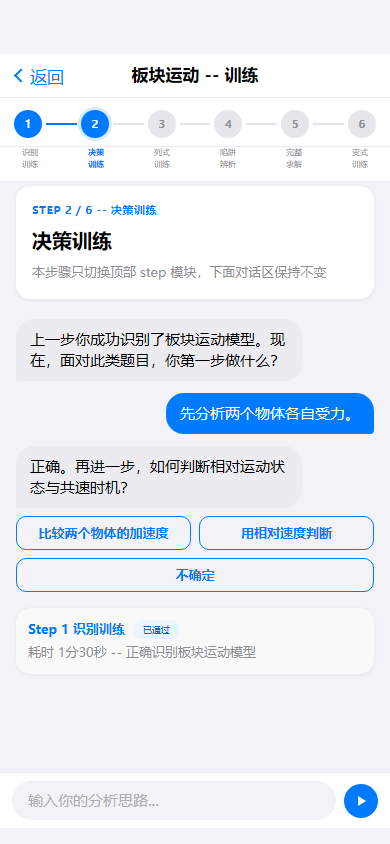
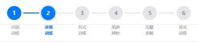

# 任务 12：model-training 模型训练（待实现）

> 开始前请先阅读 `00_总起说明_每个任务必读.md`

## 任务目标

将 model-training 页面从 stub 实现为完整页面。多阶段训练页，含6个步骤卡 + 对话区 + 底部输入框。

## 参考资料

- 页面说明：`docs/第二阶段_html转flutter/18个html页面的分别说明文档/12_model-training_模型训练.md`
- 页面截图：`docs/第一阶段_html细化/html截图验证/model-training/full/model-training__390x844__full.png`
- 组件截图：`docs/第一阶段_html细化/html截图验证/model-training/components/`

## 目标文件

- `echomind_app/lib/features/model_training/model_training_page.dart`
- `echomind_app/lib/features/model_training/widgets/top_frame_widget.dart`
- `echomind_app/lib/features/model_training/widgets/step_stage_nav_widget.dart`
- `echomind_app/lib/features/model_training/widgets/training_dialogue_widget.dart`
- `echomind_app/lib/features/model_training/widgets/action_overlay_widget.dart`
- step-1 ~ step-6 widget 文件（如已存在）

## 组件清单

| 组件 | 功能 | 跳转 |
|------|------|------|
| top-frame | 返回与训练标题 | modelDetail（返回） |
| step-stage-nav | 6阶段导航，点击切换 | 无（页内切换） |
| step-1~6 | 各阶段步骤卡（识别/决策/列式/陷阱/完整求解/变式） | 无 |
| training-dialogue | 固定对话训练区（步骤切换不替换） | 无 |
| action-overlay | 底部输入框 | 无 |

## 页面结构

```
Scaffold → SafeArea → Column [
  TopFrame,
  StepStageNav,
  当前步骤卡（根据选中阶段切换）,
  Expanded(TrainingDialogue),
  ActionOverlay
]
```

## 实现要点

- 页面为 StatefulWidget，维护当前步骤索引
- StepStageNav 为横向可滚动的阶段按钮条
- 切换步骤只替换顶部步骤卡，对话区保持不变
- 6个步骤卡可用一个通用 widget + 不同参数实现，无需6个独立文件

## 输出要求

1. **截图留档**：保存页面效果截图到 `docs/第二阶段_html转flutter/截图验证/12_model-training_模型训练_完成效果.png`
2. **完成说明**：创建 `docs/第二阶段_html转flutter/18个页面的完成说明文档/12_model-training_模型训练_完成说明.md`，内容包括：实现的组件列表、与截图的差异说明、路由跳转验证结果、已知问题或遗留项
3. **拉起下一任务**：完成后自动读取 `13_knowledge-detail_知识点详情.md` 并开始执行下一个页面的工作流

---

# 附录：页面说明文档（model-training 模型训练）

## 设计目的

分阶段完成模型训练闭环。

## 路由标识

`modelTraining`

## 组件树

```text
model-training
├─ top-frame
├─ step-stage-nav
├─ step-1-identification-training
├─ step-2-decision-training
├─ step-3-equation-training
├─ step-4-trap-analysis
├─ step-5-complete-solve
├─ step-6-variation-training
├─ training-dialogue
└─ action-overlay
```

## 页面格式规范

顶部导航区位于上层，正文从其下方开始排布，禁止正文上移重叠。阶段导航为粘性层，切换步骤只替换步骤卡，不重建对话区。底部浮层固定贴底，主内容预留底部安全区，避免按钮被遮挡。适配策略为手机到平板单列自适应，不使用手机壳固定宽高。

## 页面跳转

- 来源: `model-detail` (mastery-dashboard) / `ai-diagnosis` (main-content)
- 返回: `model-detail`

## 页面截图

- 视口 `390x844`


- 视口 `430x932`


- 视口 `834x1194`


---

## 组件详情

### top-frame


- 功能说明: 返回与训练标题。
- 布局契约: 位于页面上方固定区域，不与正文内容重叠。
- 输入/输出: 输入: `pageData.top-frame`。输出: 可触发路由跳转: modelDetail。

### step-stage-nav



- 功能说明: 阶段导航组件，用于切换学习/训练步骤状态。
- 布局契约: 顶部粘性区域，切换步骤仅替换步骤卡，不重建对话区。
- 响应式规范: 窄屏允许横向滚动或压缩间距，保持可点击性。
- 输入/输出: 输入: `pageData.step-stage-nav`。输出: 页内状态切换。

### training-dialogue


- 功能说明: 固定对话训练区（步骤切换不替换该区域）。
- 布局契约: 对话主体位于主滚动区，需与底部输入区解耦，避免输入条遮挡消息。
- 响应式规范: 窄屏优先消息可读；长屏扩大对话可视高度。
- 输入/输出: 输入: `pageData.training-dialogue`。输出: 无跨页跳转。

### step-1 ~ step-6 步骤卡

| 步骤 | 截图 | 状态截图 |
|------|------|----------|
| step-1 识别训练 |  |  |
| step-2 决策训练 |  |  |
| step-3 列式训练 |  |  |
| step-4 陷阱辨析 |  |  |
| step-5 完整求解 |  |  |
| step-6 变式训练 |  |  |

- 布局契约: 功能块位于页面主内容区，跟随文档流渲染并保持上下间距一致。
- 交互模型: 只切换顶部 step 卡片，下面对话区保持不变。

### action-overlay


- 功能说明: 底部浮层交互组件（输入框/FAB/发送）。
- 布局契约: 固定贴底显示，需与主内容留出安全区。
- 输入/输出: 输入: `pageData.action-overlay`。输出: 无跨页跳转。
