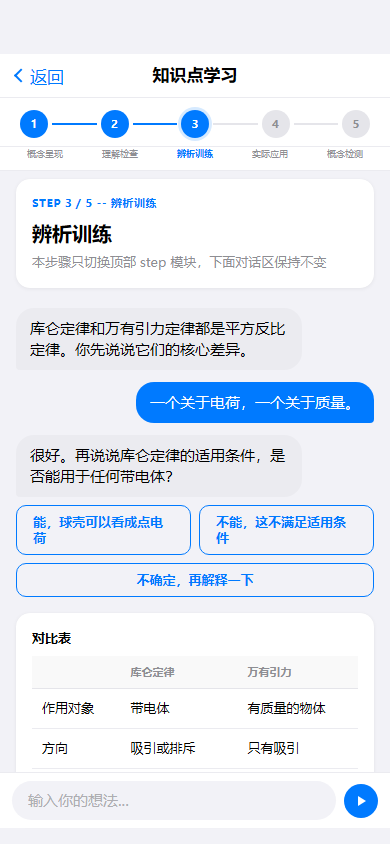
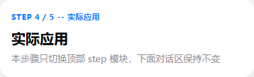

# 任务 14：knowledge-learning 知识点学习（待实现）

> 开始前请先阅读 `00_总起说明_每个任务必读.md`

## 任务目标

将 knowledge-learning 页面从 stub 实现为完整页面。5阶段学习导航 + 对话区 + 底部输入框。

## 参考资料

- 页面说明：`docs/第二阶段_html转flutter/18个html页面的分别说明文档/14_knowledge-learning_知识点学习.md`
- 页面截图：`docs/第一阶段_html细化/html截图验证/knowledge-learning/full/knowledge-learning__390x844__full.png`
- 组件截图：`docs/第一阶段_html细化/html截图验证/knowledge-learning/components/`
- 参考：model-training 页面结构高度相似

## 目标文件

- `echomind_app/lib/features/knowledge_learning/knowledge_learning_page.dart`
- `echomind_app/lib/features/knowledge_learning/widgets/top_frame_widget.dart`
- `echomind_app/lib/features/knowledge_learning/widgets/step_stage_nav_widget.dart`
- `echomind_app/lib/features/knowledge_learning/widgets/action_overlay_widget.dart`
- step-1 ~ step-5 及 learning-dialogue widget 文件

## 组件清单

| 组件 | 功能 | 跳转 |
|------|------|------|
| top-frame | 返回与标题 | knowledgeDetail（返回） |
| step-stage-nav | 5阶段导航（概念呈现/理解检查/辨析训练/实际应用/概念检测） | 无（页内切换） |
| step-1~5 | 各阶段步骤卡 | 无 |
| learning-dialogue | AI学习对话区（步骤切换不替换） | 无 |
| action-overlay | 底部输入框 | 无 |

## 页面结构

```
Scaffold → SafeArea → Column [
  TopFrame,
  StepStageNav,
  当前步骤卡,
  Expanded(LearningDialogue),
  ActionOverlay
]
```

## 实现要点

- 与 model-training 结构一致，5个步骤卡可用通用 widget + 不同参数
- 切换步骤只替换顶部步骤卡，对话区保持不变

## 输出要求

1. **截图留档**：保存页面效果截图到 `docs/第二阶段_html转flutter/截图验证/14_knowledge-learning_知识点学习_完成效果.png`
2. **完成说明**：创建 `docs/第二阶段_html转flutter/18个页面的完成说明文档/14_knowledge-learning_知识点学习_完成说明.md`，内容包括：实现的组件列表、与截图的差异说明、路由跳转验证结果、已知问题或遗留项
3. **拉起下一任务**：完成后自动读取 `15_prediction-center_预测中心.md` 并开始执行下一个页面的工作流

---

# 附录：页面说明文档（knowledge-learning 知识点学习）

## 设计目的

知识点分阶段学习与讲解。

## 路由标识

`knowledgeLearning`

## 组件树

```text
knowledge-learning
├─ top-frame
├─ step-stage-nav
├─ step-1-concept-present
├─ step-2-understanding-check
├─ step-3-discrimination-training
├─ step-4-practical-application
├─ step-5-concept-test
└─ action-overlay
```

## 页面格式规范

顶部导航区位于上层，正文从其下方开始排布，禁止正文上移重叠。阶段导航为粘性层，切换步骤只替换步骤卡，不重建对话区。底部浮层固定贴底，主内容预留底部安全区，避免按钮被遮挡。适配策略为手机到平板单列自适应，不使用手机壳固定宽高。

## 页面跳转

- 来源: `knowledge-detail` (mastery-dashboard)
- 返回: `knowledge-detail`

## 页面截图

- 视口 `390x844`


- 视口 `430x932`


- 视口 `834x1194`


---

## 组件详情

### top-frame


- 功能说明: 返回与标题。
- 布局契约: 位于页面上方固定区域，不与正文内容重叠。
- 输入/输出: 输入: `pageData.top-frame`。输出: 可触发路由跳转: knowledgeDetail。

### step-stage-nav


- 功能说明: 5阶段导航，支持点击切换。
- 布局契约: 顶部粘性区域，切换步骤仅替换步骤卡，不重建对话区。
- 响应式规范: 窄屏允许横向滚动或压缩间距，保持可点击性。
- 输入/输出: 输入: `pageData.step-stage-nav`。输出: 页内状态切换。

### learning-dialogue


- 功能说明: AI学习对话区（步骤切换不替换该区域）。
- 布局契约: 对话主体位于主滚动区，需与底部输入区解耦。
- 响应式规范: 窄屏优先消息可读；长屏扩大对话可视高度。

### step-1 ~ step-5 步骤卡

| 步骤 | 截图 | 状态截图 |
|------|------|----------|
| step-1 概念呈现 |  |  |
| step-2 理解检查 |  |  |
| step-3 辨析训练 |  |  |
| step-4 实际应用 |  |  |
| step-5 概念检测 |  |  |

- 布局契约: 功能块位于页面主内容区，跟随文档流渲染并保持上下间距一致。
- 交互模型: 只切换顶部 step 卡片，下面对话区保持不变。

### action-overlay


- 功能说明: 底部浮层交互组件（输入框/FAB/发送）。
- 布局契约: 固定贴底显示，需与主内容留出安全区。
- 输入/输出: 输入: `pageData.action-overlay`。输出: 无跨页跳转。
