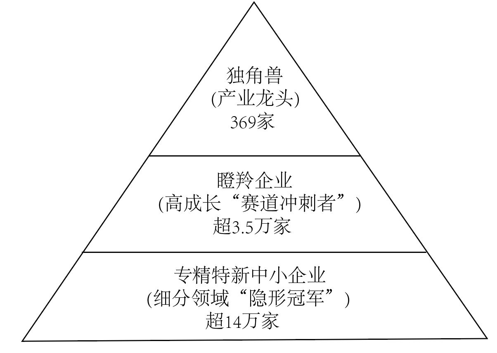
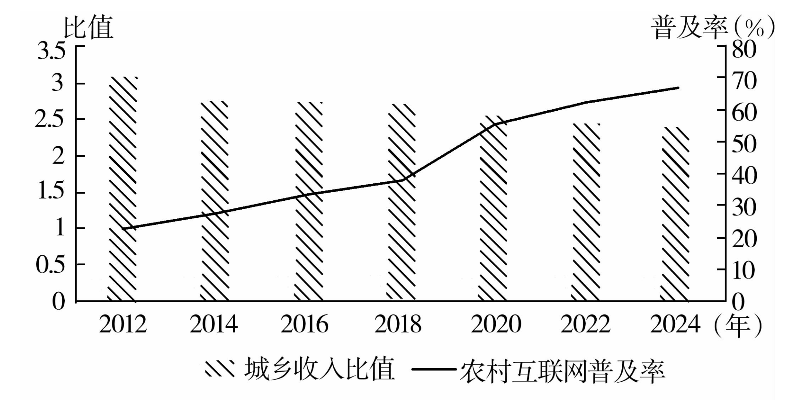

**重庆市2025年普通高等学校招生统一考试政治试题**

**一、选择题。**

历史是国家和人类的传记。阅读材料，回答1～3题。

1\. 马克思、恩格斯指出，大工业“首次开创了世界历史，因为它使每个文明国家以及这些国家中的每一个人的需要的满足都依赖于整个世界，因为它消灭了各国以往自然形成的闭关自守的状态。”习近平总书记强调，“我们要站在世界历史的高度审视当今世界发展趋势和面临的重大问题……坚持互利共赢的开放战略，不断拓展同世界各国的合作”。下列说法正确的是（ ）

①“大工业”是推动世界历史进步的根本动力

②开放合作、互利共赢是世界历史发展的必然要求

③当今推动经济全球化的主要力量依然是美国等西方国家

④马克思恩格斯世界历史理论揭示了经济全球化的发展趋势

A. ①③ B. ①④ C. ②③ D. ②④

2\. 西方发达资本主义国家先后经历自由竞争资本主义和垄断资本主义两个阶段。列宁指出，“现在已经不是小企业同大企业、技术落后企业同技术先进的企业进行竞争。现在已经是垄断者在扼杀那些不屈服于垄断、不屈服于垄断的压迫和摆布的企业了。”下列说法正确的是（ ）

①垄断资本主义以通过技术进步推动社会生产力发展为根本目的

②扼杀竞争对手以巩固垄断地位，是垄断资本追逐高额利润的重要手段

③从自由竞争发展到垄断，并未改变资本主义向社会主义过渡的历史趋势

④垄断资本主义国家代表的是大垄断企业的利益，而非资产阶级的整体利益

A ①③ B. ①④ C. ②③ D. ②④

3\. 今年是世界反法西斯战争胜利暨联合国成立80周年。80年来，国际形势变乱交织，各种挑战和风险不断涌现。今天，人类又一次站在了团结还是分裂、对话还是对抗、共赢还是零和的十字路口。历史和现实启示我们（ ）

①不公平、不合理的国际规则和机制是国家间冲突的根源

②国际形势越是变乱交织，越要维护以联合国为核心的国际体系

③要团结一切爱好和平的国家和人民，反对霸权主义和强权政治

④发展是和平的基础，只有推动世界经济发展才能根除分裂与对抗

A. ①② B. ①④ C. ②③ D. ③④

面对外部压力加大、内部困难增多的复杂严峻形势，国务院在向十四届全国人大三次会议提交的政府工作报告中，提出一系列重要举措。阅读材料，回答4~7题。

4\. 这些举措有加有减（见下表），“加”的暖心，“减”的舒心。这体现了政府（ ）

|                          |                  |
|:------------------------ |:---------------- |
| 加                        | 减                |
| 扩大高中阶段教育学位供给             | 坚决防止违规异地执法和趋利性执法 |
| 强化关键核心技术攻关和前沿性、颠覆性技术研发   | 综合整治“内卷式”竞争      |
| 扩大健康、养老、助残、托幼、家政等多元化服务供给 | 实施降低全社会物流成本专项行动  |
| ……                       | ……               |

①“加”着眼于为人民谋幸福，增加民生等领域政策供给

②“减”旨在依据权责法定的原则，减少不当履职行为

③积极推进政务公开，保障人民群众的知情权和监督权

④履行公共服务、市场监管等职能，为经济社会发展保驾护航

A. ①③ B. ①④ C. ②③ D. ②④

5\. 政府工作报告提出，梯度培育创新型企业，促进专精特新中小企业发展壮大，支持独角兽企业、瞪羚企业发展，让更多企业在新领域新赛道跑出加速度。下图展示了2024年这三类创新型企业“金字塔”式发展现状。由此可知（ ）

①梯度培育源于创新型企业成长阶段的递进性

②创新型企业均需制定“独角兽”的经营战略

③创新型企业发展有赖于要素优势互补和有序竞争

④“金字塔”反映了创新型企业市场准入的差异性

A. ①③ B. ①④ C. ②③ D. ②④

6\. 政府工作报告提出，创新和丰富消费场景，加快数字、智能等新型消费发展。“谷子（Goods）经济”是指围绕热门动漫、游戏等衍生出新型消费业态，涉及海报、徽章、手办等周边商品。下表展示了我国“谷子经济”的发展历程。由此可知（ ）

|     |                                     |                                         |
|:--- |:----------------------------------- |:--------------------------------------- |
|     | 2017-2022年                          | 2023年以来                                 |
| 需求  | Z世代（1995-2010年）“谷子”消费意愿强，成为“谷子”消费主力 | 对兴趣、悦已等情绪价值需要的满足成为Z世代消费新取向，“吃谷”“炒谷”现象流行 |
| 供给  | 国产原创动漫、游戏崛起，助推“谷子”品类扩容              | 动漫、游戏产品生命周期缩短，“谷子”加速迭代                  |

①“谷子”的价格由其迭代速度决定

②“谷子经济”能释放多样化、差异化消费潜力

③数字文化创新推动“谷子”品类的扩容与迭代

④满足情绪价值需要的“谷子”消费是非理性的

A. ①③ B. ①④ C. ②③ D. ②④

7\. 政府工作报告提出，千方百计推动农业增效益、农村增活力、农民增收入。下图描述了2012～2024年农村互联网普及率与城乡收入比的变化。数字经济影响城乡收入差距的传导路径是（ ）

注：城乡收入比=城镇居民家庭人均可支配收入/农村居民家庭人均纯收入

①降低城乡收入比

②提高农村互联网普及率

③促进乡村特色产业延链增效

④推动城乡间生产要素双向流动

A. ②→④→③→① B. ②→③→④→① C. ④→③→②→① D. ④→②→③→①

全过程人民民主的制度程序和参与形式在实践中不断完善。阅读材料，回答8～9题。

8\. 依托人大代表“家站点”这一履职平台，多地人大组织人大代表广泛收集群众意见，建立情况详实的“民生题库”。组织政府部门负责人走进“家站点”汇报相关工作、解读最新政策、听取人大代表和群众的建议和要求。由此可知（ ）

①人大代表“家站点”是保障人大代表行使职权的专门机构

②政府保持与人大代表密切联系，提升自身工作的实效性

③人大代表保持与人民群众密切联系，提升自身履职的针对性

④政府部门负责人走进人大代表“家站点”，推进执法程序规范化

A. ①② B. ①④ C. ②③ D. ③④

9\. 某市政协创新打造“百姓提案”工作机制（见下图）。该做法（ ）

①体现了政协扎根于民、问计于民、履职为民的人民底色

②赋予人民群众政协提案权，丰富了人民群众的民主权利

③扩大了人民群众有序政治参与，有利于提升公民的政治素质

④表明“百姓提案”转化为政协提案才能解决群众关心的问题

A ①③ B. ①④ C. ②③ D. ②④

人类对机器人的想象和探索历史悠久。阅读材料，回答10～12题。

《列子》记载：周穆王曾遇奇人偃师，其所造人偶形似常人，能随人操纵而俯仰走跑，合律而歌，应节而舞，“千变万化，惟意所适”。文艺复兴时期，意大利首次造出能完成简单动作的人形机械。20世纪以来，国外先后造出能双足行走、有面部表情的人形机器人。2024年，中国造出全球首台运动性能卓越的电驱动全尺寸人形机器人。

10\. 对材料理解正确的是（ ）

①《列子》的记载表明，中国古代很早就有了机器人文化的萌芽

②由于生产力水平低下，古人对人偶的设想和制造不具备现实基础

③“惟意所适”夸大了意识活动的能动性，犯了唯意志主义错误

④无论是对人偶的设想还是制造，都体现了古人的探索创新精神

A. ①③ B. ①④ C. ②③ D. ②④

11\. 关于机器人研制，说法正确的是（ ）

①依照人类形象研制机器人，体现了以人为本的价值立场

②人类的生产实践推动机器人从观念性存在变为现实性存在

③从人偶到人形机器人的跃升历程，说明质变比量变更重要

④在机器人的研制历程中，中华民族贡献了重要的智慧力量

A. ①② B. ①③ C. ②④ D. ③④

12\. 20世纪40年代，美国作家阿西莫夫提出“机器人学三定律”：（1）机器人不得伤害人，或坐视人受到伤害；（2）除非违背第一定律，机器人必须服从人的命令；（3）在不违背第一及第二定律条件下，机器人必须保护自己。80年代，他又补充“机器人学第零定律”：机器人不得伤害人类的整体利益，或坐视人类整体利益受到伤害。下列说法正确的是（ ）

①人和机器人的矛盾，贯穿于人类社会发展过程的始终

②“机器人学三定律”的提出深刻揭示了自然界的客观规律

③“机器人学第零定律”的补充，启示机器人研发要不断完善价值取向

④机器人研发与应用的实践，不断深化着人们对人与机器人关系的认知

A. ①② B. ①③ C. ②④ D. ③④

人类最终会否被人工智能取代？阅读材料，回答13～14题。

有人以Deep Seek的口吻，答曰：想象你站在敦煌莫高窟的洞穴中，对着墙壁深深呐喊。墙壁会将你的喊声折射成绵延回音，甚至因洞窟结构而产生奇妙的混音效果。但墙壁本身并不理解：你喊的是诗句还是俚语，声波承载的是喜悦还是悲伤。我的“强大”不过是人类文明千年积沙成塔的“回声”，而你才是那个赋予“回声”意义的朝圣者。

13\. 关于“回声”，说法正确的是（ ）

①“回声”表明人工智能不仅能智慧处理人类信息，还能真实反映客观现实

②“回声”之奇妙，既说明人工智能自主意识的强大，亦说明人类智慧的伟大

③“赋予‘回声’意义”体现人类活动的社会性，凸显人类意识的主观能动性

④“千年积沙成塔的‘回声’”，表明人工智能是人类文明长期累积的智慧结晶

A. ①② B. ①④ C. ②③ D. ③④

14\. 对材料分析正确的是（ ）

①对人工智能取代人类的担忧，体现了提问者的超前思维

②对“人类最终会否被人工智能取代”的回答，主要运用了抽象思维

③回答者将人工智能的“强大”类比为人类文明千年积沙成塔的“回声”

④运用演绎推理可知：没有人类文明的伟大，就没有人工智能的“强大”

A. ①② B. ①④ C. ②③ D. ③④

2022年实施的《汽车驾驶自动化分级》将驾驶自动化分为L0到L5六个等级。其中，L0、L1、L2为驾驶辅助，驾驶主体为驾驶人；L3、L4、L5为自动驾驶，当功能激活时，驾驶主体是系统。当前，国内量产汽车最高仅达L2。阅读材料，回答15～16题。

15\. 关于汽车厂商的营销宣传，说法正确的是（ ）

①贬低竞争对手夸大自家汽车的自动化水平，侵害了消费者自主选择权

②某款汽车的自动化水平接近L3，“L2.9”的宣传不会侵害消费者知情权

③“解放双手”“开智驾可睡觉”等宣传语会导致消费者盲信，侵害了消费者知情权

④厂商应避免夸大驾驶自动化水平，并提示风险，以免侵害消费者安全消费的权利

A. ①② B. ①④ C. ②③ D. ③④

16\. 驾驶人在使用驾驶自动化系统时，确实避免了一些车祸的发生，但也存在发生交通事故的情形。如交通事故纯粹因系统缺陷导致，关于汽车生产厂商责任，说法正确的是（ ）

A. 只有生产汽车时有过错，厂商才承担责任

B. 不管生产汽车时有没有过错，厂商都应承担责任

C. 如能证明生产汽车时没有过错，厂商就无须承担责任

D. 不管生产汽车时有没有过错，厂商都应与驾驶人共同承担责任

**二、非选择题。**

17\. 千百年来，中华民族不信邪、不怕鬼，面对困境、逆境，自强不息阅读材料，回答问题。

材料一 1946年，毛泽东同志在和美国记者安娜·路易斯·斯特朗的谈话中指出：“一切反动派都是纸老虎。看起来，反动派的样子是可怕的，但是实际上并没有什么了不起的力量。从长远的观点看问题，真正强大的力量不是属于反动派，而是属于人民。”“希特勒不是曾经被人们看作很有力量的吗？但是历史证明了他是一只纸老虎。墨索里尼也是如此，日本帝国主义也是如此。”

材料二 2008年国际金融危机后，发达国家纷纷实施“再工业化”战略，美国提出“先进制造业国家战略”，德国提出“工业4.0”，法国提出“新工业计划”。中国于2015年提出“中国制造2025”战略，历经十年砥砺奋斗，发展成就显著。据彭博社统计，在“中国制造2025”相关的13个关键领域中，中国在5个领域全球领先、8个领域具有全球竞争力。与西方国家相比，只有中国实现了预期战略目标。

材料三 随着新一轮科技革命和产业变革深入发展，高技术制造业日益成为大国博弈、国际产业竞争的焦点。下图描述了2015~2024年世界三大制造业国家（中国、美国、德国）制造业出口额全球占比和高技术制造业在全球价值链中的位置指数。

注：位置指数衡量一国高技术制造业在全球分工中的相对位置。位置指数高，说明一国高技术制造业更多通过供应中间品参与全球分工；位置指数低，说明一国高技术制造业更多通过进口中间品并组装成最终消费品参与全球分工。

（1）指出材料一中毛泽东同志得出“一切反动派都是纸老虎”论断所运用的推理方法，并以此论断为大前提，针对发动科技战、关税战、贸易战的美国政府构建一个正确的三段论，进而说明当下我们应对科技战、关税战、贸易战的正确态度。

（2）结合材料二，运用政党和国家相关知识，从中西比较的视角，分析为什么只有中国成功实现了预期战略目标。

（3）根据上图，概述2015~2024年中国制造业在全球的地位。

（4）结合材料三，分析我国应如何提升高技术制造业的全球分工位置，以进一步推进制造强国建设。

（5）发展高技术制造业是应对当前科技战、关税战、贸易战，推动高质量发展的关键。若要制定《高技术制造业中长期发展规划》，请提两条原则性建议，并分别说明哲学依据。

18\. 阅读材料，回答问题。

互联网时代，手机APP便利了人们的生产生活，但侵害用户权益的问题也日益凸显。手机APP超范围强制收集用户“画像”信息；不仅弹出用户聊天时提到的商品或服务，还将用户点赞过的内容、打过的游戏、刷过的视频、甚至购物车里的商品，推送给他人……这些行为给用户带来困扰，甚至财产损失。截至2024年底，工信部已通报45批侵害用户权益的手机APP。

结合材料，运用《法律与生活》相关知识，分析手机APP经营者应如何维护用户的人身权益。
