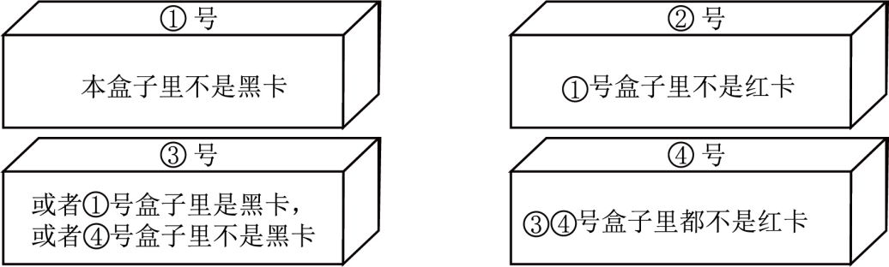

**2025年1月浙江省普通高校选考科目考试**

**思想政治**

**选择题部分**

**一、选择题I（本大题共17小题，每小题2分，共34分。每小题列出的四个备选项中只有一个是符合题目要求的，不选、多选、错选均不得分）**

1\. 恩格斯将人类历史划分为获取现成的天然产物的蒙昧时代，学会靠人的活动来增加天然产物生产的方法的野蛮时代，以及学会对天然产物进一步加工的文明时代。这一论断（ ）

①描绘了阶级社会的不同形态 ②可用于佐证生产力是社会发展的动力

③描述了生产关系变革的历史过程 ④把人对自然的改造能力作为划分社会发展阶段的依据

A. ①② B. ①③ C. ②④ D. ③④

【答案】C

【解析】

【详解】①：“获取现成天然产物的蒙昧时代”指的是原始社会，而原始社会不属于阶级社会，①排除。

②：恩格斯的论断强调了人类通过活动增加天然产物生产的方法和对天然产物进一步加工的能力，这反映了生产力的发展，②正确。

③：恩格斯的论断主要描述的是生产力发展的不同阶段，而不是生产关系的变革过程，③排除。

④：恩格斯根据人类对自然界的改造能力划分了不同的历史阶段，即蒙昧时代、野蛮时代和文明时代。这表明他把人对自然的改造能力作为划分社会发展阶段的标准，④正确。

故本题选C。

2\. 某校以“重温红色历史、感受时代巨变”为主题开展研学活动。对应参观地点，研学结语表述正确的是（ ）

<table style="width:85%;">
<colgroup>
<col style="width: 42%" />
<col style="width: 42%" />
</colgroup>
<tbody>
<tr>
<td style="text-align: left;">
①参观地点：中共一大会址

结语：中国共产党的诞生深刻改变了中国人民的命运，我们要坚定不移听党话、跟党走。
</td>
<td style="text-align: left;">
②参观地点：兰考县焦裕禄烈士陵园

结语：焦裕禄带领兰考人民改造盐碱地，助力实现中华民族有史以来最为广泛而深刻的社会变革。
</td>
</tr>
<tr>
<td style="text-align: left;">
③参观地点：小岗村“大包干”纪念馆

结语：小岗村村民发挥首创精神，开启了改革开放新时期。
</td>
<td style="text-align: left;">
④参观地点：“精准扶贫”首倡地十八洞村

结语：打赢脱贫攻坚战，为实现全体人民共同富裕准备了条件。
</td>
</tr>
</tbody>
</table>

A. ①③ B. ①④ C. ②③ D. ②④

【答案】B

【解析】

【详解】①：中共一大会址是中国共产党成立的地方，中国共产党的成立深刻改变了中国人民的命运，因此我们要坚定不移听党话、跟党走，①正确。

②：社会主义制度确立实现了中华民族有史以来最为广泛而深刻的社会变革，而不是焦裕禄带领兰考人民改造盐碱地，②排除。

③：小岗村是中国农村改革的重要发源地，而党的十一届三中全会开启了改革开放和社会主义现代化建设新时期，③排除。

④：十八洞村作为“精准扶贫”的首倡地，在脱贫攻坚战中起到了示范作用，为全体人民共同富裕的目标做出了贡献，④正确。

故本题选B。

3\. 面对改革攻坚期更为复杂的问题，我们党将“破立并举、先立后破”作为推进改革的重要方略。“先立”注重系统集成，“后破”强调问题导向。立城乡融合发展之制，破城乡二元结构之弊；立清风正气，破“四风”顽疾……材料表明（ ）

①进一步全面深化改革需要智慧和勇气

②进一步全面深化改革需要发扬伟大斗争精神

③把制度优势转化为治理效能是改革的出发点

④我国的改革是从经济领域向其他领域渐次展开的

A. ①② B. ①③ C. ②④ D. ③④

【答案】A

【解析】

【详解】①②：面对改革攻坚期更为复杂的问题，我们党将“破立并举、先立后破”作为推进改革的重要方略，这表明进一步全面深化改革需要智慧和勇气，需要发扬伟大斗争精神，处理各种挑战和困难，①②正确。

③：把制度优势转化为治理效能是改革过程中的一个重要任务，而不是出发点，‌改革的出发点是以人民为中心，促进社会公平正义、增进人民福祉，③排除。

④：材料中并没有提到改革是从经济领域向其他领域渐次展开的，而是强调了“破立并举、先立后破”的改革方略，④排除。

故本题选A。

4\. 习近平总书记指出：“当代中国的伟大社会变革，不是简单延续我国历史文化的母版，不是简单套用马克思主义经典作家设想的模板，不是其他国家社会主义实践的再版，也不是国外现代化发展的翻版。”下列选项中，与上述论断的主旨相符的是（ ）

①中国式现代化是一种全新的人类文明形态

②争取民族独立、人民解放是近代中国人民的历史任务

③农村包围城市、武装夺取政权是党领导人民开创的革命新道路

④中国特色社会主义始终坚持科学社会主义的基本原则

A. ①③ B. ①④ C. ②③ D. ②④

【答案】B

【解析】

【详解】①：题干观点强调了当代中国的社会变革具有独特性，中国式现代化是一种全新的人类文明形态，说明中国式现代化不照搬其他模式，走出了自己的独特道路，创造了全新的人类文明形态，与题干相符，①正确。

②：该项说的是近代中国的历史任务，而题干主要论述当代中国社会变革的独特性，②与题意不符。

③：农村包围城市、武装夺取政权，这是中国共产党在革命时期开创的新道路，与题干“当代中国的社会变革”的时间范围不相符，③排除。

④：中国特色社会主义始终坚持科学社会主义的“基本原则”，说明并不是简单套用马克思主义经典作家设想的模板，体现了中国社会变革的独特性与自主性，④正确。

故本题选B。

5\. 救亡图存的年代，一群有理想的青年投身革命洪流；改革开放新时期，青年发出“团结起来，振兴中华”的时代强音；新时代，“到祖国最需要的地方去”成为众多青年的自觉行动。这表明（ ）

①青年人才是建设现代化强国的关键支撑

②青年的理想信念关乎国家和民族的未来

③国家的支持是青年成长成才的保障

④中国梦的实现需要一代代青年的接续奋斗

A. ①③ B. ①④ C. ②③ D. ②④

【答案】D

【解析】

【详解】①：中国梦归根到底是人民的梦，必须紧紧依靠人民来实现，建设现代化强国需要各方面人才的共同努力，不仅仅是青年人才，①排除。

②：从救亡图存年代青年投身革命，到改革开放新时期青年发出“团结起来，振兴中华”的强音，再到新时代青年“到祖国最需要的地方去”，可以看出不同时代青年的理想信念推动着国家和民族的发展，青年的理想信念关乎国家和民族的未来，②正确。

③：材料强调不同时代青年为国家和民族的奋斗，没有体现国家对青年成长成才的支持，③不符合题意。

④：不同时代的青年都在为实现国家的目标而努力奋斗，从救亡图存到改革开放再到新时代，中国梦的实现正是需要一代代青年的接续奋斗，④正确。

故本题选D。

6\. 当前，新技术革命风起云涌，催生出许多新行业和新业态，让生产生活变得更加自动化、智能化，对教育、医疗、养老等方面的影响也日益深化。新技术革命（ ）

①让教育失去公共产品属性 ②必然导致各种就业岗位数量减少

③提高了劳动生产率 ④有助于加快推进新型工业化建设

A. ①② B. ①④ C. ②③ D. ③④

【答案】D

【解析】

【详解】①：教育的公共产品属性‌是指教育作为一种服务或产品，具有非排他性和非竞争性的特征，是由其本身的社会功能和价值决定的，旨在提高国民素质、促进社会公平和发展。新技术革命虽然会改变教育的方式和手段，但不会改变教育作为公共产品的本质属性，它依然是为了满足社会大众的共同需求，由政府或社会力量提供的具有非排他性和非竞争性的产品，①错误。

②：新技术革命的出现，让生产生活变得更加自动化、智能化，确实会使一些传统岗位受到冲击。然而，新技术革命同时也催生了大量新的就业岗位。所以不能简单地认为新技术革命必然导致各种就业岗位数量减少，②错误。

③：新技术革命让生产生活变得更加自动化、智能化，有助于优化资源配置，提高劳动生产率，③正确。

④：新型工业化建设强调科技含量高、经济效益好、资源消耗低、环境污染少、人力资源优势得到充分发挥。新技术革命为新型工业化提供了强大的技术支撑，实现了生产过程的智能化、信息化，有助于加快推进新型工业化建设，④正确。

故本题选D。

7\. 近年来，随着电商迅猛发展，实体零售企业生存压力加大，部分实体零售巨头面临亏损、闭店等问题。然而，某实体超市却逆势“出圈”，生意火爆。媒体总结其模式成功的原因主要有：重视产品质量和员工福利，与消费者建立了信任关系。由此可见（ ）

①诚信经营积累的信誉是企业的无形资产 ②政府应把这种成功的商业模式加以推广

③该零售企业生意火爆是消费者选择的结果 ④只要改善员工福利，就能增强企业竞争力

A. ①③ B. ①④ C. ②③ D. ②④

【答案】A

【解析】

【详解】①：实体超市重视产品质量和员工福利，与消费者建立了信任关系，从而逆势“出圈”，生意火爆。这表明企业积累起来的信誉能够吸引消费者，为企业带来效益，是企业的无形资产，①正确。

②：材料强调市场在该实体超市生意火爆中的作用，未涉及政府，②排除。

③：该超市因为与消费者建立信任关系，消费者认可其经营模式和产品服务，才使得超市生意火爆，体现出该零售企业生意火爆是消费者选择的结果，③正确。

④：“只要改善员工福利，就能增强企业竞争力”说法过于绝对，改善员工福利是增强企业竞争力的充分条件，而不是必要条件，④排除。

故本题选A。

8\. 下表是2023年我国对部分国家（地区）货物进出口金额及增长速度

|       |         |          |         |          |
|:----- |:------- |:-------- |:------- |:-------- |
| 国家/地区 | 出口额（亿元） | 比上年增长（%） | 进口额（亿元） | 比上年增长（%） |
| 欧盟    | 35226   | -5.3     | 19833   | 4.6      |
| 美国    | 35198   | -8.1     | 11528   | -1.8     |
| 日本    | 11076   | -3.5     | 11309   | -7.9     |
| 俄罗斯   | 7823    | 53.9     | 9093    | 18.6     |
| 印度    | 8279    | 6.5      | 1301    | 12.2     |
| 南非    | 1661    | 4.4      | 2245    | 3.7      |

数据来源：国家统计局《中华人民共和国2023年国民经济和社会发展统计公报》

出现上述现象的原因有（ ）

①世界经济复苏乏力，全球产业链供应链深刻调整

②单边主义和贸易保护主义抬头，多边贸易体制已失效

③我国不断扩大服务业开放，深化服务贸易创新发展

④国际格局复杂演变，供给端和需求端出现新变化

A. ①② B. ①④ C. ②③ D. ③④

【答案】B

【解析】

【详解】①④：材料中的数据主要反映2023年我国对部分国家（地区）货物进出口金额及增长速度的变化，通过对比发现，我国对欧盟、美国和日本的货物进出口增长速度有所下降，对俄罗斯、印度和南非的货物进出口增长速度有所上升，这是因为世界经济复苏乏力，全球产业链供应链深刻调整，以及国际格局复杂演变，供给端和需求端出现新变化等因素，各国出于各自国家利益考虑，影响到我国的外贸情况，①④正确。

②：当前，单边主义和贸易保护主义抬头，但“多边贸易体制已失效”表述不符合实际情况，②不选。

③：我国不断扩大服务业开放，深化服务贸易创新发展，但这不是我国对部分国家（地区）货物进出口金额及增长速度变化的原因，③不选。

故本题选B。

9\. 《整治形式主义为基层减负若干规定》是首次以党内法规形式制定出台的为基层减负的制度规范。该规定以改革精神和严的要求，深入整治形式主义，让广大基层干部把更多时间和精力花在办实事上。这意味着中国共产党（ ）

①以作风建设推动自我革命 ②以制度建设统领从严治党

③在社会革命中提升执政能力 ④在求真务实中保持生机活力

A. ①③ B. ①④ C. ②③ D. ②④

【答案】B

【解析】

【详解】①④：力戒党内形式主义，切实加强党的作风建设，通过作风建设的深入推进来推动党的自我革命，让广大基层干部把更多时间和精力花在办实事上，始终坚持求真务实的精神，永葆生机活力，①④正确。

②：坚持全面从严治党，以党的政治建设为统领，②排除。

③：材料强调是自我革命，不涉及“社会革命”，③排除。

故本题选B。

10\. 近年来，各族人民一家亲的故事屡见报端。佤族共产党员娜能带领全村发展特色旅游，与当地各族群众共赴美好生活；土族共产党员赵春兰指导社区里的各族青少年学习盘绣技艺，共同传承民族文化。由此可知（ ）

①不同时期的共产党员树立了不同的光辉形象

②带动身边群众谋发展是共产党员发挥先锋模范作用的表现

③少数民族党员群众为推进民族团结进步事业作出了贡献

④坚持民族平等和民族团结是实现各民族共同繁荣的前提

A. ①③ B. ①④ C. ②③ D. ②④

【答案】C

【解析】

【详解】②③：佤族共产党员娜能带领全村发展特色旅游，与当地各族群众共赴美好生活；土族共产党员赵春兰指导社区里的各族青少年学习盘绣技艺，共同传承民族文化，这体现了少数民族党员带动身边群众谋发展，发挥共产党员的先锋模范作用，为推进民族团结进步事业作出了贡献，②③正确。

①：材料体现新时代下共产党员发挥先锋模范作用的具体表现，未涉及“不同时期共产党员树立不同的光辉形象”，①排除。

④：材料强调共产党员的先锋模范作用，未涉及处理民族关系的方针，④排除。

故本题选C。

11\. 某县人民政协积极推动政协委员履职“下沉”。面对社区群众遇到的养老、托幼等问题，委员们会同政府部门负责人、社区干部、物业负责人、群众代表等发起一场场专题协商会，找到各方都接受的解决方案。这表明（ ）

①民主协商贯穿基层治理的全过程 ②政协委员履职“下沉”推动了基层协商

③广泛协商能为基层决策凝聚共识 ④政治协商是人民政协的职能之一

A. ①② B. ①④ C. ②③ D. ③④

【答案】C

【解析】

【详解】①：材料提到了政协委员在基层进行协商，但是无法得出“贯穿基层治理的全过程”这一结论，①排除。

②：政协委员在社区层面与政府部门负责人、社区干部、物业负责人、群众代表等进行专题协商，这表明政协委员履职行为已经深入到基层，推动了基层的协商民主，②正确。

③：通过政协委员与各方面的代表进行协商，找到了各方都能接受的解决方案，这说明广泛协商有助于凝聚共识，为基层决策提供了支持，③正确。

④：政治协商是指对国家大政方针和地方的重要举措以及经济建设、政治建设、文化建设、社会建设、生态文明建设中的重要问题，在决策之前和决策实施之中进行协商。材料强调政协委员下基层协商和解决问题，没有体现政治协商职能，④排除。

故本题选C。

12\. 国务院颁布的《网络数据安全管理条例》于2025年1月1日起施行。该条例为政府依法防范和打击危害网络数据安全的违法活动提供依据，有助于更好解决网络数据处理过程中存在的泄露个人信息、超范围收集个人信息等问题。该条例的实施将进一步（ ）

①促进网络数据依法合理有效利用 ②确立政府在执法活动中的主体地位

③明晰政府监管网络数据安全的权责 ④推进建设智能政府以增强政务效能

A. ①③ B. ①④ C. ②③ D. ②④

【答案】A

【解析】

【详解】①：《网络数据安全管理条例》对网络数据处理活动进行规范，保障数据安全，这为网络数据在合法合规的环境下进行合理利用提供了支撑，有利于促进网络数据依法合理有效利用，①正确。

②：政府在执法活动中的主体地位是由宪法和相关法律规定的，并非该条例确立，②错误。

③：该条例为政府依法防范和打击危害网络数据安全的违法活动提供依据，这就明确了政府各部门监管网络数据安全的权力与责任，使监管工作有章可循，③正确。

④：该条例主要围绕网络数据安全展开，重点在于规范网络数据处理活动、保护数据安全和个人信息等，与建设智能政府以增强政务效能没有直接联系，④错误。

故本题选A。

13\. 露作为一种自然现象，人们对它的观察和认识充分体现在词汇中。露珠强调“露”的形状特征，秋露点明“露”的季节特征，朝露、宿露突出“露”的时间特征，花露、草露、竹露体现“露”的空间特征等。由材料可知（ ）

①劳动和社会交往提供和丰富了意识的内容

②意识对客观世界的反映可以通过语言表达出来

③事物是普遍性与特殊性的对立统一

④人们借助抽象思维把握事物本质和规律

A. ①② B. ①④ C. ②③ D. ③④

【答案】C

【解析】

【详解】①：意识是人类社会发展的产物，劳动和社会交往提供和丰富了意识的内容，但是材料强调的是意识能够反映客观事物，强调意识的特征和作用，①不选。

②：“露作为一种自然现象，人们对它的观察和认识充分体现在词汇中”说明意识对客观世界的反映可以通过语言表达出来，②正确。

③：露珠强调“露”的形状特征，秋露点明“露”的季节特征，朝露、宿露突出“露”的时间特征，花露、草露、竹露体现“露”的空间特征等，说明“露”这种普遍性寓于露珠、秋露朝露、宿露、花露、草露、竹露等特殊性之中，说明事物是普遍性与特殊性的对立统一，③正确。

④：抽象思维以概念、判断和推理等反映认识对象，揭示事物的本质和规律。形象思维在感觉、知觉和表象的基础上，运用联想、想象和幻想等反映认识对象，触及事物的本质和规律。材料不涉及抽象思维，而是运用了形象思维，④不选。

故本题选C。

14\. 下列选项与漫画《协调好动力与压力，遇事就能伸缩自如》（作者：张鹏飞）的寓意最符合的是（ ）

A. 物生有两，无独有偶 B. 执两用中，守中致和

C 物极必反，否极泰来 D. 穷则思变，困则谋通

【答案】B

【解析】

【详解】《协调好动力与压力，遇事就能伸缩自如》，漫画的寓意是指在生活中找到平衡点，既不过分追求动力带来的快速前进，也不被压力所压垮，保持一种适度与和谐的状态。

A：这句话的意思是事物往往成对出现，没有孤立存在的，体现了联系的观点，不符合漫画寓意，A排除。

B：这句话强调的是在两个极端之间找到平衡点，保持中庸之道，以达到和谐的状态，符合漫画寓意，B正确。

C：这句话的意思是事物发展到极端就会向相反的方向转化，逆境到了极点就会向顺境转化，体现了矛盾双方在一定条件下相互转化，不符合漫画寓意，C排除。

D：这句话的意思是面临困境时就要想办法改变，遇到困难时要寻求解决之道，启示我们要充分发挥主观能动性，不符合漫画寓意，D排除。

故本题选B。

15\. 公益“慢火车”，是铁路部门在经济相对欠发达的农村地区和交通不便的老少边地区开行的列车，具有票价低、停站多等特点，服务沿线乡村群众赶集、通勤、通学、就医等出行需求。铁路部门的做法（ ）

①表明主要矛盾与次要矛盾在一定条件下会相互转化

②发挥了人民群众的主体作用

③体现了以人民为中心的价值取向和工作导向

④其依据是人民群众的整体利益由各方面的具体利益构成

A. ①② B. ①④ C. ②③ D. ③④

【答案】D

【解析】

【详解】①：材料没有体现主次矛盾的转化，①排除。

②：材料强调为了人民，而不是依靠人民，②排除。

③：公益“慢火车”的开行主要是为了满足经济相对欠发达地区和交通不便的老少边地区群众的出行需求，这体现了铁路部门以人民为中心的价值取向和工作导向，③正确。

④：人民群众的整体利益总是由各方面的具体利益构成的，我们的各项工作应当正确反映并妥善处理各种利益关系，认真考虑和兼顾不同阶层、不同方面群众的利益。铁路部门通过开行这样的列车，维护了人民群众的整体利益和具体利益，④正确。

故本题选D。

16\. 给文物插上科技翅膀，“数字故宫”走进千家万户：从东方美学、传统服饰中找灵感，在当代审美、日常需要中找方向，华夏大地掀起“汉服潮”……新技术新方式新理念助力中华优秀传统文化焕发新的活力。这表明（ ）

①中华优秀传统文化是中华民族传承和发展的根本

②中华优秀传统文化是中华民族最深厚的文化软实力

③革故鼎新、与时俱进是中华文明突出的精神气质

④弘扬中华优秀传统文化离不开创造性转化、创新性发展

A. ①② B. ①③ C. ②④ D. ③④

【答案】D

【解析】

【详解】①：优秀传统文化是一个国家、一个民族传承和发展的根本，而材料强调的是新技术新方式新理念助力中华优秀传统文化焕发新的活力，不是强调优秀传统文化的重要性，①排除。

②：中华优秀传统文化是中华民族的突出优势，也是我们最深厚的文化软实力。但材料强调如何给文物插上科技翅膀，而不是讨论文化软实力的问题，②排除。

③：通过将新技术、新方式和新理念应用于中华优秀传统文化的传承与发展，体现了中华文明不断求新求变的精神气质，③正确。

④：数字故宫、汉服潮等现象表明，优秀传统文化通过与现代社会需求的结合，以及科技手段的运用，实现了创造性转化和创新性发展，从而焕发了新的活力，④正确。

故本题选D。

17\. 针对基层文化设施利用率不高，“有阵地、缺服务”的问题，某歌舞团推出“文化管家”模式，即由政府购买，院团派出专人长期驻扎基层，提供一揽子公共文化服务。这既满足人民文化需求，也让专业人才有了用武之地，实现了文艺与人民的“双向奔赴”。这一模式（ ）

①拓展了基层公共文化服务的深度和广度 ②实现了公共文化服务普惠均等可及

③更好地维护了人民群众的基本文化权益 ④健全了基层文化创作生产体制机制

A. ①② B. ①③ C. ②④ D. ③④

【答案】B

【解析】

【详解】①：通过“文化管家”模式，歌舞团派出专人长期驻扎基层，提供一揽子公共文化服务，这不仅增加了服务的种类和数量，也提高了服务的质量和专业性，从而拓展了服务的深度和广度，①正确。

②：“文化管家”模式在一定程度上提高了公共文化服务的可及性，但还没有完全实现公共文化服务的普惠均等；该选项中“实现了”的说法错误，②排除。

③：该模式通过政府购买服务，从而使基层群众能够享受到专业化的文化服务，满足了人民群众的基本文化需求，更好地维护了他们的基本文化权益，③正确。

④：“文化管家”模式主要是关于公共文化服务的提供，材料不涉及健全文化创作生产的体制机制，④排除。

故本题选B。

**二、选择题II（本大题共6小题，每小题3分，共18分。每小题列出的四个备选项中只有一个是符合题目要求的，不选、多选、错选均不得分）**

18\. 近年来，H国政权更迭频繁。新近组建的H国过渡政府无力反击侵占其领土的邻国。为了抗击侵略者，该国过渡政府在组织本国青年参军的同时，呼吁流亡海外的数百万难民尽快回国参加国家建设。由H国过渡政府的行为，可见（ ）

A. 国家主权是一种自主自决的最高权威 B. 充足的人口是组建有为政府的必要条件

C. 国家实力影响国家主权的维护 D. 无力反击侵略者的国家丧失了自卫权

【答案】C

【解析】

【详解】A：题干中主要描述的是H国过渡政府在面对政权更迭、邻国侵略等情况时的行为，重点在于应对侵略和呼吁建设，并未直接体现国家主权是一种自主自决的最高权威这一特性，A排除。

B：H国过渡政府呼吁流亡海外的数百万难民回国参加国家建设，其目的是抗击侵略者，并非是为了组建有为政府，而且说充足的人口是组建有为政府的必要条件这种说法过于绝对，B排除。

C：H国因政权更迭频繁等导致实力受限，从而无力反击邻国侵略，体现出国家实力影响国家主权的维护，C正确。

D：无力反击侵略者并不意味着国家丧失了自卫权，自卫权是国家的固有权利，只是该国因自身实力等原因暂时无法有效行使自卫权，D排除。

故本题选C。

19\. 利比亚内乱、叙利亚战乱、俄乌冲突等引发的一次次移民潮使欧洲社会饱受冲击。近年来，阻止和排斥外来移民、强调本国国民利益优先、支持贸易保护主义等政策主张的极右翼政党在欧洲快速崛起。由此可见（ ）

①逆经济全球化是世界经济的大势所趋 ②经济全球化进程在欧洲面临阻力

③经济全球化加深了各国相互依赖程度 ④地区冲突与经济全球化之间存在联系

A. ①③ B. ①④ C. ②③ D. ②④

【答案】D

【解析】

【详解】①：经济全球化仍然是当前世界经济的主要趋势，尽管出现了一些逆全球化的现象，但这并不是主流，①排除。

②：由于利比亚内乱、叙利亚战乱、俄乌冲突等引发的移民潮，以及极右翼政党的崛起，可以看出经济全球化进程在欧洲面临阻力，②正确。

③：材料强调经济全球化与地区冲突、移民潮、政治态度等方面的关系，没有体现经济全球化加深了各国相互依赖程度，③排除。

④：地区冲突如利比亚内乱、叙利亚战乱、俄乌冲突等，导致了移民潮，使得阻止和排斥外来移民、强调本国国民利益优先、支持贸易保护主义等政策主张的极右翼政党在欧洲快速崛起，这反映出地区冲突与经济全球化之间的联系，④正确。

故本题选D。

20\. 下列行为中，属于侵犯当事人人格权的是（ ）

①未经南某某同意，潘某在其出版的学术论著中多次出现“南某某认为”等内容

②未经叶某同意，某医院使用其整体面部创伤治疗前后的照片作为病案广告

③某商店使用某空调公司生产的空调，因空调线路故障起火烧伤店主程某

④陈某通过某网站平台微博账号，言词激烈地指责洪某某有关英雄烈士的不当言论

A. ①② B. ①④ C. ②③ D. ③④

【答案】C

【解析】

【详解】①：人格权主要包括生命权、身体权、健康权、姓名权、名称权、肖像权、名誉权、荣誉权、隐私权等。未经允许在学术论著中引用他人观点，主要涉及到学术规范以及侵犯著作权等方面，不涉及对人格权的侵犯。①与题意不符。

②：未经叶某同意，某医院使用其整体面部创伤治疗前后的照片作为病案广告。医院的这种行为侵犯了叶某的肖像权，肖像权属于人格权的一种。②符合题意。

③：某商店使用某空调公司生产的空调，因空调线路故障起火烧伤店主程某，这主要是产品生产者或销售者对程某健康权等权益的侵害，健康权属于人格权。③符合题意。

④：陈某通过某网站平台微博账号，言词激烈地指责洪某某有关英雄烈士的不当言论，陈某的行为是对洪某某不当言论的回应，且目的是维护英雄烈士的尊严等，并没有侵犯洪某某的人格权。相反，如果洪某某对英雄烈士发表不当言论，可能侵犯了英雄烈士的人格权（如名誉权等），④与题意不符。

故本题选C。

21\. 廖某自主创业。廖某与王某签订书面协议，双方约定：实施王某的玫瑰萃取技术；王某遵守管理制度，服从安排，领取报酬。半年后，因与廖某发生劳动争议，王某辞职。随后，廖某聘请李某，李某拥有与王某相同的萃取技术且获得发明专利。下列说法中，正确的是（ ）

①王某与廖某没有订立书面劳动合同，双方未建立劳动关系

②廖某自主创业必须订立投资人协议，制定公司章程

③李某实施的发明专利与王某的技术相同，但不构成侵权

④王某与廖某之间的劳动争议可以采取人民调解方式化解

A. ①② B. ①④ C. ②③ D. ③④

【答案】D

【解析】

【详解】①：即使没有订立书面劳动合同，如果实际上存在劳动关系，那么劳动关系仍然可以成立。本案中，王某遵守管理制度，服从安排，领取报酬，可见双方已经建立劳动关系，①排除。

②：设立有限责任公司的，必须订立投资人协议、制定公司章程，②排除。

③：李某的发明专利是独立研发并获得了专利权，那么即使与王某的技术相同，也不构成侵权，③正确。

④：发生劳动争议，当事人可选择协商、申请调解、申请劳动仲裁、诉讼等方式解决，因此王某与廖某之间的劳动争议可以采取人民调解方式化解，④正确。

故本题选D。

22\. “鞋子合不合脚，自己穿了才知道。一个国家的发展道路合不合适，只有这个国家的人民才最有发言权。”下列选项中，与这段话所呈现的主要思维方法最为相近的是（ ）

A. 不积跬步，无以至千里；不积小流，无以成江海

B. 人性之善也，犹水之就下也；人无有不善，水无有不下

C. 学而不思则罔，思而不学则殆

D. 所谓治国必先齐其家者，其家不可教而能教人者，无之

【答案】B

【解析】

【详解】“鞋子合不合脚，自己穿了才知道。一个国家的发展道路合不合适，只有这个国家的人民才最有发言权。”运用了类比思维的方法，将个人穿鞋的感受类比到国家发展道路的合适性。

A：这句话的意思是不积累一步半步的行程，就没有办法达到千里之远；不积累细小的流水，就没有办法汇成江河大海。这句话体现了质量互变规律，属于辩证思维的方法，A排除。

B：这句话的意思是说，人的善良本性就像水总是往低处流一样自然；人没有不善良的，就像水没有不往低处流的一样。将人性的善良类比于水的自然下流，使用了类比思维的方法，B正确。

C：这句话强调了学习和思考的相辅相成的关系，是辩证思维方法的体现，C排除。

D：这句话的意思是，治理国家的领导人首先需要把自己的家庭治理好，如果一个人连自己的家庭都无法教育好，那么他就不可能教育好其他人。这句话通过观察和分析个人与家庭的关系，归纳出治理国家的一般原则，体现了归纳思维，D排除。

故本题选B。

23\. 某“猜卡牌”游戏设置了四个盒子，每个盒子里均有且仅有一张卡，要么是红卡，要么是黑卡，此外，每个盒子上都有一句陈述，其中只有一句是真的。

以上盒子中，肯定有红卡的是（ ）

A. ①号和③号 B. ①号和④号 C. ②号和③号 D. ②号和④号

【答案】A

【解析】

【详解】第一，由题意“每个盒子上都有一句陈述，其中只有一句是真的”可知，①号盒子和②号盒子的陈述相矛盾，根据矛盾关系可以得出，要么①号盒子陈述为真，要么②号盒子陈述为真，③④号盒子的陈述为假。

第二，假设②号盒子陈述为真，即①号盒子为黑卡，而③号盒子的陈述是一个相容选言判断，根据相容选言判断的真假值情况，在已经确定①号盒子是黑卡的情况下，③号盒子的陈述不可能为假。因此，假设②号盒子陈述为真时，③号盒子也为真，与题意相矛盾。

第三，从第二的推理可以得出，为真的陈述是①号盒子，即①号盒子是红卡。由此可以判定②③④号盒子的陈述都为假。

第四，③号盒子为假，且①号盒子为红卡，根据相容选言判断的真假值情况，可得出④号盒子为黑卡。

第五，④号盒子为假，且④号盒子为黑卡，根据③④号盒子的陈述这个联言判断的真假值情况：全真则真，一假则假，可知③号盒子为红卡。

综上所述，①号和③号盒子肯定是红卡。

故本题选A。

**非选择题部分**

**三、综合题（本大题共5小题，共48分）**

24\. 依法治国首先要坚持依宪治国。70年来，全国人大及其常委会依据宪法制定和修改经济民生、生态环境、社会治理等各领域的法律制度。截至2024年9月，由全国人大及其常委会制定的、现行有效的303部法律，都明确以宪法为依据。近年来，全国人大常委会还不断加强备案审查工作，确保每一部法律、每一项制度、每一条规定都符合宪法规定、宪法原则、宪法精神。2023年全年共督促制定机关修改或废止规范性文件260多件。此外，全国人大常委会已连续11年会同有关部门开展“宪法宣传周”活动。2024年12月2日，全国人大常委会法工委为前来人民大会堂参观的游客讲解宪法，推动宪法走进人民群众。

结合材料，运用《政治与法治》中的相关知识，说明全国人大及其常委会是如何在推进依宪治国中发挥作用的。

【答案】

①全国人大及其常委会行使立法权，坚持宪法至上，依据宪法制定和修改其他法律，健全以宪法为核心的法律本系。

②全国人大常委会行使监督权，加强宪法实施和监督，推进合宪性审查工作，及时纠正审查中发现的问题，坚定维护宪法权威和尊严。

③全国人大常委会通过“宪法宣传周”等活动深入开展宪法宣传教育，让宪法精神深入人心，为依宪治国夯实社会基础。

（原卷无答案，本答案仅供参考）

【解析】

【分析】背景素材：70年来，全国人大及其常委会推进依宪治国

考点考查：我国的根本政治制度、全面依法治国

能力考查：描述和阐释事物、论证和探究问题

核心素养：政治认同、科学精神、法治意识

【详解】第一步：审设问。明确主体、作答范围、问题限定和作答角度。

本题为措施类主观题，主体是全国人大及其常委会，要求运用政治与法治的知识，从措施角度来分析作答。

第二步：审材料，通过标点符号、段落等，提取材料有效信息。

有效信息①：截至2024年9月，由全国人大及其常委会制定的、现行有效的303部法律，都明确以宪法为依据→可运用我国的国家权力机关的知识，从行使立法权角度分析说明全国人大及其常委会坚持宪法至上，行使立法权，健全以宪法为核心的法律本系。

有效信息②：全国人大常委会还不断加强备案审查工作，确保每一部法律、每一项制度、每一条规定都符合宪法规定、宪法原则、宪法精神→可运用建设法治国家的知识，从推进宪法实施角度分析说明全国人大常委会行使监督权，加强宪法实施和监督，推进合宪性审查工作，坚定维护宪法权威和尊严。

有效信息③：全国人大常委会已连续11年会同有关部门开展“宪法宣传周”活动，为前来人民大会堂参观的游客讲解宪法，推动宪法走进人民群众→可运用建设法治社会、推进全民守法等知识，从树立法治观念、学宪法、懂宪法、遵守宪法等角度分析说明全国人大常委会开展宪法宣传教育，夯实依宪治国的社会基础。

第三步：整合信息，组织答案注意设问限定以及教材知识与材料、时政信息等相结合。

25\. 我国林业已逐步从粗放式经营向集约化发展转变。原有的家庭承包经营由于林地规模小与碎片化，制约了林业规模化生产和高质量发展。某地坚持承包权微调，经营权灵活调整，采取成片托管、零星赎买、差价交换等形式，实现以村民组为单位的整组山场置换，将零散“小山”换成连片“大山”，达到了减少地块、整合连片的目的，推动了林地集约化整合、规模化经营，提高了经营效率。该地从产业最底层实现变革，为产业振兴注入新活力，保障了林农切身利益。

（1）结合材料，运用“社会历史发展的规律”的知识，说明该地为什么要开展“小山”变“大山”的改革。

（2）为推动林业经济高质量发展，有人建议该地延伸产业链（如发展林下种养业、林产品深加工、生态旅游等）。请分别运用《经济与社会》《哲学与文化》中的相关知识分析其建议的合理性。

【答案】（1）生产关系一定要适应生产力状况的规律是在任何社会中都起作用的普遍规律。要发展生产力就需要改变生产关系中同生产力状况不相适应的方面和环节。规模小、碎片化的经营方式已不再适应林业生产力进一步发展的要求，需要进行调整。该地从调整生产关系入手，微调承包权，放活集体林地经营权，将“小山”变“大山”，推动林地集约化、规模化经营，提高了林业生产力。

（2）《经济与社会》答案示例：延伸产业链有助于多元化、多渠道利用林业资源和产品，促进一二三产业融合发展，推动农村产业振兴。

《哲学与文化》答案示例：联系具有普遍性、客观性、多样性。延伸产业链表明，人们分析和利用事物存在和发展的现有条件，建立了新的联系。

【解析】

【分析】背景素材：某地“小山”变“大山”的改革

考点考查：社会历史的发展的规律、我国的经济发展

能力考查：描述和阐释事物、论证和探究问题

核心素养：政治认同、科学精神

【小问1详解】

第一步：审设问。明确主体、作答范围、问题限定和作答角度。

本题为原因类主观题，运用生产力与生产关系的知识，说明该地开展“小山”变“大山”的改革的原因。

第二步：审材料，通过标点符号、段落等，提取材料有效信息。

有效信息①：原有的家庭承包经营由于林地规模小与碎片化，制约了林业规模化生产和高质量发展→可联系生产力与生产关系的知识，说明要发展生产力就需要改变生产关系中同生产力状况不相适应的方面和环节。

有效信息②： 某地坚持承包权微调，经营权灵活调整，采取成片托管、零星赎买、差价交换等形式，实现以村民组为单位的整组山场置换，将零散“小山”换成连片“大山”，达到了减少地块、整合连片的目的，推动了林地集约化整合、规模化经营，提高了经营效率→可联系生产力与生产关系的知识，说明生产关系一定要适应生产力状况的规律是在任何社会中都起作用的普遍规律，从调整生产关系入手，将“小山”变“大山”，提高了林业生产力。

第三步：整合信息，组织答案。注意设问限定以及教材知识与材料、时政信息等相结合。

【小问2详解】

第一步：审设问。明确主体、作答范围、问题限定和作答角度。

本题为原因类主观题，运用构建新发展格局、世界是普遍联系的知识，分析“该地延伸产业链（如发展林下种养业、林产品深加工、生态旅游等）”建议的合理性。

第二步：审材料，通过标点符号、段落等，提取材料有效信息。

有效信息①：延伸产业链（如发展林下种养业、林产品深加工、生态旅游等）→可联系构建新发展格局的知识，说明延伸产业链促进一二三产业融合发展，推动农村产业振兴。

有效信息②：延伸产业链（如发展林下种养业、林产品深加工、生态旅游等）→可联系联系具有普遍性、客观性、多样性的知识，说明人们分析和利用事物存在和发展的现有条件，建立了新的联系。

第三步：整合信息，组织答案。注意设问限定以及教材知识与材料、时政信息等相结合。

26\. 田某（女，80岁）将其居住的房屋登记于女儿李某名下。李某为上班通勤便利欲购买新房。经人介绍，李某拟购买邓某房屋并签订购房合同。合同签订后，李某着手出售其名下房屋，但遭到田某反对。田某在旧宅居住大半生，且认为此地就医便利，因此希望在此终老，不愿搬离。因协商未果，李某以房屋所有权人身份向东城法院起诉，请求判令田某不得妨碍其出卖旧宅，法院判决驳回李某的诉讼请求。由于无法筹集资金，李某通知邓某，要求解除合同，退回已付定金。邓某不愿退回定金，向西城法院起诉，请求判令解除合同和支付违约金。

结合材料，运用《法律与生活》中的相关知识，回答下列问题：

（1）从老年人权益保障的角度，分析说明东城法院判决驳回李某诉讼请求的原因。

（2）如果你是西城法院法官，应该如何看待邓某的诉讼请求？请说明理由。

【答案】（1）成年子女对父母有赡养的法律义务，李某应尊重母亲，照顾其特殊需要，不得滥用民事权利排除老年人的合法权益。据此，东城法院判决驳回李某的诉讼请求。

（2）因李某违约导致合同无法正常履行，且双方均有意愿解除合同，法院可以判令解除合同。李某未按约履行付款义务，应承担违约责任，邓某依法有权收受定金。根据法律规定，当事人既约定违约金，又约定定金的，一方违约时，对方可以选择适用违约金或者定金条款。因此，在依法收受定金后，邓某无权要求李某支付违约金。

【解析】

【分析】背景素材：法院驳回女儿卖房请求，80岁母亲坚守旧宅引交易纠纷

考点考查：家和万事兴、有约必守 违约有责

能力考查：描述和阐释事物、论证和探究问题

核心素养：政治认同、科学精神、法治意识

【小问1详解】

第一步：审设问。明确主体、作答范围、问题限定和作答角度。

本题为原因类主观题，分析对象是东城法院的判决，要求运用《法律与生活》的知识，从老年人权益保障的角度来分析作答。

第二步：审材料，通过标点符号、段落等，提取材料有效信息。

有效信息：田某在旧宅居住大半生，且认为此地就医便利，因此希望在此终老，不愿搬离。因协商未果，李某以房屋所有权人身份向东城法院起诉，请求判令田某不得妨碍其出卖旧宅，法院判决驳回李某的诉讼请求→可运用成年子女对父母的义务的知识，从赡养义务的角度分析作答。

第三步：整合信息，组织答案。注意设问限定以及教材知识与材料相结合。

【小问2详解】

第一步：审设问。明确主体、作答范围、问题限定和作答角度。

本题为原因类主观题，分析对象是邓某的诉讼请求，要求运用《法律与生活》的知识，从合同的角度来分析作答。

第二步：审材料，通过标点符号、段落等，提取材料有效信息。

有效信息①：李某拟购买邓某房屋并签订购房合同，由于无法筹集资金，李某通知邓某，要求解除合同，退回已付定金→可运用违约责任的知识，从双方均同意解除合同，但李某违约应承担违约责任的角度分析作答。

有效信息②：邓某不愿退回定金，向西城法院起诉，请求判令解除合同和支付违约金→可运用违约责任的承担方式的知识，从定金和违约金不得同时适用的角度分析作答。

第三步：整合信息，组织答案。注意设问限定以及教材知识与材料相结合。

27\. 动物真的会解答数学题吗？德国有一匹名为汉斯的马，经训练后不仅能认识简单的数字，甚至能用踏蹄的方式作答多种算术题。但心理学家通过调查发现，在作答难度相近的题目时，若提问者知道题目答案，汉斯作答正确率极高；若提问者不知道答案，汉斯就很难正确作答。经进一步观察、统计后发现，在汉斯答对的各类提问中，当马蹄踏击接近正确答案时，提问者由于紧张程度增加，会在身体姿势和面部表情上出现相似的变化。因此，汉斯不是靠抽象思维能力解答数学题，而是凭借敏锐的观察力，在踏击数接近正确答案时捕捉提问者的动作和微表情等刺激信号，进而做出模式化反应—停止踏蹄。

结合材料，运用《逻辑与思维》中的相关知识，回答下列问题：

（1）在该研究探求因果联系所使用的各种方法中，指出一种方法，并说明该方法是如何在研究中运用的。

（2）将以下复合判断的演绎推理补充完整，并指出其具体推理类型。

\_\_\_\_\_\_\_\_\_\_\_\_\_\_\_\_\_\_\_\_\_\_\_\_\_\_\_\_\_\_\_\_\_\_\_\_\_\_\_\_\_

提问者知道答案与否会影响汉斯作答的正确率。

所以，汉斯不会做数学题。

【答案】（1）答案一：求异法。提问者是否知道答案会影响汉斯作答的正确率，即提问者知道答案是差异因素。（可替代：在其他因素不变得情况下提问者是否知道答案与汉斯能否作答成因果联系。）

答案二：求同法。面对不同的测试，提问者相似的动作和微表情是共同因素，与汉斯作答正确有因果联系。

（2）答案一：如果汉斯会做数学题，那么提问者知道答案与否不会影响汉斯作答的正确率。或：如果提问者知道答案与否会影响汉斯作答的正确率，那么汉斯马不会做数学题。

假言推理或充分条件假言推理。

答案二：只有提问者知道答案与否不会影响汉斯作答的正确率，汉斯才会做数学题。或：只有汉斯不会做数学题，提问者知道答案与否才会影响汉斯作答的正确率。

假言推理或必要条件假言推理。

【解析】

【分析】背景素材：名为汉斯的马做数学题

考点考查：归纳推理的方法、复合判断演绎推理方法

能力考查：描述和阐释事物

核心素养：科学精神

【小问1详解】

第一步：审设问。明确主体、作答范围、问题限定和作答角度。

本题为措施类主观题，运用探求因果联系的方法的知识，分析该方法在研究中的具体运用。

第二步：审材料，通过标点符号、段落等，提取材料有效信息。

有效信息①：若提问者知道题目答案，汉斯作答正确率极高；若提问者不知道答案，汉斯就很难正确作答→可联系归纳推理的方法，说明运用求异法，提问者知道答案是差异因素。

有效信息②：提问者由于紧张程度增加，会在身体姿势和面部表情上出现相似的变化→可联系归纳推理的方法，说明运用求同法，面对不同的测试，提问者相似的动作和微表情是共同因素，与汉斯作答正确有因果联系。

第三步：整合信息，组织答案。注意设问限定以及教材知识与材料、时政信息等相结合。

【小问2详解】

第一步：审设问。明确主体、作答范围、问题限定和作答角度。

本题为是什么类主观题，运用假言推理的知识，将复合判断的演绎推理补充完整，并指出其具体推理类型。

第二步：审材料，通过标点符号、段落等，提取材料有效信息。

有效信息①：如果汉斯会做数学题，那么提问者知道答案与否不会影响汉斯作答的正确率。提问者知道答案与否会影响汉斯作答的正确率。所以，汉斯不会做数学题→可联系充分条件假言推理的知识，说明否定了假言判断的后件，结论就可以否定假言判断的前件。

有效信息②：只有提问者知道答案与否不会影响汉斯作答的正确率，汉斯才会做数学题。提问者知道答案与否会影响汉斯作答的正确率。所以，汉斯不会做数学题→可联系必要条件假言推理，说明否定了假言判断的前件，结论就可以否定假言判断的后件。

第三步：整合信息，组织答案。注意设问限定以及教材知识与材料、时政信息等相结合。

28\. 在2024年世界互联网大会乌镇峰会举办期间，某校以“构建网络空间命运共同体，应主要依靠主权国家/国际组织”为题组织了一场辩论赛。以下为辩论节选：

<table style="width:85%;">
<colgroup>
<col style="width: 85%" />
</colgroup>
<tbody>
<tr>
<td style="text-align: left;">
正方：网络空间命运共同体是国际关系在网络世界的延伸。今天我们讨论“主要依靠谁”，关键要看国际社会的基石是什么，国际关系的决定因素是什么！

反方：我们不是要讨论“当下”国际社会的基石是什么：我们讨论的是“应该”。国际组织的崛起回应了历史发展和全球治理的新需求。《携手构建网络空间命运共同体》白皮书就指出，应发挥联合国在网络空间国际治理中的主渠道作用。

正方：立足现实才能展望未来！联合国能发挥作用的基础恰恰是主权国家的积极参与。

反方：解决现实问题，才能创造未来！我们一方面要解决网络空间突破国界引发的一系列全球性问题，另一方面要化解目前国际秩序难以摆脱丛林法则的问题。面对上述治理难题，不依靠具有超国家功能的国际组织，怎么能行！如ICANN（互联网名称与数字地址分配机构），由于其不隶属任何国家，它更能推动网络空间向更公正合理方向发展。

正方：主权国家真的无法控制国际组织吗？ICANN管理的全球13台根服务器，唯一的主根服务器在美国，12台辅根服务器中有9台在美国，2台在欧洲，1台在日本。

反方：某些主权国家可以控制国际组织，不恰恰说明当前国际秩序存在问题吗！

……
</td>
</tr>
</tbody>
</table>

结合材料，运用《当代国际政治与经济》中的相关知识，选择其中一方立场，写一篇总结陈词（先反驳对方，再论述己方观点）。

要求：（1）知识和材料运用恰当。

（2）观点明确；条理清晰、逻辑严密；表达流畅；300字左右。

【答案】

（1）内容部分

<table style="width:83%;">
<colgroup>
<col style="width: 5%" />
<col style="width: 35%" />
<col style="width: 42%" />
</colgroup>
<tbody>
<tr>
<td style="text-align: left;"></td>
<td style="text-align: left;">正方(易得分)</td>
<td style="text-align: left;">反方</td>
</tr>
<tr>
<td style="text-align: left;">反驳对方</td>
<td style="text-align: left;">反方对国际政治未来过于理想(或反方过于注重未来/不注重“当下”的国际社会等类似表述)（亮明观点）：高估了国际组织超国家功能，忽略了主权国家对网络空间命运共同体的影响(写到其中一点即可，或反方没看到个别国际组织沦为推行霸权主义和强权政治的工具等类似表述)</td>
<td style="text-align: left;">正方陷于国际政治现状(或正方只关注国际政治现状/只强调立足现实等类似表述)(亮明观点)对由主权国家奠基的现有国际秩序弊病认识不足，忽略了网络空间命运共同体的跨国属性(写到其中一点即可得，或正方没看到有的主权国家推行霸权主义和强权政治等类似表述)。</td>
</tr>
<tr>
<td style="text-align: left;">论述己方</td>
<td style="text-align: left;">
①主权国家是国际社会基石，主权国家的国家实力及其对自身利益的追求，塑造了国际关系的基本面貌(或国际关系的决定性因素是国家实力和国家利益，或国与国之间的关系是最重要的国际关系等类似表述)；

②网络空间命运共同体是国际关系在网络世界的延伸。
</td>
<td style="text-align: left;">
①国际组织是适应全球化、多极化等历史发展趋势的产物(或国际组织的崛起回应了历史发展和全球治理的新需求等类似表述)是治理日益严峻全球性问题的主要平台(或具有超国家功能的国际组织有利于解决网络空间引发的全球性问题/化解目前国际秩序难以摆脱丛林法则的问题/能推动网络空间向更公正合理的方向发展，或联合国是网络空间治理的主渠道等类似表述)；

②构建网络空间命运共同体是推动全球治理体系向更公正合理方向发展的有机组成部分(或构建网络空间命运共同体有利于推动全球治理/推动构建人类命运共同体/促进国际关系民主化/推进国际新秩序的建立，等类似表述“应然”的话语。)
</td>
</tr>
</tbody>
</table>

（2）逻辑部分

①有本方立场或结论、“反驳对方”(在前)、“论述已方”(在后)三部分；

②逻辑严密、表达流畅；

③正方和反方观点出现矛盾的，只给1分；如果有立场矛盾、但后面论述始终围绕一个立场的，酌情给分，但结构分只能给1分。

【解析】

【分析】背景素材：构建网络空间命运共同体 

考点考查：世界多极化、国际组织的有关知识 

能力考查：描述和阐释事物、论证和探究问题  

核心素养：政治认同、科学精神、公共参与

【详解】第一步：审设问。明确主体、知识范围、问题限定和作答角度。本题的设问要求选择正反其中一方立场，写一篇总结陈词，要求先反驳对方，再论述己方观点，需要调用世界多极化、国际组织的有关知识分析作答。

第二步：审材料。提取关键词，链接教材知识。

正方：

关键词①：国际组织的崛起回应了历史发展和全球治理的新需求。《携手构建网络空间命运共同体》白皮书就指出，应发挥联合国在网络空间国际治理中的主渠道作用；面对上述治理难题，不依靠具有超国家功能的国际组织，怎么能行！如ICANN（互联网名称与数字地址分配机构），由于其不隶属任何国家，它更能推动网络空间向更公正合理方向发展；某些主权国家可以控制国际组织，不恰恰说明当前国际秩序存在问题吗→可从反方对国际政治未来过于理想、没看到个别国际组织沦为推行霸权主义和强权政治的工具等角度反驳对方观点。

关键词②：网络空间命运共同体是国际关系在网络世界的延伸。今天我们讨论“主要依靠谁”，关键要看国际社会的基石是什么，国际关系的决定因素是什么；立足现实才能展望未来！联合国能发挥作用的基础恰恰是主权国家的积极参与→可从主权国家的地位、作用；国家关系的决定因素、构建网络共同体等角度论证己方观点。

反方：

关键词①：网络空间命运共同体是国际关系在网络世界的延伸。今天我们讨论“主要依靠谁”，关键要看国际社会的基石是什么，国际关系的决定因素是什么；立足现实才能展望未来！联合国能发挥作用的基础恰恰是主权国家的积极参与；主权国家真的无法控制国际组织吗？→可从正方只强调立足现实，对由主权国家奠基的现有国际秩序弊病认识不足；没看到有的主权国家推行霸权主义和强权政治等角度反驳正方观点。

关键词②：国际组织的崛起回应了历史发展和全球治理的新需求。《携手构建网络空间命运共同体》白皮书就指出，应发挥联合国在网络空间国际治理中的主渠道作用；面对上述治理难题，不依靠具有超国家功能的国际组织，怎么能行！如ICANN（互联网名称与数字地址分配机构），由于其不隶属任何国家，它更能推动网络空间向更公正合理方向发展→可运用国际组织的产生、作用；联合国的作用；构建网络共同体的积极意义等角度论证己方观点。。

第三步：整合信息，组织答案。注意设问限定以及教材知识与材料等相结合。
