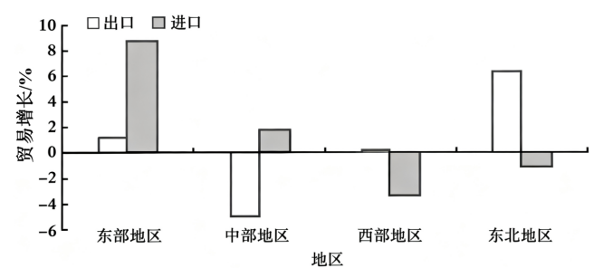

**2025年6月浙江省普通高校招生选考科目考试**

**思想政治试题**

**本试题卷分选择题和非选择题两部分，共6页，满分100分，考试时间90分钟。**

**考生注意：**

**1．答题前，请务必将自己的姓名、准考证号用，黑色字迹的签字笔或钢笔分别填写在试题卷和答题纸规定的位置上。**

**2．答题时，请按照答题纸上“注意事项”的要求，在答题纸相应的位置上规范作答，在本试题卷上的作答一律无效。**

**选择题部分**

**一、选择题Ⅰ（本大题共17小题，每小题2分，共34分。每小题列出的四个备选项中只有一个是符合题目要求的，不选、多选、错选均不得分）**

1\. 有人认为，新民主主义革命的胜利，标志着我国进入了社会主义社会。这一观点（ ）

A. 肯定了社会主义改造的必要性

B. 肯定了社会主义革命是新民主主义革命的必然趋势

C. 否定了从新民主主义转变到社会主义需要一个过渡时期

D. 否定了新民主主义革命的胜利从根本上改变了中国社会的发展方向

【答案】C

【解析】

【详解】A：三大改造的胜利，标志着我国进入了社会主义社会，该观点并未肯定社会主义改造的必要性，A排除。

B：题干是一种错误的观点，未体现对社会主义革命必然趋势的肯定，B排除。

C：这一观点否定了从新民主主义社会转变到社会主义社会需要一个过渡时期‌。新民主主义革命胜利，中国进入新民主主义社会，而非社会主义社会。社会主义制度的确立以1956年生产资料私有制的社会主义改造完成为标志‌。两者之间存在过渡时期，C符合题意。

D：新民主主义革命胜利，中华人民共和国成立，确实从根本上改变了中国社会的发展方向，但题干观点并未否定这一点‌，D排除。

故本题选C。

2\. 某校学生在参观“文化强国建设”主题展览时，看到一段文字：

|                                                                                   |
|:--------------------------------------------------------------------------------- |
| 我国深入实施中华文明探源工程，持续推进长城、大运河、黄河、长江国家文化公园建设，高标准建设中国国家版本馆、中国考古博物馆……一系列举措铺展恢弘图景，激荡复兴气象。 |

这段文字最恰当的标题是（ ）

A 立柱架梁，体制机制不断健全 B. 守护根脉，文明传承弦歌不辍

C. 重焕荣光，古老文明开拓创新 D. 以艺通心，中外文明交流互鉴

【答案】B

【解析】

【详解】B：材料中我国深入实施中华文明探源工程，一系列举措都体现了守护根脉，文明传承弦歌不辍，B正确。

A：材料强调文化根脉的传承，不涉及体制机制的健全，A排除。

C：材料强调中华优秀传统文化的传承，不涉及文化创新，古老文明开拓创新强调文化的创新，C排除。

D：中外文明交流互鉴强调文化的交流，偏离了材料聚焦的文化传承，D排除。

故本题选B。

3\. 党的十八届四中全会指出，对于实践证明行之有效的改革成果，应及时上升为法律制度；对于实践条件还不成熟、需要先行先试的，按照法定程序作出授权；对于不适应改革要求的法律法规，应及时修改或废止。由此可见（ ）

①要运用法治思维和法治方式推进改革

②改革与法治是相辅相成的

③改革本质上是法治的完善

④法治能够保证改革沿着正确方向前进

A. ①② B. ①③ C. ②④ D. ③④

【答案】A

【解析】

【详解】①②：改革破除旧体制，法治建立新秩序；法治为改革划定边界，改革为法治注入活力，二者相辅相成。“对于实践证明行之有效的改革成果，应及时上升为法律制度；对于实践条件还不成熟、需要先行先试的，按照法定程序作出授权；对于不适应改革要求的法律法规，应及时修改或废止”，体现了改革与法治是相辅相成的，我们要运用法治思维和法治方式推进改革，①②正确。

③：改革的本质是改变旧制度、旧事物，对生产关系或上层建筑进行局部或根本性调整，以解决生产关系与生产力之间的矛盾，推动社会进步。我国的改革是社会主义制度的自我完善与发展，③不选。

④：坚持中国共产党的领导，才能保证改革沿着正确方向前进，④不选。

故本题选A。

4\. 近年来，中国出台了更大规模、更高水平的自主开放和单边开放举措：举办中国国际进口博览会，缩减外资准入负面清单，给予外资国民待遇……外资进入中国市场的门槛不断降低，2024年全国新设立外资企业数量同比增长9.9%。这一增长（ ）

①得益于外资营商环境的改善

②有助于改善民生和稳定就业

③提高了外资企业的市场竞争力

④增强了外资经济的规模优势

A. ①② B. ①④ C. ②③ D. ③④

【答案】A

【解析】

【详解】①：题干明确提到“外资进入中国市场的门槛不断降低”，这直接体现了中国通过开放举措优化了外资营商环境，从而吸引更多外资企业进入。因此，外资企业数量增长是营商环境改善的结果，①正确。

②：外资企业增加能创造更多就业机会，促进经济增长，进而稳定就业；同时，通过提供更多商品和服务，推动技术创新，改善民生，②正确。

③：题干只强调外资企业“数量”增长，并未涉及竞争力问题。竞争力受技术、管理、市场等多因素影响，数量增加不等于竞争力提升，故③错误。

④：我国坚持公有制为主体，外资经济只是重要组成部分，新设外资企业数量增长不会增强其规模优势，故④错误。

故本题选A。

5\. 农产品直播间里吆喝声不断，带火了“土特产”。然而，一些消费者反映，有的与商品介绍“货不对板”，主播可能虚假宣传甚至制假售假；有的包装上没有标明生产日期和配料表等信息，无法追溯产品来源……这些乱象（ ）

①是市场自发调节的必然结果

②说明资源配置有待优化

③说明市场秩序有待规范

④必须由政府干预来解决

A. ①② B. ①④ C. ②③ D. ③④

【答案】C

【解析】

【详解】①：市场自发调节可能会出现这些乱象，但这不是必然结果，通过加强监管等手段可以避免或减少，①排除。

②：这些乱象表明市场中资源配置存在不合理情况，有待优化，②正确。

③：虚假宣传、制假售假、产品信息不明确等问题说明市场秩序不规范，有待整治，③正确。

④：解决这些问题需要政府、市场主体、消费者等多方共同努力，并非必须由政府单独干预解决，④排除。

故本题选C。

6\. 今年以来，为应对美国加征关税等外部风险挑战，有关行政部门出台帮助外贸企业拓内销、加快内外贸一体化的“一揽子”政策，对受到关税影响较大的企业在市场渠道、国内消费、服务保障等方面加强支持。这些举措（ ）

①是宏观调控最常用的经济手段

②有助于保持经济总量平衡

③体现了我国政府的经济职能

④完善了社会主义市场经济体制

A. ①② B. ①④ C. ②③ D. ③④

【答案】C

【解析】

【详解】①：宏观调控最常用的经济手段是财政政策和货币政策。题干中的举措并非“最常用”的经济手段，①排除。

②：政策通过“拓内销”扩大内需，将外部冲击（如关税影响）转化为国内消费动力，有助于缓解外贸下滑、稳定总供给与总需求，从而维护经济总量平衡，②正确。

③：政府的经济职能包括宏观调控、市场监管和公共服务等。题干中行政部门出台政策支持企业应对风险，对受到关税影响较大的企业在市场渠道、国内消费、服务保障等方面加强支持，正是履行“经济调节”和“公共服务”职能的体现，③正确。

④：该政策是应对短期外部风险的临时性措施，并未涉及制度性改革（如产权保护、市场规则等），因此不属于“完善体制”的范畴，④不符合题意。

故本题选C。

7\. 下图为2023年我国各大地区对外贸易增长情况

由上图信息可以推知（ ）

A. 东部地区进出口总额增速大于中部地区进出口总额增速

B. 东部地区进出口总额增速大于西部地区进出口总额增速

C. 东部地区比中部地区更好地贯彻了开放发展理念

D. 东北地区比西部地区更好地贯彻了开放发展理念

【答案】B

【解析】

【详解】A：东部地区出口正增长、进口高增长；中部地区出口负增长（且降幅较大）、进口正增长。综合来看，东部地区进出口总额增速不一定大于中部地区，A排除。

B：东部地区出口、进口均为正增长；西部地区出口几乎零增长、进口负增长。因此东部地区进出口总额增速大于西部地区，B正确。

C：开放发展理念不仅仅体现在贸易增速上，还涉及贸易结构、贸易创新等多个方面，仅从2023年一年的对外贸易增长情况，不能得出东部地区比中部地区更好地贯彻了开放发展理念，C排除。

D：东北地区出口正增长但进口负增长，西部地区出口几乎零增长、进口负增长，无法得出东北地区比西部地区更好贯彻开放发展理念的结论。而且仅依据2023年一年的对外贸易增长数据，不能判定东北地区比西部地区更好地贯彻了开放发展理念，D排除。

故本题选B

8\. 个税汇算是在每年年度终了后，纳税人对上一年度取得的工资薪金、劳务报酬、稿酬、特许权使用费等4项综合所得合并计税，向税务机关申请办理汇算，结清应退或者应补税款。个税汇算的“多退少补”（ ）

①使我国居民收入来源更加多样化

②有助于理顺国家和个人的收入分配关系

③有助于增加一线劳动者的收入

④能够调节不同社会群体之间的利益关系

A. ①③ B. ①④ C. ②③ D. ②④

【答案】D

【解析】

【详解】①：个税汇算的“多退少补”仅针对既定的四项综合所得汇算清缴，并未直接增加了居民收入来源，①排除。

②：通过汇总全年综合所得并重新计算应纳税额，避免重复征税或漏税‌，有助于理顺国家和个人的收入分配关系，②正确。

③：个税汇算的“多退少补”本身不会直接增加劳动者的收入，而是根据其收入和扣除项进行汇算，是否“退税”或“补税”取决于个人情况，不能一概而论，③排除。

④：个税汇算的“多退少补”通过专项扣除、附加扣除等政策，对低收入群体或特定支出（如教育、医疗）给予税收优惠，能够调节不同社会群体之间的利益关系，④正确。

故本题选D。

9\. 根据党中央和省委部署，今年3月中旬至7月，浙江在全省党员、干部中开展深入贯彻中央八项规定精神学习教育，各级党组织以“走前列、作示范”为标准定位，深化整治形式主义，一体推进“学、查、改、促”。开展这一学习教育（ ）

①是纵深推进全面从严治党的重要举措

②集中体现了共产党员的先锋模范作用

③根本目的在于不断改进党的执政方式

④有利于巩固党的执政基础

A. ①③ B. ①④ C. ②③ D. ②④

【答案】B

【解析】

【详解】①：中央八项规定精神是全面从严治党的核心内容之一，开展学习教育旨在深化作风建设、反对形式主义，体现了党在新时代推进自我革命的决心，是纵深推进全面从严治党的重要举措，①正确。

②：共产党员的先锋模范作用强调党员个体在实践中的带头作用（如服务群众、担当作为），而学习教育是党组织统一部署的活动，属于集体行为，并非直接体现党员的个体先锋模范作用，②不符合题意。

③：党执政方式如科学执政、民主执政、依法执政是党的长期目标，但本次学习教育的直接目的是贯彻中央八项规定精神、整治形式主义、改进工作作风，根本目的在于保持党的先进性和纯洁性，而非单纯改进执政方式，③错误。

④：通过学习教育，深化作风建设、密切联系群众，能增强党的凝聚力和群众信任，从而巩固党的执政基础，④正确。

故本题选B。

10\. 某市各社区党群服务中心强化政治引领，发挥基层党组织“指挥部”作用，把技能培训、养老托育、社区议事等功能集于一体，让人民群众在家门口即可享受一站式服务。这表明，党群服务中心（ ）

①是新型基层群众性自治组织

②是党建引领基层治理的重要阵地

③实现了基层公共事务管理的制度化

④进一步密切了党同人民群众的联系

A. ①③ B. ①④ C. ②③ D. ②④

【答案】D

【解析】

【详解】②④：强化政治引领，发挥基层党组织战斗堡垒作用，把技能培训、养老托育等功能集于一体，让人民群众在家门口享受一站式服务。可见，该社区党群服务中心是党建引领基层治理的重要阵地，进一步密切了党同人民群众的联系，②④正确。

①：在农村，基层群众性自治组织是居委会和村委会。党群服务中心是基层党组织主导的服务平台，非自治组织，①排除。

③：党群服务中心并非国家基层政权机关，没有实现基层公共事务管理的制度化，③排除。

故本题选D。

11\. 2025年，司法部在全国开展“公证规范优质”行动，推出系列措施：优化公证服务流程；新增身份证公证、营业执照公证“跨省通办”事项；为法院、检察院等部门提供辅助性公证法律服务。上述措施（ ）

①有助于提升国家治理效能

②体现了公正司法的原则

③提升了公证服务的便利性

④推动了公证服务智能化

A. ①③ B. ①④ C. ②③ D. ②④

【答案】A

【解析】

【详解】①：国家治理效能指政府运作的效率和公共服务质量。材料中的措施通过优化流程、跨省通办和部门协作，提高了公证服务的效率和质量，从而提升了政府治理水平，①正确。

②：公正司法原则主要指司法机关在审判和执行中保持独立、公平、正义。材料中公证服务虽属于司法行政范畴，但更侧重证明事实和提供公共服务，而非直接体现审判公正，因此材料未涉及司法公正，②排除。

③：“跨省通办”直接解决了异地办理难题，简化了办事手续，明显提高了群众办事的便捷性，③正确。

④：题干措施未涉及智能化技术（如人工智能、大数据等），④排除。

故本题选A。

12\. 《农村集体经济组织法》于2024年6月28日由全国人大常委会审议通过，2025年5月1日起施行。该法是全国人大常委会贯彻落实习近平总书记关于“三农”工作重要论述和党中央决策部署，保障农村集体经济高质量发展的重要法律。该法的制定和实施（ ）

①实现了农村治理有法可依

②体现了全国人大常委会行使表决权

③是发挥人民代表大会制度基本功能的体现

④是国家通过立法巩固和完善农村基本经营制度的体现

A. ①② B. ①④ C. ②③ D. ③④

【答案】D

【解析】

【详解】①：虽然《农村集体经济组织法》为农村集体经济组织提供了专门法律依据，但“农村治理”涵盖范围更广（如村民自治、社会管理等），并非仅靠此一部法律就能完全“实现”有法可依。而且农村治理已有《村民委员会组织法》等法律，题干涉及的法律只是进一步完善，而非从无到有的“实现”，①错误。

②：全国人大常委会作为国家权力机关的常设机关，其职权是立法权、决定权、任免权和监督权。而表决权是人大代表的职权，②错误。

③：人民代表大会制度是我国的根本政治制度，其基本功能包括立法、监督、决定重大事项等。全国人大常委会作为人民代表大会的常设机关，审议通过该法，是行使立法权的具体表现，体现了人民代表大会制度在保障人民当家作主、推进法治建设中的功能，③正确。

④：我国农村基本经营制度是“以家庭承包经营为基础、统分结合的双层经营体制”。该法针对农村集体经济组织，旨在“保障农村集体经济高质量发展”，这直接体现了国家通过立法手段巩固和完善农村基本经营制度，强化集体经济的“统”的功能，④正确。

故本题选D。

13\. 漫画《驱使》（作者：李肖飏）给我们的启示是（ ）

①人可能受自己双手创造物的支配

②技术带来的进步大于其负面影响

③技术的发展应以人的发展为价值导向

④人工智能可以模拟人的思维活动

A. ①② B. ①③ C. ②④ D. ③④

【答案】B

【解析】

【详解】①：漫画意在说明随着人工智能的发展，特别是生成式人工智能的应用，如果人类过度依赖技术和人工智能，可能会弱化人的主体性，技术产物反客为主，形成对人类的控制或异化，①正确。

②：漫画更侧重技术异化的风险而非单纯比较利弊‌，②排除。

③：漫画意在强调科技需服务于人的主体性，技术的发展应以人的发展为价值导向，③正确。

④：“人工智能可以模拟人的思维活动”是对技术能力的描述，与漫画的哲学启示无直接关联‌，④排除。

故本题选B。

14\. 过去，农民“面朝黄土背朝天”，劳动强度大且生产效率低。如今，先进的农机装备不断涌现，无人驾驶拖拉机、联合收割机等大显身手，不仅解放了劳动力，还推动了土地经营权的放活、规模化耕种的发展。这表明（ ）

①人的实践活动是历史地发展着的

②先进工具能够延伸人的认识器官

③生产力的发展会引起生产关系的变革

④生产关系对生产力具有反作用

A. ①③ B. ①④ C. ②③ D. ②④

【答案】A

【解析】

【详解】①：农民从传统手工劳作到使用先进农机，体现了人的实践活动是历史地发展着的，①正确。

②：题目强调农机解放劳动力和推动生产关系变革，而非延伸人的认识器官，与题意无关，②排除。

③：农机装备（生产力进步）推动了土地经营权放活、规模化耕种（生产关系调整），体现了生产力对生产关系的决定作用，③正确。

④：题目未体现生产关系反作用于生产力，而是强调生产力推动生产关系变革，④排除。

故本题选A。

15\. 60多年前，10万名劳动者靠双手和苦干在太行山悬崖峭壁间凿出一条“人工天河”，创造了劈山引漳、重塑山河的人间奇迹，改变了林县“十年九旱”的历史，铸就了“自力更生、艰苦创业、团结协作、无私奉献”的红旗渠精神。由此可知（ ）

①劳动是人类最基本的实践活动

②人民群众是社会财富的创造者

③人通过劳动创造和实现价值

④人民群众是社会变革的决定力量

A. ①② B. ①④ C. ②③ D. ③④

【答案】C

【解析】

【详解】①：劳动是社会历史的起点，改造自然的生产实践是人类最基本的实践活动，①排除。

②：红旗渠作为物质财富（水利工程）和精神财富（红旗渠精神），是由人民群众（10万名劳动者）直接创造的，这符合历史唯物主义观点，即人民群众是物质财富和精神财富的创造主体，②正确。

③：劳动者通过艰苦劳动，不仅创造了实用价值，还实现了人生价值和社会价值，体现了劳动在价值创造和实现中的核心作用，③正确。

④：“人民群众是社会变革的决定力量”在题干中无直接体现，因为红旗渠事件是生产建设活动，并非社会制度或生产关系的根本变革，④不选。

故本题选C。

16\. 贾湖遗址出土的骨笛，距今已有8000多年历史，是已发现的世界上最早的可吹奏七声音阶的管乐器。此前，音乐界普遍认为七声音阶是由国外传入我国的，而贾湖骨笛的发现证明了中国是人类最早的音乐文明源头之一。这表明（ ）

①文化要通过载体呈现出来

②中华文化具有强大的凝聚力和连续性

③中国音乐文化应注重吸收和借鉴外来音乐文化的有益成果

④中华优秀传统文化为我们坚定文化自信提供了深厚基础

A. ①② B. ①④ C. ②③ D. ③④

【答案】B

【解析】

【详解】①：贾湖骨笛作为出土文物，是古代音乐文化的具体载体，直接呈现了8000多年前的音乐文明，体现了文化载体在文化传承中的作用，①正确。

②：凝聚力指文化对民族的团结作用，题干强调中华文化的源远流长（连续性），但未体现“强大的凝聚力”，②不符合题意。

③：题干通过骨笛证明七声音阶是中国本土起源，反驳了外来传入的观点，因此强调本土创新而非吸收外来有益文化，③不符合题意。

④：中华优秀传统文化是文化自信的根基。贾湖骨笛的发现证明了中国是人类最早的音乐文明源头之一，推翻了“七声音阶由国外传入”的观点，彰显了中华文化的原创性和历史深度，为坚定文化自信提供了深厚基础，④正确。

故本题选B。

17\. 国产某动画影片在深度挖掘和精准提炼中华优秀传统文化精神内核的基础上，运用现代科技和艺术手法进行创新表达，用国际化语言讲述中国故事，实现了艺术价值与商业价值的双赢，以及文化传播与产业发展的良性互动。它的成功表明（ ）

①文化产业发展既要扎根传统，又要面向现代

②文化产业发展既要立足本土，又要放眼世界

③把故事讲好，才能增强文化传播力影响力

④文化创作生产应把社会效益放在首位，兼顾经济效益

A. ①② B. ①③ C. ②④ D. ③④

【答案】A

【解析】

【详解】①：“深度挖掘和精准提炼中华优秀传统文化精神内核”和“运用现代科技和艺术手法进行创新表达”体现了文化产业发展既要扎根传统，又要面向现代，①正确。

②：在深度挖掘和精准提炼中华优秀传统文化精神内核的基础上，用国际化语言讲述中国故事，体现了文化产业发展既要立足本土，又要放眼世界，②正确。

③：题干虽提到“讲述中国故事”，但未直接强调“讲好故事”是增强传播力的必要条件，而是侧重于方法，③错误。

④：题干强调“艺术价值与商业价值的双赢”，但未体现社会效益放在首位，④不符合题意。

故本题选A。

**二、选择题Ⅱ（本大题共6小题，每小题3分，共18分。每小题列出的四个备选项中只有一个是符合题目要求的，不选、多选、错选均不得分）**

18\. 近年来，德国选择党深耕新媒体，以直播、短视频等形式宣扬“反对精英”“捍卫本土”等极具感召力的政策主张，吸引了大批年轻选民，在德国政坛快速崛起。但选择党在习惯于通过传统媒体获得信息的中老年选民中，支持率不高。由此可知，在当代德国（ ）

A. 政党是各年龄段选民之间利益博弈的产物

B. 选择党的政策主张不符合中老年选民的利益诉求

C. 政党利用媒体迷惑选民，掩盖该国政党政治的根本性质

D. 善用媒体是政党实现其政治目标的重要素养

【答案】D

【解析】

【详解】A：政党是在阶级的基础上产生的，是阶级斗争发展到一定阶段的产物，A说法错误。

B：题干强调了选择党采用的传播方式对不同年龄段的选民产生的影响是不同的，并未说明支持率不高是其政策主张不符合中老年选民的利益诉求，“不符合中老年选民的利益诉求”属于过度推断，B排除。

C：材料并未提及“迷惑选民”或“掩盖根本性质”，C排除。

D：选择党在青年群体中的高支持率与中老年群体的低支持率，从一个侧面说明媒体运用对政党政治目标的实现具有重要作用，D正确。

故本题选D。

19\. 随着气候变暖，冰层加速消融，北极的通航与资源利用日趋便利，战略地位上升，北极理事会、北冰洋科学委员会等国际组织应运而生。同时，该区域的大国博弈也日益激烈，而这极大影响了这些组织协调各方开发利用北极的活动。由此可见，上述国际组织（ ）

①其成立受到地理环境变迁的影响

②能促进成员之间的合作，维护共同利益

③逐步成为霸权主义的工具

④应向发展中国家提供更多开发北极的机会

A. ①② B. ①④ C. ②③ D. ③④

【答案】A

【解析】

【详解】①：题干指出“随着气候变暖，冰层加速消融……北极理事会、北冰洋科学委员会等国际组织应运而生”，这直接体现了地理环境变迁（如气候变暖导致的冰层消融）是这些国际组织成立的客观原因，①正确。

②：题干提到这些组织旨在“协调各方开发利用北极的活动”，表明其职能是促进成员间合作、维护共同利益（如资源共享和科学协作），②正确。

③：题干虽提到“大国博弈日益激烈”影响了组织协调，但并未说明这些组织“逐步成为霸权主义的工具”，③排除。

④：题干仅讨论北极区域战略地位上升和国际组织协调活动，未涉及发展中国家开发北极机会的议题，④排除。

故本题选A。

20\. 基于甲的个人行为或者甲的公司经营活动，以下诉讼主张能够得到法院支持的是（ ）

①甲与女主播乙互动，向其所在直播平台充值数万元用于点歌，后甲要求平台返还充值款

②丙应聘到甲的公司，试用期间被证明不符合录用条件，甲据此要求解除与丙的劳动合同

③甲与丁签订采矿协议，发现矿区在行政法规禁止采矿的自然保护区内，甲要求解除协议

④戊通过网络发文捏造甲的公司虚假消息导致其经营困难，甲要求戊赔礼道歉并赔偿损失

A. ①② B. ①③ C. ②④ D. ③④

【答案】C

【解析】

【详解】①：甲向直播平台充值打赏是其真实意思表示，属于有效民事行为，要求平台返还充值款缺乏法律依据，①错误。

②：根据《劳动合同法》，试用期间被证明不符合录用条件的，用人单位可解除劳动合同，甲的诉讼主张会得到支持，②正确。

③：违反法律、行政法规的强制性规定的合同无效。采矿协议因违反行政法规禁止性规定属于无效合同，无效合同自始无法律约束力，无需“解除”，甲要求解除协议的主张缺乏法律依据，③错误。

④：戊捏造虚假消息导致甲公司经营困难，构成对甲公司名誉权的侵害。根据《民法典》第一千零二十四条和第一千一百六十七条，受害人有权要求侵权人停止侵害、赔礼道歉、赔偿损失。该主张会得到法院支持，④正确。

故本题选C。

21\. 1993年叶某与赵某结婚，育有一子小叶，后双方离婚。2005年叶某与孟某再婚。2018年小叶患病丧失劳动能力，且无生活来源。叶某订立自书遗嘱，载明：“我所有的房产及财产，由妻子孟某继承。”2023年叶某去世，小叶与孟某就涉案房屋发生争议，双方诉至法院。下列说法中正确的是（ ）

①法院一审前，孟某与小叶之间对涉案房屋的争议可通过仲裁方式解决

②法定继承人小叶享有的继承权应优先于自书遗嘱中孟某享有的继承权

③小叶需要对其有权继承涉案房屋的部分份额的事实承担举证责任

④小叶丧失劳动能力又无生活来源，应为其保留必要份额

A. ①② B. ①③ C. ②④ D. ③④

【答案】D

【解析】

【详解】①：婚姻、收养、监护、扶养、继承纠纷不能仲裁。本案属于继承纠纷，不能通过仲裁方式解决，需通过诉讼程序处理‌，①排除。

②④：遗嘱继承法律效力优先于法定继承，但民法典规定，遗嘱应当为缺乏劳动能力又没有生活来源的继承人保留必要的遗产份额。叶某在自书遗嘱中指定他的所有房产及财产由妻子孟某继承，虽是其真实意思表示，但因小叶作为叶某的法定继承人患病丧失劳动能力，且无生活来源，故该遗嘱部分无效，应为其保留必要份额，②排除，④正确。

③：在继承纠纷中，主张权利的一方需承担举证责任。若小叶主张遗嘱无效或要求保留份额，需提供证据，如丧失劳动能力、无生活来源等证明，③正确。

故本题选D。

22\. 古希腊哲学家亚里士多德说：“更好的东西并不都是更值得选择的东西，因为至少做一个哲学家比挣钱更好，但对于一个缺乏生活必需品的人来说，做哲学家并不比挣钱更值得选择。”（亚里士多德《论辩篇》）由这一论证可必然得出（ ）

①有些更好的东西不是更值得选择的东西

②哲学家都是不缺乏生活必需品的人

③只有不缺乏生活必需品，做哲学家才比挣钱更值得选择

④更值得选择的东西并不都是更好的东西

A. ①② B. ①③ C. ②④ D. ③④

【答案】B

【解析】

【详解】①：原文开头就指出“更好的东西并不都是更值得选择的东西”，并以“做哲学家比挣钱更好，但对于缺乏生活必需品的人来说，做哲学家并不比挣钱更值得选择”为例证。这表明“做哲学家”在某些条件下（如缺乏必需品）虽更好，但不是更值得选择的，①正确。

②：论证仅讨论“对于缺乏生活必需品的人，做哲学家不更值得选择”，并未涉及所有哲学家的经济状况。它不排除哲学家可能来自不同背景（如有些人缺乏必需品但仍选择做哲学家），②不符合题意。

③：论证明确说“但对于一个缺乏生活必需品的人来说，做哲学家并不比挣钱更值得选择”，其逻辑等价于“做哲学家比挣钱更值得选择”的必要条件是“不缺乏生活必需品”（即只有不缺乏时，才更值得选择），③正确。

④：材料强调“更好的东西不一定更值得选择”，但未直接讨论“更值得选择的东西”是否更好。例子中，对于缺乏必需品的人，“挣钱”更值得选择，但“挣钱”本身不一定比“做哲学家”更好（因论证说做哲学家更好），因此可能存在“更值得选择但不是更好”的情况。但“更值得选择的东西并不都是更好的东西”的说法太绝对，故④错误。

故本题选B。

23\. 杭州借承办足球世界杯预选赛（中国队对战澳大利亚队）契机，开展大规模文旅宣传和促销活动。例如依托主赛场奥体中心的综合体优势，推出足球主题餐厅；发布“赛事观战+西湖夜游”等文旅套餐；向现场观赛的7万多球迷发放景区消费券，延长其在杭停留时间，以促进城市文旅消费。这一举措主要运用了（ ）

A. 联想思维，将体育赛事与杭州城市文化相结合，打造跨领域联名活动

B. 逆向思维，打破传统文旅资源推广模式，转而集中力量增强赛事经济影响力

C. 发散思维，以足球赛事为核心，拓展餐饮、旅游、景区消费等多元消费场景

D. 聚合思维，整合奥体中心硬件资源与办赛经验，提升赛事与球迷服务质量

【答案】C

【解析】

【详解】A：联想思维强调将不同事物联系起来，但题干重点是通过赛事拓展多个消费领域，而非单纯建立联系，A不符合题意。

B：逆向思维强调对已有的有关事物存在状态的认识作转换性思考，但题干并未体现对传统文旅模式的颠覆或反向操作，而是顺势利用赛事契机，B不符合题意。

C：发散思维指从一个核心点出发，向不同方向扩散，探索多种可能性和关联场景。题干措施以足球赛事为核心，拓展出餐饮、旅游、景区消费等多元消费场景，体现了发散思维的特征，C正确。

D： 聚合思维强调整合资源聚焦于单一目标（如提升服务质量），但题干措施是拓展消费场景，体现了发散思维，而非集中资源优化服务，D不符合题意。

故本题选C。

**非选择题部分**

**三、综合题（本大题共5小题，共48分）**

24\. 社会治安综合治理中心是新时代化解基层矛盾、提升基层治理能力的重要平台。A区以创新工作机制推进综合治理中心的规范化建设：健全组织领导机制，区委政法委组建由多部门负责人组成的领导小组，定期召开推进会和协调会；完善协同运行机制，整合诉讼、检察、公共法律服务等资源，打破部门壁垒，形成“前台统一受理，后台联动办理”的闭环机制，实现群众利益诉求有人办、依法办；优化矛盾化解机制，落实《××市矛盾纠纷预防和多元化解条例》，完善调解优先、分层递进、诉讼兜底的多元纠纷解决工作体系，依法高效化解矛盾……A区持续提升基层治理能力，实现了让群众“只进一扇门”“最多跑一地”。

结合材料，运用《政治与法治》中的相关知识，分析A区社会治安综合治理中心是如何在规范化建设中提升基层治理能力的。

【答案】①健全组织领导机制，区委政法委统筹协调综合治理工作，发挥了党总揽全局、协调各方的作用，为提升基层治理能力提供了政治保证。②完善协同运行机制，整合服务资源，维护群众合法权益，坚持了以人民为中心，提升了基层治理效能和为民服务水平。③优化矛盾化解机制，落实地方性法规，坚持了依法治国，提高了基层治理的法治化水平。

【解析】

【分析】背景素材：A区提升基层治理能力

考点考查：党的领导、人民当家作主、依法治国等知识

能力考查：描述和阐释事物、探究和论证问题

核心素养：政治认同、科学精神

【详解】第一步：审设问。明确知识范围、问题限定和作答角度。本题属于措施类，要求分析A区社会治安综合治理中心是如何在规范化建设中提升基层治理能力的。需要调用党的领导、人民当家作主、依法治国等知识。解答时，获取材料信息，结合知识要点作答即可。

第二步：审材料。提取关键信息，链接教材知识。

关键信息①：健全组织领导机制，区委政法委组建由多部门负责人组成的领导小组，定期召开推进会和协调会→可联系党的领导的知识，说明A区发挥了党总揽全局、协调各方的作用，为提升基层治理能力提供了政治保证。

关键词②：完善协同运行机制，整合诉讼、检察、公共法律服务等资源，打破部门壁垒，形成“前台统一受理，后台联动办理”的闭环机制，实现群众利益诉求有人办、依法办→可联系人民当家作主、推动治理体系和治理能力现代化的知识，说明A区坚持了以人民为中心，提升了基层治理效能和为民服务水平。

关键词③：优化矛盾化解机制，完善调解优先、分层递进、诉讼兜底的多元纠纷解决工作体系，依法高效化解矛盾→可联系依法治国、基层群众自治的知识，说明A区坚持了依法治国，提高了基层治理的法治化水平。

第三步：整合信息，组织答案。注意设问限定以及教材知识与材料相结合。

25\. 材料一 傅立叶指出，在资本主义社会，医生盼望人人都生病、律师盼望家家打官司，从而为他们创造发财的机会。他设想了一种人人劳动、男女平等、没有城乡差别、没有脑力劳动与体力劳动对立的合作组织“法郎吉”。他期望资本家出钱入股兴办“法郎吉”，甚至每日中午12点在家恭候前来投资的资本家，结果等了十年，也无人光顾。

材料二 马克思、恩格斯在《共产党宣言》中强调，共产党人的最近目的是使无产阶级形成为阶级，推翻资产阶级的统治，由无产阶级夺取政权。马克思在《哥达纲领批判》中认为，在未来社会，脑力劳动与体力劳动的对立会随着旧式分工的消失而消失。列宁在《卡尔·马克思》中指出，资本主义社会必然要转变为社会主义社会这个结论，马克思完全是从现代社会的经济的运动规律得出的。

（1）结合材料一，分析空想社会主义的理论贡献及理论局限。

（2）结合材料，运用《哲学与文化》中“辩证否定”的知识，谈谈你对空想社会主义与科学社会主义之间关系的理解。

【答案】（1）理论贡献：①通过揭露资本主义社会中人的极端逐利性，批判了资本主义的弊端。②通过设想一个合作组织“法郎吉”，表达了对理想社会的诉求。

理论局限：期望资本家出资兴办“法郎吉”，说明其没有找到社会变革的正确途径。

（2）（答案版本1）①科学社会主义是对空想社会主义的辩证否定。②科学社会主义保留了空想社会主义中积极合理的因素，肯定了脑力劳动和体力劳动对立的消失；克服了空想社会主义中消极过时的内容，批判了空想社会主义将实现理想社会的希望寄托在资本家身上的幻想。③（通过）自己否定自己，自己发展自己，科学社会主义找到了社会变革的正确途径，即无产阶级革命。

（答案版本2，原始答案）科学社会主义是对空想社会主义的辩证否定。它继承了空想社会主义对未来社会的某些构想，如脑力劳动与体力劳动对立的消失；批判了空想社会主义将实现理想社会的希望寄托在资本家身上的幻想，找到了社会变革的正确途径——无产阶级革命；它克服了空想社会主义不懂得历史规律的缺陷，将对理想社会的追求建立在对资本主义经济运动规律的科学分析之上，实现了社会主义从空想到科学的发展。

【解析】

【分析】背景素材：空想社会主义和《共产党宣言》

考点考查：空想社会主义、辩证否定观的知识

能力考查：描述和阐述事物，论证和探究问题

核心素养：政治认同、科学精神

【小问1详解】

第一步：审设问。明确主体、知识范围、问题限定和作答角度。

本题需要调用空想社会主义的有关知识，分析空想社会主义的理论贡献及其局限性。

第二步：审材料。提取关键词，链接教材知识。

关键词①：在资本主义社会，医生盼望人人都生病、律师盼望家家打官司，从而为他们创造发财的机会→可联系空想社会主义的知识，从其贡献角度说明批判了资本主义的弊端。

关键词②：他设想了一种人人劳动、男女平等、没有城乡差别、没有脑力劳动与体力劳动对立的合作组织“法郎吉”→可联系空想社会主义的知识，从其贡献角度说明通过建立“法郎吉”，表达了对理想社会的诉求。

关键词③：他期望资本家出钱入股兴办“法郎吉”，甚至每日中午12点在家恭候前来投资的资本家，结果等了十年，也无人光顾→可联系空想社会主义的知识，说明其没有找到变革的渠道，说明其不合理性。

第三步：整合信息，组织答案。注意设问限定以及教材知识与材料、时政信息等相结合。

【小问2详解】

第一步：审设问。明确主体、知识范围、问题限定和作答角度。

本题需要调用“辩证否定”的知识，谈谈你对空想社会主义与科学社会主义之间关系的理解。

第二步：审材料。提取关键词，链接教材知识。

关键词①：马克思在《哥达纲领批判》中认为，在未来社会，脑力劳动与体力劳动的对立会随着旧式分工的消失而消失→可联系辩证否定的知识，说明科学社会主义保留了空想社会主义的积极因素，肯定了脑力劳动和体力劳动对立的消失。

关键词②：共产党人的最近目的是使无产阶级形成为阶级，推翻资产阶级的统治，由无产阶级夺取政权→可联系辩证否定的知识，说明科学社会主义批判了空想社会主义将实现理想社会的希望寄托在资本家身上的幻想。

关键词③：资本主义社会必然要转变为社会主义社会这个结论，马克思完全是从现代社会的经济的运动规律得出的→可联系辩证否定知识，说明科学社会主义找到了社会变革的正确途径，即无产阶级革命。

第三步：整合信息，组织答案。注意设问限定以及教材知识与材料、时政信息等相结合。

26\. 大华与某水产公司签订合作协议，约定：共同申请专利并成为专利权人，专利保护期内由公司缴纳专利年费，专利实施收益各占50%。专利申请于2019年9月2日获得受理，2020年6月8日获得授权。2021年12月3日，大华离职并加入鲁某公司。此后，水产公司因业务转型不再实施该专利，并担心大华在鲁某公司实施该专利，决定停止缴纳专利年费，致使涉案专利权于2023年9月28日被终止，大华诉至法院，要求水产公司承担赔偿责任。

结合材料，运用《法律与生活》中的相关知识，回答下列问题：

（1）指出水产公司是否侵犯了大华的专利权，并说明理由。

（2）指出水产公司是否应当承担赔偿责任，并说明理由。

【答案】（1）①否。②根据法律规定，专利侵权是指他人未经专利权人同意，实施其专利。③本案中，水产公司不存在未经专利权人同意实施专利的事实，故水产公司未侵犯大华的专利权。

（2）①是。②合同当事人应当遵循诚信原则，全面履行合同义务。因未履行合同义务给对方造成损失的，应当承担赔偿责任。③本案中水产公司未履行缴纳年费的义务，导致专利权终止，该公司应赔偿大华因此而遭受的财产损失，包括预期收益减少和其他相关损失。

【解析】

【分析】背景素材：大华和公司的纠纷

考点考查：专利权、违约责任

能力考查：描述和阐述事物，论证和探究问题

核心素养：政治认同、科学精神

【小问1详解】

第一步：审设问。明确主体、知识范围、问题限定和作答角度。

本题需要调用法律与生活的有关知识，分析水产公司是否侵犯了大华的专利权，并说明理由。

第二步：审材料。提取关键词，链接教材知识。

关键词：大华与某水产公司签订合作协议，约定：共同申请专利并成为专利权人，专利保护期内由公司缴纳专利年费，专利实施收益各占50%→可联系专利权的知识，说明双方签订合同，大华授权公司使用该专利，水产公司不存在侵权行为。

第三步：整合信息，组织答案。注意设问限定以及教材知识与材料、时政信息等相结合。

【小问2详解】

第一步：审设问。明确主体、知识范围、问题限定和作答角度。

本题需要调用法律与生活有关知识，分析水产公司是否应当承担赔偿责任，并说明理由。

第二步：审材料。提取关键词，链接教材知识。

关键词：水产公司因业务转型不再实施该专利，并担心大华在鲁某公司实施该专利，决定停止缴纳专利年费，致使涉案专利权于2023年9月28日被终止，大华诉至法院，要求水产公司承担赔偿责任→可联系合同的知识，说明大华与该公司签订的合同有效，双方应该按照合同履行，该公司未缴纳年费，是违约行为，应该承担违约责任，赔偿相关损失。

第三步：整合信息，组织答案。注意设问限定以及教材知识与材料、时政信息等相结合。

27\. 太阳系之外是否可能存在其他生命？2023年，剑桥大学某研究团队利用詹姆斯·韦布空间望远镜（JWST）的近红外仪器，检测到距地球124光年的系外行星K2-18b大气中存在二甲基硫醚（DMS）。近日，他们利用JWST的中红外仪器再次检测到更清晰的DMS信号，还发现了与其密切相关的二甲基二硫醚（DMDS），置信度达99.7%。研究人员据此推断K2-18b大气中普遍存在DMS/DMDS。这一发现被认为是迄今系外可能存在生命的最强证据，因为这两种化合物在地球上仅由生命活动生成。不过也有科学家指出，虽然这一结果令人兴奋，但公开宣布在另一个星球上发现生命之前，有必要获取更多检测数据，而且DMS/DMDS是否可以存在于无生命环境仍需进一步的研究来验证。

结合材料，运用《逻辑与思维》中的相关知识，回答下列问题：

（1）指出研究人员主要使用了哪些类型的推理得出“K2-18b行星可能存在生命”的结论，具体说明推理过程。

（2）提出一条具体建议，以提高该结论的可靠性，并简要说明理由。

【答案】（1）①归纳推理/简单枚举归纳推理/不完全归纳推理，从两次分别通过不同仪器检测到DMS/DMDS，且置信度高达99.7%，推出K2-18b大气中普遍存在DMS/DMDS这个一般性结论。②类比推理，将K2-18b的DMS/DMDS与地球上情况进行类比，从地球上这两种化合物由生命活动生成，类推K2-18b的DMS/DMDS也可能由生命活动生成。从而得出该行星可能存在生命的结论。

（2）

①建议：进行多次检测，获取更多数据。理由：仅通过两次检测得出一般性结论（K2-18b大气中普遍存在DMS/DMDS）是或然的，增加检测次数可提高结论的可靠性。②建议：进一步验证DMS/DMDS在地球之外是否也只能由生命活动生成。理由：DMS/DMDS在地球与地外行星上的生成原因可能不一样，如能证明其他在地外也只能由生命活动生成，则可提高结论的可靠性。③建议：可以寻找更多的与存在生命活动相关的根据（比如说氧气、水）。理由：类比的根据越多越好。④建议：找出K2-18b行星与地球更多的接近本质属性的相同属性。理由：作为类比推理根据的相同属性越是接近本质属性，结论的可靠程度就越高。⑤建议：验证DMS/DMDS在无生命环境中是否能存在。理由：前提中确认的属性不应该有与结论相互排斥的属性。

【解析】

【分析】背景素材：太阳系外可能存在其他生命的科学研究

考点考查：学会归纳与类比的知识

能力考查：描述和阐释事物、论证和探究问题

核心素养：政治认同、科学精神、公共参与

【小问1详解】

第一步：审设问。明确主体、作答范围、问题限定和作答角度。

本题为分析说明类主观题，要求运用归纳及类比推理的知识，从得出“K2-18b行星可能存在生命”结论的推理角度来作答，并说明推理过程。

第二步：审材料，通过标点符号、段落等，提取材料有效信息。

有效信息①：研究团队利用詹姆斯·韦布空间望远镜（JWST）的近红外仪器，检测到距地球124光年的系外行星K2-18b大气中存在二甲基硫醚（DMS）。近日，他们利用JWST的中红外仪器再次检测到更清晰的DMS信号，还发现了与其密切相关的二甲基二硫醚（DMDS），置信度达99.7%。研究人员据此推断K2-18b大气中普遍存在DMS/DMDS→可运用归纳推理知识，分析说明该研究团队两次利用仪器检测到DMS/DMDS信号，归纳得出K2-18b大气中普遍存在DMS/DMDS这个一般性结论。

有效信息②：这一发现被认为是迄今系外可能存在生命的最强证据，因为这两种化合物在地球上仅由生命活动生成→可运用类比推理知识，分析说明将系外行星K2-18b与地球进行类比，通过地球上二甲基硫醚和二甲基二硫醚仅由生命活动合成，类推出K2-18b行星的这两种化合物也可能由生命活动生成。从而得出该行星可能存在生命的结论。

第三步：整合信息，组织答案。注意设问限定以及教材知识与材料、时政信息等相结合。

【小问2详解】

第一步：审设问。明确主体、作答范围、问题限定和作答角度。

本题为措施、原因类主观题，具有开放性，要求运用归纳及类比推理知识，从提高该结论的可靠性角度来分析作答。

第二步：审材料，通过标点符号、段落等，提取材料有效信息。

有效信息①：虽然这一结果令人兴奋，但公开宣布在另一个星球上发现生命之前，有必要获取更多检测数据→可运用归纳推理的知识，从考察更多认识对象的角度，说明可进行多次检测，获取更多数据，增加检测次数可提高结论的可靠性。

有效信息②：DMS/DMDS是否可以存在于无生命环境仍需进一步的研究来验证→可运用归纳推理的知识，从在认识对象与有关现象之间寻找因果关系角度，分析说明可进一步验证DMS/DMDS在地球之外是否也只能由生命活动生成。

有效信息③：这一发现被认为是迄今系外可能存在生命的最强证据，因为这两种化合物在地球上仅由生命活动生成→可运用类比推理知识，从类比根据越多越好的角度，说明可寻找更多的与存在生命活动相关的根据。

有效信息④：这一发现被认为是迄今系外可能存在生命的最强证据，因为这两种化合物在地球上仅由生命活动生成→可运用类比推理的知识，从作为类比推理根据的相同属性角度，说明可找出K2-18b行星与地球更多的接近本质属性的相同属性。

有效信息⑤：DMS/DMDS是否可以存在于无生命环境仍需进一步的研究来验证→可运用类比推理知识，从前提中确认的属性不应该有与结论相互排斥的属性角度，说明可验证DMS/DMDS在无生命环境中是否能存在。

第三步：整合信息，组织答案。

28\. 在国际事务中践行正确义利观，既是对中华优秀传统文化的弘扬，也是新时代中国外交的鲜明特色。围绕近期国际热点，李明的外国朋友南希给他写信，探讨义利观。

<table style="width:100%;">
<colgroup>
<col style="width: 99%" />
</colgroup>
<tbody>
<tr>
<td style="text-align: left;">
亲爱的李明：

你好！

你最近也在关注美国滥施关税，试图讹诈他国的做法吧？这种做法既自私，又愚蠢。不仅中国，而且美国的盟友也纷纷动用经贸措施进行反制。美国国内的抗议声更是此起彼伏。正如荀子所言“先利而后义者辱”，“美国优先”只会加速其没落。

但对于义利观，我一直有个困惑，期待你的解答：如果秉持“先义后利”，那是否意味着一个国家应以他国利益为先，而这样的国家怎么可能得到发展，又何谈“先义而后利者荣”呢？

你的朋友南希

2025年5月10日
</td>
</tr>
</tbody>
</table>

为解答南希的困惑，李明摘编了如下资料：

<table style="width:100%;">
<colgroup>
<col style="width: 99%" />
</colgroup>
<tbody>
<tr>
<td style="text-align: left;">
学者X：习近平总书记多次强调在国际事务中要践行正确义利观。正确义利观强调义利相兼、以义为先。不管是共建“一带一路”的丰硕成果，还是金砖合作机制对于“全球南方”群体性崛起的引领，都说明：在合作共赢中取“利”，是我们应该遵循的“大义”。

学者Y：中华传统文化并未一味贬低“利”。君子爱财，取之有道。得道多助，失道寡助。得道者，义以生利、成人达己；失道者，见利忘义，损人害己。践行正确义利观，关键是要弄清“义利的先后”问题中蕴含的“公与私”“他国与本国”的关系问题。
</td>
</tr>
</tbody>
</table>

结合材料，运用《当代国际政治与经济》中的相关知识，以“先利而后义者辱，先义而后利者荣”为议题，用李明的名义给南希回一封信。

要求：（1）观点正确；知识和材料运用恰当。

（2）条理清晰；逻辑严密；表达流畅；300字左右。

【答案】内容部分评分参考要点如下：①解答南希困惑：阐明“先利后义”的实质是把本国利益置于他国利益、全球公共利益之上，“先义后利”并非以他国利益为先，而是把本国利益寓于与他国的共同利益、全球公共利益之中；秉持“先义后利”的国家能在合作共赢中得到更好发展。②“先利后义”的做法，如霸权主义、单边主义、狭隘民族主义行径，损人害己，必将招致众叛亲离。③“先义后利”的做法，如构建人类命运共同体、共建“一带一路”、金砖合作机制的实践，成人达己，能带来协和万邦的效果。

整合后，答案结构的设计思路大致如下：

【解析】

【分析】背景素材：在国际事务中践行正确义利观

考点考查：国际关系的决定因素、构建人类命运共同体、和平与发展主题等

能力考查：描述和阐释事物、论证和探究问题

核心素养：政治认同、科学精神

【详解】第一步：审设问。明确主体、知识范围、问题限定和作答角度。本题为论述题，需要调用《当代国际政治与经济》的知识，结合材料信息对议题观点进行分析论证。

第二步：审材料。提取关键词，链接教材知识。

关键词①：如果秉持“先义后利”，那是否意味着一个国家应以他国利益为先→可联系教材知识国际关系的决定因素，解答南希困惑：阐明“先利后义”的实质，再指出“先义后利”并非以他国利益为先，而是把本国利益寓于与他国的共同利益、全球公共利益之中；秉持“先义后利”的国家能在合作共赢中得到更好发展。

关键词②：美国的盟友也纷纷动用经贸措施进行反制。美国国内的抗议声更是此起彼伏→可联系教材知识和平与发展主题，指出“先利后义”的做法损人害己，必将招致众叛亲离。

关键词③：在国际事务中要践行正确义利观。正确义利观强调义利相兼、以义为先；在合作共赢中取“利”，是我们应该遵循的“大义”→可联系教材知识构建人类命运共同体，指出“先义后利”的做法，成人达己，能带来协和万邦的效果。

第三步：整合信息，组织答案。注意设问限定以及教材知识与材料、时政信息等相结合。
