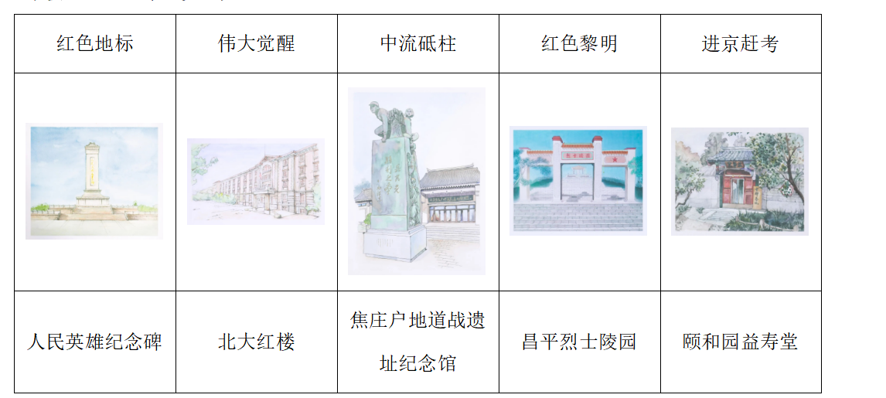
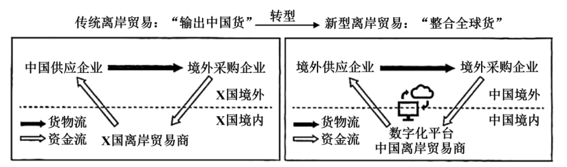
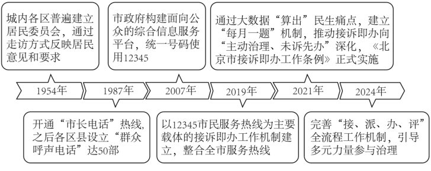

**北京市2025年普通高中学业水平等级性考试**

**思想政治**

**本试卷共9页，100分。考试时长90分钟。考生务必将答案答在答题卡上，在试卷上作答无效。考试结束后，将本试卷和答题卡一并交回。**

**第一部分**

**本部分共15题，每题3分，共45分。在每题列出的四个选项中，选出最符合题目要求的一项。**

1\. 2025年春天，“红色·记忆——北京革命旧址和纪念设施手绘作品展”（部分作品如上图所示）对观众开放，展出的作品全部由青年学生精心绘制，以“红色地标、伟大觉醒、中流砥柱、红色黎明、进京赶考”5个板块重现百年大党的光辉历程。展出的手绘作品（ ）

①传承中国革命事业的精神血脉，展现了党和人民共同谱写的奋斗乐章

②以社会主义制度的创立和发展为主线，介绍具有地域特色的文化资源

③复原了革命原址的文化价值，成为百年红色记忆版图的重要组成部分

④用青春之画笔描绘党初心和使命，激励青年在新时代继续砥砺前行

A. ①③ B. ①④ C. ②③ D. ②④

2\. 近年来，北京市中小学在综合实践活动课程方面展开创新尝试：“泥土里长出了课程”，学生在种花种草时观察植物生长，在磨豆腐时预估产量；学校周边公园化身为“乐学公园”，学生一起绘制公园地图、参与公园规划。通过这些活动，学生可以（ ）

①在解决问题的实践中，深化对知识的理解

②积累生活经验，用形象思维揭示事物的本质和规律

③在跨学科的学习体验中，提升解决复杂问题的能力

④在问题导向的情境任务中，突破思维能力的限制

A. ①③ B. ①④ C. ②③ D. ②④

3\. 杏花春雨、大漠孤烟、小桥流水、长河落日……品味这些流动在古诗词中的意象，赏其美、品其意、传其神，要能够“以我之诗心，鉴照古人之诗心”。这里的“鉴照”说明（ ）

①古今诗心相映，符合同一律思维要求

②古诗词有满足今人精神需要的功能和属性

③千秋一寸心，文化可以跨越时空使人心灵相通

④中华文明具有突出的连续性和统一性，可以实现物我融合

A. ①② B. ①④ C. ②③ D. ③④

4\. 广袤的野鸭湖湿地里，全新启用的AI“鹰眼”鸟类监测系统如同敏锐的猎手，一旦有鸟类进入视野，便能快速识别它们的种类、数量和行为信息，为生态保护工作提供有力的数据和技术支持。该“鹰眼”系统（ ）

A. 可以获取鸟群的鲜活印象，是感性认识的最终目的

B. 重现鸟群的外部联系，实现了从感觉向表象的跃升

C. 激发人的主观能动性，给鸟类活动打上了人的烙印

D. 延伸了人的认识器官，有助于把握鸟类活动的规律

5\. 近年来，北京市的水生态保护工作成效斐然，全市八成以上水体达到了健康等级。曾经在山区清洁水体中才能见到的“五彩鱼”家族——宽鳍鱲（liè）、马口鱼和黑鳍鳈（quán）等，如今成了城区河段的常客。运用演绎推理方法，从下图中的三个性质判断可以推出（ ）

A. 有些五彩鱼不是黑鳍鳈

B. 所有的五彩鱼都是水生生物

C. 有些水生生物栖息在城区河段，或有些水生生物是黑鳍鳈

D. 有些五彩鱼栖息在城区河段，且有些五彩鱼是黑鳍鳈

6\. 葱，与中国人相伴数千年，无数菜肴的调味都少不了一把“灵魂小葱”。从餐盘跃上纸张，葱又成为了美好的文化象征。我们用“葱指”形容纤纤玉手，用“葱茏”吟诵田园山色，用“青葱”赞美青春。葱的美好象征（ ）

A. 表明反向思考方法可以打破葱单一性质的局限

B. 说明思维可以把对葱的感性具体转化为思维抽象

C. 源自对葱实际用途和外在形象的类比推理

D. 体现了从“青春”到“青葱”的辩证否定过程

7\. 2025年1月8日，教育部、国家语委、中央网信办共同印发《关于加强数字中文建设推进语言文字信息化发展的意见》。数字中文建设通过“语料库构建”和“语料数字化”，推动中文从“信息载体”向“生产要素”转型，全力服务教育强国、科技强国和文化强国建设。数字中文建设（ ）

A. 将改变判断的语言形式，有利于通过逻辑训练提升思维能力

B. 可以用系统化、数字化的语词把知识巩固下来，形成新概念

C. 通过联想思维对中文载体进行交换性思考，转化为生产要素

D. 需要运用超前思维引领未来，提前部署语言资源和关键技术

8\. 在我国边疆一个多民族聚居的村庄，人们传唱着喀喇沁旗原创歌曲《石榴千籽同心聚》：“同顶一片天，脚踏一方地。五十六族兄弟姐妹根脉连一起，你帮助我，我支持你……”村里现有40名党员，他们带领村民们共建美好家园；在村党群服务中心的“四点半课堂”上，老师给孩子们讲述着民族团结的动人佳话；常来常往的“乌兰牧骑”在村民委员会前的小广场上，歌颂着各族儿女对党和国家的热爱。这一生动的案例表明（ ）

①党领导各族群众推动边疆地区经济社会发展

②村民通过村民委员会依法间接行使民主权利

③民族团结进步教育有助于加强各民族交往交流交融

④历史文化因素是民族区域自治制度设计的重要依据

A. ①② B. ①③ C. ②④ D. ③④

9\. 近年来，露营成为北京市民新的休闲方式，赏花、钓鱼、观鸟……丰富多彩的户外活动吸引着越来越多人走进自然，释放消费活力。为引导露营市场的有序发展，北京市相关部门制定了《关于规范引导帐篷露营地发展的意见（试行）》。这一文件（ ）

A. 既规范相关行业行为，也规范政府权力运行

B. 充分发挥乡规民约作用，解决基层社会治理难题

C. 凸显政府关注新兴领域，旨在规范市民露营行为

D. 通过单行条例规范作用，实现社会自我治理

10\. 书法家甲将自己书写的一幅具备独创性的春联书法作品“天泰地泰三阳泰，家和人和万事和”（内容选自清代刻本）赠与乙以贺新春。乙收到后很喜欢，未经甲授权就将春联上的字整体扫描后完整再现于新开发的文创产品的外观设计，产品十分热销。结合上述事实，下列说法正确的是（ ）

A. 即便甲从未将其书法与产品结合用于申请专利，乙的行为仍侵害甲的专利权

B. 春联上的语句属于公共领域的文字作品，乙的行为不侵害甲的著作权

C. 春联完成交付后，乙享有春联所有权，乙的行为属于所有权的正常行使

D. 甲乙之间成立赠与合同，该合同履行并不转让春联所涉书法作品的著作财产权

11\. 遗嘱关乎财富与爱的传承，普及遗嘱是社会共同责任。下列说法正确的是（ ）

A. 甲生前先办理了公证遗嘱，临终前又立了一份录像遗嘱，两份遗嘱内容相抵触，应以公证遗嘱为准

B. 乙立遗嘱将所有财产留给女儿，则女儿凭该遗嘱继承乙的遗产时不需要承担乙未偿还的债务

C. 丙生前仅立有一份遗嘱，但该遗嘱因不符合法定形式要件而被认定无效，则其遗产应按法定继承办理

D. 丁立遗嘱表示去世后要将自己收藏的字画赠给美术馆，这属于遗嘱继承

12\. 2020—2023年，我国部分宏观经济指标的年度增速变化如下图所示。

据此，下列说法正确的是（ ）

①2021年货币供给规模下降，使私人控股企业投资增速放缓

②国有控股企业投资增速逆周期变化，为宏观调控作出贡献

③财政支出和货币供给协同配合，促进国民经济平稳运行

④2022年私人控股企业投资减少，引起国有控股企业投资增速加快

A. ①③ B. ①④ C. ②③ D. ②④

13\. 北京拥有发展商业航天的政策、用户、厂商、人才、资本等方面的优质资源，目前，已形成覆盖产业链上下游全部环节的“南箭北星”布局：北京经济技术开发区、大兴区集聚商业火箭研发制造企业，形成“南箭”产业集群；海淀区集聚众多商业卫星制造、测运控和运营企业，形成“北星”产业集群。关于北京商业航天产业，下列说法正确的是（   ）

①产业集群化发展，促进资源共享和协同创新

②政府的政策引导，有助于优化产业空间布局

③劳动密集度高，有利于发挥北京的资源优势

④市场需求有限，产业链上下游形成市场垄断

A. ①② B. ①④ C. ②③ D. ③④

14\. 2025年，“新型离岸贸易”一词首次亮相国务院《政府工作报告》。离岸贸易的特点为资金流过境而货物流不过境。如下图所示，中国企业借助数字化平台实现了从传统离岸贸易中“输出中国货”到新型离岸贸易中“整合全球货”的角色转变。

我国发展新型离岸贸易（ ）

①能够提升我国跨境资本流动监管能力，降低金融风险

②可以降低贸易物流成本、缩短交货周期，活跃国际贸易

③有助于我国企业主导离岸贸易价值链，实现价值链跃升

④有利于扩大我国跨境货物进出口规模，巩固贸易大国地位

A. ①③ B. ①④ C. ②③ D. ②④

15\. 近年来，来自中国的智慧农业技术在助力发展中国家农业现代化进程中发挥了重要作用：水果三维无损检测系统使马来西亚的榴莲分级准确率提升了40倍，甘蔗收割机帮助巴巴多斯实现了甘蔗收割的机械化和自动化，基于北斗导航技术的植保无人机助力莫桑比克农民提高播种效率……我国“智慧农业”出海（ ）

①适应经济全球化新形势，推动更高水平开放型经济发展

②坚持打开国门搞建设，通过产业升级吸引全球资源要素

③通过技术赋能农业合作，助推人类命运共同体建设

④积极应对非传统安全挑战，推进全球治理体制变革

A. ①③ B. ①④ C. ②③ D. ②④

**第二部分**

**本部分共6题，共55分。**

16\. 【人见人爱的兔儿爷】泥彩塑兔儿爷曾是旧时京城中秋应节应令的儿童玩具，是许多人喜爱的吉祥物，也是北京城的经典符号之一，2014年被列入国家级非物质文化遗产项目名录。

【兔儿爷一杆旗的由来】“金盔金甲捣药杵，山形眉三瓣嘴，身后一杆靠背旗”。兔儿爷的背后插着一杆旗，相传是因为玉兔为京城百姓祛病除灾，日夜辛劳，最终累倒在庙门外的一杆旗杆下。这是兔儿爷作为守护者的历史渊源。人们喜爱兔儿爷，不仅因为其形象可爱，还因为它承载着人们对护佑平安的美好愿望。

【兔儿爷的衍生形象】兔儿爷的形象在发展过程中融入了许多新的元素，出现了娃娃型、卡通型等各种式样，一些设计为了展现美观和威武之气，吸纳了京剧武生的形象特点，将其身后的靠背旗从一杆增加到两杆甚至四杆。这种改变引发了一部分人的担忧，认为一杆旗不仅是兔儿爷形象的重要标志，更象征着兔儿爷治病救人的深厚历史和文化寓意，提出兔儿爷的传承要原汁原味。

结合材料，运用《哲学与文化》知识，谈谈你对非遗传承要原汁原味这一观点的思考。

17\. 为了“解决好人民最关心最直接最现实的利益问题”，北京市不断完善以市民服务热线为主渠道的群众诉求与回应机制，生动展现了超大城市治理现代化的进程，打造了“中国之治”的首都样板。

上图呈现了以市民服务热线为主渠道的群众诉求与回应机制的变迁。运用《政治与法治》知识，从动力、机制和技术三个角度中任选两个角度对这一变迁进行分析。

18\. 以人为本，智能向善。

材料一 脑机接口被称为人脑与外界沟通交流的“信息高速公路”，通过识别脑电波特征，读取人脑意图，实现人与外部设备之间的交互，其技术路径主要包括植入式和非植入式。目前，在医疗健康领域，脑机换口为神经系统疾病患者带来了新的治疗希望和康复途径，如帮助丧失行动能力的人在植入式手术后重拾运动机能。

科技是发展的利器，也可能成为风险的源头。脑机接口技术是对大脑神经活动的干预和指导，技术实施方要充分认识到该技术的使用可能会给人的身心和权利带来影响，对使用中可能导致的身心伤害与权利侵犯应采取严格的伦理审查措施。

我们要坚持科技向善，前瞻性研判脑机接口技术带来的挑战。《中华人民共和国民法典》坚持以人为本，人格权独立成编，有效协调了人格权请求权和侵权损害赔偿请求权的关系，采用多种方式实现对人格权的全面保护。脑机接口技术发展需要法律的保驾护航。

（1）结合材料一，运用“民事权利与义务”知识，谈谈脑机接口技术应用会对哪些人格权益产生影响，以及如何依法保护这些人格权益。

材料二 人工智能正深刻改变着人们的生产、生活、学习方式，推动人类社会迎来人机协同、跨界融合、共创分享的智能时代。其中，生成式人工智能已经在对话、写作、影像生成等领域展现出接近人类水平的创作能力，可以胜任多种复杂场景任务，降低了人们处理复杂问题的门槛。不过，生成式人工智能的输出内容依赖其数据集与算法，而且会受到提问方式的影响。若一味接受其输出的信息而缺乏甄别，可能会落入由算法和信息所虚构的“真相陷阱”。智能时代的机遇和挑战，对人的思维品质提出了更高要求。

（2）结合材料二，运用《逻辑与思维》知识，分析如何提升思维品质以应对智能时代的机遇和挑战。

19\. “十四五”开局以来，北京深入推进全国文化中心建设，文化产业繁荣发展。数字技术创新与文化产业融合发展激发文化生产领域的重大变革，产生众多文化新业态，呈现出技术高效赋能、产业快速发展的态势，为文化产业高质量发展提供了广阔空间。

|                                                                    |
|:------------------------------------------------------------------ |
| 新业态特征明显的行业包括广播电视集成播控、互联网搜索服务、数字出版、互联网文化娱乐平台、版权和文化软件服务、可穿戴智能文化设备制造等 |

（1）读图，分析北京文化产业的发展变化。

（2）结合材料，运用《经济与社会》知识，谈谈北京文化新业态的发展变化如何促进文化内需。

20\. 2025年5月13日，国家主席习近平在中国—拉美和加勒比国家共同体论坛第四届部长级会议开幕式上宣布，中方愿同拉方携手启动团结、发展、文明、和平、民心“五大工程”。此举将推动中拉双方在各自现代化征程上并肩前行，共同谱写构建中拉命运共同体新篇章。“五大工程”的主要内容如下：

|      |                                                          |
|:----:|:-------------------------------------------------------- |
| 团结工程 | 坚定维护以联合国为核心的国际体系和以国际法为基础的国际秩序，在国际和地区事务中发出共同声音            |
| 发展工程 | 共同落实全球发展倡议，坚定维护多边贸易体制，维护全球产业链供应链稳定畅通，维护开放合作的国际环境         |
| 文明工程 | 共同落实全球文明倡议，树立平等、互鉴、对话、包容的文明观，弘扬和平、发展、公平、正义、民主、自由的全人类共同价值 |
| 和平工程 | 共同落实全球安全倡议，加强灾害治理、网络安全、反恐、反腐败、禁毒、打击跨国有组织犯罪等合作，努力维护地区安全稳定 |
| 民心工程 | 未来3年，中方将向拉共体成员国提供多项教育培训计划，实施300个“小而美”民生项目                |

党的二十大报告提出，中国推动构建新型国际关系，致力于扩大同各国利益的汇合点。结合材料，运用《当代国际政治与经济》知识，阐释“五大工程”如何扩大中拉利益汇合点。

21\. 某中学开展“青年视角与中国式现代化”系列教育活动，思政教师与同学们围绕“促进城乡融合发展”这一主题展开讨论。

<table style="width:100%;">
<colgroup>
<col style="width: 5%" />
<col style="width: 94%" />
</colgroup>
<tbody>
<tr>
<td style="text-align: center;"></td>
<td style="text-align: left;">党的十八大以来，以习近平同志为核心的党中央高度重视解决城乡发展不平衡问题，从“统筹城乡发展”到“健全城乡发展一体化体制机制”，再到“建立健全城乡融合发展体制机制和政策体系”，特别是党的二十届三中全会提出“完善城乡融合发展体制机制”，强调“城乡融合发展是中国式现代化的必然要求”，不断深化对城乡融合发展的认识。</td>
</tr>
<tr>
<td style="text-align: center;"></td>
<td style="text-align: left;">确实，咱们国家直面城乡发展不平衡问题，在这方面下了不少功夫。城乡融合发展工作机制不断健全，城乡要素流动更加顺畅高效，城乡基础设施一体化水平显著提升，城乡基本公共服务均等化深入推进，城乡产业协同发展加快推进，城乡居民收入差距持续缩小。</td>
</tr>
<tr>
<td style="text-align: center;"></td>
<td style="text-align: left;">
我注意到党的二十届三中全会提出“必须统筹新型工业化、新型城镇化和乡村全面振兴”，促进城乡共同繁荣发展。对此，我收集到以下资料：

◇新型工业化是构建城乡融合发展新格局的重要途径。新型工业化驱动新一代信息技术在乡村振兴领域深入应用，深刻改变农业生产方式、农村治理方式和农民生活方式。

◇新型城镇化是构建城乡融合发展新格局的关键举措。发挥县城连接城市、服务乡村作用，促进大中小城市和小城镇协调发展，推动形成疏密有致、分工协作、功能完善的城镇化空间格局。

◇乡村全面振兴是构建城乡融合发展新格局的有效检验。一方面，城乡融合发展是让农业农村在现代化进程中不掉队赶上来的战略回应和必然选择，是推进乡村全面振兴的重要保障。另一方面，只有实现了乡村全面振兴，才能真正形成高水平的城乡融合发展格局。
</td>
</tr>
</tbody>
</table>

请你参与他们的讨论，综合运用所学，谈谈对“城乡融合发展是中国式现代化的必然要求”的认识。
