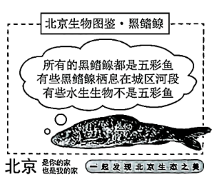
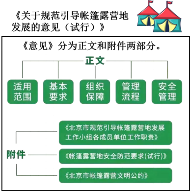
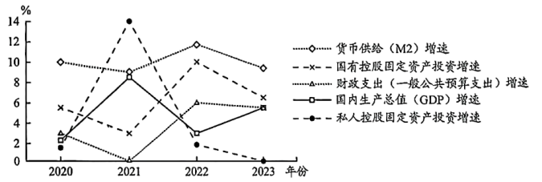
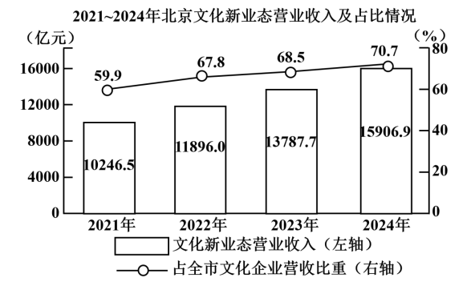

**北京市2025年普通高中学业水平等级性考试**

**思想政治**

**本试卷共9页，100分。考试时长90分钟。考生务必将答案答在答题卡上，在试卷上作答无效。考试结束后，将本试卷和答题卡一并交回。**

**第一部分**

**本部分共15题，每题3分，共45分。在每题列出的四个选项中，选出最符合题目要求的一项。**

1\. 2025年春天，“红色·记忆——北京革命旧址和纪念设施手绘作品展”（部分作品如上图所示）对观众开放，展出的作品全部由青年学生精心绘制，以“红色地标、伟大觉醒、中流砥柱、红色黎明、进京赶考”5个板块重现百年大党的光辉历程。展出的手绘作品（ ）

①传承中国革命事业的精神血脉，展现了党和人民共同谱写的奋斗乐章

②以社会主义制度的创立和发展为主线，介绍具有地域特色的文化资源

③复原了革命原址的文化价值，成为百年红色记忆版图的重要组成部分

④用青春之画笔描绘党的初心和使命，激励青年在新时代继续砥砺前行

A. ①③ B. ①④ C. ②③ D. ②④

【答案】B

【解析】

【详解】①：作品通过描绘革命旧址和纪念设施，传承了中国革命事业的精神血脉，生动展现了党和人民共同奋斗的历史篇章，契合展览“重现百年大党的光辉历程”的主题，①正确。

②：展览的主线是党的光辉历程（从革命斗争到建立新中国），而非社会主义制度的创立和发展。社会主义制度的确立是新中国成立后的事情，但展览板块（如“伟大觉醒”“进京赶考”）更侧重于革命历史和党的奋斗，而非社会主义制度的创立和发展；该选项中“以社会主义制度的创立和发展为主线”的说法错误，②排除。

③：展出的手绘作品有利于展现和传播革命原址的文化价值，而不是“复原”革命原址的文化价值，③排除。

④：展出的手绘作品全部由青年学生精心绘制，以“红色地标、伟大觉醒、中流砥柱、红色黎明、进京赶考”5个板块重现百年大党的光辉历程，这说明这些手绘作品体现了青年学生用青春之画笔描绘党的初心和使命，有利于激励青年在新时代继续砥砺前行，④正确。

故本题选B。

2\. 近年来，北京市中小学在综合实践活动课程方面展开创新尝试：“泥土里长出了课程”，学生在种花种草时观察植物生长，在磨豆腐时预估产量；学校周边公园化身为“乐学公园”，学生一起绘制公园地图、参与公园规划。通过这些活动，学生可以（ ）

①在解决问题的实践中，深化对知识的理解

②积累生活经验，用形象思维揭示事物的本质和规律

③在跨学科的学习体验中，提升解决复杂问题的能力

④在问题导向的情境任务中，突破思维能力的限制

A. ①③ B. ①④ C. ②③ D. ②④

【答案】A

【解析】

【详解】①：实践是认识的基础，学生在种花种草、磨豆腐等实践中解决实际问题（如预估产量、观察生长规律），将书本知识应用于实际情境，从而深化对知识的理解，①符合题意。

②：形象思维可以触及事物的本质和规律，不能揭示事物的本质和规律，抽象思维可以揭示事物的本质和规律，②说法错误。

③：活动整合了多学科知识（生物、数学、地理等），如绘制公园地图需结合空间规划和环境知识，磨豆腐涉及产量计算。这种跨学科体验帮助学生面对复杂现实问题（如公园规划），提升综合分析和解决能力，③符合题意。

④：人的思维能力受多种因素制约，虽然在问题导向的情境任务中，学生的思维能力可以得到锻炼和提升，但“突破思维能力的限制”，夸大了其作用，④说法错误。

故本题选A。

3\. 杏花春雨、大漠孤烟、小桥流水、长河落日……品味这些流动在古诗词中的意象，赏其美、品其意、传其神，要能够“以我之诗心，鉴照古人之诗心”。这里的“鉴照”说明（ ）

①古今诗心相映，符合同一律的思维要求

②古诗词有满足今人精神需要的功能和属性

③千秋一寸心，文化可以跨越时空使人心灵相通

④中华文明具有突出的连续性和统一性，可以实现物我融合

A. ①② B. ①④ C. ②③ D. ③④

【答案】C

【解析】

【详解】“以我之诗心，鉴照古人之诗心”中，“鉴照”指用自己的心灵（诗心）去映照、理解古人的心灵（诗心），体现了一种跨越时空的文化共鸣和精神沟通。

①：同一律指的是在同一思维过程中，概念和判断要保持自身的确定性，不能混淆或偷换概念。 题干中 “鉴照” 的核心是古今诗心的共鸣（强调心灵相通），而非逻辑上的概念同一，①排除。

②：题干中“鉴照”体现了古诗词作为文化遗产，能够唤起现代人的情感共鸣，满足其精神需求（如审美、情感寄托），这说明古诗词有满足今人精神需要的功能和属性，②正确。

③：“鉴照”直接点明文化（如古诗词）具有跨越时空的力量，能让今人与古人的心灵相通。强调了文化在时间维度上的连续性和沟通性，③正确。

④：中华文明的连续性和统一性是其特点，但题干强调的古今的“诗心鉴照”（人与人心灵的沟通），而非“物我融合”（人与自然或情景交融），④与题意不符。

故本题选C。

4\. 广袤的野鸭湖湿地里，全新启用的AI“鹰眼”鸟类监测系统如同敏锐的猎手，一旦有鸟类进入视野，便能快速识别它们的种类、数量和行为信息，为生态保护工作提供有力的数据和技术支持。该“鹰眼”系统（ ）

A. 可以获取鸟群的鲜活印象，是感性认识的最终目的

B. 重现鸟群的外部联系，实现了从感觉向表象的跃升

C. 激发人的主观能动性，给鸟类活动打上了人的烙印

D. 延伸了人的认识器官，有助于把握鸟类活动的规律

【答案】D

【解析】

【详解】A：感性认识的最终目的是为了上升到理性认识并指导实践，改造客观世界，AI “鹰眼” 系统获取的鸟类图像、数量等信息属于感性认识的范畴，但它的存在是为了通过数据分析进一步揭示鸟类活动的规律来指导实践，A排除。

B：感觉和表象都是感性认识，“跃升” 更强调从感性认识到理性认识的质变，而该选项未体现这一层次，B排除。

C：主观能动性是人认识和改造世界的能力，AI系统作为工具，确实需要人来设计和使用，体现了激发人的主观能动性，但鸟类活动的规律是客观存在的，系统的作用是 “监测” 而非 “改造”或打上了人的“烙印”，C排除。

D：人的肉眼观察范围和精度有限，而“鹰眼”系统作为技术手段，延伸了人的视觉器官，同时，系统通过实时数据采集和分析，能帮助科研人员更精准地把握鸟类的活动规律，D正确。

故本题选D。

5\. 近年来，北京市的水生态保护工作成效斐然，全市八成以上水体达到了健康等级。曾经在山区清洁水体中才能见到的“五彩鱼”家族——宽鳍鱲（liè）、马口鱼和黑鳍鳈（quán）等，如今成了城区河段的常客。运用演绎推理方法，从下图中的三个性质判断可以推出（ ）

A. 有些五彩鱼不是黑鳍鳈

B. 所有的五彩鱼都是水生生物

C. 有些水生生物栖息在城区河段，或有些水生生物是黑鳍鳈

D. 有些五彩鱼栖息在城区河段，且有些五彩鱼是黑鳍鳈

【答案】C

【解析】

【详解】A：由“所有的黑鳍鳈都是五彩鱼”，我们只能推出“有些五彩鱼是黑鳍鳈”，根据换位推理规则，无法得出“有些五彩鱼不是黑鳍鳈”，A排除。

B：题干仅表明黑鳍鳈（五彩鱼的一部分）和部分水生生物与五彩鱼的关系，无法从现有条件必然推出所有五彩鱼都是水生生物。 存在其他五彩鱼可能不属于水生生物的可能性，B排除。

C：因为“有些黑鳍鳈栖息在城区河段”且“所有的黑鳍鳈都是五彩鱼”，那么必然能得出有些五彩鱼栖息在城区河段，也就是有些水生生物栖息在城区河段；同时“所有的黑鳍鳈都是五彩鱼”也能得出有些水生生物是黑鳍鳈，所以可以推出“有些水生生物栖息在城区河段，或有些水生生物是黑鳍鳈”，C正确。

D：这是一个联言推理，要求各联言支都是真的，这个联言判断才是真的，虽然知道有些黑鳍鳈栖息在城区河段且所有黑鳍鳈都是五彩鱼，但不能必然得出“有些五彩鱼栖息在城区河段，且有些五彩鱼是黑鳍鳈”，D排除。

故本题选C。

6\. 葱，与中国人相伴数千年，无数菜肴的调味都少不了一把“灵魂小葱”。从餐盘跃上纸张，葱又成为了美好的文化象征。我们用“葱指”形容纤纤玉手，用“葱茏”吟诵田园山色，用“青葱”赞美青春。葱的美好象征（ ）

A. 表明反向思考的方法可以打破葱单一性质的局限

B. 说明思维可以把对葱的感性具体转化为思维抽象

C. 源自对葱的实际用途和外在形象的类比推理

D. 体现了从“青春”到“青葱”的辩证否定过程

【答案】B

【解析】

【详解】A：反向思考是从与原有思路相反的方向寻求解决问题的答案。材料中葱的美好象征是从葱本身的特点进行联想，并非反向思考打破葱单一性质局限，A不符合题意。

B：思维抽象是指从多样性统一的事物整体中抽取某一方面的本质规定，或者从事物个性中抽取其共性的思维活动。“葱指”形容纤纤玉手，“葱茏”吟诵田园山色，“青葱”赞美青春，这是把对葱的感性具体（葱的形象等）转化为思维抽象（用葱来象征其他美好事物），B正确。

C：类比推理是根据两个或两类对象在一些属性上相同或相似，推出它们在其他属性上也相同或相似的推理。葱的美好象征不是通过类比推理得来，而是基于对葱的特点的联想，C不符合题意。

D：辩证否定是既肯定又否定，既克服又保留。从“青春”到“青葱”不是辩证否定过程，而是一种象征联想，D不符合题意。

故本题选B。

7\. 2025年1月8日，教育部、国家语委、中央网信办共同印发《关于加强数字中文建设推进语言文字信息化发展的意见》。数字中文建设通过“语料库构建”和“语料数字化”，推动中文从“信息载体”向“生产要素”转型，全力服务教育强国、科技强国和文化强国建设。数字中文建设（ ）

A. 将改变判断的语言形式，有利于通过逻辑训练提升思维能力

B. 可以用系统化、数字化的语词把知识巩固下来，形成新概念

C. 通过联想思维对中文载体进行交换性思考，转化为生产要素

D. 需要运用超前思维引领未来，提前部署语言资源和关键技术

【答案】D

【解析】

【详解】D：数字中文建设需运用超前思维（如政策规划中的前瞻性），引领未来发展，提前部署语言资源（语料库构建）和关键技术（语料数字化），以服务教育、科技和文化强国建设。这符合题干强调的战略部署和未来导向，D正确。

A：题干强调中文功能的转型（从信息载体到生产要素），未涉及“改变判断的语言形式”或“逻辑训练提升思维能力”，A排除。

B：语料数字化虽能系统化巩固知识，但题干重点在于中文作为生产要素的转型，服务于国家建设，而非“形成新概念”，B排除。

C：题干未提及“联想思维”或“交换性思考”，中文转型是通过技术手段（语料库构建和数字化）实现，而非特定思维方式，C排除。

故本题选D。

8\. 在我国边疆一个多民族聚居的村庄，人们传唱着喀喇沁旗原创歌曲《石榴千籽同心聚》：“同顶一片天，脚踏一方地。五十六族兄弟姐妹根脉连一起，你帮助我，我支持你……”村里现有40名党员，他们带领村民们共建美好家园；在村党群服务中心的“四点半课堂”上，老师给孩子们讲述着民族团结的动人佳话；常来常往的“乌兰牧骑”在村民委员会前的小广场上，歌颂着各族儿女对党和国家的热爱。这一生动的案例表明（ ）

①党领导各族群众推动边疆地区经济社会发展

②村民通过村民委员会依法间接行使民主权利

③民族团结进步教育有助于加强各民族交往交流交融

④历史文化因素是民族区域自治制度设计的重要依据

A. ①② B. ①③ C. ②④ D. ③④

【答案】B

【解析】

【详解】①：材料中的“40名党员带领村民们共建美好家园”，体现了党在基层的领导作用，推动边疆地区的发展，①正确。

②：村民委员会是基层群众性自治组织，村民通过村民会议等形式直接行使民主权利，而非间接行使，②错误。

③：材料提到“四点半课堂”讲述民族团结的佳话，“乌兰牧骑”歌颂各族儿女对党和国家的热爱，体现了民族团结教育促进各民族交往交流交融，③正确。

④：材料中的案例主要强调民族团结进步教育的意义，而材料并未涉及民族区域自治制度的设计依据，也未涉及历史文化因素，④不符合题意。

故本题选B。

9\. 近年来，露营成为北京市民新的休闲方式，赏花、钓鱼、观鸟……丰富多彩的户外活动吸引着越来越多人走进自然，释放消费活力。为引导露营市场的有序发展，北京市相关部门制定了《关于规范引导帐篷露营地发展的意见（试行）》。这一文件（ ）

A. 既规范相关行业行为，也规范政府权力运行

B. 充分发挥乡规民约作用，解决基层社会治理难题

C. 凸显政府关注新兴领域，旨在规范市民露营行为

D. 通过单行条例的规范作用，实现社会自我治理

【答案】A

【解析】

【详解】A：政府制定《关于规范引导帐篷露营地发展的意见（试行）》，一方面对露营相关行业进行规范，比如规定露营地的设立标准、经营要求等，从而规范相关行业行为，引导露营市场有序发展。 另一方面，该文件也规范了政府权力运行，明确政府在管理露营市场过程中的职责、权限和工作流程等，防止权力滥用， A正确。

B：乡规民约是由乡村群众集体制定并共同遵守的行为规范，适用于乡村基层社会治理。而本题中是北京市相关部门制定的规范性文件，不属于乡规民约 ，B错误。

C：政府制定该文件确实关注到了露营这一新兴领域，但目的不仅仅是规范市民露营行为，更重要的是规范整个露营市场，促进露营行业健康、有序发展，释放消费活力，推动经济社会发展等。“旨在规范市民露营行为” 表述片面，C错误。

D：单行条例是民族自治地方的人民代表大会根据区域自治的特点和实际需要制定的单项法规。本题中北京市相关部门制定的《关于规范引导帐篷露营地发展的意见（试行）》不属于单行条例，同时也不是社会自我治理，而是政府对露营市场的管理规范，D错误。

故本题选A。

10\. 书法家甲将自己书写的一幅具备独创性的春联书法作品“天泰地泰三阳泰，家和人和万事和”（内容选自清代刻本）赠与乙以贺新春。乙收到后很喜欢，未经甲授权就将春联上的字整体扫描后完整再现于新开发的文创产品的外观设计，产品十分热销。结合上述事实，下列说法正确的是（ ）

A. 即便甲从未将其书法与产品结合用于申请专利，乙的行为仍侵害甲的专利权

B. 春联上的语句属于公共领域的文字作品，乙的行为不侵害甲的著作权

C. 春联完成交付后，乙享有春联所有权，乙的行为属于所有权的正常行使

D. 甲乙之间成立赠与合同，该合同履行并不转让春联所涉书法作品的著作财产权

【答案】D

【解析】

【详解】A：专利权是权利人就特定的发明创造依法在规定期限内享有的专有权。甲对书写的书法作品享有著作权，乙的行为侵犯了甲的著作权而不是专利权，A 错误。

B：虽然春联语句选自清代刻本属于公共领域文字，但甲书写的春联书法作品具备独创性，属于著作权法保护的美术作品。乙未经甲授权将书法字用于文创产品外观设计，侵犯了甲的著作权，B错误。

C：春联完成交付后，乙获得了春联的所有权，但所有权的行使不能侵犯他人的知识产权。甲虽将春联实物赠与乙，但著作权中的著作财产权（如复制权等）并未随所有权转移。乙未经许可将书法字用于文创产品外观设计，超出了所有权正常行使范围，侵犯了甲的著作权，C错误。

D：甲将春联赠与乙，甲乙之间成立赠与合同。根据著作权法规定，美术等作品原件所有权的转移，不视为作品著作权的转移，即不转让春联所涉书法作品的著作财产权，D正确。

故本题选D。

11\. 遗嘱关乎财富与爱的传承，普及遗嘱是社会共同责任。下列说法正确的是（ ）

A. 甲生前先办理了公证遗嘱，临终前又立了一份录像遗嘱，两份遗嘱内容相抵触，应以公证遗嘱为准

B. 乙立遗嘱将所有财产留给女儿，则女儿凭该遗嘱继承乙的遗产时不需要承担乙未偿还的债务

C. 丙生前仅立有一份遗嘱，但该遗嘱因不符合法定形式要件而被认定无效，则其遗产应按法定继承办理

D. 丁立遗嘱表示去世后要将自己收藏的字画赠给美术馆，这属于遗嘱继承

【答案】C

【解析】

【详解】A：根据民法典的新规定，公证遗嘱不再具有高于其他遗嘱的效力。遗嘱人可以撤回、变更自己所立的遗嘱。立遗嘱后，遗嘱人实施与遗嘱内容相反的民事法律行为的，视为对遗嘱相关内容的撤回。立有数份遗嘱，内容相抵触的，以最后的遗嘱为准。因此甲临终前的录像遗嘱是最后一份遗嘱，应以其为准，而非公证遗嘱，A错误。

B：继承人不仅会获得被继承人的遗产，还需要承担被继承人未偿还的债务。本应由被继承人偿还的债务，应由继承人在继承的遗产范围内承担清偿责任，超过部分不负责清偿责任，但继承人自愿偿还的除外。可见，女儿凭该遗嘱继承乙的遗产时需要承担乙未偿还的债务，但超过部分可以不负责清偿责任，B错误。

C：有遗嘱的，按照遗嘱继承或遗赠办理；但若遗嘱无效，则按法定继承办理。丙的遗嘱不符合法定形式要件而被认定无效，其遗产应依法定继承办理，C正确。

D：自然人可以立遗嘱将个人财产赠与国家、集体或者法定继承人以外的组织、个人，这属于遗赠。遗赠不属于继承，遗嘱继承是在法定继承人的范围内确定具体继承人及份额。因此丁立遗嘱将财产通过赠与法定继承人以外的组织或个人（如美术馆），属于遗赠，D错误。

故本题选C。

12\. 2020—2023年，我国部分宏观经济指标的年度增速变化如下图所示。

据此，下列说法正确的是（ ）

①2021年货币供给规模下降，使私人控股企业投资增速放缓

②国有控股企业投资增速逆周期变化，为宏观调控作出贡献

③财政支出和货币供给协同配合，促进国民经济平稳运行

④2022年私人控股企业投资减少，引起国有控股企业投资增速加快

A. ①③ B. ①④ C. ②③ D. ②④

【答案】C

【解析】

【详解】①：由图可知2021年货币供给增速稍有下降，私人控股固定资产投资增速显著加快，并不能够得出2021年货币供给规模出现下降的现象，也不能得出因此使私人控股企业投资增速放缓，①排除。

②：国有企业在经济波动中发挥着“稳定器”作用，由图可知其投资增速在经济下行期逆势上升，体现了国企投资响应政策导向以稳定增长，为宏观调控作出了应有贡献，②正确。

③：由图可知财政支出增速和货币供给增速保持着相对稳定的协同发展趋势，其年份增速变化趋势一致，相互配合进行科学的宏观调控以促进国民经济平稳运行，③正确。

④：私人投资减少和国有企业投资提速可能存在时间关联，但不存在直接因果关系。国有投资加速是主动的逆周期调控，而非被动响应私人控股企业投资变化，宏观调控才是其投资变化的核心驱动力，④排除。

故本题选C。

13\. 北京拥有发展商业航天的政策、用户、厂商、人才、资本等方面的优质资源，目前，已形成覆盖产业链上下游全部环节的“南箭北星”布局：北京经济技术开发区、大兴区集聚商业火箭研发制造企业，形成“南箭”产业集群；海淀区集聚众多商业卫星制造、测运控和运营企业，形成“北星”产业集群。关于北京商业航天产业，下列说法正确的是（   ）

①产业集群化发展，促进资源共享和协同创新

②政府的政策引导，有助于优化产业空间布局

③劳动密集度高，有利于发挥北京的资源优势

④市场需求有限，产业链上下游形成市场垄断

A. ①② B. ①④ C. ②③ D. ③④

【答案】A

【解析】

【详解】①：北京商业航天产业已形成“南箭北星”的产业集群布局（火箭研发制造在“南箭”，卫星相关产业在“北星”），并拥有政策、用户、厂商等资源，说明产业集群化发展（如“南箭北星”）能促进企业间资源共享和协同创新，提高产业效率，①正确。

②：北京拥有“政策”资源，且“南箭北星”的布局（火箭与卫星产业分区域集聚）体现了政策对产业空间结构的主动规划。这种区域分工需要政府通过土地、资金、配套等政策引导企业合理分布，从而避免同质化竞争、提升整体效率，②正确。

③：商业航天属于技术密集型而非劳动密集型产业，③排除。

④：题干提到北京拥有“用户”资源，表明市场需求潜力巨大（如卫星互联网、太空经济等）；而且产业链上下游企业是协同关系而非垄断关系，该选项中“形成市场垄断”的说法错误，④排除。

故本题选A。

14\. 2025年，“新型离岸贸易”一词首次亮相国务院《政府工作报告》。离岸贸易的特点为资金流过境而货物流不过境。如下图所示，中国企业借助数字化平台实现了从传统离岸贸易中“输出中国货”到新型离岸贸易中“整合全球货”的角色转变。

我国发展新型离岸贸易（ ）

①能够提升我国跨境资本流动监管能力，降低金融风险

②可以降低贸易物流成本、缩短交货周期，活跃国际贸易

③有助于我国企业主导离岸贸易价值链，实现价值链跃升

④有利于扩大我国跨境货物进出口规模，巩固贸易大国地位

A. ①③ B. ①④ C. ②③ D. ②④

【答案】C

【解析】

【详解】①：材料反映的是我国发展新型离岸贸易的表现与中国企业的角色转变，未体现提升跨境资本流动监管能力、也不能降低金融风险，①错误。

②：传统离岸贸易是“输出中国货”，新型离岸贸易是“整合全球货”，借助数字化平台，实现货物不过境，能降低贸易物流成本、缩短交货周期，活跃国际贸易，②正确。

③：中国企业从传统离岸贸易“输出中国货”到新型离岸贸易“整合全球货”，有助于我国企业主导离岸贸易价值链，实现价值链跃升，③正确。

④：新型离岸贸易货物不过境，不会扩大跨境货物进出口规模，④错误。

故本题选C。

15\. 近年来，来自中国的智慧农业技术在助力发展中国家农业现代化进程中发挥了重要作用：水果三维无损检测系统使马来西亚的榴莲分级准确率提升了40倍，甘蔗收割机帮助巴巴多斯实现了甘蔗收割的机械化和自动化，基于北斗导航技术的植保无人机助力莫桑比克农民提高播种效率……我国“智慧农业”出海（ ）

①适应经济全球化新形势，推动更高水平开放型经济发展

②坚持打开国门搞建设，通过产业升级吸引全球资源要素

③通过技术赋能农业合作，助推人类命运共同体建设

④积极应对非传统安全挑战，推进全球治理体制变革

A. ①③ B. ①④ C. ②③ D. ②④

【答案】A

【解析】

【详解】①：智慧农业技术出海，向发展中国家输出技术推动了农业领域的国际合作，体现了我国适应经济全球化新形势，推动更高水平开放型经济发展，①正确。

②：“打开国门搞建设” 侧重引进外部资源，如外资、技术，但材料中中国智慧农业是技术输出，是 “走出去”，目的是帮助他国实现农业现代化，而非通过产业升级 “吸引” 资源，该选项与题干主旨不符，②排除。

③：中国向发展中国家提供智慧农业技术，帮助其提升农业效率，这是通过技术赋能推动国际农业合作的体现。也符合 “共同发展、合作共赢” 的人类命运共同体理念，③正确。

④：非传统安全挑战指气候变化、粮食安全、疫情等问题，而材料主要强调技术助力农业现代化，并且全球治理体制变革涉及国际规则、机制的调整，题干中也没有相关信息，④排除。

故本题选A。

**第二部分**

**本部分共6题，共55分。**

16\. 【人见人爱的兔儿爷】泥彩塑兔儿爷曾是旧时京城中秋应节应令的儿童玩具，是许多人喜爱的吉祥物，也是北京城的经典符号之一，2014年被列入国家级非物质文化遗产项目名录。

【兔儿爷一杆旗的由来】“金盔金甲捣药杵，山形眉三瓣嘴，身后一杆靠背旗”。兔儿爷的背后插着一杆旗，相传是因为玉兔为京城百姓祛病除灾，日夜辛劳，最终累倒在庙门外的一杆旗杆下。这是兔儿爷作为守护者的历史渊源。人们喜爱兔儿爷，不仅因为其形象可爱，还因为它承载着人们对护佑平安的美好愿望。

【兔儿爷的衍生形象】兔儿爷的形象在发展过程中融入了许多新的元素，出现了娃娃型、卡通型等各种式样，一些设计为了展现美观和威武之气，吸纳了京剧武生的形象特点，将其身后的靠背旗从一杆增加到两杆甚至四杆。这种改变引发了一部分人的担忧，认为一杆旗不仅是兔儿爷形象的重要标志，更象征着兔儿爷治病救人的深厚历史和文化寓意，提出兔儿爷的传承要原汁原味。

结合材料，运用《哲学与文化》知识，谈谈你对非遗传承要原汁原味这一观点的思考。

【答案】

①文化继承是发展的前提。兔儿爷的“一杆旗”是其历史渊源和文化寓意的核心符号（如祛病除灾的守护者形象），原汁原味的传承能保留非物质文化遗产的“本真性”，避免文化内涵在演变中流失。传统符号（如京剧武生元素的融入）若过度改变，可能削弱其作为北京经典文化符号的辨识度，影响人们对非遗的历史记忆和情感联结。

②文化在发展中传承。兔儿爷衍生形象（如卡通型、多杆旗设计）反映了现代社会对审美和功能的新需求，创新能增强非遗的生命力，扩大其传播范围（如吸引年轻群体）。非遗的传承本质是“活态传承”，京剧元素的融入正是传统文化间交融创新的例证，符合文化发展的客观规律。

③在保留兔儿爷“一杆旗”象征意义（核心文化内涵）的基础上，可通过创新形式（如衍生品设计）拓展其表现力，实现“形变神不变”。参考国家级非遗保护要求，可通过数字化记录、传统工艺保护等方式留存原真形态，同时鼓励符合现代审美的创造性转化。

④非遗传承既要“原汁原味”地保护文化根脉，又需“与时俱进”地创新发展。关键在于把握文化内核与外在形式的辩证关系，在守护精神价值的同时，赋予其时代生命力。

【解析】

【分析】背景素材：兔儿爷非遗文化的发展     

考点考查：继承发展中华优秀传统文化、文化发展基本路径

能力考查：描述和阐释事物、论证和探究问题

核心素养：政治认同、科学精神

【详解】第一步：审设问。明确主体、作答范围、问题限定和作答角度。

本题为认识类主观题，主体是你，要求运用哲学与文化知识，从为什么、如何做角度来分析作答。

第二步：审材料，通过标点符号、段落等，提取材料有效信息。

有效信息①：兔儿爷的背后插着一杆旗是兔儿爷作为守护者的历史渊源→可运用继承与发展的关系知识，从继承角度分析说明兔儿爷的“一杆旗”是其历史渊源和文化寓意的核心符号，原汁原味的传承能保留非物质文化遗产的“本真性”，避免文化内涵在演变中流失。

有效信息②：兔儿爷的形象在发展过程中融入了许多新的元素→可运用继承与发展的关系知识，从发展角度分析说明兔儿爷衍生形象反映了现代社会对审美和功能的新需求，创新能增强非遗的生命力，扩大其传播范围。

有效信息③：一杆旗不仅是兔儿爷形象的重要标志，更象征着兔儿爷治病救人的深厚历史和文化寓意→可运用弘扬中华优秀传统文化知识，从创造性转化角度分析说明通过数字化记录、传统工艺保护等方式留存原真形态，同时鼓励符合现代审美的创造性转化。

有效信息④：一些设计为了展现美观和威武之气，吸纳了京剧武生的形象特点，将其身后的靠背旗从一杆增加到两杆甚至四杆→可运用文化发展的基本路径知识，从立足时代之基、回答时代问题角度分析说明守护精神价值的同时，赋予其时代生命力。

第三步：整合信息，组织答案。注意设问限定以及教材知识与材料、时政信息等相结合。

17\. 为了“解决好人民最关心最直接最现实的利益问题”，北京市不断完善以市民服务热线为主渠道的群众诉求与回应机制，生动展现了超大城市治理现代化的进程，打造了“中国之治”的首都样板。

上图呈现了以市民服务热线为主渠道群众诉求与回应机制的变迁。运用《政治与法治》知识，从动力、机制和技术三个角度中任选两个角度对这一变迁进行分析。

【答案】动力角度分析：①坚持以人民为中心。我国是人民民主专政的社会主义国家，人民是国家的主人。解决人民最关心最直接最现实的利益问题是政府工作的出发点和落脚点。从各区建立居民委员会收集居民意见，到后续不断完善群众诉求回应机制，根本动力在于践行以人民为中心的发展思想，保障人民当家作主，维护人民的合法权益。政府积极倾听群众呼声，回应群众诉求，是为了更好地服务人民，提高人民群众的获得感、幸福感和安全感。②提升治理能力现代化的需求。随着经济社会的发展，超大城市治理面临诸多问题，完善群众诉求与回应机制是推进城市治理体系和治理能力现代化的必然要求。通过这一机制的不断改进，能及时发现并解决城市治理中的短板和漏洞，提升城市治理的科学性、有效性。

机制角度分析：①制度建设不断完善。从接诉即办工作机制建立到工作条例的实施，再到全流程工作机制的完善，体现了制度建设的不断推进。制度的完善为群众诉讼的表达和解决提供了坚实的保障，使政府工作有法可依、有章可循，确保群众诉求能够得到及时、规范的处理。②工作流程日益优化。完善“接、派、办、评”全流程工作机制，引导多元力量参与治理，整合了各方资源，形成治理合力，提高了治理效率和效果。

技术角度分析：①信息化平台提升服务效能。信息化平台打破了部门之间的信息壁垒，实现了信息共享和业务协同，方便群众诉讼的表达，提高了政府部门处理诉求的效力，让群众诉求能够得到快速响应和处理，提升了公共服务的整体效能。②大数据助力精准治理。大数据技术能够对海量的群众诉求数据进行分析挖掘，发现潜在的民生问题，使政府能够提前介入，主动解决问题，变被动响应为主动治理，提高治理的精准性和前瞻性。

【解析】

【分析】背景素材：北京市不断完善以市民服务热线为主渠道的群众诉求与回应机制

考点考查：人民民主专政的社会主义国家、法治政府

能力考查：描述和阐述事物、论证和探究问题的能力

核心素养：政治认同、科学精神、法治意识

【详解】第一步：审设问，明确主体、作答范围、问题限定和作答角度。本题属于分析说明类主观题，需调用人民民主专政的社会主义国家、法治政府的相关知识结合材料有效信息分析作答。

第二步：审材料，提取关键词，链接教材知识。

动力角度分析

关键词①：通过走访形式反映居民意见和要求，设立“群众呼声电话”→从以人民为中心的角度分析：联系国家性质、政府工作的出发点和落脚点，分析不断完善群众诉求回应机制的根本动力是保障人民当家作主，政府积极倾听群众呼声，回应群众诉求，是为了更好地服务人民。

关键词②：通过大数据“算出”民生痛点，建立“每月一题”机制，推动接诉即办向“主动治理、未诉先办”深化，完善“接、派、办、评”全流程工作机制，引导多元力量参与治理→从治理能力提升的角度分析：联系促进国家治理体系和治理能力现代化，分析机制的不断改进，可以提升城市治理的科学性、有效性。

机制角度分析

关键词①：以12345市民服务热线为主要载体的接诉即办工作机制，建立“每月一题”机制，推动接诉即办向“主动治理、未诉先办”深化，完善“接、派、办、评”全流程工作机制→从制度建设不断完善的角度分析：联系法治政府建设意义，分析制度的完善使政府工作有法可依，更好解决群众诉求。

关键词②：完善“接、派、办、评”全流程工作机制，引导多元力量参与治理→从工作流程日益优化的角度分析：联系社会治理，分析引导多元力量参与治理，形成治理合力，提高了治理效率和效果。

技术角度分析

关键词①：以12345市民服务热线为主要载体的接诉即办工作机制，整合全市服务热线，建立“每月一题”机制，推动接诉即办向“主动治理、未诉先办”深化，完善“接、派、办、评”全流程工作机制→从服务效能的角度分析：联系法治政府建设意义，分析信息化平台的完善提高了政府部门处理诉求的效力，及时解决群众诉求，提升了公共服务的整体效能。

关键词②：通过大数据“算出”民生痛点，建立“每月一题”机制，推动接诉即办向“主动治理、未诉先办”深化→从社会治理的角度分析：联系高效政府，分析运用现代化科技手段，不断提高行政效率和水平，提高治理的精准性和前瞻性。

第三步：整合信息，组织答案。注意设问限定以及教材知识与材料、时政信息等相结合。

18\. 以人为本，智能向善。

材料一 脑机接口被称为人脑与外界沟通交流的“信息高速公路”，通过识别脑电波特征，读取人脑意图，实现人与外部设备之间的交互，其技术路径主要包括植入式和非植入式。目前，在医疗健康领域，脑机换口为神经系统疾病患者带来了新的治疗希望和康复途径，如帮助丧失行动能力的人在植入式手术后重拾运动机能。

科技是发展的利器，也可能成为风险的源头。脑机接口技术是对大脑神经活动的干预和指导，技术实施方要充分认识到该技术的使用可能会给人的身心和权利带来影响，对使用中可能导致的身心伤害与权利侵犯应采取严格的伦理审查措施。

我们要坚持科技向善，前瞻性研判脑机接口技术带来的挑战。《中华人民共和国民法典》坚持以人为本，人格权独立成编，有效协调了人格权请求权和侵权损害赔偿请求权的关系，采用多种方式实现对人格权的全面保护。脑机接口技术发展需要法律的保驾护航。

（1）结合材料一，运用“民事权利与义务”知识，谈谈脑机接口技术应用会对哪些人格权益产生影响，以及如何依法保护这些人格权益。

材料二 人工智能正深刻改变着人们的生产、生活、学习方式，推动人类社会迎来人机协同、跨界融合、共创分享的智能时代。其中，生成式人工智能已经在对话、写作、影像生成等领域展现出接近人类水平的创作能力，可以胜任多种复杂场景任务，降低了人们处理复杂问题的门槛。不过，生成式人工智能的输出内容依赖其数据集与算法，而且会受到提问方式的影响。若一味接受其输出的信息而缺乏甄别，可能会落入由算法和信息所虚构的“真相陷阱”。智能时代的机遇和挑战，对人的思维品质提出了更高要求。

（2）结合材料二，运用《逻辑与思维》知识，分析如何提升思维品质以应对智能时代的机遇和挑战。

【答案】（1）脑机接口对人格权产生影响：①生命权、身体权和健康权。脑机接口技术涉及对大脑神经活动的干预，尤其是植入式技术，在手术及使用过程中，若操作不当或技术存在缺陷，可能对人体的生命安全、身体完整性及身体健康造成损害。②隐私权。该技术通过识别脑电波特征读取人脑意图，人的脑电波信息包含个人的思维、想法等隐私内容，若技术实施方对这些信息管理不善，可能导致个人隐私被泄露，侵犯隐私权。

保护人格权益：①技术实施方作为责任主体，应遵守相关法律法规和伦理规范。在实施脑机接口技术前，要进行严格的伦理审查，建立伦理审查机制，确保技术应用符合道德和法律要求。同时采取必要的安全保障，保护使用者的生命、身体和健康安全，防止隐私信息泄露。②通过法律强制力保障人格权益得到全面保护，为脑机接口技术发展营造良好的法治环境。权利人可依据民法典相关规定维护自身权益。

（2）①树立科学思维观念。科学思维追求认识的客观性，在智能时代，面对生成式人工智能输出的大量信息，树立科学思维观念，从实际出发，力图如实地反映认识对象，有助于我们以客观的态度去审视这些信息，不盲目跟从。

②运用辩证思维方法。辩证思维强调用联系、发展、全面的观点看待事物和思考问题。生成式人工智能既带来了如在多种领域展开创作能力、降低处理复杂问题门槛等机遇，也存在输出内容依赖数据集与算法、可能导致“真相陷阱”等挑战。我们运用辩证思维，全面地辩证的对待其发展，利用优势推动生产、生活、学习进步的同时，警惕带来的负面效应，做到趋利避害。

③培养创新思维能力。创新思维能突破常规，另辟蹊径。在智能时代，人机协同需要我们不断创新思维方式。一方面，我们可以借助人工智能提供的新工具、新数据，激发创新灵感，在对话、写作等领域创造出更具价值的成果；另一方面，面对人工智能的局限，通过创新思维去改进算法、优化数据集，推动人工智能技术进一步发展。

【解析】

【分析】背景素材：脑机接口技术的应用、人工智能的发展

考点考查：民事权利与义务、树立科学思维观念、运用辩证思维方法、提高创新思维能力

能力考查：描述和阐述事物、论证和探究问题的能力

核心素养：政治认同、科学精神、法治意识

【小问1详解】

第一步：审设问，明确主体、作答范围、问题限定和作答角度。本题两小问，第一问属于分析说明类主观题，第二问属于措施类主观题，需调用民事权利与义务的相关知识结合材料有效信息分析作答。

第二步：审材料，提取关键词，链接教材知识。

关键词①：脑机接口技术是对大脑神经活动的干预和指导，技术实施方要充分认识到该技术的使用可能会给人的身心和权利带来影响→从生命、身体和健康权的角度分析：脑机接口技术若操作不当或技术存在缺陷，可能对人体的生命安全、身体完整性及身体健康造成损害。

关键词②：通过识别脑电波特征，读取人脑意图→从隐私权的角度分析：若技术实施方对这些信息管理不善，可能导致个人隐私被泄露。

关键词③：技术实施方要充分认识到该技术的使用可能会给人的身心和权利带来影响，对使用中可能导致的身心伤害与权利侵犯应采取严格的伦理审查措施→从技术实施方的角度分析：应遵守相关法律法规和伦理规范，建立伦理审查机制，采取必要的安全保障。

关键词④：《中华人民共和国民法典》坚持以人为本，人格权独立成编，有效协调了人格权请求权和侵权损害赔偿请求权的关系，采用多种方式实现对人格权的全面保护→从权利人的角度分析：权利人可依据民法典相关规定维护自身权益。

第三步：整合信息，组织答案。注意设问限定以及教材知识与材料、时政信息等相结合。

【小问2详解】

第一步：审设问，明确主体、作答范围、问题限定和作答角度。本题属于措施类主观题，需调用树立科学思维观念、运用辩证思维方法、提高创新思维能力的相关知识结合材料有效信息分析作答。

第二步：审材料，提取关键词，链接教材知识。

关键词①：智能时代的机遇和挑战，对人的思维品质提出了更高要求→从树立科学思维观念的角度分析：联系科学思维的特征，分析科学思维追求认识的客观性，从实际出发，力图如实地反映认识对象，有助于我们以客观的态度去审视这些信息，不盲目跟从。

关键词②：生成式人工智能已经在多领域展现出接近人类水平创作能力，降低了人们处理复杂问题的门槛。不过，生成式人工智能的输出内容依赖其数据集与算法，可能会落入由算法和信息所虚构的“真相陷阱”→从运用辩证思维方法的角度分析：联系辩证思维的含义，分析要全面地辩证的对待人工智能的发展，利用优势的同时，警惕带来的负面效应，做到趋利避害。

关键词③：生成式人工智能已经在多领域展现出接近人类水平的创作能力，降低了人们处理复杂问题的门槛。不过，生成式人工智能的输出内容依赖其数据集与算法，可能会落入由算法和信息所虚构的“真相陷阱”→从提高创新思维能力的角度分析：联系创新思维的含义，分析要不断创新思维方式，借助人工智能提供的新工具、新数据，激发创新灵感，面对人工智能的局限，通过创新思维去改进并推动人工智能技术的发展。

第三步：整合信息，组织答案。注意设问限定以及教材知识与材料、时政信息等相结合。

19\. “十四五”开局以来，北京深入推进全国文化中心建设，文化产业繁荣发展。数字技术创新与文化产业融合发展激发文化生产领域的重大变革，产生众多文化新业态，呈现出技术高效赋能、产业快速发展的态势，为文化产业高质量发展提供了广阔空间。

|                                                                    |
|:------------------------------------------------------------------ |
| 新业态特征明显的行业包括广播电视集成播控、互联网搜索服务、数字出版、互联网文化娱乐平台、版权和文化软件服务、可穿戴智能文化设备制造等 |

（1）读图，分析北京文化产业的发展变化。

（2）结合材料，运用《经济与社会》知识，谈谈北京文化新业态的发展变化如何促进文化内需。

【答案】（1）文化新业态营业收入持续增长，文化新业态占全市文化企业营收比重稳步提升，说明文化新业态发展迅速，文化新业态在全市文化企业营收中所占份额越来越大，对北京文化产业发展的贡献日益突出，成为推动北京文化产业发展的重要力量，也反映出北京文化产业结构在不断优化，新兴文化业态的地位和作用愈发重要。

（2）①文化新业态创造出新的文化消费对象和消费方式，为消费者提供了更多样化的消费选择，改变了传统的文化消费方式，激发了消费者对新型文化产品和服务的需求，从而扩大了文化内需。②文化新业态的发展，往往伴随着技术创新和内容创新，提升了文化产品和服务的质量与水平，营造出良好的文化消费氛围，满足了消费者日益提高的文化消费需求，激发消费欲望，刺激消费者增加文化消费支出，推动文化消费市场的繁荣，拉动文化内需。

【解析】

【分析】背景素材：北京文化新业态发展情况

考点考查：我国的经济发展

能力考查：描述和阐述事物、论证和探究问题的能力

核心素养：政治认同、科学精神

【小问1详解】

第一步：审设问，明确主体、作答范围、问题限定和作答角度。

本题为图表题，具体结合图表进行信息解读。

第二步：审图表审图表标题、图表数据和注释。

关键词①：2021-2024年北京文化新业态营业收入情况→可联系文化新业态营业收入持续增长，说明文化新业态发展迅速。

关键词②：2021-2024年北京文化新业态营业收入占全市文化企业营收比重→可联系文化新业态在全市文化企业营收中所占份额越来越大，对北京文化产业发展的贡献日益突出，成为推动北京文化产业发展的重要力量。

关键词③：新业态特征明显的行业包括广播电视集成播控、互联网搜索服务、数字出版、互联网文化娱乐平台、版权和文化软件服务、可穿戴智能文化设备制造等→可联系北京文化产业结构在不断优化。

第三步：整合信息，组织答案。注意设问限定、图表信息以及教材知识与材料、时政信息等相结合。

【小问2详解】

第一步：审设问，明确主体、作答范围、问题限定和作答角度。本题属于措施类主观题，需调用我国的经济发展的相关知识结合材料有效信息分析作答。

第二步：审材料，提取关键词，链接教材知识。

关键词①：新业态特征明显行业包括广播电视集成播控、互联网搜索服务、数字出版、互联网文化娱乐平台、版权和文化软件服务、可穿戴智能文化设备制造等→从消费对象、方式的角度分析：联系供给侧结构改革，供给创造需求，分析文化新业态创造出新的文化消费对象和消费方式，激发了消费者对新型文化产品和服务的需求。

关键词②：数字技术创新与文化产业融合发展激发文化生产领域的重大变革，产生众多文化新业态，呈现出技术高效赋能、产业快速发展的态势→从消费质量、水平的角度分析：联系供给侧结构改革，供给创造需求，分析文化新业态提升了文化产品和服务的质量与水平，激发消费欲望。

第三步：整合信息，组织答案。注意设问限定以及教材知识与材料、时政信息等相结合。

20\. 2025年5月13日，国家主席习近平在中国—拉美和加勒比国家共同体论坛第四届部长级会议开幕式上宣布，中方愿同拉方携手启动团结、发展、文明、和平、民心“五大工程”。此举将推动中拉双方在各自现代化征程上并肩前行，共同谱写构建中拉命运共同体新篇章。“五大工程”的主要内容如下：

|      |                                                          |
|:----:|:-------------------------------------------------------- |
| 团结工程 | 坚定维护以联合国为核心的国际体系和以国际法为基础的国际秩序，在国际和地区事务中发出共同声音            |
| 发展工程 | 共同落实全球发展倡议，坚定维护多边贸易体制，维护全球产业链供应链稳定畅通，维护开放合作的国际环境         |
| 文明工程 | 共同落实全球文明倡议，树立平等、互鉴、对话、包容的文明观，弘扬和平、发展、公平、正义、民主、自由的全人类共同价值 |
| 和平工程 | 共同落实全球安全倡议，加强灾害治理、网络安全、反恐、反腐败、禁毒、打击跨国有组织犯罪等合作，努力维护地区安全稳定 |
| 民心工程 | 未来3年，中方将向拉共体成员国提供多项教育培训计划，实施300个“小而美”民生项目                |

党的二十大报告提出，中国推动构建新型国际关系，致力于扩大同各国利益的汇合点。结合材料，运用《当代国际政治与经济》知识，阐释“五大工程”如何扩大中拉利益汇合点。

【答案】①维护联合国为核心的国际体系和以国际法为基础的国际秩序，中拉在国际和地区事务中共同发声，有利于维护国际公平正义，扩大政治互信与共同话语权，为双方发展营造稳定国际环境，契合双方对良好国际秩序的诉求，扩大利益汇合点。

②落实全球发展倡议，维护多边贸易和产业链稳定，有利于促进中拉贸易与投资自由化便利化，推动双方经济发展，深化经济互补性，实现互利共赢，共享发展机遇，扩大经济利益汇合点。

③落实全球文明倡议，倡导平等包容的文明观，弘扬全人类共同价值，能促进文明交流互鉴，增进相互理解与信任，减少文化误解与冲突，为各领域合作筑牢人文基础，增强合作内生动力，从文化和价值观层面扩大利益汇合点。

④落实全球安全倡议，共同应对非传统安全威胁，维护地区稳定与共同安全利益，为双方发展筑牢安全屏障，扩大安全利益汇合点。

⑤中方为拉共体成员国提供教育培训和民生项目直接惠及拉美民众，改善当地民众生活，深化民间友好，夯实中拉友好民意基础，巩固长期合作的社会根基，从社会和民众层面扩大利益汇合点。

【解析】

【分析】背景素材：中方愿同拉方携手启动“五大工程”

考点考查：世界多极化、经济全球化

能力考查：描述和阐述事物、论证和探究问题的能力

核心素养：政治认同、科学精神

【详解】第一步：审设问，明确主体、作答范围、问题限定和作答角度。本题属于措施类主观题，需调用世界多极化、经济全球化的相关知识结合材料有效信息分析作答。

第二步：审材料，提取关键词，链接教材知识。

关键词①：坚定维护以联合国为核心的国际体系和以国际法为基础的国际秩序，在国际和地区事务中发出共同声音→从政治的角度分析：联系推动世界和平与发展的举措，分析政治互信，提升发展中国家的话语权，维护国际公平正义，推动国际关系民主化，构建新型国际关系，良好的国际秩序。

关键词②：共同落实全球发展倡议，坚定维护多边贸易体制，维护全球产业链供应链稳定畅通，维护开放合作的国际环境→从经济的角度分析：联系人类命运共同体的要求，经济全球化发展，分析多边贸易，产业链互补，互利共赢，共享发展机遇。

关键词③：共同落实全球文明倡议，树立平等、互鉴、对话、包容的文明观，弘扬和平、发展、公平、正义、民主、自由的全人类共同价值→从文化的角度分析：联系人类命运共同体的要求，国际关系民主化，分析全人类共同价值，尊重文化多样性，消除文明冲突，凝聚价值共识。

关键词④：共同落实全球安全倡议，加强灾害治理、网络安全、反恐、反腐败、禁毒、打击跨国有组织犯罪等合作，努力维护地区安全稳定→从安全的角度分析：联系人类命运共同体的要求，和平与发展主要障碍，分析共同应对安全威胁，维护地区安全和稳定。

关键词⑤：未来3年，中方将向拉共体成员国提供多项教育培训计划，实施300个“小而美”民生项目→从民生的角度分析：联系中国的智慧与贡献，分析民生项目直接提升民众获得感，夯实合作基础。

第三步：整合信息，组织答案。注意设问限定以及教材知识与材料、时政信息等相结合。

21\. 某中学开展“青年视角与中国式现代化”系列教育活动，思政教师与同学们围绕“促进城乡融合发展”这一主题展开讨论。

<table style="width:100%;">
<colgroup>
<col style="width: 5%" />
<col style="width: 94%" />
</colgroup>
<tbody>
<tr>
<td style="text-align: center;"></td>
<td style="text-align: left;">党的十八大以来，以习近平同志为核心的党中央高度重视解决城乡发展不平衡问题，从“统筹城乡发展”到“健全城乡发展一体化体制机制”，再到“建立健全城乡融合发展体制机制和政策体系”，特别是党的二十届三中全会提出“完善城乡融合发展体制机制”，强调“城乡融合发展是中国式现代化的必然要求”，不断深化对城乡融合发展的认识。</td>
</tr>
<tr>
<td style="text-align: center;"></td>
<td style="text-align: left;">确实，咱们国家直面城乡发展不平衡问题，在这方面下了不少功夫。城乡融合发展工作机制不断健全，城乡要素流动更加顺畅高效，城乡基础设施一体化水平显著提升，城乡基本公共服务均等化深入推进，城乡产业协同发展加快推进，城乡居民收入差距持续缩小。</td>
</tr>
<tr>
<td style="text-align: center;"></td>
<td style="text-align: left;">
我注意到党的二十届三中全会提出“必须统筹新型工业化、新型城镇化和乡村全面振兴”，促进城乡共同繁荣发展。对此，我收集到以下资料：

◇新型工业化是构建城乡融合发展新格局的重要途径。新型工业化驱动新一代信息技术在乡村振兴领域深入应用，深刻改变农业生产方式、农村治理方式和农民生活方式。

◇新型城镇化是构建城乡融合发展新格局的关键举措。发挥县城连接城市、服务乡村作用，促进大中小城市和小城镇协调发展，推动形成疏密有致、分工协作、功能完善的城镇化空间格局。

◇乡村全面振兴是构建城乡融合发展新格局的有效检验。一方面，城乡融合发展是让农业农村在现代化进程中不掉队赶上来的战略回应和必然选择，是推进乡村全面振兴的重要保障。另一方面，只有实现了乡村全面振兴，才能真正形成高水平的城乡融合发展格局。
</td>
</tr>
</tbody>
</table>

请你参与他们的讨论，综合运用所学，谈谈对“城乡融合发展是中国式现代化的必然要求”的认识。

【答案】

①城乡融合发展是中国式现代化的重要内容和必然要求，体现了中国特色社会主义现代化道路的鲜明特色。这一战略部署既是解决我国城乡发展不平衡问题的关键举措，也是实现共同富裕、推动高质量发展的必由之路。

②城乡融合发展是中国式现代化的内在要求。中国式现代化是人口规模巨大、全体人民共同富裕、物质文明和精神文明相协调、人与自然和谐共生、走和平发展道路的现代化。缩小城乡差距，促进城乡居民收入均衡增长，是实现全体人民共享现代化成果的关键。城乡二元结构长期制约我国经济社会发展，融合发展能优化资源配置，推动城乡优势互补。农业农村现代化是中国式现代化的短板，城乡融合为乡村注入资金、技术、人才等要素，助力乡村全面振兴。

③城乡融合发展是破解发展不平衡不充分问题的关键。党的十八大以来，我国城乡关系经历了从“统筹”到“一体化”再到“融合”的深化，体现了对现代化规律的深刻把握，破除户籍、土地等制度壁垒，促进人才、资本、技术向乡村流动（如返乡创业、数字乡村建设）。推动教育、医疗、社保等向农村延伸，减少城乡民生差距（如“县管校聘”、远程医疗）。交通、物流、信息网络互联互通（如“村村通”、农村电商），缩小城乡生活品质差距。

④新型工业化、新型城镇化与乡村全面振兴协同推进城乡融合。党的二十届三中全会提出的“三新”协同路径，为城乡融合发展提供了系统方案，以数字化、智能化赋能农业（如智慧农业、无人机播种），推动农村产业升级，增强城乡经济联动。发挥县城纽带作用，避免“大城市病”，形成“城市—县城—乡村”梯度发展格局（如特色小镇、县域经济）。通过产业兴旺、生态宜居、乡风文明等举措，使乡村成为现代化的重要组成部分，而非“被遗忘的角落”。

⑤城乡融合发展彰显中国式现代化的制度优势。党中央顶层设计（如乡村振兴战略、城乡融合政策体系）确保资源统筹和长期推进。始终聚焦农民福祉，如脱贫攻坚、农村人居环境整治，体现现代化的人本导向。注重生态保护（如绿水青山就是金山银山），避免西方城市化中的环境恶化问题。

⑥城乡融合发展是中国式现代化的题中之义，既是解决发展不平衡的必然要求，也是实现共同富裕的重要路径。未来需继续完善体制机制，推动“三新”协同，使城市与乡村各美其美、美美与共，最终形成“工农互促、城乡互补、协调发展、共同繁荣”的新型城乡关系。

【解析】

【分析】背景素材：“促进城乡融合发展”主题讨论  

考点考查：我国的生产资料所有制、贯彻新发展理念、推动高质量发展

能力考查：描述和阐释事物、论证和探究问题

核心素养：政治认同、科学精神

【详解】第一步：审设问。明确主体、作答范围、问题限定和作答角度。

本题为认识类主观题，要求运用经济与社会知识，谈谈对“城乡融合发展是中国式现代化的必然要求”的认识。可从为什么、如何做角度来分析作答。

第二步：审材料，通过标点符号、段落等，提取材料有效信息。

有效信息①：高度重视解决城乡发展不平衡问题→可运用贯彻新发展理念知识，从必要性角度分析说明既是解决我国城乡发展不平衡问题的关键举措，也是实现共同富裕、推动高质量发展的必由之路。

有效信息②：城乡基本公共服务均等化深入推进，城乡产业协同发展加快推进，城乡居民收入差距持续缩小→可运用贯彻新发展理念知识，从坚持以人民为中心的发展思想角度分析说明融合发展能优化资源配置，推动城乡优势互补，城乡融合为乡村注入资金、技术、人才等要素，助力乡村全面振兴。

有效信息③：咱们国家直面城乡发展不平衡问题，在这方面下了不少功夫→可运用贯彻新发展理念知识，从新时代我国社会主要矛盾角度分析说明通过城乡融合发展缩小城乡差距，努力实现发展的平衡与充分。

有效信息④：必须统筹新型工业化、新型城镇化和乡村全面振兴”，促进城乡共同繁荣发展→可运用贯彻新发展理念知识，从协调角度分析说明新型工业化、新型城镇化与乡村全面振兴协同推进城乡融合。

有效信息⑤：党的十八大以来，以习近平同志为核心的党中央高度重视解决城乡发展不平衡问题→可运用习近平经济思想知识，从加强党对经济工作的全面领导角度分析说明党中央顶层设计，确保资源统筹和长期推进。

有效信息⑥：完善城乡融合发展体制机制→可运用贯彻新发展理念、构建新发展格局知识，从协调、全面推进乡村振兴角度分析说明使城市与乡村各美其美、美美与共，最终形成“工农互促、城乡互补、协调发展、共同繁荣”的新型城乡关系。

第三步：整合信息，组织答案。注意设问限定以及教材知识与材料、时政信息等相结合。
