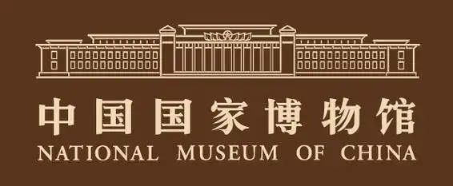
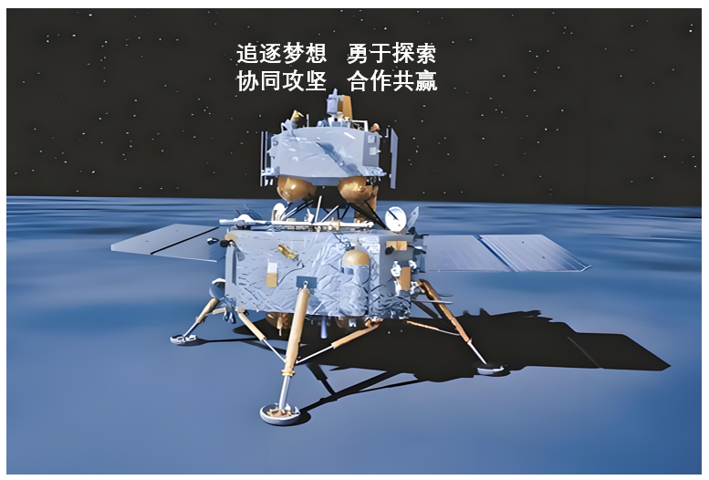

**机密★启用前**

**2025年全省普通高中学业水平等级考试**

**思想政治**

**注意事项：**

**1．答卷前，考生务必将自己的姓名、考生号等填写在答题卡和试卷指定位置。**

**2．回答选择题时、选出每小题答案后、用铅笔把答题卡上对应题目的答案标号涂黑。**

**如需改动，用橡皮擦干净后、再选涂其他答案标号。回答非选择题时，将答案写在答题卡上。写在本试卷上无效。**

**3．考试结束后，将本试卷和答题卡一并交回。**

**一、选择题：本题共15小题，每小题3分、共45分。每小题只有一个选项符合题目要求。**

1\. 征程如歌，歌以咏史。《国际歌》唱响坚定信念，“是谁创造了人类世界？是我们劳动群众……团结起来到明天，英特纳雄耐尔就一定要实现”。《石库门的灯光》颂唱中国共产党给中国带来光明，“铁锤镰刀的旗帜、指引工农大众的心。燎原的火种、闪烁共产主义真……开天辟地……民族复兴……”。从《国际歌》到《石库门的灯光》，生动诠释了（ ）

①马克思主义政党始终代表无产阶级和广大人民群众的根本利益

②建立无产阶级专政是无产阶级实现自身历史使命的最终目的

③人民群众坚定的理想信念决定了资本主义必然灭亡的历史命运

④中国特色社会主义道路是中华民族最终走向共产主义的必由之路

A. ①② B. ①④ C. ②③ D. ③④

2\. 劳动创造幸福。图是不同行业劳动者对自己工作的描述。材料表明（ ）

①掌握数字技术的劳动者是发展新质生产力的核心要素

②数字技术的使用促进了数字经济与实体经济的融合发展

③数字技术的应用推动了劳动方式的变化，也催生了新职业

④数据要素在生产过程中创造价值，拓宽了劳动者收入渠道

A. ①② B. ①④ C. ②③ D. ③④

3\. 重大项目建设是促长远发展战略之举。2025年春，山东省集中开工1006个重大项目，图为分类别的项目投资，表1为分主体的项目投资。

表1

<table style="width:86%;">
<colgroup>
<col style="width: 15%" />
<col style="width: 18%" />
<col style="width: 15%" />
<col style="width: 19%" />
<col style="width: 16%" />
</colgroup>
<tbody>
<tr>
<td rowspan="2" style="text-align: left;">投资主体</td>
<td colspan="2" style="text-align: left;">投资项目</td>
<td colspan="2" style="text-align: left;">投资金额</td>
</tr>
<tr>
<td style="text-align: left;">数量（个）</td>
<td style="text-align: left;">占比</td>
<td style="text-align: left;">数量（亿元）</td>
<td style="text-align: left;">占比（%）</td>
</tr>
<tr>
<td style="text-align: left;">民营企业</td>
<td style="text-align: left;">635</td>
<td style="text-align: left;">63.12</td>
<td style="text-align: left;">5541</td>
<td style="text-align: left;">531.4</td>
</tr>
<tr>
<td style="text-align: left;">国有企业</td>
<td style="text-align: left;">325</td>
<td style="text-align: left;">32.31</td>
<td style="text-align: left;">4550</td>
<td style="text-align: left;">43.63</td>
</tr>
<tr>
<td style="text-align: left;">政府</td>
<td style="text-align: left;">32</td>
<td style="text-align: left;">3.18</td>
<td style="text-align: left;">254</td>
<td style="text-align: left;">2.44</td>
</tr>
<tr>
<td style="text-align: left;">外资企业</td>
<td style="text-align: left;">14</td>
<td style="text-align: left;">1.39</td>
<td style="text-align: left;">82</td>
<td style="text-align: left;">0.79</td>
</tr>
</tbody>
</table>

上述重大项目开工建设，可以（ ）

①优化投资结构，培育经济增长新动能

②稳定民营企业政策预期，激发民间投资活力

③促进社会民生事业发展，实现公共服务均等化

④规范社会资本投资行为，降低各类主体经营风险

A. ①② B. ①③ C. ②④ D. ③④

4\. 近年来，山东省扎实做好民生保障工作。

<table style="width:100%;">
<colgroup>
<col style="width: 99%" />
</colgroup>
<tbody>
<tr>
<td style="text-align: left;">
建成全国首个省级社会救助数据资源中枢，强化主动发现和跟踪问效能力；大力开展服务类社会救助，成功打造“小桔灯”困难群众心理救助等全国知名的服务品牌。

推行医保和商业保险“一站式”平台，自动识别并计算基本医保和商业保险的支付金额，实现“医保+商保+自付”同步完成。
</td>
</tr>
</tbody>
</table>

据材料，下列推导正确的是（ ）

①提升救助智能化水平→提高社会救助质效→兜好困难群众基本生活底线

②打造服务救助品牌→提供高层次社会保障→增强救助对象自我发展能力

③医保和商业保险有效衔接→提升资金结算效率→减轻人民群众就医负担

④加大救助投入→增加困难群众转移性收入→健全分层分类社会救助体系

A. ①② B. ①③ C. ②④ D. ③④

5\. 为解决M市光伏企业超长租赁合同的履行难题，市人民法院联合市人大、市政协、市发改委开展调研，多次走访相关企业，共同商讨解决方案在吸纳人大代表和政协委员的相关意见后，市人民法院向市发改委发出《关于推动光伏产业可持续发展的司法建议书》，市发改委专门召开“建议答复会”。采取有效措施加以落实。材料表明（ ）

①市发改委在市人大、市政协等国家机关监督下优化营商环境

②市人民法院通过制发司法建议、以法治“善为”助企纾困

③代表委员依照法定程序，对政府工作提出质问并要求答复

④多主体同向发力践行协商民主，推动光伏产业可持续发展

A. ①② B. ①③ C. ②④ D. ③④

6\. 近年来，J镇开展“乡村新社区”建设，将全镇15个村庄整合成3个新社区，成立新社区“大党委”，建立“镇+新社区+村”三级协商议事机制、最大程度整合资源、推动乡村振兴“大民生”。其中，X新社区多次召开协商议事会，探索出特色农文旅融合发展之路，实现了村集体与村民双增收。材料表明（ ）

①“大党委”的设置有利于加强基层党组织对乡村振兴工作的管理

②新社区的成立有利于扩大基层政权行使行政管理职权的范围

③三级协商议事机制丰富了村民参与社区事务的基层民主实践

④“乡村新社区”的建设有利于完善共建共治共享的乡村治理体系

A. ①② B. ①④ C. ②③ D. ③④

7\. 大漆又称中国漆，由漆树树液加工提炼而成，可塑性强且具有防水抗蚀的特性。匠人们洞悉大漆之性情、驾驭温湿度之微妙．在木、竹等各种材质的胎体上进行髹涂、雕漆、推光……历经多道工序，在器物表面渗透、固化后的大漆形成一层坚韧的保护膜且愈磨愈亮，使漆器演绎出东方美学的独特韵味。由此可见（ ）

①人们根据大漆防水抗蚀的特性建立新的联系

②对大漆本质的认识在漆器制作中不断被验证

③大漆价值的实现取决于其自身的属性与功能

④漆器的功能、状态及其变化影响大漆的功能

A. ①② B. ①③ C. ②④ D. ③④

8\. 生活的变迁是中西部对外开放最直观的见证。重庆火锅店里，东南亚的新鲜食材随西部陆海新通道冷链运输而来；新疆市集上，通过免签入境的外国游客越来越多……宏观数据印证着微观感受。2024年前三季度，全国有11个省份外贸增速超10%，中西部占多数，新疆增速最快。材料表明（ ）

①在实践中形成的思维具体能反映事物整体的本质

②人们能在改造世界的物质性活动中推动事物前进

③人们在生产中形成的生产方式决定着社会性质与面貌

④事物总是在个性中包含着共性，共性又寓于个性之中

A. ①② B. ①③ C. ②④ D. ③④

9\. 毛泽东指出，“冲天干劲是热。科学分析是冷。……不愿意做分析，只爱热……这种态度是不利于做领导工作的”。习近平指出，“现实中，有的干部干事热情很高，但缺乏科学精神、求实态度，结果不仅没有出业绩，反而带来了一堆问题”。材料启示我们，做事情要（ ）

①弘扬科学精神，坚持理论与实践的具体的历史的统一

②坚持问题导向，从科学的理念出发破解发展的难题

③注重分析对综合的先导作用，用分析的结果指导新的实践

④充分发挥主观能动性，正确认识和利用客观规律去改造世界

A. ①③ B. ①④ C. ②③ D. ②④

10\. 2025年2月，由亚投行、南部非洲开发银行和法国开发署共同主办的第五届“共同金融”峰会在南非举行。来自联合国、政府机构、多边开发银行等约2500名与会代表围绕“加强基础设施和金融体系建设，促进公正和可持续增长”主题进行了探讨。峰会期间，亚投行发布了2025年融资报告，并呼吁多边开发银行加大对非洲基础设施投资。材料表明（ ）

①联合国作为集体安全机制的核心，在全球治理中发挥着引领作用

②亚投行通过与其他多边开发银行合作，助力发展中国家自主发展

③“共同金融”峰会为新兴经济体参与国际金融治理提供了重要平台

④与会各方积极履行国际义务，为完善全球金融体系提供可行性方案

A. ①③ B. ①④ C. ②③ D. ②④

11\. 某学习小组围绕“中国与东盟关系”开展探究活动，搜集到以下资料：

<table style="width:100%;">
<colgroup>
<col style="width: 99%" />
</colgroup>
<tbody>
<tr>
<td style="text-align: left;">
1955年4月，第一次亚非会议在印尼万隆举行，形成了以“团结、友谊、合作”为核心的万隆精神。此后，万隆精神被嵌入东盟创立与发展的进程中。

2024年10月，中国—东盟自贸区3.0版升级谈判实质性结束，标志着双方在数字经济、绿色经济等新兴领域的合作将进一步深化。
</td>
</tr>
</tbody>
</table>

材料表明，中国与东盟（ ）

①积极弘扬万隆精神，推动建设合作共赢的新型国际关系

②通过深化南南合作，不断提升在国际多边机制话语权

③始终坚持共同立场，为正确处理国际关系贡献亚洲智慧

④共同维护自由贸易体制，积极推进区域经济一体化进程

A. ①② B. ①④ C. ②③ D. ③④

12\. 张某发现汽车后轮有明显裂损致难以行驶。通过查看物业监控，张某发现邻居王某持木棍有意将李某的狗驱赶至自己的车前，受惊的狗致车辆受损。张某找王某索赔被拒后，便擅自将王某的姓名、电话号码、可识别王某的监控视频发布网络，后王某遭受个别网民电话骚扰谩骂。下列判断正确的是（ ）

①不论李某是否有过错，都不影响张某向李某追责

②即使李某存在故意或过失，张某也可向王某索赔

③张某的行为侵害了王某的肖像权和名誉权

④王某应委托辩护人维护个人信息权益和隐私权

A. ①② B. ①③ C. ②④ D. ③④

13\. 郭某从事高新技术研究工作、2021年与何某结婚。2022年，郭某以个人名义向银行申请贷款，购买了房屋A与何某共同居住。2023年、郭某与S公司签订专利许可协议并收取费用。何某和郭某一直全力照顾何某外祖母的生活。2024年，何某外祖母订立遗嘱，明确其名下的房屋B归何某所有、其他财产归何某行动不便的母亲。下列判断正确的是（ ）

①虽然房屋A由郭某个人贷款、但房贷仍可成郭某夫妻共同债务

②郭某的专利虽被S公司付费使用，但只要保密得当就可一直受法律保护

③郭某可通过成年意定监护制度保护何某外祖母合法权益

④当遗嘱发生效力时，何某将以遗嘱继承方式取得房屋B的所有权

A. ①③ B. ①④ C. ②③ D. ②④

14\. 《长安三万里》，制作历时3年；《哪吒之魔童闹海》，5年；《西游记之大圣归来》，8年。甲、乙据此分别得出如下结论：

<table style="width:85%;">
<colgroup>
<col style="width: 85%" />
</colgroup>
<tbody>
<tr>
<td style="text-align: left;">
甲：优秀国产动画电影都需要漫长的制作周期

乙：只有激发创作团队精益求精的工匠精神，才能创作出优秀动画电影
</td>
</tr>
</tbody>
</table>

据材料，下列说法正确的是（ ）

①甲使用了科学归纳推理得出结论

②针对乙的结论，通过否定它的前件而在结论中否定它的后件，这是正确的推理结构

③以甲的结论为前提进行换位质推理，可得“有些需要漫长制作周期的不是优秀国产动画电影”

④若以“动画电影”为属概念，则《哪吒之魔童闹海》与《长安三万里》在外延上是反对关系

A. ①③ B. ①④ C. ②③ D. ②④

15\. 了解农业智能化发展状况，调查人员到某蔬菜种植园区进行相关调查，发现（ ）

<table style="width:85%;">
<colgroup>
<col style="width: 85%" />
</colgroup>
<tbody>
<tr>
<td style="text-align: left;">
所有使用自动卷帘设备的大棚都使用高清视频采集设备

有的使用高清视频采集设备的大棚使用水肥一体化设备

所有使用高清视频采集设备的大棚都没有使用土壤监测传感设备
</td>
</tr>
</tbody>
</table>

据材料，使用三段论的基本规则能够推出

①有的使用水肥一体化设备的大棚使用自动卷帘设备

②有的使用水肥一体化设备的大棚使用土壤监测传感设备

③有的使用水肥一体化设备的大棚没有使用土壤监测传感设备

④所有使用土壤监测传感设备的大棚都没有使用自动卷帘设备

A. ①② B. ①③ C. ②④ D. ③④

**二、非选择题：本题共5小题，共55分。**

16\. 行政复议，一头连着行政机关，一头连着人民群众。新修订的行政复议法实施一年来，行政复议化解行政争议主渠道作用日益凸显。

【缘起】申请人文某、宋某等为某老旧小区业主，向某市自然资源和规划局提出增设电梯申请。被申请人依据该市《关于进一步推进既有住宅电梯增设工作的实施意见》（以下简称《意见》）第5条“原则上不得在建筑临街面设置电梯”的规定，作出暂不能批复同意的回复。

【复议】申请人不服，向该市人民政府申请行政复议。行政复议机构经调查发现：该楼老年居民占比60%，增设电梯意愿强烈，且已征得相邻权利人同意；该楼所临街道并非主要道路，增设电梯对城市风貌影响不大：《意见》正在修订中。

【调解】行政复议机构征得当事人同意后，中止案件审理，组织双方调解：向申请人阐明，不予审批同意不违反现有规定；向被申请人指出，应当兼顾实现行政目标和保护相对人利益。同时，行政复议机构推动相关部门在修订《意见》时完善第5条内容：“内部设置确有困难……可临街设置，但不得破坏建筑立面整体风格”。

【化解】在新修订的《意见》指导下，申请人增设电梯方案获通过，行政复议中止原因消除，案件恢复审理。申请人撤回行政复议申请，行政复议终止，案件圆满解决。

结合材料，运用政治与法治知识．说明行政复议制度是如何推动政府兼顾实现行政目标和保护相对人利益的。

17\.

材料一 品牌是高质量发展的重要象征。2024中国企业500强榜单显示，入国企业总营收迈上110万亿元新台阶，平均研发投入比上年增长9.4%……数字背后，凸显了中国品牌的实力。然而，当前国内市场一些领域存在的制度规则不完善、地方保护等问题，以及复杂多变的市场环境，也给中国品牌发展带来了风险挑战。

材料二 超大规模且极具增长潜力的市场，是我国发展的巨大优势和应对变局的坚实依托，也为中国品牌迈向一流提供了广阔空间。表2为2024年我国经济社会发展部分指标。

表2

|      |                                                                     |
|:---- |:------------------------------------------------------------------- |
| 项目   | 举例                                                                  |
| 国内贸易 | 社会消费品零售总额48.3万亿元、同比增长3.5%                                           |
| 消费市场 | 汽车保有量3.53亿辆，冰箱、洗衣机等主要品类家电保有量超过30亿台；“以旧换新”带动汽车特别是新能源汽车、家电等消费超1.3万亿元。 |
| 网络零售 | 网络支付用户规模达10.29亿人，网络购物用户规模达9.74亿人。                                   |
| 工业   | 制造业总体规模连续15年保持全球第一；41个工业大类行业中39个保持增长。                               |
| 教育   | 新增劳动力平均受教育年限超过14年，高等教育毛入学率提高到60.2%。                                 |

有观点认为，国内超大规模市场的需求优势是中国品牌有效应对风险挑战的关键。结合材料，运用经济与社会知识，对该观点进行评析。

18\. 中国式现代化既是物质层面的变革与发展，更是精神世界的重塑与升华。在中国式现代化的壮阔征途上，文明底色厚重深沉，文化发展旗帜鲜明，时光长河积淀的精神伟力更加磅礴……

<table style="width:94%;">
<colgroup>
<col style="width: 43%" />
<col style="width: 50%" />
</colgroup>
<tbody>
<tr>
<td style="text-align: left;">

中国共产党历史展览馆特种邮票
</td>
<td style="text-align: left;">

中国人民抗日战争暨世界反法西斯战争胜利80周年纪念活动标识
</td>
</tr>
<tr>
<td style="text-align: left;">

中国国家博物馆馆徽
</td>
<td style="text-align: left;">

探月工程——嫦娥六号成功着陆月球背面模拟画面
</td>
</tr>
</tbody>
</table>

结合材料，运用文化传承与文化创新知识，阐述新时代我们应如何“挺立中国式现代化的精神脊梁”。

19\. 王某以十二生肖为蓝本，结合古汉字、文物等，创作并发表了十二生肖图腾美术作品（以下称图腾作品），甲旅游文化公司（以下称甲）是某传统文化景区经营者，与王某签订合同，约定甲有权在景区宣传册上使用图腾作品。甲将署名甲的图腾作品上传网络，并印制在宣传册上。

为完善景区建设，甲与乙公司（以下称乙）签订承揽合同，约定乙以甲提供的图腾作品为模板设计并铺设甬道，甲需分期向乙支付报酬共二十万元，同时对甲名下的一辆汽车设定抵押。乙以图腾作品为基础，创作了生肖年画新作品（以下称新作品），并以此完成甬道设计与施工。

王某在宣传册及网上发现图腾作品后，又发现刻在甬道上的新作品与图腾作品十分相似，遂向法院起诉甲。经审理，法院判决甲立即停止侵权并向王某支付版权使用费，但驳回王某销毁甬道的诉请。诉讼过程中，王某得知新作品属于乙，便向仲裁机构提交申请进行维权，但仲裁机构不予受理。

甲拒不支付后期报酬，乙遂向法院起诉甲，并递交起诉状，法院已受理。

（1）运用法律与生活知识，回答下列问题。

①甲乙分别侵害了王某的哪些著作权利？

②仲裁机构为何对王某的仲裁申请不予受理？

③依据承揽合同的约定，乙能在起诉状中提出哪些诉讼请求？

（2）针对王某与甲的纠纷，法院的判决彰显了什么价值取向？

20\.

凝聚改革合力 谱写壮丽篇章

◆事必有法，然后可成

在谈及抓改革落实时，习近平强调，“既要积极主动，更要扎实稳健，明确优先序，把握时度效，尽力而为、量力而行，不能脱离实际”。

推出改革措施往往有着宝贵时间窗口，错过了时机就难以达到预期目的。对于一项改革，人民群众的呼声已经很高，各方面条件也比较成熟，就要尽快推出；各方面认识还不一致、条件不太具备的，可以循序渐进推动。落实改革措施要掌握“火候”，力度太小难以真正解决问题，力度过大又有可能引发其他负面效应。

新时代全面深化改革关键在于抓部署、抓落实，取得实绩实效。如，在国有企业改革方面，中央出台了一系列政策方案，国有企业改革力度不断加大，国有资产大幅增值。

（1）抓改革落实，要把握时度效。结合材料，运用量变质变规律相关知识对此加以说明。

◆大道如砥，壮阔无垠

从历史深处走来，由迷茫到觉悟、由封闭到开放、由倡导到引领，中华民族不断摆脱束缚、冲破桎梏，创新创造的活力充分迸发。在中国共产党的领导下，中国人民把一个个“不可能”变成“一定能”，书写着中华民族几千年来最恢宏的史诗，并携手世界各国人民一路前行，开创人类共同的未来。

（2）结合材料，运用中国特色社会主义、当代国际政治与经济知识，以“伟大觉醒孕育伟大创造”为主题撰写一篇短评。

要求：①围绕主题，观点明确；②论证充分，逻辑清晰；③学科术语使用规范；④总字数在250字左右。
