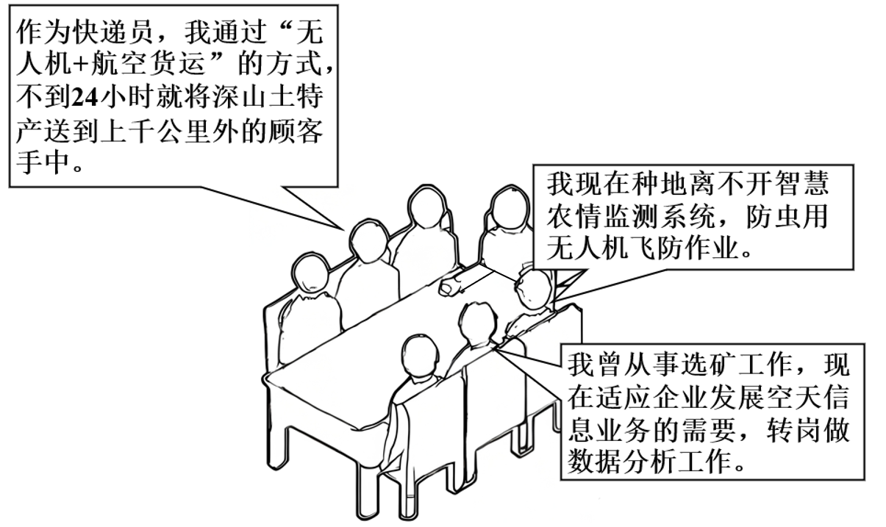
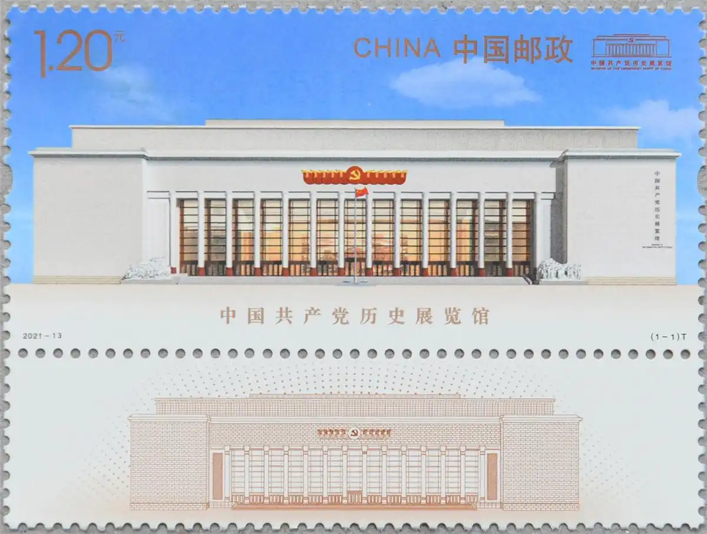

**机密★启用前**

**2025年全省普通高中学业水平等级考试**

**思想政治**

**注意事项：**

**1．答卷前，考生务必将自己的姓名、考生号等填写在答题卡和试卷指定位置。**

**2．回答选择题时、选出每小题答案后、用铅笔把答题卡上对应题目的答案标号涂黑。**

**如需改动，用橡皮擦干净后、再选涂其他答案标号。回答非选择题时，将答案写在答题卡上。写在本试卷上无效。**

**3．考试结束后，将本试卷和答题卡一并交回。**

**一、选择题：本题共15小题，每小题3分、共45分。每小题只有一个选项符合题目要求。**

1\. 征程如歌，歌以咏史。《国际歌》唱响坚定信念，“是谁创造了人类世界？是我们劳动群众……团结起来到明天，英特纳雄耐尔就一定要实现”。《石库门的灯光》颂唱中国共产党给中国带来光明，“铁锤镰刀的旗帜、指引工农大众的心。燎原的火种、闪烁共产主义真……开天辟地……民族复兴……”。从《国际歌》到《石库门的灯光》，生动诠释了（ ）

①马克思主义政党始终代表无产阶级和广大人民群众的根本利益

②建立无产阶级专政是无产阶级实现自身历史使命的最终目的

③人民群众坚定的理想信念决定了资本主义必然灭亡的历史命运

④中国特色社会主义道路是中华民族最终走向共产主义的必由之路

A. ①② B. ①④ C. ②③ D. ③④

【答案】B

【解析】

【详解】①： 《国际歌》强调劳动群众创造世界，要团结起来实现英特纳雄耐尔；《石库门的灯光》表明中国共产党（马克思主义政党）以铁锤镰刀的旗帜指引工农大众，追求共产主义和民族复兴。这都生动地诠释了马克思主义政党始终代表无产阶级和广大人民群众的根本利益，①选项正确。

②：无产阶级实现自身历史使命的最终目的是实现共产主义，实现人的自由全面发展，而不是建立无产阶级专政，②选项错误。

③：资本主义必然灭亡是由资本主义社会的基本矛盾，即生产的社会化和生产资料的资本主义私人占有之间的矛盾决定的，而不是由人民群众坚定的理想信念决定的，③选项错误。

④： 《石库门的灯光》颂唱中国共产党带来光明，追求共产主义和民族复兴。中国特色社会主义是中国共产党领导人民在实践中开辟的道路，中国特色社会主义道路是中华民族最终走向共产主义的必由之路，从《国际歌》到《石库门的灯光》体现了这种历史的延续和发展，④选项正确。

故本题选B。

2\. 劳动创造幸福。图是不同行业的劳动者对自己工作的描述。材料表明（ ）

①掌握数字技术的劳动者是发展新质生产力的核心要素

②数字技术的使用促进了数字经济与实体经济的融合发展

③数字技术的应用推动了劳动方式的变化，也催生了新职业

④数据要素在生产过程中创造价值，拓宽了劳动者收入渠道

A. ①② B. ①④ C. ②③ D. ③④

【答案】C

【解析】

【详解】①：科技创新能够催生新产业、新模式、新动能，是发展新质生产力的核心要素，①错误。

②：从快递员利用 “无人机 + 航空货运” 送深山土特产，农民借助智慧农情监测系统、无人机飞防作业，以及工人转岗做数据分析工作等描述，可知 数字技术应用到了快递、农业、矿业等实体经济领域，促进了数字经济与实体经济的融合发展。比如快递行业借助数字技术实现更高效运输，农业运用数字技术提升生产监测和防虫作业效率，矿业企业发展空天信息业务带动工人转岗从事数据分析，这些都体现了数字经济与实体经济的融合，②正确。

③：材料中农民种地从传统方式转变为依靠智慧农情监测系统、无人机飞防作业，这体现了劳动方式因数字技术应用而发生变化。 同时，像企业发展空天信息业务，产生了数据分析这样的新职业，表明数字技术的应用催生了新职业，③正确。

④：劳动创造价值，而不是数据要素创造价值，而且材料也没有强调收入，④排除。

故本题选C。

3\. 重大项目建设是促长远发展的战略之举。2025年春，山东省集中开工1006个重大项目，图为分类别的项目投资，表1为分主体的项目投资。

表1

<table style="width:86%;">
<colgroup>
<col style="width: 15%" />
<col style="width: 18%" />
<col style="width: 15%" />
<col style="width: 19%" />
<col style="width: 16%" />
</colgroup>
<tbody>
<tr>
<td rowspan="2" style="text-align: left;">投资主体</td>
<td colspan="2" style="text-align: left;">投资项目</td>
<td colspan="2" style="text-align: left;">投资金额</td>
</tr>
<tr>
<td style="text-align: left;">数量（个）</td>
<td style="text-align: left;">占比</td>
<td style="text-align: left;">数量（亿元）</td>
<td style="text-align: left;">占比（%）</td>
</tr>
<tr>
<td style="text-align: left;">民营企业</td>
<td style="text-align: left;">635</td>
<td style="text-align: left;">63.12</td>
<td style="text-align: left;">5541</td>
<td style="text-align: left;">531.4</td>
</tr>
<tr>
<td style="text-align: left;">国有企业</td>
<td style="text-align: left;">325</td>
<td style="text-align: left;">32.31</td>
<td style="text-align: left;">4550</td>
<td style="text-align: left;">43.63</td>
</tr>
<tr>
<td style="text-align: left;">政府</td>
<td style="text-align: left;">32</td>
<td style="text-align: left;">3.18</td>
<td style="text-align: left;">254</td>
<td style="text-align: left;">2.44</td>
</tr>
<tr>
<td style="text-align: left;">外资企业</td>
<td style="text-align: left;">14</td>
<td style="text-align: left;">1.39</td>
<td style="text-align: left;">82</td>
<td style="text-align: left;">0.79</td>
</tr>
</tbody>
</table>

上述重大项目开工建设，可以（ ）

①优化投资结构，培育经济增长新动能

②稳定民营企业政策预期，激发民间投资活力

③促进社会民生事业发展，实现公共服务均等化

④规范社会资本投资行为，降低各类主体经营风险

A. ①② B. ①③ C. ②④ D. ③④

【答案】A

【解析】

【详解】①：从材料中可知，重大项目投资涵盖了重点产业项目、基础设施项目、社会民生保障项目等不同类别 。这种多元化的投资类别，意味着投资结构得到了优化，能够带动新的经济增长点，培育经济增长新动能，①选项正确。

②：从表1可以看到，民营企业在投资项目数量和金额上都占有较大比重。 重大项目建设中民营企业的深度参与，能够让民营企业感受到政策对其的支持，从而稳定民营企业政策预期，激发民间投资活力，②选项正确。

③：虽然有社会民生保障项目投资，这确实有助于促进社会民生事业发展。但是实现公共服务均等化是一个长期且复杂的过程，仅靠这些重大项目建设中的社会民生保障项目投资，还远远不能实现公共服务均等化这一目标，③选项错误。

④：重大项目建设主要是关于项目的投资与发展，并没有直接针对规范社会资本投资行为的措施；且市场经营风险受到多种因素影响，重大项目建设并不能直接降低各类主体经营风险，④选项错误。

故本题选A。

4\. 近年来，山东省扎实做好民生保障工作。

<table style="width:100%;">
<colgroup>
<col style="width: 99%" />
</colgroup>
<tbody>
<tr>
<td style="text-align: left;">
建成全国首个省级社会救助数据资源中枢，强化主动发现和跟踪问效能力；大力开展服务类社会救助，成功打造“小桔灯”困难群众心理救助等全国知名的服务品牌。

推行医保和商业保险“一站式”平台，自动识别并计算基本医保和商业保险的支付金额，实现“医保+商保+自付”同步完成。
</td>
</tr>
</tbody>
</table>

据材料，下列推导正确的是（ ）

①提升救助智能化水平→提高社会救助质效→兜好困难群众基本生活底线

②打造服务救助品牌→提供高层次社会保障→增强救助对象自我发展能力

③医保和商业保险有效衔接→提升资金结算效率→减轻人民群众就医负担

④加大救助投入→增加困难群众转移性收入→健全分层分类社会救助体系

A. ①② B. ①③ C. ②④ D. ③④

【答案】B

【解析】

【详解】① ：建成省级社会救助数据资源中枢等举措提升了救助智能化水平。智能化水平提升，能够更精准、高效地开展社会救助工作，从而提高社会救助质效。社会救助质效的提高，有助于切实保障困难群众的基本生活，兜好困难群众基本生活底线，①正确。

②：社会福利是最高层次的社会保障，社会救助是保障社会成员生活安全和生存权利的“最后一道防线”，并不能提供高层次的社会保障，②推导错误。

③：推行医保和商业保险 “一站式” 平台，实现了医保和商业保险的有效衔接。这种有效衔接使得基本医保和商业保险的支付金额能够自动识别并计算，同步完成 “医保 + 商保 + 自付”，大大提升了资金结算效率。资金结算效率的提升，减少了群众就医时的繁琐流程和资金垫付压力，进而减轻了人民群众就医负担，③正确。

④：加大救助投入确实会增加困难群众转移性收入，但增加困难群众转移性收入与健全分层分类社会救助体系之间不存在直接的因果推导关系。健全分层分类社会救助体系更多涉及救助制度的完善、救助对象的精准分类等方面，并非由增加困难群众转移性收入直接推导得出，④推导错误。

故本题选B。

5\. 为解决M市光伏企业超长租赁合同的履行难题，市人民法院联合市人大、市政协、市发改委开展调研，多次走访相关企业，共同商讨解决方案在吸纳人大代表和政协委员的相关意见后，市人民法院向市发改委发出《关于推动光伏产业可持续发展的司法建议书》，市发改委专门召开“建议答复会”。采取有效措施加以落实。材料表明（ ）

①市发改委在市人大、市政协等国家机关监督下优化营商环境

②市人民法院通过制发司法建议、以法治“善为”助企纾困

③代表委员依照法定程序，对政府工作提出质问并要求答复

④多主体同向发力践行协商民主，推动光伏产业可持续发展

A. ①② B. ①③ C. ②④ D. ③④

【答案】C

【解析】

【详解】①：市政协是政治协商机构，不是国家机关，①排除。

②：法院发出《司法建议书》，主动发挥司法职能，帮助企业解决难题，体现了以法治“善为”助企纾困，②正确。

③：材料中人大代表和政协委员是参与调研、提出意见，并未体现“提出质问并要求答复”（而且质询权属于人大代表，政协委员没有质询权），③排除。

④：法院、人大、政协、发改委多方协作，通过调研、建议、答复会等形式协商解决问题，体现了协商民主和合力推动产业发展，④正确。

故本题选C。

6\. 近年来，J镇开展“乡村新社区”建设，将全镇15个村庄整合成3个新社区，成立新社区“大党委”，建立“镇+新社区+村”三级协商议事机制、最大程度整合资源、推动乡村振兴“大民生”。其中，X新社区多次召开协商议事会，探索出特色农文旅融合发展之路，实现了村集体与村民双增收。材料表明（ ）

①“大党委”的设置有利于加强基层党组织对乡村振兴工作的管理

②新社区的成立有利于扩大基层政权行使行政管理职权的范围

③三级协商议事机制丰富了村民参与社区事务的基层民主实践

④“乡村新社区”的建设有利于完善共建共治共享的乡村治理体系

A. ①② B. ①④ C. ②③ D. ③④

【答案】D

【解析】

【详解】①：“大党委”的设置有利于加强基层党组织对乡村振兴工作的领导，凝聚各方力量推动乡村振兴，但不是具体的管理工作，①选项说法错误。

②：新社区属于基层群众自治组织范畴，并非基层政权。我国基层政权是指乡镇一级的人民代表大会和人民政府，且基层政权行使行政管理职权的范围是法定的，不能随意扩大，②选项说法错误。

③：建立“镇+新社区+村”三级协商议事机制，村民可以通过这个机制参与到社区事务的协商讨论中。这种方式为村民参与社区事务提供了新的途径和平台，丰富了基层民主实践，让村民更好地参与到社区的治理和发展决策当中，保障了村民的民主权利，③选项正确。

④：“乡村新社区”建设整合资源，成立“大党委”，建立三级协商议事机制，多方共同参与乡村治理。这种模式有利于调动镇、社区、村等各方的积极性，形成共建共治共享的乡村治理体系，推动乡村振兴和“大民生”的发展，④选项正确。

故本题选D。

7\. 大漆又称中国漆，由漆树树液加工提炼而成，可塑性强且具有防水抗蚀的特性。匠人们洞悉大漆之性情、驾驭温湿度之微妙．在木、竹等各种材质的胎体上进行髹涂、雕漆、推光……历经多道工序，在器物表面渗透、固化后的大漆形成一层坚韧的保护膜且愈磨愈亮，使漆器演绎出东方美学的独特韵味。由此可见（ ）

①人们根据大漆防水抗蚀的特性建立新的联系

②对大漆本质的认识在漆器制作中不断被验证

③大漆价值的实现取决于其自身的属性与功能

④漆器的功能、状态及其变化影响大漆的功能

A. ①② B. ①③ C. ②④ D. ③④

【答案】A

【解析】

【详解】①：大漆本身具有防水抗蚀的特性，匠人们利用这一特性，通过髹涂、雕漆等工艺，使其与木、竹等胎体结合，形成新的器物（漆器），这体现了人们根据事物的固有属性建立新的联系，①正确。

②：匠人们“洞悉大漆之性情、驾驭温湿度之微妙”，并在实践中制作漆器，说明对大漆特性的认识是在制作过程中不断验证和完善的，②正确。

③：哲学上的价值是指客体对主体的积极意义，即一事物所具有的能够满足主体需要的积极功能和属性，大漆的价值取决于其自身属性以及人的需求，③排除。

④：大漆的功能（如防水抗蚀）是其固有属性，漆器的功能或状态变化（如雕漆、推光）并不会改变大漆本身的特性，而是利用其特性实现漆器的功能，④排除。

故本题选A。

8\. 生活的变迁是中西部对外开放最直观的见证。重庆火锅店里，东南亚的新鲜食材随西部陆海新通道冷链运输而来；新疆市集上，通过免签入境的外国游客越来越多……宏观数据印证着微观感受。2024年前三季度，全国有11个省份外贸增速超10%，中西部占多数，新疆增速最快。材料表明（ ）

①在实践中形成的思维具体能反映事物整体的本质

②人们能在改造世界的物质性活动中推动事物前进

③人们在生产中形成的生产方式决定着社会性质与面貌

④事物总是在个性中包含着共性，共性又寓于个性之中

A. ①② B. ①③ C. ②④ D. ③④

【答案】C

【解析】

【详解】①： 思维具体是指在理性认识的层次上反映事物具体整体的认识，是人们在思维中把事物各个方面的本质规定按照其内在联系综合起来，形成关于事物整体的本质和规律的认识。材料中从重庆火锅店、新疆市集的微观感受以及全国外贸增速等宏观数据，都是对中西部对外开放的不同方面认识，并非已经形成了能反映中西部对外开放事物整体本质的思维具体 ，①排除。

②：材料中通过西部陆海新通道运输食材、实施免签政策等实践活动（这些属于改造世界的物质性活动），促进了中西部地区的对外开放，推动了中西部地区经济等方面的发展，体现了人们能在改造世界的物质性活动中推动事物前进，②符合题意。

③：材料主要围绕中西部地区对外开放的相关变化展开，重点强调的是对外开放实践对地区发展的推动，并未涉及生产方式决定社会性质与面貌这一内容，③不符合题意。

④：材料中，中西部各地如重庆、新疆在对外开放中的具体实践（如冷链运输东南亚食材、外国游客免签入境）是个性表现，而这些实践又共同体现了全国对外开放的共性趋势（外贸增速提升）。这体现了事物在个性中包含共性，共性寓于个性之中，④符合题意。

故本题选C。

9\. 毛泽东指出，“冲天干劲是热。科学分析是冷。……不愿意做分析，只爱热……这种态度是不利于做领导工作的”。习近平指出，“现实中，有的干部干事热情很高，但缺乏科学精神、求实态度，结果不仅没有出业绩，反而带来了一堆问题”。材料启示我们，做事情要（ ）

①弘扬科学精神，坚持理论与实践的具体的历史的统一

②坚持问题导向，从科学的理念出发破解发展的难题

③注重分析对综合的先导作用，用分析的结果指导新的实践

④充分发挥主观能动性，正确认识和利用客观规律去改造世界

A. ①③ B. ①④ C. ②③ D. ②④

【答案】B

【解析】

【详解】①：材料中习近平指出“缺乏科学精神、求实态度，会带来了一堆问题”，启示我们，做事情要弘扬科学精神，坚持理论与实践的具体的历史的统一，即理论必须结合实际条件，避免盲目蛮干，①正确。

④：材料批评只凭热情而缺乏科学分析的行为，启示我们主观能动性（“热”）必须建立在正确认识和利用客观规律（“冷”）的基础上，这体现了主观能动性与客观规律的辩证统一，④正确。

②：物质决定意识，要求我们要坚持一切从实际出发，而非从“理念”出发，②错误。

③：分析是综合的基础，综合是分析的先导，而综合的结果又会指导人们进行新的分析，③错误。

故本题选B。

10\. 2025年2月，由亚投行、南部非洲开发银行和法国开发署共同主办的第五届“共同金融”峰会在南非举行。来自联合国、政府机构、多边开发银行等约2500名与会代表围绕“加强基础设施和金融体系建设，促进公正和可持续增长”主题进行了探讨。峰会期间，亚投行发布了2025年融资报告，并呼吁多边开发银行加大对非洲基础设施投资。材料表明（ ）

①联合国作为集体安全机制的核心，在全球治理中发挥着引领作用

②亚投行通过与其他多边开发银行合作，助力发展中国家自主发展

③“共同金融”峰会为新兴经济体参与国际金融治理提供了重要平台

④与会各方积极履行国际义务，为完善全球金融体系提供可行性方案

A. ①③ B. ①④ C. ②③ D. ②④

【答案】C

【解析】

【详解】①：材料中虽然提到了联合国参与此次峰会，但重点围绕的是 “加强基础设施和金融体系建设，促进公正和可持续增长” 主题进行探讨，并没有体现联合国作为集体 安全机制的核心在全球治理中发挥引领作用，①不符合题意。

②： 亚投行与南部非洲开发银行和法国开发署共同主办峰会，呼吁多边开发银行加大对非洲基础设施投资。非洲多数国家属于发展中国家，亚投行通过这种与其他多边开发银行合作方式，能够为发展中国家的基础设施建设提供资金等支持，助力发展中国家自主发展 ，②符合题意。

③：从材料可知，“共同金融” 峰会有来自联合国、政府机构、多边开发银行等约 2500 名与会代表围绕金融等相关主题进行探讨。这为新兴经济体（如亚投行等新兴金融机构背后代表的新兴经济体国家）参与国际金融治理提供了一个交流、探讨的重要平台，使新兴经济体能够在国际金融治理中发出自己的声音，发挥自身作用，③符合题意。

④：材料只是说与会代表围绕主题进行探讨，亚投行发布融资报告并发出呼吁，但并没有明确表明与会各方积极履行国际义务，也未提及为完善全球金融体系提供了具体的可行性方案，④不符合题意。

故本题选C。

11\. 某学习小组围绕“中国与东盟关系”开展探究活动，搜集到以下资料：

<table style="width:100%;">
<colgroup>
<col style="width: 99%" />
</colgroup>
<tbody>
<tr>
<td style="text-align: left;">
1955年4月，第一次亚非会议在印尼万隆举行，形成了以“团结、友谊、合作”为核心的万隆精神。此后，万隆精神被嵌入东盟创立与发展的进程中。

2024年10月，中国—东盟自贸区3.0版升级谈判实质性结束，标志着双方在数字经济、绿色经济等新兴领域的合作将进一步深化。
</td>
</tr>
</tbody>
</table>

材料表明，中国与东盟（ ）

①积极弘扬万隆精神，推动建设合作共赢的新型国际关系

②通过深化南南合作，不断提升在国际多边机制的话语权

③始终坚持共同立场，为正确处理国际关系贡献亚洲智慧

④共同维护自由贸易体制，积极推进区域经济一体化进程

A. ①② B. ①④ C. ②③ D. ③④

【答案】B

【解析】

【详解】①：材料提到万隆精神被嵌入东盟创立与发展进程中，中国-东盟自贸区在新兴领域合作进一步深化。中国与东盟的合作体现了弘扬万隆精神，推动建设合作共赢的新型国际关系，①符合题意。

②：南南合作是发展中国家之间的合作，中国和东盟国家都属于发展中国家。材料中中国-东盟在数字经济、绿色经济等新兴领域深化合作，这属于深化南南合作，但材料未提及提升在国际多边机制的话语权相关内容，②不合题意。

③：中国和东盟国家有着广泛的共同利益，但在一些问题上也会存在各自不同的立场，“始终坚持共同立场” 表述过于绝对，③错误。

④：中国-东盟自贸区升级谈判实质性结束，双方在新兴领域合作进一步深化，这表明双方共同维护自由贸易体制，积极推进区域经济一体化进程，④符合题意。

故本题选B。

12\. 张某发现汽车后轮有明显裂损致难以行驶。通过查看物业监控，张某发现邻居王某持木棍有意将李某的狗驱赶至自己的车前，受惊的狗致车辆受损。张某找王某索赔被拒后，便擅自将王某的姓名、电话号码、可识别王某的监控视频发布网络，后王某遭受个别网民电话骚扰谩骂。下列判断正确的是（ ）

①不论李某是否有过错，都不影响张某向李某追责

②即使李某存在故意或过失，张某也可向王某索赔

③张某的行为侵害了王某的肖像权和名誉权

④王某应委托辩护人维护个人信息权益和隐私权

A. ①② B. ①③ C. ②④ D. ③④

【答案】A

【解析】

【详解】①：本案中王某的行为导致狗受惊撞坏张某车辆，李某并非直接侵权人。张某车辆受损是因王某驱赶狗这一行为引发，所以张某应向直接侵权人王某追责。故不论李某是否有过错，都不影响张某向李某追责，①正确。

②：根据侵权责任的构成要件，王某持木棍有意将李某的狗驱赶至张某车前，致使狗受惊撞坏车辆，王某实施了侵权行为，且该行为与张某车辆受损之间存在因果关系。即使李某对狗的管理等方面存在故意或过失，但王某的行为也是导致张某车辆受损的直接原因之一，张某作为被侵权人，有权向实施直接侵权行为的王某索赔。所以“即使李某存在故意或过失，张某也可向王某索赔”说法正确，②当选。

③：张某擅自将王某的姓名、电话号码、可识别王某的监控视频发布网络，这一行为侵犯了王某的个人信息权益和隐私权，但题干中并没有明确信息表明张某的行为侵犯了王某的肖像权，同时王某遭受个别网民电话骚扰谩骂并非张某直接侵犯其名誉权的行为表现，③排除。

④：在民事诉讼中，维护当事人权益的是诉讼代理人，辩护人是在刑事诉讼中为犯罪嫌疑人、被告人进行辩护。本题中王某个人信息权益等受侵害属于民事纠纷范畴，王某应委托诉讼代理人维护个人信息权益和隐私权，而不是辩护人，④排除。

故本题选A。

13\. 郭某从事高新技术研究工作、2021年与何某结婚。2022年，郭某以个人名义向银行申请贷款，购买了房屋A与何某共同居住。2023年、郭某与S公司签订专利许可协议并收取费用。何某和郭某一直全力照顾何某外祖母的生活。2024年，何某外祖母订立遗嘱，明确其名下的房屋B归何某所有、其他财产归何某行动不便的母亲。下列判断正确的是（ ）

①虽然房屋A由郭某个人贷款、但房贷仍可成为郭某夫妻共同债务

②郭某的专利虽被S公司付费使用，但只要保密得当就可一直受法律保护

③郭某可通过成年意定监护制度保护何某外祖母合法权益

④当遗嘱发生效力时，何某将以遗嘱继承方式取得房屋B的所有权

A. ①③ B. ①④ C. ②③ D. ②④

【答案】A

【解析】

【详解】①：房屋A虽由郭某以个人名义贷款购买，但用于夫妻共同居住，符合《民法典》第一千零六十四条规定：夫妻一方在婚姻关系存续期间以个人名义为家庭日常生活需要所负的债务，属于夫妻共同债务。因此，房贷可成为夫妻共同债务，①正确。

③：成年意定监护制度要求具有完全民事行为能力的成年人在意识清醒时，以书面形式与近亲属或其他愿意担任监护人的个人协商确定监护人，以便在其丧失或部分丧失民事行为能力时履行监护职责，题干中，何某外祖母于2024年订立遗嘱，表明其具有完全民事行为能力，郭某可通过成年意定监护制度与其协商订立监护协议，以保护其合法权益，③正确。

②：专利保护具有法定期限，且专利需公开才能获得保护，与保密无关。专利到期后即进入公共领域，不再受法律保护，题干中“保密得当就可一直受法律保护”混淆了专利与商业秘密（商业秘密需保密且无期限），②排除。

④：何某作为外孙，非法定继承人，因此外祖母将房屋B留给何某的行为属于遗赠，而非遗嘱继承，④排除。

故本题选A。

14\. 《长安三万里》，制作历时3年；《哪吒之魔童闹海》，5年；《西游记之大圣归来》，8年。甲、乙据此分别得出如下结论：

<table style="width:85%;">
<colgroup>
<col style="width: 85%" />
</colgroup>
<tbody>
<tr>
<td style="text-align: left;">
甲：优秀国产动画电影都需要漫长的制作周期

乙：只有激发创作团队精益求精的工匠精神，才能创作出优秀动画电影
</td>
</tr>
</tbody>
</table>

据材料，下列说法正确的是（ ）

①甲使用了科学归纳推理得出结论

②针对乙的结论，通过否定它的前件而在结论中否定它的后件，这是正确的推理结构

③以甲的结论为前提进行换位质推理，可得“有些需要漫长制作周期的不是优秀国产动画电影”

④若以“动画电影”为属概念，则《哪吒之魔童闹海》与《长安三万里》在外延上是反对关系

A. ①③ B. ①④ C. ②③ D. ②④

【答案】D

【解析】

【详解】①：科学归纳推理是根据某类事物部分对象与其属性之间的因果联系，推出该类事物的全部对象都具有某种属性的归纳推理。材料中未明确体现甲是基于因果联系得出结论，所以不能确定甲使用了科学归纳推理得出结论，①排除。

②：只有激发创作团队精益求精的工匠精神，才能创作出优秀动画电影。这是必要条件假言判断。对于必要条件假言推理，正确的推理结构是否定前件式和肯定后件式。针对乙的结论，通过否定它的前件而在结论中否定它的后件，这是正确的推理结构，②符合题意。

③：“优秀国产动画电影都需要漫长制作周期”，换位推理是将主项和谓项的位置互换，前提不周延的项换位后不得周延，得到“有些需要漫长制作周期的是优秀国产动画电影”；再进行换质推理（改变联项，同时把谓项换成它的矛盾概念），即“有些需要漫长制作周期的不是非优秀国产动画电影”，③错误。

④：反对关系是指两个具有全异关系的概念包含在一个属概念中，并且它们的外延之和小于该属概念的外延。若以“动画电影”为属概念，《哪吒之魔童闹海》与《长安三万里》是不同的动画电影，它们的外延之和小于“动画电影”的外延，在外延上是反对关系，④说法正确。

故本题选D。

15\. 为了解农业智能化发展状况，调查人员到某蔬菜种植园区进行相关调查，发现（ ）

<table style="width:85%;">
<colgroup>
<col style="width: 85%" />
</colgroup>
<tbody>
<tr>
<td style="text-align: left;">
所有使用自动卷帘设备的大棚都使用高清视频采集设备

有的使用高清视频采集设备的大棚使用水肥一体化设备

所有使用高清视频采集设备的大棚都没有使用土壤监测传感设备
</td>
</tr>
</tbody>
</table>

据材料，使用三段论的基本规则能够推出

①有的使用水肥一体化设备的大棚使用自动卷帘设备

②有的使用水肥一体化设备的大棚使用土壤监测传感设备

③有的使用水肥一体化设备的大棚没有使用土壤监测传感设备

④所有使用土壤监测传感设备的大棚都没有使用自动卷帘设备

A. ①② B. ①③ C. ②④ D. ③④

【答案】D

【解析】

【详解】①：所有使用自动卷帘设备的大棚都使用高清视频采集设备，有的使用高清视频采集设备的大棚使用水肥一体化设备这两个作为前提，中项使用高清视频采集设备在前提中一次也没有周延，不符合三段论的推理规则，所以不能得出有的使用水肥一体化设备的大棚使用自动卷帘设备，①错误。

②：结论为否定，当且仅当， 前提中有一否定。小前提：有的使用高清视频采集设备的大棚使用水肥一体化设备。大前提：所有使用高清视频采集设备的大棚都没有使用土壤监测传感设备。结论：有的使用水肥一体化设备的大棚使用土壤监测传感设备。该结论为肯定结论，不符合三段论推理规则，②错误。

③：结论为否定，当且仅当， 前提中有一否定。大前提：所有使用高清视频采集设备的大棚都没有使用土壤监测传感设备。小前提：有的使用高清视频采集设备的大棚使用水肥一体化设备。结论：有的使用水肥一体化设备的大棚没有使用土壤监测传感设备。属于正确的推理结构，③正确。

④：结论为否定，当且仅当， 前提中有一否定。小前提：所有使用高清视频采集设备的大棚都没有使用土壤监测传感设备。大前提：所有使用自动卷帘设备的大棚都使用高清视频采集设备。结论：所有使用土壤监测传感设备的大棚都没有使用自动卷帘设备。符合三段论的推理结构，④正确。

故本题选D。

**二、非选择题：本题共5小题，共55分。**

16\. 行政复议，一头连着行政机关，一头连着人民群众。新修订的行政复议法实施一年来，行政复议化解行政争议主渠道作用日益凸显。

【缘起】申请人文某、宋某等为某老旧小区业主，向某市自然资源和规划局提出增设电梯申请。被申请人依据该市《关于进一步推进既有住宅电梯增设工作的实施意见》（以下简称《意见》）第5条“原则上不得在建筑临街面设置电梯”的规定，作出暂不能批复同意的回复。

【复议】申请人不服，向该市人民政府申请行政复议。行政复议机构经调查发现：该楼老年居民占比60%，增设电梯意愿强烈，且已征得相邻权利人同意；该楼所临街道并非主要道路，增设电梯对城市风貌影响不大：《意见》正在修订中。

【调解】行政复议机构征得当事人同意后，中止案件审理，组织双方调解：向申请人阐明，不予审批同意不违反现有规定；向被申请人指出，应当兼顾实现行政目标和保护相对人利益。同时，行政复议机构推动相关部门在修订《意见》时完善第5条内容：“内部设置确有困难……可临街设置，但不得破坏建筑立面整体风格”。

【化解】在新修订的《意见》指导下，申请人增设电梯方案获通过，行政复议中止原因消除，案件恢复审理。申请人撤回行政复议申请，行政复议终止，案件圆满解决。

结合材料，运用政治与法治知识．说明行政复议制度是如何推动政府兼顾实现行政目标和保护相对人利益的。

【答案】①坚持以人民为中心，发挥行政复议公正高效、便民为民的制度优势，促进社会公平正义，增强人民群众的获得感、幸福感、安全感。

②深入推动法治政府建设，提升政府公信力，建设社会主义法治国家，推进国家治理体系和治理能力现代化。

③坚持依法立法，民主立法，科学立法。公开征求意见，充分发扬民主，集思广益，凝聚共识，合理设定权力与责任，对行政机关相关职权和责任作出规定。

【解析】

【分析】背景素材：行政复议

考点考查：全面依法治国

能力考查：描述和阐释事物、论证和探究问题

核心素养：政治认同、科学精神、法治意识

【详解】第一步：审设问。明确主体、作答范围、问题限定和作答角度。

本题为措施类主观题，要求运用政治与法治相关知识，从坚持以人民为中心、法治政府建设和科学立法等角度来分析作答。

第二步：审材料，通过标点符号、段落等，提取材料有效信息。

有效信息①：该楼老年居民占比60%，增设电梯意愿强烈，且已征得相邻权利人同意；该楼所临街道并非主要道路，增设电梯对城市风貌影响不大：《意见》正在修订中→可从坚持以人民为中心角度分析，说明修订行政复议法，有利于充分发挥行政复议公正高效、便民为民的制度优势，推进国家治理体系和治理能力现代化。

有效信息②：行政复议机构征得当事人同意后，中止案件审理，组织双方调解：向申请人阐明，不予审批同意不违反现有规定；向被申请人指出，应当兼顾实现行政目标和保护相对人利益→可从法治政府建设角度分析，说明推动政府兼顾实现行政目标和保护相对人利益应着力提升行政复议工作质效，有效解决制约行政复议的问题，全面提升行政复议的公信力和权威性，监督和促进行政机关依法行使职权，推进法治政府建设。

有效信息③：行政复议机构推动相关部门在修订《意见》时完善第5条内容：“内部设置确有困难……可临街设置，但不得破坏建筑立面整体风格”→可从科学立法角度分析，说明推动政府兼顾实现行政目标和保护相对人利益应结合我国国情和实际，适应新发展阶段对行政领域各项工作和制度建设的新要求。

第三步：整合信息，组织答案。注意设问限定以及教材知识与材料、时政信息等相结合。

17\.

材料一 品牌是高质量发展的重要象征。2024中国企业500强榜单显示，入国企业总营收迈上110万亿元新台阶，平均研发投入比上年增长9.4%……数字背后，凸显了中国品牌的实力。然而，当前国内市场一些领域存在的制度规则不完善、地方保护等问题，以及复杂多变的市场环境，也给中国品牌发展带来了风险挑战。

材料二 超大规模且极具增长潜力的市场，是我国发展的巨大优势和应对变局的坚实依托，也为中国品牌迈向一流提供了广阔空间。表2为2024年我国经济社会发展部分指标。

表2

|      |                                                                     |
|:---- |:------------------------------------------------------------------- |
| 项目   | 举例                                                                  |
| 国内贸易 | 社会消费品零售总额48.3万亿元、同比增长3.5%                                           |
| 消费市场 | 汽车保有量3.53亿辆，冰箱、洗衣机等主要品类家电保有量超过30亿台；“以旧换新”带动汽车特别是新能源汽车、家电等消费超1.3万亿元。 |
| 网络零售 | 网络支付用户规模达10.29亿人，网络购物用户规模达9.74亿人。                                   |
| 工业   | 制造业总体规模连续15年保持全球第一；41个工业大类行业中39个保持增长。                               |
| 教育   | 新增劳动力平均受教育年限超过14年，高等教育毛入学率提高到60.2%。                                 |

有观点认为，国内超大规模市场的需求优势是中国品牌有效应对风险挑战的关键。结合材料，运用经济与社会知识，对该观点进行评析。

【答案】该观点具有一定的合理性，但中国品牌应对风险挑战是多种因素共同作用的结果，需全面看待。

①超大规模市场是扩大内需，推动形成以国内大循环为主体的新发展格局的基础条件，有利于实现产业链、供应链的安全可控，增强国家经济安全，有效应对风险挑战；国内超大规模市场优势驱动品牌创新升级，发挥创新主导作用，推动产业结构优化升级，以满足消费者日益提升的需求；国内超大规模市场优势助力品牌规模扩张，促进实体经济发展，为深化供给侧结构性改革提供市场空间，实现经济高质量发展。

②但中国品牌有效应对风险挑战还需其他因素协同作用：当前国内市场一些领域存在制度规则不完善、地方保护等问题，这需要政府积极履行经济职能，建立公平竞争的市场秩序，完善知识产权保护等制度规则，才能为中国品牌营造良好的发展环境，激发品牌发展的活力和动力；我国制造业总体规模连续15年保持全球第一，41个工业大类行业中39个保持增长，强大的产业基础为中国品牌提供了坚实的支撑。完善的产业链供应链能够保障原材料供应、生产制造等环节的稳定，降低企业运营风险，助力品牌发展；企业树立正确的经营战略，坚持自主创新，培养高素质的人才队伍，这为中国品牌的创新发展提供了智力支持。

【解析】

【分析】背景素材：2024年我国经济社会发展部分指标

考点考查：政府的经济职能与作用、全面建设社会主义现代化国家的首要任务、企业成功经营的因素

能力考查：描述和阐述事物、论证和探究问题

核心素养：政治认同、科学精神、公共参与

【详解】第一步：审设问。明确主体、作答范围、问题限定和作答角度。

本题的设问要求谈谈对“国内超大规模市场的需求优势是中国品牌有效应对风险挑战的关键”这一观点的看法，属于评析类试题，需要调用经济与社会的有关知识，首先判断该观点的正误，然后从合理性和不合理性两个角度进行阐释。

第二步：审材料。提取关键词，链接教材知识。

观点正误判断：该观点片面。

论据①：我国社会消费品零售总额大且保持增长，像2024年达48.3万亿元、同比增长3.5%→从超大规模市场地位的角度分析分析其合理性：联系全面建设社会主义现代化国家的首要任务，阐述超大规模市场是扩大内需，推动形成以国内大循环为主体的新发展格局的基础条件，有效应对风险挑战。表明该观点有合理之处。

论据②：汽车保有量3.53亿辆，家电保有量超30亿台，以及“以旧换新”带动新能源汽车、家电等消费超1.3万亿元→从超大规模市场作用的角度分析其合理性：联系全面建设社会主义现代化国家的首要任务，阐述助力品牌规模扩张，促进实体经济发展，实现经济高质量发展。表明该观点有合理之处。

论据③：当前国内市场一些领域存在的制度规则不完善、地方保护等问题→从中国品牌有效应对风险挑战措施的角度分析观点的不合理性：联系政府的经济职能与作用，阐述政府积极履行经济职能，建立公平竞争的市场秩序，完善知识产权保护等制度规则，才能为中国品牌营造良好的发展环境。表明该观点有不合理之处。

论据④：新增劳动力平均受教育年限超过14年，高等教育毛入学率提高到60.2%→从中国品牌有效应对风险挑战措施的角度分析观点的不合理性：联系企业成功经营的因素，阐述坚持自主创新，培养高素质的人才队伍，为中国品牌的创新发展提供了智力支持。表明该观点有不合理之处。

第三步：整合论点与论据，组织答案。

18\. 中国式现代化既是物质层面的变革与发展，更是精神世界的重塑与升华。在中国式现代化的壮阔征途上，文明底色厚重深沉，文化发展旗帜鲜明，时光长河积淀的精神伟力更加磅礴……

<table style="width:94%;">
<colgroup>
<col style="width: 43%" />
<col style="width: 50%" />
</colgroup>
<tbody>
<tr>
<td style="text-align: left;">

中国共产党历史展览馆特种邮票
</td>
<td style="text-align: left;">

中国人民抗日战争暨世界反法西斯战争胜利80周年纪念活动标识
</td>
</tr>
<tr>
<td style="text-align: left;">

中国国家博物馆馆徽
</td>
<td style="text-align: left;">

探月工程——嫦娥六号成功着陆月球背面模拟画面
</td>
</tr>
</tbody>
</table>

结合材料，运用文化传承与文化创新知识，阐述新时代我们应如何“挺立中国式现代化的精神脊梁”。

【答案】①坚定文化自信。深刻认识到中华优秀传统文化是中华民族的精神命脉，是我们在世界文化激荡中站稳脚跟的坚实根基。

②要在坚持马克思主义文化观的基础上，不断实现中华优秀传统文化创造性转化和创新性发展，使文化发展与社会主义现代化建设相适应，为实现中华民族伟大复兴的中国梦提供强大的精神动力。

③要弘扬中华民族精神，培育和践行社会主义核心价值观，在实践中结合时代和社会发展要求不断丰富。

④继续大力发展社会主义经济，完善社会主义民主政治，不断夯实文化自信的基础。

⑤我们要坚定对中华优秀传统文化、革命文化和社会主义先进文化的自信，坚定当代中国的文化自信，最根本的是对中国特色社会主义文化的自信，特别是对习近平新时代中国特色社会主义思想的自信，不断提升国家文化软实力和中华文化影响力。

【解析】

【分析】背景素材：中国式现代化

考点考查：文化传承与文化创新

能力考查：描述和阐释事物、论证和探究问题

核心素养：政治认同、科学精神

【详解】第一步：审设问。明确主体、作答范围、问题限定和作答角度。

本题为论述类主观题，要求运用文化传承与文化创新相关知识，从坚定文化自信、中华优秀传统文化创造性转化和创新性发展、弘扬中华民族精神、文化与经济政治的关系和习近平新时代中国特色社会主义思想等角度来分析，阐述新时代我们“挺立中国式现代化的精神脊梁”的措施。

第二步：审材料，通过标点符号、段落等，提取材料有效信息。

有效信息①：在中国式现代化的壮阔征途上，文明底色厚重深沉，文化发展旗帜鲜明，时光长河积淀的精神伟力更加磅礴→可从坚定文化自信角度分析，阐述要深刻认识到中华优秀传统文化是中华民族的精神命脉，是我们在世界文化激荡中站稳脚跟的坚实根基，我们要继承和发扬中华优秀传统文化，同时积极吸收世界文化的优秀成果，不断丰富和发展社会主义先进文化。

有效信息②：中国共产党历史展览馆特种邮票→可从中华优秀传统文化创造性转化和创新性发展角度分析，阐述要在坚持马克思主义文化观的基础上，不断推进文化创新，使文化发展与社会主义现代化建设相适应，为实现中华民族伟大复兴的中国梦提供强大的精神动力。

有效信息③：中国人民抗日战争暨世界反法西斯战争胜利80周年纪念活动标识→可从弘扬中华民族精神角度分析，阐述要坚持以人民为中心的发展思想，推动社会主义核心价值观在全社会落地生根，培育和践行社会主义核心价值观，提高全民族的思想道德素质和科学文化素质。

有效信息④：中国国家博物馆馆徽→可从文化与经济政治的关系角度分析，阐述文化自信离不开经济的发展和政治制度的完善，中国特色社会主义伟大实践取得的巨大成就，增强了我们文化自信的底气。

有效信息⑤：探月工程—嫦娥六号成功着陆月球背面模拟画面→可从习近平新时代中国特色社会主义思想角度分析，阐述习近平新时代中国特色社会主义思想为建设文化强国提供了科学指导，为文化建设与发展提供了根本遵循，巩固了全党全国各族人民团结奋斗的共同思想基础。

第三步：整合信息，组织答案。注意设问限定以及教材知识与材料、时政信息等相结合。

19\. 王某以十二生肖为蓝本，结合古汉字、文物等，创作并发表了十二生肖图腾美术作品（以下称图腾作品），甲旅游文化公司（以下称甲）是某传统文化景区经营者，与王某签订合同，约定甲有权在景区宣传册上使用图腾作品。甲将署名甲的图腾作品上传网络，并印制在宣传册上。

为完善景区建设，甲与乙公司（以下称乙）签订承揽合同，约定乙以甲提供的图腾作品为模板设计并铺设甬道，甲需分期向乙支付报酬共二十万元，同时对甲名下的一辆汽车设定抵押。乙以图腾作品为基础，创作了生肖年画新作品（以下称新作品），并以此完成甬道设计与施工。

王某在宣传册及网上发现图腾作品后，又发现刻在甬道上的新作品与图腾作品十分相似，遂向法院起诉甲。经审理，法院判决甲立即停止侵权并向王某支付版权使用费，但驳回王某销毁甬道的诉请。诉讼过程中，王某得知新作品属于乙，便向仲裁机构提交申请进行维权，但仲裁机构不予受理。

甲拒不支付后期报酬，乙遂向法院起诉甲，并递交起诉状，法院已受理。

（1）运用法律与生活知识，回答下列问题。

①甲乙分别侵害了王某的哪些著作权利？

②仲裁机构为何对王某的仲裁申请不予受理？

③依据承揽合同的约定，乙能在起诉状中提出哪些诉讼请求？

（2）针对王某与甲的纠纷，法院的判决彰显了什么价值取向？

【答案】（1）① 甲侵害王某的作品署名权（甲将署名改为自己）； 复制权（甲提供图腾作品给乙作为模板）； 信息网络传播权（上传网络）。

乙：侵害王某的作品改编权（以图腾为基础创作新作品）、保护作品完整权（新作品与图腾相似，可能歪曲原作品） 。

②仲裁需有仲裁协议（合同中未约定仲裁条款，王某与乙无仲裁合意 ），故仲裁机构不予受理 。

③乙可请求：甲支付后期报酬20万剩余部分、就甲汽车抵押权实现优先受偿、甲承担违约责任（如赔偿逾期付款损失等） 。

（2）①法院判令甲停止侵权并付费，体现对原创作品著作权的保护，彰显了国家依法对知识产权严格保护的价值取向。

②法院驳回“销毁甬道”诉请，兼顾乙公司的承揽投入与公共利益，避免资源浪费，通过经济赔偿而非物理销毁实现正义。彰显了利益衡平原则。

③甲没有遵守与王某的合同约定构成违约，法院支持王某的合理诉求，也体现了对合同约定和诚信原则的维护，彰显了契约精神。

【解析】

【分析】背景素材：知识产权纠纷案

考点考查：保护知识产权、违约与违约责任、认识调解与仲裁、感受司法公正等知识

能力考查：描述和阐述事物、探究和论证问题

核心素养：政治认同、科学精神、法治意识

【小问1详解】

第一步：审设问，明确主体、作答范围、问题限定和作答角度。本题属于说明类主观题，要求回答设问中的三个小问题，需调用保护知识产权、违约与违约责任、认识调解与仲裁的相关知识，结合材料有效信息分析作答。

第二步：审材料，提取关键词，链接教材知识。

关键词①：甲与王某的合同约定甲有权在景区宣传册上使用图腾作品。甲将署名甲的图腾作品上传网络，并印制在宣传册上；乙以甲提供的图腾作品为模板设计并铺设甬道→可调用保护知识产权的知识，说明甲侵害了王某的作品署名权、 复制权、 信息网络传播权； 乙侵害了王某的作品改编权和保护作品完整权。

关键词②：王某得知新作品属于乙，便向仲裁机构提交申请进行维权，但仲裁机构不予受理→可调用仲裁的知识，说明王某与乙之间并未签订任何仲裁协议，故仲裁机构不予受理。

关键词③：甲拒不支付后期报酬，乙遂向法院起诉甲，并递交起诉状，法院已受理→可调用违约与违约责任的知识，说明乙可请求甲支付后期报酬、就甲汽车抵押权实现优先受偿、要求甲承担其他违约责任等。

第三步：整合信息，组织答案。注意设问限定以及教材知识与材料、时政信息等相结合。

【小问2详解】

第一步：审设问，明确主体、作答范围、问题限定和作答角度。本题属于意义类主观题，要求针对王某与甲的纠纷，说明法院的判决彰显了什么价值取向，需调用保护知识产权、违约与违约责任、感受司法公正的相关知识，结合材料有效信息分析作答。

第二步：审材料，提取关键词，链接教材知识。

关键词①：法院判决甲立即停止侵权并向王某支付版权使用费→可调用保护知识产权、违约与违约责任的知识，说明该判决体现对原创作品著作权的保护，彰显了国家依法对知识产权严格保护的价值取向；也体现了对合同约定和诚信原则的维护，彰显了契约精神。

关键词②：法院驳回王某销毁甬道的诉请→可调用感受司法公正的知识，说明该判决兼顾乙公司的承揽投入与公共利益，主张通过经济赔偿而非物理销毁实现正义，彰显了利益衡平原则。

第三步：整合信息，组织答案。注意设问限定以及教材知识与材料、时政信息等相结合。

20\.

凝聚改革合力 谱写壮丽篇章

◆事必有法，然后可成

在谈及抓改革落实时，习近平强调，“既要积极主动，更要扎实稳健，明确优先序，把握时度效，尽力而为、量力而行，不能脱离实际”。

推出改革措施往往有着宝贵时间窗口，错过了时机就难以达到预期目的。对于一项改革，人民群众的呼声已经很高，各方面条件也比较成熟，就要尽快推出；各方面认识还不一致、条件不太具备的，可以循序渐进推动。落实改革措施要掌握“火候”，力度太小难以真正解决问题，力度过大又有可能引发其他负面效应。

新时代全面深化改革关键在于抓部署、抓落实，取得实绩实效。如，在国有企业改革方面，中央出台了一系列政策方案，国有企业改革力度不断加大，国有资产大幅增值。

（1）抓改革落实，要把握时度效。结合材料，运用量变质变规律相关知识对此加以说明。

◆大道如砥，壮阔无垠

从历史深处走来，由迷茫到觉悟、由封闭到开放、由倡导到引领，中华民族不断摆脱束缚、冲破桎梏，创新创造的活力充分迸发。在中国共产党的领导下，中国人民把一个个“不可能”变成“一定能”，书写着中华民族几千年来最恢宏的史诗，并携手世界各国人民一路前行，开创人类共同的未来。

（2）结合材料，运用中国特色社会主义、当代国际政治与经济知识，以“伟大觉醒孕育伟大创造”为主题撰写一篇短评。

要求：①围绕主题，观点明确；②论证充分，逻辑清晰；③学科术语使用规范；④总字数在250字左右。

【答案】（1）①量变是质变的必要准备，质变是量变的必然结果，要重视量的积累，不失时机促成质变 。改革存在宝贵时间窗口，当条件成熟时，要尽快推出改革，抓住时机促成质变，推动改革达预期目标；若条件不成熟，要循序渐进积累量变，为质变奠基。故需因“时”定策 。

②量变达到一定程度才会引起质变，要坚持适度原则 ，精准把握改革“度”，确保改革质变稳健可控。

③事物发展是量变与质变的统一，国有企业通过“政策量变”（一系列方案）到“资产质变”（大幅增值）的转化，证明只有把握改革措施与实效的因果链条，才能实现真正的制度性质变，达成改革目标。

（2）答案示例：历史长河中，中华民族的伟大觉醒孕育磅礴创造伟力。 五四运动启思想觉醒，中共诞生立组织觉醒；改革开放破束缚，定中国特色社会主义路，实现“封闭停滞”到“开放发展”转折 。 在理论指引下，经济腾飞（GDP 居世界第二 ）、科技突破（航天、5G 领先 ）、制度完善（全过程人民民主 ），拓中国式现代化新途 。 同时，中国推动构建人类命运共同体，以“一带一路”为全球治理献新策，显大国担当 。 觉醒是创新序章，奋斗为创造底色。新时代新征程，坚持党的领导，聚人民之力，必书中华民族伟大复兴新篇！

【解析】

【分析】背景素材：凝聚改革合力 谱写壮丽篇章

考点考查：量变质变规律、伟大的改革开放、中国梦、构建人类命运共同体等相关知识

能力考查：描述和阐释事物、论证与探究问题

核心素养：政治认同、科学精神、公共参与

【小问1详解】

第一步：审设问，明确主体、作答范围、问题限定和作答角度。本题属于分析说明类主观题，要求说明“抓改革落实，要把握时度效”，需要调用量变质变规律的相关知识，从时、度、效三个角度分别分析作答。

第二步：审材料，提取关键词，链接教材知识。

关键词①：推出改革措施往往有着宝贵时间窗口，错过了时机就难以达到预期目。对于一项改革，人民群众的呼声已经很高，各方面条件也比较成熟，就要尽快推出；各方面认识还不一致、条件不太具备的，可以循序渐进推动→可联系量变是质变的必要准备，质变是量变的必然结果，要重视量的积累，不失时机促成质变，说明当条件成熟时，要抓住时机促成质变，推动改革达预期目标；若条件不成熟，要循序渐进积累量变，创造条件为质变奠基。

关键词②：落实改革措施要掌握“火候”，力度太小难以真正解决问题，力度过大又有可能引发其他负面效应→可联系量变达到一定程度才会引起质变，要坚持适度原则，说明要把握改革的“度”，确保改革质变稳健可控。

关键词③：新时代全面深化改革关键在于抓部署、抓落实，取得实绩实效。在国有企业改革方面，中央出台了一系列政策方案，国有企业改革力度不断加大，国有资产大幅增值→可联系事物发展是量变与质变的统一，说明只有把握改革措施与实效的因果链条，才能实现真正的制度性质变，达成改革目标。

第三步：整合信息，组织答案。 注意设问限定以及教材相关知识与材料相结合。

【小问2详解】

第一步：审设问，明确主体、作答范围、问题限定和作答角度。本题属于论述题，要求以“伟大觉醒孕育伟大创造”为主题撰写一篇短评，需要调用伟大的改革开放、中国梦、构建人类命运共同体等相关知识，结合材料与实际分析论证，言之有理即可。

关键词①：从历史深处走来，由迷茫到觉悟、由封闭到开放、由倡导到引领，中华民族不断摆脱束缚、冲破桎梏，创新创造的活力充分迸发→可联系新民主主义革命、社会主义革命、改革开放的意义等知识，说明中华民族实现 “封闭停滞”到“开放发展” 。

关键词②：在中国共产党的领导下，中国人民把一个个“不可能”变成“一定能”，书写着中华民族几千年来最恢宏的史诗→可联系中国特色社会主义进入新时代的知识，说明党领导人民开拓了中国式现代化新征途。

关键词③：并携手世界各国人民一路前行，开创人类共同的未来→可联系构建人类命运共同体的知识，说明中国以“一带一路”为全球治理献新策，显大国担当。

第三步：整合信息，组织答案。 注意设问限定以及教材相关知识与材料相结合。
