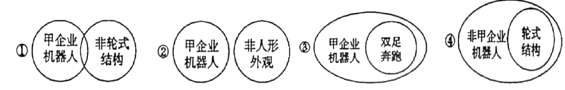
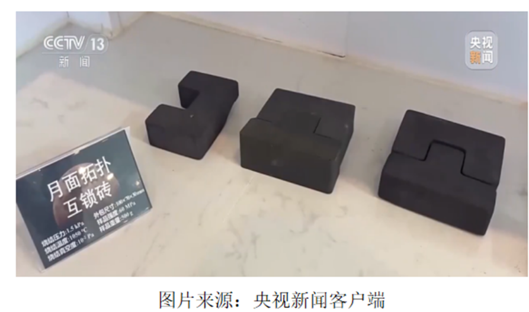

**2025年广东省普通高中学业水平选择性考试思想政治**

**本试卷共6页，19小题，满分100分。考试用时75分钟。**

**注意事项：**

**1．答题前，考生务必用黑色字迹的钢笔或签字笔将自己的姓名、考生号、考场号和座位号填写在答题卡上。用2B铅笔将试卷类型（A）填涂在答题卡相应位置上，将条形码横贴在答题卡右上角“条形码粘贴处”。**

**2．作答选择题时，选出每小题答案后，用2B铅笔把答题卡上对应题目选项的答案信息点涂黑；如需改动，用橡皮擦干净后，再选涂其他答案，答案不能答在试卷上。**

**3．非选择题必须用黑色字迹的钢笔或签字笔作答，答案必须写在答题卡各题目指定区域内相应位置上：如需改动，先划掉原来的答案，然后 再写上新的答案：不准使用铅笔和涂改液。不按以上要求作答的答案无效。**

**4．考生必须保持答题卡的整洁。考试结束后，将试卷和答题卡一并交回。**

**一、选择题：本大题共16小题，每小题3分，共48分。在每小题列出的四个选项中，只有一项符合题目要求。**

1\. 习近平总书记指出：“中国共产党所做的一切，就是为中国人民谋幸福、为中华民族谋复兴……”“实现中华民族伟大复兴，就是中华民族近代以来最伟大的梦想。”“没有高度的文化自信，没有文化的繁荣兴盛，就没有中华民族伟大复兴。”“中国梦是中国人民追求幸福的梦，也同各国人民的美好梦想息息相通。”对以上重要论述理解正确的是（ ）

①实现中华民族伟大复兴是党自成立以来就肩负的历史使命

②近代中国曲折发展历程激发了中华民族伟大复兴的中国梦

③文化自信和文化繁荣共同构成中华民族伟大复兴的中国梦

④中华民族伟大复兴的中国梦就是世界各国人民的共同梦想

A. ①② B. ①③ C. ②④ D. ③④

【答案】A

【解析】

【详解】①：中国共产党自成立以来，就把为中国人民谋幸福、为中华民族谋复兴作为自己的初心使命， 这是历史和人民赋予党的重任，①表述正确。

②：近代以来，中国逐步沦为半殖民地半封建社会，列强侵略、封建统治腐朽，中国人民经历了深重苦难。在这种曲折发展历程中，实现民族独立、人民解放和国家富强、人民幸福，实现中华民族伟大复兴的中国梦被激发出来，成为全体中华儿女的共同梦想，②表述正确。

③：文化自信是更基础、更广泛、更深厚自信，文化的繁荣兴盛是中华民族伟大复兴的重要条件，但文化自信和文化繁荣并不是构成中华民族伟大复兴中国梦本身。中国梦的本质是实现国家富强、民族振兴、人民幸福，③表述错误。

④：中国梦是中国人民追求幸福的梦，同时同各国人民的美好梦想息息相通，但不能说中国梦就是世界各国人民的共同梦想，④表述错误。

故本题选A。

2\. 党的二十届三中全会提出，城乡融合发展是中国式现代化的必然要求。走城乡融合发展之路，要从全局和战略的高度把握和处理城乡关系，统筹新型工业化、新型城镇化和乡村全面振兴。2024年，全国农村居民人均可支配收入同比实际增长6．3%,比城镇快1．9个百分点。以上材料表明（ ）

①推进城乡融合发展有利于解放和发展生产力

②调整城乡关系是决定当代中国命运的关键一招

③我国走出了一条具有中国特色的城乡发展之路

④城乡关系问题在中国特色社会主义建设中得到全面解决

A. ①② B. ①③ C. ②④ D. ③④

【答案】B

【解析】

【详解】①：材料中提到走城乡融合发展之路，且2024年全国农村居民人均可支配收入同比实际增长比城镇快。这体现了城乡融合发展对农村经济发展起到了积极作用，有利于解放和发展生产力，①选项正确。

②：改革开放是决定当代中国命运的关键一招，而不是调整城乡关系，②选项错误。

③：材料指出党的二十届三中全会提出城乡融合发展是中国式现代化的必然要求，并且要从全局和战略高度把握处理城乡关系，统筹新型工业化、新型城镇化和乡村全面振兴等内容。这表明我国正探索并走出一条符合自身国情的，具有中国特色的城乡发展之路，③选项正确。

④：虽然我国在城乡融合发展方面取得了一定成绩，但不能说城乡关系问题在中国特色社会主义建设中得到全面解决，④不选。

故本题选B。

3\. 随着我国国际地位和影响力的逐渐提升，中国智慧、中国方案、中国道路等领域成为国外学界研究的热点，主题包括“人类命运共同体”“自我革命”“人类文明新形态”等一系列中国“标识性概念”。这些研究（ ）

①有利于推动中国“标识性概念”产生世界性影响

②有力地促进了中国在区域和全球的声望不断提升

③标志着中国开创的人类文明新形态取得国际共识

④成为推动新时代中国共产党理论创新的主要力量

A. ①② B. ①④ C. ②③ D. ③④

【答案】A

【解析】

【详解】①：国外学界对中国“标识性概念”的研究，有助于这些概念在国际上的传播和认可，从而扩大其世界性影响，①正确。

②：随着我国国际地位和影响力的逐渐提升，中国智慧、中国方案、中国道路等领域成为国外学界研究的热点，这客观上会增强中国在区域和全球的国际声望和影响力，②正确。

③：虽然国外学界在研究这些概念，但“标志着中国开创的人类文明新形态取得国际共识”的说法不符合事实，③排除。

④：国外学界的研究可以为中国理论创新提供参考，但“主要力量”的说法夸大了其作用。中国共产党的理论创新主要源于国内实践和自主探索，而非国外学界的研究，④排除。

故本题选A。

4\. 针对产品同质化、市场供需失衡、产品价格走低、行业平均利润率持续下滑等现象，某行业协会发起“自律公约”,要求行业企业改善管理、挖掘内部潜力；行业龙头企业率先宣布减产控产，同时与上下游企业开展技术创新合作。在不考虑其他因素的条件下，该举措发挥作用的传导路径为（ ）

①自觉减少市场供给，优化企业经营环境

②生产更多优质产品，实现市场差异化竞争

③引导市场价格回升，提高行业平均利润率

④加大企业研发投入，推动行业高质量发展

A. ④→①→③→② B. ①→③→④→②

C. ①→③→②→④ D. ②→③→①→④

【答案】B

【解析】

【详解】①：行业龙头企业率先宣布减产控产，因此企业自觉减少市场供给，会直接导致市场上该产品的供应量减少，在需求不变或变动较小的情况下，市场供给减少，会使市场供需关系得到改善，从而优化企业经营环境，①排在第一位。

③：企业控制产量，在供求关系的作用下，引导市场价格的不断回升，在成本等其他因素不变的情况下，有利于提高行业整体平均利润率，③排第二位。

④：提高行业整体平均利润率提高，企业能够有足够的利润，可以加大企业的研发投入，推动行业高质量发展，④排第三位。

②：企业加大研发投入，有利于生产更多高质量的产品，实现市场的差异化竞争，解决产品同质化的问题，促进经济的高质量发展，②排第四位。

故本题选B。

5\. 某市建立联农带农机制：合作社在乡村建立蔬菜产业园，产品直供市内各单位食堂；村集体将农户闲置资源整合并办证确权合入股合作社；农户以土地经营权入股村集体项目；专业公司以现金入股合作社，负责提供技术、销售等服务。2024年全市村集体产业新增分红300多万元。该机制（ ）

①建立了产供销一体化经营体系

②推动了科技与农业发展深度融合

③通过土地经营权入股增加了农户经营性收入

④通过确权将土地由集体所有变更为公司所有

A. ①② B. ①③ C. ②④ D. ③④

【答案】A

【解析】

【详解】①：材料中提到 “合作社在乡村建立蔬菜产业园，产品直供市内各单位食堂”，合作社负责生产（建立蔬菜产业园 ），同时直接供应产品（直供市内各单位食堂 ），这体现了生产、供应（销售环节的一部分 ）的衔接，在一定程度上建立了产供销一体化经营体系，①符合题意。

②：因为“专业公司以现金入股合作社，负责提供技术、销售等服务”，专业公司提供技术服务到农业生产中，这有利于推动科技与农业发展深度融合，促进农业的现代化发展，②符合题意。

③：经营性收入是指通过生产经营活动所获得的收入。农户以土地经营权入股村集体项目，农户获得的是按股分红等收入，这属于财产性收入，而不是经营性收入，③说法错误。

④：我国农村土地实行集体所有制。村集体将农户闲置资源整合并办证确权合入股合作社，这里的确权是对农户土地经营权等相关权益的确权，土地的所有权依然是集体所有，并没有变更为公司所有，④说法错误。

故本题选A。

6\. 经党中央批准，二十届中央第五轮巡视对河北等15个省（自治区）和新疆生产建设兵团开展常规巡视，同时对昆明市开展提级巡视，并会同有关省委巡视机构对长春等5个副省级城市开展联动巡视。这样的安排（ ）

①延伸了党的组织结构，有利于增强党的凝聚力

②优化了党的巡视方式，有利于提升党内监督实效

③体现了巡视的法制化，有利于中央对地方的监督

④强化了巡视的震慑力，有利于维护党中央的权威

A. ①③ B. ①④ C. ②③ D. ②④

【答案】D

【解析】

【详解】①：党的组织结构是由党的中央组织、地方组织和基层组织等构成的体系。巡视主要是党内监督的一种方式，没有延伸党的组织结构，①排除。

②：材料中既开展常规巡视，又开展提级巡视，还会同有关省委巡视机构开展联动巡视。这种多种巡视方式相结合安排，丰富和优化了党的巡视方式，有利于提升党内监督实效，②正确。

③：题干中主要强调的是巡视方式的多种安排，并没有突出巡视工作在法律法规层面的建设等法制化相关内容，③与题干主旨不符，排除。

④：党中央开展多种形式的巡视工作，对地方相关省份、城市进行监督检查，能够对存在的问题形成有力震慑。通过巡视发现并解决问题，有利于维护党中央的权威，④正确。

故本题选D。

7\. 某市市委统战部协调市委办公室，邀请民主党派市级组织负责人列席有关市委常委会会议，让民主党派及时了解党委政府决策部署，掌握信息动态，从“一旁看”到“一起干”,在实际参与中了解情况、找准问题，实现议政议在关键处、建言建在点子上。这种做法旨在（ ）

A. 搭建学习培训平台，提升依法执政能力水平

B. 搭建知情明政平台，提高参政议政工作质效

C. 搭建民主监督平台展现参政议政担当作为

D. 搭建政治协商平台，巩固多党合作政治基础

【答案】B

【解析】

【详解】 A：依法执政的主体是中国共产党，材料中做法主要是针对民主党派，目的不是提升中国共产党的依法执政能力水平，且材料强调的是民主党派了解决策部署参与议政建言，并非学习培训，A排除。

B：邀请民主党派市级组织负责人列席市委常委会会议，使民主党派及时了解党委政府决策部署和信息动态 。这让民主党派能够更清楚实际情况，为参政议政提供依据，从而提高参政议政工作质效，B符合题意。

C：材料中重点强调的是民主党派了解情况参与决策过程，实现更好地参政议政，而不是民主监督，且展现参政议政担当作为不是目的，C排除。

D：材料中这种做法主要目的不是巩固多党合作的政治基础，而是让民主党派更好地参政议政，D排除。

故本题选B。

8\. 在季节感、风物感及情感生成方式上，不同地域文化差异较大。如中国文学主题之一的“悲秋”,宋玉的“悲哉秋之为气也”堪称代表。而在岭南，秋花如春花一般依旧灿烂，悲秋的情绪自然是少有的。故有学者认为，刘禹锡“自古逢秋悲寂寥，我言秋日胜春朝”之句，移诸岭南，才是最有普适性的。对此，最恰当的哲学解读是（ ）

①悲秋情感表达具有鲜明的主观唯心主义色彩

②悲秋文学主题表达的差异凸显了矛盾的特殊性

③感性认识对理性认识的疏离排斥是悲秋情感生成的原因

④地理环境作为社会物质生活条件是悲秋情感生成的基础

A. ①② B. ①③ C. ②④ D. ③④

【答案】C

【解析】

【详解】①：主观唯心主义把人的主观精神（如人的目的、意志、感觉、经验、心灵等）夸大为唯一的实在，当成第一性的东西，认为客观事物以至整个世界，都依赖于人的主观精神。悲秋情感是人们基于不同的地理环境等客观因素而产生的对秋天的一种感受，并不是将人的主观精神夸大为唯一实在，不属于主观唯心主义范畴，①错误，排除。

②：矛盾的特殊性是指矛盾着的事物及其每一个侧面各有其特点。不同地域在季节感、风物感及情感生成方式上差异较大，比如北方多 “悲秋”，而岭南悲秋情绪少。这种不同地域在悲秋文学主题表达上的不同，凸显了矛盾的特殊性，②正确。

③：感性认识是认识的初级阶段，理性认识是认识的高级阶段，感性认识是理性认识的基础，理性认识依赖于感性认识，二者相互渗透、相互包含，不存在感性认识对理性认识的疏离排斥。悲秋情感的生成主要是基于不同的地理环境等客观因素，而不是所谓感性认识对理性认识的疏离排斥，③错误，排除。

④：地理环境是人类社会存在和发展的必要条件。不同的地理环境会影响人们对秋天的感受，比如北方秋天可能景象萧瑟，而岭南秋花灿烂，不同的地理环境成为了悲秋情感生成的基础，④正确。

故本题选C。

9\. 在工业化早已解放人类双手的今天，手作却悄然成为现代人的休闲新方式。人们根据自己的喜好手工编织篮子、制作陶艺。缝制香包，在解压、悦己的体验中消弭了艺术与生活的边界，体现出日常生活审美化的趋势。这表明（ ）

①审美实践活动是单个人的孤立的活动

②艺术与生活的矛盾在手作中得以消除

③劳动在创造美好生活的同时也塑造人

④审美方式的变化源自社会生活的变化

A. ①② B. ①③ C. ②④ D. ③④

【答案】D

【解析】

【详解】①：审美实践活动是社会性活动，并非单个人孤立活动，①排除。

②：矛盾可缓解，不能消除，“艺术与生活的矛盾在手作中得以消除”说法错误，②排除。

③④：手作是劳动，在解压悦己中消弭艺术与生活边界，体现劳动创造美好生活、塑造人，工业化背景下，手作成休闲新方式，说明审美方式变化源于社会生活变化，③④正确。

故本题选D。

10\. 下图漫画“个人力量是加法，团队力量是乘法”蕴含的哲理是（ ）

①整体具有部分所不具备的功能和作用 ②个人与团队之间的矛盾必然具有同一性

③事物本身的联系是主体自觉建构的产物 ④个人奋斗和自我实现是团队成功的前提

A. ①② B. ①③ C. ②④ D. ③④

【答案】A

【解析】

【详解】漫画中多个人相互配合，手挽手组成一个类似桥梁的形状，共同助力跨越障碍前行。这体现了团队协作的重要性。

①：整体居于主导地位，统率着部分，具有部分所不具备的功能和作用。漫画中众人组成的团队形成了一种新的力量，帮助个体跨越障碍，这正是整体具有部分所不具备的功能和作用的体现，①正确。

②：矛盾的同一性是指矛盾双方相互吸引、相互联结的属性和趋势，包括矛盾双方相互依赖，相互贯通。在漫画中，个人与团队相互依存，个人的跨越依赖团队的协作，团队也因个人的参与才有意义，说明个人与团队之间的矛盾必然具有同一性，②正确。

③：自在事物的联系是没有人类实践参与的，并不是主体自觉建构的产物，③错误。

④：漫画强调的是团队对个人的作用，而且从整体与部分的关系看，应该是团队成功为个人奋斗和自我实现提供更好的条件，而不是个人奋斗和自我实现是团队成功的前提，④错误。

故本题选A。

11\. 我国素有“礼仪之邦”的美称。礼仪文化历经传承与发展，在社会生活中仍发挥着重要作用：在国家公共领域，国家勋章和国家荣誉称号颁授仪式、国家工作人员宪法宣誓仪式、先烈纪念日礼敬仪式等均有力提升了国家形象；在社会及个人领域，诞生礼、成人仪式、职业礼仪等也深刻影响着人们的生活样式。由此可见（ ）

①礼仪文明成为提高国家文化软实力关键因素

②礼仪文化对于构建现代国家文明具有重要价值

③礼仪作为重要的文化载体具有成风化人的功能

④传统礼仪集中体现了中华民族的整体风貌和文明素养

A. ①③ B. ①④ C. ②③ D. ②④

【答案】C

【解析】

【详解】①：文化软实力涉及诸多方面，如核心价值观的引领、文化产业的发展、文化创新能力等。礼仪文明是文化的一部分，但不是提高国家文化软实力的关键因素，①错误，排除。

②：材料中提到在国家公共领域，像国家勋章和国家荣誉称号颁授仪式等礼仪活动有力提升了国家形象。这表明礼仪文化在构建现代国家文明方面发挥着积极作用，对于展现国家文明、提升国家形象具有重要价值，②正确。

③：在社会及个人领域，诞生礼、成人仪式、职业礼仪等影响着人们的生活样式。这说明礼仪作为一种文化表现形式，能够在社会生活中对人产生影响，起到成风化人、潜移默化塑造人的作用，是重要的文化载体，③正确。

④：中华民族精神集中体现了中华民族的整体风貌和精神特征，体现了中华民族共同的价值追求，是中华民族永远的精神火炬。传统礼仪只是文化的一部分，不能集中体现中华民族的整体风貌和文明素养，④错误，排除。

故本题选C。

12\. 2024年，应香港、澳门特区政府请求，国务院批准增加西安、青岛等市为内地赴港澳“个人游”城市。随着内地赴港澳“个人游”城市不断增加，越来越多的内地居民实现说走就走的港澳行。中央政府这一举措有利于（ ）

①增加港澳特区企业在内地的投资收益

②港澳特区融入国家发展大局

③提高港澳特区人员赴内地旅游的便利性

④促进港澳特区经济社会发展

A. ①③ B. ①④ C. ②③ D. ②④

【答案】D

【解析】

【详解】①：增加内地赴港澳 “个人游” 城市，主要影响的是内地居民赴港澳旅游的情况，并没有直接针对港澳特区企业在内地投资收益的相关措施，①不合题意。

②：内地更多城市居民能够赴港澳“个人游”，这加强了内地与港澳特区之间的人员交流与经济联系。港澳特区作为中国的一部分，这种交流互动有助于港澳更好地融入国家整体的发展格局之中，借助内地庞大的市场和发展活力，实现自身更好的发展，②符合题意。

③：题干强调的是内地赴港澳“个人游”城市增加，重点在于内地居民赴港澳旅游便利性提高，而不是港澳特区人员赴内地旅游的便利性，③排除。

④：随着越来越多内地居民赴港澳“个人游”，会带动港澳地区的旅游业、零售业、餐饮业等相关产业的发展，从而促进港澳特区经济社会的发展，④符合题意。

故本题选D。

13\. 截至2024年底，全球南方国家对世界经济增长的贡献率已达80%,其国内生产总值占世界的份额超过40%。同时，全球南方国家对全球治理体系的改革呼声取得一定效果，在新兴多边体系中的影响力明显上升。对此，理解正确的（ ）

①全球治理体系改革已取得突破性进展

②全球南方国家是世界经济增长的引擎

③全球南方国家是新兴多边体系发展的决定性因素

④全球南方国家成为推进全球治理体系改革的重要力量

A. ①② B. ①③ C. ②④ D. ③④

【答案】C

【解析】

【详解】①：材料仅表明全球南方国家对全球治理体系改革的呼声取得一定效果，在新兴多边体系中影响力上升，但不能就此得出全球治理体系改革已取得突破性进展，①排除。

②：全球南方国家对世界经济增长的贡献率已达 80%，这充分说明全球南方国家在世界经济增长中发挥着重要作用，是世界经济增长的引擎，②正确。

③：全球南方国家在新兴多边体系中的影响力明显上升，但不能说是决定性因素。新兴多边体系的发展是多种因素共同作用的结果，全球南方国家只是其中重要的一部分，并非唯一决定其发展的因素，③错误。

④：因为全球南方国家对全球治理体系的改革呼声取得一定效果，在新兴多边体系中的影响力明显上升，这表明它们积极推动全球治理体系改革并产生了影响，成为推进全球治理体系改革的重要力量，④正确。

故本题选C。

14\. 某中学高二（1）班开展专题研讨，同学们就《中华人民共和国民法典》的适用范围问题展开热烈讨论。下列社会关系适用民法典调整的是（ ）

①甲承包经营的村集体鱼塘期限未满被收回

②乙自主创业，向相关行政主管部门申请办理企业登记

③丙丢失宠物猫，发寻猫启事，承诺给予送还者酬金300元

④丁对同学表示，如果自己在跳高比赛中获得冠军，将来就报考体育学院

A. ①② B. ①③ C. ②④ D. ③④

【答案】B

【解析】

【详解】①：甲承包经营村集体鱼塘，这涉及到农村土地承包经营权等民事财产关系。村集体在鱼塘期限未满时收回，属于民事主体之间因财产权益产生的纠纷，适用民法典中关于农村土地承包合同等相关规定进行调整，①符合题意。

②：乙向相关行政主管部门申请办理企业登记，这是乙与行政机关之间的行政许可关系，不是由民法典调整，②不合题意。

③：丙丢失宠物猫后发寻猫启事并承诺给予送还者酬金300元，这在丙与送还者之间形成了一种以悬赏为内容的民事法律关系，属于民法典中关于合同等方面的调整范畴，适用民法典调整，③符合题意。

④：丁对同学表示自己在跳高比赛中获得冠军就报考体育学院，这仅仅是丁对未来行为的一种意愿表达，属于情谊行为，不具有法律上的约束力，不属于民法典调整的范围，④不合题意。

故本题选B。

15\. 2025年春节，7岁女孩甲收到压岁钱2000 元，其叔叔乙以代为保管的名义将甲的压岁钱收走。甲的父母知晓后要求乙返还，乙不愿返还，认为自己是甲的亲叔叔，也有监护的职责。对此，以下说法正确的是（ ）

①甲对自己的行为已有基本认知，具有民事权利能力

②乙是甲的亲叔叔，有权利对甲的行为进行约束和引导

③甲的父母是甲的法定监护人，可以履行对甲的监护职责

④甲的父母应当保护甲的财产利益，有权利要求乙返还甲的压岁钱

A. ①③ B. ①④ C. ②③ D. ②④

【答案】B

【解析】

【详解】①：民事权利能力，是指法律赋予的民事主体从事民事活动、依法享有民事权利和承担民 事义务的资格。自然人从出生时起到死亡时止，具有民事权利能力，依法享有民事权利，承担民事义务。故7岁女孩甲自出生就具有民事权利能力，①正确。

②：父母有权对子女的行为进行必要的约束和引导。虽然乙是甲的亲叔叔，但在法律上未成年人的法定监护人首先是其父母。除非父母死亡或没有监护能力等特殊情况，乙并非甲的法定监护人，一般情况下没有权利对甲的行为进行约束和引导，②说法错误。

③：父母必须履行对未成年子女的监护职责，因此，甲的父母是甲的法定监护人，必须（而不是可以）履行对甲的监护职责，③错误。

④：甲的压岁钱属于甲的个人财产，乙以代为保管名义收走且不愿返还，侵害了甲的财产权益。甲的父母基于监护职责，有权利要求乙返还甲的压岁钱，④说法正确。

故本题选B。

16\. 2025年4月19 日，全球首个人形机器人半程马拉松赛事在北京举行。根据赛事要求，参赛机器人须具备人形外观，实现双足行走或奔跑，禁止轮式结构。已知甲企业生产的所有机器人都符合参赛要求，则以下情形一定正确的是（ ）

A. ①③ B. ①④ C. ②③ D. ②④

【答案】D

【解析】

【详解】①：甲企业生产的所有机器人都符合参赛要求，说明其是人形外观且双足行走，非轮式结构，包括双足还有其他形式，因此甲企业机器人和非轮式结构应该是种属关系，而不是交叉关系，①不选。

②：甲企业生产的所有机器人都符合参赛要求，说明其均属于人形外观，与非人形外观是全异关系，②入选。

③：甲企业的机器人都是双足行走或者奔跑的机器人，因此其与双足奔跑的机器人是交叉关系，而不是属种关系，因此③不选。

④：甲企业的机器人是双足机器人，其矛盾关系的是非双足机器人，轮式结构属于非双足机器人的一种形式，二者是种属关系，④入选。

故本题选D。

**二、非选择题：本大题共4小题，共52分。考生根据要求作答。**

17\. 阅读材料，完成下列要求。

材料一 法治是最好的营商环境。2024年，人民法院加强对违规异地执法、趋利性执法案件的审查，依法再审纠正涉产权案件46件；重庆法院落实“知假买假”司法解释，对某职业索赔人购买地理标志产品，以不符合食品检测标准为由提起索赔一案作出判决，判令经营者退还货款并按正常食用消费额支付10倍赔偿金；广东东莞法院会同金融机构分析涉诉中小科创企业守法经营与资信情况，助力17家企业成功申报 “科技成果转化贷”；天津、吉林等地法院与行政机关开展常态化会商，通报重点领域执法司法情况，助力提升依法行政水平。

材料二 某网络科技公司（下称甲公司）成功研发了一款计算机软件，某计算机公司（下称 乙公司）请求甲公司许可使用该软件。在双方达成许可使用协议前，乙公司为提升计算机性能，将该软件安装在自己生产的计算机中，且未标明作者和软件来源。甲公司知悉后要求乙公司立即停止侵权，乙公司认为自己安装该软件属于作品的合理使用，不构成侵权。甲公司遂诉至法院。

（1）结合材料一，运用《政治与法治》知识，分析人民法院在服务法治化营商环境建设方面所发挥的作用。

（2）结合材料二，运用《法律与生活》知识，回答乙公司的观点是否符合法律规定， 并说明理由。

【答案】（1）①推进司法公正，保障产权安全。人民法院加强对违规异地执法、趋利性执法案件审查，依法再审纠正涉产权案件。这有利于规范执法行为，保护企业产权，为企业营造公正、稳定的司法环境，让企业安心经营 。

②有利于尊重和保障公民各项权利，保护消费者与经营者合法权益，准确适用法律，有利于维护宪法和法律的权威。

③提供司法服务，解决企业发展中的资金等难题，推动企业创新发展，增强企业在市场中的竞争力。

④加强沟通协作，推动依法行政。依法行政是法治化营商环境的重要保障，法院此举有助于规范行政权力运行，为企业提供良好的政策环境和行政服务。

（2）乙公司的观点不符合法律规定。理由如下：作品的合理使用是指在特定的情形中，使用作品不需要著作权人同意，也不必支付使用费。但乙公司在双方未达成许可使用协议前，将甲公司研发的软件安装在自己生产的计算机中，且未标明作者和软件来源，这种行为不属于合理使用的情形。乙公司的行为侵犯了甲公司对该计算机软件享有的著作权中的复制权等权利。软件作为一种受法律保护的作品，未经著作权人许可，除法律另有规定外，他人不得擅自使用。乙公司需要获得甲公司许可并按照协议约定使用该软件，否则构成侵权 。

【解析】

【分析】背景素材：人民法院服务法治化营商环境建设、民事纠纷

考点考查：全面依法治国、著作权、权利的行使注意界限的相关知识

能力考查：描述和阐述事物、论证和探究问题

核心素养：政治认同、法治意识

【小问1详解】

第一步：审设问。明确主体、知识范围、问题限定和作答角度。本题属于意义类主观题，需要调用全面依法治国的有关知识，从对法院、政府、企业和消费者角度分析作答。

第二步：审材料。提取关键词，链接教材知识。

关键词①：人民法院加强对违规异地执法、趋利性执法案件的审查，依法再审纠正涉产权案件46件→可运用公正司法的知识从对法院的作用角度说明为企业营造公正、稳定的司法环境；

关键词②：重庆法院落实“知假买假”司法解释；对某职业索赔人购买地理标志产品，以不符合食品检测标准为由提起索赔一案作出判决，判令经营者退还货款并按正常食用消费额支付10倍赔偿金→可运用法治国家的知识从宪法法律的实施角度说明有利于维护宪法法律权威；可运用法治国家的知识从保障公民的权利角度说明有利于维护消费者和经营者合法权益。

关键词③：广东东莞法院会同金融机构分析涉诉中小科创企业守法经营与资信情况，助力17家企业成功申报 “科技成果转化贷”→可从对企业的作用角度说明有利于解决企业发展中的资金等难题，推动企业创新发展。

关键词④：天津、吉林等地法院与行政机关开展常态化会商，通报重点领域执法司法情况，助力提升依法行政水平。→可从依法行政的角度说明法院此举有助于规范行政权力运行，为企业提供良好的政策环境和行政服务。

第三步：整合信息，组织答案。注意设问限定以及教材知识与材料、时政信息等相结合。

【小问2详解】

第一步：审设问。明确主体、知识范围、问题限定和作答角度。本题需要首先判断观点正确与否，再调用著作权、权利的行使注意界限的相关知识，从原因角度分析作答。

第二步：审材料。提取关键词，链接教材知识。

表明观点：乙的观点不符合法律规定。

关键词①：在双方达成许可使用协议前，乙公司为提升计算机性能，将该软件安装在自己生产的计算机中，且未标明作者和软件来源→可联系教材知识著作权的知识说明未经著作权人许可，除法律另有规定外，他人不得擅自使用。乙公司需要获得甲公司许可并按照协议约定使用该软件，否则构成侵权 。

关键词②：乙公司认为自己安装该软件属于作品的合理使用，不构成侵权→可联系合理使用的知识说明但乙公司在双方未达成许可使用协议前，将甲公司研发的软件安装在自己生产的计算机中，且未标明作者和软件来源，这种行为不属于合理使用的情形。

第三步：整合信息，组织答案。注意设问限定以及教材知识与材料、时政信息等相结合。

18\. 阅读材料，完成下列要求。

2025年1月，《中共中央国务院关于深化养老服务改革发展的意见》发布，强调要加快健全养老服务网络，优化居家为基础、社区为依托、机构为专业支撑、医养相结合的养老服务供给格局。

广东某地政府试行推出“智慧养老服务平台”，银行联合居委会向社区老人发放数字人民币预付卡。老人通过平台线上预订家政、理疗、陪护等上门服务；费用结 算时仅需扫码即可使用卡内资金，或核销政府发放的居家养老消费券。该地进一步将数字人民币预付卡向超市医院等场所推广，引入社会力量对相关场所进行适老化改造，实现资金全程监管随时可退、一码通扫、多店通用。截至当前，该地数字人民币监管资金已初具规模，有力推动了居家社区养老服务提质扩容。

结合材料，运用《经济与社会》知识，说明该地政府推动居家社区养老服务提质扩容的策略。

【答案】①通过落实国家政策，为居家社区养老服务提质扩容提供政策方向和宏观支持，发挥政策对资源配置引导作用，推动养老服务行业朝着正确方向发展。该地政府以《中共中央国务院关于深化养老服务改革发展的意见》为指导，强调加快健全养老服务网络，优化养老服务供给格局。

②该地政府坚持以人民为中心的发展思想，借助科技手段创新服务模式，提高了服务的便捷性，满足了老人多样化的养老服务需求，同时也有利于整合养老服务资源，提高服务效率。

③政府通过履行经济职能，实施财政政策，政府发放消费券相当于给予老人资金补贴，减轻老人养老服务费用负担，刺激养老服务消费需求，从而推动居家社区养老服务市场的发展。

④政府履行市场监管职能，加强资金监管，保障了老人资金的安全，有利于推动居家社区养老服务提质扩容。

【解析】

【分析】背景素材：政府推动居家社区养老服务提质扩容

考点考查：社会主义市场经济体制、我国经济发展

能力考查：描述和阐释事物、论证和探究问题

核心素养：政治认同、科学精神

【详解】第一步：审设问。明确主体、作答范围、问题限定和作答角度。本题属于措施类主观题，需要调用社会主义市场经济体制、我国的经济发展的知识结合材料分析作答。

第二步：审材料，通过标点符号、段落等，提取材料有效信息。

有效信息①：《中共中央国务院关于深化养老服务改革发展的意见》发布，强调要加快健全养老服务网络，优化居家为基础、社区为依托、机构为专业支撑、医养相结合的养老服务供给格局→可运用有效市场和有为政府相结合的知识，从政策支持角度说明发挥政策对资源配置的引导作用。

有效信息②：广东某地政府试行推出“智慧养老服务平台”，银行联合居委会向社区老人发放数字人民币预付卡。老人通过平台线上预订家政、理疗、陪护等上门服务→可运用坚持以人民为中心的发展思想的知识，说明借助科技手段创新服务模式，满足人民群众的养老服务需求。

有效信息③：费用结算时仅需扫码即可使用卡内资金，或核销政府发放的居家养老消费券→可运用政府经济职能的知识，从财政政策角度说明政府发放消费券给予老人资金补贴，减轻老人养老服务费用负担，刺激养老服务消费需求，从而推动居家社区养老服务市场的发展。

有效信息④：截至当前，该地数字人民币监管资金已初具规模，有力推动了居家社区养老服务提质扩容→可运用市场监管的知识，说明加强资金监管，保障了老人资金的安全，有利于推动居家社区养老服务提质扩容。

第三步：整合信息，组织答案。

19\. 阅读材料，完成下列要求。

月面建造是人类迈向深空的关键里程碑。随着我国探月工程的推进，在月球上建房，越来越成为举国瞩目的攻关项目。

在实验工程蓝图设计中，月壤砖制造是重要目标。探月工程团队确立了“用月球的土，建月球的房”的理念；针对月面环境，决定以模拟月壤为原材料，采用太阳能聚光熔融制砖技术，研发抗压强度高、热学性能好、抗辐射能力强的模拟月壤砖；选择了赓续数千年的传统榫卯工艺，并将其融入模拟月壤砖设计（如图）：榫卯一转一折之际，蕴含一凸一凹之巧，其节点在相互咬合中形成“牢而不固”的柔性结构，具有极强抗震效果。从古代建筑到现代航天，榫卯工艺跨越数千年，焕发出新的生机。

当前，融传统榫卯工艺与现代智能制造技术于一体的模拟月壤砖，已通过天舟八号货运飞船成功送往中国空间站开展舱外暴露试验，若能获得理想数据，将为实现机器人月面建房目标迈出关键一步。据悉，随着攻关蓝图的展开，探月工程团队将不断优化选择创新元素，系统周密地作出方向性判断和选择。

（1）结合材料，运用价值判断与价值选择的知识，对探月工程团队围绕“月壤砖”制造的工程蓝图设计进行阐释。

（2）结合材料，运用文化的相关知识，解释榫卯工艺“跨越数千年，焕发出新的生机”的原因。

（3）结合材料，从创新思维的角度分析模拟月壤砖实验“新”在何处。

【答案】（1）①价值判断是价值选择的基础，价值判断和价值选择是在社会实践的基础上形成的。我国探月工程推进这一实践活动，使得在月球建房成为攻关项目，探月工程团队基于此实践开展月壤砖制造的工程蓝图设计 ，体现了实践是其形成的基础。 ②价值判断与价值选择具有社会历史性，会因时间、地点和条件的变化而不同。随着我国航天科技发展以及对月球探索的深入，探月工程团队确立 “用月球的土，建月球的房” 理念，针对月面独特环境研发月壤砖，这是符合当前时代条件下探月需求的选择，反映了社会历史性。 ③正确的价值判断和价值选择要遵循社会发展的客观规律，站在最广大人民的立场上。探月工程团队采用太阳能聚光熔融制砖技术，融入传统榫卯工艺研发月壤砖，既遵循了航天科技发展规律以及月球环境等自然规律，又致力于实现人类探索深空的目标，符合人民长远利益 ，是正确的价值判断和价值选择。

（2）①经济政治决定文化，一定的文化由一定的经济、政治所决定。我国航天事业的发展（经济、科技进步）为榫卯工艺在现代航天领域的应用提供了物质基础和技术条件，同时榫卯工艺融入月壤砖设计也助力航天事业发展。②推动优秀传统文化创造性转化，榫卯工艺作为传统工艺，探月工程团队对其进行继承，并将其融入模拟月壤砖设计，与现代智能制造技术相结合，实现了对传统文化的创造性转化和创新性发展 ，使其焕发出新生机。 ③中华文化源远流长、博大精深。榫卯工艺数千年的传承体现了中华文化的源远流长，其蕴含的一凸一凹之巧、形成柔性结构等体现了中华文化的博大精深，深厚的文化底蕴使其在现代有了新的应用空间。

（3）①思路新：突破常规思路，确立 “用月球的土，建月球的房” 理念，改变以往从地球运输建筑材料的想法，立足月球自身资源进行月壤砖制造的设计 。②方法新：采用太阳能聚光熔融制砖技术，这是结合月球环境和现代科技的新型制砖方法；同时将传统榫卯工艺融入现代航天产品设计，把传统工艺与现代智能制造技术相结合，是方法上的创新 。 ③结果新：制造出融传统榫卯工艺与现代智能制造技术于一体的模拟月壤砖，且该砖已送往空间站开展舱外暴露试验，若获得理想数据，将为机器人月面建房迈出关键一步，有望带来新的航天成果 。

【解析】

【分析】背景素材：探月工程

考点考查：价值判断和价值选择、文化传承与文化创新、创新思维

能力考查：描述和阐释事物、论证和探究问题

核心素养：政治认同、科学精神

【小问1详解】

第一步：审设问。明确主体、作答范围、问题限定和作答角度。本题为阐释类主观题，要求运用价值判断和价值选择的知识，分析探月工程团队围绕“月壤砖”制造的工程蓝图设计。

第二步：审材料，通过标点符号、段落等，提取材料有效信息。

有效信息①：随着我国探月工程的推进，在月球上建房，越来越成为举国嘱目的攻关项目。在实验工程蓝图设计中，月壤砖制造是重要目标→可运用价值判断和价值选择的知识说明探月工程团队围绕“月壤砖”制造的工程蓝图设计式在探月工程实践的基础上建立的。

有效信息②：针对月面环境，决定以模拟月壤为原材料，采用太阳能聚光熔融制砖技术，研发抗压强度高、热学性能好、抗辐射能力强的模拟月壤砖→可运用价值判断和价值选择的特征的知识说明其蓝图设计符合当前时代条件下探月需求的选择，反映了社会历史性。

有效信息③：采用太阳能聚光熔融制砖技术，研发抗压强度高、热学性能好、抗辐射能力强的模拟月壤砖。榫卯一转一折之际，蕴含一凸一凹之巧，其节点在相互咬合中形成“牢而不固”的柔性结构，具有极强抗震效果→可运用价值判断和价值选择的标准的知识说明蓝图设计既遵循了航天科技发展规律以及月球环境等自然规律，又致力于实现人类探索深空的目标，符合人民长远利益 ，是正确的价值判断和价值选择。

第三步：整合信息，组织答案。注意设问限定以及教材知识与材料、时政信息等相结合。

【小问2详解】

第一步：审设问。明确主体、作答范围、问题限定和作答角度。本题为原因类主观题，要求文化的知识，分析榫卯工艺“跨越数千年，焕发出新的生机”的原因。

第二步：审材料，通过标点符号、段落等，提取材料有效信息。

有效信息①：针对月面环境，决定以模拟月壤为原材料，采用太阳能聚光熔融制砖技术，研发抗压强度高、热学性能好、抗辐射能力强的模拟月壤砖→可运用经济与文化的关系说明经济决定文化，我国航天事业的发展（经济、科技进步）为榫卯工艺在现代航天领域的应用提供了物质基础和技术条件。

有效信息②：融传统榫卯工艺与现代智能制造技术于一体的模拟月壤砖→可运用推动优秀传统文化创造性转化和创新性发展的知识，说明榫卯工艺作为传统工艺，探月工程团队对其进行继承，并将其融入模拟月壤砖设计，与现代智能制造技术相结合，实现了对传统文化的创造性转化和创新性发展。

有效信息③：榫卯一转一折之际，蕴含一凸一凹之巧，其节点在相互咬合中形成“牢而不固”的柔性结构，具有极强抗震效果→可运用中华文化的特点的知识，说明榫卯工艺体现了中华文化的源远流长、博大精深的深厚文化底蕴。

第三步：整合信息，组织答案。注意设问限定以及教材知识与材料、时政信息等相结合。

【小问3详解】

第一步：审设问。明确主体、作答范围、问题限定和作答角度。本题为体现类主观题，要求运用创新思维的知识说明模拟月壤砖实验“新”在何处。

第二步：审材料，通过标点符号、段落等，提取材料有效信息。

有效信息①：探月工程团队确立了“用月球的土，建月球的房”的理念，融传统榫卯工艺与现代智能制造技术于一体的模拟月壤砖→可运用创新思维的知识说明思路新，确立“用月球的土，建月球的房”理念。

有效信息②：采用太阳能聚光熔融制砖技术，研发抗压强度高、热学性能好、抗辐射能力强的模拟月壤砖→可运用创新思维的知识从方法新角度，说明结合月球环境和现代科技的新型制砖方法；将传统榫卯工艺融入现代航天产品设计，把传统工艺与现代智能制造技术相结合。

有效信息③：已通过天舟八号货运飞船成功送往中国空间站开展舱外暴露试验，若能获得理想数据，将为实现机器人月面建房目标迈出关键一步→可运用创新思维的知识说明结果新，说明模拟月壤砖实验有望带来新的航天成果 。

第三步：整合信息，组织答案。注意设问限定以及教材知识与材料、时政信息等相结合。

20\. 阅读材料，完成下列要求。

2023年3月，习近平主席同来访的马来西亚总理安瓦尔就构建中马命运共同体达成重要共识。2025年4月，习近平主席对马来西亚进行国事访问，双方一致同意构建高水平战略性中马命运共同体。

中国连续16年保持马来西亚最大贸易伙伴地位，连续多年是马来西亚主要投资来源国。马来西亚是中国在东盟第二大贸易伙伴和第一大进口来源国，马方的鲜食榴莲等特色产品深受中国老百姓喜爱，马方寄予厚望的共建“一带一路”旗舰项目“东海岸铁路工程”正加紧推进建设。

中马两国将以签署互免签证协定为契机，深化旅游、文化、教育等领域合作，进一步夯实中马关系新的“黄金50年”民意基础。

结合材料，运用《当代国际政治与经济》知识，探究当今世界国与国正确相处之道。

【答案】①国家利益是国际关系的决定性因素，国家间的共同利益是国家合作的基础。中马两国在贸易、投资等众多领域存在广泛的共同利益，这是双方合作的重要基础，所以国与国相处应寻求共同利益，在维护自身利益的同时，兼顾他国合理关切，促进共同发展。

②和平与发展是当今时代的主题。中马两国积极构建命运共同体，推进 “一带一路” 项目建设，深化各领域合作，顺应了和平与发展的时代潮流。国与国之间应顺应时代主题，反对霸权主义和强权政治，通过和平方式解决国际争端，加强合作，推动共同繁荣。

③要建立以和平共处五项原则为基础的国际新秩序。中马两国相互尊重，平等相待，在构建高水平战略性中马命运共同体过程中，秉持平等、互利等原则。国与国相处应遵循和平共处五项原则，推动建设相互尊重、公平正义、合作共赢的新型国际关系。

④中马两国积极构建命运共同体，这是对构建人类命运共同体理念的践行。当今世界各国相互联系、相互依存程度日益加深，国与国应秉持人类命运共同体理念，共同应对全球性挑战，加强在各个领域的交流与合作，推动世界的和平与发展 。

【解析】

【分析】背景素材：中马命运共同体

考点考查：世界多极化的有关知识

能力考查：描述和阐释事物、论证和探究问题

核心素养：政治认同、科学精神

【详解】第一步：审设问。明确主体、作答范围、问题限定和作答角度。本题属于措施类主观题，需要调用世界多极化的知识从国际关系、命运共同体、国际秩序、当今时代主题角度分析作答。

第二步：审材料，通过标点符号、段落等，提取材料有效信息。

有效信息①：中国连续16年保持马来西亚最大贸易伙伴地位，连续多年是马来西亚主要投资来源国。马来西亚是中国在东盟第二大贸易伙伴和第一大进口来源国，马方的鲜食榴莲等特色产品深受中国老百姓喜爱。中马两国将以签署互免签证协定为契机，深化旅游、文化、教育等领域合作，进一步夯实中马关系新的“黄金50年”民意基础→可运用国际关系的影响因素的知识，从国家利益角度说明国与国相处应寻求共同利益，在维护自身利益的同时，兼顾他国合理关切，促进共同发展。

有效信息②：马方寄予厚望的共建“一带一路”旗舰项目“东海岸铁路工程”正加紧推进建设→可运用当今时代主题的知识，从和平与发展的角度说明，国与国之间应顺应时代主题，反对霸权主义和强权政治，通过和平方式解决国际争端，加强合作，推动共同繁荣。

有效信息③：中马两国将以签署互免签证协定为契机，深化旅游、文化、教育等领域合作，进一步夯实中马关系新的“黄金50年”民意基础→可从从国际新秩序角度，说明国与国相处应遵循和平共处五项原则，推动建设相互尊重、公平正义、合作共赢的新型国际关系。

有效信息④：习近平主席同来访的马来西亚总理安瓦尔就构建中马命运共同体达成重要共识→可从构建人类命运共同体角度，说明国与国应秉持人类命运共同体理念，共同应对全球性挑战，加强在各个领域的交流与合作，推动世界的和平与发展。

第三步：整合信息，组织答案。
