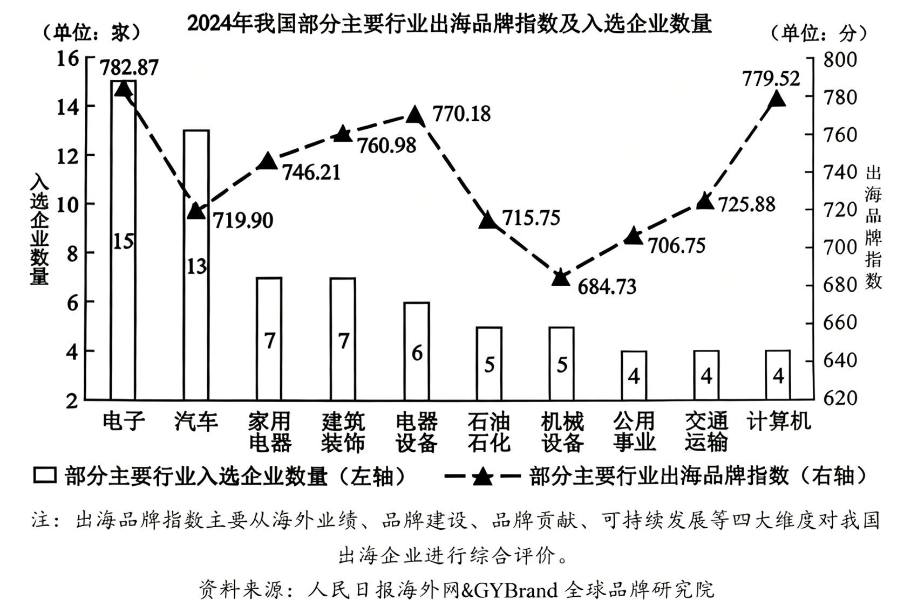

**思想政治**

**一、选择题**

1\. 广西牢记习近平总书记“广西生态优势金不换”的殷切嘱托，持续擦亮“山清水秀生态美”金字招牌，让高颜值的“绿水青山”不断转化为高价值的“金山银山”，谱写美丽中国建设广西篇章。由此可见（ ）

①在广西各族人民的共同努力下，美丽广西已经基本建成

②坚持绿色发展是促进广西经济社会可持续发展的第一动力

③生态优势是广西将“绿水青山”转化为“金山银山”的重要立足点

④美丽广西建设坚持了党的领导，彰显了习近平生态文明思想的真理力量

A. ①② B. ①④ C. ②③ D. ③④

2\. 中国共产党顺应时代发展潮流，在党的十一届三中全会上作出了改革开放的重大决策。40多年来，我国改革开放从开启新时期到进入新时代，许多领域实现了历史性变革、系统性重塑、整体性重构。实践证明，改革开放（ ）

①是中国式现代化的本质要求

②是新时代党的全部理论和实践的主题

③是坚持和发展中国特色社会主义必由之路

④是党认识和把握社会主义发展规律的伟大创造

A. ①② B. ①③ C. ②④ D. ③④

3\. 2025年3月，金融监管总局发布《关于进一步扩大金融资产投资公司股权投资试点的通知》，允许金融资产投资公司通过附属机构发行的私募股权投资基金，在试点城市所在省份范围内，对科技创新和民营企业开展股权投资。据此，下列传导路径正确的是（ ）

①拓宽金融资产投资公司资金来源

②扩大金融资产投资公司的投资范围

③丰富民营企业多元化融资途径

④发行私募股权投资基金

⑤吸引更多中长期资金参与

⑥扩大对民营企业的股权投资规模

A. ②—①—③—⑥ B. ②—③—⑥—⑤ C. ④—⑤—①—⑥ D. ④—①—⑥—③

4\. 2025年2月以来，我国铁路部门有效整合交通和文旅资源，增开了多趟银发主题旅游列车，通过对列车进行适老化改造，配备专业医护人员，提供“管家式”服务，精准回应老年群体旅游需求，顺应银发消费升级趋势。这蕴含的经济逻辑有（ ）

①消费场景创新培育服务消费新业态

②服务供给扩大满足银发市场新需求

③适老化改造提高基本养老服务供给水平

④服务品质提升增强老年人消费能力和意愿

A. ①② B. ①④ C. ②③ D. ③④

5\. 2025年5月，“12356”全国统一心理援助热线全面启用。这条热线源于一位政协委员在全国政协十四届二次会议上提出的《关于设立全国统一心理健康援助热线短号码的提案》。作为提案承办单位，国家卫健委深入调研，加强协调，最终获批并启用这一热线。这表明（ ）

①政协委员参政议政，助力解决民生问题

②人民政协发挥界别优势，凝聚智慧共识

③国家卫健委履职尽责，增强提案办理实效

④全国政协搭建平台，提升政协委员议政能力

A. ①③ B. ①④ C. ②③ D. ②④

6\. 某村探索实施“乡贤+”模式，引导老干部、老教师、致富能手等乡贤能人参与乡村治理。在这其中，乡贤能人可以（ ）

①召集并参加村民会议，共同制定乡村振兴规划

②参与村务监督，加强对农村小微权力的外部监督

③成立乡贤理事会，优化基层群众性自治组织结构

④协助村民委员会工作，参与基层公共事务协商和治理

A. ①③ B. ①④ C. ②③ D. ②④

7\. 多年来，广西以铸牢中华民族共同体意识为主线，深入挖掘民族文化中的法治元素，将普法与广西三月三、盘王节、跳坡节等民族传统节庆紧密融合，不断激发群众学法用法的内生动力，推动法治社会建设。这启示我们（ ）

①法治社会是构筑法治国家的基础

②增强普法效果需要创新普法内容

③全民普法是全面依法治国的长期基础性工作

④法治社会建设需要传承中华优秀传统法律文化

A. ①② B. ①③ C. ②④ D. ③④

8\. 我国科研人员运用高精度测序等前沿技术并结合多种算法，在全球首次成功绘制六倍体小麦的端粒到端粒完整基因组图谱。依托该成果，科研人员可以更精准地挖掘与产量品质、抗病性相关的关键基因，为小麦品种改良带来重要突破。由此可见（ ）

①高精度测序技术的运用深化了对小麦基因的认识

②科研人员可依托图谱创造基于自身需要的小麦改良品种

③依托图谱指导小麦品种改良是对小麦基因认识的高级阶段

④形成对小麦完整基因组图谱的认识实现了思维从抽象上升到具体

A. ①② B. ①④ C. ②③ D. ③④

9\. 《教育强国建设规划纲要（2024-2035年）》提出，要全面构建固本铸魂的思想政治教育体系。J省发挥红色文化资源优势，强化红色文化铸魂育人作用，将红色文化有效融入大中小学思政课一体化建设，提高思想政治教育的实效性。J省上述做法的哲学依据是（ ）

①事物的价值在于事物对客体需要的满足

②社会意识对社会存在具有能动的反作用

③人对社会的物质贡献和精神贡献具有统一性

④价值观直接影响一个人的理想、信念、生活目标

A. ①② B. ①③ C. ②④ D. ③④

10\. 2025年“五一”国际劳动节前夕，庆祝中华全国总工会成立100周年暨全国劳动模范和先进工作者表彰大会在北京召开。大会号召全社会学习劳动模范和先进工作者的事迹，弘扬劳模精神、劳动精神、工匠精神。大力弘扬这些精神，因为它们（ ）

①是中华民族共同的精神标识

②是民族精神和时代精神的生动体现

③奠定了民族生存和发展的精神根基

④能为实现中华民族伟大复兴注入强大力量

A. ①③ B. ①④ C. ②③ D. ②④

11\. 近年来，我国各行业龙头企业积极“走出去”，通过极具含金量的商品、服务与技术，不断融入全球价值链，加速开拓海外市场。2024年，我国出海品牌指数100强平均得分为746.89分（满分1000分）。结合下图，可推断出（ ）

①我国出海的龙头企业重视海外市场的本地化运营

②出海品牌指数可反映相关行业在全球价值链中的位置

③入选企业数量越多说明该行业的企业在国内市场的竞争力越强

④机械设备、公用事业和石油石化行业的企业开拓海外市场的潜力大

A. ①② B. ①③ C. ②④ D. ③④

12\. 2024年12月1日起，中国给予所有同中国建交的最不发达国家100%税目产品零关税待遇，为这些国家的优质产品更加便捷地进入中国市场创造有利条件，推动相关国家的产业发展和民生改善。这一举措表明中国（ ）

①扩大高水平对外开放的坚定决心

②秉持平等互利原则，积极拓宽多边外交范围

③以同舟共济精神推动构建合作共赢的国际新格局

④通过政策释放红利，深化南南合作实现成果共享

A. ①③ B. ①④ C. ②③ D. ②④

13\. 甲公司为其生产的甘蔗汁以“晰淅”为商标申请注册，于2013年10月16日获得核准注册。同日，甲公司为该甘蔗汁制作方法提出专利申请，后经审查获得专利权。2023年10月12日，乙公司在其生产的甘蔗汁上使用了“淅晰”商标。以下说法正确的是（ ）

①甲公司可无限次申请续展“晰淅”商标

②乙公司的“淅晰”商标因未注册而不能使用

③甲公司取得专利必须以公开其甘蔗汁制作方法为条件

④乙公司2023年10月16日后可免费使用甲公司的甘蔗汁制作方法

A. ①③ B. ①④ C. ②③ D. ②④

14\. 2024年9月1日，刘某及儿子萌萌（2018年生）遇到遛狗吴某。萌萌与吴某的小狗玩耍时，路人梁某将奶茶杯扔向小狗，小狗受到惊吓将萌萌咬伤，萌萌的治疗共花费3500元。各方因赔偿问题协商未果，刘某向人民调解委员会申请调解。以下说法符合法律规定的是（ ）

①吴某与梁某应按过错比例缴纳人民调解费用

②刘某可向吴某请求赔偿，也可向梁某请求赔偿

③萌萌是无民事行为能力人，刘某应履行监护职责

④经人民调解委员会调解达成的协议即具有强制执行效力

A. ①② B. ①④ C. ②③ D. ③④

15\. “让体重管理成为生活方式，从体重管理中获得健康收益”是当下热门话题。假设下列关于小李体重偏重的分析都为真，由此可推出导致小李体重偏重的原因是（ ）

①遗传因素和膳食均衡不同时存在

②小李的日常饮食以低糖、低油、低盐食物为主

③如果缺乏运动成立，那么膳食不均衡和睡眠不足成立

④若膳食不均衡，则饮食以高糖、高油、高盐食物为主

⑤要么遗传因素，要么睡眠不足或缺乏运动或膳食不均衡

A. 睡眠不足 B. 遗传因素 C. 缺乏运动 D. 膳食不均衡

16\. 在2024年11月举办的第十二届全国少数民族传统体育运动会上，民族健身操项目的比赛精彩纷呈。下列逻辑分析正确的有（ ）

|     |                              |                                                                                                                                      |
|:--- |:---------------------------- |:------------------------------------------------------------------------------------------------------------------------------------ |
| 序号  | 内容                           | 逻辑分析                                                                                                                                 |
| ①   | 某参赛队员说：“这次比赛太紧张了，不知不觉地就结束了。  | 该队员的论断符合逻辑思维的基本要求。                                                                                                                   |
| ②   | 将舞蹈元素融入民族健身操动作中，提升民族健身操的观赏性。 | 民族健身操的设计运用了联想思维的方法。                                                                                                                  |
| ③   | 民族健身操项目有规定套路、徒手自选套路、轻器械自选套路。 | 在民族健身操项目自选套路中，徒手自选套路与轻器械自选套路是反对关系。                                                                                                   |
| ④   | 有些民族健身操项目不是规定套路。             | 这一判断通过换质位推理可得出“有些非规定套路民族健身操项目”。 |

A. ①② B. ①③ C. ②④ D. ③④

**二、非选择题**

17\. 阅读材料，完成下列要求。

党的二十届三中全会提出：“完善区域一体化发展机制，构建跨行政区合作发展新机制，深化东中西部产业协作。”

“科创飞地”是飞出地（经济欠发达地区）在飞入地（经济发达地区）设立创新中心，利用飞入地优势开展创新孵化项目，并实现回流转化及本地产业化的经济发展模式。W市（飞出地）与S市（飞入地）签订了共建“科创飞地”的战略合作协议，在S市布局“科创飞地”，随后W市多家企业入驻。W市某汽车企业入驻并设立研发中心，借助S市优越的创新环境，研发新能源汽车生产技术，并将这些技术应用回本企业的生产中，实现了从传统汽车制造向新能源汽车制造的跨越，带动了W市上千家上下游企业的发展。两市依托各自优势，整合区域产业资源，构建智能制造、汽车零部件及海外配套等多链条合作体系，促进双方在新能源汽车领域中的发展，近5年两市新能源汽车产量复合增长率均超38%。目前，S市科创孵化载体数量已超500家，新能源汽车产业吸引超15万名复合型高端人才。

发展“科创飞地”是飞出地与飞入地共赢的选择。结合材料，运用《经济与社会》知识对此加以说明。

18\. 阅读材料，完成下列要求。

人工智能作为新一轮科技革命和产业变革的重要驱动力量，对世界发展产生了重要影响。

我国高度重视人工智能发展。从《新一代人工智能发展规划》到“人工智能+”行动，从《互联网信息服务算法推荐管理规定》到全球首部生成式人工智能法规《生成式人工智能服务管理暂行办法》，再到《网络数据安全管理条例》，我国不断加强人工智能发展的顶层设计和工作部署，并鼓励各地加强实践探索。比如，北京发布“人工智能+”行动计划，围绕教育、医疗和文化等领域打造标杆应用；上海推进政务服务领域“人工智能+”行动，打造快捷易办的“智慧好办”政务服务品牌；广西出台一系列政策措施，推动“人工智能+”赋能千行百业……目前，我国人工智能整体发展已进入全球第一梯队。

结合材料，运用《政治与法治》《当代国际政治与经济》知识，分析我国高度重视人工智能发展的意义。

19\. 阅读材料，完成下列要求。

材料一 从1926年中国首部动画短片《大闹画室》问世，到2025年《哪吒之魔童闹海》登顶全球动画电影票房榜，中国动画电影走过了近百年发展历程。

中国动画电影从《大闹画室》《铁扇公主》等影片开始积累拍摄技术和叙事经验。20世纪50年代起，中国动画人运用水墨、剪纸等传统文化元素，创作出《小蝌蚪找妈妈》《大闹天宫》等富有民族特色的动画片，中国动画学派由此声名鹊起。后来，由于电影市场疲软、技术落后等因素，中国动画电影发展暂时陷入低谷。20世纪90年代中期以来，中国动画电影运用3D渲染、动态捕捉等技术，对神话传说、古代传奇等进行现代改编。2015年《西游记之大圣归来》的横空出世，标志着中国动画电影进入全新阶段。随后，中国动画电影将创作拓展到科幻、现实等题材领域，同时广泛应用VR、AI大模型等技术，强化国际化多元表达，涌现出《长安三万里》《哪吒之魔童闹海》等现象级动画电影，跻身世界先进行列，为世界动画艺术贡献独特的美学范式。

（1）结合材料一，运用量变与质变辩证关系原理，分析中国动画电影的发展历程。

材料二 《哪吒之魔童闹海》呈现的中华传统美德引起了观众强烈共鸣。中华文化中有很多蕴含中华传统美德的典故，如愚公移山、张吴礼让（六尺巷故事）等。

（2）运用所学文化知识，说明材料二列举的典故蕴含了哪些中华传统美德，并就如何传承弘扬中华传统美德提两条具体建议。

20\. 阅读材料，完成下列要求。

2025年3月2日，徐某购买了钱某蛋糕店制作的一个蛋糕用于当晚聚餐。参加聚餐的6人中，徐某等4人食用蛋糕1小时后出现了上吐下泻症状，未食用蛋糕的2人无任何不适且当晚6人所吃食物除蛋糕外均相同。经鉴定，当日晚餐的全部食物中仅有该蛋糕的菌落总数超标，不符合食品安全国家标准。菌落总数超标易引起食用者上吐下泻。经治疗，徐某等4人恢复健康，共花费医疗费2000元、交通费300元。徐某要求钱某退回所购蛋糕费用150元，并按照《中华人民共和国食品安全法》的规定，赔偿4人损失及损失的三倍赔偿金共计9200元。钱某退回150元，但拒绝赔偿其他费用。徐某等4人遂向人民法院起诉，请求判令钱某赔偿9200元。

钱某接到法院送达的起诉状副本时，朋友甲说：“开庭审理时，在法庭辩论阶段，法官会全面调查案件事实。”朋友乙说：“只要你不提交答辩状，法院就不能开庭审理。”

（1）根据材料，参考示例，完成下表。

|         |                 |
|:------- |:--------------- |
| 证明名称    | 证明目的            |
| 鉴定意见书   | 蛋糕质量不符合食品安全国家标准 |
| 蛋糕店购物小票 | ①               |
| ②       | 徐某等4人的损失        |

（2）结合材料，运用《法律与生活》知识，对甲和乙的说法分别予以评析。

（3）结合材料，运用《逻辑与思维》中的“求异法”，探求“吃这个蛋糕”与“上吐下泻”之间的因果联系。
