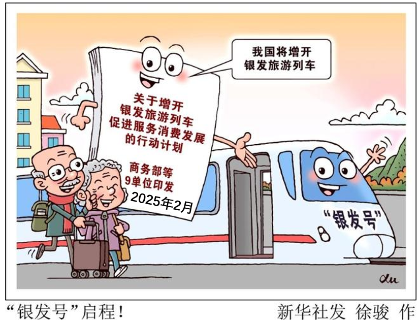

**思想政治**

**一、选择题**

1\. 广西牢记习近平总书记“广西生态优势金不换”的殷切嘱托，持续擦亮“山清水秀生态美”金字招牌，让高颜值的“绿水青山”不断转化为高价值的“金山银山”，谱写美丽中国建设广西篇章。由此可见（ ）

①在广西各族人民的共同努力下，美丽广西已经基本建成

②坚持绿色发展是促进广西经济社会可持续发展的第一动力

③生态优势是广西将“绿水青山”转化为“金山银山”的重要立足点

④美丽广西建设坚持了党的领导，彰显了习近平生态文明思想的真理力量

A. ①② B. ①④ C. ②③ D. ③④

【答案】D

【解析】

【详解】①：根据“谱写美丽中国建设广西篇章”可见美丽广西还没有建成，①错误。

②：创新是第一动力，②错误。

③：“广西生态优势金不换”，广西持续擦亮“山清水秀生态美”金字招牌，让高颜值的“绿水青山”不断转化为高价值的“金山银山”，由此可见生态优势是广西将“绿水青山”转化为“金山银山”的重要立足点，③正确。

④：广西牢记习近平总书记“广西生态优势金不换”的殷切嘱托，谱写美丽中国建设广西篇章。由此可见美丽广西建设坚持了党的领导，彰显了习近平生态文明思想的真理力量，④正确。

故本题选D。

2\. 中国共产党顺应时代发展潮流，在党的十一届三中全会上作出了改革开放的重大决策。40多年来，我国改革开放从开启新时期到进入新时代，许多领域实现了历史性变革、系统性重塑、整体性重构。实践证明，改革开放（ ）

①是中国式现代化的本质要求

②是新时代党的全部理论和实践的主题

③是坚持和发展中国特色社会主义的必由之路

④是党认识和把握社会主义发展规律的伟大创造

A. ①② B. ①③ C. ②④ D. ③④

【答案】D

【解析】

【详解】①：中国式现代化的本质要求是坚持中国共产党领导，坚持中国特色社会主义，实现高质量发展，发展全过程人民民主，丰富人民精神世界，实现全体人民共同富裕，促进人与自然和谐共生，推动构建人类命运共同体，创造人类文明新形态；改革开放不是中国式现代化的本质要求，①排除。

②：中国特色社会主义是新时代党的全部理论和实践的主题，并非改革开放，②排除。

③：40多年来改革开放带来诸多历史性变革等，表明改革开放是坚持和发展中国特色社会主义的必由之路，③正确。

④：党顺应时代发展潮流作出改革开放决策，推动了社会发展，这是党认识和把握社会主义发展规律伟大创造，④正确。

故本题选D。

3\. 2025年3月，金融监管总局发布《关于进一步扩大金融资产投资公司股权投资试点的通知》，允许金融资产投资公司通过附属机构发行的私募股权投资基金，在试点城市所在省份范围内，对科技创新和民营企业开展股权投资。据此，下列传导路径正确的是（ ）

①拓宽金融资产投资公司的资金来源

②扩大金融资产投资公司的投资范围

③丰富民营企业多元化融资途径

④发行私募股权投资基金

⑤吸引更多中长期资金参与

⑥扩大对民营企业的股权投资规模

A. ②—①—③—⑥ B. ②—③—⑥—⑤ C. ④—⑤—①—⑥ D. ④—①—⑥—③

【答案】D

【解析】

【详解】④：根据通知，金融资产投资公司通过附属机构发行私募股权投资基金，这是整个传导的起始点，④排第一位

①：因为通知支持保险资金等依法合规投资金融资产投资公司通过附属机构发行的私募股权投资基金等，所以发行私募股权投资基金能够吸引更多资金，从而拓宽金融资产投资公司的资金来源，①排第二位。

⑥：金融资产投资公司资金来源拓宽后，就有更多资金可用于在试点城市所在省份范围内对科技创新和民营企业开展股权投资，进而扩大对民营企业的股权投资规模，⑥排第三位。

③：金融资产投资公司扩大对民营企业的股权投资规模，能够为民营企业提供更多的股权投资资金，丰富民营企业多元化融资途径，③排第四位。

②：投资范围扩大（②）是政策实施的‌基础条件‌，而非传导路径的中间环节。通知将股权投资范围从试点城市扩展至所在省份，这一调整属于政策框架设定，但需通过后续发行基金（④）和资金扩容（①）才能实现实际投资落地，②排除。

⑤：吸引更多中长期资金参与（⑤）是政策实施的‌最终效果‌，属于传导路径的末端。它通过私募基金发行（④）和资金扩容（①）间接实现，但并非推动民企融资（③）的直接动力，⑤排除。

所以正确的顺序是④—①—⑥—③。

故本题选D。

4\. 2025年2月以来，我国铁路部门有效整合交通和文旅资源，增开了多趟银发主题旅游列车，通过对列车进行适老化改造，配备专业医护人员，提供“管家式”服务，精准回应老年群体的旅游需求，顺应银发消费升级趋势。这蕴含的经济逻辑有（ ）

①消费场景创新培育服务消费新业态

②服务供给扩大满足银发市场新需求

③适老化改造提高基本养老服务供给水平

④服务品质提升增强老年人消费能力和意愿

A. ①② B. ①④ C. ②③ D. ③④

【答案】A

【解析】

【详解】①：铁路部门整合资源，增开银发主题旅游列车，创新了消费场景，培育了服务消费新业态，①正确。

②：通过对列车适老化改造、配备医护人员等扩大服务供给，精准回应老年群体旅游需求，满足银发市场新需求，②正确。

③：增开旅游列车属于旅游消费服务，并非基本养老服务，③排除。

④：服务品质提升能增强老年人消费意愿，但不能直接增强其消费能力，消费能力主要受收入等因素影响，④排除。

故本题选A。

5\. 2025年5月，“12356”全国统一心理援助热线全面启用。这条热线源于一位政协委员在全国政协十四届二次会议上提出的《关于设立全国统一心理健康援助热线短号码的提案》。作为提案承办单位，国家卫健委深入调研，加强协调，最终获批并启用这一热线。这表明（ ）

①政协委员参政议政，助力解决民生问题

②人民政协发挥界别优势，凝聚智慧共识

③国家卫健委履职尽责，增强提案办理实效

④全国政协搭建平台，提升政协委员议政能力

A. ①③ B. ①④ C. ②③ D. ②④

【答案】A

【解析】

【详解】①：政协委员在全国政协会议上提出提案，体现了政协委员参政议政的职能，心理援助热线涉及民生问题（心理健康），表明政协委员通过提案助力解决民生问题，①正确。

②：材料仅涉及一位政协委员的提案，未体现人民政协发挥界别优势、凝聚智慧共识的相关内容，②不选。

③：国家卫健委作为提案承办单位，深入调研、加强协调，最终推动热线获批启用，体现了其履职尽责，增强了提案办理实效，③正确。

④：题干不涉及全国政协搭建平台，提升政协委员议政能力，④不选。

故本题选A。

6\. 某村探索实施“乡贤+”模式，引导老干部、老教师、致富能手等乡贤能人参与乡村治理。在这其中，乡贤能人可以（ ）

①召集并参加村民会议，共同制定乡村振兴规划

②参与村务监督，加强对农村小微权力的外部监督

③成立乡贤理事会，优化基层群众性自治组织结构

④协助村民委员会工作，参与基层公共事务协商和治理

A. ①③ B. ①④ C. ②③ D. ②④

【答案】D

【解析】

【详解】①：按照村民委员会组织法，村民会议由村民委员会召集，而不是由乡贤能人召集，①错误。

②：村务监督属于基层民主监督，是基层群众享有的重要民主权利，因此，乡贤能人可以参与村务监督，加强对农村小微权力的外部监督，②正确。

③：我国的基层群众性自治组织包括农村的村民委员会和城市的居民委员会。乡贤理事会属于基层社会团体，不属于基层群众性自治组织，因而成立乡贤理事会没有优化基层群众性自治组织结构，③错误。

④：某村探索实施“乡贤+”模式，引导老干部、老教师、致富能手等乡贤能人参与乡村治理，体现了乡贤能人可以协助村民委员会工作，参与基层公共事务协商和治理，④正确。

故本题选D。

7\. 多年来，广西以铸牢中华民族共同体意识为主线，深入挖掘民族文化中的法治元素，将普法与广西三月三、盘王节、跳坡节等民族传统节庆紧密融合，不断激发群众学法用法的内生动力，推动法治社会建设。这启示我们（ ）

①法治社会是构筑法治国家的基础

②增强普法效果需要创新普法内容

③全民普法是全面依法治国的长期基础性工作

④法治社会建设需要传承中华优秀传统法律文化

A. ①② B. ①③ C. ②④ D. ③④

【答案】D

【解析】

【详解】①：该选项强调法治社会对法治国家的重要性，而题干强调的是广西推动法治社会建设的具体做法，未涉及法治国家与法治社会的关系，①排除。

②：广西将普法与民族传统节庆紧密融合，这体现的是创新普法形式而非内容，②排除。

③：广西通过多种方式推动法治社会建设，激发群众学法用法动力，这表明全民普法是全面依法治国的长期基础性工作，③正确。

④：广西深入挖掘民族文化中的法治元素，推动法治社会建设，启示我们法治社会建设需要传承中华优秀传统法律文化，④正确。

故本题选D。

8\. 我国科研人员运用高精度测序等前沿技术并结合多种算法，在全球首次成功绘制六倍体小麦的端粒到端粒完整基因组图谱。依托该成果，科研人员可以更精准地挖掘与产量品质、抗病性相关的关键基因，为小麦品种改良带来重要突破。由此可见（ ）

①高精度测序技术的运用深化了对小麦基因的认识

②科研人员可依托图谱创造基于自身需要的小麦改良品种

③依托图谱指导小麦品种改良是对小麦基因认识的高级阶段

④形成对小麦完整基因组图谱的认识实现了思维从抽象上升到具体

A. ①② B. ①④ C. ②③ D. ③④

【答案】B

【解析】

【详解】①：运用高精度测序等前沿技术绘制六倍体小麦的端粒到端粒完整基因组图谱，能更精准挖掘关键基因，说明高精度测序技术的运用深化了对小麦基因的认识，①正确。

②：科研人员应依托图谱并遵循小麦自身生长规律创造小麦改良品种，而不是基于自身需要，②排除。

③：实践是认识的目的，依托图谱指导小麦品种改良属于实践活动，而理性认识才是认识的高级阶段，③排除。

④：从对小麦各方面零散的认识到绘制出完整基因组图谱，实现了思维从抽象上升到具体，④正确。

故本题选B。

9\. 《教育强国建设规划纲要（2024-2035年）》提出，要全面构建固本铸魂的思想政治教育体系。J省发挥红色文化资源优势，强化红色文化铸魂育人作用，将红色文化有效融入大中小学思政课一体化建设，提高思想政治教育的实效性。J省上述做法的哲学依据是（ ）

①事物的价值在于事物对客体需要的满足

②社会意识对社会存在具有能动的反作用

③人对社会的物质贡献和精神贡献具有统一性

④价值观直接影响一个人的理想、信念、生活目标

A. ①② B. ①③ C. ②④ D. ③④

【答案】C

【解析】

【详解】①：哲学上的价值是指客体对主体的积极意义，因而事物的价值在于事物对主体需要的满足，而不是对客体需要的满足，①错误。

②：红色文化属于社会意识，“发挥红色文化资源优势，强化红色文化铸魂育人作用”体现了先进的社会意识对社会发展起推动作用，②正确。

③：对一个人的价值的评价归根到底是看他的贡献。人的贡献是多方面的，既包括物质贡献，也包括精神贡献。题干强调强化红色文化铸魂育人作用，不涉及人的物质贡献和精神贡献具有统一性，③不选。

④：之所以要发挥红色文化资源优势，强化红色文化铸魂育人作用，从价值观的角度看，是因为价值观具有重要的导向作用，直接影响一个人的理想、信念、生活目标，④正确。

故本题选C。

10\. 2025年“五一”国际劳动节前夕，庆祝中华全国总工会成立100周年暨全国劳动模范和先进工作者表彰大会在北京召开。大会号召全社会学习劳动模范和先进工作者的事迹，弘扬劳模精神、劳动精神、工匠精神。大力弘扬这些精神，因为它们（ ）

①是中华民族共同的精神标识

②是民族精神和时代精神的生动体现

③奠定了民族生存和发展的精神根基

④能为实现中华民族伟大复兴注入强大力量

A. ①③ B. ①④ C. ②③ D. ②④

【答案】D

【解析】

【详解】①：中华文化是中华民族共同的精神标识，涵养着中华民族共同的价值观。不能把劳模精神、劳动精神、工匠精神等同于中华文化，①不选。

②④：民族精神作为民族文化的结晶，其形成和发展既是长期历史积淀的过程，也是随着时代变化而不断丰富的过程。劳模精神、劳动精神、工匠精神是民族精神和时代精神的生动体现，能为实现中华民族伟大复兴注入强大力量，②④正确。

③：民族文化起着维系社会生活、维持社会稳定、激发民族创造力和凝聚力的重要作用，是一个民族生存与发展的精神根基，③不选。

故本题选D。

11\. 近年来，我国各行业龙头企业积极“走出去”，通过极具含金量的商品、服务与技术，不断融入全球价值链，加速开拓海外市场。2024年，我国出海品牌指数100强平均得分为746.89分（满分1000分）。结合下图，可推断出（ ）

①我国出海的龙头企业重视海外市场的本地化运营

②出海品牌指数可反映相关行业在全球价值链中的位置

③入选企业数量越多说明该行业的企业在国内市场的竞争力越强

④机械设备、公用事业和石油石化行业的企业开拓海外市场的潜力大

A. ①② B. ①③ C. ②④ D. ③④

【答案】C

【解析】

【详解】①：题干材料反映的是我国部分主要行业出海品牌指数及入选企业数量，不涉及我国出海的龙头企业的运营方式，因而无法推断出“我国出海的龙头企业重视海外市场的本地化运营”这一结论，①不选。

②：近年来，我国各行业龙头企业积极“走出去”，通过极具含金量的商品、服务与技术，不断融入全球价值链；出海品牌指数主要从海外业绩、品牌建设、品牌贡献、可持续发展等四大维度对我国出海企业进行综合评价。因此，根据出海品牌指数的高低可以反映相关行业龙头企业的国际竞争力和在全球价值链中的位置，②正确。

③：题干中我国计算机行业出海品牌入选企业数量相对较少，只有4家，但其品牌指数却较高，这说明“入选企业数量越多说明该行业企业在国内市场的竞争力越强”结论错误，③不选。

④：机械设备、公用事业和石油石化行业出海品牌指数相对较低，说明这些行业在商品、服务与技术等方面开拓海外市场的潜力大，④正确。

故本题选C。

12\. 2024年12月1日起，中国给予所有同中国建交的最不发达国家100%税目产品零关税待遇，为这些国家的优质产品更加便捷地进入中国市场创造有利条件，推动相关国家的产业发展和民生改善。这一举措表明中国（ ）

①扩大高水平对外开放的坚定决心

②秉持平等互利原则，积极拓宽多边外交范围

③以同舟共济精神推动构建合作共赢的国际新格局

④通过政策释放红利，深化南南合作实现成果共享

A. ①③ B. ①④ C. ②③ D. ②④

【答案】B

【解析】

【详解】①：中国给予100%税目产品零关税待遇，这一举措表明中国扩大高水平对外开放的坚定决心，①正确。

②：中国给予所有同中国建交最不发达国家100%税目产品零关税待遇，并没有拓宽多边外交范围，②错误。

③：材料体现的是中国对于不发达国家给与关税减免，构建合作共赢的国际新格局在材料中没有体现，③不符合题意。

④：中国为同中国建交的最不发达国家的优质产品更加便捷地进入中国市场创造有利条件，推动相关国家的产业发展和民生改善。这一举措表明中国通过政策释放红利，深化南南合作实现成果共享，④正确。

故本题选B。

13\. 甲公司为其生产的甘蔗汁以“晰淅”为商标申请注册，于2013年10月16日获得核准注册。同日，甲公司为该甘蔗汁制作方法提出专利申请，后经审查获得专利权。2023年10月12日，乙公司在其生产的甘蔗汁上使用了“淅晰”商标。以下说法正确的是（ ）

①甲公司可无限次申请续展“晰淅”商标

②乙公司的“淅晰”商标因未注册而不能使用

③甲公司取得专利必须以公开其甘蔗汁制作方法为条件

④乙公司2023年10月16日后可免费使用甲公司的甘蔗汁制作方法

A. ①③ B. ①④ C. ②③ D. ②④

【答案】A

【解析】

【详解】①：注册商标有效期为10年，期满可续展，且可无限次申请续展，甲公司2013年10月16日获得核准注册“晰淅”商标，可无限次申请续展，①正确。

②：商标未注册也可使用，只是不享有商标专用权，乙公司“淅晰”商标未注册也能使用，②排除。

③：发明人取得专利，通常要以公开其发明内容为条件，甲公司取得专利必须以公开其甘蔗汁制作方法为条件，③正确。

④：发明专利的保护期为20年，实用新型专利的保护期为10年， 外观设计专利的保护期为15年，均自申请日起计算。保护期满以后，这些发明创造就进入公共领域，任何人都可以免费使用。本案属于发明专利，专利保护期从申请日起算，甲公司2013年10月16日申请专利，保护期20年到2033年10月16日结束，乙公司并非从2023年10月16日后就可免费使用，④错误。

故本题选A。

14\. 2024年9月1日，刘某及儿子萌萌（2018年生）遇到遛狗的吴某。萌萌与吴某的小狗玩耍时，路人梁某将奶茶杯扔向小狗，小狗受到惊吓将萌萌咬伤，萌萌的治疗共花费3500元。各方因赔偿问题协商未果，刘某向人民调解委员会申请调解。以下说法符合法律规定的是（ ）

①吴某与梁某应按过错比例缴纳人民调解费用

②刘某可向吴某请求赔偿，也可向梁某请求赔偿

③萌萌是无民事行为能力人，刘某应履行监护职责

④经人民调解委员会调解达成的协议即具有强制执行效力

A. ①② B. ①④ C. ②③ D. ③④

【答案】C

【解析】

【详解】①：根据《人民调解法》第四条，人民调解委员会调解民间纠纷不收取任何费用，不存在“吴某与梁某按过错比例缴纳人民调解费用”的情况，①排除。

②：依据《民法典》第一千二百五十条，因第三人梁某的过错致使小狗咬伤萌萌，被侵权人（萌萌的监护人刘某）可向动物饲养人吴某请求赔偿，也可向第三人梁某请求赔偿，②正确。

③：《民法典》第二十条规定不满八周岁的未成年人为无民事行为能力人，萌萌2018年生、2024年案发时6岁，属无民事行为能力人；同时《民法典》第三十四条明确监护人需履行保护被监护人权益的职责，刘某作为萌萌监护人应履行监护职责，该表述符合法律规定，③正确。

④：根据《人民调解法》第三十三条，经人民调解达成的协议仅具有法律约束力，需经人民法院司法确认后才具有强制执行效力，“即具有强制执行效力”的表述缺少关键程序，④排除。

故本题选C

15\. “让体重管理成为生活方式，从体重管理中获得健康收益”是当下热门话题。假设下列关于小李体重偏重的分析都为真，由此可推出导致小李体重偏重的原因是（ ）

①遗传因素和膳食均衡不同时存在

②小李的日常饮食以低糖、低油、低盐食物为主

③如果缺乏运动成立，那么膳食不均衡和睡眠不足成立

④若膳食不均衡，则饮食以高糖、高油、高盐食物为主

⑤要么遗传因素，要么睡眠不足或缺乏运动或膳食不均衡

A. 睡眠不足 B. 遗传因素 C. 缺乏运动 D. 膳食不均衡

【答案】A

【解析】

【详解】ABCD：由条件②“小李的日常饮食以低糖、低油、低盐食物为主”，根据④“若膳食不均衡，则饮食以高糖、高油、高盐食物为主”，否后必否前，可推出小李膳食均衡。因为①“遗传因素和膳食均衡不同时存在”，现在已知膳食均衡，所以小李不存在遗传因素。再看⑤“要么遗传因素，要么睡眠不足或缺乏运动或膳食不均衡”，已推出不存在遗传因素，根据“要么…… 要么……”的逻辑关系，否定一支则肯定另一支，所以睡眠不足或缺乏运动或膳食不均衡成立。又已知膳食均衡，所以睡眠不足或缺乏运动成立。假设缺乏运动成立，根据③“如果缺乏运动成立，那么膳食不均衡和睡眠不足成立”，肯前必肯后，会得出膳食不均衡，这与前面推出的膳食均衡矛盾，所以缺乏运动不成立。因为睡眠不足或缺乏运动成立，缺乏运动不成立，根据“或关系”否定一支则肯定另一支，所以睡眠不足成立。故导致小李体重偏重的原因是睡眠不足，A正确，BCD排除。

故本题选A。

16\. 在2024年11月举办的第十二届全国少数民族传统体育运动会上，民族健身操项目的比赛精彩纷呈。下列逻辑分析正确的有（ ）

|     |                              |                                    |
|:--- |:---------------------------- |:---------------------------------- |
| 序号  | 内容                           | 逻辑分析                               |
| ①   | 某参赛队员说：“这次比赛太紧张了，不知不觉地就结束了。  | 该队员的论断符合逻辑思维的基本要求。                 |
| ②   | 将舞蹈元素融入民族健身操动作中，提升民族健身操的观赏性。 | 民族健身操的设计运用了联想思维的方法。                |
| ③   | 民族健身操项目有规定套路、徒手自选套路、轻器械自选套路。 | 在民族健身操项目自选套路中，徒手自选套路与轻器械自选套路是反对关系。 |
| ④   | 有些民族健身操项目不是规定套路。             | 这一判断通过换质位推理可得出“有些非规定套路是民族健身操项目”。   |

A. ①② B. ①③ C. ②④ D. ③④

【答案】C

【解析】

【详解】①：“太紧张”意味着对比赛过程有清晰的主观感受和关注，“不知不觉地就结束了”又表示对比赛过程没有清晰的感知，这两种说法不能同时成立，存在自相矛盾的情况。 思维的一致性要求是指在同一思维过程中，对同一对象不能同时作出两个相互矛盾的判断。某参赛队员的表述违反了思维的一致性要求，违背了矛盾律，①错误。

②：联想思维是将不同事物的认识进行联结与思考，将舞蹈元素融入民族健身操创作，是把舞蹈和健身操的元素进行联结，运用了联想思维的方法，②正确。

③：反对关系是指两个概念外延完全不同，且它们的外延之和小于其属概念的外延。而自选套路中，徒手自选套路与轻器械自选套路的外延之和等于该属概念的外延，属于矛盾关系，并非反对关系，③错误。

④：换质位推理是先换质再换位，“有些民族健身操项目不是规定套路”进行换质推理为“有些民族健身操项目是非规定套路”，再换位可得出“有些非规定套路是民族健身操项目”，④正确。

故本题选C。

**二、非选择题**

17\. 阅读材料，完成下列要求。

党的二十届三中全会提出：“完善区域一体化发展机制，构建跨行政区合作发展新机制，深化东中西部产业协作。”

“科创飞地”是飞出地（经济欠发达地区）在飞入地（经济发达地区）设立创新中心，利用飞入地优势开展创新孵化项目，并实现回流转化及本地产业化的经济发展模式。W市（飞出地）与S市（飞入地）签订了共建“科创飞地”的战略合作协议，在S市布局“科创飞地”，随后W市多家企业入驻。W市某汽车企业入驻并设立研发中心，借助S市优越的创新环境，研发新能源汽车生产技术，并将这些技术应用回本企业的生产中，实现了从传统汽车制造向新能源汽车制造的跨越，带动了W市上千家上下游企业的发展。两市依托各自优势，整合区域产业资源，构建智能制造、汽车零部件及海外配套等多链条合作体系，促进双方在新能源汽车领域中的发展，近5年两市新能源汽车产量复合增长率均超38%。目前，S市科创孵化载体数量已超500家，新能源汽车产业吸引超15万名复合型高端人才。

发展“科创飞地”是飞出地与飞入地共赢的选择。结合材料，运用《经济与社会》知识对此加以说明。

【答案】对于飞出地：①借助飞入地优越的创新环境，设立研发中心，获取创新资源，有利于提升企业创新能力，推动产业升级，实现从传统产业向新兴产业的跨越，如W市某汽车企业从传统汽车制造向新能源汽车制造转变。②带动本地上下游企业发展，形成产业协同效应，促进区域经济发展，推动区域协调发展，缩小地区发展差距。

对于飞入地：①通过与飞出地合作，整合区域产业资源，构建多链条合作体系，实现资源优化配置，促进产业结构优化升级，推动新能源汽车等产业发展，提高产业竞争力，两市新能源汽车产量复合增长率均超38%。②“科创飞地”的发展促使科创孵化载体数量增加，吸引大量复合型高端人才，为经济发展提供人才支撑和创新动力，推动当地经济高质量发展。

【解析】

【分析】背景素材：“科创飞地”

考点考查：我国的经济发展

能力考查：描述和阐释事物、论证和探究问题

核心素养：政治认同、科学精神

【详解】第一步：审设问。明确主体、作答范围、问题限定和作答角度。本题为分析说明类主观题，要求《经济与社会》知识，说明发展“科创飞地”是飞出地与飞入地共赢的选择，从我国的经济发展角度来分析作答。

第二步：审材料。提取关键词，链接教材知识。

有效信息①：W市某汽车企业入驻并设立研发中心，借助S市优越的创新环境，研发新能源汽车生产技术，并将这些技术应用回本企业的生产中，实现了从传统汽车制造向新能源汽车制造的跨越→可从新发展理念、高质量发展的角度，运用发展“科创飞地”有利于提升企业创新能力，推动产业升级，实现从传统产业向新兴产业的跨越知识来分析说明“科创飞地”模式有助于飞出地借助飞入地的创新资源，推动自身产业升级，带动相关产业发展。

有效信息②：带动了W市上千家上下游企业的发展→可从新发展理念的角度，运用协调发展理念的知识来分析说明发展“科创飞地”有利于形成产业协同效应，促进区域经济发展，推动区域协调发展，缩小地区发展差距。

有效信息③：两市依托各自优势，整合区域产业资源，构建智能制造、汽车零部件及海外配套等多链条合作体系，促进双方在新能源汽车领域中的发展→可从高质量发展角度，运用产业结构优化升级，推动新能源汽车等产业发展，提高产业竞争力的知识来分析说明“科创飞地”模式能使飞入地整合资源，优化产业结构。

有效信息④：新能源汽车产业吸引超15万名复合型高端人才→可从新发展理念的角度，运用人才是第一资源的知识来分析说明“科创飞地”的发展吸引大量复合型高端人才，为经济发展提供人才支撑和创新动力，推动当地经济高质量发展。

第三步：整合信息，组织答案。注意设问限定以及教材知识与材料等相结合。

18\. 阅读材料，完成下列要求。

人工智能作为新一轮科技革命和产业变革的重要驱动力量，对世界发展产生了重要影响。

我国高度重视人工智能发展。从《新一代人工智能发展规划》到“人工智能+”行动，从《互联网信息服务算法推荐管理规定》到全球首部生成式人工智能法规《生成式人工智能服务管理暂行办法》，再到《网络数据安全管理条例》，我国不断加强人工智能发展的顶层设计和工作部署，并鼓励各地加强实践探索。比如，北京发布“人工智能+”行动计划，围绕教育、医疗和文化等领域打造标杆应用；上海推进政务服务领域“人工智能+”行动，打造快捷易办的“智慧好办”政务服务品牌；广西出台一系列政策措施，推动“人工智能+”赋能千行百业……目前，我国人工智能整体发展已进入全球第一梯队。

结合材料，运用《政治与法治》《当代国际政治与经济》知识，分析我国高度重视人工智能发展的意义。

【答案】①我国高度重视人工智能发展，是坚持党的领导、人民当家作主和依法治国有机统一的体现。我国不断出台相关规划、规定、办法等，加强人工智能发展的顶层设计和工作部署，推动法治政府建设，有利于提高政府治理能力和治理水平，更好地为人民服务。②重视人工智能发展，鼓励各地各领域加强实践探索，推动“人工智能+”赋能千行百业，有利于满足人民日益增长的美好生活需要，体现了我国作为人民民主专政的社会主义国家，始终把人民利益放在首位。 ③当前国际竞争的实质是以经济和科技实力为基础的综合国力的较量。人工智能作为新一轮科技革命和产业变革的重要驱动力量，我国高度重视其发展，有利于提高我国的科技实力和经济实力，进而增强我国的综合国力，提升我国在国际竞争中的地位。④经济全球化深入发展，我国重视人工智能发展，积极参与全球人工智能领域的合作与竞争，有利于更好地融入经济全球化进程，充分利用全球资源和市场，推动我国经济高质量发展，同时也为世界经济发展注入新动能。⑤我国重视人工智能发展，在发展自身人工智能产业的同时，也为全球人工智能治理提供中国方案、贡献中国智慧，有利于推动构建人类命运共同体，推动构建公正合理的全球科技治理体系。

【解析】

【分析】背景素材：我国高度重视人工智能发展

考点考查：人民当家作主、法治政府、世界多极化、经济全球化

能力考查：描述和阐述事物、论证和探究问题

核心素养：政治认同、科学精神、法治意识

【详解】第一步：审设问，明确主体、作答范围、问题限定和作答角度。本题属于意义类主观题，需调用人民当家作主、法治政府、世界多极化、经济全球化的相关知识结合材料有效信息分析作答。

第二步：审材料，提取关键词，链接教材知识。

有效信息①：我国不断加强人工智能发展的顶层设计和工作部署，上海推进政务服务领域“人工智能+”行动，打造快捷易办的“智慧好办”政务服务品牌→运用法治政府的知识，从推动法治政府建设，提高政府治理能力和治理水平，更好地为人民服务的角度分析。

有效信息②：广西出台一系列政策措施，推动“人工智能+”赋能千行百业→运用我国国家性质的知识，从满足人民日益增长的美好生活需要的角度分析。

有效信息③：人工智能作为新一轮科技革命和产业变革的重要驱动力量→运用国际竞争实质的知识，从提高我国的科技实力和经济实力，增强综合国力，提升国际竞争力的角度分析。

有效信息④：我国人工智能整体发展已进入全球第一梯队→运用经济全球化与中国的知识，从融入经济全球化进程，充分利用全球资源和市场，推动我国经济高质量发展，同时也为世界经济发展注入新动能的角度分析。

有效信息⑤：全球首部生成式人工智能法规《生成式人工智能服务管理暂行办法》，再到《网络数据安全管理条例》→运用构建人类命运共同体的知识，从为全球人工智能治理提供中国方案、贡献中国智慧，推动构建人类命运共同体，推动构建公正合理的全球科技治理体系的角度分析。

第三步：整合信息，组织答案。

19\. 阅读材料，完成下列要求。

材料一 从1926年中国首部动画短片《大闹画室》问世，到2025年《哪吒之魔童闹海》登顶全球动画电影票房榜，中国动画电影走过了近百年发展历程。

中国动画电影从《大闹画室》《铁扇公主》等影片开始积累拍摄技术和叙事经验。20世纪50年代起，中国动画人运用水墨、剪纸等传统文化元素，创作出《小蝌蚪找妈妈》《大闹天宫》等富有民族特色的动画片，中国动画学派由此声名鹊起。后来，由于电影市场疲软、技术落后等因素，中国动画电影发展暂时陷入低谷。20世纪90年代中期以来，中国动画电影运用3D渲染、动态捕捉等技术，对神话传说、古代传奇等进行现代改编。2015年《西游记之大圣归来》的横空出世，标志着中国动画电影进入全新阶段。随后，中国动画电影将创作拓展到科幻、现实等题材领域，同时广泛应用VR、AI大模型等技术，强化国际化多元表达，涌现出《长安三万里》《哪吒之魔童闹海》等现象级动画电影，跻身世界先进行列，为世界动画艺术贡献独特的美学范式。

（1）结合材料一，运用量变与质变辩证关系原理，分析中国动画电影的发展历程。

材料二 《哪吒之魔童闹海》呈现的中华传统美德引起了观众强烈共鸣。中华文化中有很多蕴含中华传统美德的典故，如愚公移山、张吴礼让（六尺巷故事）等。

（2）运用所学文化知识，说明材料二列举的典故蕴含了哪些中华传统美德，并就如何传承弘扬中华传统美德提两条具体建议。

【答案】（1）①量变是质变的必要准备。中国动画电影从早期的《大闹画室》《铁扇公主》等影片开始，不断积累拍摄技术和叙事经验，运用传统文化元素创作富有民族特色的动画片，为其发展奠定了坚实基础。

②量变达到一定程度必然引起质变，质变是量变的必然结果。20世纪90年代中期以来，中国动画电影运用新的技术对传统题材进行现代改编，2015年《西游记之大圣归来》的出现，标志着中国动画电影进入全新阶段，实现了质的飞跃。

③质变又为新的量变开辟道路，使事物在新质的基础上开始新的量变。中国动画电影进入新阶段后，将创作拓展到更多题材领域，广泛应用新技术，强化国际化多元表达，涌现出众多优秀作品，在新质基础上持续发展，跻身世界先进行列。

（2）愚公移山：蕴含了艰苦奋斗、坚韧不拔、持之以恒的中华传统美德。愚公面对大山，没有退缩，而是凭借坚定的信念和不懈的努力，试图移走大山，这种精神体现了为实现目标不畏艰难、持之以恒奋斗的品质。张吴礼让（六尺巷故事）：蕴含了谦逊礼让、和睦友善的中华传统美德。张英和吴姓邻居在宅基地问题上，通过相互礼让，成就了六尺巷的佳话，展现了邻里之间以和为贵、相互包容的高尚品德。

①开展主题教育活动：学校、社区等可以定期开展以中华传统美德为主题的教育活动，如主题班会、道德讲堂等，通过讲述典故、分享故事等形式，让人们深入了解中华传统美德的内涵和价值，增强传承意识。

②文化产品创作推广：文艺工作者可以以这些典故为素材，创作更多优秀的文化产品，如动画、漫画、戏剧等，通过生动形象的表现形式，传播中华传统美德，扩大其影响力。

【解析】

【分析】背景素材：中国动画电影的发展历程；中华传统美德

考点考查：正确认识中华传统文化、世界是永恒发展的等知识

能力考查：描述和阐释事物、论证和探究问题

核心素养：政治认同、科学精神

【小问1详解】

第一步：审设问。明确主体、作答范围、问题限定和作答角度。

本题为分析类主观题,要求运用量变与质变辩证关系原理，分析中国动画电影的发展历程。从世界是永恒发展的角度来分析作答。

第二步：审材料。提取关键词，链接教材知识。

有效信息①：中国动画电影从《大闹画室》《铁扇公主》等影片开始积累拍摄技术和叙事经验。20 世纪 50 年代起，中国动画人运用水墨、剪纸等传统文化元素，创作出《小蝌蚪找妈妈》《大闹天宫》等富有民族特色的动画片→可从事物发展的状态的角度，运用量变是质变的必要准备的知识来分析说明中国动画电影前期不断积累技术和叙事经验，为后续发展奠定基础。

有效信息②：20 世纪 90 年代中期以来，中国动画电影运用 3D 渲染、动态捕捉等技术，对神话传说、古代传奇等进行现代改编。2015 年《西游记之大圣归来》的横空出世，标志着中国动画电影进入全新阶段→可从事物发展的状态的角度，质变是量变的必然结果的知识来分析说明《西游记之大圣归来》标志着新阶段的到来。

有效信息③：随后，中国动画电影将创作拓展到科幻、现实等题材领域，同时广泛应用VR、AI大模型等技术，强化国际化多元表达，涌现出《长安三万里》《哪吒之魔童闹海》等现象级动画电影，跻身世界先进行列→可从事物发展的状态角度，运用质变又为新的量变开辟道路，使事物在新质的基础上开始新的量变的知识来分析说明中国动画电影进入新阶段后，在新质基础上持续发展，跻身世界先进行列。

第三步：整合信息，组织答案。注意设问限定以及教材知识与材料等相结合。

【小问2详解】

第一步：审设问。明确主体、作答范围、问题限定和作答角度。

第一小问为说明类主观题,要求运用所学文化知识，说明材料二列举的典故蕴含了哪些中华传统美德,从正确认识中华传统文化角度来分析作答。

第二步：审材料。提取关键词，链接教材知识。

有效信息①：愚公移山→可从中华传统美德的角度，运用艰苦奋斗、坚韧不拔、持之以恒的知识来分析说明。               

有效信息②：张吴礼让（六尺巷故事）→可从中华传统美德的角度，运用谦逊礼让、和睦友善的知识来分析说明。             

第三步：整合信息，组织答案。注意设问限定以及教材知识与材料等相结合。

第二小问为开放性试题，要求围绕就如何传承弘扬中华传统美德提两条具体建议。切合主题要求，言之有理即可。知识参考角度：开展主题教育活动、文化产品创作推广等。

20\. 阅读材料，完成下列要求。

2025年3月2日，徐某购买了钱某蛋糕店制作的一个蛋糕用于当晚聚餐。参加聚餐的6人中，徐某等4人食用蛋糕1小时后出现了上吐下泻症状，未食用蛋糕的2人无任何不适且当晚6人所吃食物除蛋糕外均相同。经鉴定，当日晚餐的全部食物中仅有该蛋糕的菌落总数超标，不符合食品安全国家标准。菌落总数超标易引起食用者上吐下泻。经治疗，徐某等4人恢复健康，共花费医疗费2000元、交通费300元。徐某要求钱某退回所购蛋糕费用150元，并按照《中华人民共和国食品安全法》的规定，赔偿4人损失及损失的三倍赔偿金共计9200元。钱某退回150元，但拒绝赔偿其他费用。徐某等4人遂向人民法院起诉，请求判令钱某赔偿9200元。

钱某接到法院送达的起诉状副本时，朋友甲说：“开庭审理时，在法庭辩论阶段，法官会全面调查案件事实。”朋友乙说：“只要你不提交答辩状，法院就不能开庭审理。”

（1）根据材料，参考示例，完成下表。

|         |                 |
|:------- |:--------------- |
| 证明名称    | 证明目的            |
| 鉴定意见书   | 蛋糕质量不符合食品安全国家标准 |
| 蛋糕店购物小票 | ①               |
| ②       | 徐某等4人的损失        |

（2）结合材料，运用《法律与生活》知识，对甲和乙的说法分别予以评析。

（3）结合材料，运用《逻辑与思维》中的“求异法”，探求“吃这个蛋糕”与“上吐下泻”之间的因果联系。

【答案】（1）①证明徐某购买蛋糕的事实及支付金额

②徐某等4人的医疗费发票、交通费发票

（2）对甲说法的评析：在开庭审理中，法庭调查阶段是法官全面调查案件事实的环节，而法庭辩论阶段是当事人就案件争议的有关问题阐明自己的意见，反驳对方的主张。所以甲的说法错误，混淆了法庭调查与法庭辩论两个阶段的任务。

对乙说法的评析：被告不提交答辩状的，不影响法院对案件的审理。所以乙的说法错误，误解了答辩状与开庭审理之间的关系。

（3）求异法的内容是：如果被考察的现象a在第一场合出现，在第二场合不出现，而在这两个场合之间只有一点不同，即第一场合有某一因素A，第二场合没有这个因素A，其他有关因素都是相同的，那么，这个因素A与被考察的现象a有因果联系。在本题中，当晚6人所吃食物除蛋糕外均相同，这是相同因素。徐某等4人食用蛋糕1小时后出现上吐下泻症状，未食用蛋糕的2人无任何不适，即“吃这个蛋糕”这一因素在出现“上吐下泻”症状的场合存在，在未出现“上吐下泻”症状的场合不存在。所以可以得出“吃这个蛋糕”与“上吐下泻”之间存在因果联系。

【解析】

【分析】背景素材：吃蛋糕导致上吐下泻

考点考查：严格遵守诉讼程序、依法收集运用证据、归纳推理的方法

能力考查：描述和阐释事物、论证和探究问题

核心素养：政治认同、科学精神、法治意识

【小问1详解】

第一步：审设问。明确主体、作答范围、问题限定和作答角度。

本题为分析类主观题，要求运用《法律与生活》知识，根据材料，参考示例，完成下表，从依法收集运用证据角度来分析作答。

第二步：审材料。提取关键词，链接教材知识。

有效信息①：蛋糕店购物小票→可从证据的作用的角度，说明蛋糕店购物小票能证明徐某购买蛋糕的事实及支付金额。

有效信息②：徐某等4人的损失→可从证据的作用的角度，说明徐某等4人的医疗费发票、交通费发票能证明徐某等4人的损失。

第三步：整合信息，组织答案。注意设问限定以及教材知识与材料等相结合。

【小问2详解】

第一步：审设问。明确主体、作答范围、问题限定和作答角度。

本题为评析类主观题，要求运用《法律与生活》知识，对甲和乙的说法分别予以评析。需要调用严格遵守诉讼程序的有关知识，首先判断该观点的正误，然后从不合理性角度进行阐释。

第二步：审材料。提取关键词，链接教材知识。

观点正误判断：该观点错误。

论据①：朋友甲说：“开庭审理时，在法庭辩论阶段，法官会全面调查案件事实。”→从不合理性角度分析：在开庭审理中，法庭调查阶段是法官全面调查案件事实的环节，而法庭辩论阶段是当事人就案件争议的有关问题阐明自己的意见，反驳对方的主张。所以甲的说法错误，混淆了法庭调查与法庭辩论两个阶段的任务。    

论据②：朋友乙说：“只要你不提交答辩状，法院就不能开庭审理。”→从不合理性角度分析：被告不提交答辩状，不影响法院对案件的审理。所以乙的说法错误，误解了答辩状与开庭审理之间的关系。

第三步：整合信息，组织答案。注意设问限定以及教材知识与材料等相结合。

【小问3详解】

第一步：审设问。明确主体、作答范围、问题限定和作答角度。

本题为分析说明类主观题，要求运用《逻辑与思维》中的“求异法”，探求“吃这个蛋糕”与“上吐下泻”之间的因果联系。从归纳推理的方法的角度来分析作答。

第二步：审材料。提取关键词，链接教材知识。

有效信息①：参加聚餐的6人中，徐某等4人食用蛋糕1小时后出现了上吐下泻症状，未食用蛋糕的2人无任何不适且当晚6人所吃食物除蛋糕外均相同。→可从归纳推理的方法的角度，运用求异法的知识来分析说明在本题中，当晚6人所吃食物除蛋糕外均相同，这是相同因素。徐某等4人食用蛋糕1小时后出现上吐下泻症状，未食用蛋糕的2人无任何不适，即“吃这个蛋糕”这一因素在出现“上吐下泻”症状的场合存在，在未出现“上吐下泻”症状的场合不存在。所以可以得出“吃这个蛋糕”与“上吐下泻”之间存在因果联系。

第三步：整合信息，组织答案。注意设问限定以及教材知识与材料等相结合。
