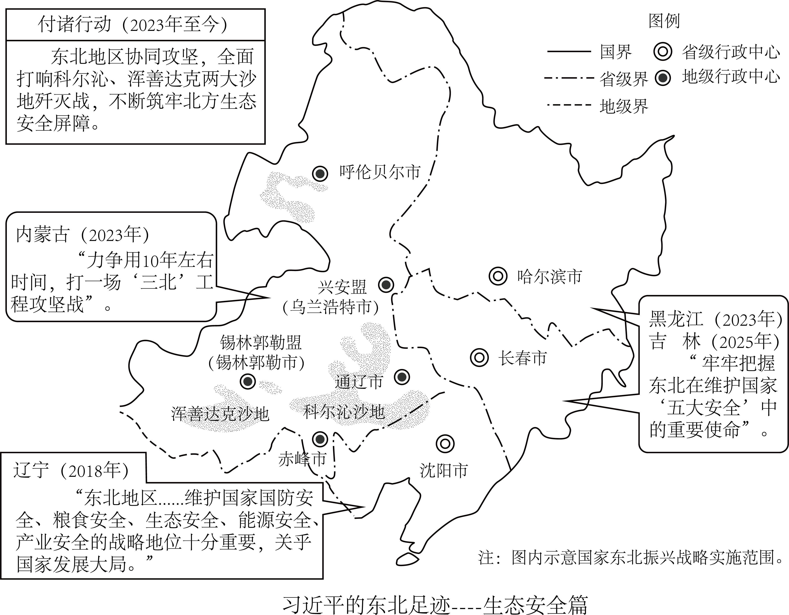
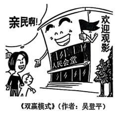

**机密★启用前**

**2025年黑龙江省普通高等学校招生选择性考试**

**思想政治**

**本试卷共19题，共100分，共8页。**

**注意事项：1．答题前，考生先将自己的姓名、准考证号码填写清楚，将条形码准确粘贴在条形码区域内。**

**2．选择题必须使用2B铅笔填涂：非选择题必须使用0.5毫米黑色字迹的签字笔书写，字体工整，笔记清楚。**

**3．请按照题号顺序在答题卡各题目的答题区域内作答，超出答题区域书写的答案无效；在草稿纸、试卷上答题无效。**

**4．作图可先使用铅笔画出，确定后必须用黑色字迹的签字笔描黑。**

**5．保持卡面清洁，不要折叠、不要弄破、弄皱，不准使用涂改液、修正带、刮纸刀。**

**一、选择题：本题共16小题，每小题3分，共48分。在每小题给出的四个选项中，只有一个是符合题目要求的。**

1\. 根据下图，习近平的重要论述（ ）

①成为建设北方生态安全屏障的行动指南 ②为东北生态文明建设高质量发展提供前提

③论证了东北全面振兴巨大生态环境优势 ④明确了东北在维护国家安全大局中的战略定位

A. ①③ B. ①④ C. ②③ D. ②④

2\. 任何政党，任何个人，错误总是难免的。列宁认为：“公开承认错误……仔细讨论改正错误的方法——这才是一个郑重的党的标志。”毛泽东认为：“因为我们是为人民服务的，所以，我们如果有缺点，就不怕别人批评指出。”材料告诉我们（ ）

①批评和自我批评以达到党内团结为目的

②批评和自我批评是无产阶级政党对待错误的方法

③批评和自我批评以“惩前毖后、治病救人”为原则

④不开展批评和自我批评就不是真正的马克思主义政党

A. ①② B. ①③ C. ②④ D. ③④

3\. 某市为盘活资源，在节假日期间利用人民会堂放映电影，弥补影院供给不足（如下图）。此举是对官方场所商业模式的新探索。由此可推断（ ）

①该市基本公共服务的供给得到加强和优化 ②该市政府可以作为经济主体参与市场竞争

③拓展公共设施的服务功能可提升其使用效率 ④政府可通过优化资源配置践行全民共享理念

A. ①② B. ①③ C. ②④ D. ③④

4\. 为解决用电企业因缺乏用电管理而增加额外成本的问题，某市供电公司首创一款数字化服务产品“电费管家”，为企业量身定制用电优化方案，引导企业错峰用电。目前，该产品进入全国推广阶段。该产品的推广（ ）

①能够实现经济效益和社会效益双赢 ②增强了国有经济的创新力和控制力

③助力供电公司增收扩容和用电企业降本增效 ④促进了数字技术与绿色发展理念的深度融合

A. ①③ B. ①④ C. ②③ D. ②④

5\. 根据下图反映的经济信息，以下推断合理的是（ ）

①农村居民收入比城镇居民收入更依赖于国民收入的再分配

②城镇居民的按劳分配收入在收入分配中占比高于农村居民

③城镇居民收入比农村居民收入更容易受到就业情况影响

④提高农村居民财产性收入占比可以缩小城乡居民收入差距

A. ①③ B. ①④ C. ②③ D. ②④

6\. 预付式消费是实现消费者和商家共赢的一种模式，但“卷款跑路”“霸王条款”等侵犯消费者合法权益的问题频发。对此，最高人民法院发布《关于审理预付式消费民事纠纷案件适用法律若干问题的解释》，给预付资金加一把“安全锁”。此举进一步（ ）

①规范消费市场秩序，引导商家诚信经营 ②保障预付资金存管，提升资金使用效能

③以法治红线织密消费者合法权益保护网 ④从立法层面化解预付式消费引发的纠纷

A. ①② B. ①③ C. ②④ D. ③④

7\. 某社区党组织接受常住本社区的各单位党员“报到”，以楼栋为单位成立功能性党支部，并建立楼栋居民微信群，吸纳医院、公安等单位的党员入群，开展问诊、反诈宣讲等活动，赢得了居民的认可。上述措施能够（ ）

①依托党员的专业优势，提高服务群众效能 ②完善基层治理体制机制，增强发展的动力

③打造党支部进小区模式，形成基层党建新格局 ④打破以往单一的治理主体结构，实现多元共治

A. ①③ B. ①④ C. ②③ D. ②④

8\. 某市政协开展职业教育专题调研和协商活动，将教育界委员等人的智慧汇聚到推动党委、政府的决策部署上来，形成建设实训基地等建议；与家长和学生面对面交流，对建议落实情况进行靶向监督，推动职业教育走深走实。可见，该市政协（ ）

①发挥专门协商机构和界别代表作用，积极建言献策

②聚焦教育领域中的重要问题，精准发力、精准施治

③通过广泛调研、真诚协商，充分履行参政议政职能

④接受群众监督，提升政协委员加强自身建设的动力

A. ①② B. ①③ C. ②④ D. ③④

9\. “山有多高，水有多高，田就有多高。”在多丘陵、少平原的湘中雪峰山脉腹地，当地居民经长期探索，依靠森林植被、土壤、田埂及特殊水源，构筑了独特的水田工程——全球重要农业文化遗产紫鹊界梯田。材料表明，该梯田（ ）

①反映了智慧的中国古人与严酷的自然环境的一种和解

②是当地居民在长期的生产活动中改造自然的物质条件

③体现出人民群众智慧是中华优秀传统农耕文化的源泉

④展示了人民群众作为社会生产力体现者的卓越创造力

A. ①③ B. ①④ C. ②③ D. ②④

10\. 蛋白质是人体必需的营养物质之一，它参与细胞更新，并可供给机体所需能量。但如果人在短时间内摄入蛋白质过量而糖类或脂肪不足，就可能引发蛋白质中毒现象，轻则头晕、呕吐等，重则昏迷甚至死亡。这说明（ ）

①蛋白质中毒是蛋白质与人体细胞间发生了性质的转化

②人在短时间摄入蛋白质过量是引发蛋白质中毒的节点

③短时间内大量摄入蛋白质与蛋白质中毒之间相互包含

④要保持人体的营养平衡需要具备超前思维和系统思维

A. ①② B. ①③ C. ②④ D. ③④

11\. 天青、月白、暮山紫……中国传统色的命名，体现了中国人看待世界的方式。古人在观察自然风物和时序变换时，将所见所感融入色彩，并赋予其审美和象征意义。作为东方韵味的生动体现，中国传统色在现代艺术及设计中焕发出新光彩。可见，中国传统色（ ）

①命名的方式体现了古人感性认识与理性认识的统一

②折射出了中国人世代所秉持的天人合一的民族精神

③是中华民族长期积淀的审美及精神追求的物化形式

④展示了中华传统文化所具有的巨大包容性和创新性

A. ①③ B. ①④ C. ②③ D. ②④

12\. 下图中，中国在国际上的实际行动与习近平的重要讲话精神相对应的是（ ）

（     ）

<table style="width:100%;">
<colgroup>
<col style="width: 99%" />
</colgroup>
<tbody>
<tr>
<td style="text-align: left;">
习近平重要讲话

<table style="width:97%;">
<colgroup>
<col style="width: 48%" />
<col style="width: 48%" />
</colgroup>
<tbody>
<tr>
<td style="text-align: left;">①“中国坚持以开放促改革，主动对接国际高标准经贸规则，积极扩大自主开放。”</td>
<td style="text-align: left;">②“中国不追求一枝独秀，更希望百花齐放，同广大发展中国家携手实现现代化。”</td>
</tr>
</tbody>
</table>

中国在国际上的实际行动

<table style="width:98%;">
<colgroup>
<col style="width: 32%" />
<col style="width: 22%" />
<col style="width: 20%" />
<col style="width: 21%" />
</colgroup>
<tbody>
<tr>
<td style="text-align: left;">
甲

中因积极推动加入《全面与进步跨太平洋伙伴关系协定》和《数字经济伙伴关系协定》进程
</td>
<td style="text-align: left;">
乙

中国同巴西、南非、非盟共同发起“开放科学国际合作倡议”
</td>
<td style="text-align: left;">
丙

中国坚持高质量实施《区域全面经济伙伴关系协定》。
</td>
<td style="text-align: left;">
丁

中国同非洲携手推进现代化的十大伙伴行动，并为此提供3600亿元人民币额度的资金支持
</td>
</tr>
</tbody>
</table></td>
</tr>
</tbody>
</table>

A. ①-甲 丙 ②-乙 丁 B. ①-丙 丁 ②-甲 乙

C. ①-甲 乙 ②-丙 丁 D. ①-乙 丁 ②-甲 丙

13\. 消除贫困是联合国2030年可持续发展议程的首要目标。近年来，中国通过搭建平台、组织培训、智库交流等形式，分享减贫经验，支持发展中国家探索符合本国国情的减贫和可持续发展道路。这表明，中国（ ）

①依托联合国多边平台开展国际减贫合作 ②为发展中国家减贫事业贡献了中国智慧

③致力于推动国际减贫合作机制创新发展 ④以推动共同发展助力全球贫困问题解决

A. ①② B. ①③ C. ②④ D. ③④

14\. 酷爱运动的小郑路过一家体育用品专卖店时，看到“同城最优，全场5~7折”的广告，遂进店询问。在店员的极力推荐下，小郑选中一款篮球。店员以最新款为由，以九折优惠与小郑达成交易。下列说法正确的是（ ）

①该专卖店的宣传广告属于要约

②该专卖店的行为构成不正当竞争

③该专卖店将篮球出售给小郑的行为不构成欺诈

④店员的极力推荐行为侵害了小郑的自主选择权

A. ①② B. ①④ C. ②③ D. ③④

15\. 某家政公司委派员工杜某照护岳某。杜某烧水时，因岳某购买的新电水壶存在缺陷遭电击受伤，送医后由家政公司支付医疗费。事后，家政公司以给公司造成损失为由解除了与杜某的劳动合同。下列说法正确的是（ ）

①该家政公司与岳某之间构成债权关系

②杜某有权向生产电水壶的厂家请求赔偿

③岳某无权要求出售电水壶的商家承担违约责任

④杜某可以就解除劳动合同一事直接向人民法院起诉

A. ①② B. ①④ C. ②③ D. ③④

16\. 我国科研团队在四川卧龙国家自然保护区发现一开黄色鸭嘴形小花的兰科植物新种。经过研究，科研人员确定这个兰科植物新种属于石豆兰属。若构建一正确三段论支持科研人员的结论，以下判断中可作为该三段论大、小前提的是（ ）

①石豆兰属植物是开黄色鸭嘴形小花的兰科植物

②开黄色鸭嘴形小花兰科植物都属于石豆兰属

③有些开黄色鸭嘴形小花的兰科植物是兰科植物新种

④这个兰科植物新种是开黄色鸭嘴形小花的兰科植物

A. ①③ B. ①④ C. ②③ D. ②④

**二、非选择题：本题共3小题，共52分。**

17\. 阅读材料，完成下列要求。

习近平指出：“民主不是装饰品，不是用来做摆设的，而是要用来解决人民要解决的问题的。”

针对街道没有本级人大代表、人大街道工委履职抓手不足的情况，某市人大推行街道议政会制度，组建由辖区各级人大代表、企事业单位及居民代表构成的街道议政会，构建街道人大监督履职体系。该制度是人民代表大会制度在街道的延伸。

街道议政会上接党委政府、下联人民群众。在工作过程中，某街道议政会广泛征集民意，由群众“点单”民生问题；组织集体会商，由代表“选单”，票选民生实事项目，转交相关部门处理；实施全程跟踪，由市人大邀请居民共同“验单”，对满意度低的项目“回头看”。仅半年时间，该街道议政会帮助群众解决实际问题30余件，推动民生工作从“答复满意”向“结果满意”转变，在实践中实现过程民主和成果民主的统一。

结合材料，运用政治与法治知识，总结该市人大推进“实现过程民主和成果民主统一”的经验并阐述其价值。

18\. 阅读材料，完成下列要求。

张某和李某是邻居，也是同事。张某上下班时经常免费搭乘李某的私家车。某日，李某边驾驶边接听手持电话，并超速50%行驶，导致车辆撞上路边护栏，同乘的张某受伤住院。经交警部门认定，李某应对此次事故负全部责任。

张某要求李某承担医疗费、误工费等。李某认为自己无偿搭载张某，应当减轻赔偿责任。因双方就赔偿数额协商未果，李某被诉至法院。在承办法官多次调解下，双方达成赔偿协议：李某同意适当承担上述费用，张某同意减少李某的赔偿数额。随后，李某如约履行了赔偿义务。

○○○相关链接………………………………………………………………………………………………

|                                                                                           |
|:----------------------------------------------------------------------------------------- |
| 【好意同乘规则】                                                                                  |
| 《中华人民共和国民法典》第一千二百一十七条：“非营运机动车发生交通事故造成无偿搭乘人损害，属于该机动车一方责任的，应当减轻其赔偿责任，但是机动车使用人有故意或者重大过失的除外。” |

结合材料，运用法律与生活知识，说明调解协议约定内容的依据以及此纠纷被成功化解的意义。

19\. 阅读材料，完成下列要求。

当今的中国，以发展增益世界繁荣，以文化感润世道人心。在伦敦发布的《2025年全球软实力指数》中显示，中国软实力升至世界第二位。

材料一  【多彩中华  美美与共】

中国软实力提升，本源在于中国式现代化具有显著优势。中国式现代化展现了现代化的另一幅图景，许多发展中国家表达了向中国学习的愿望。作为世界大国，中国以自身发展造福世界，用菌草技术让巴布亚新几内亚农民实现增收，用医疗援助帮助非洲提高公共卫生水平……中国的努力得到发展中国家高度赞扬。中华优秀传统文化也在国际上绽放异彩，太极拳、春节等先后被列入联合国教科文组织人类非物质文化遗产代表作名录：《哪吒之魔童闹海》登顶全球动画电影票房榜，《黑神话：悟空》获全球游戏大奖。中国不仅是传承数千年的文化大国，也是国际多边主义的坚定维护者。中国提出的一系列对外倡议和对国际、地区相关机制制定的积极参与取得丰硕成果，这些成果惠己达人，使越来越多国家感受到中国的大国担当。

（1）结合材料一，运用当代国际政治与经济知识，分析中国软实力获得世界认可的原因。

材料二【中医智慧  泽被天下】

中医针灸是中国文化软实力的一个重要载体。作为中国先民与疾病斗争中形成的一种医疗技艺，它由针法和灸法构成。针法是以针刺经络穴位的治疗方法。石器时代的人们发现，以尖锐石器按压身体疼痛部位能使症状缓解或消失，最早的针具——砭石应运而生。灸法则是以艾草等熏灼穴位施治。它是古人用火时，受某些病痛经火熏灼得以缓解的启示发明的。

在前人长期针灸实践中，针具和疗法得到改进，相关研究也逐步深入。《黄帝内经》是最早系统论述针灸疗法及适应症的经典；在唐代，针灸在中医体系中的地位正式确立；鉴于当时针灸古籍“错讹甚多”，北宋名医王惟一结合针灸实践编撰的《铜人腧穴针灸图经》对之加以修正和补充，推进了针灸的规范化和专业化；以明代《针灸大成》为代表的历代针灸典籍，为后世学习针灸提供了重要参考。

近几十年来，通过与免疫、神经生理等多学科融合，中医针灸理论研究范围逐步扩展。随着理论成果的应用和现代科技的影响，针灸针与手术刀融合而成的针刀等针具种类日益丰富，针灸智能机器人等新型设备也成功研发；受手法运针启发，人们发明了激光针法、微波针法等现代疗法，提升了治疗的精准度和效率。可见，针灸这一伟大的医学智慧还有更大潜力值得发掘。

目前，中医针灸作为“当今全球应用最广泛、接受程度最高的传统医学”，为保障全人类健康发挥着积极作用。

（2）中医针灸理论是在与实践的相互作用中不断发展的。结合材料二，运用事物发展的源泉和动力的知识对此加以阐释。

（3）结合材料二，分析人们在中医针灸诞生和发展过程中是如何运用联想思维实现创新的。

材料三中药瑰宝  强“参”济世】

“世界人参看中国”。作为传统名贵中药材，人参的独特功效为世界科学界公认。

人参的药用价值与其品质紧密相关。人参生长过程中，影响其品质的因素有气候、土壤、光照、田间管理等。科研人员研制了一种生物制剂，根据初步实验结果，认为用该制剂对特定生长期的人参进行叶面喷施，可以提升人参的品质。

（4）结合材料三，在探求因果联系的方法中选择一种适宜的方法，设计一个方案，验证科研人员的观点。

要求：方法适宜，方案合理且符合所选方法要求，逻辑严谨，表述清晰，字数100~150字。
