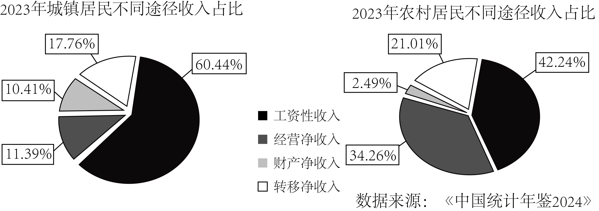

**机密★启用前**

**2025年黑龙江省普通高等学校招生选择性考试**

**思想政治**

**本试卷共19题，共100分，共8页。**

**注意事项：1．答题前，考生先将自己的姓名、准考证号码填写清楚，将条形码准确粘贴在条形码区域内。**

**2．选择题必须使用2B铅笔填涂：非选择题必须使用0.5毫米黑色字迹的签字笔书写，字体工整，笔记清楚。**

**3．请按照题号顺序在答题卡各题目的答题区域内作答，超出答题区域书写的答案无效；在草稿纸、试卷上答题无效。**

**4．作图可先使用铅笔画出，确定后必须用黑色字迹的签字笔描黑。**

**5．保持卡面清洁，不要折叠、不要弄破、弄皱，不准使用涂改液、修正带、刮纸刀。**

**一、选择题：本题共16小题，每小题3分，共48分。在每小题给出的四个选项中，只有一个是符合题目要求的。**

1\. 根据下图，习近平的重要论述（ ）

①成为建设北方生态安全屏障的行动指南 ②为东北生态文明建设高质量发展提供前提

③论证了东北全面振兴的巨大生态环境优势 ④明确了东北在维护国家安全大局中的战略定位

A. ①③ B. ①④ C. ②③ D. ②④

【答案】B

【解析】

【详解】①：习近平的重要论述为生态文明建设提供了重要的理论指导，是建设北方生态安全屏障的行动指南，①符合题意。

②：东北的社会经济发展为其生态文明建设高质量发展提供了前提，②排除。

③：习近平的重要论述是指出了当前东北全面振兴过程中存在的生态问题，而不是巨大生态环境优势，③排除。

④：习近平指出“东北地区……维护国家国防安全、粮食安全、生态安全、能源安全、产业安全的战略地位十分重要，关乎国家发展大局”，同时强调黑龙江和吉林要“牢牢把握东北在维护国家五大安全中的重要使命”，由此可见，习近平的重要论述明确了东北在维护国家安全大局中的战略定位。④符合题意。

故本题选B。

2\. 任何政党，任何个人，错误总是难免的。列宁认为：“公开承认错误……仔细讨论改正错误的方法——这才是一个郑重的党的标志。”毛泽东认为：“因为我们是为人民服务的，所以，我们如果有缺点，就不怕别人批评指出。”材料告诉我们（ ）

①批评和自我批评以达到党内团结为目的

②批评和自我批评是无产阶级政党对待错误的方法

③批评和自我批评以“惩前毖后、治病救人”为原则

④不开展批评和自我批评就不是真正的马克思主义政党

A. ①② B. ①③ C. ②④ D. ③④

【答案】C

【解析】

【详解】①：批评和自我批评是中国共产党人遵循实事求是的思想路线，以实现党的根本宗旨为目标，①错误。

②④：列宁认为“公开承认错误……仔细讨论改正错误的方法﹣﹣这才是一个郑重的党的标志”，这说明批评和自我批评是无产阶级政党对待错误的方法，不开展批评和自我批评就不是真正的马克思主义政党，②④符合题意。

③：“惩前毖后、治病救人”这是党内在对待犯过错误同志的时候坚持的基本方针，材料没有涉及，③排除。

故本题选C。

3\. 某市为盘活资源，在节假日期间利用人民会堂放映电影，弥补影院供给不足（如下图）。此举是对官方场所商业模式的新探索。由此可推断（ ）

①该市基本公共服务的供给得到加强和优化 ②该市政府可以作为经济主体参与市场竞争

③拓展公共设施的服务功能可提升其使用效率 ④政府可通过优化资源配置践行全民共享理念

A. ①② B. ①③ C. ②④ D. ③④

【答案】D

【解析】

【详解】①：基本公共服务是指由政府主导提供、旨在保障全体公民生存和发展基本需求的公共服务，主要包括：幼有所育、学有所教、劳有所得、病有所医、老有所养、住有所居、弱有所扶、优军服务保障和文体服务保障等9个方面，利用人民会堂放映电影以弥补影院供给不足不属于基本公共服务，①排除。

②：政府节假日期间利用人民会堂放映电影以弥补影院供给不足，主要是为了满足人们的观影需求，而不是为了参与市场竞争，②排除。

③④：政府节假日期间利用人民会堂放映电影以弥补影院供给不足，可以拓展公共设施的服务功能、提升其使用效率，并可通过优化资源配置践行全民共享理念，③④符合题意。

故本题选D。

4\. 为解决用电企业因缺乏用电管理而增加额外成本的问题，某市供电公司首创一款数字化服务产品“电费管家”，为企业量身定制用电优化方案，引导企业错峰用电。目前，该产品进入全国推广阶段。该产品的推广（ ）

①能够实现经济效益和社会效益双赢 ②增强了国有经济的创新力和控制力

③助力供电公司增收扩容和用电企业降本增效 ④促进了数字技术与绿色发展理念的深度融合

A. ①③ B. ①④ C. ②③ D. ②④

【答案】B

【解析】

【详解】①：市供电公司为企业量身定制用电优化方案，有利于解决用电企业因缺乏用电管理而增加额外成本的问题，因此对企业而言，能降本增效，实现经济效益；通过引导企业错峰用电，利于社会整体用电合理调配，实现社会效益，因此该产品的推广能够实现经济效益和社会效益双赢，①符合题意。

②：“电费管家”产品推广主要围绕用电企业的用电管理问题，与国有经济控制力关联不大，②不符合题意。

③：“电费管家”产品推广主要为用电企业降本增效，引导错峰用电，未涉及助力供电公司“增收扩容”，③不符合题意。

④：数字化服务产品“电费管家”，运用数字技术，解决用电企业因缺乏用电管理而增加额外成本的问题，引导错峰用电（符合绿色发展理念），因此该产品的推广促进了数字技术与绿色发展理念的深度融合，④符合题意。

故本题选B。

5\. 根据下图反映的经济信息，以下推断合理的是（ ）

①农村居民收入比城镇居民收入更依赖于国民收入的再分配

②城镇居民的按劳分配收入在收入分配中占比高于农村居民

③城镇居民收入比农村居民收入更容易受到就业情况的影响

④提高农村居民财产性收入占比可以缩小城乡居民收入差距

A. ①③ B. ①④ C. ②③ D. ②④

【答案】A

【解析】

【详解】①：转移净收入属于国民收入再分配。农村居民转移净收入占比21.01％，城镇居民转移净收入占比17.76％，所以农村居民收入比城镇居民收入更依赖国民收入再分配，①符合题意。

②：按劳分配是公有制经济范围内的工资、奖金和津贴。工资性收入不一定都来自按劳分配，因此仅从城镇居民和农村居民的工资性收入占比不能简单的得出城镇居民按劳分配收入占比高于农村居民，②不符合题意。

③：工资性收入受就业情况影响大。城镇居民工资性收入占比60.44％远高于农村居民的42.24％，所以城镇居民收入比农村居民收入更容易受到就业情况影响，③符合题意。

④：城乡居民收入差距是总体收入的差距。农村居民财产净收入占比2.49％，城镇居民财产净收入占比10.41％，提高农村居民财产性收入占比，会使农村居民收入结构中财产性收入增加，但不一定能缩小城乡居民收入差距，④不符合题意。

故本题选A。

6\. 预付式消费是实现消费者和商家共赢的一种模式，但“卷款跑路”“霸王条款”等侵犯消费者合法权益的问题频发。对此，最高人民法院发布《关于审理预付式消费民事纠纷案件适用法律若干问题的解释》，给预付资金加一把“安全锁”。此举进一步（ ）

①规范消费市场秩序，引导商家诚信经营 ②保障预付资金存管，提升资金使用效能

③以法治红线织密消费者合法权益保护网 ④从立法层面化解预付式消费引发的纠纷

A. ①② B. ①③ C. ②④ D. ③④

【答案】B

【解析】

【详解】①③：为解决“卷款跑路”“霸王条款”等侵犯消费者合法权益的问题，最高人民法院发布《关于审理预付式消费民事纠纷案件适用法律若干问题的解释》，给预付资金加一把“安全锁”。最高人民法院发布的解释，能规范消费市场秩序，引导商家诚信经营，从而保护消费者合法权益，①③符合题意。

②：最高人民法院发布的解释，主要是解决预付式消费中侵犯消费者权益的问题，未提及保障预付资金存管和提升资金使用效能，②不符合题意。

④：最高人民法院发布的解释，属于司法层面，不是立法层面，④不符合题意。

故本题选B。

7\. 某社区党组织接受常住本社区的各单位党员“报到”，以楼栋为单位成立功能性党支部，并建立楼栋居民微信群，吸纳医院、公安等单位的党员入群，开展问诊、反诈宣讲等活动，赢得了居民的认可。上述措施能够（ ）

①依托党员的专业优势，提高服务群众效能 ②完善基层治理体制机制，增强发展的动力

③打造党支部进小区模式，形成基层党建新格局 ④打破以往单一的治理主体结构，实现多元共治

A. ①③ B. ①④ C. ②③ D. ②④

【答案】A

【解析】

【详解】①：利用医院、公安等单位党员的专业技能，开展医疗咨询、反诈宣传等，功能性党支部提升了服务效率和满意度，①正确。 ‌

③：以楼栋为单位成立功能性党支部，将党组织延伸到小区最基层，强化了党在社区治理中的作用，形成基层党建新格局，③正确。

②：“完善基层治理体制机制”未直接体现，因措施侧重具体服务实践而非体制变革，②排除。

④：材料强调通过某社区党组织创新实践，更好推动基层社会治理共建共治共享，而不能说上述措施才打破以往单一的治理主体结构，④排除。

故本题选A。

8\. 某市政协开展职业教育专题调研和协商活动，将教育界委员等人的智慧汇聚到推动党委、政府的决策部署上来，形成建设实训基地等建议；与家长和学生面对面交流，对建议落实情况进行靶向监督，推动职业教育走深走实。可见，该市政协（ ）

①发挥专门协商机构和界别代表作用，积极建言献策

②聚焦教育领域中重要问题，精准发力、精准施治

③通过广泛调研、真诚协商，充分履行参政议政职能

④接受群众监督，提升政协委员加强自身建设的动力

A. ①② B. ①③ C. ②④ D. ③④

【答案】B

【解析】

【详解】①③：市政协调研并建言献策，发挥了协商机构和界别代表作用，体现其履行参政议政职能，①③入选。

②：政协并非国家机关，精准施治表述错误，②排除。

④：材料强调政协履行民主监督职能，而不是接受群众监督，④排除。

故本题选B。

9\. “山有多高，水有多高，田就有多高。”在多丘陵、少平原的湘中雪峰山脉腹地，当地居民经长期探索，依靠森林植被、土壤、田埂及特殊水源，构筑了独特的水田工程——全球重要农业文化遗产紫鹊界梯田。材料表明，该梯田（ ）

①反映了智慧的中国古人与严酷的自然环境的一种和解

②是当地居民在长期的生产活动中改造自然的物质条件

③体现出人民群众智慧是中华优秀传统农耕文化的源泉

④展示了人民群众作为社会生产力体现者的卓越创造力

A. ①③ B. ①④ C. ②③ D. ②④

【答案】B

【解析】

【详解】②：居民依据当地物质条件，发挥主观能动性，构筑了紫鹊界梯田，而不能说该梯田是其改造自然的物质条件，②排除。

③：文化是社会实践的产物。社会实践是文化的源泉，③排除。

①④：该梯田是当地居民智慧、卓越创造力的体现，表明其在利用自然、改造自然的实践中，推动了社会生产力发展，①④正确。

故本题选B。

10\. 蛋白质是人体必需的营养物质之一，它参与细胞更新，并可供给机体所需能量。但如果人在短时间内摄入蛋白质过量而糖类或脂肪不足，就可能引发蛋白质中毒现象，轻则头晕、呕吐等，重则昏迷甚至死亡。这说明（ ）

①蛋白质中毒是蛋白质与人体细胞间发生了性质的转化

②人在短时间摄入蛋白质过量是引发蛋白质中毒的节点

③短时间内大量摄入蛋白质与蛋白质中毒之间相互包含

④要保持人体营养平衡需要具备超前思维和系统思维

A. ①② B. ①③ C. ②④ D. ③④

【答案】D

【解析】

【详解】①：蛋白质中毒并非蛋白质本身性质发生转化，而是过量蛋白质在代谢过程中产生有毒物质（如氨、尿素），超过了肝肾处理能力，导致中毒反应，①排除。

‌②：根据材料“如果人在短时间内摄入蛋白质过量而糖类或脂肪不足，就可能引发蛋白质中毒现象”可知，即使在短时间内摄入蛋白质过量，但糖类或脂肪比较充足，也一定会引起蛋白质中毒现象，故②错误。 ‌

③：短时间内大量摄入蛋白质是引发蛋白质中毒的原因，原因和结果两者是相互包含关系，③正确。 ‌

④：超前思维体现为预防性（如避免过量摄入），系统思维强调营养均衡（如蛋白质、糖类、脂肪需协同摄入），故要保持人体的营养平衡需要具备超前思维和系统思维‌，④正确。

故本题选D。

11\. 天青、月白、暮山紫……中国传统色的命名，体现了中国人看待世界的方式。古人在观察自然风物和时序变换时，将所见所感融入色彩，并赋予其审美和象征意义。作为东方韵味的生动体现，中国传统色在现代艺术及设计中焕发出新光彩。可见，中国传统色（ ）

①命名的方式体现了古人感性认识与理性认识的统一

②折射出了中国人世代所秉持的天人合一的民族精神

③是中华民族长期积淀的审美及精神追求的物化形式

④展示了中华传统文化所具有的巨大包容性和创新性

A. ①③ B. ①④ C. ②③ D. ②④

【答案】A

【解析】

【详解】①：古人在观察自然风物和时序变换时，将所见所感融入色彩，并赋予其审美和象征意义。可见，中国传统色命名的方式体现了古人感性认识与理性认识的统一，①正确。

②：在五千多年的发展中，中华民族形成了以爱国主义为核心，团结统一、爱好和平、勤劳勇敢、自强不息的伟大民族精神。天人合一属于中华优秀传统文化所蕴含的思想，而不是民族精神，②错误。

③：中国传统色的命名体现了古人的审美和象征意义，是中华民族长期积淀的审美及精神追求通过色彩这种形式展现出来，是物化形式，③正确。

④：材料主要强调中国传统色体现了古人对世界的看法和精神追求，未涉及中华传统文化的包容性和创新性，④排除。

故本题选C。

12\. 下图中，中国在国际上的实际行动与习近平的重要讲话精神相对应的是（ ）

（     ）

<table style="width:100%;">
<colgroup>
<col style="width: 99%" />
</colgroup>
<tbody>
<tr>
<td style="text-align: left;">
习近平重要讲话

<table style="width:97%;">
<colgroup>
<col style="width: 48%" />
<col style="width: 48%" />
</colgroup>
<tbody>
<tr>
<td style="text-align: left;">①“中国坚持以开放促改革，主动对接国际高标准经贸规则，积极扩大自主开放。”</td>
<td style="text-align: left;">②“中国不追求一枝独秀，更希望百花齐放，同广大发展中国家携手实现现代化。”</td>
</tr>
</tbody>
</table>

中国在国际上的实际行动

<table style="width:98%;">
<colgroup>
<col style="width: 32%" />
<col style="width: 22%" />
<col style="width: 20%" />
<col style="width: 21%" />
</colgroup>
<tbody>
<tr>
<td style="text-align: left;">
甲

中因积极推动加入《全面与进步跨太平洋伙伴关系协定》和《数字经济伙伴关系协定》进程
</td>
<td style="text-align: left;">
乙

中国同巴西、南非、非盟共同发起“开放科学国际合作倡议”
</td>
<td style="text-align: left;">
丙

中国坚持高质量实施《区域全面经济伙伴关系协定》。
</td>
<td style="text-align: left;">
丁

中国同非洲携手推进现代化的十大伙伴行动，并为此提供3600亿元人民币额度的资金支持
</td>
</tr>
</tbody>
</table></td>
</tr>
</tbody>
</table>

A. ①-甲 丙 ②-乙 丁 B. ①-丙 丁 ②-甲 乙

C. ①-甲 乙 ②-丙 丁 D. ①-乙 丁 ②-甲 丙

【答案】A

【解析】

【详解】由题可知，习近平重要讲话①“中国坚持以开放促改革，主动对接国际高标准经贸规则，积极扩大自主开放。”，主要强调的内容是坚持开放发展，积极改革，顺应经济全球化发展趋势，提高对外开放水平。对应甲和丙的开放来适应经济全球化行动。

②“中国不追求一枝独秀，更希望百花齐放，同广大发展中国家携手实现现代化。”主要强调的内容是中国坚持独立自主的和平外交政策，同广大发展中国家的合作共赢，求同存异，尊重多样性，积极构建人类命运共同体。对应乙和丁的行动，因为乙和丁都涉及与发展中国家的合作共赢。

因此，正确答案是：①-甲 丙②-乙 丁

故本题选A。

13\. 消除贫困是联合国2030年可持续发展议程的首要目标。近年来，中国通过搭建平台、组织培训、智库交流等形式，分享减贫经验，支持发展中国家探索符合本国国情的减贫和可持续发展道路。这表明，中国（ ）

①依托联合国多边平台开展国际减贫合作 ②为发展中国家减贫事业贡献了中国智慧

③致力于推动国际减贫合作机制创新发展 ④以推动共同发展助力全球贫困问题解决

A. ①② B. ①③ C. ②④ D. ③④

【答案】C

【解析】

【详解】材料中提到中国通过搭建平台、组织培训、智库交流等形式分享减贫经验，支持发展中国家探索符合本国国情的减贫和可持续发展道路。

①：材料中未明确提及是依托联合国多边平台，只是说中国自身开展的一系列活动，①排除。

②：中国分享减贫经验，这是将自身的经验智慧分享给其他国家，为发展中国家减贫事业贡献了中国智慧，②正确。

③：材料只是说中国分享经验和提供支持，并没有体现出推动国际减贫合作机制的创新发展，③排除。

④：中国支持发展中国家探索减贫和可持续发展道路，这有助于推动共同发展，进而助力全球贫困问题的解决，④正确。

故本题选C。

14\. 酷爱运动的小郑路过一家体育用品专卖店时，看到“同城最优，全场5~7折”的广告，遂进店询问。在店员的极力推荐下，小郑选中一款篮球。店员以最新款为由，以九折优惠与小郑达成交易。下列说法正确的是（ ）

①该专卖店的宣传广告属于要约

②该专卖店的行为构成不正当竞争

③该专卖店将篮球出售给小郑的行为不构成欺诈

④店员的极力推荐行为侵害了小郑的自主选择权

A. ①② B. ①④ C. ②③ D. ③④

【答案】C

【解析】

【详解】①：宣传广告通常属于“要约邀请”（希望他人向自己发出要约的意思表示），而非要约（内容具体明确，表明经受要约人承诺即受约束）。题干中“全场5~7折”为概括性宣传，未明确特定商品的具体价格、数量等，不符合要约构成要件，①排除。

②：专卖店宣传“同城最优”属于虚假宣传（若实际并非“最优”），违反《反不正当竞争法》中“经营者不得对商品的质量、性能、用途等作虚假或引人误解的商业宣传”的规定，构成不正当竞争，②正确。

③：欺诈需满足“故意告知虚假情况或隐瞒重要事实，使对方误解并作出意思表示”。题干中店员以“最新款”为由给予九折，若“最新款”属实，交易基于双方合意，不存在欺诈；若“最新款”虚假，但题干未明确其为虚假信息，无法认定欺诈。因此，该行为不构成欺诈，③正确。

④：自主选择权是消费者有权自主选择商品，不受强迫。店员“极力推荐”属于正常营销行为，若未限制小郑的选择（如强买强卖），则未侵害其自主选择权，④排除。

故本题选C。

15\. 某家政公司委派员工杜某照护岳某。杜某烧水时，因岳某购买新电水壶存在缺陷遭电击受伤，送医后由家政公司支付医疗费。事后，家政公司以给公司造成损失为由解除了与杜某的劳动合同。下列说法正确的是（ ）

①该家政公司与岳某之间构成债权关系

②杜某有权向生产电水壶的厂家请求赔偿

③岳某无权要求出售电水壶的商家承担违约责任

④杜某可以就解除劳动合同一事直接向人民法院起诉

A. ①② B. ①④ C. ②③ D. ③④

【答案】A

【解析】

【详解】①：家政公司委派员工杜某为岳某提供照护服务，双方形成服务合同关系（债权债务关系），岳某是债权人，家政公司是债务人，①正确。

②：根据《民法典》，因产品缺陷造成他人损害的，被侵权人（杜某）可以向产品的生产者请求赔偿，也可以向销售者请求赔偿。杜某因电水壶缺陷受伤，有权向厂家索赔，②正确。

③：岳某是电水壶的购买者，与商家构成买卖合同关系。若电水壶存在质量缺陷，商家违反了合同约定的质量义务，岳某有权要求商家承担违约责任（如退货、赔偿等），③排除。

④：根据劳动法律、法规，除特定情形外，未经劳动仲裁程序，当事人不得直接向人民法院提起诉讼。本案家政公司解除与杜某的劳动合同属于劳动争议，须先经过劳动仲裁程序，对仲裁裁决不服的，方可向法院起诉，杜某不能直接起诉，④排除。

故本题选A。

16\. 我国科研团队在四川卧龙国家自然保护区发现一开黄色鸭嘴形小花的兰科植物新种。经过研究，科研人员确定这个兰科植物新种属于石豆兰属。若构建一正确三段论支持科研人员的结论，以下判断中可作为该三段论大、小前提的是（ ）

①石豆兰属植物是开黄色鸭嘴形小花的兰科植物

②开黄色鸭嘴形小花的兰科植物都属于石豆兰属

③有些开黄色鸭嘴形小花的兰科植物是兰科植物新种

④这个兰科植物新种是开黄色鸭嘴形小花的兰科植物

A. ①③ B. ①④ C. ②③ D. ②④

【答案】D

【解析】

【详解】①：结论“这个兰科植物新种属于石豆兰属”中，小项与大项之间是种属关系，“石豆兰属植物是开黄色鸭嘴形小花的兰科植物”颠倒了二者之间的关系，缩小了石豆兰属的外延范围，不适合作为大前提，①排除。

②：根据“这个兰科植物新种属于石豆兰属”这个结论，小项为“这个兰科植物新种”，大项为“石豆兰属”，“开黄色鸭嘴形小花的兰科植物都属于石豆兰属”为全称肯定命题，明确“所有开黄色鸭嘴形小花的兰科植物都属于石豆兰属”，可作为大前提，②正确。

③：“有些开黄色鸭嘴形小花的兰科植物是兰科植物新种”为特称命题，无法确保“新种”必然属于“开黄色花的兰科植物”，也就无法必然得出“这个兰科植物新种属于石豆兰属”的结论，③排除。

④：“这个兰科植物新种是开黄色鸭嘴形小花的兰科植物”，明确“这个兰科植物新种是开黄色鸭嘴形小花的兰科植物”，可作为小前提，且结合第二选项，大前提的中项“开黄色鸭嘴形小花的兰科植物”是全称主项，是周延的，小前提中的中项“开黄色鸭嘴形小花的兰科植物”是谓项，联项是肯定的，是不周延的，符合“前提中中项至少周延一次”的规则，④正确。

故本题选D。

**二、非选择题：本题共3小题，共52分。**

17\. 阅读材料，完成下列要求。

习近平指出：“民主不是装饰品，不是用来做摆设的，而是要用来解决人民要解决的问题的。”

针对街道没有本级人大代表、人大街道工委履职抓手不足的情况，某市人大推行街道议政会制度，组建由辖区各级人大代表、企事业单位及居民代表构成的街道议政会，构建街道人大监督履职体系。该制度是人民代表大会制度在街道的延伸。

街道议政会上接党委政府、下联人民群众。在工作过程中，某街道议政会广泛征集民意，由群众“点单”民生问题；组织集体会商，由代表“选单”，票选民生实事项目，转交相关部门处理；实施全程跟踪，由市人大邀请居民共同“验单”，对满意度低的项目“回头看”。仅半年时间，该街道议政会帮助群众解决实际问题30余件，推动民生工作从“答复满意”向“结果满意”转变，在实践中实现过程民主和成果民主的统一。

结合材料，运用政治与法治知识，总结该市人大推进“实现过程民主和成果民主统一”的经验并阐述其价值。

【答案】经验：

①创新制度载体，延伸民主链条。创设街道议政会制度，吸纳人大代表、居民及企事业单位代表多元主体参与，推动人民代表大会制度向基层延伸，夯实基层民主制度基础。

②全过程人民民主是全链条、全方位、全覆盖的民主，该市构建“点单— 选单— 验单”闭环流程，形成“征集 — 决策 — 执行 — 反馈”完整链条，实现过程民主与结果民主有机衔接 。

③聚焦民生痛点，落实实质民主，以解决实际民生问题为导向，确保民主成果惠及群众，践行以人民为中心的发展思想，体现民主的真实性与管用性 。

价值：

①丰富了全过程人民民主实践，街道议政会延伸人大制度，拓宽基层民主参与渠道，让人民在治理中“看得见、用得上”民主，彰显社会主义民主广泛性、真实性。

②群众监督+“回头看”机制，倒逼政府提升执行力，推动民生实事落地，增强政府公信力与群众获得感，有利于推进基层治理体系和治理能力现代化。

③ 保障民主全流程参与，实现过程与成果民主统一，体现全过程人民民主是最管用的民主。

④议政会“上接党委、下联群众”，对接党的政策与群众需求，凝聚共识，彰显民主实质，提升群众满意度，厚植执政为民基础。

【解析】

【分析】背景素材：某市人大推行的街道议政会制度

考点考查：党的领导、人民当家作主、依法治国等有关知识

能力考查：描述和阐述事物，论证和探究问题

核心素养：政治认同、科学精神

【详解】第一步：审设问，明确主体、作答范围、问题限定和作答角度。本题第一问为分析说明类，要求总结该市人大推进“实现过程民主和成果民主统一”的经验，需要调用人民当家作主的有关知识，结合材料中该市的做法，主要从措施角度进行分析；第二问要求阐述该市人大推进“实现过程民主和成果民主统一”的价值。需要调用党的领导、人民当家作主、依法治国等有关知识，从意义角度分析作答。

第二步：审材料，提取关键词，链接教材知识。

第一问：

关键词①：某市人大推行街道议政会制度，组建由辖区各级人大代表、企事业单位及居民代表构成的街道议政会，构建街道人大监督履职体系→可联系人民当家作主的知识，从创新制度载体角度分析，说明该市推动人民代表大会制度向基层延伸，夯实基层民主制度基础。

关键词②：在工作过程中，某街道议政会广泛征集民意，由群众“点单”民生问题；组织集体会商，由代表“选单”，票选民生实事项目，转交相关部门处理，由市人大邀请居民共同“验单”→可联系全过程人民民主的知识，从机制闭环角度分析，说明该市实现过程民主与结果民主有机衔接。

关键词③：该街道议政会帮助群众解决实际问题30余件，推动民生工作从“答复满意”向“结果满意”转变→可联系全过程人民民主的知识，从聚焦民生角度分析，说明该市践行以人民为中心的发展思想，落实实质民主，体现民主的真实性与管用性。

第二问：

关键词①：某市人大推行街道议政会制度，组建由辖区各级人大代表、企事业单位及居民代表构成的街道议政会，构建街道人大监督履职体系→可联系人民当家作主的知识，说明此举丰富了全过程人民民主实践，彰显社会主义民主广泛性、真实性。

关键词②：实施全程跟踪，由市人大邀请居民共同“验单”，对满意度低的项目“回头看”→可联系法治政府、基层群众自治的知识，说明此举有利于增强政府公信力与群众获得感，推进基层治理体系和治理能力现代化。

关键词③：由群众“点单”民生问题、由代表“选单”、由市人大邀请居民共同“验单”→可联系全过程人民民主的知识，说明此举有利于实现过程与成果民主统一，体现全过程人民民主是最管用的民主。

关键词④：街道议政会上接党委政府、下联人民群众→可联系党的宗旨、执政理念、群众路线等知识，说明此举有利于提升群众满意度，厚植执政为民基础。

第三步：整合信息，组织答案。注意设问限定以及教材知识与材料、时政信息等相结合。

18\. 阅读材料，完成下列要求。

张某和李某是邻居，也是同事。张某上下班时经常免费搭乘李某的私家车。某日，李某边驾驶边接听手持电话，并超速50%行驶，导致车辆撞上路边护栏，同乘的张某受伤住院。经交警部门认定，李某应对此次事故负全部责任。

张某要求李某承担医疗费、误工费等。李某认为自己无偿搭载张某，应当减轻赔偿责任。因双方就赔偿数额协商未果，李某被诉至法院。在承办法官多次调解下，双方达成赔偿协议：李某同意适当承担上述费用，张某同意减少李某的赔偿数额。随后，李某如约履行了赔偿义务。

○○○相关链接………………………………………………………………………………………………

|                                                                                           |
|:----------------------------------------------------------------------------------------- |
| 【好意同乘规则】                                                                                  |
| 《中华人民共和国民法典》第一千二百一十七条：“非营运机动车发生交通事故造成无偿搭乘人损害，属于该机动车一方责任的，应当减轻其赔偿责任，但是机动车使用人有故意或者重大过失的除外。” |

结合材料，运用法律与生活知识，说明调解协议约定内容的依据以及此纠纷被成功化解的意义。

【答案】依据：

① 李某免费搭载张某，属《民法典》第一千二百一十七条“好意同乘”情形 ，本可依规则减轻赔偿责任，但李某边驾驶边接听手持电话+超速50% ，存在重大过失，触发“好意同乘”例外条款（故意或重大过失不减轻责任 ），依法需承担侵权责任，不能因“好意同乘”减轻责任。

②双方经法院调解自愿达成协议，张某自愿“减少李某赔偿数额”，是其意思自治，符合民法典“自愿”原则 。

③协议在法定责任框架内灵活调整，既尊重“好意同乘”的善意（鼓励互助 ），又落实过错责任（保障权益 ），彰显公平原则。

意义：

①落实《民法典》“好意同乘”规则，明确 “重大过失不减轻责任”边界，维护法律确定性；同时尊重当事人意思自治，体现法律灵活性 。 清晰阐释“侵权责任”构成与承担，引导公众理解法律规则，增强法治意识 。

②法院调解促成和解，避免“好意同乘”纠纷激化邻里、同事矛盾，维护社会和谐；节约司法资源，践行多元纠纷解决机制，弘扬“和为贵”传统，传递公序良俗 。

③为类似“好意同乘”侵权纠纷提供示范：既坚守法律底线，又鼓励善意，平衡“权益保护”与 “善意鼓励” ，促进社会良性互动 。

【解析】

【分析】背景素材：因“好意同乘”发生事故而引发的纠纷

考点考查：民事权利与义务、侵权责任与权利界限、纠纷的多元解决方式等

能力考查：描述和阐释事物、论证和探究问题  

核心素养：政治认同、法治意识

【详解】第一步：审设问。明确题型、作答范围、问题限定和作答角度。本题第一问为依据类命题，要求说明调解协议约定内容的依据。需要运用民法的基本原则、侵权责任与权利界限的知识，结合调解协议约定内容进行分析；第二问为意义类命题，要求说明此纠纷被成功化解的意义。需要调用运用依法治国与依德治国相结合、纠纷的多元解决方式等知识，结合材料，从意义角度进行分析说明。

第二步， 审材料，提取关键词，链接教材知识。

关键词①：双方达成赔偿协议：李某同意适当承担上述费用，张某同意减少李某的赔偿数额→可调用《中华人民共和国民法典》第一千二百一十七条规定以及民法基本原则等法理依据：说明李某免费搭载张某，属“好意同乘”情形，本可依规则减轻赔偿责任，但由于过程中存在重大过失，故不能因“好意同乘”减轻责任；但是张某自愿“减少李某赔偿数额”是其意思自治，符合民法典自愿、公平的原则。

关键词②：双方达成赔偿协议，李某如约履行了赔偿义务，此纠纷被成功化解→可调用治国与依德治国相结合、纠纷的多元解决方式等知识，从维护法律确定性与体现法律灵活性、节约司法资源、维护社会和谐、提供示范案例等角度说明该纠纷被成功化解的意义。

第三步，整合信息、组织答案。

19\. 阅读材料，完成下列要求。

当今的中国，以发展增益世界繁荣，以文化感润世道人心。在伦敦发布的《2025年全球软实力指数》中显示，中国软实力升至世界第二位。

材料一  【多彩中华  美美与共】

中国软实力提升，本源在于中国式现代化具有显著优势。中国式现代化展现了现代化的另一幅图景，许多发展中国家表达了向中国学习的愿望。作为世界大国，中国以自身发展造福世界，用菌草技术让巴布亚新几内亚农民实现增收，用医疗援助帮助非洲提高公共卫生水平……中国的努力得到发展中国家高度赞扬。中华优秀传统文化也在国际上绽放异彩，太极拳、春节等先后被列入联合国教科文组织人类非物质文化遗产代表作名录：《哪吒之魔童闹海》登顶全球动画电影票房榜，《黑神话：悟空》获全球游戏大奖。中国不仅是传承数千年的文化大国，也是国际多边主义的坚定维护者。中国提出的一系列对外倡议和对国际、地区相关机制制定的积极参与取得丰硕成果，这些成果惠己达人，使越来越多国家感受到中国的大国担当。

（1）结合材料一，运用当代国际政治与经济知识，分析中国软实力获得世界认可的原因。

材料二【中医智慧  泽被天下】

中医针灸是中国文化软实力的一个重要载体。作为中国先民与疾病斗争中形成的一种医疗技艺，它由针法和灸法构成。针法是以针刺经络穴位的治疗方法。石器时代的人们发现，以尖锐石器按压身体疼痛部位能使症状缓解或消失，最早的针具——砭石应运而生。灸法则是以艾草等熏灼穴位施治。它是古人用火时，受某些病痛经火熏灼得以缓解的启示发明的。

在前人长期针灸实践中，针具和疗法得到改进，相关研究也逐步深入。《黄帝内经》是最早系统论述针灸疗法及适应症的经典；在唐代，针灸在中医体系中的地位正式确立；鉴于当时针灸古籍“错讹甚多”，北宋名医王惟一结合针灸实践编撰的《铜人腧穴针灸图经》对之加以修正和补充，推进了针灸的规范化和专业化；以明代《针灸大成》为代表的历代针灸典籍，为后世学习针灸提供了重要参考。

近几十年来，通过与免疫、神经生理等多学科融合，中医针灸理论研究范围逐步扩展。随着理论成果的应用和现代科技的影响，针灸针与手术刀融合而成的针刀等针具种类日益丰富，针灸智能机器人等新型设备也成功研发；受手法运针启发，人们发明了激光针法、微波针法等现代疗法，提升了治疗的精准度和效率。可见，针灸这一伟大的医学智慧还有更大潜力值得发掘。

目前，中医针灸作为“当今全球应用最广泛、接受程度最高的传统医学”，为保障全人类健康发挥着积极作用。

（2）中医针灸理论是在与实践的相互作用中不断发展的。结合材料二，运用事物发展的源泉和动力的知识对此加以阐释。

（3）结合材料二，分析人们在中医针灸诞生和发展过程中是如何运用联想思维实现创新的。

材料三【中药瑰宝  强“参”济世】

“世界人参看中国”。作为传统名贵中药材，人参的独特功效为世界科学界公认。

人参的药用价值与其品质紧密相关。人参生长过程中，影响其品质的因素有气候、土壤、光照、田间管理等。科研人员研制了一种生物制剂，根据初步实验结果，认为用该制剂对特定生长期的人参进行叶面喷施，可以提升人参的品质。

（4）结合材料三，在探求因果联系的方法中选择一种适宜的方法，设计一个方案，验证科研人员的观点。

要求：方法适宜，方案合理且符合所选方法的要求，逻辑严谨，表述清晰，字数100~150字。

【答案】（1）①中国式现代化道路的独特优势提供了发展中国家可借鉴的范式。中国式现代化打破“现代化=西方化”的迷思，通过和平发展、独立自主的路径实现经济增长和社会稳定，为发展中国家提供了一条避免依附性发展的替代方案。 ②顺应和平发展潮流，中国倡导并推动构建人类命运共同体，通过发展援助和技术转移，帮助发展中国家提升经济自主性和民生福祉，体现了“惠己达人”的共赢理念，展示了中国作为负责任大国的形象。 ③中国一直致力于做全球发展的贡献者。中国是世界经济发展的重要推动者，中国经济的回稳发展为世界各国的发展提供了机遇。随着中国文化产业的崛起，全球目光再次聚焦中国文化市场，为世界各国投资发展提供了更广阔的市场、更丰富的产品、更宝贵的合作机会，推动全球经济发展。④多边外交和全球治理贡献彰显大国担当。中国坚定维护国际多边主义，积极参与国际规则制定，提出“一带一路”倡议等对外合作框架。这些行动不仅推动了全球公共产品供给，还增强了中国在解决全球性问题中的话语权，体现了国际政治经济中“制度软实力”的重要性。

（2）①一切事物都包含着既相互对立又相互统一的两个方面，矛盾就是对立统一。中医针灸理论是与实践是对立统一的关系。中医针灸理论为针灸实践提供理论指导，针灸实践发展又不断矫正、检验中医针灸理论。矛盾双方相互排斥、相互对立，但又相互依赖、相互贯通，在一定条件下相互转化，中医针灸技术的传承和针灸理论的不断完善相辅相成，针灸特别是现代针灸在实践中的不断改进，推动针灸相关理论研究逐步深入；随着理论成果的应用和现代科技的影响，针灸现代疗法进一步提升了治疗的精准度和效率，实现对中医针灸智慧最大程度的保护和传承。 ②矛盾双方的对立统一推动事物的运动、变化和发展，由此构成事物发展的源泉和动力，坚持对立统一的观点看问题。要不断探索中医针灸实践和理论有机结合的途径和方法，在科学针灸理论指导下发展针灸技术，在针灸技术实践发展中丰富针灸理论，推动我国中医药发展。

（3）①联想思维是对事物之间普遍联系的反映，就是将记忆中对不同事物的认识进行联结与思考的思维活动。古人由身体疼痛用尖锐石器按压缓解，联想到制作砭石针具；由病痛经火熏烤缓解，联想到以艾草等熏灼穴位的灸法，实现针灸方法创新。②联想思维要以实践为基础，离不开对前人和他人已有成果的继承。在继承的基础上破旧立新，推动事物发展。在前人长期针灸实践中，针具和疗法得到改进,相关研究也逐步深入，经典为后世学习针灸提供了重要参考。③联想是创新思维的基础，迁移和想象是思维展开联想的重要方式。迁移是将不同认识对象的性质、作用等进行位置变迁与功能移植，以寻求解决问题的新思路。结合现代科技，迁移到研发针刀等针具、针灸智能机器人等设备，推动针灸在理论、工具、疗法等方面创新。

（4）求异法。选取两块条件（气候、土壤、光照、田间管理等）基本相同的人参种植地，标记为A地和B地。在人参特定生长期，对A地人参喷施该生物制剂，B地不喷施该生物制剂。待生长期结束，检测并对比两地人参品质，若A地品质优于B地，由此得出结论：该生物制剂对特定生长期的人参进行叶面喷施，可以提升人参的品质。

【解析】

【分析】背景素材：中医针灸诞生和发展过程、中药瑰宝强“参”济世

考点考查：世界多极化、经济全球化、事物发展的源泉和动力、联想思维、探求因果联系的方法

能力考查：调动和运用知识、描述和阐释事物、论证和探究问题

核心素养：政治认同、科学精神

【小问1详解】

第一步：审设问。明确主体、知识范围、问题限定和作答角度。本题需要运用当代国际政治与经济知识。考查主体为中国，属于原因类试题，解答时把握材料关键信息，调动运用教材知识分析回答。

第二步：审材料。提取关键词，链接教材知识。

关键词①：中国软实力提升，本源在于中国式现代化具有显著优势→可联系我国外交政策，说明通过和平发展、独立自主的路径实现经济增长和社会稳定，为发展中国家提供了一条避免依附性发展的替代方案。

关键词②：作为世界大国，中国以自身发展造福世界，中国努力得到发展中国家高度赞扬→可联系和平发展潮流，中国倡导并推动构建人类命运共同体，分析“惠己达人”的共赢理念，展示了中国作为负责任大国的形象。

关键词③：中华优秀传统文化也在国际上绽放异彩，《哪吒之魔童闹海》登顶全球动画电影票房榜，《黑神话：悟空》获全球游戏大奖→可联系中国一直致力于做全球发展的贡献者，分析随着中国文化产业的崛起，全球目光再次聚焦中国文化市场。

关键词④：中国提出的一系列对外倡议和对国际、地区相关机制制定的积极参与取得丰硕成果，使越来越多国家感受到中国的大国担当→可联系多边外交和全球治理贡献彰显大国担当，分析不仅推动了全球公共产品供给，还增强了中国在解决全球性问题中的话语权。

第三步：整合信息，组织答案。注意设问限定以及教材知识与材料等相结合。

【小问2详解】

第一步：审设问。明确主体、知识范围、问题限定和作答角度。本题的设问要求运用事物发展的源泉和动力知识，分析说明中医针灸理论是在与实践的相互作用中不断发展的。本题考查知识明确具体，解答时把握材料关键信息，调动运用教材知识分析回答。

第二步：审材料。提取关键词，链接教材知识。

关键词①：中医针灸由针法和灸法构成。在前人长期针灸实践中，针具和疗法得到改进,相关研究也逐步深入→可联系矛盾含义及其基本属性，分析中医针灸理论是与实践是对立统一的关系。

关键词②：近几十年来，通过与免疫、神经生理等多学科融合，中医针灸理论研究范围逐步扩展。随着理论成果的应用和现代科技的影响，针灸针与手术刀融合而成的针刀等针具种类日益丰富→可联系矛盾双方的对立统一推动事物的运动、变化和发展，分析在科学针灸理论指导下发展针灸技术，在针灸技术实践发展中丰富针灸理论，推动我国中医药发展。

第三步：整合信息，组织答案。注意设问限定以及教材知识与材料等相结合。

【小问3详解】

第一步：审设问。明确主体、知识范围、问题限定和作答角度。本题的设问要求分析人们在中医针灸诞生和发展过程中是如何运用联想思维实现创新的。本题考查知识明确具体，属于措施类试题，解答时把握材料关键信息，调动运用教材知识分析回答。

第二步：审材料。提取关键词，链接教材知识。 关键词①：中医针灸由针法和灸法构成。针法是以针刺经络穴位的治疗方法源于以尖锐石器按压身休疼痛部位能使症状缓解或消失；灸法是古人用火时，受某些病痛经火熏烤得以缓解的启示发明的→可联系联想思维的含义，分析针灸的来源。 关键词②：在前人长期针灸实践中，针具和疗法得到改进,相关研究也逐步深入……→可联系联想思维是创新思维的基础，创新思维的形成，分析针灸源于实践，离不开对前人和他人已有成果的继承。

关键词③：通过与免疫、神经生理等多学科融合，中医针灸理论研究范围逐步扩展→可联系联想思维的方式迁移和想象，分析功能移植，以寻求解决问题的新思路。 第三步：整合信息，组织答案。注意设问限定以及教材知识与材料等相结合。

【小问4详解】

第一步：审设问。明确主体、知识范围、问题限定和作答角度。本题的设问要求在探求因果联系的方法中选择一种适宜的方法，设计一个方案，验证科研人员的观点。本题考查知识明确具体，属于分析说明类试题，解答时把握材料关键信息，调动运用求异法的知识分析回答。

第二步：审材料。提取关键词，链接教材知识。

关键词①：探求因果联系的方法中选择一种适宜的方法→可联系探求因果联系的方法，主要有求同法、求异法、求同求异并用法、共变法、剩余法。

关键词②：人参生长过程中，影响其品质的因素有气候、土壤、光照、田间管理等。科研人员研制了一种生物制剂，根据初步实验结果，认为用该制剂对特定生长期的人参进行叶面喷施，可以提升人参的品质→可联系求异法，分析求异法的含义及其具体运用，把一定数量的人参分为两部分，一部分喷洒生物制剂，另一部分则不经过这道程序，在其他条件（气候、土壤、光照、田间管理等）相同的情况下，结果用该制剂进行叶面喷施的人参品质要高。

第三步：整合信息，组织答案。注意设问限定以及教材知识与材料等相结合。
