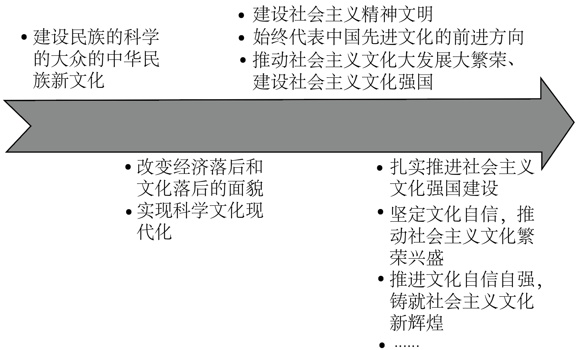

**2025年普通高中学业水平选择性考试（江苏卷）**

**思想政治**

**本试卷满分100分 考试时间75分钟**

**一、单项选择题：共15题，每题3分，共45分。每题只有一个选项最符合题意。**

1\. 如下图所示，中国共产党在不同的历史时期，提出了自己的文化纲领、目标和政策，引领文化建设不断取得新成就。材料表明，中国共产党（ ）

A. 以文化建设不断筑牢自身的执政基础

B. 具有高度文化自觉、勇于担当文化使命

C. 不断推动物质文明和精神文明协调发展

D. 始终坚持中国特色社会主义文化发展道路

【答案】B

【解析】

【详解】A：材料强调党在新民主主义革命时期、社会主义革命和建设时期、改革开放和社会主义现代化建设新时期的文化建设，新民主主义革命时期中国共产党还不是执政党，A错误。

B：从材料中可以看出，中国共产党在不同历史时期提出不同的文化纲领、目标和政策，引领文化建设不断取得新成就，体现了党对文化建设的深刻认识，主动担当起推动文化发展的历史责任，具有高度的文化自觉、勇于担当文化使命，B符合题意。

C：材料围绕中国共产党在文化建设方面展开，未提及物质文明相关的内容，C不符合题意。

D：中国特色社会主义文化发展道路是在特定历史阶段形成的，材料中展示了党在不同的历史时期的文化举措，不能说始终坚持中国特色社会主义文化发展道路，D不符合题意。

故本题选B。

2\. 党的十八大以来，以习近平同志为核心的党中央在全面深化改革中不断推进理论创新，及时总结新鲜经验，形成了习近平总书记关于全面深化改革的一系列新思想、新观点、新论断：强调改革必须坚持党的领导、必须坚持以人民为中心、必须坚持守正创新、必须坚持问题导向、必须坚持以经济体制改革为牵引……党的二十届三中全会在此基础上凝练出进一步全面深化改革的重大原则。这些理论成果（ ）

①进一步明晰了中国式现代化的本质特征

②为进一步全面深化改革提供了根本遵循

③进一步深化了对社会主义改革规律的认识

④实现了马克思主义中国化时代化新的飞跃

A. ①③ B. ①④ C. ②③ D. ②④

【答案】C

【解析】

【详解】①：全体人民共同富裕的现代化，是中国式现代化的本质特征，与材料的主旨全面深化改革无关，①排除。

②③：以习近平同志为核心的党中央在全面深化改革中不断推进理论创新，这些新思想、新观点、新论断是对习近平新时代中国特色社会主义思想的完善与发展，进一步深化了对社会主义改革规律的认识，为进一步全面深化改革提供了根本遵循，②③入选。

④：习近平新时代中国特色社会主义思想实现了马克思主义中国化时代化新的飞跃，这些新的论断是对其进行的完善与发展，④不选。

故本题选C。

3\. 面对外部冲击引发的金融市场动荡，全国社会保障基金等国有资本坚持长期投资、价值投资理念，积极融入国家发展战略，主动增持国内市场股票，引导其他参与者的预期，平抑资本市场的风险，更好地发挥了全国社会保障基金等长期资金、耐心资本的稳定器作用，给市场注入实实在在的信心和力量。材料说明（ ）

①国有资本在关键领域发挥了重要影响力

②国有资本是实现我国国家战略的重要支柱

③国有资本的发展壮大增强了其抗风险能力

④国有资本进一步拓宽了我国社会保障的范围

A. ①② B. ①④ C. ②③ D. ③④

【答案】A

【解析】

【详解】①②：全国社会保障基金等国有资本坚持长期投资、价值投资理念，积极融入国家发展战略，更好地发挥了全国社会保障基金等长期资金、耐心资本的稳定器作用，这表明国有资本在国民经济发展中起到了重要的作用，充分证明了国有资本在关键领域发挥了重要影响力，是实现我国国家战略的重要支柱，①②入选。

③：材料强调国有资本自身作用的发挥(助力平抑资本市场风险等)，而不是其发展壮大(数量占比等的提升)增强自身抗风险能力，③不选。

④我国的社会保障体系包括社会保险、社会救助、社会福利、社会优抚等，材料中并未体现国有资本拓宽了我国社会保障的范围，④排除。

故本题选A。

4\. 2025年3月《政府工作报告》提出，创新和丰富消费场景，加快数字、绿色、智能等新型消费发展。随着数字经济不断渗透，数字消费呈现快速发展态势。下列关于发展数字消费的传导路径正确的是（ ）

①完善市场规则→发展数字消费→提高政府宏观调控水平→促进社会公平

②发展数字消费→创造消费新需求→推动产业结构升级→畅通国内大循环

③扩大数字基础设施投资→发展数字消费→促进经济增长→增加居民收入

④发展数字消费→打破区城市场垄断→缩小区域消费差距→实现区域协调发展

A. ①③ B. ①④ C. ②③ D. ②④

【答案】C

【解析】

【详解】①：完善市场规则主要是为了规范市场秩序，与发展数字消费之间没有直接因果关系，且发展数字消费也不能直接提高政府宏观调控水平，①排除。

②：数字消费作为新型消费方式，会带来新的消费热点和需求，因此发展数字消费能创造新需求，新的需求会引导企业调整生产，从而推动产业结构优化升级，产业升级进一步优化供给结构，促进内需扩大，从而畅通国内大循环，②传导正确。

③：扩大数字基础设施投资，能够为数字消费提供基础支撑，促进数字消费的发展，数字消费的发展会带动相关产业发展，进而促进经济增长，经济增长往往伴随着企业效益的提升和就业机会的增加，从而使得居民收入增加，③传导正确。

④：发展数字经济有利于打破区域市场垄断，有利于缩小区域消费差距但是不一定实现区域协调发展，④排除。

故本题选C。

5\. 某地在实施乡村振兴战略中，积极引导年轻人回乡就业创业。一方面，乡村利用土地、房屋等资源为年轻人就业创业提供便利条件，并打造回乡青年、当地村民、社会团体等共同参与的“创业公社”，另一方面，回乡青年运用自己的技能激活乡村的经济、社会和文化发展，成为推动乡村全面振兴的新力量。材料表明，这种“乡村赋能青年，青年带动乡村”新格局形成的原因是（ ）

①劳动、技术、财产等参与分配，激发生产要素活力

②健全农业社会化服务体系，发展壮大农村集体经济

③增强政府公信力，在政府和村民间形成互信互利关系

④民主管理“公社”日常事务，凝聚各方共建共享力量

A. ①③ B. ①④ C. ②③ D. ②④

【答案】B

【解析】

【详解】①：乡村提供土地、房屋（财产要素），回乡青年运用技能（劳动和技术要素）参与创业，并通过“创业公社”平台实现要素参与分配。这激发了生产要素活力，推动乡村经济、社会和文化发展，是新格局形成的重要驱动力，①正确。

④：材料强调“创业公社”由回乡青年、当地村民、社会团体等共同参与，体现了民主管理方式，凝聚了各方力量实现共建共享，促进了乡村赋能青年和青年带动乡村的良性循环，④正确。

②：材料未提及“农业社会化服务体系”或“发展壮大农村集体经济”的内容。焦点是“创业公社”作为创业平台，而非农业服务或集体经济，②排除。

③：材料中政府仅“积极引导”年轻人回乡，但未涉及政府公信力、政府与村民互信互利等内容，焦点在乡村与青年的互动，而非政府角色，因此不直接相关，③排除。

故本题选B。

6\. 非遗是中华文明绵延传承的生动见证，是中华民族生生不息、发展壮大的丰厚滋养。某自治州以“非遗+”模式为切口，深挖中华优秀传统文化与中华民族发展的内在关系，推进非遗相关制度建设，探索激发非遗保护的内生动力，让非遗深嵌于当地各族人民现代生活，营造出传承中华文明的浓厚社会氛围。该地的做法（ ）

①增强了当地各族群众对中华文化的认同

②保障了当地少数民族的合法权利和利益

③在非遗保护中铸牢了中华民族共同体意识

④展现了我国民族区域自治制度的独特优势

A. ①③ B. ①④ C. ②③ D. ②④

【答案】A

【解析】

【详解】①：题干强调“让非遗深嵌于当地各族人民现代生活，营造出传承中华文明的浓厚社会氛围”。非遗作为中华优秀传统文化的一部分，其保护与传承有助于各族群众在共同文化体验中增进对中华文化的认同感，①符合题意。

②：材料中主要强调非遗保护，通过“非遗+”模式传承中华文化、营造传承中华文明的氛围，并未直接涉及保障当地少数民族的合法权利和利益，②不符合题意。

③：非遗是中华民族生生不息、发展壮大的丰厚滋养，该地深挖中华优秀传统文化与中华民族发展的内在关系，推进非遗相关制度建设等一系列做法，使得各族人民在非遗保护中，强化中华民族共同的历史记忆，进而铸牢中华民族共同体意识，③符合题意。

④：材料重点在于非遗保护与文化传承，没有涉及民族区域自治制度的独特优势，④不符合题意。

故本题选A。

7\. 下列选项中，与下图漫画所蕴含的哲学道理最接近的是（ ）

A 只要功夫深，铁杵磨成针 B. 见微以知萌，见端以知末

C. 善弈者谋势，不善者谋子 D. 不违农时，谷不可胜食也

【答案】D

【解析】

【详解】漫画中文字“花怕啥？怕懒人，更怕勤快人”，意思是过度勤快对花的生长也不利，这体现了做事情要把握好“度”，遵循客观规律，若违背规律，即使出于好意（如过于勤快地照顾花 ）也可能适得其反。

A：“只要功夫深，铁杵磨成针”强调的是量变达到一定程度会引起质变，突出的是量的积累的重要性，与漫画中把握“度”、遵循客观规律的哲理不符，A错误。

B：“见微以知萌，见端以知末”意思是看到事物微小的迹象，就能知道其发展的趋向和结果，体现的是透过现象看本质以及联系的观点，B错误。

C：“善弈者谋势，不善者谋子”说的是善于下棋的人注重整个局势，不善于下棋的人只看到单个棋子的得失，强调的是要树立全局观念，立足整体，统筹全局，C错误。

D：“不违农时，谷不可胜食也”意思是不违背农时进行耕种，粮食就会多得吃不完，强调了要按照自然规律办事，与漫画中做事情要遵循客观规律（过度勤快违背花生长规律 ）的哲理相同，D正确。

故本题选D。

8\. 某民警多次人户走访，发现村里有些老人用不好纸质警民联系卡。该民警反复琢磨怎样才能让村民联系民警更方便，经多次尝试最终制成可绑定民警电话号码的智能贴片。村民只需拿出贴片，靠近手机，便可一键拨通民警电话。材料说明（ ）

A. 分析问题时要善于抓住主流 B. 追求真理是一个反复的过程

C. 实践为人们提供新的认识工具 D. 价值观影响着人们的行为选择

【答案】C

【解析】

【详解】C：依据材料，民警通过人户走访发现农村老人的现实困境(通过实践发现问题)，民警反复琢磨解决办法(深化对问题的认识)为了让村民能更方便地联系民警，经过多次尝试制成智能贴片(正确的认识指导实践获得新的认识工具)，智能贴片让村民能一键拨通民警电话(新工具服务于特定人群的实践活动)，C符合题意。

AB：材料强调民警进行一系列实践目的是要让村民能够更方便地联系民警，未体现分析问题要抓住主流和追求真理是一个反复的过程，A、B不符合题意。

D：民警始终秉承的是为人民服务的正确价值观，其不断尝试的行为体现的是寻找解决问题的正确方法，未强调价值观影响着人们的行为选择，D排除。

故本题选C。

9\. 恩格斯指出，“当某一个国家内部的国家权力同它的经济发展处于对立地位的时候——直到现在，几乎一切政治权力在一定的发展阶段上都是这样——，斗争每次总是以政治权力被推翻而告终。经济发展总是毫无例外地和无情地为自己开辟道路……”这一论述认为（ ）

A. 生产力是社会发展的最终决定力量 B. 阶级斗争是推动阶级社会发展的动力

C. 生产方式的变革决定社会形态的更替 D. 社会意识随着社会存在的变化而变化

【答案】A

【解析】

【详解】A：恩格斯指出，当政治权力（上层建筑）与经济发展（生产力）对立时，政治权力最终会被推翻，“经济发展总是为自己开辟道路”直接对应生产力对上层建筑的决定性作用。生产力发展是推动社会变革的根本动力，A符合题意。

B：论述中提到“斗争”，但斗争的性质是政治权力与经济发展的对立，而非阶级斗争本身。恩格斯强调斗争的结局由经济发展决定，而非阶级斗争是推动阶级社会发展的动力，B不符合题意。

C：生产方式包括生产力和生产关系，其变革确实决定社会形态更替，但论述焦点是经济发展对政治权力的决定作用，而非直接讨论社会形态的更替过程，C不符合题意。

D：题干讨论的是政治权力（上层建筑）与经济发展（生产力）的关系，未涉及社会意识的变化，D不符合题意。

故本题选A。

10\. 博物馆是保护和传承人类文明的重要场所。最新数据显示，我国备案博物馆已达7046家。近期，全国各地又有一批新馆陆续建成开放。某地新建博物馆的设计通过题刻、匾额、楹联架起历史与现实的桥梁，通过自然通风和采光、屋顶植被、雨水回收系统传递人与自然和谐共生的绿色发展理念。该馆的设计（ ）

①彰显了中华文化包容性特征

②发挥了文化引领风尚的功能

③坚持在文化交流互鉴中为我所用

④展现了中华传统文化的底蕴与魅力

A. ①③ B. ①④ C. ②③ D. ②④

【答案】D

【解析】

【详解】②：通过自然通风、采光、屋顶植被、雨水回收系统“传递人与自然和谐共生的绿色发展理念”，这体现了对现代社会环保风尚的引导作用，②正确。

④：通过题刻、匾额、楹联“架起历史与现实的桥梁”，这直接体现了中华传统文化的传承，展现了其底蕴与魅力，④正确。

①：材料未体现中华文化吸收或融合外来文化的包容性特征，设计聚焦于本土传统和绿色技术，①排除。

③：材料未涉及文化交流互鉴或借鉴其他文化元素，设计主要基于本土传统和现代绿色理念，未体现“为我所用”的交流过程，③排除。

故本题选D。

11\. 汪某大学毕业后，与三位同学均以股东身份各出资10万元，设立主营人工智能产品服务的有限责任公司。公司成立后发展势头迅猛，获利颇丰。竞争对手甲企业在网络上散布不实消息，对公司恶意诋毁，致使公司商业信誉受损而负债20万元，汪某深受打击，情绪低落。根据材料，以下说法正确的是（ ）

A. 汪某及三位同学创业选择的组织形式属于非法人组织

B. 在公司章程中应当载明汪某及三位同学各自的出资额

C. 汪某有权基于商业信誉受损获得甲企业精神损害赔偿

D. 汪某及三位同学以自己的财产对20万元债务承担责任

【答案】B

【解析】

【详解】B：汪某等人成立的是有限责任公司，需要在公司章程中载明股东的出资额(有限责任公司的公司需要载明公司的名称、住所、经营范围、注册资本，股东的占资额，机构等事项)，B正确。

A：汪某与同学创业选择的组织形式是有限责任公司，属于营利法人，A排除。

C：精神损害赔偿是因侵犯人格权致公民精神痛苦而承担的民事责任，材料中未涉及甲企业对汪某人格权的侵犯，C排除。

D：汪某等人成立的是有限责任公司，以认缴的出资额为限承担责任而不是以自己的财产对20万元债务承担责任(个体工商户、个人独资企业、普通合伙企业的出资人对债务承担无限责任)，D排除。

故本题选B。

12\. 2021年4月9日，某旅行社为吸引游客，擅自在其经营的微信公众号上使用冯某曾发表的风景照，且未注明作者及出处。2024年5月20日，冯某发现上述事实，遂诉至人民法院，要求该旅行社承担相关法律责任。上述案例中（ ）

A. 冯某的著作人身权保护期至死后五十年

B. 冯某主张权利的诉讼时效期间已满三年

C. 该旅行社的不当行为侵犯冯某的姓名权

D. 该旅行社的行为并未侵犯冯某的发表权

【答案】D

【解析】

【详解】A：著作人身权包括发表权、署名权、修改权、保护作品完整权，其中发表权是有保护期限的。著作权属于自然人的，保护期是作者有生之年加去世后五十年，著作权保护期届满，该作品就进入公共领域，任何人都可以免费使用，但作者的署名权、修改权和保护作品完整权仍受法律保护，A错误。

B：向人民法院请求保护民事权利的诉讼时效期间为三年。诉讼时效期间是自权利人知道或者应当知道权利受到损害以及义务人之日起计算，2024年5月20日冯某发现权利受到某旅行社侵害，遂提起诉讼，诉讼时效未满三年，B不选。

C：材料中，冯某的姓名权并未受到盗用、假冒等方式侵害，旅行社的不当行为未侵犯冯某的姓名权，C不选。

D：发表权，即决定作品是否公之于众的权利，是一次性行使的权利，该旅行社在微信公众号上使用的风景照是冯某曾发表的，旅行社并未侵犯冯某的发表权，D正确。

故本题选D。

13\. 近年来，A国数据跨境规则出现了一些明显的变化：

对于这一变化，下列解读正确的是（ ）

A. 世界多极化使传统国际体系发生了深刻变化

B. 维护本国利益不应该成为损害他国利益的理由

C. 数据要素在各国间的流动是国际分工深化的结果

D. 该国调整数据跨境规则有利于完善全球治理体系

【答案】B

【解析】

【详解】A：题干主要强调的是A国数据跨境规则的变化，这种调整带有明显的利己倾向，没有涉及传统国际体系发生了深刻的变化，A不符合题意。

B：A国从强调数据自由流动到限制本国数据流向部分区域，数据跨境规则的变化带有明显的利己倾向，这种做法是为了维护自身利益却损害了其他国家的利益，说明维护本国利益不应该成为损害他国利益的理由，B符合题意。

C：题干是逆经济全球化规律，选项是经济全球化规律，C不符合题意。

D：A国这种以自身利益为导向调整数据跨境规则的行为，不利于完善全球治理体系，D不符合题意。

故本题选B。

14\. 方言既是一个地区或族群的重要标志，也是乡情乡愁的重要寄托。方言是被赋予了丰富的文化意义和情感价值的载体，它关联着历史传承、地方认同及文化记忆。《山海情》《繁花》等方言影视剧盘活了地方文化，带火了当地文旅。某地政府为了活跃地方文化，投资新拍了一部使用方言的电视剧。如果以上陈述为真，就能合乎逻辑地推出（ ）

A. 有的方言不是乡情乡愁的重要寄托

B. 某地政府投资新拍的方言电视剧盘活了地方文化

C. 有的具有丰富文化意义和情感价值的载体是方言

D. 有的方言影视剧盘活了地方文化，却没有带火当地文旅

【答案】C

【解析】

【详解】A：题干明确说“方言是乡情乡愁的重要寄托”，这里的方言是周延的，即“所有的方言都是乡情乡愁的重要寄托”，因此“有的方言不是乡情乡愁的重要寄托”，与题干表述矛盾，A不符合题意。

B：题干以《山海情》《繁花》等为例说明方言影视剧可能盘活地方文化，即“有的方言影视剧可以盘活地方文化”，方言影视剧是不周延的，因此不能推出政府投资的这个新拍剧一定能达到盘活地方文化的效果，B不符合题意。

C：“方言是被赋予了丰富的文化意义和情感价值的载体”，根据换位推理，从“所有的A是B”可以推出“有的B是A”，即“有的具有丰富文化意义和情感价值的载体是方言”，C符合题意。

D：《山海情》《繁花》等方言影视剧盘活了地方文化，带火了当地文旅。说明“有的方言影视剧盘活了地方文化，带火了当地文旅”，根据换质推理，从“有的A是B”可以推出“有的A不是非B”，不能推出“有的A不是B”，即不能推出“有的方言影视剧盘活了地方文化，却没有带火当地文旅”，D不符合题意。

故本题选C。

15\. “半林残叶戴霜红”，在古人眼里，树叶因“霜打”而变红。有研究认为，在秋天树叶飘落之前，树木会回收树叶中含有丰富氮元素的叶绿素，随着叶绿素的降解，花青素开始发挥作用，从而使我们看到了红色的树叶，进一步研究发现，某些植物的叶子在春天刚萌发时，也会因为花青素的作用呈现红色。因此，花青素是树叶变红的关键因素。材料表明（ ）

A. “霜”和“红叶”之间存在本质的联系

B. 秋天的“红叶”是人们主观想象的结果

C. 研究“霜”和“红叶”的联系运用了求同法

D. 认识“红叶”是从思维抽象到思维具体的过程

【答案】C

【解析】

【详解】A：古人关于霜打造成红叶的认识经现代科研证明，是错误的，因而“霜”和“红叶”之间不是本质的联系，A不选。

B：秋天的“红叶”是客观存在的，而非人们主观想象的结果，B不选。

C：霜打时节，花青素导致红叶出现；在春季，花青素同样导致红叶出现，根据红叶倒推花青素的作用，运用了求同法，C正确。

D：认识“红叶”的过程是从感性具体到思维抽象，再从思维抽象到思维具体的过程，D不选。

故本题选C。

**二、非选择题：共4题，共55分。**

16\. 阅读材料，完成下列要求。

甲入职某信息技术公司，约定劳动合同期限为三年。公司因经营不善，将工资中四个月的工龄补贴部分以消费券形式发放。该消费券无法提现，只能用于购买公司所属平台商品。

后来甲在工作中严重违反公司的规章制度，公司以此为由解除劳动合同，甲的平台账户中还剩1500余元消费券无法使用和提现。甲与公司协商，要求公司以现金形式支付工龄补贴差额1500余元，并主张公司解除劳动合同时应该支付相应的经济补偿。双方协商不成，甲向人民法院提起诉讼。

结合材料，运用《法律与生活》知识，简要分析公司行为和甲主张权益过程中存在的不合理之处。

【答案】公司行为的不合理之处：根据我国相关劳动法律规定，工资应当以货币形式按月支付给劳动者本人。公司将工资中四个月的工龄补贴部分以消费券形式发放，且该消费券无法提现，只能用于购买公司所属平台商品，这种行为违反了工资支付的法定形式，侵犯了劳动者获取货币工资的权利。

甲主张权益过程中存在的不合理之处：根据《劳动合同法》规定，劳动者严重违反用人单位的规章制度的，用人单位可以解除劳动合同，且无需向劳动者支付经济补偿。材料中明确表明甲在工作中严重违反公司的规章制度，所以公司解除劳动合同符合法律规定无需支付经济补偿的情形，甲这一主张缺乏法律依据。根据劳动法律、法规，除特定情形外，未经劳动仲裁程序，当事人不得直接向人民法院提起诉讼。甲未经劳动仲裁直接向法院提起诉讼的做法不合理。

【解析】

【分析】背景素材：劳动合同纠纷

考点考查：劳动者的权利和义务

能力考查：描述和阐释事物、论证和探究问题

核心素养：法治意识、公共参与

【详解】第一步：审设问，明确主体、作答范围、问题限定和作答角度。

本题属于分析类主观题，知识限定明确，考生可根据材料内容和设问要求调动教材知识加以分析说明。

第二步：审材料，通过标点符号、段落等，提取材料有效信息。

有效信息①：甲入职某信息技术公司，约定劳动合同期限为三年。公司因经营不善，将工资中四个月的工龄补贴部分以消费券形式发放。该消费券无法提现，只能用于购买公司所属平台商品→法理依据：我国相关劳动法律规定，工资应当以货币形式按月支付给劳动者本人。说明本案中公司将工资中四个月的工龄补贴部分以消费券形式发放，且该消费券无法提现，只能用于购买公司所属平台商品，这种行为违反了工资支付的法定形式，侵犯了劳动者获取货币工资的权利。

有效信息②：后来甲在工作中严重违反公司的规章制度，公司以此为由解除劳动合同，甲的平台账户中还剩1500余元消费券无法使用和提现。甲与公司协商，要求公司以现金形式支付工龄补贴差额1500余元，并主张公司解除劳动合同时应该支付相应的经济补偿→法理依据：《劳动合同法》规定，劳动者严重违反用人单位的规章制度的，用人单位可以解除劳动合同，且无需向劳动者支付经济补偿。说明本案中明确表明甲在工作中严重违反公司的规章制度，所以公司解除劳动合同符合法律规定无需支付经济补偿的情形，甲这一主张缺乏法律依据。

有效信息③：甲向人民法院提起诉讼→可运用劳动争议解决方式的知识说明根据劳动法律、法规，除特定情形外，未经劳动仲裁程序，当事人不得直接向人民法院提起诉讼。甲未经劳动仲裁直接向法院提起诉讼的做法不合理。

第三步：整合信息，组织答案。

17\. 阅读材料，完成下列要求。

随着人员流动性的普遍增强，各类民生保障服务的衔接难题亟需破解。由于不同地区在经济水平、信息化程度以及政策执行等方面存在差异，社保卡在全国范围内的便捷使用受到了一定制约。同时，由于缺乏统一的数据标准与共享机制，部门间信息难以有效互通。人大代表将调研中发现的上述问题向人大反映并提出了相关建议。

政府相关部门在收到人大交办的建议后，进一步加大推进跨地区、跨部门系统互通、数据共享和服务融合的力度，促进社保卡尤其是电子社保卡的跨地域全网通。个人社保权益单查询、养老保险关系转移、城乡居民养老保险待遇申请……这些原本需要到政务服务中心排队办理的事项，现在轻点手机就能办成。数据显示，全国电子社保卡领用人数已经突破10亿，开通100余项全国服务和1000余项各省市属地服务，这张“无形卡”发挥出了“大能量”。

结合材料，运用《政治与法治》知识，说明政府部门为什么大力推进电子社保卡的使用。

【答案】①法治政府是职能科学的政府，推进电子社保卡使用，是政府履行社会建设职能的体现，有利于完善民生保障，提升公共服务水平 。

②法治政府是人民满意的政府，要坚持为人民服务宗旨和对人民负责原则。大力推进电子社保卡的使用有利于解决群众办事堵点，便利生活。

③法治政府是智能高效的政府，需创新行政管理和服务方式。电子社保卡实现事项“指尖办”，体现了政府运用信息化手段提升社会治理科学化、智能化水平，有利于提高行政效率和政务服务效能。

④法治政府是权责法定，执法严明的政府，政府积极落实人大代表的建议，进一步加大推进跨地区、跨部门系统互通、数据共享和服务融合的力度，体现了政府对人大负责、受人大监督，有利于促进部门协同，优化政务服务，提升治理能力。

【解析】

【分析】背景素材：政府推进电子社保卡的使用

考点考查：法治政府的有关知识

能力考查：描述和阐释事物、探究和论证问题

核心素养：政治认同、科学精神、法治意识

【详解】第一步：审设问，明确主体、作答范围、问题限定和作答角度。本题属于原因类，要求说明政府部门为什么大力推进电子社保卡的使用。主体是政府，需要调用法治政府的有关知识，结合材料，从必要性和重要性角度分析作答。

第二步：审材料，通过标点符号、段落等，提取材料有效信息。

有效信息①：全国电子社保卡领用人数已经突破10亿，开通100余项全国服务和1000余项各省市属地服务→可从法治政府是职能科学的政府的角度，说明此举是政府履行社会建设职能的体现，有利于完善民生保障，提升公共服务水平。

有效信息②：随着人员流动性的普遍增强，各类民生保障服务的衔接难题亟需破解→可从法治政府是人民满意的政府的角度，说明此举大力推进电子社保卡的使用有利于解决群众办事堵点，便利生活。

有效信息③：这些原本需要到政务服务中心排队办理的事项，现在轻点手机就能办成→可从法治政府是智能高效的政府的角度，说明政府运用信息化手段提升社会治理科学化、智能化水平，有利于提高行政效率和政务服务效能。

有效信息④：政府相关部门在收到人大交办的建议后，进一步加大推进跨地区、跨部门系统互通、数据共享和服务融合的力度，促进社保卡尤其是电子社保卡的跨地域全网通→可从法治政府是权责法定，执法严明的政府的角度，说明政府对人大负责、受人大监督，有利于促进部门协同，优化政务服务，提升治理能力。

第三步：整合信息，组织答案，注意教材信息与材料、时政信息相结合。

18\. 阅读材料，完成下列要求。

习近平总书记指出：“我国国情决定了我们不能成为‘诉讼大国’。我国有14亿人口，大大小小的事都打官司，那必然不堪重负！”我国从诉讼产生的源头——社会矛盾和社会纠纷着手，构筑三道防线，减少诉讼增量。

<table style="width:85%;">
<colgroup>
<col style="width: 28%" />
<col style="width: 28%" />
<col style="width: 28%" />
</colgroup>
<tbody>
<tr>
<td style="text-align: left;">
防线一：纠纷防范

促进经济高质量发展，推进共同富裕，减少分配不公，机会不公等问题的存在，维护社会和谐稳定，预防社会矛盾和社会纠纷产生。
</td>
<td style="text-align: left;">
防线二：前端化解

坚持党的群众路线，紧紧依靠人民群众，在纠纷成为诉讼案件之前采取措施，将矛盾化解在基层，化解在萌芽状态，防止纠纷进一步发展。
</td>
<td style="text-align: left;">
防线三：关口把控

完善人民调解、行政调解、司法调解联动工作体系，支持和指导居民委员会调解、行业专业调解、群众协商调解，尽可能在诉前采用非诉讼方式解决纠纷。
</td>
</tr>
</tbody>
</table>

结合材料，从唯物辩证法角度，说明我国是如何通过构筑三道防线减少诉讼增量的。

【答案】

①联系具有普遍性、客观性和多样性，要求我们用联系的观点看问题，善于分析和把握事物存在和发展的各种条件，一切以时间、地点和条件为转移。坚持党的群众路线，紧紧依靠人民群众；完善人民调解、行政调解、司法调解联动工作体系，支持和指导居民委员会调解、行业专业调解、群众协商调解。坚持用联系的观点正确处理社会矛盾、社会纠纷与诉讼增量之间的内在联系。

②事物的发展总是从量变开始，量变是质变的必要准备，量变达到一定程度必然引起质变，质变是量变的必然结果。要重视量的积累，防微杜渐，在纠纷成为诉讼案件之前采取措施，将矛盾化解在基层，化解在萌芽状态，防止纠纷进一步发展。

③矛盾具有特殊性，要求我们具体问题具体分析。针对不同类型的矛盾纠纷和不同阶段的特点，构筑不同的防线。

④主要矛盾决定事物的发展，要抓住重点，集中精力解决主要矛盾。纠纷防范防线侧重于促进经济高质量发展、减少分配不公等问题，从社会矛盾和社会纠纷着手，从源头上预防矛盾产生。

⑤系统优化要求用综合思维方式认事物，统筹各要素，实现整体功能最大化。三道防线并非孤立存在，而是相互衔接的有机系统，通过统“防一化一拉三个环节，形成完整链条，体现了用系统观念提升社会只效能。

【解析】

【分析】背景素材：我国构筑三道防线减少诉讼增量 

考点考查：唯物辩证法的相关知识

能力考查：描述和阐释事物、论证和探究问题

核心素养：政治认同、科学精神

【详解】第一步：审设问。明确主体、作答范围、问题限定和作答角度。

本题为措施类主观题，主体是我国，要求运用唯物辩证法的相关知识，从联系观、发展观和矛盾观的角度来分析作答。

第二步：审材料，通过标点符号、段落等，提取材料有效信息。

有效信息①：坚持党的群众路线，紧紧依靠人民群众；完善人民调解、行政调解、司法调解联动工作体系，支持和指导居民委员会调解、行业专业调解、群众协商调解→可运用唯物辩证法的知识，从联系观的角度分析说明联系具有普遍性、客观性和多样性，要求我们用联系的观点看问题。

有效信息②：在纠纷成为诉讼案件之前采取措施，将矛盾化解在基层，化解在萌芽状态，防止纠纷进一步发展→可运用唯物辩证法的知识，从发展观角度分析说明量变与质变的辩证关系，要防微杜渐，将矛盾化解在基层，化解在萌芽状态。

有效信息③：针对不同类型的矛盾纠纷和不同阶段的特点，构筑纠纷预防、前端化解、关口把控等三条不同的防线→可运用唯物辩证法的知识，从矛盾观的角度分析说明矛盾具有特殊性，要具体问题具体分析。

有效信息④：纠纷防范防线侧重于促进经济高质量发展、减少分配不公等问题，从社会矛盾和社会纠纷着手，从源头上预防矛盾产生→可运用唯物辩证法知识，从矛盾观角度分析说明要抓住重点，集中精力解决主要矛盾。

有效信息⑤：我国从诉讼产生的源头——社会矛盾和社会纠纷着手，构筑三道防线，减少诉讼增量。→可运用系统优化的知识分析说明三道防线并非孤立存在，而是相互衔接的有机系统，通过统“防一化一拉三个环节，形成完整链条，体现了用系统观念提升社会只效能。

第三步：整合信息，组织答案。注意设问限定以及教材知识与材料、时政信息等相结合。

19\. 阅读材料，完成下列要求。

党的十八大以来，党中央深入推动实施创新驱动发展战略，确立2035年建成科技强国的奋斗目标。某班同学围绕“如何建成科技强国”的议题搜集了以下材料，开展探究学习。

材料一 近年来，我国科技发展面临着发达国家的封锁打压，在人工智能领域，个别发达国家出于一己私利对我国科技企业实施技术遏制，试图形成人工智能的技术铁幕；以所谓国家安全为由，将人工智能政治化，对他国进行系统性打压，维持数据、算力等方面的垄断，限制其他国家的发展。但西方的封锁打压并没有阻挡我国科技创新的步伐。当前，我国科技企业凭借自身努力，通过算法优化突破了技术壁垒、打破了技术垄断，以开源的方式为全球开发者提供了一个低成本、高性能的人工智能开发平台，让人工智能技术成为全人类的共同财富。

材料二 我国仍然属于发展中国家，就技术水平而言，大部分产业处于全球产业链供应链的中下游。如果我国依赖技术扩散而缺乏原创性技术，长期徘徊于全球产业链中低端，就会导致经济增长进入长期相对停滞的状态，落入“中等技术陷阱”，目前我国还存在地方保护和市场分割、创新要素市场体系不够健全、创新资源相对分散、部分企业创新动能不足等诸多制约我国科技创新的卡点堵点。唯有打破这些卡点堵点，破除束缚我国科技创新的体制机制障碍，方能将制度优势转化为技术优势，跨越“中等技术陷阱”，抢占科技竞争和未来发展制高点，实现建成科技强国的奋斗目标。

（1）通过分组讨论，同学们认为，中国人工智能的崛起不仅让世界看到了中国科技开放的底气和胸襟，也照见了个别发达国家的自私和蛮横。结合材料一，运用《当代国际政治与经济》知识谈谈你对这一观点的理解。

（2）有同学在解读材料二时得出两个结论。结论1：如果我国要摆脱“中等技术陷阱”，实现经济的可持续增长，就必须加强原创技术研发。结论2：一旦打破科技创新的卡点堵点，消除了科技创新的体制机制障碍，我国就把制度优势转化成了技术优势，运用《逻辑与思维》知识，分析该同学的解读是否符合推理规则，并说明理由。

（3）最后，同学们准备结合材料，运用《经济与社会》知识，分析说明我国在建成科技强国过程中如何跨越“中等技术陷阱”，请你帮助他们完成这一任务。

【答案】（1）

中国科技开放的底气和胸襟方面：①中国科技企业以开源方式为全球开发者提供低成本、高性能的人工智能平台，表明中国在科技创新发展中，注重维护人类共同利益，积极寻求与世界各国在科技领域的合作，促进共同发展，展现了中国的国际责任担当，推动构建人类命运共同体。②面对发达国家的封锁打压，中国没有以封闭对抗的方式应对，而是坚持开放发展。通过自身努力突破技术壁垒后，向全球开发者开放平台，展现了中国科技领域开放包容的态度，共享科技成果的理念，彰显了中国推动构建开放型世界经济、促进科技交流与合作的决心，是中国科技开放底气和胸襟的有力体现。

个别发达国家自私和蛮横方面：①和平与发展是当今时代的主题，发展是世界各国的共同愿望。某些发达国家出于维护自身技术垄断和霸权地位的目的，对中国实施技术封锁、政治打压，甚至将人工智能技术政治化，这种行为阻碍了全球人工智能技术的发展，违背了和平与发展的时代潮流，是对国际秩序的破坏。②个别发达国家维持数据、算力等方面的垄断，限制其他国家发展，这是典型的霸权主义和强权政治，它们凭借自身在科技等方面的优势，为了维护自身利益，不顾他国的合理发展诉求，损害了其他国家的发展权利，充分暴漏了其自私和蛮横的本质。

（2）

结论1：结论1推理符合推理规则。

材料二指出，如果我国依赖技术扩散而缺乏原创技术，将导致经济增长停滞，落入“中等技术陷阱”。这是充分条件假言判断，正确的推理形式是肯前肯后式和否后否前式。“我国要摆脱“中等技术陷阱”，实现经济的可持续增长”这是否定了后件，那么必然推出否定前件，“就必须加强原创技术研发”，符合充分条件假言推理的规则，所以结论1的推理是合理的。

结论2：结论2的推理不符合推理规则。

材料二指出，唯有打破这些卡点堵点，破除束缚我国科技创新的体制机制障碍，方能将制度优势转化为技术优势。这是必要条件假言判断，正确的推理形式是否前否后式和肯后肯前式。“一旦打破科技创新的卡点堵点，消除了科技创新的体制机制障碍”，这是肯定了前件，不能必然推出肯定后件，“我国就把制度优势转化成了技术优势”，这一推理不符合必要条件假言推理的规则，所以结论2的推理是不合理的。

（3）

①坚持创新驱动发展战略，把创新摆在国家发展全局的核心位置，加强原创性技术研发，提高自主创新能力，摆脱对技术扩散的依赖，突破发达国家的技术封锁，掌握关键核心技术，推动产业向全球产业链供应链中高端迈进。

②完善社会主义市场经济体制，破除地方保护主义和市场分割，建立统一开放、竞争有序的现代化市场体系。健全创新要素市场体系，促进创新资源合理流动与高效配置，解决创新资源相对分散的问题，为科技创新营造良好的市场环境。

③激发企业创新活力，通过政策引导强化企业创新主体地位，鼓励企业加大研发投入，提高创新动能。引导企业树立创新意识，整合高校、科研院所和企业资源，形成产学研协同创新体系，打破技术垄断，提升企业在全球市场的竞争力。

④深化体制机制改革，破除束缚科技创新的体制机制障碍，完善科技成果转化机制、人才培养与激励机制等，将我国的制度优势转化为技术优势，充分释放科技创新的潜力和活力。

⑤坚持开放发展理念，加强国际科技合作与交流，在坚持独立自主、自立更生的基础上以开源等方式积极开展国际合作，利用全球科技资源，让人工智能等技术成为全人类的共同财富，提升我国在全球科技领域的影响力和话语权。

【解析】

【分析】背景素材：党中央深入推动实施创新驱动发展战略    

考点考查：世界多极化、经济全球化、复合判断的演绎推理方法、我国的社会主义市场经济体制、我国的经济发展

能力考查：描述和阐释事物、论证和探究问题

核心素养：政治认同、科学精神

【小问1详解】

第一步：审设问，明确主体、作答范围、问题限定和作答角度。本题属于分析说明类主观题，需调用世界多极化、经济全球化的相关知识结合材料有效信息分析作答。

第二步：审材料，通过标点符号、段落等，提取材料有效信息。

有效信息①：西方的封锁打压并没有阻挡我国科技创新的步伐，我国科技企业凭借自身努力，通过算法优化突破了技术壁垒、打破了技术垄断，中国以开源的方式为全球开发者提供了一个低成本、高性能的人工智能开发平台，让人工智能技术成为全人类的共同财富→可运用经济全球化、世界多极化知识，从维护共同利益、坚持开放发展、承担国际责任，构建人类命运共同体的角度分析说明中国人工智能的崛起符合经济全球化趋势和多边主义精神，展现了中国科技领域开放包容的态度，彰显了中国推动构建开放型世界经济、促进科技交流与合作的决心，有利于推动构建人类命运共同体。

有效信息②：个别发达国家出于一己私利对我国科技企业实施技术遏制，试图形成人工智能的技术铁幕，以所谓国家安全为由，将人工智能政治化，限制其他国家的发展→可运用世界多极化知识，从当今世界的主题、和平与发展的主要障碍的角度分析说明个别发达国家的行为是霸权主义和强权政治，阻碍了全球科技合作与发展，违背了和平与发展的时代潮流，暴露了其狭隘的国家利益观。

第三步：整合信息，组织答案。注意设问限定以及教材知识与材料、时政信息等相结合。

【小问2详解】

第一步：审设问。明确主体、作答范围、问题限定和作答角度。

本题的设问要求谈谈“该同学的解读是否符合推理规则”，属于辨析类试题，需要调用复合判断的演绎推理方法的有关知识，首先判断，然后分析。

第二步：审材料。提取关键词，链接教材知识。

判断：结论1的推理符合推理规则，结论2的推理不符合推理规则。

论据①：如果我国依赖技术扩散而缺乏原创性技术，长期徘徊于全球产业链中低端，就会导致经济增长进入长期相对停滞的状态，落入“中等技术陷阱”。如果我国要摆脱“中等技术陷阱”，实现经济的可持续增长，就必须加强原创技术研发→从充分条件假言推理的分析：联系正确的推理形式是肯前肯后式和否后否前式，分析“我国要摆脱“中等技术陷阱”，实现经济的可持续增长”这是否定了后件，那么必然推出否定前件。

论据②：唯有打破这些卡点堵点，破除束缚我国科技创新的体制机制障碍，方能将制度优势转化为技术优势。一旦打破科技创新的卡点堵点，消除了科技创新的体制机制障碍，我国就把制度优势转化成了技术优势→从必要条件假言推理的角度分析：联系正确的推理形式否前否后式和肯后肯前式，分析“一旦打破科技创新的卡点堵点，消除了科技创新的体制机制障碍”，这是肯定了前件，不能必然推出肯定后件。

第三步：整合论点与论据，组织答案。

【小问3详解】

第一步：审设问。明确主体、作答范围、问题限定和作答角度。

本题为措施类主观题，主体是我国，要求运用经济与社会知识，从如何做角度来分析作答。

第二步：审材料，通过标点符号、段落等，提取材料有效信息。

有效信息①：我国大部分产业处于全球产业链供应链的中下游→可运用新发展理念的知识，从创新发展的角度分析说明加强原创性技术研发，突破关键核心技术。

有效信息②：目前我国还存在地方保护和市场分割、创新要素市场体系不够健全、创新资源相对分散→可运用使市场在资源配置中起决定性作用的知识，从规范市场秩序的角度分析说明建立统一开放、竞争有序的现代化市场体系，健全创新要素市场体系，促进创新资源合理流动与高效配置。

有效信息③：部分企业创新动能不足等诸多制约我国科技创新的卡点堵点→可运用社会主义市场经济体制的基本特征知识，从科学宏观调控、有效政府治理角度分析说明发挥新型举国体制优势，形成产学研协同创新体系，通过政策引导支持企业强化创新主体地位，提升企业在全球市场的竞争力。

有效信息④：破除束缚我国科技创新的体制机制障碍→可运用加快完善社会主义市场经济体制的知识，从深化体制机制改革的角度分析说明破除束缚科技创新的体制机制障碍，将我国的制度优势转化为技术优势。

有效信息⑤：个别发达国家出于一己私利对我国科技企业实施技术遏制，试图形成人工智能的技术铁幕→可运用构建新发展格局的知识，从开放发展的角度分析说明加强国际科技合作与交流，利用全球科技资源，提升我国在全球科技领域的影响力和话语权。

第三步：整合信息，组织答案。注意设问限定以及教材知识与材料、时政信息等相结合。
