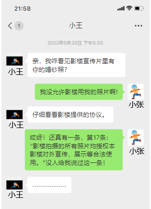

**思想政治**

**本试卷满分100分 考试时间75分钟**

**一、选择题：本题共16小题，每小题3分，共48分。在每小题给出的A、B、C、D四个选项中，只有一项是符合题目要求的。**

1\. 习近平总书记指出：“人无精神则不立，国无精神则不强。”中国共产党人的精神谱系是中国共产党人强大动员力、战斗力以及凝聚力的精神之“源”。据此，可以推出（ ）

①伟大精神引领伟大事业

②爱国主义是中华民族精神核心

③伟大建党精神为我们立党兴党强党提供了丰厚精神滋养

④中华优秀传统文化为中国共产党人的精神谱系提供了深厚的文化土壤

A. ①② B. ①③ C. ②④ D. ③④

2\. 2024年，《河北省特色产业集群“共享智造”行动方案》出台，在全国率先推进“共享智造”：围绕生产制造的各环节，依托数字化、智能化基础设施，通过共享生产资源、技术、服务能力等，优化资源配置，推动降本增效，促进转型升级。下列情形能体现“共享智造”的是（ ）

①企业邀请专家对员工进行培训，提高其职业技能

②通过工业互联网平台拆解订单，多企协同完成任务

③建立智能检验检测中心供各企业使用，减少重复购置

④企业和供应商建立长期合作关系，增强供应链稳定性

A. ①② B. ①④ C. ②③ D. ③④

3\. 2024年底召开的中央经济工作会议提出，综合整治“内卷式”竞争。“内卷式”竞争的表现多种多样，如企业竞争拼价格挤赛道、地方政府招商拼税费比补贴等。下列路径能够减少“内卷”，推动良性竞争的是（ ）

①优化广告投放→产品销量增加→压低采购价格→企业利润增长

②增加研发投入→科技含量提高→高端客户增加→企业利润增长

③提高产品质量→售后服务减少→产品价格提高→企业利润增长

④改善营商环境→企业成本下降→企业利润增长→财政收入增长

A. ①② B. ①③ C. ②④ D. ③④

4\. 自2013年起，中纪委每月公布全国查处违反中央八项规定精神问题统计数据，直击作风顽疾、划定纪律红线，坚持不懈、久久为功。2024年调查数据显示，94.9%的受访群众对中央八项规定精神贯彻落实成效表示肯定。材料表明中国共产党（ ）

①不断加强自身建设，敢于自我革命的政治勇气

②始终坚持党要管党、全面从严治党的执政理念

③反腐败永远在路上，任何时候都不能松懈手软

④推进作风建设为世界政党发展提供了重要借鉴

A. ①② B. ①③ C. ②④ D. ③④

5\. 1949年7月，石家庄市成功召开首届人民代表大会，成为全国第一个召开人民代表大会的城市。参会的160名代表来自各阶层、各行业，由近12万名选民通过各种方式选举产生。大会在民主理念、建政纲领等方面积累了宝贵经验，“提供了全国实行人民民主的范例”，是全过程人民民主的“生动预演”。由此可知（ ）

①人民代表大会制度是历史传承基础上演化的结果

②各级人大代表由人民直接选举产生并对人民负责

③石家庄为人民代表大会制度的建立作出重要贡献

④人民代表大会制度是有中国特色基本政治制度

A. ①③ B. ①④ C. ②③ D. ②④

6\. 以第一个省级民族区域自治政府诞生为主题的情景短剧《五一大会》，再现了在中国共产党领导下，内蒙古各族人民团结一致、共求解放的革命热情；集非遗体验、红色展演等功能于一体的兴安领创·展示体验中心。展示了中华文明的多元一体与独特魅力，也为当地手工艺者提供了创新创业平台。材料表明（ ）

①自治区党委是民族自治地方行使自治权的机关

②民族平等是保障少数民族合法权益的基本方针

③红色文化有利于中华民族共有精神家园的构筑

④文化传承与经济建设的融合推动民族地区发展

A. ①② B. ①③ C. ②④ D. ③④

“1979年，那是一个春天，有一位老人在中国的南海边画了一个圈，神话般地崛起座座城……”这首《春天的故事》传唱的正是特区一路走来创造的辉煌与奇迹。联系材料，回答下列小题。

7\. 1980年，深圳经济特区成立，成为我国改革开放的窗口。2019年，党中央、国务院支持深圳建设中国特色社会主义先行示范区。特区成立45年来，深圳敢闯敢试、敢为人先、埋头苦干，不断续写“春天的故事”。下列说法正确的是（ ）

①深圳建设先行示范区成功开创了中国特色社会主义

②成立深圳经济特区表明社会主义市场经济体制初步建立

③建设先行示范区使深圳肩负起率先实现社会主义现代化的历史使命

④成立深圳经济特区是我国推进改革开放和社会主义现代化建设的伟大创举

A ①② B. ①④ C. ②③ D. ③④

8\. 利用临近港澳优势成立的深圳经济特区，承载着中国经济体制改革试验田的功能和使命，被称为中国对外开放发展外向型经济的起跑线。通过试点先行，深圳的典型经验在全国推广，凸显了其示范、带动作用，对改革全局意义重大。据此，下列说法正确的是（ ）

①经济体制改革着眼于变革上层建筑以适应经济基础状况的要求

②利用临近港澳优势成立经济特区体现了对区位特点的分析把握

③从试点先行到形成经验是从个别到一般、从共性到个性的体现

④发展外向型经济体现了注重对促进经济发展的外部条件的利用

A. ①② B. ①③ C. ②④ D. ③④

9\. 有无是非，如何分辨是非，历来为人们所关注。孔子曾就此提出“众恶之，必察焉；众好之，必察焉”，即大家厌恶他，一定要去考察；大家喜爱他，也一定要去考察。据此，可以推出（ ）

①经实践检验的认识，是理论与实践的具体的历史的统一

②“是”与“非”不能辨别，因为多数人的意见难以达成一致

③“是”与“非”是人们对同一确定的对象所产生的不同认识

④“是”与“非”要通过处在主观和客观交汇点上的“考察”来辨别

A. ①② B. ①③ C. ②④ D. ③④

10\. 综合国力是指一个国家生存和发展所拥有的各方面力量的总和。据此，下列表述错误的是（ ）

A. 巴西承办奥运会的背后是综合国力的不断增强

B. 英国和意大利政体不同决定了两国不同的国家实力

C. “中国天眼”等大科学装置向全球开放是科技实力的体现

D. 抗日战争伟大胜利形成的抗战精神是文化实力的重要构成

11\. 某班学生以“国际化河北”为主题，开展调研活动，得出如下结论。其中正确是（ ）

|     |                |                |
|:--- |:-------------- |:-------------- |
|     | 项目             | 结论             |
| ①   | 张家口向世界推广冰雪产业   | 积极开拓世界市场       |
| ②   | 保定举办亚洲电商大会     | 符合合作共赢理念       |
| ③   | 廊坊举办国际经贸洽谈会    | 建立了国际经济新秩序     |
| ④   | 邯郸举办国际有机农业发展大会 | 显示出中国农业强国的主导地位 |

A ①② B. ①③ C. ②④ D. ③④

12\. 《教育强国建设规划纲要（2024—2035年）》提出，改革国家公派出国留学体制机制，加强“留学中国”品牌和能力建设；鼓励支持选拔优秀人才到国际知名高校、研究机构研修，扩大中外青少年交流；提升高等教育海外办学能力，完善职业教育产教融合、校企协同国际合作机制，深耕鲁班工坊等品牌。由此可知（ ）

①“留学中国”能力建设是实现教育强国的重要措施

②吸引外国学生定居中国是扩大中外交流的主要形式

③教育强国建设的立足点是利用好国际优质教育资源

④深耕鲁班工坊利于推进国际合作助力教育强国建设

A. ①③ B. ①④ C. ②③ D. ②④

13\. 某语文教师复印了杨某所写畅销小说的部分内容用于教学研究。小说副标题是“射雕英雄的大学生涯”，讲述了汴京大学郭靖、黄蓉等人的校园故事，其中主要角色的名称、性格、关系与金庸颇具影响力的小说《射雕英雄传》有诸多相似之处。于此，下列说法正确的是（ ）

①若杨某被诉侵权，其小说属于物证

②杨某侵犯了金庸相关作品的著作权

③该小说副标题内容的设置构成不正当竞争

④该教师使用杨某小说的行为属于法定许可

A. ①③ B. ①④ C. ②③ D. ②④

14\. 大学毕业生小王计划回乡创业，下列建议符合法律规定的是（ ）

①父亲：采取合伙企业形式，无需缴纳企业所得税

②母亲：注册电子商务公司，无需公示企业登记信息

③朋友甲：以厂房设立质押向银行贷款，无需转移占有

④朋友乙：通过仲裁解决与客户商事纠纷，比诉讼更便捷

A. ①③ B. ①④ C. ②③ D. ②④

15\. 下面为小张与其朋友小王的微信聊天内容截图。

于此，下列说法正确的是（ ）

①协议第17条属于格式条款，影楼应予以提示

②若小张没有证据或证据不足，由小张承担不利后果

③若小张胜诉，影楼应承担排除妨碍、恢复原状、赔礼道歉的责任

④影楼未经授权使用了小张的婚纱照，侵犯了小张的名誉权和肖像权

A. ①② B. ①③ C. ②④ D. ③④

16\. 研究发现，12所小学572名一年级学生在接受5周的自律培训后，其综合素质显著提升：管理自身注意力、情绪的能力有了很大提高，阅读能力和专注力也得到明显改善。以“自律培训能够提升学生的综合素质”为结论，下列情形能提高推理可靠程度的是（ ）

①其他小学生在接受相同培训后综合素质显著提高

②学生接受的培训时间越长，综合素质提升越显著

③这572名学生的入学成绩、健康水平等条件相同

④培训过程中，就餐环境更舒适，膳食结构更科学

A. ①② B. ①③ C. ②④ D. ③④

**二、非选择题：本题共4题，共52分。**

17\. 阅读材料，完成下列要求。

占全球总产量45%的法式鹅肝、60%的鱼子酱……一批原本产自域外的“舶来品”，已悄然在中国大地上生根发芽，茁壮成长，被网友称为“中国新特产”。通过科技赋能，促进企业品质化、品牌化发展，这些更具性价比的国产高端食材开始“飞入寻常百姓家”，助力培育消费新亮点，深挖内需新潜力，推动产业转型升级。

两千多年前，丝绸、香料……开启了中外交流的序幕。进入新时代，打上中国烙印的“新特产”，又以“中国制造”的身份走出国门、圈粉世界。当法国厨师团队与中国企业交流鹅肝加工技术，当俄罗斯客户说四川鱼子酱让他“回忆起了儿时时光”……一幕幕场景生动演绎了吸纳全球资源，将“外来品种”转化为“本土优势”，再以本土化产品反哺全球的中国故事。当“中国味道”与“世界餐桌”深度交织，展现的是中国于变局中开新局，以互利共赢造福全世界的自信与包容。

结合材料，运用经济与社会、当代国际政治与经济知识，分析“中国新特产”成功的意义。

18\. 阅读材料，完成下列要求。

材料一 习近平总书记指出：“坚持法治为了人民、依靠人民、造福人民、保护人民，把体现人民利益、反映人民愿望、维护人民权益、增进人民福祉落实到法治体系建设全过程。”今天的中国，聚民智立善法，汇民意解难题，制定无障碍环境建设法，推动解决残疾人、老年人急难愁盼问题；深入推进“放管服”改革，优化简化办事流程，提高服务效能和水平；聚焦人民群众最关心最直接最现实的问题，提供精准、便捷、优质的法律援助和司法救助服务；……持续推动法治进程，人民群众获得感、幸福感、安全感不断提升。

材料二 老年人期盼老有所养、老有所医，然而，现实生活中的纠纷仍时有发生。

胡大爷与老伴育有一儿一女，老伴已过世。儿女就胡大爷的赡养问题订立合同，其中包含如下内容：儿子放弃继承权；女儿负责照料父亲，儿子不再承担父亲的赡养义务。天有不测风云，胡大爷突发重病，生活不能自理。女儿为父亲治病花光了家中的全部积蓄，生活遇到了极大困难，向胡大爷儿子求助。儿子认为：合同约定在先；自己既不需要出钱，也不需要照料父亲。

（1）结合材料一，运用政治与法治知识，谈谈如何理解法治让生活更美好。

（2）结合材料二，运用法律与生活知识，判断胡大爷儿子的观点是否成立，并分别从法律和道德两个层面说明理由。

19\. 阅读材料，完成下列要求。

材料一 被誉为“中国成语典故之都”的邯郸，与之相关的成语有一千多条，其中有的是古代战争的记叙，有的是历史史实的概括，有的是生产生活实践的总结。如表现战争中用兵之术的“围魏救赵”，反映主动认错良好品格的“负荆请罪”等，都承载着丰富的历史记忆，蕴含着深厚的文化内涵。成语文化折射出的善于思辨、勇于担当、包容进取等人文精神，滋养着人们的心灵，塑造着城市的灵魂。

材料二 为适应新时代建设文化强国的需要，邯郸立足于丰富的成语文化资源，秉持薪火相传、代代守护、推陈出新、革故鼎新的理念，注重成语文化在穿越时空中活态呈现。以“新”续“旧”，“唤醒”了成语，激活了古城；开展成语文化进校园活动，将成语文化融入学校教育中，让青少年在耳濡目染中汲取精神食粮；打造成语主题公园，并积极开发成语饮食等各类文创产品，提升城市品位；发行中英文双语版《邯郸成语典故帛书》，推进成语文化的国际传播，展示中华文化的独特魅力。

（1）结合材料一和材料二，运用“社会历史的本质”“建设文化强国”的知识，说明邯郸成语文化缘何而生，如今又是如何激活古城、助力文化强国建设的。

（2）结合材料二，运用逻辑与思维中“推动认识发展”的知识，分析邯郸推动成语文化发展的启示。

20\. 结合漫画，完成下列要求。

为了充分发掘废旧手机的价值，任选两种强制思维发散的技法，完善表格内容。

|     |      |
|:--- |:---- |
| 技法  | 具体应用 |
|     |      |
|     |      |
