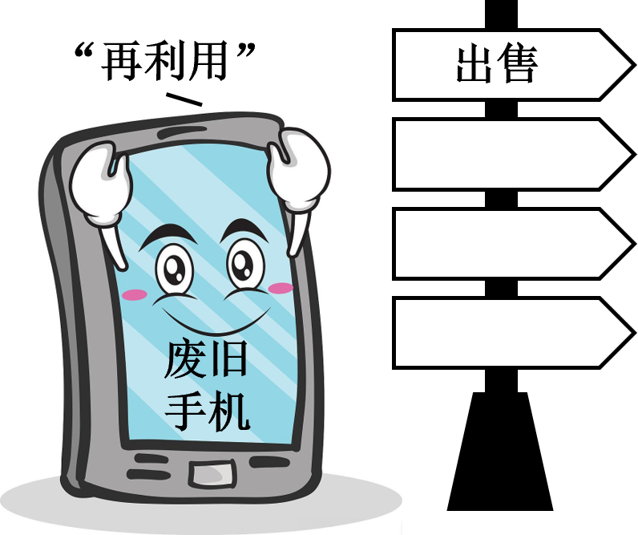

**思想政治**

**本试卷满分100分 考试时间75分钟**

**一、选择题：本题共16小题，每小题3分，共48分。在每小题给出的A、B、C、D四个选项中，只有一项是符合题目要求的。**

1\. 习近平总书记指出：“人无精神则不立，国无精神则不强。”中国共产党人的精神谱系是中国共产党人强大动员力、战斗力以及凝聚力的精神之“源”。据此，可以推出（ ）

①伟大精神引领伟大事业

②爱国主义是中华民族精神的核心

③伟大建党精神为我们立党兴党强党提供了丰厚精神滋养

④中华优秀传统文化为中国共产党人的精神谱系提供了深厚的文化土壤

A. ①② B. ①③ C. ②④ D. ③④

【答案】B

【解析】

【详解】①：“人无精神则不立，国无精神则不强”这句话表明了精神力量对于个人和国家的重要性。对个人而言，没有精神就没有目标和动力，无法在社会中立足；对国家而言，没有精神就会失去凝聚力和竞争力，无法成为一个强大的国家，由此可推知，伟大精神引领伟大事业，①正确。

②：题干聚焦于中国共产党人的精神谱系，未涉及中华民族精神的具体内容，未提及爱国主义，②排除。

③：中国共产党人的精神谱系是中国共产党人强大动员力、战斗力以及凝聚力的精神之“源”，体现了中国共产党人的精神谱系的作用，由此可推知，伟大建党精神为我们立党兴党强党提供了丰厚精神滋养，③正确。

④：题干未提及中华优秀传统文化，无法推出为中国共产党人的精神谱系提供了深厚的文化土壤，④排除。

故本题选B。

2\. 2024年，《河北省特色产业集群“共享智造”行动方案》出台，在全国率先推进“共享智造”：围绕生产制造的各环节，依托数字化、智能化基础设施，通过共享生产资源、技术、服务能力等，优化资源配置，推动降本增效，促进转型升级。下列情形能体现“共享智造”的是（ ）

①企业邀请专家对员工进行培训，提高其职业技能

②通过工业互联网平台拆解订单，多企协同完成任务

③建立智能检验检测中心供各企业使用，减少重复购置

④企业和供应商建立长期合作关系，增强供应链稳定性

A. ①② B. ①④ C. ②③ D. ③④

【答案】C

【解析】

【详解】①：“共享智造”即围绕生产制造的各环节，依托数字化、智能化基础设施，通过共享生产资源、技术、服务能力等，优化资源配置，推动降本增效，促进转升级。企业邀请专家对员工进行培训，并未依托数字化、智能化基础设施，未体现“共享智造”，①排除。

②：通过工业互联网平台拆解订单，依托数字化、智能化基础设施，通过共享优化资源配置，多企协同完成任务，体现了“共享智造”，②正确。

③：建立智能检验检测中心供各企业使用，减少重复购置，依托数字化、智能化基础设施，通过共享推动降本增效，③正确。

④：企业和供应商建立长期合作关系，属于企业间的合作，未体现“共享智造”，④排除。

故本题选C。

3\. 2024年底召开的中央经济工作会议提出，综合整治“内卷式”竞争。“内卷式”竞争的表现多种多样，如企业竞争拼价格挤赛道、地方政府招商拼税费比补贴等。下列路径能够减少“内卷”，推动良性竞争的是（ ）

①优化广告投放→产品销量增加→压低采购价格→企业利润增长

②增加研发投入→科技含量提高→高端客户增加→企业利润增长

③提高产品质量→售后服务减少→产品价格提高→企业利润增长

④改善营商环境→企业成本下降→企业利润增长→财政收入增长

A. ①② B. ①③ C. ②④ D. ③④

【答案】C

【解析】

【详解】①：“内卷式”竞争的一个很重要表现就是企业竞争拼价格挤赛道。优化广告投放，能够提升广告宣传的效率和效果，增加消费者对企业产品的了解，扩大市场占有率，产品销量增加可能使企业扩大生产，提高产量，进而在原材料采购时压低价格，使企业产品成本下降，但这样又开始了原材料环节的价格竞争，并未完全避免拼价格挤赛道的竞争方式，①排除。

②：增加研发投入，产品中的科技含量提高，有利于获得更多追求品质的高端客户的青睐，扩大企业高端市场规模，实现利润增长，推动良性竞争，②正确。

③：在提高产品质量的情况下，经营理念先进的企业也会努力改善售后服务，“售后服务减少”说法不妥，且售后服务减少与产品价格提高也并非因果关系，③排除。

④：改善营商环境， 破除制约市场主体发展的体制机制障碍，有助于降低企业生产经营的制度性成本，增加企业利润，而企业所得税和增值税是财政收入的重要组成部分，企业利润增长能带动财政收入的增长，④正确。

故本题选C。

4\. 自2013年起，中纪委每月公布全国查处违反中央八项规定精神问题统计数据，直击作风顽疾、划定纪律红线，坚持不懈、久久为功。2024年调查数据显示，94.9%的受访群众对中央八项规定精神贯彻落实成效表示肯定。材料表明中国共产党（ ）

①不断加强自身建设，敢于自我革命的政治勇气

②始终坚持党要管党、全面从严治党的执政理念

③反腐败永远在路上，任何时候都不能松懈手软

④推进作风建设为世界政党发展提供了重要借鉴

A. ①② B. ①③ C. ②④ D. ③④

【答案】B

【解析】

【详解】①：查处违反中央八项规定精神问题，直击作风顽疾、划定纪律红线，表明党不断加强自身建设，敢于自我革命的政治勇气，①正确。

②：党的执政理念是立党为公、执政为民，②排除。

③：自2013年起，中纪委坚持不懈整顿作风顽疾，可见，中国共产党反腐败永远在路上，任何时候都不能松懈手软，③正确。

④：材料未提及中国共产党与世界政党发展的关系，未涉及为世界其他政党发展提供借鉴，④排除。

故本题选B。

5\. 1949年7月，石家庄市成功召开首届人民代表大会，成为全国第一个召开人民代表大会的城市。参会的160名代表来自各阶层、各行业，由近12万名选民通过各种方式选举产生。大会在民主理念、建政纲领等方面积累了宝贵经验，“提供了全国实行人民民主的范例”，是全过程人民民主的“生动预演”。由此可知（ ）

①人民代表大会制度是历史传承基础上演化的结果

②各级人大代表由人民直接选举产生并对人民负责

③石家庄为人民代表大会制度的建立作出重要贡献

④人民代表大会制度是有中国特色的基本政治制度

A. ①③ B. ①④ C. ②③ D. ②④

【答案】A

【解析】

【详解】①③：1949年7月，石家庄市召开首届人民代表大会，提供了全国实行人民民主的范例，是全过程人民民主的“生动预演”，体现了人民代表大会制度的历史传承，也体现了石家庄为人民代表大会制度的建立作出重要贡献，①③正确。

②：县、乡两级人大代表由选民直接选举产生，全国、省级、设区的市级人大代表由下一级人民代表大会选举产生，②错误。

④：人民代表大会制度是我国的根本政治制度，④错误。

故本题选A。

6\. 以第一个省级民族区域自治政府诞生为主题的情景短剧《五一大会》，再现了在中国共产党领导下，内蒙古各族人民团结一致、共求解放的革命热情；集非遗体验、红色展演等功能于一体的兴安领创·展示体验中心。展示了中华文明的多元一体与独特魅力，也为当地手工艺者提供了创新创业平台。材料表明（ ）

①自治区党委是民族自治地方行使自治权的机关

②民族平等是保障少数民族合法权益的基本方针

③红色文化有利于中华民族共有精神家园的构筑

④文化传承与经济建设的融合推动民族地区发展

A. ①② B. ①③ C. ②④ D. ③④

【答案】D

【解析】

【详解】①： 人民代表大会和人民政府是民族自治地方行使自治权的机关，①说法错误。       

②：材料强调的是民族团结，而不是民族平等。而且坚持民族平等、民族团结和各民族共同繁荣是保障少数民族合法权益的基本方针，②说法错误。

③：该剧再现了在中国共产党领导下，内蒙古各族人民团结一致、共求解放的革命热情，展示了中华文明的多元一体与独特魅力，有利于中华民族共有精神家园的构筑 ，③观点符合题意。      

④：集非遗体验、红色展演等功能于一体，为当地手工艺者提供了创新创业平台，表明了文化传承与经济建设的融合推动民族地区发展，④观点符合题意。

故本题选D。

“1979年，那是一个春天，有一位老人在中国的南海边画了一个圈，神话般地崛起座座城……”这首《春天的故事》传唱的正是特区一路走来创造的辉煌与奇迹。联系材料，回答下列小题。

7\. 1980年，深圳经济特区成立，成为我国改革开放的窗口。2019年，党中央、国务院支持深圳建设中国特色社会主义先行示范区。特区成立45年来，深圳敢闯敢试、敢为人先、埋头苦干，不断续写“春天的故事”。下列说法正确的是（ ）

①深圳建设先行示范区成功开创了中国特色社会主义

②成立深圳经济特区表明社会主义市场经济体制初步建立

③建设先行示范区使深圳肩负起率先实现社会主义现代化的历史使命

④成立深圳经济特区是我国推进改革开放和社会主义现代化建设的伟大创举

A. ①② B. ①④ C. ②③ D. ③④

8\. 利用临近港澳优势成立的深圳经济特区，承载着中国经济体制改革试验田的功能和使命，被称为中国对外开放发展外向型经济的起跑线。通过试点先行，深圳的典型经验在全国推广，凸显了其示范、带动作用，对改革全局意义重大。据此，下列说法正确的是（ ）

①经济体制改革着眼于变革上层建筑以适应经济基础状况要求

②利用临近港澳优势成立经济特区体现了对区位特点的分析把握

③从试点先行到形成经验是从个别到一般、从共性到个性的体现

④发展外向型经济体现了注重对促进经济发展的外部条件的利用

A. ①② B. ①③ C. ②④ D. ③④

【答案】7. D 8. C

【解析】

【7题详解】

③：深圳是我国改革开放的窗口，党中央、国务院支持其建设中国特色社会主义先行示范区，使其肩负起率先实现社会主义现代化的历史使命，成为创建社会主义现代化强国的城市范例，③正确。

④：发展经济特区，是建设中国特色社会主义伟大事业的重要组成部分，将贯穿我国改革开放和现代化建设的全过程，因此成立深圳经济特区是我国推进改革开放和社会主义现代化建设的伟大创举，④正确。

①：1982年，在党的十二大开幕式上，邓小平明确提出了“走自己的道路，建设有中国特色的社会主义”这一鲜明主题，从此以后，中国共产党所有的理论创新和实践创新都是紧紧围绕这个主题展开的。改革开放以来，中国共产党不断推进理论创新、实践创新、制度创新，成功开创、坚持和发展了中国特色社会主义，而不是2019年深圳建设先行示范区成功开创了中国特色社会主义，①排除。

②：2002年党的十六大宣告我国社会主义市场经济体制初步建立，而不是1980年深圳经济特区成立表明社会主义市场经济体制初步建立，②排除。

故本题选D。

【8题详解】

①：经济体制改革着眼于变革生产关系以适应生产力的要求，而不是着眼于变革上层建筑以适应经济基础状况的要求，①排除。

②：依据材料，成立深圳经济特区依据的是其临近港澳，具有区位优势的特点，②正确。

③：试点先行属于个别和个性，形成经验是一般和共性，从试点先行到形成经验是从个别到一般、从个性到共性体现，而不是从共性到个性的体现，且选项说法自相矛盾，③排除。

④：外因是事物变化发展的条件、发展外向型经济有别于内向型经济，它是面向国际市场的一种经济形式，体现了注重对促进经济发展的外部条件的利用，④正确。

故本题选C。

9\. 有无是非，如何分辨是非，历来为人们所关注。孔子曾就此提出“众恶之，必察焉；众好之，必察焉”，即大家厌恶他，一定要去考察；大家喜爱他，也一定要去考察。据此，可以推出（ ）

①经实践检验的认识，是理论与实践的具体的历史的统一

②“是”与“非”不能辨别，因为多数人的意见难以达成一致

③“是”与“非”是人们对同一确定的对象所产生的不同认识

④“是”与“非”要通过处在主观和客观交汇点上的“考察”来辨别

A. ①② B. ①③ C. ②④ D. ③④

【答案】D

【解析】

【详解】①：实践是检验认识正确与否的唯一标准，只有经实践检验为正确的认识才是理论与实践的具体的历史的统一，①错误。

②：孔子的话强调即使多数人意见一致（众好或众恶），也必须通过考察来辨别是非，即认为“是”与“非”是可以辨别的，②错误。

③：大家对同一对象有“恶”“好”的不同认识，说明“是”与“非”是人们对同一确定对象的不同认识，认识具有主体差异性，③正确。

④：实践是连接主观与客观的桥梁，“众恶之，必察焉；众好之，必察焉”，说明“是”与“非”要通过处在主观和客观交汇点上的“考察”（即实践）来辨别，④正确。

故本题选D。

10\. 综合国力是指一个国家生存和发展所拥有的各方面力量的总和。据此，下列表述错误的是（ ）

A. 巴西承办奥运会的背后是综合国力的不断增强

B. 英国和意大利政体不同决定了两国不同的国家实力

C. “中国天眼”等大科学装置向全球开放是科技实力的体现

D. 抗日战争伟大胜利形成的抗战精神是文化实力的重要构成

【答案】B

【解析】

【详解】本题是逆向选择题。

A：巴西承办奥运会的背后是综合国力的不断增强，A说法正确，但不符合题意。

B：英国和意大利政体不同，但决定不了两国不同的国家实力，B说法错误，但符合题意。

C：“中国天眼”等大科学装置向全球开放是科技实力的体现，体现了中国的综合国力，C说法正确，但不符合题意。

D：抗日战争伟大胜利形成的抗战精神是文化实力的重要构成，是综合国力的一部分，D说法正确，但不符合题意。

故本题选B。

11\. 某班学生以“国际化河北”为主题，开展调研活动，得出如下结论。其中正确的是（ ）

|     |                |                |
|:--- |:-------------- |:-------------- |
|     | 项目             | 结论             |
| ①   | 张家口向世界推广冰雪产业   | 积极开拓世界市场       |
| ②   | 保定举办亚洲电商大会     | 符合合作共赢理念       |
| ③   | 廊坊举办国际经贸洽谈会    | 建立了国际经济新秩序     |
| ④   | 邯郸举办国际有机农业发展大会 | 显示出中国农业强国的主导地位 |

A. ①② B. ①③ C. ②④ D. ③④

【答案】A

【解析】

【详解】①：张家口向世界推广冰雪产业，能够提升国际知名度与影响力，促进国际交流合作，拓展国际市场空间，是开拓世界市场的有力举措，①正确。

②：保定举办亚洲电商大会，能够拓展国际市场，共享发展经验，符合合作共赢理念，②正确。

③：国际经济新秩序还未建立，“建立了”不符合实际，且该结论夸大了廊坊举办国际经贸洽谈会的作用，③错误。

④：“主导”一词夸大了中国地位，且中国目前还不是农业强国，④错误。

故本题选A。

12\. 《教育强国建设规划纲要（2024—2035年）》提出，改革国家公派出国留学体制机制，加强“留学中国”品牌和能力建设；鼓励支持选拔优秀人才到国际知名高校、研究机构研修，扩大中外青少年交流；提升高等教育海外办学能力，完善职业教育产教融合、校企协同国际合作机制，深耕鲁班工坊等品牌。由此可知（ ）

①“留学中国”能力建设是实现教育强国的重要措施

②吸引外国学生定居中国是扩大中外交流的主要形式

③教育强国建设的立足点是利用好国际优质教育资源

④深耕鲁班工坊利于推进国际合作助力教育强国建设

A. ①③ B. ①④ C. ②③ D. ②④

【答案】B

【解析】

【详解】①：来华留学是我国教育体系的重要组成部分，同时它也是国家软实力的重要体现，留学事业是衡量一个国家是否为教育强国的重要指标，“留学中国”能力建设有助于推动教育强国目标的实现，①正确。

②：吸引外国学生定居中国有利于扩大中外交流，但“主要形式”夸大了其影响力，②错误。

③：教育强国建设的立足点是中国自身的发展实践，③错误。

④：深耕鲁班工坊等品牌，有利于促进教育交流，深化国际教育合作，不断培养高素质国际化人才，助力教育强国建设，④正确。

故本题选B。

13\. 某语文教师复印了杨某所写畅销小说的部分内容用于教学研究。小说副标题是“射雕英雄的大学生涯”，讲述了汴京大学郭靖、黄蓉等人的校园故事，其中主要角色的名称、性格、关系与金庸颇具影响力的小说《射雕英雄传》有诸多相似之处。于此，下列说法正确的是（ ）

①若杨某被诉侵权，其小说属于物证

②杨某侵犯了金庸相关作品的著作权

③该小说副标题内容的设置构成不正当竞争

④该教师使用杨某小说的行为属于法定许可

A. ①③ B. ①④ C. ②③ D. ②④

【答案】C

【解析】

【详解】①：书证是指以文字、符号、图案等所记载的内容或表达的思想来证明案件事实的证据。物证是指以其存在的形状、质量、规格、特征等来证明案件事实的证据。本案中，杨某的小说属于书证，①错误。

②：杨某所写畅销小说，其中主要角色的名称、性格、关系与金庸颇具影响力的小说《射雕英雄传》有诸多相似之处，杨某侵犯了金庸相关作品的著作权，②正确。

③：该小说副标题将自己的作品直接指向金庸作品，其借助金庸作品的影响力吸引读者获取利益的意图明显，与文化产业公认的商业道德相背离，因此，该行为构成不正当竞争，③正确。

④：为学校课堂教学或者科学研究，翻译、改编、汇编、播放或者少量复制已经发表的作品，供教学或者科研人员使用，属于作品的合理使用，④错误。

故本题选C。

14\. 大学毕业生小王计划回乡创业，下列建议符合法律规定的是（ ）

①父亲：采取合伙企业形式，无需缴纳企业所得税

②母亲：注册电子商务公司，无需公示企业登记信息

③朋友甲：以厂房设立质押向银行贷款，无需转移占有

④朋友乙：通过仲裁解决与客户商事纠纷，比诉讼更便捷

A. ①③ B. ①④ C. ②③ D. ②④

【答案】B

【解析】

【详解】①：为避免重复征税，国家取消对合伙企业征收企业所得税，对这些企业投资者的生产经营所得征收个人所得税，①正确。

②：电子商务法规定，电子商务经营者应当在其首页显著位置，持续公示营业执照信息，与其经营业务有关的行政许可信息等，或者上述信息的链接标识，所以母亲的观点不符合法律规定，②错误。

③：质押是指债务人或者第三人将其动产移交债权人占有，将该动产作为债权的担保；抵押是指债务人或者第三人不转移财产的占有，将该财产作为债权的担保。小王可以以厂房设立抵押向银行贷款，不是质押，所以朋友甲的观点不符合法律规定，③错误。

④：当平等主体当事人之间发生合同纠纷或者其他财产权益纠纷时，双方可以将其提交仲裁机构进行商事仲裁。商事仲裁较诉讼而言，具有诸多优点，仲裁程序比较灵活，一裁终局，仲裁裁决一经作出即发生法律效力，仲裁更加便捷、经济，所以朋友乙的建议符合法律规定，④正确。

故本题选B。

15\. 下面为小张与其朋友小王的微信聊天内容截图。

于此，下列说法正确的是（ ）

①协议第17条属于格式条款，影楼应予以提示

②若小张没有证据或证据不足，由小张承担不利后果

③若小张胜诉，影楼应承担排除妨碍、恢复原状、赔礼道歉的责任

④影楼未经授权使用了小张的婚纱照，侵犯了小张的名誉权和肖像权

A. ①② B. ①③ C. ②④ D. ③④

【答案】A

【解析】

【详解】①：影楼在协议中预先拟定第17条“影楼拍摄的所有照片均授权本影楼对外宣传、展示等合法使用”，这是为了重复使用而预先拟定，且未与小张协商的条款，属于格式条款。该条款涉及小张的肖像权，与小张有重大利害关系，影楼应当于以提示，①正确。

②：在民事诉讼中，实行“谁主张，谁举证”的举证原则，小张若要证明影楼构成侵权，须承担举证责任，若小张没有证据或证据不足，应承担不利后果，②正确。

③：若小张胜诉，说明影楼侵犯其肖像权，侵犯肖像权的责任承担方式主要是停止侵害、赔礼道歉、赔偿损失等。排除妨碍、恢复原状不适用于材料中的侵权情形，③排除。

④：影楼未经小张允许使用其婚纱照用于宣传，侵犯了小张的肖像权，但未侵犯小张的名誉权，④排除。

故本题选A。

16\. 研究发现，12所小学572名一年级学生在接受5周的自律培训后，其综合素质显著提升：管理自身注意力、情绪的能力有了很大提高，阅读能力和专注力也得到明显改善。以“自律培训能够提升学生的综合素质”为结论，下列情形能提高推理可靠程度的是（ ）

①其他小学生在接受相同培训后综合素质显著提高

②学生接受的培训时间越长，综合素质提升越显著

③这572名学生的入学成绩、健康水平等条件相同

④培训过程中，就餐环境更舒适，膳食结构更科学

A. ①② B. ①③ C. ②④ D. ③④

【答案】A

【解析】

【详解】①：对于简单枚举归纳推理而言，对认识对象考察的数量越多，推理的可靠性越高，因此若更多的小学生在接受相同培训后综合素质显著提高，则能提高题中结论的可靠性，①正确。

②：从时间角度来说，若同样的小学生接受相同培训的时间越长，综合素质提升越显著，则说明自律培训时间与综合素质之间更可能存在正相关关系，可以提高题中结论的可靠性，②正确。

③：所述排除了入学成绩、健康水平等条件的干扰，在此前提下仅能得出可能存在题中的结论，但不能进一步提高其可靠性，③排除。

④：选项所述可能引起就餐环境、膳食结构等条件对题中结论的干扰，即在此前提下，学生综合素质的提升也许是由更舒适的就餐环境、更科学的膳食结构等因素造成的，反而降低了推理可靠性，④排除。

故本题选A。

**二、非选择题：本题共4题，共52分。**

17\. 阅读材料，完成下列要求。

占全球总产量45%的法式鹅肝、60%的鱼子酱……一批原本产自域外的“舶来品”，已悄然在中国大地上生根发芽，茁壮成长，被网友称为“中国新特产”。通过科技赋能，促进企业品质化、品牌化发展，这些更具性价比的国产高端食材开始“飞入寻常百姓家”，助力培育消费新亮点，深挖内需新潜力，推动产业转型升级。

两千多年前，丝绸、香料……开启了中外交流的序幕。进入新时代，打上中国烙印的“新特产”，又以“中国制造”的身份走出国门、圈粉世界。当法国厨师团队与中国企业交流鹅肝加工技术，当俄罗斯客户说四川鱼子酱让他“回忆起了儿时时光”……一幕幕场景生动演绎了吸纳全球资源，将“外来品种”转化为“本土优势”，再以本土化产品反哺全球的中国故事。当“中国味道”与“世界餐桌”深度交织，展现的是中国于变局中开新局，以互利共赢造福全世界的自信与包容。

结合材料，运用经济与社会、当代国际政治与经济知识，分析“中国新特产”成功的意义。

【答案】“中国新特产”通过科技赋能，打造自主品牌，实现产业结构优化升级，提高产品的国际竞争力；“中国新特产”性价比高，有助于创造新的经济增长点，拉动消费、扩大内需，满足人民日益增长的美好生活需要；“中国新特产”运销海内外，有利于为世界市场提供更丰富的产品，推进高水平对外开放，构建新发展格局；“中国新特产”造福全世界，有利于实现互利共赢，建设开放包容，共同繁荣的人类命运共同体，有利于增进文化交流与文化交融，促进中华文化走向世界。

【解析】

【分析】背景素材：中国新特产

考点考查：构建人类命运共同体、全面建设社会主义现代化国家的首要任务、发展更高层次的开放型经济、构建新发展格局

能力考查：描述和阐述事物，论证和探究问题

核心素养：科学精神、公共参与

【详解】第一步：审设问明确主体、知识范围、问题限定和作答角度。

本题需要调用经济与社会、当代国际政治与经济的有关知识，从构建人类命运共同体、全面建设社会主义现代化国家的首要任务、发展更高层次的开放型经济、构建新发展格局角度分析作答。

第二步：审材料。提取关键词，链接教材知识。

关键词①：通过科技赋能，促进企业品质化、品牌化发展→可联系产业升级、新质生产力发展等角度阐述打造自主品牌，实现产业结构优化升级，提高产品的国际竞争力。

关键词②：这些更具性价比的国产高端食材开始“飞入寻常百姓家”，助力培育消费新亮点，深挖内需新潜力，推动产业转型升级→可从全面建设社会主义现代化国家的首要任务角度阐述有助于拉动消费、扩大内需，满足人民日益增长的美好生活需要。

关键词③：吸纳全球资源，将“外来品种”转化为“本土优势”，再以本土化产品反哺全球→可从发展更高层次的开放型经济、中国经济发展对世界的贡献角度阐述有利于为世界市场提供更丰富的产品，推进高水平对外开放。

关键词④：以互利共赢造福全世界的自信与包容→可从构建人类命运共同体角度阐述实现互利共赢，有利于增进文化交流与文化交融，促进中华文化走向世界。

第三步：整合信息，组织答案。注意设问限定以及教材知识与材料、时政信息等相结合。

18\. 阅读材料，完成下列要求。

材料一 习近平总书记指出：“坚持法治为了人民、依靠人民、造福人民、保护人民，把体现人民利益、反映人民愿望、维护人民权益、增进人民福祉落实到法治体系建设全过程。”今天的中国，聚民智立善法，汇民意解难题，制定无障碍环境建设法，推动解决残疾人、老年人急难愁盼问题；深入推进“放管服”改革，优化简化办事流程，提高服务效能和水平；聚焦人民群众最关心最直接最现实的问题，提供精准、便捷、优质的法律援助和司法救助服务；……持续推动法治进程，人民群众获得感、幸福感、安全感不断提升。

材料二 老年人期盼老有所养、老有所医，然而，现实生活中的纠纷仍时有发生。

胡大爷与老伴育有一儿一女，老伴已过世。儿女就胡大爷的赡养问题订立合同，其中包含如下内容：儿子放弃继承权；女儿负责照料父亲，儿子不再承担父亲的赡养义务。天有不测风云，胡大爷突发重病，生活不能自理。女儿为父亲治病花光了家中的全部积蓄，生活遇到了极大困难，向胡大爷儿子求助。儿子认为：合同约定在先；自己既不需要出钱，也不需要照料父亲。

（1）结合材料一，运用政治与法治知识，谈谈如何理解法治让生活更美好。

（2）结合材料二，运用法律与生活知识，判断胡大爷儿子的观点是否成立，并分别从法律和道德两个层面说明理由。

【答案】（1）

①党的领导、人民当家作主、依法治国是有机统一的。党坚持人民立场，以人民为中心。

②建设法治国家，坚持良法之治，通过科学立法、民主立法，提高立法质量，反映人民意志，保证人民权益。

③建设法治政府，转变政府职能，深化“放管服”改革，优化公共服务，提高行政效能，简化办事流程，让人民群众享受更便捷、高效的服务，改善生活质量。

④建设完备的法律服务体系推进法治社会建设，保证群众获得及时有效的法律帮助，通过法律手段维护弱势群体的合法权益，促进社会和谐稳定。

（2）

（1）胡大爷儿子的观点不成立。

（2）法律层面：①赡养父母是法定义务，根据《民法典》规定，成年子女对父母有赡养扶助的义务，该义务不能通过协议免除。②合同约定无效，儿子与女儿订立的合同条款（儿子不承担赡养义务）违反法律强制性规定，属于无效条款。③继承权与赡养义务无关，儿子不能以放弃继承权为由拒绝履行赡养义务。

（3）道德层面：①赡养父母是中华民族的传统美德，子女应当自觉履行对父母的赡养责任，体现孝道和家庭责任感。②家庭成员应互相扶持，在父亲患病、妹妹经济困难的情况下，儿子应主动承担赡养责任，而非推卸义务。③诚信友善是社会公德，儿子拒绝履行赡养义务违背社会主义核心价值观，违反了社会公序良俗，不利于家庭和谐与社会稳定。综上，胡大爷儿子必须依法承担赡养责任，同时应弘扬孝亲敬老的传统美德。

【解析】

【分析】背景素材：推动法治进程、赡养老人纠纷案件     

考点考查：全面推进依法治国的原则、法治政府、法治国家、法治社会、敬老是义务、订立合同学问大、薪火相传有继承、认真对待民事权利与义务

能力考查：描述和阐释事物、论证和探究问题

核心素养：政治认同、科学精神、法治意识

【小问1详解】

第一步：审设问。明确主体、作答范围、问题限定和作答角度。

本题为措施类主观题，主体是国家，要求运用政治与法治知识，从如何做角度来分析作答。

第二步：审材料，通过标点符号、段落等，提取材料有效信息。

有效信息①：坚持法治为了人民、依靠人民、造福人民、保护人民，把体现人民利益、反映人民愿望、维护人民权益、增进人民福祉落实到法治体系建设全过程→可运用全面依法治国知识，从全面推进依法治国的原则角度分析说明党坚持以人民为中心。

有效信息②：聚民智立善法，汇民意解难题，制定无障碍环境建设法，推动解决残疾人、老年人急难愁盼问题→可运用全面依法治国知识，从法治国家的角度分析说明坚持良法之治，通过科学立法、民主立法，提高立法质量，保证人民权益。

有效信息③：深入推进“放管服”改革，优化简化办事流程，提高服务效能和水平→可运用全面依法治国知识，从法治政府的角度分析说明优化公共服务，提高行政效能，简化办事流程，让人民群众享受更便捷、高效的服务，改善生活质量。

有效信息④：聚焦人民群众最关心最直接最现实的问题，提供精准、便捷、优质的法律援助和司法救助服务→可运用全面依法治国知识，从法治社会的角度分析说明通过建设完备的法律服务体系，维护弱势群体的合法权益，促进社会和谐稳定。

第三步：整合信息，组织答案。注意设问限定以及教材知识与材料、时政信息等相结合。

【小问2详解】

第一步：审设问。明确题型、作答范围、问题限定和作答角度。

本题是原因类主观题。明确本题考查的知识范围是法律与生活，设问指向是运用敬老是义务、订立合同学问大、薪火相传有继承、认真对待民事权利与义务的知识进行说明。

第二步：审材料，提取关键词，链接教材知识。

有效信息①：女儿负责照料父亲，儿子不再承担父亲的赡养义务→可调用的法理依据是民法典关于成年子女赡养父母的义务。本案中，儿子不再承担父亲的赡养义务不符合相关法律规定。

有效信息②：儿子认为：合同约定在先；自己既不需要出钱，也不需要照料父亲→可调用的法理依据是无效合同的相关法律规定。本案中，儿子因放弃继承权不再承担父亲的赡养义务的合同条约违背民法典相关法律规定无效。

有效信息③：儿子放弃继承权，女儿负责照料父亲，儿子不再承担父亲的赡养义务→可调用的法理依据是继承权与成年子女赡养父母义务的关系。本案中，继承权可以放弃，成年子女赡养父母的义务不能放弃。

有效信息④：女儿为父亲治病花光了家中的全部积蓄，生活遇到了极大困难，向胡大爷儿子求助→可运用认真对待民事权利与义务知识，从全面依法治国坚持法治与德治相结合角度分析说明从传统美德、社会公德、社会主义核心价值观等方面，胡大爷儿子必须承担赡养责任。

第三步：整合信息、组织答案。注意设问要求与材料信息、课本知识的结合。

19\. 阅读材料，完成下列要求。

材料一 被誉为“中国成语典故之都”的邯郸，与之相关的成语有一千多条，其中有的是古代战争的记叙，有的是历史史实的概括，有的是生产生活实践的总结。如表现战争中用兵之术的“围魏救赵”，反映主动认错良好品格的“负荆请罪”等，都承载着丰富的历史记忆，蕴含着深厚的文化内涵。成语文化折射出的善于思辨、勇于担当、包容进取等人文精神，滋养着人们的心灵，塑造着城市的灵魂。

材料二 为适应新时代建设文化强国的需要，邯郸立足于丰富的成语文化资源，秉持薪火相传、代代守护、推陈出新、革故鼎新的理念，注重成语文化在穿越时空中活态呈现。以“新”续“旧”，“唤醒”了成语，激活了古城；开展成语文化进校园活动，将成语文化融入学校教育中，让青少年在耳濡目染中汲取精神食粮；打造成语主题公园，并积极开发成语饮食等各类文创产品，提升城市品位；发行中英文双语版《邯郸成语典故帛书》，推进成语文化的国际传播，展示中华文化的独特魅力。

（1）结合材料一和材料二，运用“社会历史的本质”“建设文化强国”的知识，说明邯郸成语文化缘何而生，如今又是如何激活古城、助力文化强国建设的。

（2）结合材料二，运用逻辑与思维中“推动认识发展”的知识，分析邯郸推动成语文化发展的启示。

【答案】（1）

①社会生活在本质上是实践的，人类创造科学文化的实践构成了社会生活的精神文化领域，邯郸成语文化作为一种文化现象是在人的实践中形成的。②社会存在决定社会意识，有什么样的社会存在，就有什么样的社会意识，邯郸成语文化作为一种社会意识,归根到底是对社会存在即古代战争、历史史实、生产生活实践的反映。③弘扬主旋律，传播正能量，支持健康有益文化，提高人们的道德修养，邯郸通过开展成语文化进校园活动，将成语文化脑入学校教育中，让青少年在耳潘目染中汲取精神食粮。④推动文化事业和文化产业发展,邯郸通过打造成语主题公园,并积极开发成语饮食等各类文创产品,不断高公共文化服务水平,提升文化产品的质量。⑤坚定文化自信,增强中华文明传播力影响力，加强国际传播能力建设，邯郸通过发行中英文双语版《邯郸成语典故帛书》推进成语文化的国际传播，展示中华文化的独特魅力。

（2）

①对待中华传统文化要坚持辩证的否定观，不作简单肯定或否定，学会在继承的基础上开拓和创新，做到推陈出新、革故鼎新。②要获得对文化发展全面而具体的认识，就要理解抽象与具体之间的对立统一关系，坚持从感性具体到思维抽象，再从思维抽象到思维具体的认识发展历程。

【解析】

【分析】背景素材：邯郸成语文化     

考点考查：社会历史的本质、建设文化强国、推动认识发展

能力考查：描述和阐释事物、论证和探究问题

核心素养：政治认同、科学精神

【小问1详解】

第一步：审设问。明确主体、作答范围、问题限定和作答角度。

本题为原因类、措施类主观题，主体是邯郸成语文化，要求运用社会历史的本质、建设文化强国知识，从为什么、如何做角度来分析作答。

第二步：审材料，通过标点符号、段落等，提取材料有效信息。

有效信息①：有的是古代战争的记叙，有的是历史史实的概括，有的是生产生活实践的总结→可运用社会生活在本质上是实践的，人类创造科学文化的实践构成了社会生活的精神文化领域的知识作答。

有效信息②：有的是古代战争的记叙，有的是历史史实的概括，有的是生产生活实践的总结。如表现战争中用兵之术的“围魏救赵”，反映主动认错良好品格的“负荆请罪”等→可运用社会存在决定社会意识，有什么样的社会存在，就有什么样的社会意识的知识作答。

有效信息③：开展成语文化进校园活动，将成语文化融入学校教育中，让青少年在耳濡目染中汲取精神食粮→可运用建设文化强国知识，从弘扬主旋律，传播正能量，支持健康有益文化，提高人们的道德修养的角度作答。

有效信息④：打造成语主题公园，并积极开发成语饮食等各类文创产品，提升城市品位→可推动文化事业和文化产业发展，不断高公共文化服务水平,提升文化产品的质量的角度作答。

有效信息⑤：发行中英文双语版《邯郸成语典故帛书》，推进成语文化的国际传播，展示中华文化的独特魅力→可联系坚定文化自信，增强中华文明传播力影响力，加强国际传播能力建设的知识作答。

第三步：整合信息，组织答案。注意设问限定以及教材知识与材料、时政信息等相结合。

【小问2详解】

第一步：审设问。明确主体、作答范围、问题限定和作答角度。

本题为启示类主观题，主体是邯郸，要求运用推动认识发展知识，从如何做角度来分析作答。

第二步：审材料，通过标点符号、段落等，提取材料有效信息

有效信息①：秉持薪火相传、代代守护、推陈出新、革故鼎新的理念，注重成语文化在穿越时空中活态呈现。以“新”续“旧”，“唤醒”了成语，激活了古城→可联系坚持辩证的否定观，不作简单肯定或否定的知识作答。

有效信息②：以“新”续“旧”，“唤醒”了成语，激活了古城；开展成语文化进校园活动，将成语文化融入学校教育中，让青少年在耳濡目染中汲取精神食粮；打造成语主题公园，并积极开发成语饮食等各类文创产品，提升城市品位；发行中英文双语版《邯郸成语典故帛书》，推进成语文化的国际传播，展示中华文化的独特魅力→可运用坚持从感性具体到思维抽象，再从思维抽象到思维具体的认识发展历程的知识作答。

第三步：整合信息，组织答案。注意设问限定以及教材知识与材料、时政信息等相结合。

20\. 结合漫画，完成下列要求。

为了充分发掘废旧手机的价值，任选两种强制思维发散的技法，完善表格内容。

|     |      |
|:--- |:---- |
| 技法  | 具体应用 |
|     |      |
|     |      |

【答案】

示例：①技法：检核表法。具体应用：从他用方面进行发散，在旧手机上下载智能家居设备的应用，可以把旧手机变成专用的智能家居控制器。②技法：信息交合法。具体应用：将旧手机与手机手柄控制器配对，可以将其改造成便携式游戏机。也可以将旧手机与相框组合，就构成了一个新的电子相册。

【解析】

【分析】背景素材：关于挖掘废旧手机价值的漫画

考点考查：发散思维的方法

能力考查：描述和阐述事物

核心素养：政治认同、科学精神、公共参与

【详解】第一步：审设问，明确主体、作答范围、问题限定和作答角度。本题属于开放性主观题，需调用发散思维的方法的相关知识结合材料有效信息分析作答。

第二步：审材料，提取关键词，链接教材知识。

关键词①：为了充分发掘废旧手机的价值，选择强制思维发散的技法→从发散思维的角度分析：联系检核表法，分析通过对所设想问题的几个方面进行详细检查，从看似“毫无问题”的事物中找到思维创新的突破口，以求产生创新的思路。其具体应用可以从他用、借用、改变、扩大、缩小、代替、调整、颠倒和组合中任选一个方面进行思维发散。

关键词②：为了充分发掘废旧手机的价值，选择强制思维发散的技法→从发散思维的角度分析：联系信息交合法，分析把不同的信息进行交合，可以产生新的信息。利用已有的或引进的事物信息，通过列举的方法，将不同信息有目的地进行组合，以产生新的思路。其具体应用可以把旧手机从材料、形态结构、功能等方面进行不同的组合，从而产生新的作用。

第三步：整合信息，组织答案。注意设问限定以及教材知识与材料、时政信息等相结合。
