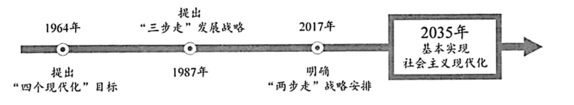

**河南省2025年普通高中学业水平选择性考试思想政治**

**注意事项：**

**1．答卷前，考生务必将自己的姓名、考生号等填写在试卷、答题卡上。**

**2．回答选择题时，选出每小题答案后，用2B铅笔把答题卡上对应题目的答案标号涂黑。如需改动，用橡皮擦干净后，再选涂其他答案标号。回答非选择题时，将答案写在答题卡上。写在本试卷上无效。**

**3．考试结束后，将本试卷和答题卡一并交回。**

**一、选择题：本题共15小题，每小题3分，共45分。在每小题给出的四个选项中，只有一项是符合题目要求的。**

1\. 在一步步跨越中，历史的“预言”不断照进现实：

上述“预言”的实现（ ）

①离不开一代代中华儿女的接续奋斗

②标志着中国特色社会主义进入新时代

③得益于党带领人民找到了适合我国国情的正确道路

④表明人民对未来的美好愿望是实现民族复兴的根本动力

A. ①③ B. ①④ C. ②③ D. ②④

2\. 党的十八届三中全会强调，全面深化改革要以经济体制改革为重点，发挥经济体制改革牵引作用。十余年来，我国社会主义市场经济体制不断完善，发展质量不断提升。党的二十届三中全会将“以经济体制改革为牵引”列入进一步全面深化改革的指导思想，指出“深化经济体制改革仍是进一步全面深化改革的重点”，这是因为（ ）

①高质量发展是全面建设社会主义现代化国家的首要任务

②经济体制改革对其他方面改革具有重要影响和传导作用

③经济体制改革是改革开放以来党的全部理论和实践的主题

④高水平社会主义市场经济体制是中国式现代化的根本保障

A ①② B. ①③ C. ②④ D. ③④

3\. 立足“大腹地、大枢纽、大市场”的条件禀赋，河南省加快融入、主动服务全国统一大市场建设，以“米”字形高铁网、内河航运连通工程建设为牵引，推动空、陆、网、海四条“丝绸之路”协同发展，同时加强与京津冀、长三角、粤港澳大湾区深度对接，承接产业转移，引入更多龙头企业和配套企业。上述举措旨在（ ）

①优化交通网络体系，拉动基础设施投资

②建设现代流通体系，提高要素配置效率

③促进产业合理布局，缩减传统产业规模

④推动供需有效衔接，畅通国民经济循环

A. ①③ B. ①④ C. ②③ D. ②④

4\. 近年来，我国中小企业积极探索以横向组团、纵向共链、资本合作等方式“抱团”出海。2025年1月，工业和信息化部发布《关于开展中小企业出海服务专项行动的通知》，为中小企业出海提供政策入企、管理提升和权益保护等专业化服务保障。中小企业“抱团”出海有利于（ ）

①提高风险防控能力，增强发展韧性

②实现资源信息共享，减缓经济波动

③发挥企业协同效应，实现均等发展

④拓展海外发展空间，提升竞争实力

A. ①② B. ①④ C. ②③ D. ③④

5\. 冰川是地球“固态水库”。随着全球冰川整体加速消融，人类社会面临严重的生态环境危机。2025年1月，联合国正式启动国际冰川保护年，协调联合多个国际组织和国家，在扩大全球冰川监测系统、开发冰川相关灾害早期预警系统、吸引青年参与等重点领域开展行动。由此可见，联合国（ ）

①凝聚国际共识，完善冰川治理制度

②践行多边主义，倡导国际多边合作

③重视民众参与，壮大应对非传统安全威胁力量

④鼓励科研互动，维护冰川分布国国家核心利益

A. ①③ B. ①④ C. ②③ D. ②④

6\. 某地在乡村振兴中打造“党建链”串联“产业链”、共建“致富链”的新模式，划分2043个党群共富责任区，组建41个产业联合党委，构建“党支部+科研院所+龙头企业+合作社+农户”协同发展机制，发展特色农业，带动了农民大幅增收。该模式的优势在于（ ）

①党建赋能，为乡村自治提供方向保证

②民主决策，凝聚乡村发展的强大合力

③以民为本，实现发展成果由村民共享

④解放思想，拓宽乡村产业振兴的路径

A. ①② B. ①③ C. ②④ D. ③④

7\. “煮米茶”是某乡的传统习俗，每当米茶煮起，群众聚得最齐。该乡人大因势利导，组建“流动茶馆”，群众一边喝着热腾腾的米茶，一边发表对地方立法草案的意见建议，人大代表将收集到的信息及时反馈，从而打通立法建议采集的“最后一公里”。组建“流动茶馆”（ ）

①激发了基层群众参与立法的热情

②扩大了基层群众参与立法的权利

③丰富了人大代表联系群众的形式

④加强了人大代表履职能力的建设

A. ①③ B. ①④ C. ②③ D. ②④

8\. 河南省政协将省委交办的“农业强省建设”课题作为一号协商议题，聚焦重要农产品供给、农村现代化建设等关键问题，联合省内外高校和科研院所等单位的人员力量，赴省内65个县（区）深入调研，形成系列调研报告，提出的58条建议被吸纳到相关规划政策中。这表明省政协（ ）

①立足地方发展实际，履行参政议政的职能

②优化成果落实机制，让政治协商更富实效

③丰富协商民主形式，开辟多党合作新路径

④发挥独特优势，推动决策的科学化民主化

A. ①② B. ①④ C. ②③ D. ③④

9\. 2025年，已故作家丁某（1908-1973）的小说被甲公司改编拍摄成微短剧《跨越山海》。该剧市场反响热烈，多家电视台引用剧中精彩画面进行报道。随后，甲公司发现乙公司经营的小程序在免费播放该剧。下列说法正确的是（ ）

①甲公司应在该剧中注明作者丁某的姓名

②甲公司的改编应取得丁某继承人的同意

③参与报道的电视台无需向甲公司支付使用费

④如果该剧未进行登记，则乙公司不构成侵权

A. ①② B. ①③ C. ②④ D. ③④

10\. 李某育有张甲、张乙两个子女。2022年，李某立下自书遗嘱，明确其所有遗产由张甲继承。后李某患病，张乙悉心照料。2024年，李某将其名下房产赠与张乙，并办理了过户登记。后李某病故，留下2万元财产和1万元债务，张甲持遗嘱要求继承房产和其他财产。以下说法正确的是（ ）

①李某赠与房产的行为在性质上属于遗赠

②该房产所有权已经转移，张甲不能继承

③房产赠与发生于自书遗嘱之后，故该遗嘱失效

④如果张甲继承遗产，则还需要承担1万元债务

A. ①② B. ①③ C. ②④ D. ③④

11\. 中国古代素有“筑城以卫君，造郭以守民”的建城思想，但在二里头遗址的前期考古中却未能找到城墙。2024年，在与其隔河相望的古城村，新发现一道夯土墙，专家推测其极可能是人们苦苦寻找60余年的二里头都邑城墙，这为研究夏商时期都城建设提供了重要线索。这一发现表明（ ）

①复杂事物本质的暴露和展现有一个过程

②未经实践检验的认识不能正确指导实践

③人们认知能力的提高是认识发展的重要动因

④实践不断产生新问题推动人们进行新的探索

A. ①② B. ①④ C. ②③ D. ③④

12\. 每至岁末，国家主席习近平的新年贺词如期而至：

<table style="width:85%;">
<colgroup>
<col style="width: 85%" />
</colgroup>
<tbody>
<tr>
<td style="text-align: left;">
我们要继续努力，把人民的期待变成我们的行动，把人民的希望变成生活的现实。我们要继续全面深化改革，开弓没有回头箭，改革关头勇者胜。（2015年）

民之所忧，我必念之；民之所盼，我必行之。……全面小康、摆脱贫困是我们党给人民的交代，也是对世界的贡献。（2022年）

对大家关心的就业增收、“一老一小”、教育医疗等问题，我一直挂念。一年来，基础养老金提高了，房贷利率下调了，直接结算范围扩大方便了异地就医，消费品以旧换新提高了生活品质……大家的获得感又充实了许多。（2025年）
</td>
</tr>
</tbody>
</table>

从中可以读出（ ）

①人民群众是社会存在和发展的基础

②党始终把人民群众的利益作为最高价值标准

③社会意识的变化反映出社会生活的变迁

④反映社会存在的社会意识对社会发展起积极的推动作用

A. ①③ B. ①④ C. ②③ D. ②④

13\. 文物不言，自有春秋。走进抗战纪念场馆，赵一曼写给儿子的绝笔信、赵尚志主笔的《东北红星壁报》、彭雪枫使用过的印章——一件件抗战文物，虽历经岁月洗礼，仍给人以心灵的震撼和启迪。抗战文物的生命力缘于它们（ ）

①凝结着革命文化，成为中华民族共同的精神标识

②承载着伟大的抗战精神，能激发人们的爱国热情

③见证了抗战光辉历史，引领先进文化的前进方向

④铭刻着革命先烈的信念，彰显历久弥新的育人价值

A. ①③ B. ①④ C. ②③ D. ②④

14\. 在古代文献的研究中，对于疑难字词，学者们往往采用“以义求义”的训释（对古书字句做解释）方式，尽可能全面地展现需要解释的字词的相关例子，并反复推敲，从而得出一个字义。此研究过程所运用的推理（ ）

①前提和结论之间具有保真关系

②是或然推理，但能够得出一般性结论

③需对认识对象中的全部情况逐一进行考察

④可在前提中涉及更多对象，以提高其可靠程度

A. ①② B. ①③ C. ②④ D. ③④

15\. “黄风岭，八百里，曾是关外富饶地……”一曲《黄风起兮》通过陕北说书独具魅力呈现，让民族音乐大放异彩。有媒体评论：“民族音乐是民族文化的载体，是体现民族身份认同的艺术。作为民族音乐的原生态音乐，是原汁原味的民间音乐，为艺术创作提供了丰富的灵感。”由以上判断可必然推出（ ）

①原汁原味的民间音乐是民族音乐

②原生态音乐是体现民族身份认同的艺术

③有些原生态音乐不是民族文化的载体

④有些民族文化的载体不是非原生态音乐

A. ①③ B. ①④ C. ②③ D. ②④

**二、非选择题：本题共4小题，共55分。**

16\. 阅读材料，完成下列要求。

科技创新枝繁叶茂，离不开优渥的法治土壤。

某市坚持法治与科技共进，持续优化科技创新生态，形成“300余家科技创新领军者+上万家小微科创企业”的创新格局，大模型、机器人等“硬核”科技成为该市的“金名片”。

该市科技创新生态的优化得益于法治与科技的“双向奔赴”。结合材料，运用《政治与法治》知识对此加以说明。

17\. 阅读材料，完成下列要求。

习近平总书记指出，要“让更多文物和文化遗产活起来”。当前，我国各地积极推进历史文化遗产保护传承，取得了显著成效，形成了鲜活经验。

一城宋韵半城水 梦华飘溢伴汴京

河南·开封

以宋文化闻名于世的开封，着眼古城保护，统筹考虑群众居住、经营、交通环境的综合改善，打造古城墙生态旅游带、水系文化带、历史文化街区风光带，让人们在“一墙风采”中赏千年繁华，在“桨声摇灯影”中品宋风宋韵；打造宋文化IP，将宋绣、宋戏等宋“潮”文化元素融入寻常街巷，建造历史文化主题公园“清明上河园”，描绘出“以古闻名、以新出彩”的新时代“清明上河图”。

古城烟雨锁姑苏 小巷烟火百态生

江苏·苏州

作为吴文化的重要发源地，苏州市姑苏区积极推进老旧街巷改造，采用“一宅一方案”，恢复古色古香的苏式建筑景观，还原苏式古宅“风叩门环、蕉窗听雨”的意境；发布“古城保护更新伙伴计划”，吸引社会力量，活化利用闲置老宅，建成“金融街坊”，发展“院落经济”，让古旧宅屋与现代生活相互融合，打造出一座“活态的古城”。

黛瓦黄墙倚翠壁 木桥清溪绕农家

福建·屏南

拥有大量古韵绵长老村落的屏南县，为解决人员外流、老屋荒废的“空心化”问题，全面推行“老屋认租”模式，引入“新村民”，打造新型文化艺术空间，将曾经的“破木屋”变成一个个文化“黄金屋”；举办戏曲节、开酒节等特色民俗文化活动，推动“文创+品牌农业”融合发展，吸引了越来越多的人前来追寻“诗与远方”。

结合材料，运用《哲学与文化》知识，分析在历史文化遗产保护传承中如何从实际出发、实事求是。

18\. 阅读材料，完成下列要求。

党的二十届三中全会提出，“支持和规范发展新就业形态”“完善劳动关系协商协调机制，加强劳动者权益保障”。

快递员、外卖送餐员、网络主播……我国新就业形态劳动者已达8400万人，占职工总数的21%。他们用辛勤付出为人们的生活带来诸多便利，但同时，也面临着工作不稳定、劳动强度高、权益维护难、安全保障不足等困境。

篇章一：困局

小雨入职一家服装公司，从事直播带货工作。双方签订了为期两年的劳动合同，约定小雨在合同期间不能结婚，否则公司可解除合同。小雨入职后，公司经常擅自安排其加班至深夜，日平均工作10小时以上。一年后，小雨结婚，为了保住工作，未告知公司。后来公司发现小雨结婚，认为其构成违约，将其辞退。小雨认为结婚并不影响工作，希望公司继续留用自己，双方协商未果。

（1）运用《法律与生活》知识，分析公司行为的不当之处并为小雨指明两条依法维权的途径。

篇章二：破局

保障新就业形态劳动者权益，企业在行动。某平台企业率先为外卖骑手缴纳五险一金，为员工建设公寓及配套设施、提供购房无息贷款，还有一轮轮的涨薪……一系列提高员工工资福利待遇的举措赢来阵阵叫好，不少企业纷纷跟进。但也有人认为，“这样做会加重企业负担，不利于行业的长远发展”。

（2）结合材料，运用《经济与社会》知识对这一观点进行评析

19\. 阅读材料，完成下列要求。

篇章一：可亲的中国与世界对话

我国幅员辽阔、边界线长，与周边国家山水相连、命运与共。党的十八大以来，我国秉持亲诚惠容周边外交理念，与周边国家致力于发展政治互信、妥控敏感议题、维护多边贸易体制，同周边关系步入近代以来最好的时期。

2025年4月召开的中央周边工作会议以全球视野审视周边，对亲诚惠容理念进行全领域丰富和全方位发展，强调要聚焦构建周边命运共同体，以建设和平、安宁、繁荣、美丽、友好“五大家园”为共同愿景，以高质量共建“一带一路”为主要平台，与周边国家巩固战略互信、深化发展融合、共同维护地区稳定、扩大交往交流。在百年变局加速演变、国际形势重大调整、部分地区陷入冲突的大背景下，我国以真诚愿望和大国担当携手周边国家共创美好未来，为动荡不安的世界注入正能量。

（1）结合材料，运用《当代国际政治与经济》知识，阐明新形势下我国周边工作聚焦构建周边命运共同体的原因。

篇章二：行进的中国与未来对话

中国式现代化有目标、有规划、有战略，一定会实现。

在推进中国式现代化的征程上，我们取得了一系列成就。“蛟龙”入海、“天眼”巡空，创新能力综合排名跻身世界前十，科技实力节节攀升；病有所医、老有所养，基本医疗保险覆盖超过13亿人，民生福祉持续改善；荒漠缩减、低碳转型，世界最大清洁发电体系建成，万里河山更加多姿多彩……

（2）请从经济、政治、文化、社会、生态等领域任选其一，运用超前思维的方法描绘10年后我国在该领域取得的一项具体成就，并说明你是如何作出这一构想的。
