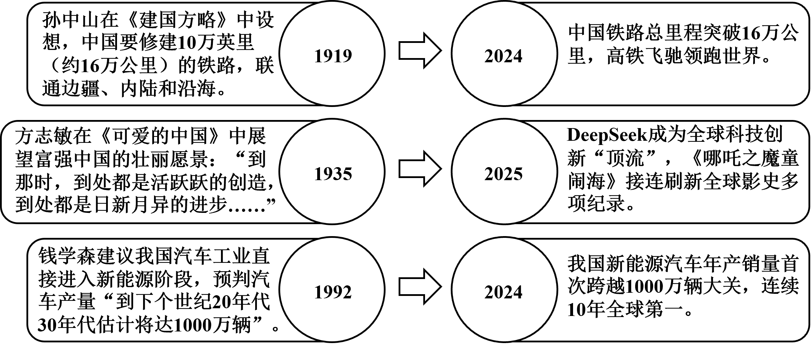
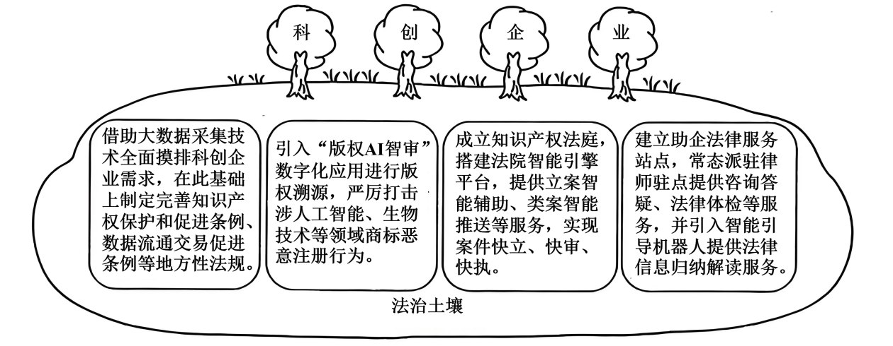

**河南省2025年普通高中学业水平选择性考试思想政治**

**注意事项：**

**1．答卷前，考生务必将自己的姓名、考生号等填写在试卷、答题卡上。**

**2．回答选择题时，选出每小题答案后，用2B铅笔把答题卡上对应题目的答案标号涂黑。如需改动，用橡皮擦干净后，再选涂其他答案标号。回答非选择题时，将答案写在答题卡上。写在本试卷上无效。**

**3．考试结束后，将本试卷和答题卡一并交回。**

**一、选择题：本题共15小题，每小题3分，共45分。在每小题给出的四个选项中，只有一项是符合题目要求的。**

1\. 在一步步跨越中，历史的“预言”不断照进现实：

上述“预言”的实现（ ）

①离不开一代代中华儿女的接续奋斗

②标志着中国特色社会主义进入新时代

③得益于党带领人民找到了适合我国国情的正确道路

④表明人民对未来的美好愿望是实现民族复兴的根本动力

A. ①③ B. ①④ C. ②③ D. ②④

【答案】A

【解析】

【详解】①：历史“预言”的实现，是一代又一代中华儿女接续奋斗的成果，符合实际，①正确。

②：党的十八大以来，中国特色社会主义进入了新时代，不是“预言”的实现标志的，②错误。

③：党带领人民找到了适合我国国情的中国特色社会主义道路，这是取得成就的重要原因，③正确。

④：全面深化改革是推进中国式现代化的根本动力，或者说社会基本矛盾运动是实现民族复兴的根本动力，而非人民对未来的美好愿望，④错误。

故本题选A。

2\. 党的十八届三中全会强调，全面深化改革要以经济体制改革为重点，发挥经济体制改革牵引作用。十余年来，我国社会主义市场经济体制不断完善，发展质量不断提升。党的二十届三中全会将“以经济体制改革为牵引”列入进一步全面深化改革的指导思想，指出“深化经济体制改革仍是进一步全面深化改革的重点”，这是因为（ ）

①高质量发展是全面建设社会主义现代化国家的首要任务

②经济体制改革对其他方面改革具有重要影响和传导作用

③经济体制改革是改革开放以来党的全部理论和实践的主题

④高水平社会主义市场经济体制是中国式现代化的根本保障

A. ①② B. ①③ C. ②④ D. ③④

【答案】A

【解析】

【详解】①：“深化经济体制改革仍是进一步全面深化改革的重点”，这是因为高质量发展是全面建设社会主义现代化国家的首要任务，深化经济体制改革有助于推动高质量发展，①符合题意。

②：党的十八届三中全会强调“发挥经济体制改革牵引作用”，说明经济体制改革对其他方面改革具有重要影响和传导作用，因此深化经济体制改革仍是进一步全面深化改革的重点，②符合题意。

③：中国特色社会主义是改革开放以来党的全部理论和实践的主题，③说法错误。

④：高水平社会主义市场经济体制是中国式现代化的重要保障，但并非“根本保障”。中国式现代化的根本保障是坚持党的领导，④说法错误。

故本题选A。

3\. 立足“大腹地、大枢纽、大市场”的条件禀赋，河南省加快融入、主动服务全国统一大市场建设，以“米”字形高铁网、内河航运连通工程建设为牵引，推动空、陆、网、海四条“丝绸之路”协同发展，同时加强与京津冀、长三角、粤港澳大湾区深度对接，承接产业转移，引入更多龙头企业和配套企业。上述举措旨在（ ）

①优化交通网络体系，拉动基础设施投资

②建设现代流通体系，提高要素配置效率

③促进产业合理布局，缩减传统产业规模

④推动供需有效衔接，畅通国民经济循环

A. ①③ B. ①④ C. ②③ D. ②④

【答案】D

【解析】

【详解】①：优化交通网络体系是手段，题干举措核心是服务全国统一大市场，而非拉动基础设施投资，①不符合题意。

②：以“米”字形高铁网、内河航运连通工程建设为牵引，推动空、陆、网、海四条“丝绸之路”协同发展，同时加强与京津冀、长三角、粤港澳大湾区深度对接，这直接体现现代流通体系建设，促进要素自由流动和高效配置，②符合题意。

③：题干提到“承接产业转移，引入龙头企业和配套企业”，这有助于产业合理布局，但“缩减传统产业规模”无依据，③不符合题意。

④：融入全国统一大市场、对接产业转移等，能推动供需有效衔接，畅通国民经济循环，④符合题意。

故本题选D。

4\. 近年来，我国中小企业积极探索以横向组团、纵向共链、资本合作等方式“抱团”出海。2025年1月，工业和信息化部发布《关于开展中小企业出海服务专项行动的通知》，为中小企业出海提供政策入企、管理提升和权益保护等专业化服务保障。中小企业“抱团”出海有利于（ ）

①提高风险防控能力，增强发展韧性

②实现资源信息共享，减缓经济波动

③发挥企业协同效应，实现均等发展

④拓展海外发展空间，提升竞争实力

A. ①② B. ①④ C. ②③ D. ③④

【答案】B

【解析】

【详解】①：中小企业“抱团”出海，多个企业联合起来，在面对海外市场的各种风险时，凭借集体的力量和资源，能够更好地进行风险防控。例如，在应对汇率波动、贸易壁垒等风险时，企业间可以共享应对经验、共同寻求解决方案，从而增强自身发展的韧性，降低因风险带来的不利影响，①正确。

②：中小企业“抱团”出海，企业之间可以实现资源信息共享，在一定程度上减缓经济波动对单个企业的冲击，但不能减缓经济波动本身，②错误。

③：中小企业“抱团”出海能发挥企业协同效应，促进企业共同发展。但是“均等发展”说法过于绝对，不同企业由于自身规模、技术水平、管理能力等存在差异，即使“抱团”出海，发展也不可能完全均等，③错误。

④：“抱团”出海为中小企业提供了更广阔的平台和机会，使它们能够拓展海外发展空间。企业联合起来，可以整合资源，在海外市场上以更强大的姿态参与竞争，提升自身的竞争实力。比如联合进行品牌推广、共同开拓新市场等，④正确。

故本题选B。

5\. 冰川是地球的“固态水库”。随着全球冰川整体加速消融，人类社会面临严重的生态环境危机。2025年1月，联合国正式启动国际冰川保护年，协调联合多个国际组织和国家，在扩大全球冰川监测系统、开发冰川相关灾害早期预警系统、吸引青年参与等重点领域开展行动。由此可见，联合国（ ）

①凝聚国际共识，完善冰川治理制度

②践行多边主义，倡导国际多边合作

③重视民众参与，壮大应对非传统安全威胁力量

④鼓励科研互动，维护冰川分布国国家核心利益

A. ①③ B. ①④ C. ②③ D. ②④

【答案】C

【解析】

【详解】①：联合国启动国际冰川保护年有助于凝聚共识，但题干未直接体现“完善冰川治理制度”，①排除。

②：题干明确提到“协调联合多个国际组织和国家”，这直接体现了联合国践行多边主义、倡导国际合作，②符合题意。

③：题干强调“吸引青年参与”，属于重视民众参与；冰川消融导致的生态环境危机属于非传统安全威胁，③符合题意。

④：联合国行动是全球性的，旨在促进共同利益，而非专门维护特定国家的核心利益，④排除。

故本题选C。

6\. 某地在乡村振兴中打造“党建链”串联“产业链”、共建“致富链”的新模式，划分2043个党群共富责任区，组建41个产业联合党委，构建“党支部+科研院所+龙头企业+合作社+农户”协同发展机制，发展特色农业，带动了农民大幅增收。该模式的优势在于（ ）

①党建赋能，为乡村自治提供方向保证

②民主决策，凝聚乡村发展的强大合力

③以民为本，实现发展成果由村民共享

④解放思想，拓宽乡村产业振兴的路径

A. ①② B. ①③ C. ②④ D. ③④

【答案】D

【解析】

【详解】①：材料强调的是通过党建引领产业发展带动农民增收，重点在于产业发展与增收，而非乡村自治，①不符合题意。

②：材料主要强调是党建引领下的产业发展模式，而材料并未体现民主决策相关内容，②不符合题意。

③：某地在乡村振兴中打造“党建链”串联“产业链”、共建“致富链”的新模式，该模式发展特色农业带动农民大幅增收，体现了以人民为中心，实现发展成果由村民共享，③正确。

④：某地在乡村振兴中打造“党建链”串联“产业链”、共建“致富链”的新模式，构建“党支部＋科研院所＋龙头企业＋合作社＋农户”协同发展机制，体现了解放思想，拓宽了乡村产业振兴的路径，④正确。

故本题选D

7\. “煮米茶”是某乡的传统习俗，每当米茶煮起，群众聚得最齐。该乡人大因势利导，组建“流动茶馆”，群众一边喝着热腾腾的米茶，一边发表对地方立法草案的意见建议，人大代表将收集到的信息及时反馈，从而打通立法建议采集的“最后一公里”。组建“流动茶馆”（ ）

①激发了基层群众参与立法热情

②扩大了基层群众参与立法的权利

③丰富了人大代表联系群众的形式

④加强了人大代表履职能力的建设

A. ①③ B. ①④ C. ②③ D. ②④

【答案】A

【解析】

【详解】①：组建“流动茶馆”，群众一边喝米茶一边发表对地方立法草案的意见建议，这有助于激发了基层群众参与立法的热情，①正确。

②：公民的权利是由宪法和法律规定的，不能随意扩大，所以“扩大了基层群众参与立法的权利”说法错误，②错误。

③：人大代表通过“流动茶馆”这种新形式联系群众，丰富了人大代表联系群众的形式，③正确。

④：材料主要强调的是人大代表联系群众、群众参与立法，没有涉及人大代表履职能力建设，人大代表履职能力建设通常涉及培训、学习等提升代表专业素养和工作能力等方面，④不符合题意。

故本题选A。

8\. 河南省政协将省委交办的“农业强省建设”课题作为一号协商议题，聚焦重要农产品供给、农村现代化建设等关键问题，联合省内外高校和科研院所等单位的人员力量，赴省内65个县（区）深入调研，形成系列调研报告，提出的58条建议被吸纳到相关规划政策中。这表明省政协（ ）

①立足地方发展实际，履行参政议政的职能

②优化成果落实机制，让政治协商更富实效

③丰富协商民主形式，开辟多党合作新路径

④发挥独特优势，推动决策的科学化民主化

A. ①② B. ①④ C. ②③ D. ③④

【答案】B

【解析】

【详解】①：省政协立足河南农业发展实际，通过调研提出建议，这是履行参政议政职能的体现，①正确。

②：题干主要体现的是调研和提出建议被采纳的过程，未提及“优化成果落实机制”，该机制更多涉及建议提出后的执行保障，②不选。

③：题干中省政协联合高校、科研院所等，并非“多党合作”范畴，多党合作的主体是各民主党派与共产党，此处主体不符，而且材料中做法并没有开辟多党合作新路径，③不选。

④：省政协发挥联系广泛、智力密集的优势，提出的58条建议被吸纳到相关规划政策中，这推动了决策的科学化民主化，④正确。

故本题选B。

9\. 2025年，已故作家丁某（1908-1973）的小说被甲公司改编拍摄成微短剧《跨越山海》。该剧市场反响热烈，多家电视台引用剧中精彩画面进行报道。随后，甲公司发现乙公司经营的小程序在免费播放该剧。下列说法正确的是（ ）

①甲公司应在该剧中注明作者丁某的姓名

②甲公司的改编应取得丁某继承人的同意

③参与报道的电视台无需向甲公司支付使用费

④如果该剧未进行登记，则乙公司不构成侵权

A. ①② B. ①③ C. ②④ D. ③④

【答案】B

【解析】

【详解】①：根据著作权相关法律规定，使用他人作品应当指明作者姓名或者名称、作品名称。甲公司将丁某的小说改编拍摄成微短剧，丁某作为原作品的作者，其著作权中的署名权等受到法律保护。所以甲公司应在该剧中注明作者丁某的姓名，①正确。

②：著作权属于自然人，保护期是作者有生之年加去世后50年。著作权保护期届满，该作品就进入公共领域，任何人都可以免费使用。著改编权属于著作权的财产权，但是作家已于1973年去世，2025年将其改编，已经超过保护期限，不需要经过丁某继承人的同意，②错误。

③：为报道新闻，在报纸、期刊、广播电台、电视台等媒体中不可避免地再现或者引用已经发表的作品属于合理使用，因此参与报道的电视台无需向甲公司支付使用费，③正确。

④：小说被甲公司改编拍摄成微短剧《跨越山海》，甲公司发现乙公司经营的小程序在免费播放该剧。说明该剧是甲公司享有相关权利的作品，乙公司未经甲公司许可免费播放，侵犯了甲公司对该微短剧享有的信息网络传播权等权利，④错误。

故本题选B。

10\. 李某育有张甲、张乙两个子女。2022年，李某立下自书遗嘱，明确其所有遗产由张甲继承。后李某患病，张乙悉心照料。2024年，李某将其名下房产赠与张乙，并办理了过户登记。后李某病故，留下2万元财产和1万元债务，张甲持遗嘱要求继承房产和其他财产。以下说法正确的是（ ）

①李某赠与房产的行为在性质上属于遗赠

②该房产所有权已经转移，张甲不能继承

③房产赠与发生于自书遗嘱之后，故该遗嘱失效

④如果张甲继承遗产，则还需要承担1万元债务

A. ①② B. ①③ C. ②④ D. ③④

【答案】C

【解析】

【详解】①：遗赠是指自然人可以立遗嘱将个人财产赠与国家、集体或者法定继承人以外的组织、个人。张乙属于法定继承人，李某在2024年直接将房产赠与张乙并办理过户登记，这是生前的赠与行为，不是遗赠，①不符合题意。

②：不动产所有权自登记时转移。李某在2024年将房产赠与张乙并办理过户登记，因此，房产在李某去世前已经属于张乙，不属于李某的遗产，张甲不能继承，②符合题意。

③：遗嘱人可以撤回、变更遗嘱，但部分财产处置不自动使遗嘱完全失效。本案中自书遗嘱中涉及已赠与房产的部分失效，遗嘱对其他遗产（如2万元财产）仍可能有效，③不符合题意。

④：继承人以所得遗产实际价值为限清偿被继承人债务。李某留下2万元财产和1万元债务，若张甲继承遗产，需先用遗产清偿债务（1万元），剩余部分（1万元）可继承，④符合题意。

故本题选C。

11\. 中国古代素有“筑城以卫君，造郭以守民”的建城思想，但在二里头遗址的前期考古中却未能找到城墙。2024年，在与其隔河相望的古城村，新发现一道夯土墙，专家推测其极可能是人们苦苦寻找60余年的二里头都邑城墙，这为研究夏商时期都城建设提供了重要线索。这一发现表明（ ）

①复杂事物本质的暴露和展现有一个过程

②未经实践检验的认识不能正确指导实践

③人们认知能力的提高是认识发展的重要动因

④实践不断产生新问题推动人们进行新的探索

A. ①② B. ①④ C. ②③ D. ③④

【答案】B

【解析】

【详解】①：在二里头遗址前期考古未找到城墙，而后来在隔河相望的古城村发现可能是二里头都邑城墙的夯土墙。这是因为二里头都邑城墙作为复杂事物，其本质的暴露和展现不是一蹴而就的，需要经历一定的时间和考古探索过程，前期没发现，后期才发现，体现了复杂事物本质的暴露和展现有一个过程，①正确。

②：题干主要强调的是对二里头都邑城墙认识的发展过程，并没有涉及未经实践检验的认识能否正确指导实践的相关内容，题干重点在于认识的发现和推进，并非讨论认识指导实践与实践检验认识的关系，②不符合题意。

③：实践是认识发展的动力，实践中不断产生新问题、提出新要求，推动人们去进行新的探索和研究，从而推动认识的发展。而不是人们认知能力的提高是认识发展的重要动因，③错误。

④：前期考古未发现二里头都邑城墙，这是实践中存在的问题，基于这个问题，考古工作持续进行，在2024年有了新发现，这表明实践不断产生新问题推动人们进行新的探索，④正确。

故本题选B。

12\. 每至岁末，国家主席习近平的新年贺词如期而至：

<table style="width:85%;">
<colgroup>
<col style="width: 85%" />
</colgroup>
<tbody>
<tr>
<td style="text-align: left;">
我们要继续努力，把人民的期待变成我们的行动，把人民的希望变成生活的现实。我们要继续全面深化改革，开弓没有回头箭，改革关头勇者胜。（2015年）

民之所忧，我必念之；民之所盼，我必行之。……全面小康、摆脱贫困是我们党给人民的交代，也是对世界的贡献。（2022年）

对大家关心的就业增收、“一老一小”、教育医疗等问题，我一直挂念。一年来，基础养老金提高了，房贷利率下调了，直接结算范围扩大方便了异地就医，消费品以旧换新提高了生活品质……大家的获得感又充实了许多。（2025年）
</td>
</tr>
</tbody>
</table>

从中可以读出（ ）

①人民群众是社会存在和发展的基础

②党始终把人民群众的利益作为最高价值标准

③社会意识的变化反映出社会生活的变迁

④反映社会存在的社会意识对社会发展起积极的推动作用

A. ①③ B. ①④ C. ②③ D. ②④

【答案】C

【解析】

【详解】①：人民群众的生产活动是社会存在和发展的基础，而非人民群众，①说法错误。

②：贺词中“把人民的期待变成行动”“民之所忧，我必念之”“对就业、医疗等问题我一直挂念”等，均体现党始终以人民群众利益为最高价值标准，②符合题意。

③：2015年聚焦“全面深化改革”； 2022年强调“全面小康、摆脱贫困”； 2025年细化到“就业、养老、医疗”等具体民生问题，这反映了社会生活的变迁，说明了社会存在决定社会意识，社会意识的变化随着社会生活的变迁而变化，③符合题意。

④：社会意识有正确和错误之分，先进的社会意识推动社会发展，落后的社会意识阻碍发展。反映社会存在的意识不一定是正确的社会意识，应该说正确反映社会存在的社会意识对社会发展起积极的推动作用，④说法错误。

故本题选C。

13\. 文物不言，自有春秋。走进抗战纪念场馆，赵一曼写给儿子的绝笔信、赵尚志主笔的《东北红星壁报》、彭雪枫使用过的印章——一件件抗战文物，虽历经岁月洗礼，仍给人以心灵的震撼和启迪。抗战文物的生命力缘于它们（ ）

①凝结着革命文化，成为中华民族共同的精神标识

②承载着伟大的抗战精神，能激发人们的爱国热情

③见证了抗战的光辉历史，引领先进文化的前进方向

④铭刻着革命先烈的信念，彰显历久弥新的育人价值

A. ①③ B. ①④ C. ②③ D. ②④

【答案】D

【解析】

【详解】①：中华文化是中华民族共同的精神标识，革命文化是中国革命的精神标识，①错误。

②：抗战文物作为抗战历史的物质载体，承载着伟大的抗战精神。抗战精神是爱国主义的重要体现，当人们看到这些文物时，能被其所承载的精神感染，激发内心的爱国热情，②正确。

③：中国共产党引领先进文化的前进方向，而不是抗战文物引领先进文化的前进方向。抗战文物只是见证了抗战这一光辉历史，在文化传承等方面有重要作用，但不具备引领先进文化前进方向的功能，③错误。

④：抗战文物上铭刻着革命先烈在抗战时期的坚定信念，像赵尚志主笔的《东北红星壁报》等，它们历经岁月，至今仍能以其蕴含的精神对人们起到教育作用，彰显着历久弥新的育人价值，激励着一代又一代的人，④正确。

故本题选D。

14\. 在古代文献的研究中，对于疑难字词，学者们往往采用“以义求义”的训释（对古书字句做解释）方式，尽可能全面地展现需要解释的字词的相关例子，并反复推敲，从而得出一个字义。此研究过程所运用的推理（ ）

①前提和结论之间具有保真关系

②是或然推理，但能够得出一般性结论

③需对认识对象中的全部情况逐一进行考察

④可在前提中涉及更多对象，以提高其可靠程度

A. ①② B. ①③ C. ②④ D. ③④

【答案】C

【解析】

【详解】题干中说学者通过“以义求义”，全面展现字词相关例子并反复推敲得出字义，这属于归纳推理中的不完全归纳推理。

①：前提和结论之间具有保真关系的是演绎推理，而这里的不完全归纳推理是或然推理，不具有保真关系，①错误。

②：不完全归纳推理确实或然推理，它是通过部分对象得出一般性结论，这里学者通过部分例子得出字义，属于或然推理且能得出一般性结论，②正确。

③：需对认识对象全部情况逐一考察的是完全归纳推理，而这里显然不是，③不选。

④：不完全归纳推理为提高可靠程度，可在前提中涉及更多对象，题干中学者尽可能全面展现例子，就是在增加前提中的对象数量，以提高可靠程度，④正确。

故本题选C。

15\. “黄风岭，八百里，曾是关外富饶地……”一曲《黄风起兮》通过陕北说书独具魅力的呈现，让民族音乐大放异彩。有媒体评论：“民族音乐是民族文化的载体，是体现民族身份认同的艺术。作为民族音乐的原生态音乐，是原汁原味的民间音乐，为艺术创作提供了丰富的灵感。”由以上判断可必然推出（ ）

①原汁原味的民间音乐是民族音乐

②原生态音乐是体现民族身份认同的艺术

③有些原生态音乐不是民族文化的载体

④有些民族文化的载体不是非原生态音乐

A. ①③ B. ①④ C. ②③ D. ②④

【答案】D

【解析】

【详解】①：原生态音乐是民族音乐的一部分，民间音乐可能包括非原生态的部分，这些部分不一定是民族音乐，①排除。

②：题干中“民族音乐是体现民族身份认同的艺术”，而“原生态音乐是民族音乐的一部分”，根据逻辑推理，“所有民族音乐都是体现民族身份认同的艺术”，因此“原生态音乐作为民族音乐的子集”，必然属于“体现民族身份认同的艺术”，②正确。

③：已知民族音乐是民族文化的载体，原生态音乐属于民族音乐，所以所有原生态音乐都应该是民族文化的载体，③排除。

④：“非原生态音乐”的矛盾概念是“原生态音乐”，该命题可转换为“有些民族文化的载体是原生态音乐”。 由于“原生态音乐是民族音乐，民族音乐是民族文化的载体”，可推出“原生态音乐是民族文化的载体”，即“所有原生态音乐都是民族文化的载体”，根据逻辑中的“换位推理”，“所有A是B”可推出“有些B是A”，因此“有些民族文化的载体是原生态音乐”成立，④正确。

故本题选D。

**二、非选择题：本题共4小题，共55分。**

16\. 阅读材料，完成下列要求。

科技创新枝繁叶茂，离不开优渥的法治土壤。

某市坚持法治与科技共进，持续优化科技创新生态，形成“300余家科技创新领军者+上万家小微科创企业”的创新格局，大模型、机器人等“硬核”科技成为该市的“金名片”。

该市科技创新生态的优化得益于法治与科技的“双向奔赴”。结合材料，运用《政治与法治》知识对此加以说明。

【答案】①坚持科学立法，不断完善法治体系。从本地实际出发，根据企业的需要制定相应的条例，不断完善法律体系，坚持有法可依，促进治理体系和治理能力现代化。

②坚持严格执法，通过AI智审，让执法部门高效的保护企业的合法利益，打击侵权行为，营造良好的法治环境。

③坚持科技赋能，提高公正司法的效率和水平。通过科技赋能，促进审判效率的提升，实现司法公正与便民。

③建设法治社会，推动全民守法。借助智能机器人积极性性法律宣传，提高群众的法治意识，提高法律援助等，促进法治的普及。

【解析】

【分析】背景素材：科技创新生态不断优化

考点考查：科学立法、公正司法、法治社会、全民守法

能力考查：描述和阐述事物，论证和探究问题

核心素养：政治认同、科学精神

【详解】第一步：审设问。明确主体、知识范围、问题限定和作答角度。

本题需要调用科学立法、公正司法、法治社会、全民守法的有关知识，分析该市科技创新生态的优化得益于法治与科技的“双向奔赴”。

第二步：审材料。提取关键词，链接教材知识。

关键词①：借助大数据派集技术全面摸排科创企业需求，在此基础上制定完善知识产权保护和促进条例、数据流通交易促进条例等地方性法规→可联系科学立法的知识，说明通过大数据了解企业的需求，不断完善法治体系，营造良好的法治环境，促进科技的发展创新；

关键词②：引入“版权AI智审”数字化应用进行版权潮源，严厉打击涉人工智能、生物技术等领域商标恶意注册行为→可联系严格执法的知识，说明通过AI赋能，更好的打击侵权行为，维护惬意的合法利益。

关键词③：成立知识产权法庭，搭建法院智能引擎平台，提供立案智能辅助、类案智能推送等服务，实现案件快立快审、快执→可联系公正司法的知识，说明通过科技赋能，打击侵权行为，维护企业利益，同时，提高司法的效率和便民性；

关键词④：建立助企法律服务站点，常态派驻律师驻点提供咨询答疑、法律体检等服务，并引入智能引导机器人提供法律信息归纳解读服务→可联系法治社会和全民守法的知识，说明通过智能机器人促进法律宣传，提高全社会的法治意识；

第三步：整合信息，组织答案。注意设问限定以及教材知识与材料、时政信息等相结合。

17\. 阅读材料，完成下列要求。

习近平总书记指出，要“让更多文物和文化遗产活起来”。当前，我国各地积极推进历史文化遗产保护传承，取得了显著成效，形成了鲜活经验。

一城宋韵半城水 梦华飘溢伴汴京

河南·开封

以宋文化闻名于世的开封，着眼古城保护，统筹考虑群众居住、经营、交通环境的综合改善，打造古城墙生态旅游带、水系文化带、历史文化街区风光带，让人们在“一墙风采”中赏千年繁华，在“桨声摇灯影”中品宋风宋韵；打造宋文化IP，将宋绣、宋戏等宋“潮”文化元素融入寻常街巷，建造历史文化主题公园“清明上河园”，描绘出“以古闻名、以新出彩”的新时代“清明上河图”。

古城烟雨锁姑苏 小巷烟火百态生

江苏·苏州

作为吴文化的重要发源地，苏州市姑苏区积极推进老旧街巷改造，采用“一宅一方案”，恢复古色古香的苏式建筑景观，还原苏式古宅“风叩门环、蕉窗听雨”的意境；发布“古城保护更新伙伴计划”，吸引社会力量，活化利用闲置老宅，建成“金融街坊”，发展“院落经济”，让古旧宅屋与现代生活相互融合，打造出一座“活态的古城”。

黛瓦黄墙倚翠壁 木桥清溪绕农家

福建·屏南

拥有大量古韵绵长老村落的屏南县，为解决人员外流、老屋荒废的“空心化”问题，全面推行“老屋认租”模式，引入“新村民”，打造新型文化艺术空间，将曾经的“破木屋”变成一个个文化“黄金屋”；举办戏曲节、开酒节等特色民俗文化活动，推动“文创+品牌农业”融合发展，吸引了越来越多的人前来追寻“诗与远方”。

结合材料，运用《哲学与文化》知识，分析在历史文化遗产保护传承中如何从实际出发、实事求是。

【答案】①做事情要尊重物质运动的客观规律，从客观存在的事物出发，把事物本身固有的规律作为我们行动的依据。各地在保护传承中充分尊重了不同地区历史文化遗产自身的特点和发展规律。②充分发挥主观能动性，不断解放思想，与时俱进，用科学理论武装头脑，指导实践。各地充分发挥主观能动性，积极探索历史文化遗产保护传承新方式、新途径。 ③把发挥主观能动性和尊重客观规律结合起来。开封、苏州、屏南等地在尊重自身历史文化遗产客观规律的基础上，充分发挥主观能动性，采取一系列既符合当地实际又富有创新性的举措，实现了历史文化遗产的有效保护传承，做到了把发挥主观能动性和尊重客观规律有机结合起来 。

【解析】

【分析】背景素材：各地积极推进历史文化遗产保护传承

考点考查：坚持一切从实际出发、实事求是

能力考查：描述和阐释事物、论证和探究问题

核心素养：政治认同、科学精神

【详解】第一步：审设问。明确主体、作答范围、问题限定和作答角度。本题为措施类主观题，要求运用坚持一切从实际出发，实事求是的知识，分析从各地在历史文化遗产保护中如何做到从实际出发、实事求是的。

第二步：审材料，通过标点符号、段落等，提取材料有效信息。

有效信息①：开封以宋文化闻名，就着眼古城保护，打造与宋文化相关的旅游带、文化 IP 等；苏州作为吴文化重要发源地，推进老旧街巷改造时采用 “一宅一方案”，还原苏式古宅意境；屏南县拥有大量古韵绵长老村落，针对人员外流、老屋荒废问题，推行 “老屋认租” 模式等；→可从尊重客观规律的角度说明各地在保护传承中充分尊重了不同地区历史文化遗产自身的特点和发展规律。

有效信息②：开封打造宋文化 IP，将宋绣、宋戏等文化元素融入街巷，建造主题公园；苏州发布 “古城保护更新伙伴计划”，吸引社会力量活化利用闲置老宅；屏南县举办戏曲节、开酒节等特色民俗文化活动，推动 “文创 + 品牌农业” 融合发展等→可从发挥主观能动性角度说明各地充分发挥主观能动性，积极探索历史文化遗产保护传承新方式、新途径。

有效信息③：开封、苏州、屏南等地的文化遗产保护做法→可从主观能动性和尊重客观规律相结合角度说明开封、苏州、屏南等地在尊重自身历史文化遗产客观规律的基础上，充分发挥主观能动性，实现了历史文化遗产的有效保护传承。

第三步：整合信息，组织答案。注意设问限定以及教材知识与材料、时政信息等相结合。

18\. 阅读材料，完成下列要求。

党的二十届三中全会提出，“支持和规范发展新就业形态”“完善劳动关系协商协调机制，加强劳动者权益保障”。

快递员、外卖送餐员、网络主播……我国新就业形态劳动者已达8400万人，占职工总数的21%。他们用辛勤付出为人们的生活带来诸多便利，但同时，也面临着工作不稳定、劳动强度高、权益维护难、安全保障不足等困境。

篇章一：困局

小雨入职一家服装公司，从事直播带货工作。双方签订了为期两年的劳动合同，约定小雨在合同期间不能结婚，否则公司可解除合同。小雨入职后，公司经常擅自安排其加班至深夜，日平均工作10小时以上。一年后，小雨结婚，为了保住工作，未告知公司。后来公司发现小雨结婚，认为其构成违约，将其辞退。小雨认为结婚并不影响工作，希望公司继续留用自己，双方协商未果。

（1）运用《法律与生活》知识，分析公司行为的不当之处并为小雨指明两条依法维权的途径。

篇章二：破局

保障新就业形态劳动者权益，企业在行动。某平台企业率先为外卖骑手缴纳五险一金，为员工建设公寓及配套设施、提供购房无息贷款，还有一轮轮的涨薪……一系列提高员工工资福利待遇的举措赢来阵阵叫好，不少企业纷纷跟进。但也有人认为，“这样做会加重企业负担，不利于行业的长远发展”。

（2）结合材料，运用《经济与社会》知识对这一观点进行评析。

【答案】（1）①合同中的对于限制结婚的条款，不符合法律规定，属于无效条款。

②公司侵犯了小雨的休息休假权，根据法律规定，职工每日工作八小时，每周工作四十小时。公司未经协商一致，经常让小雨加班日均工作10小时。

③公司不能以小雨结婚为由辞退小雨，应该支付相应的赔偿。

维权途径：

①可以寻找第三方进行调解。

②可以先仲裁，如果不满意，可以提起诉讼。

（2）①平台不断提高员工的工资福利待遇，在一定程度上会增加企业的负担，短期来看，会给企业的经营带来一定的影响，该观点具有合理之处。

②劳动者是企业的核心竞争力之一，提高员工福利待遇有利于提高劳动者的劳动积极性，进而会促进创新、提高产品质量等，从长远来看，对于对于提高企业的竞争力有深远意义。

③企业的做法会倒逼企业进行提高经营管理水平，提高科技投入，进而提高生产效率，突进产品结构的优化升级。

④企业的做法会提高劳动者的收入，收入是消费的前提和基础，进而提高社会的总体消费能力，为企业的生产提供动力，从长远来看，会促进经济社会发展。

【解析】

【分析】背景素材：劳动纠纷与企业发展

考点考查：劳动者的权利、劳动合同、经济高质量发展

能力考查：描述和阐述事物，论证和探究问题

核心素养：政治认同、科学精神

【小问1详解】

第一步：审设问。明确主体、知识范围、问题限定和作答角度。

本题需要调用法律与生活的有关知识，分析公司行为的不当之处并为小雨指明两条依法维权的途径。

第二步：审材料。提取关键词，链接教材知识。

关键词①：双方签订了为期两年的劳动合同，约定小雨在合同期间不能结婚，否则公司可解除合同→可联系劳动合同的知识，说明劳动合同的内容不能与法律相违背，该条款无效。

关键词②：小雨入职后，公司经常擅自安排其加班至深夜，日平均工作10小时以上→可联系劳动者的权利，说明劳动者有休息休假的权利，公司的做法侵犯了劳动者的相应权利。

关键词③：后来公司发现小雨结婚，认为其构成违约，将其辞退→可联系解除劳动合同的知识，说明公司的做法不符合解除劳动合同的情形，应该做出赔偿；

关键词④：为小雨提供维权途径→可联系劳动纠纷解决的知识，说明可以通过调解、仲裁、诉讼等方法解决劳动纠纷；

第三步：整合信息，组织答案。注意设问限定以及教材知识与材料、时政信息等相结合。

【小问2详解】

第一步：审设问。明确主体、知识范围、问题限定和作答角度。

本题需要调用经济与社会的有关知识，评析材料中的观点，需要从合理性和不合理性两个方面进行分析。

第二步：审材料。提取关键词，链接教材知识。

关键词①：这样做会加重企业负担，不利于行业的长远发展→可从合理性角度进行分析，说明员工福利待遇的提高，短期内会增加企业的成本，在一定程度上会增加企业的压力；

关键词②：某平台企业率先为外卖骑手缴纳五险一金，为员工建设公寓及配套设施、提供购房无息贷款，还有一轮轮的涨薪→可从合理性方面进行分析，说明有利于提高劳动者的积极性，提高劳动效率，倒逼企业提高效率，优化产品结构，增加劳动者收入，为生产创造动力，促进其发展；

第三步：整合信息，组织答案。注意设问限定以及教材知识与材料、时政信息等相结合。

19\. 阅读材料，完成下列要求。

篇章一：可亲的中国与世界对话

我国幅员辽阔、边界线长，与周边国家山水相连、命运与共。党的十八大以来，我国秉持亲诚惠容周边外交理念，与周边国家致力于发展政治互信、妥控敏感议题、维护多边贸易体制，同周边关系步入近代以来最好的时期。

2025年4月召开的中央周边工作会议以全球视野审视周边，对亲诚惠容理念进行全领域丰富和全方位发展，强调要聚焦构建周边命运共同体，以建设和平、安宁、繁荣、美丽、友好“五大家园”为共同愿景，以高质量共建“一带一路”为主要平台，与周边国家巩固战略互信、深化发展融合、共同维护地区稳定、扩大交往交流。在百年变局加速演变、国际形势重大调整、部分地区陷入冲突的大背景下，我国以真诚愿望和大国担当携手周边国家共创美好未来，为动荡不安的世界注入正能量。

（1）结合材料，运用《当代国际政治与经济》知识，阐明新形势下我国周边工作聚焦构建周边命运共同体的原因。

篇章二：行进的中国与未来对话

中国式现代化有目标、有规划、有战略，一定会实现。

在推进中国式现代化的征程上，我们取得了一系列成就。“蛟龙”入海、“天眼”巡空，创新能力综合排名跻身世界前十，科技实力节节攀升；病有所医、老有所养，基本医疗保险覆盖超过13亿人，民生福祉持续改善；荒漠缩减、低碳转型，世界最大清洁发电体系建成，万里河山更加多姿多彩……

（2）请从经济、政治、文化、社会、生态等领域任选其一，运用超前思维的方法描绘10年后我国在该领域取得的一项具体成就，并说明你是如何作出这一构想的。

【答案】（1）①我国坚持独立自主的和平外交政策，与周边国家处理好相关关系，促进共同发展。

②国家利益是影响国际关系的决定性因素， 共同利益是深化合作的基础，各国在多极化格局中相互依存，中国与周边国家通过产业链融合、经贸合作形成利益交汇点，构建共同体符合多方发展需求。

③和平发展是当今时代的主题，世界多极化强调和平共处，我国坚持睦邻友好政策，维护地区稳定，契合周边国家追求和平安全的普遍诉求。

④世界多极化趋势不可逆转，中国积极参与全球治理，积极构建周边命运共同体，通过多边合作提升区域整体话语权，推动国际关系民主化。

（2）

从经济方面来讲：

我国经济实力、科技实力、综合国力大幅提升，人民国内生产总值买上新的大台阶，达到中等发达国家水平，建成现代化经济体系，形成新发展格局，基本实现新型工业化、信息化、城镇化、农业现代化。

超前思维可以通过推理和想象的方法，根据我国现在经济社会发展的情况，通过合理的想象和符合逻辑的推理，得出10年后，我国经济社会的发展情况。

【解析】

【分析】背景素材：中国与世界对话、中国与未来对话

考点考查：影响国际关系的因素、时代主题、国际关系民主化、超前思维的方法、两步走战略

能力考查：描述和阐述事物、论证和探究问题

核心素养：政治认同、科学精神

【小问1详解】

第一步：审设问。明确主体、知识范围、问题限定和作答角度。本题需要调用当代国际政治与经济的有关知识，阐明新形势下我国周边工作聚焦构建周边命运共同体的原因。

第二步：审材料。提取关键词，链接教材知识。

关键词①：我国秉持亲诚惠容周边外交理念，与周边国家致力于发展政治互信、妥控敏感议题、维护多边贸易体制，同周边关系步入近代以来最好的时期→可联系我国外交政策的知识，说明我国坚持独立自主的和平外交政策，促进与周边国家的交流与沟通。

关键词②：对亲诚惠容理念进行全领域丰富和全方位发展，强调要聚焦构建周边命运共同体， 以建设和平、安宁、繁荣、美丽、友好“五大家园”为共同愿景，以高质量共建“一带一路”为主要平台，与周边国家巩固战略互信、深化发展融合、共同维护地区稳定、扩大交往交流→可联系国家利益和人类命共同体的知识，说明中国与周边国家存在广泛的共同利益，这是合作的基础，中国秉持人类命运共同体理念，推动共同发展。

关键词③：在百年变局加速演变、国际形势重大调整、部分地区陷入冲突的大背景下，我国以真诚愿望和大国担当携手周边国家共创美好未来，为动荡不安的世界注入正能量→可联系世界多极化的知识，说明当今时代的主题是和平与发展，中国聚焦周边命运共同体符合时代主题，有利于推动多极化的深入发展。

第三步：整合信息，组织答案。注意设问限定以及教材知识与材料、时政信息等相结合。

小问2详解】

第一步：审设问。明确主体、知识范围、问题限定和作答角度。本题需要调用所学的有关知识，从经济、政治、文化、社会、生态等领域任选其一，运用超前思维的方法描绘10年后我国在该领域取得的一项具体成就，并说明你是如何作出这一构想的。

第二步：审材料。提取关键词，链接教材知识。

关键词①：中国式现代化有目标、有规划、有战略，一定会实现→可联系两步走战略，从经济方面说明2035年我国将会取得的成就。

关键词②：科技实力节节攀升；病有所医、老有所养，基本医疗保险覆盖超过13亿人，民生福祉持续改善；荒漠缩减、低碳转型，世界最大清洁发电体系建成，万里河山更加多姿多彩→可联系超前思维的方法的知识，说明通过想象和推理，从现在中国的发展情况出发，推断10年后中国的发展。

第三步：整合信息，组织答案。注意设问限定以及教材知识与材料、时政信息等相结合。
