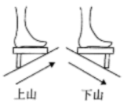
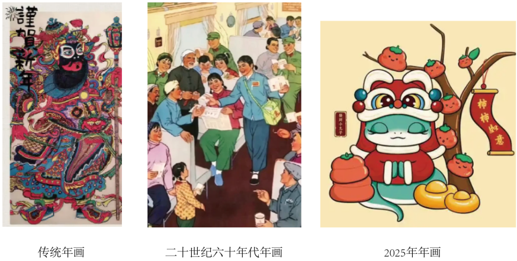

**机密★启用前**

**2025年湖北省普通高中学业水平选择性考试思想政治**

**本试卷共6页，20题。全卷满分100分。考试用时75分钟。**

**★★祝考试顺利！★★**

**注意事项：**

**1．答题前，先将自己的姓名、准考证号、考场号、座位号填写在试卷和答题卡上，并认真核准考准考号条形码上的以上信息，将条形码粘贴在答题卡上的指定位置。**

**2．请按题号顺序在答题卡上各题目的答题区域内作答，写在试卷、草稿纸和答题卡上的非答题区域均无效。**

**3．选择题用2B铅笔在答题卡上把所选答案的标号涂黑；非选择题用黑色签字笔在答题卡上作答；字体工整，笔迹清楚。**

**4．考试结束后，请将试卷和答题卡一并上交。**

**一、选择题：本题共16小题，每小题3分，共48小题。在每小题给出的四个选项中，只有一项是符合题目要求的。**

1\. 我国已经建成世界上最大规模的社会保障体系。以社会保险为例，2024年末全国基本养老保险、基本医疗保险覆盖10.12亿人、13.3亿人，失业保险、工伤保险参保人数分别达到2.5亿、3亿。我国社会保障事业取得的成就（ ）

①是广大人民群众共享改革发展成果的具体体现

②为实现我国第一个百年奋斗目标提供了有利条件

③为深入推进党的建设新的伟大工程注入磅礴动力

④深刻反映我国社会主义所处历史阶段已经发生根本变化

A. ①② B. ①③ C. ②④ D. ③④

【答案】A

【解析】

【详解】①：社会保障通过国民收入再分配，调节不同社会群体之间的利益关系，保障群众基本生活，是广大人民群众共享改革发展成果的具体体现，①正确。

②：我国建成世界上最大规模的社会保障体系，为打赢脱贫攻坚战提供了坚强支撑，为如期全面建成小康社会、实现第一个百年奋斗目标提供了有利条件，②正确。

③：社会保障事业主要是保障和改善民生、维护社会公平等，与深入推进党的建设新的伟大工程没有直接的紧密联系，③不选。

④：我国社会主要矛盾发生了变化，但我国社会主义所处历史阶段仍处于并将长期处于社会主义初级阶段，没有发生根本变化，④错误。

故本题选A。

2\. 化工消费总量连年多稳居世界第一。2024年全国农业科技进步率与农作物耕种收综合机械化率分别超过63%、75%。为实现农业强国目标，2025年4月，中共中央、国务院印发了《加快建设农业强国规划（2024—2035）》。此举（ ）

①旨在以农业强推动实现国家强

②推动了我国产业结构优化升级

③表明我国已具备建设农业强国的厚实基础

④有助于推动农业成为我国经济的主导产业

A. ①② B. ①③ C. ②④ D. ③④

【答案】B

【解析】

【详解】①：中共中央、国务院印发了《加快建设农业强国规划（2024 - 2035年）》旨在以农业强推实现农业强国，进而推动国家整体发展，①正确。

②： 材料主要强的建设农业强国相关规划，重点在于农业领域本身的发展，并未直接体现推动了我国产业结构优化升级，②不符合题意。

③：题干提到“农业科技进步率63%”“机械化率75%”等数据，说明我国农业已具备较强的技术基础，规划出台是建立在已有成就之上，③正确。

④： 我国国民经济的主导产业是工业，农业是国民经济的基础产业，④错误。

故本题选B。

3\. 2025年政府工作报告强调，推动更多资金资源“投资于人”。相较于注重基础设施建设等的“投资于物”，“投资于人”紧盯“人”这一关键点。从今年中央和地方公布的财政预算安排看，教育、就业、卫生健康等的投入明显加大。“投资于人”（ ）

①有利于释放消费潜能

②彰显了以人民为中心的发展思想

③意在改变轻生产重消费的发展模式

④是国家调节经济总量的重要举措

A. ①② B. ①③ C. ②④ D. ③④

【答案】A

【解析】

【详解】①：“投资于人”可以通过完善社会保障体系，改善居民消费环境，减轻家庭教育负担，释放居民消费潜力。也可以通过提升人力资本，释放劳动者的创新活力与生产效能，催生新的消费模式，提升居民的消费意愿，①正确。

②：“投资于人”将资金资源投入到人的发展和保障上，加大民生改善力度，让每个人都能够提升自身能力，体现了坚持以人民为中心的发展思想，做到发展为了人民、发展依靠人民、发展成果由人民共享，②正确。

③：强调“投资于人”，一个重要目的是改变一些地方重生产、轻消费的模式，而不是改变轻生产重消费的发展模式，③错误。

④：“投资于人”主要是通过保障和改善民生、提升人的素质和能力，来促进经济的长期发展，形成经济发展和民生改善的良性循环，并非主要用于调节经济总量，④不选。

故本题选A。

4\. 当老一辈还在炫耀“我这东西可贵了”，越来越多的年轻人则是“1元奶茶的漏，宁可排队也要捡”，追求“反向攀比”，比谁能花更少的钱买到更实惠的东西。“反向攀比”现象说明（ ）

①新出现的事物必然战胜旧事物

②当今一些年轻人的消费行为趋于理性

③年轻人的消费观念引领全社会的消费选择

④人们的价值判断和价值选择具有主体差异性

A. ①③ B. ①④ C. ②③ D. ②④

【答案】D

【解析】

【详解】①：新事物是符合客观规律、具有强大生命力和远大发展前途的事物。新事物必然战胜旧事物，但新出现的事物不一定是新事物，新出现的事物必然战胜旧事物说法错误，①说法错误。

②：年轻人追求“反向攀比”，比谁能花更少的钱买到更实惠的东西，这体现了他们在消费时更加注重商品的性价比，不盲目追求高价，是一种趋于理性的消费行为，②符合题意。

③：全社会消费选择受多种因素的影响，年轻人的消费观念只是其中的一部分，不能起到引领全社会消费选择的作用，③说法错误。

④：老一辈炫耀东西贵，年轻人追求花少钱买实惠，这表明老一辈和年轻人在消费方面有着不同的价值判断和价值选择，说明人们的价值判断和价值选择具有主体差异性，④符合题意。

故本题选D。

5\. 如今，很多外国人用中国的APP（应用程序）收快递，买潮玩，刷网剧。2025年1~4月，中国APP在169个国家和地区的下载量排行榜中跻身前十，在其中的18个国家和地区更是占据前十榜单的半数以上。中国APP风靡全球（ ）

①体现了中国对外开放程度的加深

②增强了国外民众对中国文化的认同

③反映了中国对世界经济增长的积极贡献

④表明跨境电商已成为国际贸易的主要渠道

A. ①② B. ①③ C. ②④ D. ③④

【答案】B

【解析】

【详解】①：中国的APP能够在全球很多国家和地区被广泛下载和使用，这意味着中国的软件产品更深入地走向国际市场，说明中国对外开放程度的加深，①符合题意。

②：要认同本民族文化，尊重其他民族文化，②说法错误。

③：中国APP在全球受欢迎，下载量可观，这背后涉及到APP相关的商业活动，很多外国人用中国的APP收快递，买潮玩，刷网剧，带动相关经济活动的发展，反映了中国对世界经济增长的积极贡献，③符合题意。

④：仅从中国APP在全球的下载量情况，并不能得出跨境电商已成为国际贸易的主要渠道，④说法错误。

故本题选B。

6\. 为应对全球人工智能治理的挑战，中国提出以下相关主张：

|                |                                               |
|:-------------- |:--------------------------------------------- |
| 《全球人工智能治理倡议》   | 坚持以人为本、智能向善；各国无论大小、强弱、社会制度如何，都有平等发展和利用人工智能的权利 |
| 《人工智能全球治理上海宣言》 | 维护人工智能安全，构建人工智能的治理体系，提升生活品质与社会福祉              |
| 《人工智能能力建设普惠计划》 | 促进人工智能和数字基础设施联通，推进人工智能赋能千行百业，确保人工智能安全可靠可控     |

上述主张（ ）

①立足各方根本利益，适应全球人工智能治理的需要

②涵盖发展、安全等内容，显示出科技伦理治理的重要性

③坚持独立自主基本立场，为全球人工智能治理提供中国方案

④遵循平等、共享等全球治理原则，确保了人工智能安全可靠

A. ①③ B. ①④ C. ②③ D. ②④

【答案】C

【解析】

【详解】①：维护国家利益是主权国家对外活动的出发点和落脚点，要立足本国利益，不是立足各方利益，①说法错误。

②：《全球人工智能治理倡议》提到“智能向善”，《人工智能全球治理上海宣言》强调“维护人工智能安全”和“提升生活品质与社会福祉”，《人工智能能力建设普惠计划》提出“推进人工智能赋能千行百业”和“确保人工智能安全可靠可控”。这些内容明确涵盖了发展（赋能行业）和安全（维护安全、确保安全可靠可控），并通过“以人为本、智能向善”等体现了科技伦理治理的重要性，②符合题意。

③：我国发布这些关于人工智能治理的倡议、宣言和计划，强调各国无论大小、强弱、社会制度如何，都有平等发展和利用人工智能的权利，体现了我国坚持独立自主基本立场，为全球人工智能治理贡献中国智慧和中国方案，③符合题意。

④：中国倡议的目标是“确保人工智能安全可靠可控”，但“确保了”人工智能安全可靠，说法过于绝对，不符合实际，④说法错误。

故本题选C。

7\. 近年来，我国严厉打击毒品走私、境外间谍犯罪，加强食品安全、生产安全、网络安全等领域的执法。习近平总书记在建设更高水平平安中国的中央政治局集体学习时强调，必须坚定不移贯彻总体国家安全观。贯彻总体国家安全观需要（ ）

①切实履行维护国家稳定的职能

②以人民安全为根本，以政治安全为宗旨

③加强境外执法，共同应对全球安全挑战

④统筹外部安全与内部安全，防范化解各类风险

A ①③ B. ①④ C. ②③ D. ②④

【答案】B

【解析】

【详解】①④：我国严厉打击毒品走私、境外间谍犯罪，加强食品安全、生产安全、网络安全等领域的执法，这是国家切实履行维护国家稳定的职能的表现，需要统筹外部安全与内部安全，防范化解各类风险，①④入选。

②：必须坚持以人民安全为宗旨、以政治安全为根本，②不选。

③：我国坚持独立自主的和平外交政策，贯彻总体国家安全观，不能加强境外执法，③不选。

故本题选B。

8\. 2024年12月，云南省人大民族委员会召开立法协商会，邀请省人大代表、省政协委员等对《云南省宁洱哈尼族彝族自治县民族团结誓词碑文化保护传承条例（草案）》提出修改完善意见，为续写好新时代民族团结誓词碑故事贡献智慧与力量。由此可知（ ）

①我国各民族共同创造了灿烂的中华文化

②立法协商会是多党合作和政治协商的重要机构

③誓词碑文化的保护与传承有利于维护民族团结

④人大民族委员会具有研究、审议相关议案的职能

A. ①② B. ①③ C. ②④ D. ③④

【答案】D

【解析】

【详解】①：材料主要强调是对宁洱哈尼族彝族自治县民族团结誓词碑文化的保护传承，未体现我国各民族共同创造灿烂中华文化，①不符合题意。

②：人民政协是多党合作和政治协商的重要机构，而非立法协商会，②错误。

③：云南省人大民族委员会就民族团结誓词碑文化保护传承条例草案进行立法协商，因为誓词碑文化体现了各民族一心向党的共同情感，其保护与传承有利于维护民族团结，③正确。

④：云南省人大民族委员会召开立法协商会，邀请各方对条例草案提出修改意见，体现了人大民族委员会具有研究、审议相关议案的职能，④正确。

故本题选D。

9\. 2025年是遵义会议召开90周年。遵义会议孕育了“坚定信念、坚持真理、独立自主、团结统一”的遵义会议精神，该精神是首批被纳入中国共产党人精神谱系的伟大精神之一。遵义会议精神（ ）

①是党始终走在时代前列永葆生机活力的法宝

②是中华民族精神和时代精神的重要组成部分

③为新时代党和国家事业发展提供了根本遵循

④对全面推进中华民族伟大复兴具有重要意义

A. ①③ B. ①④ C. ②③ D. ②④

【答案】D

【解析】

【详解】①：党始终走在时代前列、永葆生机活力的法宝是解放思想、实事求是、与时俱进、求真务实，而非遵义会议精神，①错误。

②：遵义会议精神是中国共产党人在特定历史时期形成的伟大精神，是对民族精神的传承和发展，也体现了当时的时代特征，是中华民族精神和时代精神的重要组成部分，②正确。

③：习近平新时代中国特色社会主义思想为新时代党和国家事业发展提供了根本遵循，不是遵义会议精神，③错误。

④：遵义会议精神蕴含的坚定信念、坚持真理等品质，能为全面推进中华民族伟大复兴提供精神动力和价值引领，具有重要意义，④正确。

故本题选D。

10\. 甲家的牛误入乙家的农田，踩坏了田里的庄稼。双方就赔偿事项协商不成，乙于是提起诉讼。以下说法正确的是（ ）

①甲没有侵权故意，无须承担侵权责任

②诉讼中，法院可依法组织当事人进行调解

③诉讼中，乙应当对自己的主张承担举证责任

④乙要求甲停止侵害、赔偿损失的主张可以得到法院支持

A. ①③ B. ①④ C. ②③ D. ②④

【答案】C

【解析】

【详解】①：根据《中华人民共和国民法典》规定，饲养的动物造成他人损害的，动物饲养人或者管理人应当承担无过错侵权责任，即使甲没有侵权故意，也需承担责任，①错误。

②：在民事诉讼中，法院可依法组织当事人进行调解，这是解决民事纠纷的一种重要方式，②正确。

③：民事诉讼一般遵循“谁主张，谁举证”原则，本案属于民事诉讼，乙应当对自己的主张承担举证责任，③正确。

④：甲家的牛已经踩坏了庄稼，侵害行为已经发生且结束，不适用停止侵害这一责任承担方式，乙可以要求甲赔偿损失，但“停止侵害”的主张不符合实际情况，④错误。

故本题选C。

11\. 王某生产的“小王牌”代餐粉广受市场好评。李某仿冒“小王牌”代餐粉包装，生产“小玉牌”代餐粉。某日，孙某在超市挑选了一盒代餐粉，误以为是“小王牌”，随即扫码支付离开。孙某食用后严重腹泻，这才发现代餐粉为“小玉牌”，遂要求超市赔偿。超市未予理会。以下说法正确的是（ ）

①李某的行为侵害了王某的姓名权

②李某的行为可能构成法律禁止的混淆行为

③孙某可以向有关行政部门投诉

④孙某可以直接就自己与超市之间的争议申请仲裁

A. ①③ B. ①④ C. ②③ D. ②④

【答案】C

【解析】

【详解】①：姓名权是自然人有权依法决定、使用、变更或者许可他人使用自己的姓名的权利。“小王牌”是商品名称或品牌标识，不属于姓名权范畴，李某仿冒“小王牌”包装的行为，侵害的是王某的商标权或构成不正当竞争，而非姓名权，①排除。

②：李某仿冒“小王牌”代餐粉包装，生产“小玉牌”代餐粉，孙某在超市挑选了一盒代餐粉，误以为是“小王牌”，这种容易使消费者发生误认的行为，符合法律禁止的混淆行为的特征，属于不正当竞争，②符合题意。

③：孙某作为消费者，因购买到存在质量问题且因商家仿冒包装导致自己误购的商品，合法权益受损，而超市又未予理会其赔偿要求时，孙某有权向相关行政部门投诉，比如向市场监管部门投诉，以维护自己的合法权益，③符合题意。

④：仲裁需双方事先达成仲裁协议，孙某与超市之间没有事先达成仲裁协议，所以孙某不可以直接就自己与超市之间的争议申请仲裁，④说法错误。

故本题选C。

12\. 《中华人民共和国劳动法》为社会主义市场经济条件下劳动关系的调整提供了法律依据。下列推理结构正确的是（ ）

①有些以暴力手段强迫劳动的行为是违法行为。所以，有些违法行为是以暴力手段强迫劳动的行为。

②有些高强度劳动不是适合女职工从事的劳动。所以，有些适合女职工从事的劳动不是高强度劳动。

③所有招用未成年工进行高强度劳动的行为都是违法的。所以，所有合法行为都不是招用未成年工进行高强度劳动的行为。

④所有违反法律、行政法规的劳动合同都不是有效合同。A单位所有的劳动合同都不是有效合同。所以，A单位所有的劳动合同都是违反法律、行政法规的。

A. ①③ B. ①④ C. ②③ D. ②④

【答案】A

【解析】

【详解】① ：这是性质判断中的换位推理。原判断为“特称肯定判断（有些S是P）”，换位后为“特称肯定判断（有些P是S）”，遵循“在前提中不周延的项，换位后也不能周延”的规则（“违法行为”在前提中作为谓项不周延，换位后作为主项仍不周延），①正确。

②： 原判断为“特称否定判断（有些S不是P）”，不能进行换位。因为换位推理要求“否定判断的谓项周延”，若直接换位为“有些P不是S”，会导致“高强度劳动”在前提中作为主项不周延，换位后作为谓项周延，违反换位规则，②错误。

③： 这是换质位推理。先换质：“所有招用未成年工的行为都是违法的”→“所有招用未成年工的行为都不是合法的”；再换位：“所有合法行为都不是招用未成年工的行为”，符合换质位推理规则，③正确。

④：这是三段论推理，大前提为全称否定判断，小前提为全称否定判断，违反三段论“两个否定前提不能推出结论”的规则，④错误。

故本题选A。

13\. 2025年武汉马拉松吸引了45万多人报名，赛事规模达4万人。参赛公众报名采取先预报名、后抽签、中签者再缴费的模式。只有中了签才允许缴费，除非缴了费否则不允许实际参赛。甲乙二者最多一人中了签，甲乙二者至少有一人缴了费。如果以上断定为真，下列选项不必然为真的是（ ）

A. 甲或者缴费或者不允许实际参赛

B. 如果允许甲实际参赛，则乙没缴费

C. 如果不允许甲实际参赛，则乙中了签或乙缴了费

D. 甲与乙中恰好一人中签、恰好一人缴费，且中签与缴费的为同一人

【答案】C

【解析】

【详解】本题为逆向选择题。

A：“除非缴了费否则不允许实际参赛”，除非……否则不……是必要条件假言判断的不同表达方式，可以换成“只有缴了费才允许实际参赛”，对于甲来说要么缴费，要么不缴费，根据必要条件假言推理可知，缴费了可能允许实际参赛也可能不允许实际参赛，不缴费不允许实际参赛。因此必然能推出甲或者缴费或者不允许实际参赛，A不符合题意。

B：根据“除非缴了费否则不允许实际参赛”，换成“只有缴了费才允许实际参赛”这一必要条件假言判断，其正确的推理结构是否前否后式或肯后肯前式。“允许甲实际参赛”肯定了后件，可以必然推出肯定前件，得出“甲缴了费”。根据“只有中了签才允许缴费”这一必要条件假言判断，进行推理，“甲缴了费”肯定了后件，必然得出肯定前件，“甲中了签”。再根据甲乙二者最多一人中了签，得出乙没中签，因此根据必要条件假言推理，必然推出乙没有缴费，B不符合题意。

C：根据“除非缴了费否则不允许实际参赛”，换成“只有缴了费才允许实际参赛”这一必要条件假言判断，其正确的推理结构是否前否后式或肯后肯前式。“不允许甲实际参赛”这是否定后件，不能必然得出否定前件，即不能必然推出甲没缴费，因此不能必然推出乙缴了费，乙可能没中签也没缴费，因此不能必然推出乙中了签或乙缴了费，C符合题意。

D：根据甲乙二者最多一人中了签，那么要么甲中签要么乙中签，而参赛公众报名采取中签者再缴费的模式，那么只有一人缴费，因此必然能推出甲与乙中恰好一人中签、恰好一人缴费，且中签与缴费的为同一人，D不符合题意。

故本题选C。

14\. “脚著谢公屐，身登青云梯”中的“谢公屐”是谢灵运为涉险山发明的一种特殊木屐（如下图）。这种木屐的前后两齿可拆卸，上山时拆掉前齿，下山时拆掉后齿。从哲学角度看，下列说法正确的是（ ）

①结构要素的组合变化引起系统功能的优化

②注重主客观条件有利于把握联系的多样性

③善于分析矛盾是矛盾双方相互转化的前提

④创新活动受到实践主体需要的制约和影响

A. ①③ B. ①④ C. ②③ D. ②④

【答案】B

【解析】

【详解】①④：这种木屐的前后两齿可拆卸，上山时拆掉前齿，下山时拆掉后齿，这表明作为一个系统，通过其结构的调整，可以实现不同的功能，实现优化目标，同时也表明创新活动受到实践主体需要的制约和影响，①④入选。

②：题干中主要强调的是通过改变木屐结构（可拆卸齿）来适应不同登山情况，重点在于结构变化与功能优化，未涉及注重客观条件把握联系多样性的内容。联系的多样性强调事物存在和发展有多种条件，这里没有体现相关要点。所以②不符合题意，排除。

③：矛盾双方相互转化的前提是具备一定的条件，而不是善于分析矛盾。善于分析矛盾有助于认识矛盾，但不是矛盾双方相互转化的前提。所以③说法错误，排除。

故本题选B。

15\. 年画作为中国民间艺术形式之一，是中国特有的一种绘画体裁。

据图判断，以下说法正确的是（ ）

①年画是体现中华民族整体精神风貌的独特文化符号

②一定时期的年画与一定的经济、政治发展相适应

③内容形式各异的年画帮助人们提高思想道德素质

④历久弥新的年画以其鲜明的民族特色丰富世界文化

A. ①③ B. ①④ C. ②③ D. ②④

【答案】D

【解析】

【详解】①：中华民族精神集中体现了中华民族的整体风貌和精神特征；而年画是中国传统文化的一种形式，并不是体现中华民族整体精神风貌的独特文化符号，①错误。

②：从传统年画到二十世纪五六十年代年画再到2025年年画的变化，能看出年画随时代发展而变化，说明一定时期的年画与一定的经济、政治发展相适应 ，②正确。

③：优秀文化能帮助人们提高思想道德素质，内容形式各异的年画不一定都是优秀文化，不一定能帮助人们提高思想道德素质，③错误。

④：年画是中国特有的一种绘画体裁，具有鲜明民族特色，历久弥新的年画在发展中不断丰富世界文化，④正确。

故本题选D。

16\. 先进科技为非遗带来了更多美的“打开方式”。苏绣《玉兰蝴蝶》采用前沿的形状记忆合金，当指尖轻触表面，玉兰花即刻绽放，蝴蝶翩然起舞；使用光感材料的白色花瓣在阳光下呈现出紫色。这种动态化的表达，给观众提供了互动式的体验，把苏绣带到了更多、更大的舞台。《玉兰蝴蝶》的创新（ ）

①坚持了对传统苏绣的辩证否定

②提升了观众对非遗作品的审美能力

③说明运用新材料是改造非遗文化的前提

④运用联想思维将“科技”与“非遗”联结起来

A. ①③ B. ①④ C. ②③ D. ②④

【答案】B

【解析】

【详解】①：辩证否定是既肯定又否定，既克服又保留，其实质是“扬弃”。苏绣《玉兰蝴蝶》在保留苏绣传统技艺的基础上，采用前沿的形状记忆合金、光感材料等先进科技进行创新，这体现了对传统苏绣的辩证否定，①符合题意。

②：材料强调的是先进科技为苏绣《玉兰蝴蝶》带来新的表达形式，给观众提供互动式体验，增强了体验感，这与提升观众对非遗作品的审美能力无关，②排除。

③：新材料是改造非遗的一种手段，并不是改造非遗文化的前提，③说法错误。

④：联想思维就是将记忆中对不同事物的认识进行联结与思考的思维活动。《玉兰蝴蝶》将先进科技（形状记忆合金、光感材料）与非遗（苏绣）联结起来，创造出独特的艺术效果，是联想思维的运用，④符合题意。

故本题选B。

**二、非选择题：本题共4小题，共52分。**

17\. 阅读材料，完成下列要求。

无羊毛资源的浙江某市，近几年的羊毛衫年产量却超过7亿件，销往全球20多个国家和地区，年成交额保持千亿元级规模，演绎了一个“无中生有”的故事。

改革开放东风“吹”来新潮流、新装备，商户们第一时间“嗅”到商机，及时以机织毛衣代替传统的手工“打毛衣”，顺应并满足羊毛衫的市场需求。该市政府依托地处杭嘉湖平原腹地的区位优势，积极拥抱国家长三角一体化发展战略，推动羊毛衫产业从家庭作坊走向临空产业园、从“马路市场”走向集散中心加时尚古镇。企业和政府协同发力，采用“飞地抱团”“村村抱团”的生产模式；建设直播基地，打造从选品到直播、从发货物流到生活配套的完整直播生态圈……着力打造涵盖设计、原材料、生产、销售、配套服务等在内的完整产业链。

结合材料，运用《经济与社会》相关知识，说明该市羊毛衫产业是如何“无中生有”的。

【答案】①发挥市场在资源配置中的决定性作用，面向市场，紧跟市场的发展潮流，满足羊毛衫市场的需求。

②政府积极履行经济职能，充分利用当地的区位优势，为羊毛市场的发展创造良好的政策环境，跟进国家战略，助力羊毛产业的发展。

③贯彻新发展理念，推动产业规模化、集群发展，促进产业结构的优化升级，创新模式，利用直播带货等方式，打造多层次的销售网络，构建完善的产业链体系。

④努力融入新发展格局，以国内大循环为主体，同时注重国际循环，推动产品贸易的全球化，提高竞争力。

【解析】

【分析】背景素材：浙江某市羊毛产业的发展

考点考查：有效市场和有为政府、新发展理念、新发展格局

能力考查：描述和阐述事物，论证和探究问题

核心素养：政治认同、科学精神

【详解】第一步：审设问。明确主体、知识范围、问题限定和作答角度。

本题需要调用经济与社会的有关知识，说明该市羊毛衫产业是如何“无中生有”的。

第二步：审材料。提取关键词，链接教材知识。

关键词①：改革开放东风“吹”来新潮流、新装备。商户们第一时间“嗅”到商机。及时以机织毛衣代替传统手工“打毛衣”。顺应并满足羊毛衫的市场需求→可联系市场配置资源的知识，说明要面向市场，充分发挥市场在资源配置中的决定作用；

关键词②：该市政府依托地处杭嘉湖平原腹地的区位优势，积极拥抱国家长三角一体化发展战略，推动羊毛衫产业从家庭作坊走向临空产业园、从“马路市场”走向集散中心加时尚古镇→可联系政府的经济职能的知识，说明政府要积极营造良好的营商环境，利用区位优势，促进企业的发展；

关键词③：企业和政府协同发力，采用“飞地抱团”“村村抱团”的生产模式：建设直播基地，打造从选品到直播、从发货物流到生活配套的完整直播生态圈……着力打造涵盖设计、原材料、生产、销售、配套服务等在内的完整产业链→可联系新发展理念和高质量发展的知识，说明坚持新发展理念，推动规模化经营，充分利用新模式、新方式，推动产业链的完善，推动产业结构的优化升级；

关键词④：无羊毛资源的浙江某市，近几年的羊毛衫年产量却超过7亿件，销往全球20多个国家和地区→可联系新发展格局的知识，说明要推动国际贸易的发展，助力新发展格局的形成与发展；

第三步：整合信息，组织答案。注意设问限定以及教材知识与材料、时政信息等相结合。

18\. 阅读材料，完成下列要求。

建设法治中国是系统性工程，要坚持法治国家、法治政府和法治社会一体建设。

材料一 公平竞争是市场机制高效运行的重要基础，公平竞争审查对规范行政机关及部门行为具有积极作用。2024年以来，我国不断对公平竞争审查上“硬杠杠”。

材料二 甲和乙是羽毛球球友。某周六打球后，甲乙约定：甲以700元价格购买乙的一支闲置球拍，下周六交付。甲当场支付了100元定金。两天后，乙使用该闲置球拍打球时被丙不小心损坏。到了约定时间，乙无法交付球拍，影响了甲的训练安排。甲遂要求乙双倍返还定金，而乙认为球拍系丙损坏，属于不可抗力，自己无须承担责任。甲又找到丙，要求赔偿损失，丙不愿赔偿。

（1）结合材料一，运用《政治与法治》相关知识，分析公平竞争审查的“湖北探索”对建设法治政府的意义。

（2）结合材料二，运用《法律与生活》相关知识，分别判断甲对乙、丙的主张是否合理，并说明理由。

【答案】（1）①有利于坚持党的全面领导，党的领导为法治政府的建设提供了根本保证。

②有利于完善法治体系，构建权责法定的政府，国务院出台该条例，有利于建立相关的工作机制，助力审查工作的公平公正。

③有利于推动政府科学、民主决策，将审查纳入决策的环节，推动决策真正的反映民意，集中民智。

④有利于打造智能高效的政府，通过全链条智慧审查，提高审查的效率，提高政府的工作效率。

⑤有利于提高透明度，维护政府的权威。通过设立审查检测站点，公开审查，保障公民的知情权。

（2）①甲对乙的诉讼请求合理。

甲乙双方达成约定，该合同合法有效，甲支付100元定金，而乙是违约方，应该双倍返还定金。且不可抗力是不能预见、不能避免且不能克服，丙的行为导致球拍无法交付，不属于不可抗力。

②甲对丙的诉求不合理。

丙由于自身过错，导致乙的球拍坏掉，应承担过错侵权责任，但甲与丙无直接合同关系，且甲对球拍无所有权，故甲不能直接要求丙赔偿自身损失（如训练安排受影响）。甲只能通过乙向丙追偿，或乙赔偿甲后向丙追偿。

【解析】

【分析】背景素材：建设法治政府、甲乙纠纷

考点考查：法治政府、侵权责任、合同和违约

能力考查：描述和阐述事物，论证和探究问题

核心素养：政治认同、科学精神、法治意识

【小问1详解】

第一步：审设问。明确主体、知识范围、问题限定和作答角度。

本题需要调用政治与法治的有关知识，分析公平竞争审查的“湖北探索”对建设法治政府的意义。

第二步：审材料。提取关键词，链接教材知识。

关键词①：《中共中央关于进一步全面深化改革、推进中国式现代化的决定》加强公平竞争审查刚性约束，强化反垄断和反不正当竞争→可联系法治政府的知识，从党的角度来说明建设法治政府要始终坚持党的全面领导。

关键词②：国务院出台《公平竞争审查条例》 县级以上地方人民政府应当建立健全公平竞争审查工作机制，保障公平竞争审查工作力量→可联系法治政府的知识，从立法环节的角度来说明有利于推动法治体系的建设，保障政府有法可依。

关键词③：将审查纳入决策环节，办文必经程序→可联系法治政府的知识，从决策环节的角度来说明有利于促进科学、民主依法决策，提高决策水平。

关键词④：全链条智慧审查。实行“AI+专家+监管部门”三重把关模式→可联系法治政府的知识，从政府职能的角度来说明有利于打造智能高效的政府。

关键词⑤：全环节阳光审查。设立审查检测站点，向社会公开审查和第三方评估情况→可联系法治政府的知识，从政府监督的角度来说明有利于提高透明度，增强政府的权威。

第三步：整合信息，组织答案。注意设问限定以及教材知识与材料、时政信息等相结合。

【小问2详解】

第一步：审设问。明确主体、知识范围、问题限定和作答角度。

本题需要调用政治与法治的有关知识，分别判断甲对乙、丙的主张是否合理，并说明理由。

第二步：审材料。提取关键词，链接教材知识。

关键词①：甲遂要求乙双倍返还定金，而乙认为球拍系丙损坏，属于不可抗力，自己无须承担责任→可联系合同的知识，说明甲乙合同有效，乙单方面违约，需要承担违约责任，且丙的损坏行为，不是不可抗力，不属于法定免责情形。

关键词②：甲又找到丙，要求赔偿损失，丙不愿赔偿→可联系侵权的知识，说明丙侵犯了乙的财产权，但甲与丙并无直接的合同关系，不能照丙赔偿，甲只能通过乙向丙追偿，或乙赔偿甲后向丙追偿。

第三步：整合信息，组织答案注意设问限定以及教材知识与材料、时政信息等相结合。

19\. 阅读材料，完成下列要求。

“桥”意味着连接与沟通，蕴含着友谊与智慧，代表着跨越与创新。

宋代的泉州洛阳桥建成后，海洋与内陆实现了联通，从此见证“涨海声中万国商”的辉煌。如今，中马友谊大桥改写马尔代夫没有桥梁的历史，佩列沙茨大桥连接起克罗地亚南北领土，马普托大桥助力莫桑比克经济发展……一座座中国建造的桥梁飞架海外，以“硬联通”促“心联通”。

悟空、哪吒是“桥”，让东方神话突破“次元壁”；家电、新能源汽车是“桥”，连通世界产业链条；“全球安全倡议”是“桥”，跨越冷战零和思维的障碍；伊沙和解的谈判桌是“桥”，拉近冲突双方的距离……这些凝结着中国智慧的“桥”，向世界展现出“命运与共”的新画卷。

从石板小桥到钢铁长虹，再到连接人心的友谊桥梁，一个既古老又现代的东方大国，正以“中国桥”将自己与世界连通。

结合材料，运用《当代国际政治与经济》知识，阐述“中国桥”在推动构建新型国际关系中蕴含的中国智慧。

【答案】①中国秉持共商共建共享的全球治理观。通过基础设施建设的互联互通，加强与世界各国的经济联系，为构建新型国际关系奠定物质基础。促进各国贸易往来，像古代“涨海声中万国商”一样，推动经济全球化朝着更加开放、包容、普惠、平衡、共赢的方向发展，增进各国人民福祉，以“硬联通”促“心联通”，为构建新型国际关系的重要经济支撑。

②中国推动不同文化之间的交流互鉴，促进文化产业合作。文化交流是增进国家间理解与信任的重要途径，产业合作能实现各国优势互补。中国通过文化和产业这些“桥”，加强与世界各国在文化和经济领域的深度融合，打破文化隔阂和贸易壁垒，构建更加紧密的利益共同体，在新型国际关系中促进人文交流和经济合作。

③中国坚持走和平发展道路，倡导多边主义，反对霸权主义和强权政治。中国提出的全球安全倡议，为解决全球性安全问题提供中国方案，摒弃冷战思维，强调各国在安全上的共同责任，追求普遍安全与共同安全，推动构建相互尊重、公平正义、合作共赢的新型国际关系，为世界和平与安全贡献中国智慧。

④中国积极参与地区热点问题的解决，发挥建设性作用。中国秉持人类命运共同体理念，通过劝和促谈等方式，推动地区冲突的和平解决，维护地区和平与稳定。在推动构建新型国际关系中，展现大国担当，为世界和平与发展创造良好环境，体现了中国在处理国际关系中追求和平、合作、发展的价值取向。

【解析】

【分析】背景素材：“中国桥”在推动新型国际关系中的作用

考点考查：世界多极化

能力考查：描述和阐释事物、论证和探究问题

核心素养：政治认同、科学精神

【详解】第一步：审设问。明确主体、作答范围、问题限定和作答角度。本题为需要阐述“中国桥”在推动构建新型国际关系中蕴含的中国智慧，需要调用世界多极化中的国际关系内容、我国的外交政策、构建人类命运共同体从不同角度回答其中蕴含的中国智慧。

第二步：审材料，通过标点符号、段落等，提取材料有效信息。

有效信息①：从宋代泉州洛阳桥到现在的中马友谊大桥改写马尔代夫没有桥梁的历史，佩列沙茨大桥连接起克罗地亚南北领土，马普托大桥助力莫桑比克经济发展……一座座中国建造的桥梁飞架海外，以“硬联通”促“心联通”→从经济的角度分析：可运用推动经济全球化朝着开放、包容、普惠、平衡、共赢的方向发展，加强与世界各国的经济联系，为构建新型国际关系奠定物质基础。

有效信息②：悟空、哪吒是“桥”，让东方神话突破“次元壁”；家电、新能源汽车是“桥”，连通世界产业链条→从文化交流与文化产业的角度分析：可运用国际关系的内容以及构建人类命运共同体的知识，说明加强与世界各国在文化和经济领域的深度融合，打破文化隔阂和贸易壁垒，构建更加紧密的利益共同体，在新型国际关系中促进人文交流和经济合作。

有效信息③：“全球安全倡议”是“桥”，跨越冷战零和思维的障碍→从安全的角度分析：可运用我国的外交政策、全球治理，说明“中国桥”有助于推动构建相互尊重、公平正义、合作共赢的新型国际关系，为世界和平与安全贡献中国智慧。

有效信息④：伊沙和解的谈判桌是“桥”，拉近冲突双方的距离……这些凝结着中国智慧的“桥”，向世界展现出“命运与共”的新画卷→从政治的角度分析：可运用我国的地位和作用，说明在推动构建新型国际关系中，展现大国担当，为世界和平与发展创造良好环境，体现了中国在处理国际关系中追求和平、合作、发展的价值取向。

第三步：整合信息，组织答案。注意设问限定以及教材知识与材料、时政信息等相结合。

20\. 阅读材料，完成下列要求。

朱鹮回来了

朱鹮（huán）是“秦岭四宝”之一，20世纪70年代末，濒临灭绝。1981年5月，人们在陕西洋县姚家沟发现7只野生朱鹮，于是在当地设立了朱鹮自然保护区。此后40多年，几代朱鹮保护者展开接力“赛跑”，省内朱鹮数量升至近8000只，摆脱了灭绝的风险。

朱鹮飞走了

在保护区建立之初，为了朱鹮更好地栖息，人们把朱鹮筑巢附近的村落迁到5公里以外的地方，几年后，发现朱鹮又在新的村落附近筑巢，于是再次把村落迁到更远的地方。结果，朱鹮还是追逐村落筑巢。原来，朱鹮主要以小鱼、小虾为食，喜在稻田、河滩觅食，其觅食区域与人类的生产、生活区域高度重合。没有了稻田，失去了食物来源，朱鹮就会飞走。

朱鹮又飞回来了

于是，当地及时调整策略，实施“鹮田一分”“稻鱼共生”等项目，在朱鹮活动区的每一亩稻田中留出一分田，作为朱鹮的活动区域，定期投放泥鳅、鱼虾等，为朱鹮提供充足的食物来源，朱鹮又飞回来了。

（1）结合材料，运用“逆向思维的含义”的知识，分析当地保护朱鹮的思路调整的依据。

（2）结合材料，运用“探究世界的本质”的知识，以“实现人与自然的良性互动”为主题，撰写一篇短文。（。要求：观点明确，语言表达清晰，学科术语使用规范，总字数不超过180字。）

【答案】（1）逆向思维就是反向求索，或者称为反向法。作为创新思维的一种方法， 逆向思维是人们从过去所把握的事物原理的反面、构成要素的反 面、功能结构的反面等，去思考、去求索，以实现创新的目的。 在朱鹮保护中，最初人们从避免人类活动干扰朱鹮栖息的正向思维出发，不断迁移村落，但效果不佳。后来转换思路，从朱鹮觅食区域与人类生产生活区域重合这一实际情况出发，实施 “鹮田一分”“稻鱼共生” 等项目，为朱鹮提供食物，这是从正向思维的反面进行思考，通过逆向思维调整保护思路，最终让朱鹮又飞回来了。

（2）自然界是物质的，规律是客观的。在朱鹮保护中，最初未尊重自然规律，一味迁村未达保护目的。后来实施 “鹮田一分” 等项目，遵循自然规律，实现了人与自然和谐共生。这启示我们要尊重自然、顺应自然，在认识和把握规律基础上，正确发挥主观能动性，实现人与自然良性互动。

【解析】

【分析】背景素材：朱鹮的保护历程

考点考查：探究世界的本质、逆向思维

能力考查：描述和阐释事物、论证和探究问题

核心素养：政治认同、科学精神、公共参与

【小问1详解】

第一步：审设问。明确主体、知识范围、问题限定和作答角度。 本题为原因类主观题，需要调用逆向思维含义的知识分析当地保护朱鹮的思路调整的依据。

第二步：审材料。提取关键词，链接教材知识。

关键词：开始建立保护区没有食物朱鹮就会飞走。当地及时调整策略，实施“鹮田一分”“稻鱼共生”等项目，在朱鹮活动区的每一亩稻田中留出一分田，作为朱鹮的活动区域，定期投放泥鳅、鱼虾等，为朱鹮提供充足的食物来源，朱鹮又飞回来了。→可联系逆向思维的含义的知识从正反两方面说明通过逆向思维调整保护思路，最终让朱鹮又飞回来了。

第三步：整合信息，组织答案。注意设问限定以及教材知识与材料、时政信息等相结合。

【小问2详解】

第一步：审设问。明确主体、知识范围、问题限定和作答角度。 本题为开放类主观题，需要调用探究世界的本质的知识从为什么以及怎样实现人与自然的良性互动展开即可。

第二步：审材料。提取关键词，链接教材知识。

关键词：实现人与自然的良性互动→可联系自然界的物质性以及规律的客观性说明要尊重规律，在尊重规律的基础上正确发挥主观能动性实现人与自然和谐共生。

第三步：整合信息，组织答案。注意设问限定以及教材知识与材料、时政信息等相结合。
