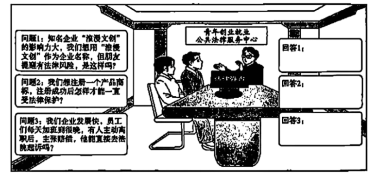

**2025年湖南省普通高中学业水平选择性考试**

**思想政治**

**一、选择题：共16小题，每小题3分，共48分。在每小题给出的四个选项中，只有一项是符合题目要求的。**

1\. 1867年，恩格斯在《资本论》第一卷出版时的书评里说过：一些读者“可能会以为他将从这本书里得知共产主义的千年王国到底是什么样子。谁指望得到这种乐趣，谁就大错特错了”。由此可知（ ）

①展望未来社会时，马克思主义经典作家作出了具体描绘

②必须坚持马克思主义对于研究未来社会制度的科学方法

③未来社会到底是什么样子，需要人们在实践中不断探索

④马克思主义经典作家当时并未认识和掌握社会发展规律

A. ①② B. ①④ C. ②③ D. ③④

2\. 中国式现代化是党领导人民在长期探索和实践中取得的重大成果。十八大以来，党在已有基础上继续前进，坚持问题导向，围绕解决现代化建设中存在的突出矛盾和问题，全面深化改革，不断实现理论和实践上的创新突破，成功推进和拓展了中国式现代化。这表明（ ）

①全面深化改革是推进中国式现代化的根本保证

②推进中国式现代化要紧扣全面深化改革这一主题

③中国式现代化理论是科学社会主义的最新重大成果

④中国式现代化与全面深化改革紧密联系、内在统一

A. ①② B. ①③ C. ②④ D. ③④

3\. 2025年3月，中共中央办公厅、国务院办公厅印发《提振消费专项行动方案》。为大力提振消费，全方位扩大国内需求，以下举措作用路径正确的是（ ）

①扩大服务业开放→增加服务供给→推动优质服务进口→释放服务消费潜力

②创新服务消费场景→优化服务供给→更好满足居民消费→释放服务消费潜力

③完善消费领域信用体系→营造放心消费环境→强化消费能力→扩大国内需求

④落实带薪休假制度→保障劳动者休假权益→增强居民消费意愿→扩大国内需求

A. ①② B. ①③ C. ②④ D. ③④

4\. 为有效防范化解地方政府债务风险，2024年11月，财政部对外公布了“6+4+2”的化债“组合拳”，具体安排如下表。

|      |                                                 |
|:---- |:----------------------------------------------- |
| 化债规模 | 具体安排                                            |
| 6万亿  | 2024-2026年每年发行2万亿元地方专项债券来置换隐性债务。                |
| 4万亿  | 2024-2028年连续五年每年从新增地方专项债中安排8000亿元，累计置换4万亿元隐性债务。 |
| 2万亿  | 2029年及以后年度到期的棚户区改造隐性债务2万亿元，仍按原合同偿还。             |

由材料推断，“组合拳”的实施可（ ）

①优化地方政府债务期限结构

②增强地方政府债务偿还能力

③向货币市场注入更多流动性

④降低地方政府的负债率

A. ①② B. ①④ C. ②③ D. ③④

5\. 制定实施中央八项规定，是党在新时代的徙木立信之举，必须常抓不懈、久久为功。2024年国家统计局的调查显示，94.9%的受访群众对中央八项规定精神贯彻落实成效表示肯定。2025年全国两会后，深入贯彻中央八项规定精神学习教育在全党开展。这表明（ ）

①新时代党的建设要以作风建设为根基

②党对作风问题任何时候都不能掉以轻心

③中央八项规定是改进作风的最高标准和目的

④加强党的作风建设有利于巩固党长期执政的群众基础

A. ①③ B. ①④ C. ②③ D. ②④

6\. 2025年4月30日通过的《中华人民共和国民营经济促进法》将“毫不动摇巩固和发展公有制经济，毫不动摇鼓励、支持、引导非公有制经济发展”和“促进民营经济健康发展和民营经济人士健康成长”写入其中。该法的出台（ ）

①科学合理配置了民营企业的权力与责任

②能稳定民营经济发展预期、提振市场信心

③有利于引导和规范民营经济组织的经营活动

④完善了法律体系，确保民营企业高质量发展

A. ①③ B. ①④ C. ②③ D. ②④

7\. 不同时期的影视动画作品赋予哪吒各异的形象，从《大闹天宫》中哪吒的登场，到《哪吒之魔童闹海》的创新演绎，每一次呈现都蕴含独特的美学价值与文化意义。材料蕴含的哲理有（ ）

①同中有异的哪吒形象体现了矛盾的对立统一

②生动的哪吒形象是创作者对现实生活的直接反映

③社会环境的发展与变迁决定哪吒形象的创新演绎

④哪吒形象的演变经历从否定到肯定再到否定之否定的过程

A. ①② B. ①③ C. ②④ D. ③④

8\. 古桥如诗，现代桥梁如画，古今辉映。从石板小桥流水潺潺，到钢铁长虹横卧云空，再到友谊的桥梁连接人心，站在一座座“桥”上，可以看见一个既古老又现代的中国，看见一个以创新之力真诚拥抱世界的中国。这体现了（ ）

①石板小桥与桥是部分与整体的关系

②“桥”是窗口，反映了中国与世界的相互联系

③古桥矗立在历史深处，属于发展历程中的旧事物

④古今之桥是实践活动创造带有人的精神意象的事物

A. ①② B. ①③ C. ②④ D. ③④

9\. 2025年是中国人民抗日战争和世界反法西斯战争胜利80周年。抗战中，十多万湖湘子弟兵怀着极大民族义愤、浴血奋战，以身许国，为夺取全国抗日战争胜利作出了重要贡献。伟大抗战精神的锻造形成，凝聚着湖南儿女的血性担当。这启示（ ）

①不屈的民族精神是在风雨中经受磨炼而不断发展的

②爱国主义是动员和鼓舞中国人民团结奋斗的一面旗帜

③抗战精神已融入湖湘传统文化忠诚与担当优良品格中

④爱国主义流淌在中华民族血脉之中，是锻造抗战精神的载体

A. ①② B. ①④ C. ②③ D. ③④

10\. 雁翎翅、百花袍，手持方天画戟，坐跨嘶风赤兔马，定睛看，是一款“吕布”机甲潮玩：曲声流转、音韵悠长，侧耳听，是一套“大观园”拼装八音盒。潮玩惊艳破圈，不仅“圈粉”国内消费者，还走红海外，展示了中华文化的魅力。材料表明（ ）

①具有时代风尚的潮玩文化是经济社会发展的派生物

②积淀数千载的中华文化为潮玩产品的创新提供灵感

③丰富文化表达方式是优秀潮玩产品走红海外的根源

④国潮出海能够在文明互鉴中增强中华文化的影响力

A. ①③ B. ①④ C. ②③ D. ②④

11\. 2024年，经联合国教科文组织保护非物质文化遗产政府间委员会第19届常会评审通过，“春节——中国人庆祝传统新年的社会实践”被列入联合国教科文组织人类非物质文化遗产代表作名录。此前，第78届联合国大会将春节确定为联合国假日。下列说法正确的是（ ）

A. 春节申遗成功反映了联合国组织在变革全球治理体系中发挥主导作用 B. 在非物质文化遗产保护领域，联合国教科文组织是国际社会的基石之一

C. 春节申遗成功后，联合国教科文组织应敦促会员国将春节列为法定假日 D. 将春节列入人类非物质文化遗产代表作名录是联合国教科文组织自主性的体现

12\. 如果以15世纪末新航路开辟作为起点，经济全球化已经走过了500多年。时至今日，经济全球化遭遇了意想不到的挫折，面临巨大的阻力。“经济全球化还能维续向前吗？”有观点认为“一体化的世界就在那儿，谁拒绝这个世界，这个世界也会拒绝他”。对材料理解正确的是（ ）

①要建设联动型世界经济，凝聚全球经济互动合力

②倡导普惠包容的经济全球化，须顺应各国利益诉求

③经济全球化符合经济规律，是社会生产力发展的客观要求

④充分发挥各国的比较优势，是经济全球化加速发展的根本动因

A. ①② B. ①③ C. ②④ D. ③④

13\. 周某用婚后工资买了一辆新电瓶车。某晚，他15岁儿子违规在家给该车充电，因电瓶车产品缺陷引发火灾，造成邻居陈某财产损失。两家对赔偿有分歧，陈某将周某和电瓶车生产商诉至法院。除特定情形外，本案中（ ）

①陈某应提交相关证据证明其财产因火灾受到了损失

②电瓶车生产商即使主观上无过错也应承担赔偿责任

③若电瓶车系周某以个人名义购买则其为周某个人财产

④因火灾系周某的儿子私自充电导致，周某不承担责任

A. ①② B. ①③ C. ②④ D. ③④

14\. 赵某家的石墙因连日暴雨倒塌，导致邻居李某地里的茶树被埋，双方就赔偿争执不下。村调委会积极为双方当事人搭建沟通桥梁，既释法析理，又从情感上引导双方换位思考，最终赵某和李某达成调解协议，一起矛盾被化解在“茶园地头”。本案例中（ ）

①李某的茶树被埋，因此赵某应该赔偿李某不动产的损失

②赵某可主张暴雨属于不可抗力从而免除自己的法律责任

③双方经村调委会调解达成的调解协议，有强制执行效力

④将矛盾化解在“茶园地头”是“枫桥经验”的生动体现

A. ①③ B. ①④ C. ②③ D. ②④

15\. 《中国居民营养与慢性病状况报告（2020年）》显示，成年人超重率为34.3%，肥胖率为16.4%，6-17岁青少年儿童超重率和肥胖率分别为11.1%和7.9%，6岁以下儿童超重率和肥胖率分别为6.8%和3.6%。2023年成年人超重肥胖率为57%。我国超重肥胖呈“总体上升、年轻化”趋势。以下选项能支持上述论断的是（ ）

①肥胖症显著加重了医疗卫生体系的负担

②长期久坐、饮食不规律导致“压力性肥胖”

③1982年，我国7-17岁青少年儿童肥胖率仅为0.2%

④研究预测，若不干预，到2030年我国成年人超重肥胖率可达70.5%

A. ①② B. ①④ C. ②③ D. ③④

16\. 2025年初，DeepSeek-R1大模型脱颖而出，成为行业焦点。大模型是指拥有超大规模参数、复杂计算结构的机器学习模型。与以前规则驱动的人工智能不同，大模型是数据驱动的。据此可知（ ）

①有的数据驱动的人工智能是大模型

②机器学习模型是数据驱动的人工智能

③“DeepSeek-R1大模型”和“人工智能”是种属关系

④“大模型是数据驱动的”中的“数据驱动的”是周延的

A ①③ B. ①④ C. ②③ D. ②④

**二、非选择题：共4小题，共52分。**

17\. 阅读材料，完成下列要求。

近年来，我国个人所得税改革蹄疾步稳，百姓获得感不断增强。

运用经济与社会知识，解读材料蕴含的经济信息及其反映的政策意图。

18\. 阅读材料，完成下列要求。

乡村振兴，关键在人。中共中央办公厅、国务院办公厅《关于加快推进乡村人才振兴的意见》颁布实施以来，越来越多有文化、懂技术、善经营、会管理、有理想的“新农人”扎根农村，在希望的田野上放飞梦想。

“新农人”逐梦并非一路坦途，要使更多“新农人”下得去、留得住、发展好，需要多方发力。在外务工的小张返乡后，萌生从事有机肥研发生产的念头，但苦于没技术而未启动。在当地乡村人才振兴政策支持下，小张参加了“高索质农民培育项目”，掌握了相关专业知识和技术，慢慢从“行业小白”成长为“行家里手”，并当选为地方人大代表。小张以人大代表身份提出的关于成立“新农人学院”建议被当地政府采纳实施，目前已有数百名“土专家”“田秀才”顺利毕业，成为活跃在乡村振兴一线的“兴农人”。

结合材料，运用政治与法治知识，分析“新农人”何以能成长为“兴农人”。

19\. 阅读材料，完成下列要求。

单边主义破坏国际秩序，保护主义损害全球经济，动荡世界急需稳定性和建设性力量。中国坚定做“赋能型大国”，以中国式现代化赋能世界现代化，展现始终秉持构建人类命运共同体理念的大国担当。

赋能之道，在于持续贡献增量与活力，筑牢世界经济发展之基；从穿山越岭的高铁网络到阿史沙漠中的“光伏海洋”，中国助力世界经济。赋能之道，在于不断增强发展的内外联动性，以共享机遇激活共同繁荣；从容量大、层次多、潜力巨大的中国市场到高质量共建“一带一路”，各方锚定中国机遇。赋能之道，在于以科学理念引领时代之变，在因应挑战中塑造全球发展新格局；“有为政府与有效市场互动配合”“扶贫先扶志”“授人以鱼不如授人以渔”等宏观理论与微观经验不断走向世界，充实其他国家破解发展困局的工具箱。

结合材料，运用当代国际政治与经济知识，阐释中国坚定做“赋能型大国”是如何展现“始终秉持构建人类命运共同体理念的大国担当”的。

20\. 阅读材料，完成下列要求。

【文化之美，浸润人心；思想之光，照亮未来】

体用观是中国传统文化的一个核心范畴。先秦时期，体用观念孕育生发。宋明理学对体用的探讨发展到一个新高度，“体”指文化的核心价值观念和价值原则，“用”指这些价值观念和价值原则的行为要求。“明体达用”在元代原义是将圣贤之道传授学生，并在此基础上用于小到为人处世、大到治国安邦的实践。

新时代，体用观被赋予新内涵。2023年召开的全国宣传思想文化工作会议正式提出习近平文化思想，并以“明体达用、体用贯通”对习近平文化思想的理论品质作出鲜明概括。“明体”体现为习近平文化思想在文化理论观点上的创新突破，“达用”体现为习近平文化思想在文化工作布局上的部署要求，“贯通”体现为文化理论与文化实践的有机统一。

（1）体用观随着时代发展不断被赋予新内涵。结合材料，运用“唯物辩证法的发展观”知识加以分析。

【创业之路，法律相伴；创新之旅，思维启智】

习近平总书记指出，青年学生富有想象力和创造力，是创新创业的有生力量。某地鼓励大学生“背着双肩包来创业”，设立青年创业就业公共法律服务中心，以法治护航青年创业。小王大学毕业后创办“AI+文创”企业。近期，他遇到了困惑，为此来到该服务中心咨询。

（2）运用法律与生活知识，如果你是工作人员，将如何为小王解惑？

（3）提高销售业绩，小王调查了两家文创企业经营状况，并运用不完全归纳推理方法进行分析。请你完成下表。

<table style="width:86%;">
<colgroup>
<col style="width: 9%" />
<col style="width: 47%" />
<col style="width: 28%" />
</colgroup>
<tbody>
<tr>
<td style="text-align: left;">场合</td>
<td style="text-align: left;">先行因素</td>
<td style="text-align: left;">被研究现象</td>
</tr>
<tr>
<td style="text-align: left;">企业1</td>
<td style="text-align: left;">增加商品种类：提高商品质量：提高物流时效；优化售后服务</td>
<td style="text-align: left;">销售业绩好</td>
</tr>
<tr>
<td style="text-align: left;">企业2</td>
<td style="text-align: left;">增加商品种类；提高物流时效；优化售后服务</td>
<td style="text-align: left;">销售业绩一般</td>
</tr>
<tr>
<td colspan="3" style="text-align: left;">结论：①____的原因。这运用了③____可能是②____的方法。</td>
</tr>
</tbody>
</table>

（4）如果你是创业者，运用一种探求因果联系的不完全归纳推理方法，完成下表，不得运用本题（3）中的方法。

<table style="width:86%;">
<colgroup>
<col style="width: 28%" />
<col style="width: 28%" />
<col style="width: 28%" />
</colgroup>
<tbody>
<tr>
<td colspan="3" style="text-align: left;">创业项目：①____</td>
</tr>
<tr>
<td style="text-align: left;">场合</td>
<td style="text-align: left;">先行因素</td>
<td style="text-align: left;">被研究现象</td>
</tr>
<tr>
<td style="text-align: left;">1</td>
<td style="text-align: left;">④____</td>
<td style="text-align: left;">③____</td>
</tr>
<tr>
<td style="text-align: left;">2</td>
<td style="text-align: left;">②____</td>
<td style="text-align: left;">⑤____</td>
</tr>
<tr>
<td colspan="3" style="text-align: left;">结论：⑥____的原因。这运用了⑦____的方法。</td>
</tr>
</tbody>
</table>
