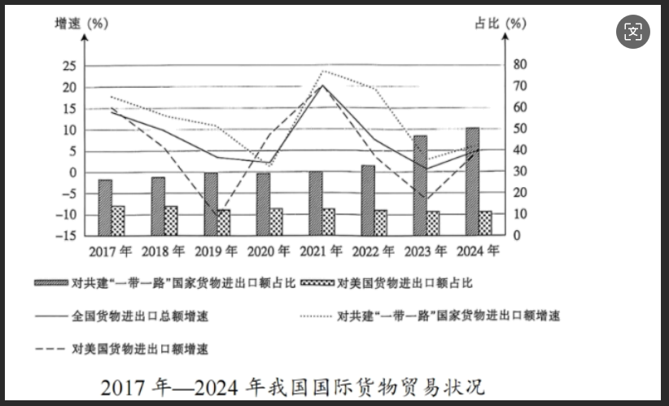

**参照机密等级管理·启用前**

**江西省2025年普通高中学业水平选择性考试思想政治试卷**

**注意事项：**

**1．答卷前，考生务必将自己的姓名、考生号等填写在试卷、答题卡上。**

**2．回答选择题时，选出每小题答案后，用2B铅笔把答题卡上对应题目的答案标号涂黑。如需改动，用橡皮擦干净后，再选涂其他答案标号。回答非选择题时，将答案写在答题卡上。写在本试卷上无效。**

**3．考试结束后，将本试卷和答题卡一并交回。**

**一、选择题：本题共15小题，每小题3分，共45分。在每小题给出的四个选项中，只有一项符合题目要求。**

1\. 《共产党宣言》指出：“共产党人的理论原理，决不是以这个或那个世界改革家所发明或发现的思想、原则为根据的。”“这些原理不过是现存的阶级斗争、我们眼前的历史运动的真实关系的一般表述。”对此理解正确的是（ ）

A. 共产党人的理论完全不同于以往任何“世界改革家”

B. 马克思主义揭示了资本主义社会的阶级斗争及其趋势

C. 适应无产阶级斗争的需要是马克思主义科学性的基础

D. 马克思主义理论的历史使命是认识人类社会发展规律

【答案】B

【解析】

【详解】A：学习和掌握马克思主义的世界观和方法论，必须从整体上把握马克思主义的理论特质。马克思主义的三大组成部分——马克思主义哲学、政治经济学和科学社会主义分别来源于德国古典哲学、英国古典政治经济学和空想社会主义，是对以往“世界改革家”的思想理论的批判继承和发展，其在理论内容上并不是完全不同于以往“世界改革家”，A排除。

B：时代是思想之母，实践是理论之源。马克思主义基于资本主义产生以来无产阶级反抗资产阶级的斗争实践，科学阐明了资本主义的内在矛盾和无产阶级的历史使命，揭示了社会主义代替资本主义的历史必然性，为无产阶级斗争指明了正确方向，B正确。

C：马克思主义之所以是科学，就在于其对所处时代和世界的深入考察，深刻揭示了人类社会发展规律，从而能够为无产阶级斗争提供科学思想武器。适应无产阶级斗争的需要，是马克思主义具有科学真理性的必然结果，而不是基础，C排除。

D：正如马克思所言，“哲学家们只是用不同的方式解释世界，问题在于改变世界”。马克思主义理论的历史使命，不仅是要通过揭示人类社会发展规律来指导人们正确认识世界，更重要的是发挥科学理论的作用指导人们更好地改造世界，指引人类社会最终实现共产主义，D排除。

故本题选B。

2．（缺失）

2\. 2024年，全国人大常委会对所有提请审议的法律案都进行了合宪性审查；对报送备案的2146件法规、规章、司法解释等规范性文件开展主动审查，对公民、组织提出的5682件审查建议逐一研究并依法反馈，推动和督促制定机关纠正处理各类规范性文件1040件。这表明（ ）

A. 全国人大常委会依法积极行使国家立法权

B. 合宪性审查是保证宪法法律实施的根本途径

C. 备案审查对维护国家法治统一发挥重要作用

D. 各种法规须经全国人大常委会审查批准后生效

【答案】C

【解析】

【详解】A：材料主要强调的是全国人大常委会进行合宪性审查、备案审查等工作，行使的是监督权，而非行使国家立法权(立法权侧重于制定、修改、废止法律等活动)，A错误。

B：宪法法律实施的根本保证是党的领导和人民群众的遵守，合宪性审查是重要途径，但不是“根本途径”，B错误。

C：材料中全国人大常委会对大量法规、规章等规范性文件开展备案审查，还推动纠正处理相关文件，这体现出备案审查对维护国家法治统一(确保各类规范性文件符合宪法法律形成统一法治体系)发挥重要作用，C正确。

D：并非所有法规都须经全国人大常委会审查批准后生效，“各种法规须经全国人大常委会审查批准后生效”说法绝对化，比如国务院制定的行政法规等，有自身的生效程序，D错误。

故本题选C。

3\. “制定实施中央八项规定，是我们党在新时代的徙木立信之举，必须常抓不懈、久久为功”，2025年3月，党中央决定在全党开展深入贯彻中央八项规定精神学习教育。锲而不舍落实中央八项规定精神（ ）

①说明“作风建设永远在路上”

②彰显共产党人“革命理想高于天”

③确保党的创新理论“飞入寻常百姓家”

④昭示“解决大党独有难题的清醒和坚定”

A. ①② B. ①④ C. ②③ D. ③④

【答案】B

【解析】

【详解】①④：中央八项规定是中国共产党加强作风建设、推进全面从严治党的核心制度之一，必须常抓不懈、久久为功。锲而不舍落实中央八项规定精神说明“作风建设永远在路上”，展现了对“解决大党独有难题”的清醒认知和坚定决心（如如何永葆先进性和纯洁性、如何防范脱离群众风险等），体现了自我革命的勇气，①④正确。

②：本项强调理想信念的重要性，而题干聚焦作风建设的具体实践（中央八项规定），②排除。

③：本项强调理论宣传的通俗化、大众化，材料没涉及，③排除。

故本题选B。

4\. 遵义会议作为我们党历史上一次具有伟大转折意义的重要会议，在把马克思主义基本原理同中国具体实际相结合、坚持走独立自主道路、坚定正确的政治路线和政策策略、建设坚强成熟的中央领导集体等方面，留下宝贵经验和重要启示。运用好遵义会议历史经验，走好新时代的长征路，我们要（ ）

①根据形势变化灵活选择国家的发展道路

②坚持把国家和民族发展放在自己力量的基点上

③强化“核心意识”，不断凝聚团结奋斗的强大合力

④不断解放思想，在全面深化改革中破立并举、先破后立

A. ①② B. ①④ C. ②③ D. ③④

【答案】C

【解析】

【详解】①：“灵活选择国家的发展道路”表述错误，我国坚持走中国特色社会主义道路，这是历史和人民的选择，具有确定性，并非“灵活选择”，①不选。

②：遵义会议强调“坚持走独立自主道路”，这启示我们要坚持把国家和民族发展放在自己力量的基点上，不断推进中国式现代化的发展，②正确。

③：材料中指出遵义会议强调要建设坚强成熟的中央领导集体，这启示我们要强化“核心意识”，不断凝聚团结奋斗的强大合力，③正确。

④：遵义会议聚焦纠正错误路线、确立正确方向，而非"破立"的方法论，且在全面深化改革中破立并举、先立后破，④不选。

故本题选C。

5\. 1978年，党中央作出建设“三北”防护林工程的战略决策。新疆各族干部群众依托“三北”防护林工程建设，因地制宜探索出“生物治沙”“光伏治沙”“梯田式治沙”等防沙治沙方式；经过46年的不懈努力，绿色阻沙防护带成功锁边“合龙”，给塔克拉玛干沙漠系上一条3046公里的“绿围脖”。以下正确的是（ ）

①建设“三北”防护林工程是遵循客观规律的战略决策

②多样化防沙治沙是坚持世界统一于物质的必然要求

③46年不懈努力表明坚定意志是创造和实现价值的前提

④防护带锁边“合龙”是发挥主观能动性的必然结果

A. ①② B. ①③ C. ②④ D. ③④

【答案】A

【解析】

【详解】①：建设“三北”防护林工程是基于我国北方防沙治沙的客观实际和自然规律作出的战略决策，体现了遵循客观规律，①正确。

②：世界统一于物质，多样化防沙治沙是从实际出发、尊重物质统一性的必然要求，②正确。

③：社会提供客观条件是创造和实现价值的前提，坚定意志是创造和实现价值的重要因素，但不是前提，③错误。

④：防护带成功锁边“合龙”是发挥主观能动性与尊重客观规律相结合的结果，并非单纯发挥主观能动性的必然结果，④错误。

故本题选A。

2025年年初，《哪吒之魔童闹海》在海内外电影市场大放异彩。该电影改编自传统的“哪吒闹海”故事，从经典文学作品中选取主要人物和情节，结合现代人的生活境遇和情感心理，赋予故事人物新的形象特征；汲取三星堆青铜器、侗族大歌等传统文化元素，并运用前沿的现代电影工业技术，让海内外观众更直观地感受到中华文化的生命力与艺术张力。据此回答下列问题。

6\. 哪吒形象的历史演变说明（ ）

①传统的“哪吒闹海”故事为人物形象塑造提供了直接经验

②不同时期的哪吒形象是社会存在变化发展的反映

③哪吒形象的时代表达体现了社会意识的历史继承性

④哪吒形象的创作归根结底是人民群众智慧的产物

A. ①② B. ①④ C. ②③ D. ③④

7\. 《哪吒之魔童闹海》大放异彩，给我们的启示是（ ）

①文艺创作要在内容和形式的融合上进行深度创新

②发展文化产业是满足人民精神文化需求的基本途径

③优秀文化产品的国际传播有利于提升国家文化软实力

④推动中华文化走出去是我们在新时代新的文化使命

A. ①② B. ①③ C. ②④ D. ③④

【答案】6. C 7. B

【解析】

【6题详解】

①：“直接经验”表述错误，传统故事属于间接经验，并非直接经验，①不选。

②：电影结合“现代人的生活境遇和情感心理”赋予哪吒新形象，说明社会存在（时代背景、人们的生活与心理）的变化会推动社会意识（哪吒形象）的演变，②正确。

③：电影“从经典文学作品中选取主要人物和情节”“汲取三星堆青铜器等传统文化元素”，在继承传统哪吒故事核心的基础上进行创新，体现了社会意识对历史文化的继承，③正确。

④：哪吒形象作为一种文化，归根结底是实践的产物，④不选。

故本题选C。

【7题详解】

①：《哪吒之魔童闹海》改编自传统故事，结合现代人的生活境遇和情感心理，赋予人物新形象特征，同时汲取传统文化元素，运用现代电影工业技术，在内容和形式上都进行了深度创新，这是其成功的重要原因，①正确。

②：题干主要强调的是《哪吒之魔童闹海》的创作与传播所带来的启示，文化事业是满足人民群众基本文化需求的基本途径，②不选。

③：该电影在海内外电影市场大放异彩，让海内外观众感受到中华文化的生命力与艺术张力，体现了优秀文化产品的国际传播有利于提升国家文化软实力，③正确。

④：题干重点在于电影的创作创新以及其在国内外市场的影响，没有直接体现推动中华文化走出去是新时代新的文化使命，④不符合题意。

故本题选B。

9．（缺失）

8\. 近年来，面对单边主义、保护主义抬头，中国经济迎难而上，顶住了外部压力，克服了内部困难，以高质量发展的确定性应对外部环境急剧变化的不确定性。下图说明（ ）

①我国积极应对逆全球化保持国际货物贸易正增长

②我国扩大高水平对外开放提升了贸易投资合作质量

③我国与共建“一带一路”国家货物贸易持续增长

④中美货物贸易增速始终低于我国对外货物贸易增速

A. ①③ B. ①④ C. ②③ D. ②④

【答案】A

【解析】

【详解】①：从图表中可以看到，全国货物进出口总额增速为正，特别是在2021年有大幅增长，说明我国确实保持了国际货物贸易的正增长。因此，①正确。

②：虽然图表显示我国与共建“一带一路”国家的货物贸易占比增加，但图表并未直接提供贸易投资合作质量的信息，②排除。

③：图表显示，对共建“一带一路”国家货物进出口额占比总体呈上升趋势，说明货物贸易持续增长，③正确。

④：图表中显示，在某些年份（如2021年左右），对美国货物贸易额增速是高于全国货物进出口总额增速（我国对外货物贸易增速可由全国货物进出口总额增速体现）的，并非“始终低于”，④排除。

故本题选A

9\. “全球南方”群体性崛起，是世界大变局的鲜明标志。一大批新兴市场国家和发展中国家在发展领域互帮互助，在国际舞台相互支持，在文明交流中互学互鉴，成为国际秩序变革的关键力量。“全球南方”蓬勃发展（ ）

①推动了全球治理体系朝着更加公正合理的方向发展

②增强了发展中国家在国际事务中的话语权和影响力

③表明区域性国际组织在全球治理中的作用日益突出

④搭建了中国同各国团结合作实现共同目标的新平台

A. ①② B. ①③ C. ②④ D. ③④

【答案】A

【解析】

【详解】①：“全球南方”是新兴市场国家和发展中国家的集合体。“全球南方”国家有着许多共同特点：独立自主是“全球南方”的政治底色，发展振兴是“全球南方”的历史使命，公道正义是“全球南方”的共同主张。当前“全球南方”概念之所以受到国际社会的极大关注，是由于一大批发展中国家呈现快速发展的态势，它们在世界经济和国际政治中的地位显著提升。“全球南方”在国际政治中已经成为维护国际和平、带动世界发展、完善全球治理的关键力量。故选项①正确。

②：近年来，亚洲、非洲、拉丁美洲等地区国家经济快速增长，人民生活水平不断提高，如今的“全球南方”，经济总量全球占比超过了40%，对世界经济增长的贡献率达到了80%。“全球南方”经济实力增强，在国际金融、贸易等领域地位提升，推动国际力量对比朝着更加平衡的方向发展，在国际事务中日益提升了影响力和话语权。故选项②正确。

③：无论是第三世界国家，还是发展中国家、新兴市场国家，抑或是“全球南方”国家，都不是一个国际组织或者国家集团，而是有着不同发展程度、文化传统、价值观念的国家群体。故选项③错误。

④：作为“全球南方”大家庭的重要成员，中国始终同其他发展中国家同呼吸、共命运，加强与其他“全球南方”国家的团结合作。在现有全球治理体系中，“全球南方”的代表性严重不足。中国必须高举和平、发展、合作、共赢的旗帜，始终坚持维护世界和平、促进共同发展的外交政策宗旨，坚定不移在和平共处五项原则基础上同各国（不仅限于其他“全球南方”国家）发展友好合作，未涉及搭建新平台，故选项④错误。

故本题选A。

10\. 2024年3月，在校大学生甲在某公司实习，公司与甲口头约定，待甲取得毕业证书后再签订正式劳动合同。同年7月，甲取得毕业证书后，公司却以各种借口未与其签订书面劳动合同。2个月后，公司以甲业绩排名末位为由将其辞退，并扣除一个月工资。甲向劳动行政部门投诉。本案中（ ）

①甲与公司不成立劳动关系

②公司辞退甲应支付经济补偿或赔偿金

③因甲业绩排名末位，公司辞退甲的行为合法

④劳动行政部门应责令公司向甲支付克扣的工资

A. ①③ B. ①④ C. ②③ D. ②④

【答案】D

【解析】

【详解】①：甲在公司实习时，公司与其约定在甲取得毕业证后签订正式劳动合同。从题干中还可以推知，甲在2024年7月就已经告知公司其已取得毕业证，并要与公司签订书面劳动合同。虽然直到甲被辞退，公司也未与其签订书面劳动合同，但并不影响两者之间事实劳动关系的成立。根据《中华人民共和国劳动合同法》第七条的规定，用人单位自用工之日起即与劳动者建立劳动关系。由此可知，甲与公司之间已形成劳动关系。故选项①错误。

②：根据《劳动合同法》第八十七条的规定，用人单位违法解除或终止劳动合同关系的，劳动者有权请求用人单位支付经济补偿或赔偿金。故选项②正确。

③：根据《劳动合同法》第三十九条、第四十条的规定，用人单位可单方解除劳动合同的法定情形中并不包括“末位淘汰”的情形。虽然甲的业绩排名末位，但公司不能以此为由将其辞退。故选项③错误。

④：劳动者提供了劳动或者履行了劳动合同约定的义务后，用人单位须依法依约支付工资。根据《中华人民共和国劳动法》第五十条和第九十一条及《劳动合同法》第八十五条的规定，用人单位克扣劳动者工资的，由劳动行政部门责令支付劳动者的工资报酬。故选项④正确。

故本题选D

11\. 2025年3月20日，甲搬家时将一张借条托好友乙保管。该借条由丙亲笔书写并签名：“借条今借到甲现金叁万圆整。借款人：丙2022年5月18日”。2个月后，甲请求乙归还借条，乙找寻多次无果后称借条已不慎遗失。下列正确的是（ ）

①乙应当赔偿甲3万元

②甲、丙之间借款关系中，借条属于书证

③甲仍有权请求丙清偿3万元的借款

④甲、丙之间债务的诉讼时效已届满

A. ①③ B. ①④ C. ②③ D. ②④

【答案】C

【解析】

【详解】①：乙接受甲的委托保管借条，双方之间形成保管合同关系。此时，乙作为保管人，负有妥善保管借条的义务。该案中，乙未尽到保管义务，可能需要赔偿甲因证据丢失而造成的损失（如诉讼成本等），但并非直接赔偿借款本金3万元。因为借款债务人是丙，因此乙的赔偿责任仅限于保管过失，而非债务本身，①排除。

②：书证是以文字、符号等表达的思想内容证明案件事实的证据。借条由丙亲笔书写，载明借款金额、借款人和日期，能直接证明甲、丙之间的借款关系，因此属于书证，②正确。

③：借款合同是甲与丙之间的法律关系，借条遗失并不影响该合同的效力。只要借款事实存在，甲仍有权通过其他证据向丙主张还款，③正确。

④：借款合同的诉讼时效为3年，自甲知道或应当知道权利被侵害之日起计算。本案中，借款发生于2022年5月18日，虽然至2025年5月甲请求乙归还借条时已逾3年，但因甲丙未约定还款期限，因此诉讼时效应从债权人甲主张权利时起算。题干未表明甲曾向丙主张权利，故诉讼时效未起算或未届满，④排除。

故本题选C。

12\.

<table style="width:85%;">
<colgroup>
<col style="width: 85%" />
</colgroup>
<tbody>
<tr>
<td style="text-align: left;">
所有读《论语》都读了《老子》

有些读《老子》的也读了《史记》

所有不读《诗经》的都不读《老子》
</td>
</tr>
</tbody>
</table>

据此，以下必然为真的是（ ）

A. 有些读《史记》的不读《老子》

B. 有些读《史记》的读了《论语》

C. 有些读《诗经》的不读《论语》

D. 有些读《诗经》的读了《史记》

【答案】D

【解析】

【详解】题干已知条件为：①所有读《论语》的都读了《老子》(全称肯定判断)；②有些读《老子》的也读了《史记》(特称肯定判断)；③所有不读《诗经》的都不读《老子》(可视作全称否定判断)。 为方便推理，我们可将③进行换位推理，得到与其等值的判断——“所有读《老子》的都不是不读《诗经》”，即“④所有读《老子》的都读《诗经》”（“所有读《老子》的都不是不读《诗经》”进行换质推理可得）。

A：对选项A 的判断要依据②，将②进行换质可得“有些读《老子》的不是不读《史记》”；将②进行换位换质连续推理可得“有些读《史记》的也读了《老子》”“有些读《史记》的不是不读《老子》”，A选项的判断无法得出，故选项A错误。

B：对选项 B 的判断要依据①②，①②中的“读《老子》”作为三段论的中项，在两个前提中都不周延，犯了“中项不周延”的错误，所以大项和小项的关系就不能确定，结论就不能必然得出，故选项B错误。

C：对选项C的判断要依据①③，由于④是③的等值命题，为方便推理，我们可以直接依据①④来判断C选项。由①④并根据三段论推理可得“所有读《论语》的都读《诗经》”，再继续换位推理可得“⑤有些读《诗经》的读了《论语》”，将⑤进行直接换质推理可得“有些读《诗经》的不是不读《论语》”，再将⑤进行连续换位换质推理依次可得“有些读《论语》的读了《诗经》”“有些读《论语》的不是不读《诗经》”，C选项的判断无法推出，故C选项错误。

D：选项D的判断要依据②③，为方便推理，我们直接依据②④并运用三段论推理可得“有些读《诗经》的读了《史记》”，D正确。

故本题选D。

13\. 某中学举行第三十二届田径运动会，表现突出的参赛选手将被授予“体育道德风尚奖”。有人对获奖结果作了如下预测：

<table style="width:85%;">
<colgroup>
<col style="width: 85%" />
</colgroup>
<tbody>
<tr>
<td style="text-align: left;">
甲：要么小亮获奖，要么小玲获奖。

乙：只有小明获奖，小红才能获奖。

丙：我认为小明不能获奖，而小红一定获奖。

丁：如果小亮获奖，那么小明和小红至少一人获奖。
</td>
</tr>
</tbody>
</table>

结果表明，只有一人预测正确。据此，可以必然推出的是（ ）

A. 甲正确，小亮获奖 B. 乙正确，小玲获奖

C. 丙正确，小红获奖 D. 丁正确，小明获奖

【答案】B

【解析】

【详解】ABCD：乙的表述“只有小明获奖，小红才能获奖”，丙的表述“小明不能获奖，而小红一定获奖”，这两者相互矛盾，所以乙和丙之中必有一真一假。 因为只有一人预测正确，所以甲和丁的话必然为假。 甲说“要么小亮获奖，要么小玲获奖”这是一个不相容选言判断，若该判断为假，意味着小亮和小玲的获奖情况是“都获奖”或者“都不获奖”。 丁说 “如果小亮获奖，那么小明和小红至少一人获奖”为假，其矛盾命题“小亮获奖且小明和小红都不获奖”为真，所以可以确定小亮获奖，同时小明和小红都不获奖。 由于小亮获奖，再结合甲的话为假，可推出小玲也获奖。 又因为小明和小红都不获奖，乙的话“只有小明获奖，小红才能获奖”（必要条件假言判断，否前必否后）是正确的；而丙的话因为小红没获奖，所以是错误的。 综上，乙正确，小玲获奖，B符合题意，ACD均与题意不符。

故本题选B。

**二、非选择题：本题共3小题，共55分。**

14\. 阅读材料，完成下列要求

长期以来，海洋塑料污染一直是全球性的治理难题。2020年，浙江省率先探索出“市场化垃圾收集-高值化资源利用-国际化认证增值”海洋塑料污染治理“蓝色循环”模式。该模式始于海洋垃圾收集点，通过回收企业进行市场化收购，沿海居民、渔民参与收集，建立立体收集网络；依托物联网和区块链等技术，实现“储存—处置—运输—再生制造”全流程可视化，生成再生塑料的溯源码，标定碳足迹，获得国际权威机构认证。当地企业与国际企业签订产销合同，打开国际海洋塑料再利用的高端市场，品牌商以高于传统再生塑料约165%的价格进行采购回收，实现国际化认证增值。

政府引导组建的“蓝色联盟”组织，提取海洋塑料高值利用溢价的20%，设立“共富基金”。该基金用于提高回收价格、缴纳社保等，并提供物资补贴、绿色信贷等增值服务。“蓝色循环”模式兼顾治理海洋塑料污染、挖掘经济效益和推动共同富裕，实现了生态与富民共赢，为破解海洋塑料污染治理难题提供了中国方案。2023年，该模式获得联合国“地球卫士奖”。

结合材料并运用《经济与社会》知识，说明“蓝色循环”模式如何通过市场机制破解海洋塑料污染治理难题。

【答案】

①发挥价格机制作用。提高回收价格，增加供给量，实现市场化收集。②以市场为导向。技术赋能垃圾的再生成过程，提高竞争优势，满足高段市场需求，实现高值利用。③充分发挥市场在资源配置中的决定作用，实现资源的有效配置，提高海洋污染治理效能，更好的发挥政府的作用，通过“共富基金”，完善收入分配，激发多元主体活力，为维护海洋生态治理提供动力。

【解析】

【分析】背景素材：海洋塑料污染

考点考查：社会主义市场经济体制的相关知识

能力考查：描述和阐释事物、论证和探究问题

核心素养：政治认同、科学精神

【详解】第一步：审设问。明确主体、作答范围、问题限定和作答角度。

本题为措施类主观题，设问要求说明“蓝色循环”模式如何通过市场机制破解海洋塑料污染治理难题，要求运用社会主义市场经济体制的知识来分析作答。

第二步：审材料，通过标点符号、段落等，提取材料有效信息。

有效信息①：模式始于海洋垃圾收集点，通过回收企业进行市场化收购，沿海居民、渔民参与收集，建立立体收集网络；品牌商以高于传统再生塑料约165%的价格进行采购回收→可运用社会主义市场经济体制的知识，从发挥价格机制作用的角度分析说明通过提高回收价格，实现市场化收集。

有效信息②：依托物联网和区块链等技术，实现“储存—处置—运输—再生制造”全流程可视化，生成再生塑料的溯源码，标定碳足迹，获得国际权威机构认证。当地企业与国际企业签订产销合同，打开国际海洋塑料再利用的高端市场，品牌商以高于传统再生塑料约165%的价格进行采购回收，实现国际化认证增值→可以市场为导向的角度，说明技术赋能垃圾的再生成过程，实现高值利用。

有效信息③：该模式始于海洋垃圾收集点，通过回收企业进行市场化收购，沿海居民、渔民参与收集，建立立体收集网络……当地企业与国际企业签订产销合同，打开国际海洋塑料再利用的高端市场；政府引导组建的“蓝色联盟”组织，提取海洋塑料高值利用溢价的20%，设立“共富基金”。该基金用于提高回收价格、缴纳社保等，并提供物资补贴、绿色信贷等增值服务→可从充分发挥市场在资源配置中的决定作用、更好的发挥政府的作用的角度分析说明。

第三步：整合信息，组织答案。注意设问限定以及教材知识与材料、时政信息等相结合。

15\. 阅读材料，完成下列要求

2000年7月1日起施行的《中华人民共和国立法法》规定，省、自治区、直辖市的人民代表大会及其常务委员会根据本行政区域的具体情况和实际需要，在不同宪法、法律、行政法规相抵触的前提下，可以制定地方性法规。

江西省是长江中下游地区湿地资源最丰富的省份之一。为加强湿地保护，促进湿地资源可持续利用，早在2012年3月，江西省人大常委会就通过了《江西省湿地保护条例》（以下简称“《条例》”）。这是我国关于湿地保护较早的地方性法规之一，为国家湿地保护立法进行了先行探索。2021年12月24日，《中华人民共和国湿地保护法》正式出台，为强化湿地保护和修复提供了法律依据。2024年9月，江西省人大常委会依法对《条例》进行了修订，全面对标对表《湿地保护法》规定，进一步健全完善了湿地保护体制机制，努力解决湿地保护实践工作中的现实困难和突出问题；同时，对“鄱阳湖湿地保护的特别规定”专章内容进行修改完善，进一步突显了鄱阳湖湿地保护的重要性和特殊性。《条例》的深入实施将为赣鄱湿地保护提供更加坚实的法治保障，为全国湿地保护事业高质量发展提供更多的“江西经验”

结合材料并运用“全面依法治国”知识，分析地方立法在我国社会主义法治建设中的作用。

【答案】①有利于有效贯彻实施国家法律规定。修订后的《条例》以《湿地保护法》为依据，可推动和保障《湿地保护法》在江西落地生效。②有利于完善我国社会主义法律体系。《条例》结合江西实际补充和细化了《湿地保护法》的规定，是对我国湿地保护法律体系的丰富和完善。③有利于更好地落实科学立法的要求。《条例》的制定和修改突出了地方立法解决实际问题的探索创新，对科学制定和完善《湿地保护法》具有先行探索作用。

【解析】

【分析】背景素材：《江西省湿地保护条例》的修订

考点考查：全面依法治国的相关知识

能力考查：描述和阐释事物、论证和探究问题

核心素养：政治认同、法治意识

【详解】第一步：审设问。明确主体、知识范围、问题限定和作答角度。

本题为作用意义类主观题，设问要求运用“全面依法治国”知识，分析地方立法在我国社会主义法治建设中的作用。需要调用科学立法等相关知识，结合材料分析作答。

第二步：审材料。提取有效信息，链接教材知识。

有效信息①：江西省对照《湿地保护法》及时修订地方条例，既维护了法治统一，也推动和保障了《湿地保护法》在江西落地生效→可联系科学立法的知识，说明修订后的《条例》以《湿地保护法》为依据，有利于有效贯彻实施国家法律规定。

有效信息②：江西省人大常委会依法对《条例》进行了修订，全面对标对表《湿地保护法》规定，进一步健全完善了湿地保护体制机制，努力解决湿地保护实践工作中的现实困难和突出问题→可联系科学立法的知识，说明《条例》结合江西实际补充和细化了《湿地保护法》的规定，有利于完善我国社会主义法律体系。

有效信息③：根据《中华人民共和国立法法》规定，江西在湿地保护立法领域的先行探索，通过了《江西省湿地保护条例》，并在《中华人民共和国湿地保护法》正式出台后对《条例》进行修订，为全国湿地保护事业高质量发展提供更多的“江西经验”→可联系科学立法的知识，说明《条例》的制定和修改突出了地方立法解决实际问题的探索创新，有利于更好地落实科学立法的要求。

第三步：整合信息，组织答案。注意设问限定以及教材知识与材料相结合。

16\. 阅读材料，完成下列要求

甲救助了一只流浪狗，购置了狗笼、狗粮等物品，并为狗注射了疫苗一年后，甲因工作繁忙便让好友乙帮忙照顾狗，并经常去探望。某日，乙在公园遛狗。在公园游玩的丙（10周岁）取得乙同意后，与狗一起玩闹，朝狗大声叫喊。不料，狗突然挣脱绳索狂跑。路过的丁受到惊吓，躲闪中不慎跌倒骨折，用去医疗费若干元。

运用《法律与生活》知识，回答本案中丁有权向哪些民事主体请求赔偿并说明理由。

【答案】丁有权向甲、乙和丙的监护人请求赔偿。

理由如下：

①乙作为直接管理人应承担主要责任。乙作为甲委托的实际照顾人，在遛狗时未有效控制犬只（未使用足够强度的牵引绳或未及时制止打闹行为），导致狗挣脱绳索引发事故。根据《民法典》第1245条，动物饲养人或管理人应当对动物造成的损害承担侵权责任。乙作为实际管理人，未能履行安全管理义务，需对丁的损害承担直接赔偿责任。

②丙的监护人可能承担部分责任。丙（10周岁）为限制民事行为能力人，其故意逗弄、大声叫喊的行为刺激了狗，是损害发生的诱因之一。 根据《民法典》第1188条，限制民事行为能力人造成他人损害的，由监护人承担侵权责任。丙的监护人需对丙的行为后果负责。

③甲作为饲养人承担补充责任。甲虽将狗交由乙照顾，但根据《民法典》第1249条，动物饲养人不得通过委托管理完全免除责任。甲作为狗的原始救助者和饲养人，需对乙的管理行为承担监督责任。若乙无力赔偿，甲应承担补充赔偿责任。但甲可向乙追偿其已支付的部分。

【解析】

【分析】背景素材：人身权侵权案例

考点考查：民事权利与义务、父母对未成年子女的义务和责任等知识

能力考查：描述和阐释事物、论证与探究问题

核心素养：政治认同、法治意识

【详解】第一步：审设问。明确主体、知识范围、问题限定和作答角度。本题为分析说明类试题，要求回答本案中丁有权向哪些民事主体请求赔偿并说明理由。考查《法律与生活》的知识，需要调用民事权利与义务、父母对未成年子女的义务和责任等知识。结合材料分析说明。

第二步：审材料。提取关键信息，链接教材知识。

关键信息①：甲因工作繁忙便让好友乙帮忙照顾狗，并经常去探望。某日，乙在公园遛狗时，造成丁受伤→可联系《民法典》第1245条，动物饲养人或管理人应当对动物造成的损害承担侵权责任。说明乙作为实际管理人，未能履行安全管理义务，需对丁的损害承担直接赔偿责任。

关键信息②：在公园游玩的丙（10周岁）与狗一起玩闹，朝狗大声叫喊，导致狗突然挣脱绳索狂跑，造成丁受伤→可联系《民法典》第1188条，限制民事行为能力人造成他人损害的，由监护人承担侵权责任。说明丙为限制民事行为能力人，其监护人需对丙的行为后果负责。

关键信息③：甲救助了一只流浪狗，因工作繁忙便让好友乙帮忙照顾狗→可联系《民法典》第1249条，动物饲养人不得通过委托管理完全免除责任。说明甲作为狗的原始救助者和饲养人，需对乙的管理行为承担监督责任。若乙无力赔偿，甲应承担补充赔偿责任。但甲可向乙追偿其已支付的部分。

第三步：整合信息，组织答案。

17\. 阅读材料，完成下列要求

人工智能正深刻改变世界。如何看待人工智能带来的影响，成为我们必须深入思考和回答的重要课题。近日，某班开展了“人工智能与未来发展”主题讨论会，方方和圆圆通过了解人工智能的发展状况，为其“画像”。

人工智能是“推进器”。它赋能传统产业转型升级，让“中国制造”加速迈向“中国智造”；促进智能穿戴、智能家居等新兴产业蓬勃发展，创造出新的经济增长点和就业岗位。人工智能还深入到医疗、教育、交通等领域，有利于提升生活品质。

人工智能是“危险品”。它输出的虚假信息会造成误导，算法推荐可能导致“信息茧房”。长期过度依赖人工智能会使人产生孤独和焦虑等不良情绪，削弱人的社会适应能力。“人工智能+”落地运用会影响社会分工，可能使部分劳动者面临失业或转型危机。

（1）运用《逻辑与思维》中辩证思维知识，评析两位同学所提交的“画像”。

（2）结合材料并运用“社会历史发展的规律”知识，分析人工智能对生产方式带来的深刻影响。

【答案】（1）

①辩证思维要求坚持分析与综合相结合的方法。方方分析了人工智能的优点，综合得出其为“推进器”，圆圆分析了人工智能的缺点，综合得出其为“危险品”，两人都运用了分析与综合相结合的方法。②辩证思维强调整体性。要求我们全面的观点看问题。方方和圆圆分别只从人工智能的优点和缺点去看问题，没有从整体上全面的看问题，具有片面性。③辩证思维要求我们不能简单肯定一切或者简单否定一切，要坚持辩证的否定观。方方、圆圆分别犯了简单肯定和简单否定的错误，陷入了极端思维方式。④综合所述，我们要发挥人工智能的合理因素，克服其消极因素，推动人工智能健康发展。

（2）

①生产方式是生产力和生产关系的总和。②人工智能能够促进生产力的发展。人工智能提高生产自动化程度，改变脑力与体力的比列，优化劳动力结构，从而改变社会生产力的构成要素。人工智能代替人的部分脑力劳动，给人们的劳动形式带来根本性变革。③人工智能加速生产关系的变革。人工智能推动传统产业现代化，改变社会经济结构，推动生产规模扩大，促使生产分工和协作，广泛发展并提高生产社会化程度，最终导致生产关系的变革。

【解析】

【分析】背景素材：人工智能的影响

考点考查：辩证思维方法、社会历史的发展

能力考查：描述和阐释事物、论证和探究问题

核心素养：政治认同、科学精神

【小问1详解】

第一步：审设问。明确主体、作答范围、问题限定和作答角度。

本题的设问要求评析两位同学所提交的“画像”。属于辨析类试题，需要调用辩证思维方法的有关知识分析作答。

第二步：审材料。提取有效信息，链接教材知识。

有效信息：方方：人工智能是“推进器”。它赋能传统产业转型升级，让“中国制造”加速迈向“中国智造”；促进智能穿戴、智能家居等新兴产业蓬勃发展，创造出新的经济增长点和就业岗位。人工智能还深入到医疗、教育、交通等领域，有利于提升生活品质；圆圆：人工智能是“危险品”。它输出的虚假信息会造成误导，算法推荐可能导致“信息茧房”。长期过度依赖人工智能会使人产生孤独和焦虑等不良情绪，削弱人的社会适应能力。“人工智能+”落地运用会影响社会分工，可能使部分劳动者面临失业或转型危机→可从辩证思维要求坚持分析与综合相结合的方法的角度，说明两人都运用了分析与综合相结合的方法；可从辩证思维强调整体性。要求我们全面的观点看问题的角度说明，两人分别只从人工智能的优点和缺点去看问题，没有从整体上全面的看问题，具有片面性；可从辩证思维要求我们不能简单肯定一切或者简单否定一切，要坚持辩证的否定观的角度，说明两人分别犯了简单肯定和简单否定的错误，陷入了极端思维方式。

最后，可从对于人工智能我们该怎么做的角度进行总结。

第三步：整合信息，组织答案。

【小问2详解】

第一步：审设问。明确主体、作答范围、问题限定和作答角度。

本题为材料分析类主观题，要求运用《哲学与文化》知识，分析人工智能对生产方式带来的深刻影响。具体可运用生产力与生产关系的知识作答。

第二步：审材料，通过标点符号、段落等，提取材料有效信息。

有效信息①：运用“社会历史发展的规律”知识、生产方式→可联系生产方式是生产力和生产关系的总和。

有效信息②：“人工智能+”落地运用会影响社会分工，可能使部分劳动者面临失业或转型危机→可从人工智能能够促进生产力的发展的角度分析。

有效信息③：它赋能传统产业转型升级；促进智能穿戴、智能家居等新兴产业蓬勃发展，创造出新的经济增长点和就业岗位。人工智能还深入到医疗、教育、交通等领域，有利于提升生活品质→可从人工智能加速生产关系的变革的角度分析。

第三步：整合信息，组织答案。注意设问限定以及教材知识与材料、时政信息等相结合。

18\. 阅读材料，完成下列要求。

中国和越南是山水相连的社会主义友好邻邦。中越关系的根基在人民、未来在青年。2024年10月中旬，以“续传统友谊，携手开创未来，为主题的第23届中越青年友好会见活动在广西南宁举办，来自中国和越南的约200名青年代表参加相关活动。活动期间，越南青年代表走进社区、学校、企业、产业园区、博物馆，开展参观考察、座谈交流、文化体验等活动，为推动构建中越命运共同体凝聚了青年共识。

运用《当代国际政治与经济》知识，以“青年与中越关系的未来”为主题，就上述活动写一篇短评。要求：观点明确；逻辑清晰；表述规范；200字以内。

【答案】 中越青年交流活动是夯实两国关系民意基础、推动构建中越命运共同体的重要实践。中越同为社会主义国家，青年互动深化制度认同，为双边关系注入稳定性。通过文化体验与基层走访，增进了“民相亲”的友好情感，有利于筑牢两国关系社会根基。青年考察产业与科技合作，为未来经济共荣培育共识，契合人类命运共同体理念。青年作为国家未来，其共识凝聚将直接推动中越战略互信与区域和平发展。

青年在传承中越传统友谊、引领时代合作中发挥关键作用，要践行新时代国际关系理念。用欣赏、互鉴、共享的观点看待中越关系，推动中越文明交流互鉴、和谐共生，积极为构建中越命运共同体添砖加瓦。

【解析】

【分析】背景素材：构建人类命运共同体

考点考查：国际视野及国际人才

能力考查：描述和阐释事物、论证和探究问题

核心素养：政治认同、科学精神、公共参与

【详解】第一步：审设问。明确主体、知识范围、问题限定和作答角度。本题的设问为论述题，要求写一篇短评，可以从青年对中越关系的未来的重要性及应如何做的角度进行撰写。

第二步：审材料。提取关键词，链接教材知识。

关键词①：中越关系的根基在人民、未来在青年→可联系中越青年交流活动是夯实两国关系民意基础、推动构建中越命运共同体的重要实践。

关键词②：中国和越南是社会主义友好邻邦。越南青年代表走进社区、学校、企业、产业园区、博物馆，开展参观考察、座谈交流、文化体验等活动，为推动构建中越命运共同体凝聚了青年共识→可从构建人类命运共同体的角度说明中越青年交流活动对深化制度认同、筑牢两国关系社会根基、未来经济共荣、推动中越战略互信与区域和平发展的意义。

关键词③：以“续传统友谊，携手开创未来，为主题→可从国际视野及国际人才角度说明青年的做法。

第三步：整合信息，组织答案。注意设问限定以及教材知识与材料、时政信息等相结合。
