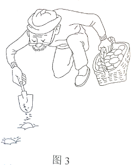

**绝密★启用前**

**2021年普通高等学校招生全国统一考试（乙卷）**

**文科综合能力测试·政治部分**

**注意事项：**

**1．答卷前，考生务必将自己的姓名、准考证号填写在答题卡上。**

**2．回答选择题时，选出每小题答案后，用铅笔把答题卡上对应题目的答案标号涂黑。如需改动，用橡皮擦干净后，再选涂其他答案标号。回答非选择题时，将答案写在答题卡上．写在本试卷上无效。**

**3．考试结束后，将本试卷和答题卡一并交回。**

**一、选择题：本题共12小题，每小题4分，共48分。在每小题给出的四个选项中，只有一项是符合题目要求的。**

12．甲国经济对外贸的依存度高，其进出口贸易以美元结算。在开放市场条件下，当甲国发生通货膨胀时，若不考虑其他因素，甲国货币对美元的汇率会下降。关于这一作用过程的描述，正确的是（ ）

<table style="width:100%;">
<colgroup>
<col style="width: 20%" />
<col style="width: 5%" />
<col style="width: 42%" />
<col style="width: 5%" />
<col style="width: 25%" />
</colgroup>
<tbody>
<tr>
<td style="text-align: center;">甲国通货膨胀</td>
<td style="text-align: center;">→</td>
<td style="text-align: center;">
①进口商品增加→美元需求增加

②进口商品减少→美元需求减少

③出口商品增加→美元供给增加

④出口商品减少→美元供给减少
</td>
<td style="text-align: center;">→</td>
<td style="text-align: center;">甲国货币汇率下降</td>
</tr>
</tbody>
</table>

A．①③ B．①④ C．②③ D．②④

13．2021年1月，中国人民银行会同有关部门发布通知明确：2020年6月出台的普惠小微企业贷款延期还本付息政策延期至2021年3月31日，免收罚息；对于2021年1月1日至3月31日期间到期的普惠小微企业贷款，按市场化原则“应延尽延”，继续实施阶段性延期还本付息。此举（ ）

①意在减少小微企业偿债本金 ②有利于维持小微企业正常经营

③能够加速小微企业资金周转 ④有助于稳定小微企业就业岗位

A．①③ B．①④ C．②③ D．②④

14．图2是我国2016～2020年全国一般公共收入与支出变化走势。

附：据政府工作报告，2020年我国财政赤字率为3.6%，2021年拟按3.2%左右安排（赤字率的国际警戒线为3%）。

针对图2反映的问题，积极的应对办法是（ ）

①培育新的经济增长点，扩大税收来源

②加大政府债券发行规模，弥补收入不足

③压缩社会保障类开支，减少财政支出

④优化财政支出结构，提高资金使用效率

A．①③ B．①④ C．②③ D．②④

15．经济合作与发展组织数据显示：2020年全球外国直接投资（FDI）总规模为8460亿美元，比上年下降38%，但中国FDI逆势增至2120亿美元，增幅为14%，成为全球最大外资流入国。2020年中国FDI逆势增长，得益于（ ）

①中国有效控制新冠肺炎疫情，经济增长率先恢复

②中国进一步扩大开放，货物进出口总额大幅增长

③中国营商环境不断优化，对外资更具吸引力

④中国对外直接投资不断增大，投资结构改善

A．①③ B．①④ C．②③ D．②④

16．某中学7名高一学生，上学时感受到交通拥堵，同时发现专门设置的公交车道利用率并不高。他们用3个月的时间详细调查了本市公交专用道的整体使用情况，撰写出上万字的研究报告，提出了合理使用公交专用道的建议。该报告得到有关专家认可和支持，受到市政府有关部门重视。这一事例表明（ ）

①关注并解决交通拥堵问题是中学生的责任

②开展社会调研有助于提高中学生的公共参与素养

③就解决交通拥堵问题提出建议是中学生的权利

④反映公共管理问题时需要提出相应的对策建议

A．①② B．①④ C．②③ D．③④

17．2021年中央一号文件提出，要继续把公共基础设施建设的重点放在农村，实施农村道路畅通、农村供水保障、乡村清洁能源建设、数字乡村建设发展、村级综合服务设施提升等工程，加快农业农村现代化。加强农村公共基础设施建设是（ ）

①巩固脱贫成果、促进共同富裕的内在要求

②推动城市乡村融合发展的有力举措

③优化乡村治理体制机制的具体体现

④提高基层政府工作效率的必要途径

A．①② B．①③ C．②④ D．③④

18．现行的《宗教事务条例》第58条规定，宗教团体、宗教院校、宗教活动场所应当执行国家统一的财务、资产、会计制度，向所在地的县级以上人民政府宗教事务部门报告财务状况、收支情况和接受、使用捐赠情况，接受其监督管理，并以适当方式向信教公民公布。据此，正确的解读是（ ）

①乡级人民政府没有管理宗教事务的职责

②宗教团体需要加强财务活动的规范管理

③宗教事务条例不适用于不信教公民

④宗教团体应当接受国家的监督管理

A．①② B．①③ C．②④ D．③④

19．著名书画家黄宾虹观察自然深有领悟，以自然之理来诠释笔法。如“平”似风吹水动、一波三折；“圆”如行云流水、宛转自如；“变”像山有起伏显晦、水有缓急动静。在艺术实践中感情自然，令黄宾虹艺术精进。这表明（ ）

①艺术之理与自然之理相契合

②悟出自然之理就能提升人的艺术造诣

③艺术造诣水平取决于主体的感知能力

④效法自然是提升艺术造诣的重要方法

A．①② B．①④ C．②③ D．③④

20．2020年，电影《夺冠》以1981年到2019年期间中国女排十夺世界冠军为主线，通过艺术形式展现了中国女排祖国至上、团结协作、顽强拼搏、永不言败的精神面貌，给观众带来心灵的震撼和鼓舞，受到普遍好评。从中可获得的启示是（ ）

①人民群众满意与否是衡量文艺作品价值的根本尺度

②优秀的文艺作品都是对现实生活的真实再现

③塑造典型艺术形象是艺术创作的根本价值追求

④反映时代精神的文艺作品能够增强人的精神力量

A．①② B．①④ C．②③ D．③④

21.王安石在推敲“春风又绿江南岸”这一诗句过程中，初云“又到江南岸”，圈去“到”字，注曰“不好”，改为“过”，复圈去而改为“入”，旋改为“满”……凡如是十字许，始定为“绿”，这从一个侧面表明（ ）

①真理和谬误往往是相伴而行的

②认识主体的知识和素质影响认识结果

③认识是一个包含曲折性的前进上升过程

④对同一个确定对象不能产生不同的认识

A.①② B.①④ C.②③ D.③④

22.恩格斯说，没有哪一次巨大的历史灾难，不是以历史的进步为补偿的。习近平在谈到新冠肺炎疫情和国际环境不稳定性不确定性明显上升对我国经济发展的影响时强调，要坚持用全面、辩证、长远的眼光分析当前经济形势，努力在危机中育新机、于变局中开新局。以上论述蕴含的辩证法道理是（ ）

①新事物代替旧事物需要具备一定的条件

②新事物总是在不断克服困难与挫折中发展进步的

③困难越多、挫折越大，越有利于新事物的成长

④新事物与旧事物的界限是由矛盾的同一性确定的

A.①② B.①④ C.②③ D.③④

23.漫画《种瓜得瓜，种豆得豆，种蛋得……》（图3）讽刺了一些人想问题、做事情（ ）

①不敢发挥主观能动性 ②否认事物发展的规律性

③不善于具体问题具体分析 ④不懂得联系的客观性和条件性

A.①② B.①④ C.②③ D.③④

**二、非选择题：共52分。**

38.阅读材料，完成下列要求。（14分）

甲企业是我国知名民族品牌汽车制造商，2008年推出首款新能源汽车。经过多年努力，甲企业目前已拥有电动汽车核心零部件动力电池、电动机、电子控制系统等方面的自主专利，成为国内唯一一家掌握“三电”核心技术的新能源汽车企业。

甲企业最初在生产中坚持“垂直整合”模式：自行研发生产零部件，自行组装整车，自主开发汽车软件系统。甲企业由于坚持产业链自供体系，难以在细分市场保持优势，其新能源汽车销量增速远低于行业平均增速。2017年，甲企业开始打破垂直一体化传统，聚焦核心技术与整车生产业务，引入优秀供应商，采取电池对外供应、部分零部件向外采购、边缘业务剥离等策略，2018年起，甲企业逐步全面开放汽车的341个接口数据、66项控制权限，向全球开发者提供一个多维的“供应链开放”平台，与供应商共同研究硬件整机集成与软件生态的本土化解决方案。

结合材料并运用经济生活知识，分析甲企业从垂直整合模式向供应链开放模式转型的经济动因。

39.阅读材料，完成下列要求。（12分）

当前，世界百年未有之大变局加速演变，和平与发展仍然是时代主题，但国际环境不稳定性不确定性明显上升。

为反制有关外国实体危害中国国家利益，2020年9月，中国商务部公布《不可靠实体清单规定》。为阻断外国法律与措施“不当域外适用”对中国企业和公民的影响，2021年1月，中国商务部公布《阻断外国法律与措施不当域外适用办法》。

2021年3月，十三届全国人大四次会议《全国人民代表大会常务委员会工作报告》提出，加快推进涉外领域立法，围绕反制裁、反干涉、反制长臂管辖等，充实应对挑战、防范风险的法律“工具箱”，推动形成系统完备的涉外法律法规体系。

结合材料并运用政治生活知识，说明中国为什么要加快推进涉外领域立法。

40.阅读材料，完成下列要求。（26分）

在党的七届二中全会上，毛泽东向全党提出了“两个务必”的要求：“务必使同志们继续地保持谦虚、谨慎、不骄、不躁的作风，务必使同志们继续地保持艰苦奋斗的作风。”

1949年3月23日，党中央从西柏坡动身前往北平时，毛泽东说，今天是进京的日子，进京“赶考”去；我们决不当李自成，我们都希望考个好成绩。

习近平说：“直到今天，‘两个务必’的教育还远未结束，继续‘赶考’的任务也远未结束。我们一代一代共产党人都要不断地接受人民的‘考试’、执政的‘考试’，向人民和历史交出满意的答卷。”

时代是出卷人，我们是答卷人，人民是阅卷人。我们党永葆“赶考”的清醒，始终强调和坚持“两个务必”，带领人民砥砺前行、接续奋斗，在一场场历史性考试中交出了优异的答卷，中华民族迎来了从站起来、富起来到强起来的伟大飞跃。

2021年是中国共产党成立一百周年。在不断“赶考”的背后，是中国共产党始终如一的“为中国人民谋幸福，为中华民族谋复兴”的初心和使命。

（1）结合材料并运用社会存在与社会意识关系原理，说明中国共产党为什么要永葆“赶考”的清醒。（12分）

（2）“两个务必”是新时代共产党人砥砺前行的精神动力，运用文化对人的影响的相关知识加以说明。（10分）

（3）人生是一个不断“赶考”的过程。就青年如何在人生考试中交出合格答卷提出两点看法。（4分）
