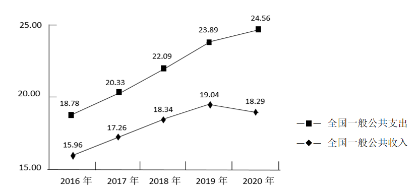

**绝密★启用前**

**2021年普通高等学校招生全国统一考试**

**文科综合能力测试·政治部分**

**注意事项：**

**1．答卷前，考生务必将自己的姓名、准考证号填写在答题卡上。**

**2．回答选择题时，选出每小题答案后，用铅笔把答题卡上对应题目的答案标号涂黑。如需改动，用橡皮擦干净后，再选涂其他答案标号。回答非选择题时，将答案写在答题卡上．写在本试卷上无效。**

**3．考试结束后，将本试卷和答题卡一并交回。**

**一、选择题：本题共35小题，每小题4分，共140分。在每小题给出的四个选项中，只有一项是符合题目要求的。**

12\. 甲国经济对外贸的依存度高，其进出口贸易以美元结算。在开放市场条件下，当甲国发生通货膨胀时，若不考虑其他因素，甲国货币对美元的汇率会下降。关于这一作用过程的描述，正确的是（ ）

<table>
<colgroup>
<col style="width: 20%" />
<col style="width: 6%" />
<col style="width: 42%" />
<col style="width: 6%" />
<col style="width: 25%" />
</colgroup>
<tbody>
<tr>
<td style="text-align: center;">甲国通货膨胀</td>
<td style="text-align: center;">→</td>
<td style="text-align: center;">
①进口商品增加→美元需求增加

②进口商品减少→美元需求减少

③出口商品增加→美元供给增加

④出口商品减少→美元供给减少
</td>
<td style="text-align: center;">→</td>
<td style="text-align: center;">甲国货币汇率下降</td>
</tr>
</tbody>
</table>

A. ①③ B. ①④ C. ②③ D. ②④

【答案】B

【解析】

【分析】

【详解】①②：甲国发生通货膨胀，物价上涨，进口增加，美元需求增加，①正确，②错误。

③④：甲国发生通货膨胀，物价上涨，出口商品减少，美元供给减少，④正确，③错误。

故本题选B。

13\. 2021年1月，中国人民银行会同有关部门发布通知明确：2020年6月出台的普惠小微企业贷款延期还本付息政策延期至2021年3月31日，免收罚息；对于2021年1月1日至3月31日期间到期的普惠小微企业贷款，按市场化原则“应延尽延”，继续实施阶段性延期还本付息。此举（ ）

①意在减少小微企业偿债本金 ②有利于维持小微企业正常经营

③能够加速小微企业资金周转 ④有助于稳定小微企业就业岗位

A. ①③ B. ①④ C. ②③ D. ②④

【答案】D

【解析】

分析】

【详解】①：“延期还本付息、免收罚息”只是延长企业还本付息时限，以及超期后不进行惩罚式收息，并不能减少小微企业偿债本金。①错误。

②④：延长企业还本付息时限能够缓解小微企业资金压力，有利于维持小微企业的正常运转，小微企业在吸收就业方面具有独特的优势，故有助于稳定小微企业就业岗位。②④正确。

③：此举与小微企业的资金周转速度没有直接关系，③不符合题意。

故本题选C。

14\. 图2是我国2016～2020年全国一般公共收入与支出变化走势。

（万亿元）

图2

附：据政府工作报告，2020年我国财政赤字率为3.6%，2021年拟按3.2%左右安排（赤字率的国际警戒线为3%）。

针对上图反映的问题，积极的应对办法是（ ）

①培育新的经济增长点，扩大税收来源

②加大政府债券发行规模，弥补收入不足

③压缩社会保障类开支，减少财政支出

④优化财政支出结构，提高资金使用效率

A. ①③ B. ①④ C. ②③ D. ②④

【答案】B

【解析】

【分析】

【详解】图示信息表示全国一般公共收入小于支出，说明我国出现财政赤字现象，且结合注释，我国的赤字率已经超过国际警戒线，对此的应对策略：

①：经济发展是税收的基础，因此培育新的经济增长点，扩大税收来源，有利于增加财政收入，减少财政赤字，故①正确。

②：增发国债是弥补收入不足的措施，但会增加财政赤字率，故不是积极应对的办法，②排除。

③：社保支出关系民生福祉，不应压缩；“压缩社保开支”也不是积极的应对办法。③错误。

④：优化财政支出结构，提高资金使用效率，有助于适当降低财政支出，缩小收支差距。④正确。

故本题选B。

15\. 经济合作与发展组织数据显示：2020年全球外国直接投资（FDI）总规模为8460亿美元，比上年下降38%，但中国FDI逆势增至2120亿美元，增幅为14%，成为全球最大外资流入国。2020年中国FDI逆势增长，得益于（ ）

①中国有效控制新冠肺炎疫情，经济增长率先恢复

②中国进一步扩大开放，货物进出口总额大幅增长

③中国营商环境不断优化，对外资更具吸引力

④中国对外直接投资不断增大，投资结构改善

A. ①③ B. ①④ C. ②③ D. ②④

【答案】A

【解析】

【分析】

【详解】①③：由题意可知，2020年全球FDI在下降，而我国FDI却在增长，这得益于我国有效控制新冠肺炎疫情，为经济增长提供条件；不断优化营商环境，有力地吸引了外资。①③正确。

②：材料中强调的是我国FDI即外国直接投资逆势增长，与货物进出口总额无直接关系。②不符合题意。

④：材料中强调是我国FDI即外国直接投资逆势增长，属于引进来，而不是对外直接投资。④不符合题意。

故本题选A。

16\. 某中学7名高一学生，上学时感受到交通拥堵，同时发现专门设置的公交车道利用率并不高。他们用3个月的时间详细调查了本市公交专用道的整体使用情况，撰写出上万字的研究报告，提出了合理使用公交专用道的建议，该报告得到有关专家认可和支持，受到市政府有关部门重视。这一事例表明（ ）

①关注并解决交通拥堵问题是中学生的责任

②开展社会调研有助于提高中学生的公共参与素养

③就解决交通拥堵问题提出建议是中学生的权利

④反映公共管理问题时需要提出相应的对策建议

A. ①② B. ①④ C. ②③ D. ③④

【答案】C

【解析】

【分析】

【详解】①：中学生应积极参与和关注公共交通问题，但解决交通拥堵问题是政府的责任，而不是中学生的责任。①错误。

②③：题意中7名高一学生针对交通问题进行详解调查，并撰写了研究报告，提出合理建议，这行使了公民的监督权，是中学生享有的权利，也有利于提高中学生的公共参与素养和社会责任感。②③正确。

④：公民可以积极反映公共管理问题，对不足之处提出意见建议，但不一定必须有相应的对策建议。④错误。

故本题选C。

17\. 2021年中央一号文件提出，要继续把公共基础设施建设的重点放在农村，实施农村道路畅通、农村供水保障、乡村清洁能源建设、数字乡村建设发展、村级综合服务设施提升等工程，加快农业农村现代化。加强农村公共基础设施建设是（ ）

①巩固脱贫成果、促进共同富裕的内在要求

②推动城市乡村融合发展的有力举措

③优化乡村治理体制机制的具体体现

④提高基层政府工作效率的必要途径

A. ①② B. ①③ C. ②④ D. ③④

【答案】A

【解析】

【分析】

【详解】①②：加强农村公共基础设施建设促进乡村基础设施的完善，缩小城乡差距，推动城乡协调融合发展，实现共同富裕，故①②正确。

③：材料强调的是乡村基础设施的建设，未涉及优化乡村治理体制机制，故③不选。

④：材料未体现基层政府的工作，故④不选。

故本题选A。

18\. 现行的《宗教事务条例》第58条规定，宗教团体、宗教院校、宗教活动场所应当执行国家统一的财务、资产、会计制度，向所在地的县级以上人民政府宗教事务部门报告财务状况、收支情况和接受、使用捐赠情况，接受其监督管理，并以适当方式向信教公民公布。据此，正确的解读是（ ）

①乡级人民政府没有管理宗教事务的职责

②宗教团体需要加强财务活动的规范管理

③宗教事务条例不适用于不信教公民

④宗教团体应当接受国家的监督管理

A. ①② B. ①③ C. ②④ D. ③④

【答案】C

【解析】

【分析】

【详解】①：材料说明的是宗教事务中关于财务方面的事务向所在地县级以上人民政府报告，这不意味着乡级人民政府没有管理宗教事务的职责。①错误。

②：《宗教事务条例》第58条对宗教团体的财务活动进行了明确的规范，这说明宗教团体需要加强财务活动的规范管理。②正确。

③：材料反映的是《宗教事务条例》第58条对宗教团体的财务活动进行的明确规范，并不能说明宗教事务条例不适用于不信教公民。③错误。

④：宗教团体、院校、活动场所执行国家的相关财务制度，并向所在地县级以上人民政府宗教事务部门报告相关财务情况，这说明宗教团体应当接受国家的监督管理。④正确。

故本题选C。

19\. 著名书画家黄宾虹观察自然深有领悟，以自然之理来诠释笔法，如“平”似风吹水动、一波三折；“圆”如行云流水、宛转自如；“变”像山有起伏显晦、水有缓急动静。在艺术实践中感情自然，令黄宾虹艺术精进。这表明（ ）

①艺术之理与自然之理相契合

②悟出自然之理就能提升人的艺术造诣

③艺术造诣水平取决于主体的感知能力

④效法自然是提升艺术造诣的重要方法

A. ①② B. ①④ C. ②③ D. ③④

【答案】B

【解析】

【分析】

【详解】①：在艺术实践中感悟自然，体现了艺术之理与自然之理相契合，①正确。

④：材料中指出，黄宾虹观察自然深有领悟，以自然之理来诠释笔法，在艺术实践中感悟自然，令黄宾虹艺术精进，这表明效法自然是提升艺术造诣的重要方法，故④正确。

②：选项中“就能”说法过于绝对，故②不选。

③：艺术造诣水平取决于实践水平，而不是主体的感知能力，主体的感知能力对艺术造诣水平有重要的影响，故③不选。

故本题选B。

20\. 2020年，电影《夺冠》以1981年到2019年期间中国女排十夺世界冠军为主线，通过艺术形式展现了中国女排祖国至上、团结协作、顽强拼搏、永不言败的精神面貌，给观众带来心灵的震撼和鼓舞，受到普遍好评．从中可获得的启示是（ ）

①人民群众满意与否是衡量文艺作品价值的根本尺度

②优秀的文艺作品都是对现实生活的真实再现

③塑造典型艺术形象是艺术创作的根本价值追求

④反映时代精神的文艺作品能够增强人的精神力量

A. ①② B. ①④ C. ②③ D. ③④

【答案】B

【解析】

【分析】

详解】①④：材料中指出《夺冠》以1981年到2019年期间中国女排十夺世界冠军为主线，给观众带来心灵的震撼和鼓舞，受到普遍好评，启示我们文艺创造要满足人们群众的文化需求，优秀文艺作品能够增强人的精神力量，故①④正确。

②：文艺作品是对现实生活的反映，但并不是真实的再现，是一种能动性的反映，故②不选。

③：艺术创作的根本价值追求是满足人民群众的文化需求，故③不选。

故本题选B。

21\. 王安石在推敲“春风又绿江南岸”这一诗句过程中，初云“又到江南岸”，圈去“到”字，注曰“不好”，改为“过”，复圈去而改为“入”，旋改为“满”……凡如是十字许，始定为“绿”，这从一个侧面表明（ ）

①真理和谬误往往是相伴而行的

②认识主体知识和素质影响认识结果

③认识是一个包含曲折性的前进上升过程

④对同一个确定对象不能产生不同的认识

A. ①② B. ①④ C. ②③ D. ③④

【答案】C

【解析】

【分析】

【详解】①：真理是标志着主观与客观相符合的哲学范畴，是对客观事物及其规律的正确反映。诗句中的用字均能反映客观实际，不存在谬误，只是涉及什么样的字能表达江南春景的美。因此，材料不涉及真理和谬误往往是相伴而行的。①不符合题意。

②：王安石是北宋著名的文学家，对于诗句中用字的反复推敲是为了更加诗意的描述江南的春景，这离不开他的文学素养。这显然说明了认识主体的知识和素质影响认识的结果。②正确。

③：这句诗用字的推敲，经历了一个反复修改的过程，最终“绿”字将江南春景表露无遗，引人入胜，这说明认识是一个包含曲折的前进上升过程。③正确。

④：受主客观条件的制约，对同一确定的对象会产生不同的认识。④错误。

故本题选C。

22\. 恩格斯说，没有哪一次巨大的历史灾难，不是以历史的进步为补偿的。习近平在谈到新冠肺炎疫情和国际环境不稳定性不确定性明显上升对我国经济发展的影响时强调，要坚持用全面、辩证、长远的眼光分析当前经济形势，努力在危机中育新机、于变局中开新局。以上论述蕴含的辩证法道理是（ ）

①新事物代替旧事物需要具备一定的条件

②新事物总是在不断克服困难与挫折中发展进步的

③困难越多、挫折越大，越有利于新事物的成长

④新事物与旧事物的界限是由矛盾的同一性确定的

A. ①② B. ①④ C. ②③ D. ③④

【答案】A

【解析】

分析】

【详解】①：材料强调要努力在危机中育新机、于变局中开新局，这说明新机和新局的开启离不开我们基于客观规律、充分发挥主观能动性所努力创造的条件，也就说明新事物代替旧事物需要一定的条件。①正确。

②：材料中强调没有哪一次巨大的历史灾难，不是以历史的进步为补偿的，同时新机和新局要直面危机和变局，在解决和克服困难中向前迈进，这说明新事物总是在不断克服困难与挫折中发展进步的。②正确。

③：适度的困难和挫折有利于新事物的成长，但新事物产生之初往往力量微弱，过量的困难、过大的挫折会阻碍新事物的成长。③错误。

④：矛盾的同一性是矛盾双方相互依赖，并在一定条件下相互转化，强调的是矛盾双方的联系。新事物与旧事物的界限强调的是新事物与旧事物的差别，应是由矛盾的斗争性确定的。④错误。

故本题选A。

23\. 漫画《种瓜得瓜，种豆得豆，种蛋得……》（图3）讽刺了一些人想问题、做事情（ ）

图3

①不敢发挥主观能动性 ②否认事物发展的规律性

③不善于具体问题具体分析 ④不懂得联系的客观性和条件性

A. ①② B. ①④ C. ②③ D. ③④

【答案】C

【解析】

【分析】

【详解】②③：种瓜得瓜，种豆得豆，是生物基因规律发挥作用，漫画中“种蛋”行为，没有看到蛋自身的规律所在，否认事物发展的规律性，也没有看到蛋与瓜豆之间的区别，没有做到具体问题具体分析，②③符合题意。

①：题中漫画“种蛋”行为，发挥了主观能动性，但并没有尊重客观规律，①说法错误。

④：联系具有客观性和条件性，题中漫画并不是主观臆造联系，或者忽视联系产生的条件，而是违背了事物发展的规律，④说法错误。

故本题选C。

**二、非选择题：共160分。第36～42题为必考题，每个试题考生都必须作答。第43～47题为选考题，考生根据要求作答。**

**（一）必考题：共135分。**

38\. 阅读材料，完成下列要求。

甲企业是我国知名民族品牌汽车制造商，2008年推出首款新能源汽车。经过多年努力，甲企业目前已拥有电动汽车核心零部件动力电池、电动机、电子控制系统等方面的自主专利，成为国内唯一一家掌握“三电”核心技术的新能源汽车企业。

甲企业最初在生产中坚持“垂直整合”模式：自行研发生产零部件，自行组装整车，自主开发汽车软件系统。甲企业由于坚持产业链自供体系，难以在细分市场保持优势，其新能源汽车销量增速远低于行业平均增速。2017年，甲企业开始打破垂直一体化传统，聚焦核心技术与整车生产业务，引入优秀供应商，采取电池对外供应、部分零部件向外采购、边缘业务剥离等策略，2018年起，甲企业逐步全面开放汽车的341个接口数据、66项控制权限，向全球开发者提供一个多维的“供应链开放”平台，与供应商共同研究硬件整机集成与软件生态的本土化解决方案。

结合材料并运用经济生活知识，分析甲企业从垂直整合模式向供应链开放模式转型的经济动因。

【答案】①企业要制定正确的经营战略。甲企业生产中原有“垂直整合”模式，在经营过程中已经暴露出相应问题，难以细分市场保持优势，企业竞争力下降；甲企业从垂直整合模式向供应链开放模式转型，是基于提升企业核心竞争力、提升企业产品销量的需要而做出的正确的经营战略。

②甲企业从垂直整合模式向供应链开放模式转型，由全面出击、力量分散到聚焦核心技术与整车生产，由完全封闭、完全自我研发到有舍有得，引入优秀供应商、采取电池对外供应、部分零部件向外采购、边缘业务剥离，实现了企业经营效益最大化和企业核心资源合理配置。

③企业经营要充分利用国际国内两个市场、两种资源，促进国际合作，提高参与国际竞争的能力。甲企业从垂直整合模式向供应链开放模式转型，向全球开发者提供一个多维的 “供应链开放”平台，与供应商共同研究硬件整机集成与软件生态的本土化解决方案，充分利用全球供应链，提升企业核心竞争力。

【解析】

【分析】本题以企业从垂直整合模式向供应链开放模式转型为背景话题，从经济生活的角度，考查学生调动和运用基础知识分析问题和解决问题的能力。解答本题，审设问，题目类型原因类，知识限定经济生活，问题指向分析甲企业从垂直整合模式向供应链开放模式转型的经济动因。

【详解】材料中强调甲企业最初在生产中坚持“垂直整合”模式，后来打破垂直一体化传统，转型开放模式，说明企业要制定正确的经营战略，提升企业核心竞争力、提升企业产品销量；材料中强调甲企业开始打破垂直一体化传统，聚焦核心技术与整车生产业务，引入优秀供应商，采取电池对外供应、部分零部件向外采购、边缘业务剥离等策略，说明甲企业从垂直整合模式向供应链开放模式转型，实现了企业经营效益最大化和企业核心资源合理配置；材料中强调甲企业向全球开发者提供一个多维的 “供应链开放”平台，与供应商共同研究硬件整机集成与软件生态的本土化解决方案，说明坚持新发展理念，通过广泛应用先进工艺和技术装备推进节能环保，实现传统产业绿色发展。

【点睛】企业经营成功的因素（或企业怎样经营成功）

涉及国企：全面依法治企，加强和改进党对国有企业的领导。

答题角度一：从产出/产品看：产品定位+产品竞争优势（价格、质量、品牌、服务）

（1）制定正确的经营战略。面向市场需求/开发新产品/优化产品结构

（2）提高自主创新能力，依靠技术进步、科学管理等手段，形成自己的竞争优势。

①采用先进工艺和较高的质量标准，提高产品质量。（质量）

②提高劳动生产率，降低生产成本，提高产品性价比。（价格）

③加强品牌培育和推广，提升自主品牌价值。（品牌）

④增强企业的营利能力。

（3）诚信经营，承担社会责任，坚持社会效益和经济效益的统一，树立良好的信誉和形象。（产品和服务）

（4）守法经营，公平竞争，诚信守约。

答题角度二：从投入看：资金+人力+技术+管理+规模

（5）拓宽融资渠道/积极上市。（资金）

（6）完善分配激励机制，提高员工的积极性；提高经营者和劳动者素质，依法维护劳动者合法权益（人力）

（7）加大研发投入，开展技术合作、推动技术创新。（技术)

（8）完善科学的法人治理结构，建立健全现代企业制度（规范的公司制改革），优化企业组织结构，提高运行效率和管理科学性，增强企业活力。--若掌握50%以上的股份，需要答出：掌握控股权，获得经营与决策自主权（管理）

（9）通过企业兼并、重组、强强联合，实现优势互补、社会资源的合理配置和产业结构的合理调整，提高企业竞争力。（规模）

答题角度三：从外部因素：市场+国家宏观政策+国际环境

（10）遵循价值规律和市场规则，利用国家宏观调控的优惠政策，赢得发展机遇。。

（11）贯彻新发展理念，建设现代化经济体系，深化供给侧结构性改革，走新型工业化道路，推动产品结构优化升级。

（12） 国际环境

A、积极参与国际竞争与合作，更好地利用国际国内两个市场、两种资源，提高企业国际竞争力。

B、转变对外经济发展方式，调整产业和贸易结构，形成以技术、品牌、质量、服务为核心的出口竞争新优势。

C、提高自主创新能力，培育自主品牌。

D、实施“引进来”与“走出去”并重，创新对外投资方式，促进国际产能合作。。

E、坚持市场多元化战略，努力拓展国内市场，积极开拓新兴的国际市场。。

F、要树立经济安全和风险防范意识，努力学习并善于运用WTO规则，维护自身合法权益。

39\. 阅读材料，完成下列要求。

当前，世界百年未有之大变局加速演变，和平与发展仍然是时代主题，但国际环境不稳定性不确定性明显上升。

为反制有关外国实体危害中国国家利益，2020年9月，中国商务部公布《不可靠实体清单规定》。为阻断外国法律与措施“不当域外适用”对中国企业和公民的影响，2021年1月，中国商务部公布《阻断外国法律与措施不当域外适用办法》。

2021年3月，十三届全国人大四次会议《全国人民代表大会常务委员会工作报告》提出，加快推进涉外领域立法，围绕反制裁、反干涉、反制长臂管辖等，充实应对挑战、防范风险的法律“工具箱”，推动形成系统完备的涉外法律法规体系。

结合材料并运用政治生活知识，说明中国为什么要加快推进涉外领域立法。

【答案】（1）必要性：

①当前，保护主义、单边主义、霸权行径仍在逆流而动，扰乱全球治理，威胁我国合法权益与世界和平稳定。

②面对霸权国家频繁以“法律手段”实施单边制裁和“长臂管辖”肆意危害我国家安全、侵害我国家及公民利益，我国的涉外法律体系尚未建立起全面防备体系和有效阻断机制。

③作为世界第一贸易大国和第二大经济体，我国的涉外法律体系在维护国家及公民海外利益方面还有诸多不足。

（2）重要性（意义）：

①加强涉外领域立法有利于维护国际秩序、促进国际合作。

②加强涉外领域立法有助于促进对外开放、维护国家利益。

③加强涉外领域立法，将极大助力于推进全面依法治国、构建人类命运共同体，并为“一带一路”倡议提供驱动力。

【解析】

【分析】本题以中国加快涉外领域立法为话题设置情境，从政治生活角度考查学生获取和解读信息、调动和运用知识、描述和阐释事物的能力。

【详解】第一步：明确设问指向。本题要求运用政治生活知识，说明中国为什么要加快推进涉外领域立法，属于原因类主观题。

第二步：提取关键信息，联系教材知识，逐层展开。

必须性

信息①：国际环境不稳定性不确定性明显上升 可联系保护主义、单边主义、霸权行径威胁我国合法权益与世界和平稳定。

信息②：充实应对挑战、防范风险的法律工具箱 可联系我国的涉外法律体系尚未建立起全面防备体系和有效阻断机制。

信息③：外国法律与措施“不当域外适用”对中国企业和公民产生负面影响 可联系我国的涉外法律体系在维护国家及公民海外利益方面还有诸多不足。

重要性（意义）

信息①：国际环境不稳定性不确定性明显上升 可联系加强涉外领域立法有助于维护国际秩序、促进国际合作。

信息②：为反制外国有关实体危害中国国家利益、为阻断外国法律与措施“不当域外适用”对中国企业和公民的影响 可联系有助于促进对外开放、维护国家利益。

信息③：充实应对挑战、防范风险的法律工具箱 可联系有助于推进全面依法治国、构建人类命运共同体。

【点睛】原因类主观题一般分三步走：

第一步，分析主体的必要性，往往是指此主体的性质、地位或职责所在。如果有多个主体，则应分别分析不同主体的必要性。

第二步，分析对象的必要性，往往是指现状、性质、地位、作用、时代要求、客观规律等因素。

第三步，将主体与对象结合起来，分析做好这件事情或解决好某问题的意义。可以从对主体的意义、对对象的意义引申出对社会、对国家等的意义，作答时要遵循从小到大、由近及远、从国内到国际的原则。有时还应根据材料信息，分析不这样做的弊端。

40\. 阅读材料，完成下列要求。

在党的七届二中全会上，毛泽东向全党提出了“两个务必”的要求：“务必使同志们继续地保持谦虚、谨慎、不骄、不躁的作风，务必使同志们继续地保持艰苦奋斗的作风。”

1949年3月23日，党中央从西柏坡动身前往北平时，毛泽东说，今天是进京的日子，进京“赶考”去；我们决不当李自成，我们都希望考个好成绩。

习近平说：“直到今天，‘两个务必’的教育还远未结束，继续‘赶考’的任务也远未结束。我们一代一代共产党人都要不断地接受人民的‘考试’、执政的‘考试’，向人民和历史交出满意的答卷。”

时代是出卷人，我们是答卷人，人民是阅卷人。我们党永葆“赶考”的清醒，始终强调和坚持“两个务必”，带领人民砥砺前行、接续奋斗，在一场场历史性考试中交出了优异的答卷，中华民族迎来了从站起来、富起来到强起来的伟大飞跃。

2021年是中国共产党成立一百周年。在不断“赶考”的背后，是中国共产党始终如一的“为中国人民谋幸福，为中华民族谋复兴”的初心和使命。

（1）结合材料并运用社会存在与社会意识关系原理，说明中国共产党为什么要永葆“赶考”的清醒。

（2）“两个务必”是新时代共产党人砥砺前行的精神动力，运用文化对人的影响的相关知识加以说明。

（3）人生是一个不断“赶考”的过程。就青年如何在人生考试中交出合格答卷提出两点看法。

【答案】（1）①社会存在决定社会意识，当今世界正经历百年未有之大变局，我国正处于实现中华民族伟大复兴关键时期，我们面临的发展机遇前所未有，面临的风险挑战也前所未有，广大党员、干部必须以“赶考”的清醒和坚定答好新时代的答卷。\
②社会意识反作用于社会存在，先进的社会意识促进社会的发展。只有永葆“赶考”的清醒和坚定，才能真正守初心、担使命。中国共产党以“赶考”的清醒和坚定践行对人民的承诺、对民族的担当，永远激情澎湃地行进在新长征路上，因而能够以优异的成绩赢得人民、赢得历史。\
（2）①文化作为一种精神力量，能够在人们认识世界和改造世界的过程中转化为物质力量。\
②优秀文化能够丰富人的精神世界。“两个务必”思想的持续深化，有助于不断塑造健康人格。\
③优秀文化能增强人的精神力量。“两个务必”思想所传达的先进文化总是给人以无穷的精神力量，鼓舞着一代又一代中华民族优秀儿女，谱写一曲又一曲威武雄壮的人生乐章。\
④优秀文化促进人的全面发展。“两个务必”思想为人的健康成长提供不可缺少的精神食粮，对促进人的全面发展起着不可替代的作用。\
（3）言之有理即可。如：\
①以统筹兼顾之谋和组织实施之能切实把工作、学习抓实、抓细。\
②以责任担当之勇，集中精力、心无旁骛把每一项工作、每一个环节都做到位。

【解析】

【分析】（1）本题为原因类试题，解答原因类试题一般做到“两审读，一发散，一结合”。所谓“两审读”，第一是审读主干材料，依据主干材料抽取主体信息和主旨信息；第二是审读设问，通过设问明确指示的指向范围，或者主体指向。“一发散”就是依据设问或者主干信息，明确问题核心，以问题核心为中心，发散相关有效知识点。“一结合”，结合发散指向与设问核心，正确作答。

（2）回答分析说明类问题，主要按以下思路进行：第一步，精析材料，把握主题。这是解题的基础，可有效避免“文不对题”、“答非所问”的现象。第二步，围绕主题，回归教材。以试题反映出的问题为中心与教材联系，找出材料与教材的“结合点”。第三步，紧扣题意，合理作答。通常，我们只要将教材中的基本原理与材料一一对应，用理论分析材料即可。

（3）本题为开放型试题，注意看清设问要求，言之成理即可。

【详解】（1）本题要求结合材料并运用社会存在与社会意识关系原理，说明中国共产党为什么要永葆“赶考”的清醒，属于原因类主观题。作答时，首先明确社会存在与社会意识关系原理内容有哪些，后根据“时代是出卷人”，从社会存在的变化决定社会意识的变化作答；再根据“不断赶考的背后，是始终如一的初心和使命”，从社会意识反作用于社会存在，先进的社会意识促进社会的发展角度作答。

（2）本题要求运用文化对人的影响的知识说明“两个务必”是新时代共产党人砥砺前行的精神动力，属于分析说明类主观题。通过研读设问可知，本题知识限定明确为“文化对人的影响”，作答时注意知识范围的限定，分别从优秀文化能够丰富人的精神世界、增强人的精神力量、促进人的全面发展三个角度作答，难度较小。

（3）本题要求考生就青年如何在人生考试中交出合格答卷提出两点看法，属于开放类主观题，考生围绕主题言之有理即可。

【点睛】1、社会存在和社会意识的含义

社会存在指社会生活的物质方面它是最主要最根本的内容是物质资料的生产方式；社会意识是指人的精神方面，是人类社会中各种精神生活现象的总称它包括各种风俗习惯和社会心理，也包括政治、法律、思想、道德、科学艺术、宗教哲学等。

2、社会存在和社会意识的辩证关系

（1）社会存在决定社会意识。社会存在的性质决定社会意识的性质；社会存在的变化决定社会意识的变化。

（2）社会意识反作用于社会存在。落后的社会意识阻碍社会的发展；先进的社会意识促进社会的发展。

（3）社会意识具有相对独立性。
