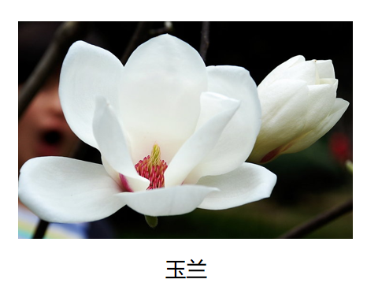
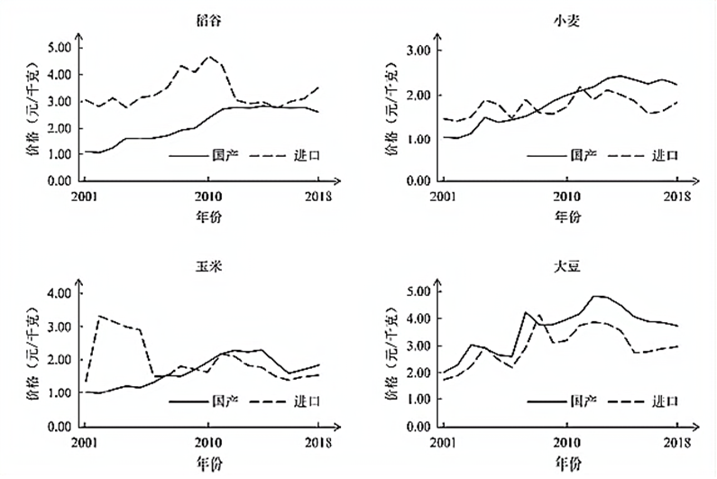
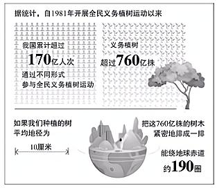
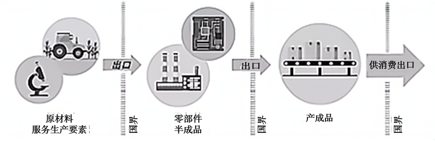
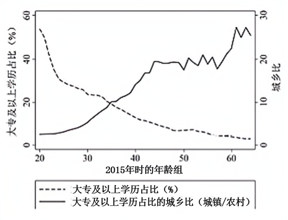

**2021年高考北京卷真题思想政治试题**

**第一部分**

**在每题列出的四个选项中，选出最符合题目要求的一项。**

1\. 革命文物承载党和人民英勇奋斗的光荣历史，记载中国革命的伟大历程和感人事迹。2021年“五四”青年节，中国国家博物馆推出“国博有约五四党课”直播节目，从“复兴之路”展厅“出发”，讲述革命文物背后的故事，走近百年前中国共产党人的壮丽青春，612万网友进入直播间，纷纷点赞、留言。给这则新闻加个标题，最合适的是（ ）

A. 坚守中华文化立场，面向世界、面向未来

B. 继承弘扬优秀传统文化，引领风尚、服务社会

C. 拉近革命文物与公众距离，促进文化产业发展

D. 创新传播方式，让革命精神“活”在当代中国人血脉中

2\. “一字一图画，一语一境界。”中文优美、简约、深邃、博大，书写并传承了中华文化。中文是联合国指定的六种国际官方语言文字之一，联合国设定每年4月20日为“中文日”，取典于仓颉在“谷雨”时节造字的传说。对此理解正确的是（ ）

①语言文字是文化创新的基础，展现了文化多样性

②语言文字是了解一国文化的钥匙，搭建了世界文化交流的桥梁

③汉字产生于中国传统习俗，是中华民族智慧结晶和全人类共同财富

④“中文日”有助于展示中华文化独特魅力，扩大中文影响力

A. ①② B. ①③ C. ②④ D. ③④

3\. 近期，北京调整了千余处公交车站名称，其中多处恢复了历史悠久的老地名。如“祈年大街北口”站改为“打磨厂”站，“龙潭路西口”站改为“东四块玉”站，“东花市大街”站改为“铁辘轳把”站……老地名的恢复留住了一份念想。公交站“唤回”老地名（ ）

A. 是对市民文化需求的表达，说明文化根源于人们的情感需要

B. 是对城市历史印记的保留，能彰显城市的历史积淀和文化底蕴

C. 是对地名文化意义的挖掘，延续并且增强了公交站的文化生命力

D. 是对传统文化发展的促进，融合了城市发展新理念与民族传统精神

4\. 在吉祥戏院看戏是一代北京人的美好记忆，梅兰芳、马连良等诸多京剧大师都曾在此演出。近日，被拆除的吉祥戏院获得“重生”，新吉祥戏院既传承了老戏院的经典形象，又采用了不少国际先进的技术设备，将成为国粹艺术传承展示体验基地和多元文化活动平台。新吉祥戏院（ ）

A. 历久弥“新”，在文化传承和创新中起了决定性作用

B. 推陈出“新”，符合时代特点和文化发展实践的需要

C. 返本开“新”，实现了传统文化与现代文化的相互转化

D. 革故鼎“新”，取其精华，去其糟粕，实现了文化形式的创新

5\. 从孔子到王阳明，从苏格拉底到黑格尔，众多哲学家就像是璀璨星河中的一颗颗星辰。纵观哲学发展史，也许哲学家们解答晢学问题的具体内容已经“过时”，但是他们解答问题的特有方式却具有永恒价值。这说明（ ）

A. 哲学作为先进的社会意识，其发达程度取决于社会存在的高度发展

B. 认识是无限发展的，哲学追求是一个永无止境的过程，需要不断完善自身

C. 哲学家是真理的发现者，真理都是主体与客体、理论与实践的具体的历史的统一

D. 哲学具有时代性，而哲学思维以其特有的反思精神与批判精神不断激发思想

6\. 浅溪曲涧，步石几点。汀步本是小溪中的渡水设施，现在被广泛应用于园林，铺设在草坪上，营造出独特的意趣。有人说，汀步的间距不合理，一步太小，两步又太大：也有人说，汀步间距的设计就是为了让人放慢脚步，边走边欣赏，而且这种设计还能照顾到老人和小孩。对此，评论恰当的是（ ）

\

A. 草坪汀步作为园林道路其个性寓于路的共性之中

B. 草坪汀步说明审美追求和以人为本可以有机结合

C. 同一事物的主要矛盾和次要矛盾的区别因人而异

D. 矛盾的解决是以牺牲矛盾双方的某一方为条件的

7\. 平安大街是北京老城区核心干道，途经皇城根遗址、什刹海、北海公园等名胜古迹。近来，市民发现宽阔的大街变绿变静了，两侧加了“绿带”，中间加了国槐与时令花卉组成的3米宽隔离带，机动车道“瘦身”，还添加了行人安全岛，步行、骑行环境大大改善。平安大街的变化（ ）

①实现了“慢行优先”“静下来”，促使矛盾的同一性转化为斗争性

②是城市发展的缩影，反映了价值判断和价值选择的社会历史性特征

③更注重环境的安全与舒适，体现了意识活动的自觉性和直接现实性

④协调了交通、绿化和城市风貌的关系，体现了合规律性与合目的性

A. ①② B. ①③ C. ②④ D. ③④

8\. 某校学生在学习“公民参与”相关内容时，尝试提出了以下建议，其中合理的是（ ）

|  |  |  |  |
|:---|:---|:---|:---|
| ① | ② | ③ | ④ |
| 学校门口上下学时间，有家长车辆乱停乱放，影响安全。建议交管部门规划即停即走的临时停车位。 | 为降低中小学生近视率，建议市卫生健康委员会出台“儿童青少年近视防控法”，提供法律保障。 | 老旧小区改造常因邻里意见不一而出现各种矛盾，建议人大代表实地调研，广泛收集居民意见建议，推进改造方案的优化。 | 我们村要求村民都改种景观树，建议凡涉及村民利益的事应该遵循少数服从多数的原则，由全体村民决定。 |

A. ①② B. ①③ C. ②④ D. ③④

9\. 大觉寺的古寺兰香、明城墙下的千株梅花、紫禁城的雪落梨花……今春，北京市文化和旅游局推出了12条“花开的日子——漫步北京赏春花读建筑主题游”线路，邀市民朋友在赏花的同时了解北京的建筑。这一做法（ ）

|  |  |
|:---|:---|
|  |  |
| 元大都遗址公园海棠花溪、宋庆龄故居、故宫文华殿、法源寺 | 长安街、颐和园、潭柘寺、大觉寺北京国际雕塑公园 |

①挖掘了旅游资源内涵，促进文旅融合 

②丰富了服务的市场化供给，助力旅游业复苏

③体现了政府的文化职能，满足群众文化需求 

④激发了社会活力，完善公共文化服务体系

A. ①③ B. ①④ C. ②③ D. ②④

10\. “与君远相知，不道云海深。”2021年是博鳌亚洲论坛成立20周年，世纪疫情之下，身处不同时区的嘉宾，通过线上线下的方式加入这场盛会，共话全球热点问题。论坛部分年会的主题如下：

|                    |                                                |
|:-------------------|:-----------------------------------------------|
| 2002年（第一届）   | 新世纪、新挑战、新亚洲——亚洲经济合作与发展     |
| 2012年（第十一届） | 变革世界中的亚洲：迈向健康与可持续发展         |
| 2021年（第二十届） | 世界大变局：共襄全球治理盛举合奏“一带一路”强音 |

上述资料最适合论证下列哪一观点（ ）

A. 加强双边合作，贡献中国智慧

B. 坚持国家利益至上，尊重他国关切

C. 更多参与、更多行动，做全球发展的贡献者

D. 坚持单边行动与集体行动相结合，促进一体化

11\. “职业培训券，1000万张在路上！”职业培训券是人力资源和社会保障部门对符合条件的劳动者进行职业技能培训补贴的电子凭证。劳动者可以通过电子社保卡应用程序领取该券，在指定期限内到相关培训机构使用。推行职业培训券（ ）

①着力于多种形式的收入再分配，实现社会公平

②可推动技能型劳动者的培养，促进更高质量就业

③可扩大培训行业市场准入，实现便民与惠企的统一

④可精准对接培训资源和培训需求，提升职业技能培训的信息化水平

A. ①③ B. ①④ C. ②③ D. ②④

12 

|  |
|:---|
| 电脑键盘的字母排序为什么从Q-W-E-R-T-Y而非A-B-C-D-E-H开始呢？这要从打字机时代说起。因为字母的使用频率不同，按字母表顺序排列会影响打字速度，但把常用字母集中放置又容易导致打字杆纠缠在一起。经过初期的市场竞争，1873年某公司推出的Q-W-E-R-T-Y键盘被多数人使用，几年内其他打字机生产商都开始改用这一布局。电脑键盘问世后，字杆纠缠问题不复存在，但按键布局却沿用至今。 |

关于以上材料解读不正确的是（ ）

A. 注重效率标准的市场调节存在滞后性

B. 新产品的问世要考虑技术上的相互关联性

C. 技术标准存在规模效应，市场占有率越高，效率越高

D. 经济行为存在路径依赖，历史的偶然不可忽略

13\. 下列选项分别给出了数字经济的一个特征及其对应的经济现象，其中关联正确的是（ ）

A. 低搜寻成本 搜寻潜在交易信息的成本下降→共享经济模式的兴起

B. 低复制成本 多生产一单位产品所需成本几乎为零→网络社交媒体的流行

C. 低运输成本 信息的运输成本几乎为零→互联网广告的定向投送

D. 低追踪成本和验证成本 经济活动的记录、存储、追踪、验证更为便利→数字产品的捆绑销售

14\. 据报道，欧盟最近对奥地利、德国和比利时三国国家铁路公司开出4800多万欧元罚单。调查发现，这三家铁路公司在跨境铁路整车货运服务中互通客户询价信息，提高报价，形成了一个垄断联盟。下列表述正确的是（ ）

A. 三家铁路公司形成垄断联盟的目的是通过增加各自的货运量提高利润水平

B. 垄断联盟提升了铁路货运在货物运输市场的竞争力，但妨碍资源有效配置

C. 欧盟开出罚单的根本原因是垄断联盟导致三家铁路公司更多为本国利益服务

D. 欧盟的处罚决定可以使铁路货运价格和运营成本更加接近，提升经济效率

15\. 下图给出了2001~2018年我国国产粮食和进口粮食的价格变化情况。

\

下列表述正确的是（ ）

①2001-2018年，国产稻谷的价格竞争优势总体上升

②2010年以后，国产小麦与玉米开始具有一定的价格竞争优势

③国产大豆在市场价格方面长期处于国际竞争的劣势

④我国是农业大国，但在国际粮食市场上的比较优势有待加强

A. ①② B. ①④ C. ②③ D. ③④

**第二部分**

16\. 

<table>
<colgroup>
<col style="width: 100%" />
</colgroup>
<tbody>
<tr>
<td style="text-align: left;">

房子可以遮风避雨就好了，为什么还要雕刻彩绘？茶碗器皿能用就好了，为什么还要烧制出各种图案？语言可以表达意思就好了，为什么还要有讲求韵律的诗歌？
</td>
</tr>
</tbody>
</table>

运用《文化生活》知识，谈谈你对上述问题的思考。

17\. 数据已成为国家基础性战略资源，数据治理是数据资源及其应用过程中相关管控活动、绩效和风险管理的集合。

政府在推进数据治理方面已取得了积极成效。新冠肺炎疫情防控，小小健康码助力10亿级人口提升精准防控能力；日常政务服务，从“最多跑一次”到实现24小时“不打烊”“一网通办”……“十四五”规划和2035年远景目标纲要提出，“迎接数字时代，激活数据要素潜能”。

数据治理涉及公民、政府、企业、社会组织等多方主体，需要界定各方权限和责任。在提升公共服务和社会治理数字智能化水平、扩大基础公共信息数据有序开放、加强数据资源安全保护等方面，还有待完善。

结合材料，运用《政治生活》知识，说明政府如何运用法治思维推进数据治理。

18 材料一 1981年，全国人大通过了《关于开展全民义务植树运动的决议》，植树造林、绿化祖国成为中国每一位适龄公民的法定义务。2019年有国际科研机构发现，世界越来越绿了，中国是促进这一改变的重要贡献者之一，全球从2000年到2017年新增的绿化面积约四分之一来自中国。

\

坚持不懈植绿造绿、养绿护绿，是中国建设生态良好的地球美好家园的有力体现，也成为中国推动实现人与自然和谐共生的现代化的生动缩影。中国大力推动绿色生产和绿色消费，形成节约资源和保护环境的空间格局、产业结构、生产方式、生活方式，向世界递出了“绿色名片”。

材料二 中国积极倡导并推动将绿色生态理念贯穿于共建“一带一路”倡议，主张“把绿色作为底色，推动绿色基础设施建设、绿色授资、绿色金融，保护好我们赖以生存的共同家园”。

从柬埔寨额勒赛水电站，到哈萨克斯坦扎纳塔斯的风电项目，再到埃塞俄比亚索马里州光伏电站；从非洲的气候遥感卫星，到东南亚的低碳示范区，再到小岛国的节能灯……中国通过多种形式的务实合作，推动绿色发展。2021年4月，在领导人气候峰会上，习近平主席进一步倡导“共商应对气候变化挑战，共谋人与自然和谐共生之道”。

材料一和材料二涉及了构建“人与自然生命共同体”的两种做法。运用哲学观点，分析中国是如何统筹这两种做法推动构建“人与自然生命共同体”的。

19\. 在开放的、相互促进的国内国际双循环的新发展格局下，中国将更加积极地参与国际分，更加有效地融入全球价值链。

全球价值链是指将生产过程分布在两个以上的国家，一国企业专注于特定环节，不生产整个产品。不同国家参与全球价值链的类型可以分为四种：初级产品、初级制造业、先进制造业与服务业、创新活动。参与全球价值链有助于国内资源整合和经济循环，从而促进就业和收入增长。

全球价值链参与类型通常受四方面因素的影响：

◇ 地理位置：地理区位、互联互通条件

◇ 要素票赋：资本、劳动力、自然资源、技术

◇ 市场规模：国内市场、国外市场

◇ 制度质量：合同执行、产权保护、标准认证

1990年至今，中国的全球价值链参与类型从初级制造业攀升至先进制造业与服务业。从以上四方面因素中任选两个，谈谈哪些有针对性的政策措施有助于我国融入更先进的全球价值链。

20\. 人力资本是劳动者积累的知识、技能和健康水平的总和，是一国消除贫困和实现经济可持续增长的重要驱动力。

材料一 教育是积累人力资本的主要途径之一。右图给出了2015年中国1%人口抽样调查中的高等教育覆盖率数据。左纵轴表示各年龄段人口中拥有大专及以上学历者的占比，右纵轴表示城镇和农村地区这一占比的比值。

（1）材料一反映了什么信息？

材料二 人力资本的个人回报相当丰厚，有研究发现，劳动者的受教育年限每增加一年，劳动收入平均会提高5~15%。但有些家庭受固有观念的束缚，没有意识到人力资本的重要性还有些家庭愿意投资改善健康和教育状况，却可能心有余而力不足。此外，人力资本的社会回报同样不容忽视，提升全社会的人力资本水平有助于促进科技创新、公民参与和社会和谐。

（2）结合材料二，运用《经济生活》知识，谈谈在培育人力资本方面，为什么需要政府发挥重要作用。

21\. 我们党的一百年，是矢志践行初心使命的一百年，是筚路蓝缕奠基立业的一百年，是创造辉煌开辟未来的一百年。

<table>
<colgroup>
<col style="width: 10%" />
<col style="width: 0%" />
<col style="width: 88%" />
</colgroup>
<tbody>
<tr>
<td style="text-align: left;">材料一</td>
<td colspan="2" style="text-align: center;">【事实与观点】</td>
</tr>
<tr>
<td colspan="3" style="text-align: left;">
从石库门到天安门，从兴业路到复兴路，50多人的组织发展成为了世界第一大党几代人坚毅前行、赓续发展，积贫积弱的国家成为了世界第二大经济体。“中国共产党并不曾使用什么魔术，他们只不过知道人民所渴望的改变”。建国初期，我国人均GDP不过119元，人均预期寿命35岁，约80%的人不识字，现在人均GDP已超过1万美元人均预期寿命达到77.3岁，文盲率下降为2.67%。占世界人口近五分之一的中国全面消除绝对贫困，实现了快速发展与大规模减贫同步，谱写了人类反贫困历史新篇章。

“中国共产党领导下的中国所取得的社会成就，和人类历史上任何国家相比都是最伟大的。”观察家说，“只有理解了中国共产党，才能真正理解中国”。
</td>
</tr>
<tr>
<td colspan="2" style="text-align: left;">材料二</td>
<td style="text-align: center;">【一以贯之】</td>
</tr>
<tr>
<td colspan="3" style="text-align: left;">
中国共产党的百年历史，是一部始终保持自身纯洁性、不断自我革命的历史。

◇ “难道我们还欢迎任何政治的灰尘、政治的微生物来玷污我们的清洁的面貌和侵蚀我们的健全的肌体吗？”抗战胜利前夕，毛泽东在《论联合政府》中这样问。

◇ “执政党应该是一个什么样的党，执政党的党员应该怎样才合格，党怎样才叫善于领导？”改革开放大幕初启，邓小平在党的十一届五中全会上这样问。

◇ “你们都知道温水煮青蛙的故事吧？”“杭州雷峰塔是怎么倒掉的？”2013年9月，习近平在河北省委常委班子专题民主生活会上这样不同历史时期的三次发问，贯穿其中的，是深切的忧患意识，是治党的责任担当。
</td>
</tr>
<tr>
<td colspan="2" style="text-align: left;">材料三</td>
<td style="text-align: center;">【理论强党】</td>
</tr>
<tr>
<td colspan="3" style="text-align: left;">
中国共产党的百年历史，是一部不断推进理论创新、进行理论创造的历史。

马克思主义深刻改变了中国，中国也极大丰富了马克思主义。一百年来，我们党坚持解放思想和实事求是相统一、培元固本和守正创新相统一，不断开辟马克思主义新境界，产生了毛泽东思想、邓小平理论、“三个代表”重要思想、科学发展观、习近平新时代中国特色社会主义思想，为党和人民事业发展提供了科学理论指导。
</td>
</tr>
</tbody>
</table>

（1）“只有理解了中国共产党，才能真正理解中国”，结合材料一，运用《政治生活》知识，谈谈你对这句话的认识。

（2）站在“两个一百年”历史交汇点上，中国共产党，风华正茂，活力依然。结合材料综合运用《政治生活》和《生活与哲学》知识，说明党如何在充满挑战和充满希望的时代永葆青春活力。
