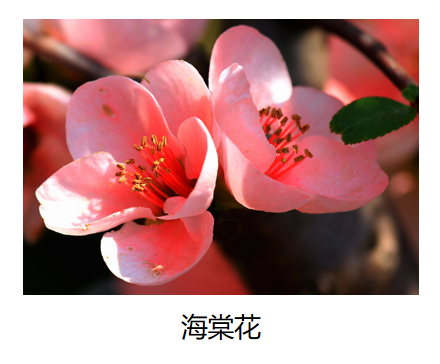
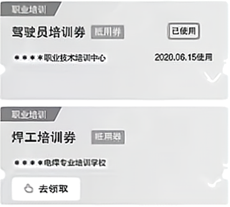

**2021年高考北京卷真题思想政治试题**

**第一部分**

**在每题列出的四个选项中，选出最符合题目要求的一项。**

1\. 革命文物承载党和人民英勇奋斗的光荣历史，记载中国革命的伟大历程和感人事迹。2021年“五四”青年节，中国国家博物馆推出“国博有约五四党课”直播节目，从“复兴之路”展厅“出发”，讲述革命文物背后的故事，走近百年前中国共产党人的壮丽青春，612万网友进入直播间，纷纷点赞、留言。给这则新闻加个标题，最合适的是（ ）

A. 坚守中华文化立场，面向世界、面向未来

B. 继承弘扬优秀传统文化，引领风尚、服务社会

C. 拉近革命文物与公众的距离，促进文化产业发展

D. 创新传播方式，让革命精神“活”在当代中国人血脉中

【答案】D

【解析】

【详解】A：材料强调的是革命文物、革命精神，这与“面向世界”无直接关系，A排除。

B：材料强调的是红色文化、革命文化，而不是强调继承弘扬优秀传统文化，B排除。

C：材料强调的是公益性文化事业，而不是强调文化产业的发展，C排除。

D：“国博有约五四党课”直播节目，从“复兴之路”展厅“出发”，讲述革命文物背后的故事，走近百年前中国共产党人的壮丽青春，612万网友观看点赞、留言，这表明创新传播方式，让革命精神“活”在当代中国人血脉中，D符合题意。

故本题选D。

2\. “一字一图画，一语一境界。”中文优美、简约、深邃、博大，书写并传承了中华文化。中文是联合国指定的六种国际官方语言文字之一，联合国设定每年4月20日为“中文日”，取典于仓颉在“谷雨”时节造字的传说。对此理解正确的是（ ）

①语言文字是文化创新的基础，展现了文化多样性

②语言文字是了解一国文化的钥匙，搭建了世界文化交流的桥梁

③汉字产生于中国传统习俗，是中华民族智慧结晶和全人类共同财富

④“中文日”有助于展示中华文化独特魅力，扩大中文影响力

A. ①② B. ①③ C. ②④ D. ③④

【答案】C

【解析】

【详解】②④：由题意知，中文优美、简约、深邃、博大，书写并传承了中华文化。中文是联合国指定六种国际官方语言文字之一，联合国设定每年4月20日为“中文日”。可见语言文字是了解一国文化的钥匙，搭建了世界文化交流的桥梁，“中文日”有助于展示中华文化独特魅力，扩大中文影响力。故②④符合题意。

①：文化创新的基础是社会实践，而不是语言文字，故①说法错误。

③：汉字是中华文化的基本载体，产生于人民的社会实践，而不是中国传统习俗。故③说法错误。

故本题选C。

3\. 近期，北京调整了千余处公交车站名称，其中多处恢复了历史悠久的老地名。如“祈年大街北口”站改为“打磨厂”站，“龙潭路西口”站改为“东四块玉”站，“东花市大街”站改为“铁辘轳把”站……老地名的恢复留住了一份念想。公交站“唤回”老地名（ ）

A. 是对市民文化需求的表达，说明文化根源于人们的情感需要

B. 是对城市历史印记的保留，能彰显城市的历史积淀和文化底蕴

C. 是对地名文化意义的挖掘，延续并且增强了公交站的文化生命力

D. 是对传统文化发展的促进，融合了城市发展新理念与民族传统精神

【答案】B

【解析】

【详解】A：文化根源于社会实践，A错误。

B：恢复历史悠久的老地名，给城市留住一份念想，这说明公交站“唤回”老地名是对城市历史印记的保留，能彰显城市的历史积淀和文化底蕴，B符合题意。

C：公交站“唤回”老地名，其目的是延续城市历史与文化，延续历史的脉络与印记，厚重城市文化底蕴，而不是延续并且增强了公交站所谓的的文化生命力，C排除。

D：传统文化既有精华也有糟粕，不能一味发展，况且公交站“唤回”老地名的目的是城市的历史积淀和文化底蕴，与城市发展新理念没有关系，D排除。

故本题选B。

4\. 在吉祥戏院看戏是一代北京人的美好记忆，梅兰芳、马连良等诸多京剧大师都曾在此演出。近日，被拆除的吉祥戏院获得“重生”，新吉祥戏院既传承了老戏院的经典形象，又采用了不少国际先进的技术设备，将成为国粹艺术传承展示体验基地和多元文化活动平台。新吉祥戏院（ ）

A. 历久弥“新”，在文化传承和创新中起了决定性作用

B. 推陈出“新”，符合时代特点和文化发展实践的需要

C. 返本开“新”，实现了传统文化与现代文化的相互转化

D. 革故鼎“新”，取其精华，去其糟粕，实现了文化形式的创新

【答案】B

【解析】

【详解】A：社会实践在文化传承和创新中起决定性作用，A错误。

B：既传承老戏院的经典形象，又采用不少国际先进的技术设备，将成为国粹艺术传承展示体验基地和多元文化活动平台，这说明新吉祥戏院推陈出“新”，符合时代特点和文化发展实践的需要，B符合题意。

C：传统文化与现代文化的时间指向分别是历史与现代，二者不能相互转化，C错误。

D：革故鼎“新”，取其精华，去其糟粕，不能全面概述题意，因为题意还包括面向世界，博采众长，D排除。

故本题选B。

5\. 从孔子到王阳明，从苏格拉底到黑格尔，众多哲学家就像是璀璨星河中的一颗颗星辰。纵观哲学发展史，也许哲学家们解答晢学问题的具体内容已经“过时”，但是他们解答问题的特有方式却具有永恒价值。这说明（ ）

A. 哲学作为先进的社会意识，其发达程度取决于社会存在的高度发展

B. 认识是无限发展的，哲学追求是一个永无止境的过程，需要不断完善自身

C. 哲学家是真理的发现者，真理都是主体与客体、理论与实践的具体的历史的统一

D. 哲学具有时代性，而哲学思维以其特有的反思精神与批判精神不断激发思想

【答案】D

【解析】

【详解】A：哲学有科学与非科学之别，并非所有的哲学都是先进的社会意识，A错误。

B：追求真理是一个永无止境的过程，需要不断完善自身，B错误。

C：哲学家是真理的发现者，也可能是谬误的制造者，C错误。

D：哲学家解答问题的特有方式却具有永恒价值，这说明哲学具有时代性，而哲学思维以其特有的反思精神与批判精神不断激发思想，D正确切题。

故本题选D。

6\. 浅溪曲涧，步石几点。汀步本是小溪中的渡水设施，现在被广泛应用于园林，铺设在草坪上，营造出独特的意趣。有人说，汀步的间距不合理，一步太小，两步又太大：也有人说，汀步间距的设计就是为了让人放慢脚步，边走边欣赏，而且这种设计还能照顾到老人和小孩。对此，评论恰当的是（ ）

\`r`n`r`nA. 草坪汀步作为园林道路其个性寓于路的共性之中

B. 草坪汀步说明审美追求和以人为本可以有机结合

C. 同一事物的主要矛盾和次要矛盾的区别因人而异

D. 矛盾的解决是以牺牲矛盾双方的某一方为条件的

【答案】B

【解析】

【详解】A：应该是普遍性寓于特殊性之中，A错误。

B：让人放慢脚步，边走边欣赏，还能照顾到老人和小孩，这说明审美追求和以人为本可以有机结合，B符合题意。

C：材料反映了矛盾双方的关系，但未涉及主要矛盾和次要矛盾，C排除。

D：矛盾双方的斗争是绝对的、无条件的，“矛盾的解决是以牺牲矛盾双方的某一方为条件的”说法错误，D排除。

故本题选B。

7\. 平安大街是北京老城区核心干道，途经皇城根遗址、什刹海、北海公园等名胜古迹。近来，市民发现宽阔的大街变绿变静了，两侧加了“绿带”，中间加了国槐与时令花卉组成的3米宽隔离带，机动车道“瘦身”，还添加了行人安全岛，步行、骑行环境大大改善。平安大街的变化（ ）

①实现了“慢行优先”“静下来”，促使矛盾的同一性转化为斗争性

②是城市发展的缩影，反映了价值判断和价值选择的社会历史性特征

③更注重环境的安全与舒适，体现了意识活动的自觉性和直接现实性

④协调了交通、绿化和城市风貌的关系，体现了合规律性与合目的性

A. ①② B. ①③ C. ②④ D. ③④

【解析】

【详解】①：矛盾双方在一定条件下相互转化，矛盾的同一性和斗争性不能转化，①错误。

②：平安大街的变化，是近期的变化，是城市发展的缩影，反映了价值判断和价值选择的社会历史性特征，②正确切题。

③：意识活动没有直接现实性，实践具有直接现实性，③错误。

④：变绿变静、加了“绿带”、设置隔离带、机动车道“瘦身”，还添加了行人安全岛，步行、骑行环境大大改善，这表明平安大街的变化协调了交通、绿化和城市风貌的关系，体现了合规律性与合目的性，④符合题意。

故本题选C。

8\. 某校学生在学习“公民参与”相关内容时，尝试提出了以下建议，其中合理的是（ ）

|                                              |                                             |                                                        |                                                 |
|:-------------------------------------------- |:------------------------------------------- |:------------------------------------------------------ |:----------------------------------------------- |
| ①                                            | ②                                           | ③                                                      | ④                                               |
| 学校门口上下学时间，有家长车辆乱停乱放，影响安全。建议交管部门规划即停即走的临时停车位。 | 为降低中小学生近视率，建议市卫生健康委员会出台“儿童青少年近视防控法”，提供法律保障。 | 老旧小区改造常因邻里意见不一而出现各种矛盾，建议人大代表实地调研，广泛收集居民意见建议，推进改造方案的优化。 | 我们村要求村民都改种景观树，建议凡涉及村民利益的事应该遵循少数服从多数的原则，由全体村民决定。 |`r`n`r`nA. ①② B. ①③ C. ②④ D. ③④

【答案】B

【解析】

【详解】①：学校门口上下学时间，有家长车辆乱停乱放，影响安全。建议交管部门规划即停即走的临时停车位，这属于公民通过社情民意反映制度参与民主决策，①正确。

②：市卫生健康委员会无权出台“儿童青少年近视防控法”，人大拥有立法权，②错误。

③：“老旧小区改造常因邻里意见不一而出现各种矛盾，建议人大代表实地调研，广泛收集居民意见建议，推进改造方案的优化”属于通过人大代表联系群众制度参与民主监督，③正确。

④：凡是涉及全村村民利益的事，都由村民会议按少数服从多数的原则讨论决定，而不是“由全体村民决定”，④错误。

故本题选B。

9\. 大觉寺的古寺兰香、明城墙下的千株梅花、紫禁城的雪落梨花……今春，北京市文化和旅游局推出了12条“花开的日子——漫步北京赏春花读建筑主题游”线路，邀市民朋友在赏花的同时了解北京的建筑。这一做法（ ）

|                                                                                                                                                     |                                                                                                                                                     |
|:--------------------------------------------------------------------------------------------------------------------------------------------------- |:--------------------------------------------------------------------------------------------------------------------------------------------------- |
|  |  |
| 元大都遗址公园海棠花溪、宋庆龄故居、故宫文华殿、法源寺                                                                                                                         | 长安街、颐和园、潭柘寺、大觉寺北京国际雕塑公园                                                                                                                             |

①挖掘了旅游资源的内涵，促进文旅融合 

②丰富了服务的市场化供给，助力旅游业复苏

③体现了政府的文化职能，满足群众文化需求 

④激发了社会活力，完善公共文化服务体系

A. ①③ B. ①④ C. ②③ D. ②④

【答案】A

【解析】

【详解】①③：春花读建筑，市民在赏花的同时了解北京的建筑，这挖掘了旅游资源的内涵，促进文旅融合，体现了政府的文化职能，满足群众文化需求，①③符合题意。

②：活动为政府推出，不属于市场化供给，②排除。

④：“激发了社会活力，完善公共文化服务体系”在夸大“花开的日子—漫步北京赏春花读建筑主题游”这一活动的作用，④排除。

故本题选A。

10\. “与君远相知，不道云海深。”2021年是博鳌亚洲论坛成立20周年，世纪疫情之下，身处不同时区的嘉宾，通过线上线下的方式加入这场盛会，共话全球热点问题。论坛部分年会的主题如下：

|             |                          |
|:----------- |:------------------------ |
| 2002年（第一届）  | 新世纪、新挑战、新亚洲——亚洲经济合作与发展   |
| 2012年（第十一届） | 变革世界中的亚洲：迈向健康与可持续发展      |
| 2021年（第二十届） | 世界大变局：共襄全球治理盛举合奏“一带一路”强音 |

上述资料最适合论证下列哪一观点（ ）

A. 加强双边合作，贡献中国智慧

B. 坚持国家利益至上，尊重他国关切

C. 更多参与、更多行动，做全球发展的贡献者

D. 坚持单边行动与集体行动相结合，促进一体化

【答案】C

【解析】

【详解】A：博鳌亚洲论坛年会主题围绕的是亚洲或全球，不涉及两个国家之间双边合作，也未强调贡献中国智慧，A排除。

B：应该是坚持国家利益至上，尊重他国合理关切，B错误。

C：博鳌亚洲论坛年会的主题表明应更多参与、更多行动，做全球发展的贡献者，C符合题意。

D：亚太经济合作组织坚持单边行动与集体行动相结合，而试题考查的是“博鳌亚洲论坛”，D排除。

故本题选C。

11\. “职业培训券，1000万张在路上！”职业培训券是人力资源和社会保障部门对符合条件的劳动者进行职业技能培训补贴的电子凭证。劳动者可以通过电子社保卡应用程序领取该券，在指定期限内到相关培训机构使用。推行职业培训券（ ）

①着力于多种形式的收入再分配，实现社会公平

②可推动技能型劳动者的培养，促进更高质量就业

③可扩大培训行业市场准入，实现便民与惠企的统一

④可精准对接培训资源和培训需求，提升职业技能培训的信息化水平

A. ①③ B. ①④ C. ②③ D. ②④

【答案】D

【解析】

【详解】①：推行职业培训券，其目的是便民与惠民，助推就业，并不是收入再分配，实现社会公平，①排除。

②：给予有关劳动者进行职业技能培训补贴，会提升培训热情，提高有关劳动者职业技能，促进更高质量就业，②符合题意。

③：发放职业培训券，强调的是便民与惠民，与培训行业市场准入没有直接必然关系，③排除。

④：通过电子社保卡应用程序领取该券，在指定期限内到相关培训机构使用，这样可以精准对接培训资源和培训需求，提升职业技能培训的信息化水平，④符合题意。

故本题选D。

12\. 

|                                                                                                                                                                                                      |
|:---------------------------------------------------------------------------------------------------------------------------------------------------------------------------------------------------- |
| 电脑键盘的字母排序为什么从Q-W-E-R-T-Y而非A-B-C-D-E-H开始呢？这要从打字机时代说起。因为字母的使用频率不同，按字母表顺序排列会影响打字速度，但把常用字母集中放置又容易导致打字杆纠缠在一起。经过初期的市场竞争，1873年某公司推出的Q-W-E-R-T-Y键盘被多数人使用，几年内其他打字机生产商都开始改用这一布局。电脑键盘问世后，字杆纠缠问题不复存在，但按键布局却沿用至今。 |

关于以上材料解读不正确的是（ ）

A. 注重效率标准的市场调节存在滞后性

B. 新产品的问世要考虑技术上的相互关联性

C. 技术标准存在规模效应，市场占有率越高，效率越高

D. 经济行为存在路径依赖，历史的偶然不可忽略

【答案】A

【解析】

【详解】A：滞后性指的是一种事后调节，从价格形成、价格信号传递到商品生产的调整有一定的时间差。注重效率标准与滞后性矛盾，而且材料也不涉及市场调节的滞后性，A错误但符合题意。

B：按字母表顺序排列会影响打字速度，但把常用字母集中放置又容易导致打字杆纠缠在一起，这表明新产品的问世要考虑技术上的相互关联性，B正确但不符合题意。

C：经过初期的市场竞争，Q-W-E-R-T-Y键盘被多数人使用，其他打字机生产商都改用这一布局，这说明技术标准存在规模效应，市场占有率越高，效率越高，C正确但不符合题意。

D：字母的使用频率不同影响打字速度，人们研发Q-W-E-R-T-Y键盘，字杆纠缠问题不复存在，效率提高，这说明经济行为存在路径依赖，历史的偶然不可忽略，D正确但不符合题意。

故本题选A。

13\. 下列选项分别给出了数字经济的一个特征及其对应的经济现象，其中关联正确的是（ ）

A. 低搜寻成本 搜寻潜在交易信息的成本下降→共享经济模式的兴起

B. 低复制成本 多生产一单位产品所需成本几乎为零→网络社交媒体的流行

C. 低运输成本 信息的运输成本几乎为零→互联网广告的定向投送

D. 低追踪成本和验证成本 经济活动的记录、存储、追踪、验证更为便利→数字产品的捆绑销售

【答案】A

【解析】

【详解】A：共享经济是一个组织、机构或个人将自己的闲置物品的使用权通过中间第三方平台转移给陌生人的—种新的经济模式，数字经济的低搜寻成本 搜寻潜在交易信息的成本下降会导致共享经济模式的兴起，A正确。

B：网络社交媒体的主要功能是社交，与数字经济没有必然的关系，B排除。

C：互联网广告的定向投送与数字经济的低运输成本 信息的运输成本几乎为零没有直接关系，C排除。

D：捆绑销售是将两种产品捆绑起来销售的销售和定价方式，不是所有的企业的产品和服务都能随意地“捆绑”在一起，D排除。

故本题选A。

14\. 据报道，欧盟最近对奥地利、德国和比利时三国的国家铁路公司开出4800多万欧元罚单。调查发现，这三家铁路公司在跨境铁路整车货运服务中互通客户询价信息，提高报价，形成了一个垄断联盟。下列表述正确的是（ ）

A. 三家铁路公司形成垄断联盟的目的是通过增加各自的货运量提高利润水平

B. 垄断联盟提升了铁路货运在货物运输市场的竞争力，但妨碍资源有效配置

C. 欧盟开出罚单的根本原因是垄断联盟导致三家铁路公司更多为本国利益服务

D. 欧盟的处罚决定可以使铁路货运价格和运营成本更加接近，提升经济效率

【答案】D

【解析】

【详解】A：依题意，三家铁路公司形成垄断联盟的目的是通过提高报价提高利润水平，而不是通过增加各自的货运量提高利润水平，A排除。

B：提高报价可能会降低竞争力，而不是提升竞争力，B错误。

C：欧盟开出罚单的根本原因是垄断联盟破坏了公平竞争环境，损害了市场主体和消费者利益，而不是因为三家铁路公司是不是更多为本国利益服务，C错误。

D：三家铁路公司因提高报价而受罚，这说明欧盟的处罚决定可以使铁路货运价格和运营成本更加接近，提升经济效率，D符合题意。

故本题选D。

15\. 下图给出了2001~2018年我国国产粮食和进口粮食的价格变化情况。

\`r`n`r`n下列表述正确的是（ ）

①2001-2018年，国产稻谷的价格竞争优势总体上升

②2010年以后，国产小麦与玉米开始具有一定的价格竞争优势

③国产大豆在市场价格方面长期处于国际竞争的劣势

④我国是农业大国，但在国际粮食市场上的比较优势有待加强

A. ①② B. ①④ C. ②③ D. ③④

【答案】D

【解析】

【详解】①：第一图图示表示2001-2018年国产稻谷价格总体上升，这意味着国产稻谷价格竞争优势总体降低，①不符合题意。

②：第二、第三图图示表示2010年以后，国产小麦与玉米价格开始高于进口小麦与玉米价格，这会失去价格竞争优势，②不符合题意。

③：第四图图示表示国产大豆市场价格高于进口大豆价格，这会使得国产大豆在市场价格方面长期处于国际竞争的劣势，③符合题意。

④：四张图表示国产粮食在国际市场没有价格优势或比较优势降低，这说明我国是农业大国，但在国际粮食市场上的比较优势有待加强，④符合题意。

故本题选D。

**第二部分**

16\. 

<table>
<colgroup>
<col style="width: 100%" />
</colgroup>
<tbody>
<tr>
<td style="text-align: left;">

房子可以遮风避雨就好了，为什么还要雕刻彩绘？茶碗器皿能用就好了，为什么还要烧制出各种图案？语言可以表达意思就好了，为什么还要有讲求韵律的诗歌？
</td>
</tr>
</tbody>
</table>`r`n`r`n运用《文化生活》知识，谈谈你对上述问题的思考。

【答案】可从文化对人的影响、促进人的全面发展等角度回答。

|      |                                              |
|:---- |:-------------------------------------------- |
| 等级水平 | 等级描述                                         |
| 水平4  | 观点鲜明，能明确表达自己的见解；紧扣问题，综合运用所学知识展开论述；逻辑严密，条理清晰  |
| 水平3  | 观点比较明确，能表达自己的见解；能扣住问题展开论述，知识运用比较准确：逻辑性较强，有条理 |
| 水平2  | 观点不明确；论述不能集中指向问题，罗列知识；知识运用不正确；论述缺乏逻辑，条理性差    |
| 水平1  | 应答与试题无关；或重复试题内容；或没有应答                        |

【解析】

【分析】背景素材：文化载体

考点考查：文化对人的影响、优秀文化的作用的有关知识，分析文化现象对人的影响

能力考查：获取和解读信息，调动和运用知识，描述和阐述事物

核心素养：科学精神

【详解】第一步：审设问，明确主体、作答范围、问题限定和作答角度。本题要求运用《文化生活》知识，谈谈你对上述问题的思考，属于认识类的解答题。

第二步：审材料，通过标点符号、段落等，提取材料有效信息。

有效信息①：对文化载体赋予文化意义→可联系文化对人的影响。

有效信息②：人们浸润优秀文化→可联系优秀文化的作用。第三步：整合信息，组织答案。

得分点①：文化对人的影响，来自于特定的文化环境，来自于各种形式的文化活动+人们置身文化环境，感受文化熏陶。

得分点②：文化对人的影响是潜移默化的+将物质赋予文化意义。

得分点③：优秀文化促进人的全面发展+雕刻彩绘、绘画、诗歌等优秀文化能提升人的文化素养。

注：考生亦可从其它角度回答，言之有理，言之有据，即可。

【点睛】对开放性题目，要用好发散思维方式。解答好开放题切记要从多角度思考问题，联系社会生活实际，从教材内外知识的结合上来回答问题，要有自己的见解和创新。

17\. 数据已成为国家基础性战略资源，数据治理是数据资源及其应用过程中相关管控活动、绩效和风险管理的集合。

政府在推进数据治理方面已取得了积极成效。新冠肺炎疫情防控，小小健康码助力10亿级人口提升精准防控能力；日常政务服务，从“最多跑一次”到实现24小时“不打烊”“一网通办”……“十四五”规划和2035年远景目标纲要提出，“迎接数字时代，激活数据要素潜能”。

数据治理涉及公民、政府、企业、社会组织等多方主体，需要界定各方权限和责任。在提升公共服务和社会治理数字智能化水平、扩大基础公共信息数据有序开放、加强数据资源安全保护等方面，还有待完善。

结合材料，运用《政治生活》知识，说明政府如何运用法治思维推进数据治理。

【答案】政府在推进数据治理中要强化法治意识，明确政府在推进数据治理中的权责。依法推进数据治理，防止权力缺失和滥用，保护各方主体的合法权益，依法有序开放基础公共信息数据，主动接受监督。制定和完善数据共享、数据资源安全保护、促进数字经济发展等相关的政策法规，提高数据治理的法治化水平。

【解析】

【分析】背景素材：数据资源

考点考查：法治思维的有关知识，分析政府如何运用法治思维推进数据治理

能力考查：获取和解读信息，调动和运用知识，描述和阐述事物的能力

核心素养：政治认同、科学精神

【详解】第一步：审设问，明确主体、作答范围、问题限定和作答角度。

本题的设问主体为政府， 需要调用法治思维的有关知识，分析政府运用法治思维推进数据治理。

第二步：审材料，通过标点符号、段落等，提取材料有效信息。

有效信息①：界定各方权限和责任→可联系依法行政。

有效信息②：提升社会治理数字智能化水平、扩大基础公共信息数据有序开放→可联系依法行政、政务公开。

有效信息③：加强数据资源安全保护→可联系依法行政。

第三步：整合信息，组织答案。

得分点①：法定职责必须为，勇于负责+强化法治意识，明确政府在推进数据治理中的权责。

得分点②：依法行政、政务公开+推进数据治理，防止权力缺失和滥用，保护各方主体的合法权益，依法有序开放基础公共信息数据，主动接受监督。

得分点③：依法行政+制定和完善数据共享、数据资源安全保护、促进数字经济发展等相关的政策法规，提高数据治理的法治化水平。

【点睛】解答“措施类”主观题，可采用回归教材法，看看课本上有没有给我们提供解决这一问题的措施和方法，把设问与课本知识联系起来。可采用挖掘材料法，结合背景材料运用相关知识，找出问题的答案。挖掘材料时从材料中找出关键的语句；对材料分层，概括层意，分析材料，从材料中找出原因，针对原因或问题找出解决的措施；或者从反面吸取经验教训，正面归纳答案；或者从材料中的具体做法概括答案要点。

18\. 材料一 1981年，全国人大通过了《关于开展全民义务植树运动的决议》，植树造林、绿化祖国成为中国每一位适龄公民的法定义务。2019年有国际科研机构发现，世界越来越绿了，中国是促进这一改变的重要贡献者之一，全球从2000年到2017年新增的绿化面积约四分之一来自中国。

\`r`n`r`n坚持不懈植绿造绿、养绿护绿，是中国建设生态良好的地球美好家园的有力体现，也成为中国推动实现人与自然和谐共生的现代化的生动缩影。中国大力推动绿色生产和绿色消费，形成节约资源和保护环境的空间格局、产业结构、生产方式、生活方式，向世界递出了“绿色名片”。

材料二 中国积极倡导并推动将绿色生态理念贯穿于共建“一带一路”倡议，主张“把绿色作为底色，推动绿色基础设施建设、绿色授资、绿色金融，保护好我们赖以生存的共同家园”。

从柬埔寨额勒赛水电站，到哈萨克斯坦扎纳塔斯的风电项目，再到埃塞俄比亚索马里州光伏电站；从非洲的气候遥感卫星，到东南亚的低碳示范区，再到小岛国的节能灯……中国通过多种形式的务实合作，推动绿色发展。2021年4月，在领导人气候峰会上，习近平主席进一步倡导“共商应对气候变化挑战，共谋人与自然和谐共生之道”。

材料一和材料二涉及了构建“人与自然生命共同体”的两种做法。运用哲学观点，分析中国是如何统筹这两种做法推动构建“人与自然生命共同体”的。

【答案】树立全局观念，从整体角度考虑如何构建“人与自然生命共同体”。把本国的事情办好，坚持植树造林，贯彻落实绿色发展理念，推动本国的绿色发展，用部分的发展带动整体的发展；做全球生态文明建设的参与者、贡献者、引领者，通过一系列倡议和务实合作，推动全球绿色发展，通过加强部分之间的合作，优化整体功能，推动构建“人与自然生命共同体”。

【解析】

【分析】背景素材：中国推动构建人与自然和谐共生

考点考查：整体和部分的辩证关系

能力考查：调动和运用知识，描述和阐释事物

核心素养：科学精神

【详解】第一步：审设问，明确主体、作答范围、问题限定和作答角度。

本题的设问主体为中国， 需要调用哲学相关知识，分析如何统筹材料一二两种做法推动构建“人与自然生命共同体”的。考生可联系课本知识和材料内容回答做法。

第二步：审材料，通过标点符号、段落等，提取材料有效信息。

有效信息①：植树造林、绿化祖国成为中国每一位适龄公民的法定义务、中国大力推动绿色生产和绿色消费，形成节约资源和保护环境的空间格局、产业结构、生产方式、生活方式，向世界递出了“绿色名片”→立足整体，树立全局观念；同时重视部分的作用，用部分的发展带动整体的发展；

有效信息②：中国通过多种形式的务实合作，推动绿色发展→加强部分之间的合作，优化整体功能。

第三步：整合信息，组织答案。

得分点①：立足整体，树立全局观念+从整体角度构建“人与自然生命共同体”。

得分点②：重视部分的作用+推动本国的绿色发展，用部分的发展带动整体的发展。

得分点③：注重系统内部结构优化趋向，优化整体功能+加强部分之间的合作，推动全球绿色发展。

【点睛】措施类主观题方法总结：

方法1：围绕主体寻答案。从不同主体的视角进行思维发散，考虑不同的主体在解决某一问题中负有怎样的责任，该做出怎样的努力。如国家（政府）应该怎样做、企业（单位）应该怎样做、个人（公民、消费者）应该怎样做等。

方法2：“三联系”寻答案。

（1）联系教材（课本）寻答案。我们学习和掌握知识的目的便是为了运用知识解决问题，所以在解答“措施”类题目时首先要做的便是联系课本，看看课本（教材）有没有给我们提供解决这一问题的措施和方法。

（2）联系材料寻答案。在答题过程中要看看材料给解答这个问题提供了哪些有用的信息，如果材料呈现的是问题或困难，对症下药提出措施就是答案；如果材料呈现的是成功经验，对材料中的措施与经验加以概括总结，并使之与教材理论相符合，即答案。

（3）联系时政。从时政知识、党和国家的现行方针政策中寻找解决问题的办法。

19\. 在开放的、相互促进的国内国际双循环的新发展格局下，中国将更加积极地参与国际分，更加有效地融入全球价值链。

全球价值链是指将生产过程分布在两个以上的国家，一国企业专注于特定环节，不生产整个产品。不同国家参与全球价值链的类型可以分为四种：初级产品、初级制造业、先进制造业与服务业、创新活动。参与全球价值链有助于国内资源整合和经济循环，从而促进就业和收入增长。

全球价值链参与类型通常受四方面因素的影响：

◇ 地理位置：地理区位、互联互通条件

◇ 要素票赋：资本、劳动力、自然资源、技术

◇ 市场规模：国内市场、国外市场

◇ 制度质量：合同执行、产权保护、标准认证

1990年至今，中国全球价值链参与类型从初级制造业攀升至先进制造业与服务业。从以上四方面因素中任选两个，谈谈哪些有针对性的政策措施有助于我国融入更先进的全球价值链。

【答案】地理位置：改善道路和港口等贸易基础设施：加强信息和通信技术基础设施建设，加强与周边国家基础设施互联互通等。

要素禀赋：拓宽多种融资渠道，改善营商环境，吸引外国直接投资；重视创新和高技能人才培养等。

市场规模：减少贸易壁垒，放宽市场准入；加大对外直接投资；加强国际合作，寻求和深化贸易协议等。

制度质量：完善经贸法律和规则体系；大力保护知识产权；加强国家对标准的制定、认证和检测能力等。

【解析】

【分析】背景素材：全球价值链

考点考查：经济全球化、发展更高层次的开放型经济的有关知识，分析我国融入更先进的全球价值链

能力考查：获取和解读信息，调动和运用知识，描述和阐述事物

核心素养：科学精神

【详解】第一步：审设问，明确主体、作答范围、问题限定和作答角度。本题的设问主体为我国， 需要调用经济全球化、发展更高层次的开放型经济的有关知识，分析我国融入更先进的全球价值链的措施。

第二步：审材料，通过标点符号、段落等，提取材料有效信息。有效信息①：地理位置：地理区位、互联互通条件→可联系基础设施建设。

有效信息②：要素票赋：资本、劳动力、自然资源、技术→可联系金融全球化、创新、人才。

有效信息③：市场规模：国内市场、国外市场→可联系公平竞争、对外投资、国际合作。

有效信息④：制度质量：合同执行、产权保护、标准认证→可联系法律与规则、知识产权、质量标准。

第三步：整合信息，组织答案。

得分点①：地理位置+改善道路和港口等贸易基础设施：加强信息和通信技术基础设施建设：加强与周边国家基础设施互联互通等。

得分点②：要素票赋+拓宽多种融资渠道：改善营商环境，吸引外国直接投资；重视创新和高技能人才培养等。

得分点③：市场规模+减少贸易壁垒，放宽市场准入；加大对外直接投资；加强国际合作，寻求和深化贸易协议等。

得分点④：制度质量+完善经贸法律和规则体系；大力保护知识产权；加强国家对标准的制定、认证和检测能力等。

【点睛】解答“措施类”主观题，可采用回归教材法，看看课本上有没有给我们提供解决这一问题的措施和方法，把设问与课本知识联系起来。可采用挖掘材料法，结合背景材料运用相关知识，找出问题的答案。挖掘材料时从材料中找出关键的语句；对材料分层，概括层意，分析材料，从材料中找出原因，针对原因或问题找出解决的措施；或者从反面吸取经验教训，正面归纳答案；或者从材料中的具体做法概括答案要点。

20\. 人力资本是劳动者积累的知识、技能和健康水平的总和，是一国消除贫困和实现经济可持续增长的重要驱动力。

材料一 教育是积累人力资本的主要途径之一。右图给出了2015年中国1%人口抽样调查中的高等教育覆盖率数据。左纵轴表示各年龄段人口中拥有大专及以上学历者的占比，右纵轴表示城镇和农村地区这一占比的比值。

（1）材料一反映了什么信息？

材料二 人力资本的个人回报相当丰厚，有研究发现，劳动者的受教育年限每增加一年，劳动收入平均会提高5~15%。但有些家庭受固有观念的束缚，没有意识到人力资本的重要性还有些家庭愿意投资改善健康和教育状况，却可能心有余而力不足。此外，人力资本的社会回报同样不容忽视，提升全社会的人力资本水平有助于促进科技创新、公民参与和社会和谐。

（2）结合材料二，运用《经济生活》知识，谈谈在培育人力资本方面，为什么需要政府发挥重要作用。

【答案】（1）高等教育覆盖率不断上升；高等教育覆盖率的城乡差距总体上不断缩小。 

（2）市场调节存在盲目性，个人可能由于信息的匮乏和观念的限制，对人力资本的重要性认识不足，需要政府引导。低收入家庭人力资本投资负担较重，需要政府提供补贴和资助，促进社会公平。个人的人力资本投资会忽视或低估其社会回报，因此人力资本投资不能完全由市场调节，需要政府在教育、卫生等方面增加财政投入，以弥补个人投资不足，提升全社会的人力资本水平。

【解析】

【分析】背景素材：人力资本

考点考查：乡村振兴、财政作用、市场调节的缺陷、宏观调控的有关知识，分析我国人力资本状况

能力考查：获取和解读信息，调动和运用知识，描述和阐述事物

核心素养：政治认同、科学精神

【小问1详解】

第一步：审设问，明确主体、作答范围、问题限定和作答角度。

本题的设问主体为我国， 需要调用乡村振兴的有关知识，分析我国我国人力资本状况。

第二步：审图表及注释，提炼有效信息。

有效信息①：高等教育覆盖率数据→年龄组年龄小，数据大。

有效信息②：各年龄段人口中拥有大专及以上学历者的占比→年龄组年龄小，数据大。

有效信息③：城镇和农村地区各年龄段人口中拥有大专及以上学历者的占比的比值→年龄组年龄小，数据小。

第二步：审材料，通过标点符号、段落等，提取材料有效信息。

有效信息①：高等教育覆盖率数据→可联系年龄组年龄比较。

有效信息②：城镇和农村地区各年龄段人口中拥有大专及以上学历者的占比的比值→可联系年龄组年龄比较。

第四步：整合信息，组织答案。

得分点①：高等教育覆盖率数据+高等教育覆盖率不断上升

得分点②：高等教育覆盖率的城乡差距+总体上不断缩小。

【小问2详解】

第一步：审设问，明确主体、作答范围、问题限定和作答角度。

本题的设问主体为政府，需要调用财政作用、市场调节的缺陷、宏观调控的有关知识，分析政府在培育人力资本方面的重要作用。

第二步：审材料，通过标点符号、段落等，提取材料有效信息。

有效信息①：有些家庭受固有观念的束缚→可联系财政作用。

有效信息②：可能心有余而力不足→联系正确的价值判断和价值选择的标志，把人民群众的利益作为最高的价值标准；

有效信息③：社会回报被忽视→联系宏观调控的必要性。

第三步：整合信息，组织答案。

得分点①：市场调节存在盲目性+个人可能由于信息的匮乏和观念的限制，对人力资本的重要性认识不足，需要政府引导。

得分点②：财政是促进社会公平的物质保障+低收入家庭人力资本投资负担较重，需要政府提供补贴和资助，促进社会公平。

得分点③：市场调节不是万能的，有的领域不能完全由市场调节+个人的人力资本投资会忽视或低估其社会回报，因此人力资本投资不能完全由市场调节，需要政府在教育、卫生等方面增加财政投入，以弥补个人投资不足，提升全社会的人力资本水平。

【点睛】第（1）问，本题属于图表分析题。结合本题呈现形式，本题的解答侧重于“读”，读图表，解题思路是正确利用表头信息，注意表头信息说明了图表所展示的问题是什么；全面分析图表内容本身，提取数据，纵横对比，说明理论知识，纵向看变化，横向看差距；注意图表中“注”的作用，补充思路，完善答案。

第（2）问，回答分析说明类问题，主要按以下思路进行：第一步，分析材料，把握主题，联想相关知识（本题知识角度已经给出）。第二步，围绕主题，回归教材，确认知识（细化知识要点并确认）。以试题反映出的问题为中心与教材联系，找出材料与教材的“结合点”。第三步，紧扣题意，合理作答。通常，我们只要将教材中的基本原理与材料一一对应，用理论分析材料即可。

21\. 我们党的一百年，是矢志践行初心使命的一百年，是筚路蓝缕奠基立业的一百年，是创造辉煌开辟未来的一百年。

<table>
<colgroup>
<col style="width: 10%" />
<col style="width: 1%" />
<col style="width: 88%" />
</colgroup>
<tbody>
<tr>
<td style="text-align: left;">材料一</td>
<td colspan="2" style="text-align: center;">【事实与观点】</td>
</tr>
<tr>
<td colspan="3" style="text-align: left;">
从石库门到天安门，从兴业路到复兴路，50多人的组织发展成为了世界第一大党几代人坚毅前行、赓续发展，积贫积弱的国家成为了世界第二大经济体。“中国共产党并不曾使用什么魔术，他们只不过知道人民所渴望的改变”。建国初期，我国人均GDP不过119元，人均预期寿命35岁，约80%的人不识字，现在人均GDP已超过1万美元人均预期寿命达到77.3岁，文盲率下降为2.67%。占世界人口近五分之一的中国全面消除绝对贫困，实现了快速发展与大规模减贫同步，谱写了人类反贫困历史新篇章。

“中国共产党领导下的中国所取得的社会成就，和人类历史上任何国家相比都是最伟大的。”观察家说，“只有理解了中国共产党，才能真正理解中国”。
</td>
</tr>
<tr>
<td colspan="2" style="text-align: left;">材料二</td>
<td style="text-align: center;">【一以贯之】</td>
</tr>
<tr>
<td colspan="3" style="text-align: left;">
中国共产党的百年历史，是一部始终保持自身纯洁性、不断自我革命的历史。

◇ “难道我们还欢迎任何政治的灰尘、政治的微生物来玷污我们的清洁的面貌和侵蚀我们的健全的肌体吗？”抗战胜利前夕，毛泽东在《论联合政府》中这样问。

◇ “执政党应该是一个什么样的党，执政党的党员应该怎样才合格，党怎样才叫善于领导？”改革开放大幕初启，邓小平在党的十一届五中全会上这样问。

◇ “你们都知道温水煮青蛙的故事吧？”“杭州雷峰塔是怎么倒掉的？”2013年9月，习近平在河北省委常委班子专题民主生活会上这样不同历史时期的三次发问，贯穿其中的，是深切的忧患意识，是治党的责任担当。
</td>
</tr>
<tr>
<td colspan="2" style="text-align: left;">材料三</td>
<td style="text-align: center;">【理论强党】</td>
</tr>
<tr>
<td colspan="3" style="text-align: left;">
中国共产党的百年历史，是一部不断推进理论创新、进行理论创造的历史。

马克思主义深刻改变了中国，中国也极大丰富了马克思主义。一百年来，我们党坚持解放思想和实事求是相统一、培元固本和守正创新相统一，不断开辟马克思主义新境界，产生了毛泽东思想、邓小平理论、“三个代表”重要思想、科学发展观、习近平新时代中国特色社会主义思想，为党和人民事业发展提供了科学理论指导。
</td>
</tr>
</tbody>
</table>`r`n`r`n（1）“只有理解了中国共产党，才能真正理解中国”，结合材料一，运用《政治生活》知识，谈谈你对这句话的认识。

（2）站在“两个一百年”历史交汇点上，中国共产党，风华正茂，活力依然。结合材料综合运用《政治生活》和《生活与哲学》知识，说明党如何在充满挑战和充满希望的时代永葆青春活力。

【答案】（1）理解中国共产党就要理解中国共产党的性质、宗旨和历史使命，理解了中国共产党才能理解中国为什么能取得巨大的历史成就。中国特色社会主义最本质的特征是中国共产党领导，中国特色社会主义制度的最大优势是中国共产党领导，中国共产党是最高政治领导力量：中国共产党始终总揽全局、协调各方，始终坚持以人民为中心，实现最广大人民的根本利益，依靠人民创造历史伟业。 

（2）可从以人民为中心、群众路线；党的指导思想、理论与实践关系；党员的先锋模范作用、正确价值观等角度回答。

|      |                                                                                                                                                                                                |
|:---- |:---------------------------------------------------------------------------------------------------------------------------------------------------------------------------------------------- |
| 等级水平 | 等级描述                                                                                                                                                                                           |
| 水平4  | 观点鲜明，能明确表达自己的见解；紧扣问题，综合运用所学知识展开论述；逻辑严密，条理清晰                                                                                                                                                    |
| 水平3  | 观点比较明确，能表达自己见解；能扣住问题展开论述，知识运用比较准确：逻辑性较强，有条理 |
| 水平2  | 观点不明确；论述不能集中指向问题，罗列知识；知识运用不正确；论述缺乏逻辑，条理性差                                                                                                                                                      |
| 水平1  | 应答与试题无关；或重复试题内容；或没有应答                                                                                                                                                                          |

【解析】

【分析】背景素材：本题以中国共产党诞辰100周年设置情境。

考点考查：《政治生活》和《生活与哲学》知识。

能力考查：提取有效信息能力，调动和运用知识能力，描述和阐述事物能力。

核心素养：政治认同素养，科学精神素养。

【小问1详解】

第一步：审设问。

本题的知识指向是：《政治生活》中国共产党的知识，问题指向是：谈谈你对“只有理解了中国共产党，才能真正理解中国”这句话的认识。

第二步：审材料。

有效信息①：他们只不过知道人民所渴望的改变。建国初期，我国人均GDP不过119元，现在人均GDP已超过1万美元，人均预期寿命达到77.3岁，消除绝对贫困，实现了快速发展与大规模减贫同步，谱写了人类反贫困历史新篇章→可联系中国为什么能取得巨大的历史成就，是因为中国共产党的性质、宗旨和历史使命。

有效信息②：建国初期，我国人均GDP不过119元，现在人均GDP已超过1万美元，人均预期寿命达到77.3岁，消除绝对贫困，实现了快速发展与大规模减贫同步，谱写了人类反贫困历史新篇章→可联系这些成就的取得，离不开中国共产党的坚强正确的领导，中国特色社会主义最本质的特征是中国共产党领导，中国特色社会主义制度的最大优势是中国共产党领导，中国共产党是最高政治领导力量。

有效信息③：“中国共产党并不曾使用什么魔术，他们只不过知道人民所渴望的改变”→可联系中国共产党始终总揽全局、协调各方，始终坚持以人民为中心，实现最广大人民的根本利益，依靠人民创造历史伟业。

第三步：整合信息，组织答案。

得分点①：理解中国共产党就要理解中国共产党的性质、宗旨和历史使命，理解了中国共产党才能理解中国为什么能取得巨大的历史成就。

得分点②：中国特色社会主义最本质的特征是中国共产党领导，中国特色社会主义制度的最大优势是中国共产党领导，中国共产党是最高政治领导力量。

得分点③：中国共产党始终总揽全局、协调各方，始终坚持以人民为中心，实现最广大人民的根本利益，依靠人民创造历史伟业。

【小问2详解】

第一步：审设问

本题的知识指向是：《政治生活》和《生活与哲学》知识，问题指向是：说明党如何在充满挑战和充满希望的时代永葆青春活力。

第二步：审材料。

有效信息①：中国共产党并不曾使用什么魔术，他们只不过知道人民所渴望的改变→可联系坚持以人民为中心，坚持党的群众路线是党永葆青春活力的力量之源。

有效信息②：中国共产党的百年历史，是一部不断推进理论创新、进行理论创造的历史；一百年来，我们党坚持解放思想和实事求是相统一、培元固本和守正创新相统一，不断开辟马克思主义新境界→可联系党的指导思想、理论与实践关系，即中国共产党坚持解放思想，实事求是，与时俱进，以接续推进的马克思主义创新理论作为自己的行动指南使党永葆青春和活力，始终走在时代前面。

有效信息③：在充满挑战和充满希望的时代永葆青春活力；执政党的党员应该怎样才合格→可联系教材知识发挥党员的先锋模范作用，使党始终成为时代先锋，民族脊梁，永葆创造力、凝聚力和战斗力。

有效信息④：深切的忧患意识；中国共产党并不曾使用什么魔术，他们只不过知道人民所渴望的改变；始终保持自身纯洁性、不断自我革命→可联系正确价值观的导向作用。

第三步：整合信息，组织答案。

得分点①：以人民为中心+群众路线；

得分点②：解放思想，实事求是，与时俱进+以接续推进的马克思主义创新理论作为自己的行动指南+党的指导思想、理论与实践关系；

得分点③：党员的先锋模范作用；

得分点④：价值观的导向作用+正确价值观的指引。

【点睛】政治学科主观题，特别是材料分析题，往往都要解决三个逻辑：材料逻辑、知识逻辑、整合逻辑。材料逻辑就是对材料进行解读，一般是提取关键信息或者对材料进行意思上的分层；知识逻辑就是搜寻解答问题所需的相关联的知识点；整合逻辑就是将知识点和材料的解读有机结合在一起。做好这三步，问题也就基本迎刃而解。

