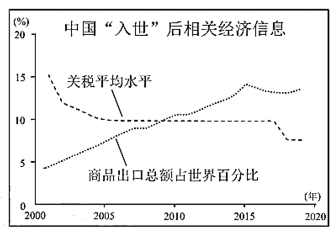
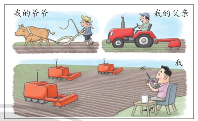

**2021年天津高考政治试题**

**本试卷分为第Ⅰ卷（选择题）和第Ⅱ卷（非选择题）两部分，共100分，考试用时60分钟。第Ⅰ卷1至4页，第Ⅱ卷5至6页。**

**答卷前，考生务必将自己的姓名、考生号、考场号和座位号填写在答题卡上，并在规定位置粘贴考试用条形码。答卷时，考生务必将答案涂写在答题卡上，答在试卷上的无效。考试结束后，将本试卷和答题卡一并交回。**

**祝各位考生考试顺利！**

**第Ⅰ卷**

**注意事项：1.每题选出答案后，用铅笔将答题卡上对应题目的答案标号涂黑。如需改动，用橡皮擦干净后，再选涂其他答案标号。**

**2.在每题给出的四个选项中，只有一项是最符合题目要求的。**

1\. 2021年是中国共产党成立100周年。我们党一百年，是矢志践行初心使命的一百年，是筚路蓝缕奠基立业的一百年，是创造辉煌开辟未来的一百年。这一百年，党团结带领人民完成和推进了一系列大事。下列大事与其意义对应正确的是（ ）

|                      |     |                                                   |
|:-------------------- |:--- |:------------------------------------------------- |
| ①完成新民主主义革命，建立中华人民共和国 | →   | 实现了中国从几千年封建专制政治向人民民主的伟大飞跃                         |
| ②完成社会主义革命，确立社会主义基本制度 | →   | 开启了全面建设社会主义现代化国家新征程                               |
| ③进行改革开放新的伟大革命        | →   | 开辟了中国特色社会主义道路                                     |
| ④全面建成小康社会            | →   | 完成了中华民族有史以来最为广泛而深刻的社会变革，为当代中国一切发展进步奠定了根本政治前提和制度基础 |

A. ①③ B. ①④ C. ②③ D. ②④

【答案】A

【解析】

【详解】①：中华人民共和国的成立，实现了中国从几千年封建专制政治向人民民主的伟大飞跃，彻底结束了旧中国半殖民地半封建社会的历史，使中华民族以崭新的姿态自立于世界民族之林，①对应正确。

②：开启全面建设社会主义现代化国家新征程是由中华人民共和国国民经济和社会发展第十四个五年规划和2035年远景目标纲要衍生出的政治名词，②对应错误。

③：1978年，我国开始进行改革开放新的伟大革命，开启了改革开放和社会主义现代化建设新时期，开辟了中国特色社会主义道路，③对应正确。

④：我国确立了社会主义基本制度，成功实现了中国历史上最深刻最伟大的社会变革，为当代中国一切发展进步奠定了根本政治前提和制度基础，④对应错误。 

故本题选A。

2\. 2021年中央部门花钱更透明，102个中央部门集中向社会公开年度预算。本年度财政预算报告要求“坚持政府过紧日子”，严把预算支出关口，进一步压减一般性支出，大力削减或取消低效无效支出。对此理解正确的是（ ）

A. 政府汇集社情民意，，提高决策科学性

B. 政府简政放权，提高公信力和执行力

C. 公民有决策权，政府要听取公民意见

D. 公民有知情权，政府要接受社会与公民的监督

【答案】D

【解析】

【详解】A：材料不涉及政府民主决策，科学决策，A排除。

B：材料不是反映“政府简政放权，提高公信力和执行力”的问题，B排除。

C：公民没有决策权，决策权在决策机关，C错误。

D：向社会公开年度预算，因为公民有知情权，政府要接受社会与公民的监督，D正确切题。

故本题选D。

3\. 新疆南隅塔克拉玛干沙漠深处，有一支特别的队伍——天津市大学生和田支教团。自2018年起，天津市每年选派两批志愿为民族地区教育事业作贡献的优秀大学生，赴和田地区开展支教工作。他们通过悉心陪伴、言传身教，让孩子们深切感受中华优秀传统文化和国家通用语言文字之美。这启示新时代青年学生要（ ）

①把增强中华民族共同体意识落到实处 

②保障好少数民族人民当家作主的权利

③以实际行动维护和发展社会主义民族关系 

④以自身努力促进社会主义民族关系的形成

A. ①③ B. ①④ C. ②③ D. ②④

【答案】A

【解析】

【详解】①③：天津市大学生和田支教团的事迹启示新时代青年学生要把增强中华民族共同体意识落到实处，以实际行动维护和发展社会主义民族关系，①③符合题意。

②：“保障好少数民族人民当家作主的权利”的主体是国家，而不是青年学生，②排除。 

④：建国后，我国社会主义民族关系就已经形成，④错误。

故本题选A。

4\. 英法两国同在欧洲，同样经历了资产阶级革命，英国资产阶级革命不彻底，保留了国王；法国资产阶级革命彻底地摧毁了封建专制制度，实行了民主共和制。这表明英法两国（ ）

①同为代议制国家，但各有特色 

②国体相同，政体没有相同之处

③国家结构形式有明显区别 

④政体的形成受阶级力量对比的影响

A. ①③ B. ①④ C. ②③ D. ②④

【答案】B

【解析】

【分析】

【详解】①④：依据题意，英法两国由于资产阶级革命是否彻底，一个保留了国王，另一个则实行了民主共和制，这表明英法两国同为代议制国家，但各有特色，政体的形成受阶级力量对比的影响，故①④入选。

②：英法两国国体相同，政体有相同之处，故②错误。

③：材料并未涉及英法两国的国家结构形式，故③不选。

故本题选B。

5\. 1971年，第26届联合国大会通过第2758号决议，恢复了中华人民共和国在联合国的一切合法权利。50年来，中国始终是世界和平的建设者，全球发展的贡献者，国际秩序的维护者，不断为联合国的崇高事业作出积极贡献。第2758号决议（ ）

A. 标志着中国对外开放进入新阶段

B. 彻底解决了中国在联合国的席位问题

C. 使中国在联合国一切事务的表决上享有了否决权

D. 为中国在国际舞台上发挥主导作用提供了重要保障

【答案】B

【解析】

【详解】A：中国加入世界贸易组织标志着中国对外开放进入新阶段，A不符合题意。

B：第26届联合国大会通过第2758号决议，恢复了中华人民共和国在联合国的一切合法权利，彻底解决了中国在联合国的席位问题，B符合题意。

C：中国在事关和平与安全的重大事务上享有否决权，而不是在联合国一切事务的表决上享有了否决权，C错误。

D：中国不谋求在国际舞台上的主导作用，D错误。

故本题选B。

6\. 我国经济发展获得巨大成功的一个关键因素，就是我们既发挥了市场经济的长处，又发挥了社会主义制度的优越性。我们是在中国共产党领导和社会主义制度的大前提下发展市场经济，什么时候都不能忘了“社会主义”这个定语。下列选项能体现“社会主义”定语的是（ ）

①更充分地发挥市场的作用 

②共同富裕路上一个不能掉队

③以公有制为主体不能动摇 

④民营经济只能壮大不能弱化

A. ①③ B. ①④ C. ②③ D. ②④

【答案】C

【解析】

【详解】 ②③：材料反映的是社会主义的市场经济，强调的是社会主义市场经济的基本特征，“社会主义”定语强调了坚持公有制主体地位，以共同富裕为根本目标，②③符合题意。

①④：试题强调的是社会主义市场经济的基本特征，“更充分地发挥市场的作用”、“民营经济只能壮大不能弱化”均不符合题意，①④排除。

故本题选C。

7\. 为贯彻新发展理念，天津这座创造过无数个“第一”的老工业城市主动作为，以壮士断腕的决心，关停整治两万多家“散乱污”企业，组建智能科技、生物医药、新能源新材料等战略性新兴产业集群，让天津成为高新科技企业的集聚地。天津的做法旨在（ ）

A. 坚持共享发展，多谋民生之利

B. 创新发展方式，推动经济高速发展

C 坚持制造业立市，打造特色城市

D. 优化产业结构，提升经济发展质量

【答案】D

【解析】

【详解】D：关停整治两万多家“散乱污”企业，组建战略性新兴产业集群，让天津成为高新科技企业的集聚地，这意在优化产业结构，提升经济发展质量，D正确。

AC：材料反映的是产业结构优化升级，不涉及坚持共享发展，制造业立市，AC排除。

B：中国特色社会主义进入新时代，我国经济发展也进入新时代，经济发展已由高速增长阶段转向高质量发展阶段，“高速发展”说法错误，B排除。

故本题选D。

8\. 2021年是中国加入世界贸易组织20周年。对下图经济信息解读正确的是（ ）

数据来源《中国财政年鉴-2019》《中国统计年鉴-2020》

A. 中国开放型经济不断发展

B. 中国为世界提供价廉物美的商品

C. 中国的对外开放增强了综合国力

D. 中国创新对外投资方式，促进国际合作

【答案】A

【解析】

【分析】

【详解】A：图示表示我国入世后，关税水平总体降低，商品出口总额占世界比重逐年增加，这表明中国开放型经济不断发展，A符合题意。

B：图示未涉及商品价格与质量，B排除。

C：图示未涉及中国的对外开放的影响，C排除。

D：图示未涉及“创新对外投资方式，促进国际合作”的问题，D排除 

故本题选A。

【点睛】

9\. “零工就业”即就业者以灵活机动的方式为企业服务。调查显示，目前我国约有两亿灵活就业者，其中很大一部分选择了电商物流、网络送餐、网约车、直播、自媒体等行业相关工作，但零工就业也面临着劳动保障不完善等“成长的烦恼”。这表明（ ）

①要依法维护劳动者权益，构建和谐劳动关系

②劳动者要遵守劳动合同，认真履行劳动义务

③互联网技术的不断发展促进了就业形式的多样化

④我国完善的劳动力市场为劳动者提供了公平就业机会

A. ①③ B. ①④ C. ②③ D. ②④

【答案】A

【解析】

【详解】①：零工就业也面临着劳动保障不完善等“成长的烦恼”，这表明要依法维护劳动者权益，构建和谐劳动关系，①符合题意。

②：“劳动者要遵守劳动合同，认真履行劳动义务”属于劳动者维权的要求，但并不是材料主旨，②排除。

③：零工就业的行业表明互联网技术的不断发展促进了就业形式的多样化，③符合题意。

④：我国的劳动力市场尚不完善，④排除。

故本题选A。

10\. 在脱贫攻坚工作中，数百万扶贫干部倾力奉献、苦干实干，同贫困群众想在一起、过在一起、干在一起，将最美的年华献给了脱贫事业，涌现出许多感人事迹。35年坚守太行山的“新愚公”李保国，扎根脱贫一线、鞠躬尽瘁的黄诗燕等同志，就是他们中的杰出代表。这体现了（ ）

①价值判断是在价值选择的基础上作出的 

②要在个人和社会的统一中实现人生价值

③实现人生价值需要脚踏实地、顽强拼搏 

④社会提供的客观条件是实现人生价值的前提

A. ①③ B. ①④ C. ②③ D. ②④

【答案】C

【解析】

【详解】①：价值选择是在价值判断的基础上作出的，①错误。 

②③：倾力奉献、苦干实干，同贫困群众想在一起、过在一起、干在一起，将最美的年华献给了脱贫事业，这说明要在个人和社会的统一中实现人生价值，也说明实现人生价值需要脚踏实地、顽强拼搏，②③正确切题。 

④：材料不涉及社会提供的客观条件是实现人生价值的前提，④排除。

故本题选C。

11\. 宋代著名哲学家张载认为，宇宙是由气构成的，是和谐共生的整体，其中的一切都与自己有直接的关系，他人与万物都是自己的同胞手足。基于对世界的这种理解，他主张人应该尊敬高年长者，抚育孤幼弱小，对宇宙大家庭及其成员尽自己的义务。张载的观点（ ）

①属于辩证唯物主义思想 

②体现了古代朴素唯物主义思想

③提供了科学的世界观和方法论 

④体现了世界观影响做人做事的方法

A. ①③ B. ①④ C. ②③ D. ②④

【答案】D

【解析】

【详解】①②：“宇宙是由气构成的”认为世界的本原是具体的物质，体现了古代朴素唯物主义思想，而不属于辩证唯物主义思想，①排除，②符合题意。 

③：马克思主义哲学是科学的世界观和方法论，张载的观点属于古代朴素唯物主义思想，③排除。 

④：基于对世界的这种理解，他主张人应该尊敬高年长者，抚育孤幼弱小，对宇宙大家庭及其成员尽自己的义务，这说明体世界观影响做人做事的方法，④正确切题。 

故本题选D。

12\. 漫画《三代农夫》体现了（ ）

《三代农夫》 作者：郝延鹏

A. 实践是认识的目的

B 追求真理永无止境

C. 实践具有社会历史性

D. 要坚持理论和实践的统一

【答案】C

【解析】

【详解】C：图示表示三代农夫所使用的工具不同，说明不同时代的实践具有社会历史性，C正确切题。

ABD：漫画的寓意不涉及“实践是认识的目的”、“追求真理永无止境”、“坚持理论和实践的统一”，ABD排除。 

故本题选C。

13\. 古往今来，中国人爱牛、敬牛、颂牛，或咏之、或绘之、或塑之。在唐朝诗人柳宗元看来，牛是“日耕百亩”的勤劳符号；在现代诗人臧克家笔下，牛具有“深耕细作走东西”的开拓品格。体悟牛的品格，像牛一样耕耘奋发，是中国人精气神的具体体现。这种对牛的认识（ ）

A. 来源于对牛的主观感受

B. 是客观物质性活动

C. 体现了意识活动的能动性

D. 是对牛形象的直观反映

【答案】C

【解析】

【详解】A：实践是认识的来源，对牛的认识来源于对牛的主观感受的说法错误，A排除。

B：实践是客观物质性活动，对牛的认识属于主观活动，不属于人的实践，B错误。

C：人们对牛的品格的认识体现了意识活动的能动性，C正确切题。

D：人的客观事物的反映是能动的反映，人对牛的认识并不是对牛形象的直观反映，D错误。

故本题选C。

14\. 文化传播总要通过一定的媒介才能实现。古人用语言、图符、钟鼓、竹简、纸书等传递信息，创造了古老的通信，为人类文明进步、社会发展奠定了重要基础。现代人将各种信息通过不同科技手段进行传输、交换和处理，通信网络扩展到世界各个角落，整个世界更为紧密地联系在一起。由此可见（ ）

①科技进步是推动文化传播的重要因素

②新的传媒取代了旧的传媒，使汇集的信息更加丰富

③现代信息技术的应用从根本上改变了文化发展的方向

④大众传媒能超越时空的局限，已成为文化传播的主要手段

A. ①③ B. ①④ C. ②③ D. ②④

【答案】B

【解析】

【详解】①：现代人将各种信息通过不同科技手段进行传输、交换和处理，通信网络扩展到世界各个角落，这表明科技进步是推动文化传播的重要因素，①符合题意。

②：新的传媒与传统传媒各具优势，新的传媒不能取代旧的传媒，二者可以同存并行，②错误。

③：生产力与生产关系的矛盾运动（社会制度的更替）决定着文化发展的发展方向，现代信息技术的应用影响着文化发展，但不能从根本上改变文化发展的方向，③错误。

④：通信网络扩展到世界各个角落，整个世界更为紧密地联系在一起，这表明大众传媒能超越时空的局限，已成为文化传播的主要手段，④符合题意。

故本题选B。

15\. 浩如烟海的中华文化典籍是中华文明延绵不断的重要见证。习近平总书记说：“中国古代大量鸿篇巨制中包含着丰富的哲学社会科学内容、治国理政智慧，为古人认识世界、改造世界提供了重要依据，也为中华文明提供了重要内容，为人类文明作出了重大贡献。”这体现中华文化典籍（ ）

A. 求同存异、兼收并蓄

B. 是传承史华文化的重要载体

C. 对人们认识世界和改造世界起决定作用

D. 蕴含着中华文化的力量，是中华民族之魂

【答案】B

【解析】

【分析】

【详解】A：材料并未涉及求同存异、兼收并蓄，故A不选。

B：“中国古代大量鸿篇巨制中包含着丰富的哲学社会科学内容、治国理政智慧，为古人认识世界、改造世界提供了重要依据，也为中华文明提供了重要内容，为人类文明作出了重大贡献。”这体现中华文化典籍是传承史华文化的重要载体，故B入选。

C：中华文化典籍影响人们认识世界和改造世界，但不起决定作用，故C不选。

D：中华民族精神是中华民族之魂，故D不选。

故本题选B。

**第Ⅱ卷**

**注意事项：**

**1.用黑色墨水的钢笔或签字笔将答案写在答题卡。**

**2.本卷共3题，共55分。**

16\. 阅读材料，回答问题。

生态兴则文明兴，生态衰则文明衰。中国将生态文明理念和生态文明建设写入《中华人民共和国宪法》，纳入中国特色社会主义总体布局。党的十九届五中全会把“生态文明建设实现新进步”列入“十四五”时期经济社会发展主要目标，为新发展阶段进一步做好生态环境保护工作提供了目标指引。中国坚定践行多边主义，努力推动构建公平合理、合作共赢的全球环境治理体系，尽己所能帮助发展中国家提高应对气候变化能力，并在共建“一带一路”中发起系列绿色行动倡议，为全球生态文明建设贡献了中国智慧和中国力量。

结合材料，说明在生态文明建设中我国上述做法的《政治生活》依据。

【答案】①我国坚持全面依法治国，将生态文明理念和生态文明建设写入宪法，使之具有了根本法治保障

②中国共产党领导是中国特色社会主义最本质的特征，生态文明建设必须坚持党的领导。

③共同利益是国家间合作的基础，促进共同发展是我国外交政策宗旨之一，中国秉持构建人类命运共同体理念，在国际事务中发挥着负责任大国的作用。

【解析】

【分析】背景素材：生态文明

考点考查：依法治国、党的领导、国际关系的决定因素、我国外交政策的宗旨、人类命运共同体等有关知识

能力考查：获取和解读信息，调动和运用知识，描述和阐述事物

核心素养：政治认同、科学精神

【详解】第一步：审设问，明确主体、作答范围、问题限定和作答角度。

本题的设问主体为国家， 需要调用全面依法治国、党的领导、国际关系的决定性因素、我国外交政策宗旨、构建人类命运共同体的有关知识，分析在生态文明建设中我国上述做法的依据。

第二步：审材料，通过标点符号、段落等，提取材料有效信息。

有效信息①：将生态文明理念和生态文明建设写入《中华人民共和国宪法》→可联系全面依法治国。

有效信息②：党的十九届五中全会把“生态文明建设实现新进步”列入“十四五”时期经济社会发展主要目标，为新发展阶段进一步做好生态环境保护工作提供了目标指引→可联系党的领导。

有效信息③：中国坚定践行多边主义，努力推动构建公平合理、合作共赢的全球环境治理体系，尽己所能帮助发展中国家提高应对气候变化能力，并在共建“一带一路”中发起系列绿色行动倡议，为全球生态文明建设贡献了中国智慧和中国力量→可联系国际关系的决定性因素、我国外交政策宗旨、构建人类命运共同体。

第三步：整合信息，组织答案。

得分点①：全面依法治国+将生态文明理念和生态文明建设写入宪法，使之具有了根本法治保障。

得分点②：党的领导地位+生态文明建设必须坚持党的领导。

得分点③：国际关系的决定性因素、我国外交政策宗旨、构建人类命运共同体+我国在国际事务中发挥着负责任大国的作用。

【点睛】解答“依据类”主观题的答案基本是是课本上的基本观点、原理。一般来说这类题设问主要有：第一，确定知识范围，要求分析或说明材料对应的某方面的理论依据；第二，未确定某范围，要求从不同角度分析其理论依据。答案构成一般是：（1）未限定某观点的，则应从不同角度分析，选择主要的几个观点，每一个观点都按照“原理、方法论+分析”模式作答，注意简明扼要。（2）若限定了角度，则依据这一观点包含的辩证思维层次（即细化知识要点）进行分析。按照“观点+题中的做法或言论”模式作答。

17\. 阅读材料，回答问题。

畅通国内大循环主要是把满足国内需求作为发展的出发点和落脚点，加快构建完整的内需体系。“十四五”规划和2035年远景目标纲要提出，加快构建以国内大循环为主体、国内国际双循环相互促进的新发展格局。

材料一 中国是全世界唯一拥有联合国产业分类中所列全部工业门类的国家，在500多种主要工业产品中，中国有220多种产品产量居全球第一。在激烈的国内外竞争中，国产优秀品牌不断涌现，国产商品已经告别人们心中“质量差”“标准低”的刻板印象，消费者对国产品牌的关注度不断提高。随着经济发展，老百姓的钱袋子越来越鼓，最近十年全国居民人均可支配收入翻了一番，形成了世界规模最大的中等收入人群。截至2020年末，我国基本养老保险覆盖9.99亿人，基本医疗保险覆盖13.6亿人，织成了一张世界最大的社会保障网。

（1）结合材料一，运用《经济生活》知识，分析我国构建国内大循环的有利条件。

材料二 近年来，国货以硬核的品质开始打破被国外品牌全方位压制的局面，以华为、格力为代表的一大批国货成为消费者引以为傲的国产品牌。国货抓住了国人内心的审美潮流，李宁的国潮服装、故宫博物院的文创产品等，无一不在诉说着中华民族特有的精神魅力。调查发现，目前消费者对国产品牌的关注度超过70%，质量可靠、价格便宜、表达爱国情怀和科技创新等成为驱动消费者购买国货的主要因素。

（2）运用《经济生活》知识，从“价格便宜”和“表达爱国情怀”两个角度，说明企业应如何更好地满足消费者需要。

【答案】（1）①生产决定消费。我国有完整的工业体系和强大的生产能力，产品质量高，为满足消费者的需求提供了坚实的物质基础。

②收入是消费的基础和前提。居民收入增加，中等收入人群扩大，有利于形成旺盛的消费需求；社会保障体系完善，提高了居民对未来收入的预期，有利于增强消费能力。 

（2）①企业要提高自主创新能力，依靠技术进步、科学管理等手段提高劳动生产率，降低成本，为消费者提供质优价廉的商品。

②企业要打造让国人骄傲的品牌；在产品中融入中国元素；坚持经济效益和社会效益相统一，树立爱国企业的良好形象，满足消费者表达爱国情怀的心理需求。

【解析】

【分析】背景素材：新发展格局

考点考查：生产与消费的关系、影响消费的主要因素、公司（企业）经营成功的主要因素的有关知识，分析中国构建以国内大循环为主体、国内国际双循环相互促进的新发展格局

能力考查：获取和解读信息，调动和运用知识，描述和阐述事物

核心素养：政治认同、科学精神

【小问1详解】

第一步：审设问，明确主体、作答范围、问题限定和作答角度。

本题的设问主体为国家， 需要调用生产与消费的关系、影响消费的主要因素的有关知识，分析我国构建国内大循环的有利条件。

第二步：审材料，通过标点符号、段落等，提取材料有效信息。

有效信息①：中国是全世界唯一拥有联合国产业分类中所列全部工业门类的国家，国产商品已经告别人们心中“质量差”“标准低”的刻板印象，等等→可联系生产与消费的关系。

有效信息②：随着经济发展，老百姓的钱袋子越来越鼓，最近十年全国居民人均可支配收入翻了一番，形成了世界规模最大的中等收入人群，织成了一张世界最大的社会保障网，等等→可联系影响消费的主要因素。

第三步：整合信息，组织答案。

得分点①：生产决定消费+我国有完整的工业体系和强大的生产能力，产品质量高，为满足消费者的需求提供了坚实的物质基础。

得分点②：收入是消费的基础和前提+居民收入增加，中等收入人群扩大，有利于形成旺盛的消费需求；社会保障体系完善，提高了居民对未来收入的预期，有利于增强消费能力。

【小问2详解】

第一步：审设问，明确主体、作答范围、问题限定和作答角度。

本题的设问主体为企业， 需要调用公司经营成功的主要因素的有关知识，分析企业应如何更好地满足消费者需要。

第二步：审材料，通过标点符号、段落等，提取材料有效信息。

有效信息①：引以为傲的国产品牌，价格便宜、科技创新成为驱动消费者购买国货的主要因素→可联系公司经营成功的主要因素。

有效信息②：引以为傲的国产品牌，质量可靠，等等→可联系公司经营成功的主要因素。

第三步：整合信息，组织答案。

得分点①：公司经营成功的主要因素+企业要提高自主创新能力，依靠技术进步、科学管理等手段提高劳动生产率，降低成本，为消费者提供质优价廉的商品。

得分点②：公司经营成功的主要因素+企业要打造让国人骄傲的品牌；在产品中融入中国元素；坚持经济效益和社会效益相统一，树立爱国企业的良好形象，满足消费者表达爱国情怀的心理需求。

【点睛】第（1）问，回答分析说明类问题，主要按以下思路进行：第一步，分析材料，把握主题，联想相关知识。第二步，围绕主题，回归教材，确认知识（细化知识要点并确认）。以试题反映出的问题为中心与教材联系，找出材料与教材的“结合点”。第三步，紧扣题意，合理作答。通常，我们只要将教材中的基本原理与材料一一对应，用理论分析材料即可。

第（2）问，公司经营成功的主要因素：第一、制定正确的经营战略。第二、要提高自主创新能力，依靠技术进步、科学管理等手段，形成自己的竞争优势。第三、要诚信经营，树立良好的信誉和形象。（企业的信誉和形象是企业的一种无形资产，公司是否诚信经营，关系到企业的成败。）还可从以下角度考虑：A商品是使用价值与价值的统一体，要重视产品质量。B面向市场，掌握市场信息，优化产品结构，生产适销对路的高质量产品。C加强资源节约和环境保护，走可持续发展道路，发展低碳经济、循环经济，建设资源节约型、环境友好型企业。D转变经济发展方式，走新型工业化道路。E提高劳动者素质，维护劳动者合法权益，调动劳动者积极性。F企业要遵循价值规律，按价值规律办事。G适应经济全球化的要求，积极参与国际竞争与合作，充分利用“两个市场”、“两种资源”，坚持“引进来”与“走出去”相结合，提高开放型经济发展水平。H进行企业兼并或企业联合。I承担社会责任。

18\. 阅读材料，回答问题。

长征精神是崇高革命文化的重要表现，是中国特色社会主义文化的重要滋养，是中国共产党人的精神谱系的重要组成部分。

材料一

|                                                                |              |
|:--------------------------------------------------------------:|:------------:|
| 材料                                                             | 唯物辩证法道理及材料分析 |
| 长征走过的道路，不仅翻越了千山万水，而且翻越了把马克思主义当作一成不变的教条的错误思想障碍。                 | ①（请勿在此处作答）   |
| 长征给我们的根本经验和启示，就是要坚持马克思主义基本原理同中国具体实际相结合，坚定不移走符合中国国情的革命、建设、改革道路。 | ②（请勿在此处作答）   |

（1）阐明材料一中蕴含的唯物辩证法的两条主要道理，并结合材料加以分析。

材料二 贵州是党中央确定的长征国家文化公园重点建设区，公园建设规划有“长征数字科技艺术馆”和“长征纪念小镇”两个特色项目。“长征数字科技艺术馆”创新运用数字科技手段，艺术再现长征重大事件和经典场景，吸引参观者特别是年轻人，使他们受到红色精神的洗礼。“长征纪念小镇”拟整合相关战斗遗址、陈列馆等已有纪念设施群，以及实景演出、红色拓展园等红色旅游项目，打造文旅融合特色小镇。

（2）结合材料二，运用《文化生活》知识，说明贵州长征国家文化公园特色项目建设的意义。

（3）请你为宣传长征国家文化公园拟两条标语。

【答案】（1）①世界是永恒发展的，发展的实质是事物的前进和上升，是新事物的产生和旧事物的灭亡，一成不变的事物是不存在的，要用发展的观点看问题。（辩证法的革命批判精神要求我们要树立创新意识，密切关注变化发展着的实际，敢于突破与实际不相符合的成规陈说，注重研究新情况，寻找新思路，确立新观念，开拓新境界。）红军长征中我们党敢于打破教条主义的束缚，丰富和发展了马克思主义，确立了符合中国实际的正确的革命路线。

②矛盾的普遍性和特殊性相互联结，普遍性寓于特殊性之中，特殊性也离不开普遍性。马克思主义基本原理具有普遍性，中国具体实际具有特殊性，要将两者结合起来，在马克思主义基本原理指导下，探索中国社会主义革命、建设、改革道路。 

（2）①有利于弘扬和传承革命文化，增强文化自信，发展社会主义先进文化。

②有利于加强思想道德建设，坚定理想信念。

③有利于发挥文化生产力的作用，推动经济的发展。 

（3）利用红色资源，传承红色基因。

重温革命历史，接受红色洗礼。

【解析】

【分析】背景素材：长征精神是崇高革命文化的重要表现，是中国特色社会主义文化的重要滋养

考点考查：文化自信、思想道德建设、发展的普遍性和实质、矛盾的普遍性与特殊性的关系

能力考查：获取解读信息、调动运用知识、描述和阐释事物

核心素养：政治认同、法治意识、科学精神、公共参与

【小问1详解】

第一步：审设问。（明确主体、作答范围、问题限定和作答角度。）

本题设问指向阐明材料一中蕴含的唯物辩证法的两条主要道理，并结合材料加以分析。本题属于体现类试题，解答时把握材料关键信息，调动运用唯物辩证法的知识，实现理论与材料的有机统一。

第二步：审材料。（通过标点符号、段落等，提取材料有效信息。）

有效信息①：翻越了把马克思主义当作一成不变的教条的错误思想障碍

有效信息②：坚持马克思主义基本原理同中国具体实际相结合

第三步：整合信息，组织答案。

得分点①：世界是永恒发展的，发展的实质是事物的前进和上升，是新事物的产生和旧事物的灭亡，要用发展的观点看问题。

得分点②：矛盾的普遍性和特殊性相互联结，普遍性寓于特殊性之中，特殊性离不开普遍性。

【小问2详解】

第一步：审设问（明确主体、作答范围、问题限定和作答角度。）

本题设问指向结合材料二，运用《文化生活》知识，说明贵州长征国家文化公园特色项目建设的意义。意义类的解答题要遵循由近及远、由表及里、有直接到间接的思维顺序，语言组织要落脚在“有利于”“促进”“增强”“巩固”等句型。

第二步：审材料（通过标点符号、段落等，提取材料有效信息。）

有效信息①：“长征数字科技艺术馆”创新运用数字科技手段，艺术再现长征重大事件和经典场景

有效信息②：吸引参观者特别是年轻人，使他们受到红色精神的洗礼

有效信息③：“长征纪念小镇”拟整合红色旅游项目，打造文旅融合特色小镇。

第三步：整合信息，组织答案。

得分点①：增强文化自信，发展社会主义先进文化

得分点②：加强思想道德建设，坚定理想信念

得分点③：文化与经济相互交融，发挥文化生产力的作用，推动经济的发展

【小问3详解】

第一步：审设问。（明确主体、作答范围、问题限定和作答角度。）

本题设问指向请你为宣传长征国家文化公园拟两条标语。此题属于开放性试题，这类试题的答案不是唯一的，允许考生发表不同的看法，鼓励创造性思维。试题在考查考生表达能力的同时，考查考生创新意识和创新能力。

第二步：审材料。（通过标点符号、段落等，提取材料有效信息。）

有效信息：宣传长征国家文化公园拟两条标语

第三步：整合信息，组织答案。

得分点①：利用红色资源，传承红色基因。

得分点②：重温革命历史，接受红色洗礼。

【点睛】政治小短文必须是政治性强，旗帜鲜明，短小精悍、结构完整，观点突出，说服力强的小短文。写政治小短文应从以下几方面下手。

1．提出观点：这是小短文的“首”，一般为一段。针对具体的材料或命题，开门见山，三言两语，直接点明中心论题，揭示出本质性的问题。

2．分析问题：这是小短文认识的“干”，围绕中心观点进行有理有据，深入本质的分析，要有自己的独特的见解。

3．解决论题：这是小短文的“腹”，针对中心论题提出可行的办法，尽量能有所创新。

4．联系实际：这是小短文认识的“尾”，总结概括短文主旨，或进行展望等。
