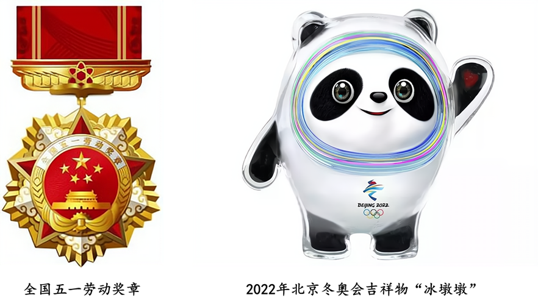

**山东省2021年普通高中学业水平等级考试政治**

**一、选择题：本题共15小题，每小题3分，共45分。每小题只有一个选项符合题目要求。**

1\. 下图反映的是某种商品供求变动对价格的影响（S表示供给，D表示需求），若不考虑其他因素，下列选项所描述的经济现象与下图所示相符的是（ ）

①该商品是冰雪运动装备，冰雪运动日益普及，冰雪装备产业快速发展，冰雪运动装备价格上升

②该商品是新能源汽车，国家大力推动新能源汽车产业发展，充电桩建设不断提速，新能源汽车价格总体下降

③该商品是国产大豆，国产大豆种植面积不断增长，进口大豆数量明显增加，国产大豆价格高位回落

④该商品是西瓜，炎热夏季西瓜大量上市，西瓜价格逐渐回落

A. ①② B. ①③ C. ②④ D. ③④

2\. 我国清洁能源资源与负荷中心呈逆向分布（水能、风能、太阳能等资源主要分布在西部、北部地区，能源需求主要集中在东中部）。特高压技术作为我国具有完全自主知识产权、领先世界的技术，解决了电力远距离、大容量、低损耗运输的世界难题。截至2020年底，我国成功投运30个特高压工程，跨省跨区输电能力达1.4亿千瓦、特高压技术的应用能够（ ）

①节约电力运输成本，提高清洁电力的劳动生产率 ②增加清洁电力附加值，促进用电企业节能减排

③实现电力合理调配，推动区域经济协调发展 ④提升清洁电力供应能力，促进能源利用转型升级

A. ①② B. ①③ C. ②④ D. ③④

3\. 在脱贫攻坚实践中，我国出台了许多惠及贫困地区、贫困人口政策措施，不仅直接帮扶了贫困群众，而且提高了市场机制的益贫性，2013-2020年贫困地区农村居民人均可支配收入年均增速比全国农村高2.3个百分点、分析表中各类帮扶政策，对实现市场机制益贫性路径描述正确的是（ ）

表国家贫困县建档立卡户享受的各类帮扶政策

|      |          |          |          |         |          |         |                                                          |
|:---- |:-------- |:-------- |:-------- |:------- |:-------- |:------- |:-------------------------------------------------------- |
| 帮扶政策 | 产业帮扶     | 就业帮扶     | 健康帮扶     | 教育帮扶    | 最低生活保障   | 残疾人帮扶   | 生态帮扶                                                     |
| 帮扶数量 | 1465.8万户 | 1390.6万户 | 1476.6万户 | 807.1万户 | 1109.0万人 | 338.3万户 | 11113万户 |

①初次分配注重增加就业机会，提高就业率 ②通过再分配引导市场配置资源，实现共建共享

③发挥第三次分配的作用，发展社会公益事业 ④加大政府财政补贴力度，提高社会保障水平

A. ①② B. ①④ C. ②③ D. ③④

4\. 公有制的主体地位决定了国家可以依法运用各类国有资产服务于经济社会发展，2021年1月以来，多地上市公司国有股权（2%-10%不等）被无偿划转至当地省属财政厅或其指定机构持有，在充实当地社保基金或化解地方债务中发挥重要作用，这一举措发挥作用的途径传导正确的是（ ）

①凭借优质股票获得收益→增加政府财政收入→提高社保基金的保障能力

②参与企业生产经营→实现资本保值增值→减少社保基金的支付压力

③改变股票所有权属性→提升资本运营效率→增强地方政府偿债能力

④依托国有资本良好信用→拓宽政府融资渠道→缓解地方政府债务压力

A. ①③ B. ①④ C. ②③ D. ②④

5\. 某区政府探索推行基层权力“三清单”运行法，在建制村具体推进时，根据建制村的特点，编制权力清单、责任清单、负面清单，绘制权力运行流程图，让基层用权有了“固定路线”，干部“看图做事”、群众“按图索骥”，“三清单”运行法的推行有利于（ ）

①保障村民知情权，调动村民民主监督的积极性

②细分村级组织权力，推动村级组织规范执法

③厘清权责边界，推进基层治理的制度化、规范化

④增强村干部重大事项决策的自主性，激发基层自治活力

A. ①② B. ①③ C. ②④ D. ③④

6\. 2021年1月，中共中央印发了修订后的《中国共产党统一战线工作条例》（以下简称《条例》），为做好新时代统一战线工作提供了基本遵循。《条例》强调，促进政党关系、民族关系、宗教关系、阶层关系、海内外同胞关系和谐，要积极构建大统战工作格局。《条例》修订体现了中国共产党（ ）

①通过完善党内法规加强对统一战线工作的领导 ②把构建大统战工作格局作为自身建设的基本保障

③进一步巩固统一战线的共同思想政治基础 ④通过创新协商形式发挥社会主义民主政治的独特优势

A. ①③ B. ①④ C. ②③ D. ②④

7\. 2021年3月1日，《中华人民共和国长江保护法》正式实施.该法所称的长江流域涉及青海、西藏等19个省、自治区、直辖市。

<table>
<colgroup>
<col style="width: 100%" />
</colgroup>
<tbody>
<tr>
<td style="text-align: left;">
第八十条国务院有关部门和长江流城地方各级人民政府及其有关部门对长江流城跨行政区城、生态敏感区域和生态环境违法案件高发区城以及重大违法案件，依法开展联合执法。

第八十二条国务院应当定期向全国人民代表大会常务委员会报告长江流城生态环境状况及保护和修复工作等情况。

——摘自《中华人民共和国长江保护法》
</td>
</tr>
</tbody>
</table>

依据材料，下列推断正确的是（ ）

①国务院可以监察青海省人民政府执行长江保护法情况

②西藏自治区的各级人民政府可以变通执行长江保护法

③全国人大常委会可以对长江保护法实施情况开展执法检查

④我国国家机关在长江流域生态保护方面应协调一致开展工作

A. ①② B. ①③ C. ②④ D. ③④

8\. 根据欧盟与英国达成的未来关系协议，英国脱欧后欧盟成员国仍然可以在英国海域捕捞，2021年4月、英国泽西岛政府出台新的捕鱼许可制度，限制法国渔船在其海域的捕捞权，引发两国争端，为此，英国首相与法国总统通话，双方均希望尽快解决这一争端，材料表明（ ）

A. 英国泽西岛政府有权制定地方法规，与中央分享立法权

B. 法国总统拥有外交权，有权通过外交磋商解决两国争端

C. 英国首相由选民选举产生，要对泽西岛选民负责

D. 作为国家元首，英国首相与法国总统都有义务维护本国利益

9\. 从作为国家最高荣誉载体的勋章奖章设计，到作为国家名片的国际盛会标志和吉祥物设计，新时代的中国设计正凭借其独特的创新创造活力，成为国家形象的生动表达。图2是2021年全国五一劳动奖章和2022年北京冬奥会吉祥物“冰墩墩”，奖章整体以“齿轮”“书籍”“旗帜”“五星、天安门”“样云”“麦穗”造型融合，“冰墩墩”的设计将熊猫形象与冰雪运动巧妙结合，材料启示我们，以设计诠释传播国家形象时应（ ）

①彰显鲜明的时代精神，蕴含丰富的育人价值 ②坚持国际创作导向，展现国际审美风范

③融合中华文化元素，承载深远文化内涵 ④立足于中华美学精神，塑造文化感召力

A. ①② B. ①③ C. ②④ D. ③④

10\. 据考古研究，从史前文明开始，中国文化发展的区域分布逐渐呈现一种分层次的向心结构，就像一个“重瓣花朵”：中原文化区是花心，其周围的甘青、山东、燕辽、长江中游和江浙文化区是第一层花瓣，再外围的文化区是第二层花瓣。花心辐射花瓣，花瓣保持自己的活力，花心花瓣不能分离。由此可见（ ）

①创新是中华文化永葆生命力的重要保证

②文化上的凝聚力是中华文明绵延至今的密码

③中华文化的统一性是地域文化多样性的基础

④和而不同是中华文化博大精深的原因之一

A. ①② B. ①③ C. ②④ D. ③④

11\. “外师造化，中得心源”是唐代画家张璞所提出的艺术创作理论，是中国绘画美学的纲领性命题，“造化”就是生生不息的万物一体的世界，亦即中国美学说的“自然”，“心源”是说“心”为照亮美的光之源，没有美的心灵，就不能照亮世界万物的本真之美，中国绘画美学纲领性命题中蕴含的哲学智慧是（ ）

A. 认识要以客观事物为对象

B. 物质和意识是相互依存、相互作用的

C. 认识是主体和客体相互作用的过程和结果

D. 意识是自然界自身发展中产生的“地球上最美的花朵”

12\. 授人以鱼不如授人以渔。山东省实施“村村都有好青年”选培计划，通过技能培训帮助返乡在乡青年创新创业，为乡村振兴注入青春力量，截至2020年底，山东省已选培乡村“好青年”12.8万名，带动一大批青年活跃在乡村振兴第一线。对此理解正确的有（ ）

①大量乡村“好青年”的涌现是内因和外因共同作用的结果

②社会提供的客观条件是返乡在乡青年实现人生价值的前提

③开展技能培训推动了乡村振兴过程中生产关系的调整和变革

④选培出的乡村“好青年”作为关键部分统率乡村振兴的整体发展

A. ①② B. ①③ C. ②④ D. ③④

13\. 在唐代诗人柳宗元看来，牛是“日耕百亩”的勤劳符号；在宋代名将李纲眼中，牛代表的是“但得众生皆得饱，不辞赢病卧残阳”的牺牲精神；在现代诗人臧克家笔下，牛具有的是“深耕细作走东西”的开拓品格，体悟牛的品格、弘扬牛的精神、激发牛的干劲，是中国人民精气神的具体体现，材料体现了（ ）

A. 人为事物的联系具有“人化”的特点 B. 事物的性质取决于人们观察的角度

C. 矛盾的特殊性通过普遍性表现出来 D. 人们的意识活动受主体状态的影响

14\. 历经9个多月的长途跋涉，经历了惊心动魄的关键9分钟，中国火星探测器“天同一号”成功着陆火星表面，其携带的“祝融号”火星车将在火星上开展地表成分、物质类型分布、地质结构以及火星气象环境等探测工作，火星探测不仅仅是太空技术的突破，也是行星科学领域的突破，更是人类活动空间的拓展和延伸。材料表明（ ）

①思维和存在的关系问题是认识活动和实践活动的基本问题

②宇宙探索活动将不断地刷新世界的本质及其发展规律

③认识每前进一步都是对无限发展着的物质世界的接近

④认识是主观与客观的具体的历史的统一

A. ①② B. ①③ C. ②④ D. ③④

15\. 1956年2月，中共一大代表董必武为上海中共一大会址纪念馆题词：“作始也简，将毕也巨。”中国共产党在一大召开时只有50多名党员，在带领中国人民实现了中华民族从站起来到富起来、迎来中华民族从高起来到强起来的辉煌历程中，发展成为拥有9500多万名党员的世界上最大的马克思主义执政党，中国共产党由“简”到“巨”的事实证明了（ ）

①符合历史前进方向事物充满旺盛的生命力 ②凡是拥有强大力量的事物前途必定是光明的

③代表人民群众根本利益的事物是不可战胜的 ④量变向质变的转化需要发挥人的主观能动性

A ①③ B. ①④ C. ②③ D. ②④

**二、非选择题：本题共5题，共55分。**

16\. 柳州螺蛳粉、天津煎饼馃子、沙县小吃……这些地方特色小吃深受各地消费者的喜爱。地方特色小吃吸引人的地方，不仅体现在与其他食品不同，也体现在同种小吃的口味差异上，对于很多食客来说，地方特色小吃吃的就是那独一份的“舌尖上的味道”。如天津煎饼馃子，面浆到底是用黑豆面还是绿豆面，中间夹的是馃子还是油条，制作者会根据各自情况而定，消费者也会根据自己的喜好进行选择。

近年来，很多地方推出了地方特色小吃标准，如广西柳州市螺蛳粉协会、柳州市质量检验研究中心等团体共同制定了柳州螺蛳粉地方标准，从竹笋、豆角、螺蛳、腐竹等原材料的质量，到熬制工艺、发酵工艺，再到汤料包、配料包，都作出了明确的标准规定。目前，柳州螺蛳粉日产量最高达到325万袋，产品运销海外20多个国家和地区。

有人认为同种地方特色小吃应坚持标准化发展，也有人担心标准化会让地方特色小吃失去自己的特色，请结合经济生活知识对此进行评述。

17\. 2020年7月，习近平总书记在企业家座谈会上指出，要了解企业家所思所想、所困所惑，涉企政策制定要多听企业家意见和建议，支持企业家以恒心办恒业，扎根中国市场。

早在2019年9月，国家发展和改革委员会印发了《关于建立健全企业家参与涉企政策制定机制的实施意见》。随后，各地政府结合自身实际相继出台实施办法，推出了不少实招硬招。例如，北京市出台具体实施办法（下表）；山东省要求对企业家提出的合理可行的意见建议、当前不适合或难以采纳的意见建议都要以适当方式予以及时回应。

<table>
<colgroup>
<col style="width: 100%" />
</colgroup>
<tbody>
<tr>
<td style="text-align: left;">
北京市企业家参与涉企政策制定机制的实施办法（暂行）（摘录）

第二条 本办法所指涉企政策包括但不限于本市制定出台的经济和社会发展中长期规划和年度计划……也包括行业性的发展规划……特别是市场准入、环境保护、安全生产、招标投标、政府采购等对企业切身利益或权利义务有重大影响或对企业生产经营存在重大影响的专项政策等。

第六条……既要在政策起草阶段邀请企业家参与，也可依据企业家的合理意见设置政策议题或调整政策，围绕涉企致策“全生命周期”。畅通企业家参与的渠道。

第九条……重要的行业性政策要征求行业协会商会的意见，邀请的企业家中民营企业家代表应不低于70%，中小企业的企业家代表应不低于50%，要重视行业领军企业负责人、企业党组织负责人和新生代企业家的意见建议。
</td>
</tr>
</tbody>
</table>

结合材料，运用政治生活知识，阐述建立健全企业家参与涉企政策制定机制对优化营商环境的作用。

18\. “哐当哐当……呜……”绿皮火年缓缓停下，车门被打开，有人扛着一蛇皮袋土豆，有人背着一箩筐花椒，一个个登上火车，车厢里，还有不少特殊的“乘客”——活鸡、活猪等，在“八纵八横”不断加密成型、时速越来越快的高铁时代，我国仍然运行着81对“慢火车”。“慢火车”通常指铁路部门在出行不便的革命老区、少数民族地区、边远山区、贫困地区，开行的平均时速只有四五十千米、每站必停、票价低廉的公益性旅客列车。在大凉山，它是与外界联系的纽带；在秦岭山区，它是上学的“校车”；在东北百里无人的林区，它是最方便的交通工具……它还是沿线地区群众的“致富车”。

在“快”的步伐中，也需要“慢”的脚步。“慢火车”正满载着人民对美好生活的向往穿行于崇山峻岭中。

结合材料，运用矛盾的特殊性原理，说明为什么“快”步伐中也需要“慢”脚步。

19\.

今日之中国，正如您所愿

◆心有所信，方能行远

在“江山破碎，国弊民穷”的年代，狱中饱受折磨的方志敏，于人生最后时刻以生命写就了“可爱的中国”。他相信，“蛮可爱蛮可爱”的中国。一定会有一个“可赞美的光明前途”。“到那时，到处都是活跃跃的创造，到处都是日新月异的进步，欢歌将代替了悲叹。笑脸将代替了哭脸。富裕将代替了贫穷，康健将代替了疾苦，智慧将代替了愚昧……这时，我们民族就可以无愧色地立在人类的面前。而生育我们的母亲。也会最美丽地装饰起来，与世界上各位母亲平等地携手了。”这是方志敏一边和死亡打着照面一面勾勒出来的朗日晴空，也是革命战争年代无数中国共产党人为之奋斗的信仰。2012年11月29日。习近平总书记参观《复兴之路》展览时深情指出，实现中华民族伟大复兴，就是中华民族近代以来最伟大的梦想，这个梦想，凝聚了几代中国人的夙愿，体现了中华民族和中国人民的整体利益，是每一个中华儿女的共同期盼。

（1）感悟“可爱的中国”，从文化生活角度，阐述你对“心有所信，方能行远”的理解。

◆奋斗百年路，启航新征程

从1921年到2021年的百年，是中国共产党追逐梦想，砥砺前行，在苦难中铸就辉煌的百年，百年征程波澜壮阔，无不昭示着，每个时代最深的刻痕，总是奋斗者笃行的足迹。从上海石库门出发，走过赣水闽山蜿蜒小道，跨过万里长征的雪山草地，迈过沟壑纵横的黄土高坡，渡过浩浩荡荡的长江天堑，中国共产党团结带领人民，在付出巨大牺牲后，终于赢得了民族独立和人民解放。从一穷二白，到世界第二大经济体；从忍饥挨饿、缺吃少穿，到中华民族千百年来的绝对贫困问题历史性地画上了句号，全面建成小康社会取得伟大历史性成就……新中国成立70多年来，改革开放40多年来，中国共产党团结带领人民栉风沐雨。在攻坚克难中创造出了震撼世界的中国奇迹，今日之中国正以自信自立自强的傲然姿态屹立于世界东方，方志敏的憧憬和遗愿正在祖国大地上生动呈现，中华民族伟大复兴的光明前景前所未有地展现在眼前。2021年，是全面建设社会主义现代化国家新征程的开启之年，民族复兴事业将揭开新篇章……

（2）“每个时代最深的刻痕，总是奋斗者笃行的足迹，”结合材料，运用实践及其特点的知识加以阐明。

20\. 当今世界正经历百年来有之大变局，给中国发展带来重要机遇和挑战。下面是某应同学在研究性学习活动中搜集的部分热点事件。

<table>
<colgroup>
<col style="width: 100%" />
</colgroup>
<tbody>
<tr>
<td style="text-align: left;">
2020年7月 中国自主研制建设的北斗三号全球卫星导航系统建成并开通

美国政府宣布退出世界卫生组织

2020年8月 美国政府宣布继续维持对100多种欧盟产品加征25%的关税

2020年11月 第三届中国国际进口博览会在上海举行上海合作组织成员国元首理事会会议呼吁尽快通过（联合国全面反恐公约）

中日韩澳新及东盟10国成功签署区域全面经济伙伴关系协定（RCEP）

2020年12月 中国等70多个国家的领导人以视频方式参加气候雄心峰会
</td>
</tr>
</tbody>
</table>

结合材料，综合运用所学知识，围绕“中国以不变的开放姿态应对变局中的世界”主题撰写一首短评。

要求：①围绕主题，观点明确；②论证充分，逻辑清晰；③学科术语使用规范；④总字数在250字左右。
