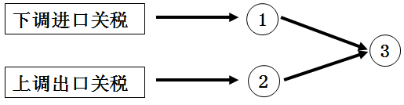

**机密★启用前**

**试卷类型：B**

**2021年广东省普通高中学业水平选择性考试**

**思想政治**

**本试卷共6页，20小题，满分100分。考试用时75分钟。**

**注意事项：1．答卷前，考生务必用黑色字迹的钢笔或签字笔将自己的姓名、考生号、考场号和座位号填写在答题卡上。用2B铅笔将试卷类型（B）填涂在答题卡相应位置上。将条形码横贴在答题卡右上角“条形码粘贴处”。**

**2．作答选择题时，选出每小题答案后，用2B铅笔把答题卡上对应题目选项的答案信息点涂黑；如需改动，用橡皮擦干净后，再选涂其他答案，答案不能答在试卷上。**

**3．非选择题必须用黑色字迹钢笔或签字笔作答，答案必须写在答题卡各题目指定区域内相应位置上；如需改动，先划掉原来的答案，然后再写上新的答案；不准使用铅笔和涂改液。不按以上要求作答的答案无效。**

**4．考生必须保持答题卡的整洁。考试结束后，将试卷和答题卡一并交回。**

**一、选择题：本大题共16小题，每小题3分，共48分，在每小题给出的四个选项中，只有一项是符合题目要求的。**

1\. 2021年2月，广东某市多家企业在市发改委等九部门的指导下，成立了“灵活就业与新业态就业服务联盟”，依托互联网灵活就业平台，为市内各企业、人力资源服务机构和灵活就业人员提供岗位对接、政策指导和法律援助等服务。这一联盟的成立可以（ ）

①在拓宽就业渠道方面起到积极作用

②使企业的用工数量和用工结构发生改变

③给有关部门做好管理服务工作提供参考数据

④为增强相关从业人员社会认同度给予保证

A. ①③ B. ①④ C. ②③ D. ②④

2\. 自2021年5月1日起，我国对生铁、粗钢等产品实行零进口暂定税率：适当提高硅铁、铬铁等产品的出口关税。不考虑其他因素，关税调整将对国内钢铁价格产生的影响是（ ）

A. ①进口增加②出口减少③国内钢铁价格上涨

B. ①进口减少②出口增加③国内钢铁价格上涨

C ①进口减少②出口增加③国内钢铁价格下降

D. ①进口增加②出口减少③国内钢铁价格下降

3\. 供给规律存在一些特例，其中一种情况是，无论商品的价格怎么变化，生产者提供既定数量的商品。下列与下图的特殊供给曲线相符合的是（ ）

A. 数年内，某汽车厂生产的新能源汽车数量

B. 既定时间内，某市电视塔观景台可接待顾客数量

C. 既定时间内，某奶茶店供应的饮料数量

D. 数年内，某手机厂生产的智能手机数量

4\. 2021年3月，几大国产家电企业不仅没在春节后进行淡季降价促销，反而不约而同决定上调其系列产品的价格。下列对这一反常现象的解释合理的是（ ）

①新冠肺炎疫情尚未得到有效控制，市场需求低迷

②原材料价格快速上涨，给生产企业带来成本压力

③消费结构升级，倒逼产品不定期更新换代和性能升级

④人民币升值使产品出口增加，导致国内市场供给不足

A. ①② B. ①④ C. ②③ D. ③④

5\. 2021年，国务院在政府工作报告中提出了大型商业银行普惠小微企业贷款增长30%以上、中小企业宽带和专线平均资费再降10%、纵深推进“放管服”改革等工作任务。以上政策意在（ ）

①调整和优化资金流向，集中信贷优先支持小微企业

②通过进一步优化营商环境，激发市场微观主体活力

③降低中小企业信息化投入成本，加快推动其数字化转型

④加大财政政策和货币政策的扩张力度，保证经济高速运行

A. ①② B. ①④ C. ②③ D. ③④

6\. 某市为搭建政府与群众的沟通桥梁，提升政府治理能力，开办了一档电视问政节目。节目将群众高度关注的问题在演播室中摆出来，做到“哪壶不开提哪壶”；被问政部门负责人需要现场答复整改措施和期限，做到“提了哪壶开哪壶”。该节目对施政者的启示是要（ ）

①增强问题意识 ②扩大政府权力 ③转变工作作风 ④创新机构职能

A. ①② B. ①③ C. ②④ D. ③④

7\. 为贯彻实施民法典，2020年6月至12月，最高人民法院完成了对591件司法解释及相关规范性文件、139个指导性案例的清理工作，废止116件，修改111件，决定对2个指导性案例不再参照适用，制定了与民法典配套的第一批共7件新的司法解释。最高人民法院的工作（ ）

①有利于全面推进依法治国 ②确保了我国公民权利的最终实现

③主导了我国法制建设的进程 ④保障了民法典施行后法律适用标准的统一

A. ①② B. ①④ C. ②③ D. ③④

8\. 习近平总书记在第三次中央新疆工作座谈会上强调，要“坚持把社会稳定和长治久安作为新疆工作的总目标”，坚持“依法治疆、团结稳疆、文化润疆、富民兴疆、长期建疆”。其中，“文化润疆”要求是第一次提出，其着力点是坚持（ ）

①巩固民族自治机关自治权 ②紧贴民生推动高质量发展

③铸牢中华民族共同体意识 ④我国宗教中国化方向

A. ①② B. ①③ C. ②④ D. ③④

9\. 2020年是联合国成立75周年。当今世界正处在百年未有之大变局和新冠肺炎疫情全球大流行相叠加的特殊时期，国际社会更需要联合国发挥积极作用。这是因为（ ）

①各国利益休戚相关、命运紧密相连

②任何一个全球性问题都不是单一主权国家能独立解决的

③非传统安全问题已成为世界和平与发展的主要威胁

④个别大国退出了联合国系统的部分国际组织和国际条约

A. ①② B. ①④ C. ②③ D. ③④

10\. 广州早茶文化历史悠久，至今保留着“一盅两件”“扣指谢茶”等饮茶习俗。早些年，老茶楼里服务员的吆喝声此起彼伏。现在，顾客只要扫描二维码就可轻松完成下单和结账；有的茶楼也推出了新式茶点，并引进了各式各样的西式糕点，吸引了更多顾客前来品尝。由此可见（ ）

①科技的进步推动了文化消费方式的变化

②善于推陈出新，文化才能充满生机与活力

③融汇各种文化特质是文化创新根本途径

④文化决定着人们的交往方式

A. ①② B. ①③ C. ②④ D. ③④

11\. 山水画和“以诗入画”的创作传统源远流长。除了青绿山水以外，传统山水画对色彩的运用大多比较含蓄，注重水墨技法。新中国成立后，一些山水画家面对新的社会生活，在深入领悟毛泽东诗词的基础上，出于意境表达需要而创造性地运用了以红色为主色调的色彩及技法，成功创作了一批表现毛泽东诗意的“红色山水”画，为新中国艺术增添了鲜红亮色。由此下列判断正确的是（ ）

①传统山水画在传承中获得了新内涵，基本特征也根本上被改变

②“红色山水”画的成功创作，得益于毛泽东诗词意境的启发

③“红色山水”画被赋予了独特的美学品格，呈现出新的时代精神气象

④传统山水画的发展源于时代的需要，取决于色彩及技法上的创新

A. ①② B. ①④ C. ②③ D. ③④

12\. 恩格斯在《自然辩证法》中讲到，19世纪欧洲一些神灵研究者声称自己具有让人返老还童、改形换貌、招魂降神以及点石成金等超意识能力。对这些“超意识能力”评价正确的是（ ）

①夸大了意识的能动性 ②肯定了人类具有穿越到神灵世界的能力

③无视了物质的决定性 ④说明人类意识具有不受限制的创造能力

A. ①② B. ①③ C. ②④ D. ③④

13\. 不少有重大贡献的自然科学家既是科学伟人，又是科学哲人。牛顿从经验主义出发建立起古典力学，爱因斯坦从唯物论出发建立了广义相对论，海森堡受柏拉图哲学的启发，决心寻找反映自然秩序的数学核心，建立了矩阵力学。能解释上述科学史实的是（ ）

①哲学是世界观和方法论的统一 ②哲学的争论引领具体科学的进步

③哲学是一种能生产知识的知识 ④重大科学研究前沿需要哲学智慧的启迪

A. ①② B. ①④ C. ②③ D. ③④

14\. 人民音乐家冼星海曾说过：“每个人在他生活中都经历过不幸和痛苦。有些人在苦难中只想到自己，他就悲观、消极，发出绝望哀号；有些人在苦难中还想到别人，想到集体，想到祖先和子孙，想到祖国和全人类，他就得到乐观和自信。”其中蕴含的唯物史观道理是（ ）

①价值观源自于对个人生活遭遇和处境的反思

②价值观对社会与人生有重要的驱动和制约作用

③价值观作为一种社会意识，具有相对独立性

④基于个人利益形成的价值选择是社会发展的动力

A. ①② B. ①④ C. ②③ D. ③④

15\. 冰壶被人们喻为“冰上国际象棋”，是2022年北京冬奥会的比赛项目。作为一种以队为单位、在冰上进行的投掷性竞赛项目，它要求队员融为一体，机智应对，不仅考验参与者的体能，展现动静之韵，更考验参与者的智慧，展现取舍之道。由冰壶运动之美可折射出的哲学之思是（ ）

①只有尊重规律才能认识和利用规律

②部分的功能及其变化影响整体的功能

③人的自主选择是实践取得成功的基础

④实践水平的提高取决于认识水平的提高

A. ①② B. ①④ C. ②③ D. ③④

16\. 下图漫画《我该怎么走？！》（作者：陈景凯）给我们的哲学启迪是（ ）

①事物的复杂性决定了真理具有不确定性

②人们在否定以往认识的过程中接近真理

③要善于把握事物联系的多样性和条件性

④个别、具体的认识都是有条件的、相对的

A. ①② B. ①④ C. ②③ D. ③④

**二、非选择题：本大题共4小题，共52分。每个试题考生都必须作答。**

17\. 阅读材料，完成下列要求。

2020年9月，习近平主席在联合国大会上庄严承诺，中国二氧化碳排放力争于2030年前达到峰值，努力争取2060年前实现碳中和。

材料一 碳排放权交易已成为包括中国在内很多国家的气候政策。早在2011年，我国即已在广东等7省市启动了碳排放权交易试点工作。试点省市的主要做法是：①主管部门将符合标准的企业确认为控制排放企业；②每年根据企业的实际情况，分配免费碳排放配额给企业；③企业在生产过程中，如果二氧化碳的实际排放数量超过免费配额，可以从碳排放权交易市场上购买超出配额的部分，反之，则可以出售盈余的配额。配额交易价格由市场决定，价格的波动影响着企业的成本和收入，从而影响企业的经营决策。

材料二 为了在促进绿色低碳发展中充分发挥市场机制作用，规范全国碳排放权交易，早日实现美丽中国愿景，生态环境部于2020年12月发布了《碳排放权交易管理办法（试行）》，从排放单位确定、配额分配与登记、排放交易、监督管理及处罚等方面，对碳排放权交易作出规定。

（1）假定企业持续经营，结合材料一，运用经济生活知识，从短期和中长期两个角度分析碳排放权交易对控制排放企业的经营产生的影响。

（2）结合材料二，运用经济生活知识，从市场与政府关系角度概述生态环境部出台管理办法的原因。

18\. 阅读材料，完成下列要求。

在全党开展集中性学习教育，是我们党推进自我革命的重要途经，也是加强党的建设的一条重要经验。

十八大以来，党中央先后组织开展的五次集中性学习教育

|                  |                 |               |                               |
|:---------------- |:--------------- |:------------- |:----------------------------- |
| 时间               | 主题              | 对象            | 主要内容                          |
| 2013年6月至2014年9月  | 党的群众路线教育实践活动    | 全体党员          | 为民务实清廉                        |
| 2015年4月至2015年12月 | “三严三实”专题教育      | 县处级以上领导干部     | 严以修身、严以用权、严以律己，谋事要实、创业要实、做人要实 |
| 2016年1月至2017年4月  | “两学一做”学习教育      | 全体党员          | 学党章党规、学系列讲话，做合格党员             |
| 2019年6月至2020年1月  | “不忘初心、牢记使命”主题教育 | 以县处级以上领导干部为重点 | 为中国人民谋幸福，为中华民族谋复兴             |
| 2021年2月至今        | 党史学习教育          | 全体党员          | 学习党史、新中国史、改革开放史、社会主义发展史       |

结合材料，运用政党知识，说明十八大以来党中央组织开展五次集中性学习教育的意义。

19\. 阅读材料，完成下列要求。

习近平总书记指出，革命烈士的家书是进行理想信念教育最生动、最有说服力的教材。

1928年9月，共产党人史砚芬英勇牺牲前，拖着伤痕累累的身体，就着狱中昏黄的灯光写下了留给亲人的最后一封信：“亲爱的弟弟妹妹，我今与你们永诀了。我的死，是为着社会、国家和人类，是光荣的，是必要的。我死后，有我千万同志，他们能踏着我的血迹奋斗前进，我们的革命事业必底于成，故我虽死犹存……请你们不要因丧兄而悲吧！妹妹，你年长些，从此以后你是家长了，身兼父母兄长的重大责任。我本不应当把这重大的担子放在你身上，抛弃你们，但为着了‘大我’不能不对你们忍心些，我相信你们在痛哭之余，必能谅察我的苦衷而原谅我。”

片纸只字重千钧，红色家书意万重。在中国共产党成立100周年之际，我们重温革命烈士的家书，更加能感受到那种跨越时空、直抵心灵的动人力量。

结合材料，运用文化生活知识，谈谈革命烈士的家书为什么具有“跨越时空、直抵心灵的动人力量”。

20\. 阅读材料，完成下列要求。

“信息茧房”一般指的是现代社会中的人们在信息领域会习惯性地被自己的兴趣所引导，从而将自己的生活桎梏于像蚕茧一般的“茧房”中的现象。

横亘在人与世界之间的这个矛盾，究竟是谁造成的？人们看法不一。

有人认为，推荐算法应该成为“背锅”者。推荐算法最大的卖点，就是在获取用户数据样本后，能够根据用户的习惯与偏好，在短时间内解析数据并实现精准推送，为其提供“量身定做”的个性化信息流。然而，事物总有两面性，这种“量身定做”会让用户看到的内容越来越极端而单一，与用户的既有认知相异的信息可能会直接遭到算法的屏蔽，导致个人的视野不断窄化、判断能力逐渐弱化等弊端。

也有人认为，真正的“背锅”者应该是人自己。“信息茧房”在最初被提出的时候，推荐算法尚未出现，其意只在于提醒公众：不要只注意自己选择的东西和使自己愉悦的信息。因为久而久之，这种看似“舒适”的选择，会让人在单一信息源的喂养下成为“信息偏食者”。在这种情况下，只看到算法的影响，而忽略个体的主观能动性，既是对问题本质的误读，也是对个体责任的逃避。

（1）请你选取其中一种看法，运用矛盾的相关知识分析其合理性。

（2）以你选取的看法为出发点，就如何打破“信息茧房”提一条具体建议并给出其哲学依据。
