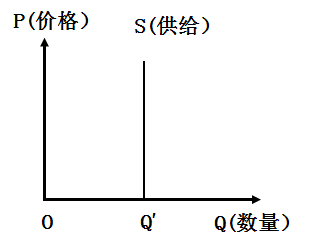
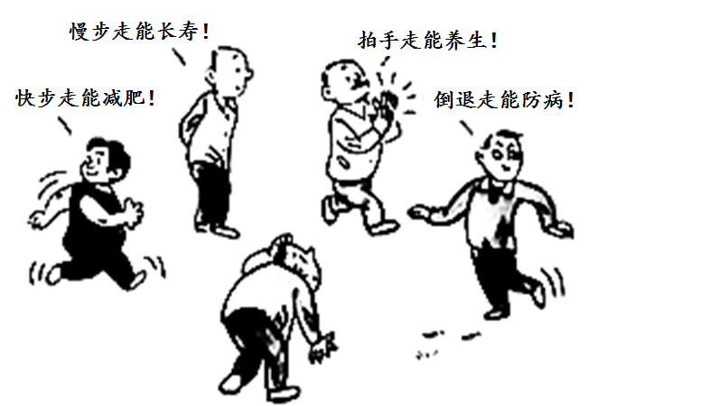

**机密★启用前**

**试卷类型：B**

**2021年广东省普通高中学业水平选择性考试**

**思想政治**

**本试卷共6页，20小题，满分100分。考试用时75分钟。**

**注意事项：1．答卷前，考生务必用黑色字迹的钢笔或签字笔将自己的姓名、考生号、考场号和座位号填写在答题卡上。用2B铅笔将试卷类型（B）填涂在答题卡相应位置上。将条形码横贴在答题卡右上角“条形码粘贴处”。**

**2．作答选择题时，选出每小题答案后，用2B铅笔把答题卡上对应题目选项的答案信息点涂黑；如需改动，用橡皮擦干净后，再选涂其他答案，答案不能答在试卷上。**

**3．非选择题必须用黑色字迹钢笔或签字笔作答，答案必须写在答题卡各题目指定区域内相应位置上；如需改动，先划掉原来的答案，然后再写上新的答案；不准使用铅笔和涂改液。不按以上要求作答的答案无效。**

**4．考生必须保持答题卡的整洁。考试结束后，将试卷和答题卡一并交回。**

**一、选择题：本大题共16小题，每小题3分，共48分，在每小题给出的四个选项中，只有一项是符合题目要求的。**

1\. 2021年2月，广东某市多家企业在市发改委等九部门的指导下，成立了“灵活就业与新业态就业服务联盟”，依托互联网灵活就业平台，为市内各企业、人力资源服务机构和灵活就业人员提供岗位对接、政策指导和法律援助等服务。这一联盟的成立可以（ ）

①在拓宽就业渠道方面起到积极作用

②使企业的用工数量和用工结构发生改变

③给有关部门做好管理服务工作提供参考数据

④为增强相关从业人员的社会认同度给予保证

A. ①③ B. ①④ C. ②③ D. ②④

【答案】A

【解析】

【详解】①③：为市内各企业、人力资源服务机构和灵活就业人员提供岗位对接、政策指导和法律援助等服务，这说明联盟可为政府提供行业数据，为制定与出台相关行业标准和政策提供数据参考，在拓宽就业渠道方面起到积极作用，①③符合题意。

②：“灵活就业与新业态就业服务联盟”的成立重在服务，不一定使企业的用工数量发生改变，也不会改变企业用工结构发生改变，②排除。

④：“灵活就业与新业态就业服务联盟” 的成立有利于增强相关从业人员的社会认同度，但不能为增强相关从业人员的社会认同度给予保证，④排除。

故本题选A。

2\. 自2021年5月1日起，我国对生铁、粗钢等产品实行零进口暂定税率：适当提高硅铁、铬铁等产品的出口关税。不考虑其他因素，关税调整将对国内钢铁价格产生的影响是（ ）

A. ①进口增加②出口减少③国内钢铁价格上涨

B. ①进口减少②出口增加③国内钢铁价格上涨

C. ①进口减少②出口增加③国内钢铁价格下降

D. ①进口增加②出口减少③国内钢铁价格下降

【答案】D

【解析】

【详解】AD：对生铁、粗钢等产品实行零进口暂定税率，有利于降低进口成本，扩大钢铁资源进口，钢铁市场供给增多。适当提高硅铁、铬铁等产品的出口关税，会减少出口量。两项叠加，国内市场钢铁市场供给增多，国内钢铁价格下降，而不是上涨。A错误，D正确。

B：题中关税调整，会导致进口增加，出口减少，国内钢铁价格下降，B错误。

C：题中关税调整，会导致进口增加，出口减少，C错误。

故本题选D。

3\. 供给规律存在一些特例，其中一种情况是，无论商品的价格怎么变化，生产者提供既定数量的商品。下列与下图的特殊供给曲线相符合的是（ ）

A. 数年内，某汽车厂生产的新能源汽车数量

B. 既定时间内，某市电视塔观景台可接待顾客数量

C. 既定时间内，某奶茶店供应的饮料数量

D. 数年内，某手机厂生产的智能手机数量

【答案】B

【解析】

【详解】根据图示变化，无论价格如何变化，该商品的供给量都未发生改变。

A：厂家为获得更多的利润，新能源汽车的供给量会随着价格的上涨而增加，故A不选。

B：某市电视塔观景台可接待顾客的数量是一定的，不会因为价格的上涨而增加供给量，故B正确。

C：奶茶店为了盈利，某奶茶店供应的饮料数量会随着价格的上涨而增加供给，故C不选。

D：手机厂供应手机的数量随手机价格上涨而增加供给，故D不选。

故本题选B。

4\. 2021年3月，几大国产家电企业不仅没在春节后进行淡季降价促销，反而不约而同决定上调其系列产品的价格。下列对这一反常现象的解释合理的是（ ）

①新冠肺炎疫情尚未得到有效控制，市场需求低迷

②原材料价格快速上涨，给生产企业带来成本压力

③消费结构升级，倒逼产品不定期更新换代和性能升级

④人民币升值使产品出口增加，导致国内市场供给不足

A. ①② B. ①④ C. ②③ D. ③④

【答案】C

【解析】

详解】①：供求影响价格。因此，市场需求低迷，会导致商品供过于求，价格下跌，①无法解释题干中反常现象，①不选。

②：企业所需原材价格上涨，会导致其生产成本增加，进而导致企业上调商品价格，②正确。

③：消费反作用于生产。由于消费结构升级，会导致企业的产品和性能不断更新换代而上调其产品的价格，③正确。

④：人民币升值，有利于进口，而不是产品出口增加，④错误。

故本题选C。

5\. 2021年，国务院在政府工作报告中提出了大型商业银行普惠小微企业贷款增长30%以上、中小企业宽带和专线平均资费再降10%、纵深推进“放管服”改革等工作任务。以上政策意在（ ）

①调整和优化资金流向，集中信贷优先支持小微企业

②通过进一步优化营商环境，激发市场微观主体活力

③降低中小企业信息化投入成本，加快推动其数字化转型

④加大财政政策和货币政策的扩张力度，保证经济高速运行

A. ①② B. ①④ C. ②③ D. ③④

【答案】C

【解析】

【详解】①：依题意知，材料中的政策能够达到调整和优化资金流向。但并意味着优先支持小微企业，①不选。

②：企业是经济活动的主要参加者，是市场的微观主体。材料中的政策有利于进一步优化企业的营商环境，激发市场主体的活力，②正确。

③：实施“中小企业宽带和专线平均资费再降10%”，有利于降低中小企业信息化投入成本，推动企业数字化转型，③正确。

④：新时代，我国经济发展已经由高速增长阶段转向高质量发展阶段。材料中的政策有利于加大财政政策和货币政策的扩张力度，推动经济高质量发展，而不是保证经济高速运行，④错误。

故本题选C。

6\. 某市为搭建政府与群众的沟通桥梁，提升政府治理能力，开办了一档电视问政节目。节目将群众高度关注的问题在演播室中摆出来，做到“哪壶不开提哪壶”；被问政部门负责人需要现场答复整改措施和期限，做到“提了哪壶开哪壶”。该节目对施政者的启示是要（ ）

①增强问题意识 ②扩大政府权力 ③转变工作作风 ④创新机构职能

A. ①② B. ①③ C. ②④ D. ③④

【答案】B

【解析】

【详解】①③：在演播室把人们关注的问题提出来，被问政部门负责人需要现场答复整改措施和期限，这对执政者的启示是要不断的增强问题意识，不断提高服务能力和服务的水平，故①③正确。

②：政府的权利是法定的，不能扩大或缩小，故②不选。

④：材料强调政府要为人民服务，未体现创新机构职能，故④不选。

故本题选B。

7\. 为贯彻实施民法典，2020年6月至12月，最高人民法院完成了对591件司法解释及相关规范性文件、139个指导性案例的清理工作，废止116件，修改111件，决定对2个指导性案例不再参照适用，制定了与民法典配套的第一批共7件新的司法解释。最高人民法院的工作（ ）

①有利于全面推进依法治国 ②确保了我国公民权利的最终实现

③主导了我国法制建设的进程 ④保障了民法典施行后法律适用标准的统一

A. ①② B. ①④ C. ②③ D. ③④

【答案】B

【解析】

【详解】①④：最高人民法院对与民法典相关的司法解释及指导性案例进行清理，有利于法律适用标准的统一，全面推进依法治国，①④符合题意。

②：确保了公民权利的最终实现的说法过于绝对，②错误。

③：最高人民法院的做法推动了法治建设的进程，但主导的说法不妥，③错误。

故本题选B。

8\. 习近平总书记在第三次中央新疆工作座谈会上强调，要“坚持把社会稳定和长治久安作为新疆工作的总目标”，坚持“依法治疆、团结稳疆、文化润疆、富民兴疆、长期建疆”。其中，“文化润疆”要求是第一次提出，其着力点是坚持（ ）

①巩固民族自治机关自治权 ②紧贴民生推动高质量发展

③铸牢中华民族共同体意识 ④我国宗教中国化方向

A. ①② B. ①③ C. ②④ D. ③④

【答案】D

【解析】

【详解】①②：新疆地区的民生发展及自治机关自治权问题分别从经济、政治角度着力建设新疆，与文化润疆的主旨不一致，①②不符合题意。

③④：坚持我国宗教中国化方向、铸牢中华民族共同体意识都从文化角度发力新疆建设，③④符合题意。

故本题选D。

9\. 2020年是联合国成立75周年。当今世界正处在百年未有之大变局和新冠肺炎疫情全球大流行相叠加的特殊时期，国际社会更需要联合国发挥积极作用。这是因为（ ）

①各国利益休戚相关、命运紧密相连

②任何一个全球性问题都不是单一主权国家能独立解决的

③非传统安全问题已成为世界和平与发展的主要威胁

④个别大国退出了联合国系统的部分国际组织和国际条约

A. ①② B. ①④ C. ②③ D. ③④

【答案】A

【解析】

【详解】①②：当今世界国家间联系日益密切，新冠脑炎疫情等全球性问题要求联合国发挥积极作用，①②符合题意。

③：霸权主义和强权政治是世界和平与发展的主要障碍，③错误。

④：个别大国的单边行动不是更需要联合国发挥作用的原因，④不符合题意。

故本题选A。

10\. 广州早茶文化历史悠久，至今保留着“一盅两件”“扣指谢茶”等饮茶习俗。早些年，老茶楼里服务员的吆喝声此起彼伏。现在，顾客只要扫描二维码就可轻松完成下单和结账；有的茶楼也推出了新式茶点，并引进了各式各样的西式糕点，吸引了更多顾客前来品尝。由此可见（ ）

①科技的进步推动了文化消费方式的变化

②善于推陈出新，文化才能充满生机与活力

③融汇各种文化特质是文化创新的根本途径

④文化决定着人们的交往方式

A. ①② B. ①③ C. ②④ D. ③④

【答案】A

【解析】

【详解】①②：现在顾客只要扫描准码就可轻松完成下单和结席。有的茶楼也推出了新式茶点，并引进了各式各样的西式糕点，吸引了更多顾客前来品尝，体现了科技的进步推动了文化消费方式的变化，创新使文化才能充满生机与活力，故①②正确。

③：立足于社会实践是文化创新的根本途径，故③不选。

④：文化影响着人们的交往行为，但不起决定作用，故④不选。

故本题选A。

11\. 山水画和“以诗入画”的创作传统源远流长。除了青绿山水以外，传统山水画对色彩的运用大多比较含蓄，注重水墨技法。新中国成立后，一些山水画家面对新的社会生活，在深入领悟毛泽东诗词的基础上，出于意境表达需要而创造性地运用了以红色为主色调的色彩及技法，成功创作了一批表现毛泽东诗意的“红色山水”画，为新中国艺术增添了鲜红亮色。由此下列判断正确的是（ ）

①传统山水画在传承中获得了新内涵，基本特征也根本上被改变

②“红色山水”画的成功创作，得益于毛泽东诗词意境的启发

③“红色山水”画被赋予了独特的美学品格，呈现出新的时代精神气象

④传统山水画的发展源于时代的需要，取决于色彩及技法上的创新

A. ①② B. ①④ C. ②③ D. ③④

【答案】C

【解析】

【详解】①：传统文化具有相对稳定性，基本内涵保持不变，故①不选。

②③：新中国成立后，一些山水画家面对新的社会生活，在深入领悟毛泽东诗词的基础上，出于意境表达需要而创造性地运用了以红色为主色调的色彩及技法，成功创作了一批表现毛泽东诗意的“红色山水”画，可知"红色山水”画的成功创作，得益于毛泽东诗词意境的启发，“红色山水”画被赋子了独特的美学品格，呈现出新的时代精神气象，故②③正确。

④：传统山水画的发展源于社会实践，故④不选。

故本题选C。

12\. 恩格斯在《自然辩证法》中讲到，19世纪欧洲一些神灵研究者声称自己具有让人返老还童、改形换貌、招魂降神以及点石成金等超意识能力。对这些“超意识能力”评价正确的是（ ）

①夸大了意识的能动性 ②肯定了人类具有穿越到神灵世界的能力

③无视了物质的决定性 ④说明人类意识具有不受限制的创造能力

A. ①② B. ①③ C. ②④ D. ③④

【答案】B

【解析】

【详解】①③：神灵研究者声称自己具有让人返老还童、改形换貌、招魂降神以及点石成金等超意识能力。说明了他们是唯心主义，认为意识决定物质，无视物质的决定性，夸大了意识的能动性，①③正确。

②：神灵世界是根本不存在的，②错误。

④：意识是人脑对客观存在的主观反映，是由物质决定的，而不是不受限制的，人的意识活动要以尊重客观规律为前提，④错误。

故本题选B。

13\. 不少有重大贡献的自然科学家既是科学伟人，又是科学哲人。牛顿从经验主义出发建立起古典力学，爱因斯坦从唯物论出发建立了广义相对论，海森堡受柏拉图哲学的启发，决心寻找反映自然秩序的数学核心，建立了矩阵力学。能解释上述科学史实的是（ ）

①哲学是世界观和方法论的统一 ②哲学的争论引领具体科学的进步

③哲学是一种能生产知识的知识 ④重大科学研究前沿需要哲学智慧的启迪

A. ①② B. ①④ C. ②③ D. ③④

【答案】B

【解析】

【详解】①④：依题意知，牛顿、爱因斯坦、海森堡等科学家分别从经验主义、唯物论、柏拉图哲学出发，建立起了各自的科学理论。说明了世界观决定方法论哲学是世界观和方法论的统一，同时也表明具体科学的发展需要哲学智慧的指导，①④正确。

②：具体科学是哲学的基础，具体科学的进步推动哲学的发展，②错误。

③：哲学是对具体科学的总结和概括，为具体科学研究提供世界观和方法论，那种认为“哲学是一种能生产知识的知识”是错误的，③错误。

故本题选B。

14\. 人民音乐家冼星海曾说过：“每个人在他生活中都经历过不幸和痛苦。有些人在苦难中只想到自己，他就悲观、消极，发出绝望的哀号；有些人在苦难中还想到别人，想到集体，想到祖先和子孙，想到祖国和全人类，他就得到乐观和自信。”其中蕴含的唯物史观道理是（ ）

①价值观源自于对个人生活遭遇和处境的反思

②价值观对社会与人生有重要的驱动和制约作用

③价值观作为一种社会意识，具有相对独立性

④基于个人利益形成价值选择是社会发展的动力

A. ①② B. ①④ C. ②③ D. ③④

【答案】C

【解析】

【详解】①：价值观作为一种社会意识，是一定社会存在的反映，价值观的形成离不开历史条件，一定的社会存在决定一定的社会意识，决定价值观念的形成，故①错误。

②③：“有些人在苦难中只想到自己，他就悲观、消极，发出绝望的哀号；有些人在苦难中还想到别人，想到集体，想到祖先和子孙，想到祖国和全人类，他就得到乐观和自信。”说明价值观对社会和人生有重要的驱动和制约作用，价值观作为一种社会意识具有相对独立性，故②③正确。

④：社会的基本矛盾即生产力与生产关系、经济基础与上层建筑的矛盾运动是社会发展的动力，故④错误。

故本题选C。

15\. 冰壶被人们喻为“冰上国际象棋”，是2022年北京冬奥会的比赛项目。作为一种以队为单位、在冰上进行的投掷性竞赛项目，它要求队员融为一体，机智应对，不仅考验参与者的体能，展现动静之韵，更考验参与者的智慧，展现取舍之道。由冰壶运动之美可折射出的哲学之思是（ ）

①只有尊重规律才能认识和利用规律

②部分的功能及其变化影响整体的功能

③人自主选择是实践取得成功的基础

④实践水平的提高取决于认识水平的提高

A. ①② B. ①④ C. ②③ D. ③④

【答案】A

【解析】

【详解】①②：冰壶运动要求队员融为一体，不仅考验参与者的体能，更考验参与者的智慧，展现取舍之道表明尊重规律才能认识和利用规律，部分影响整体，①②符合题意。

③④：实践是认识的基础，实践决定认识，认识水平的提高决定实践水平的提高、人的自主选择是实践取得成功的基础的说法夸大了认识的作用，③④错误。

故本题选A。

16\. 下图漫画《我该怎么走？！》（作者：陈景凯）给我们的哲学启迪是（ ）

①事物的复杂性决定了真理具有不确定性

②人们在否定以往认识的过程中接近真理

③要善于把握事物联系的多样性和条件性

④个别、具体的认识都是有条件的、相对的

A. ①② B. ①④ C. ②③ D. ③④

【答案】D

【解析】

【详解】①：真理具有客观性，真理与谬误的界限不容混淆，①错误。

②：人们在实践基础辩证否定以往认识的过程中接近真理、发现真理，②错误。

③④：联系具有多样性和条件性，个别具体的认识是有条件的相对的，怎么走要根据自己的身体状况和实际需要来决定，不能盲目效仿别人，③④符合题意。

故本题选D。

**二、非选择题：本大题共4小题，共52分。每个试题考生都必须作答。**

17\. 阅读材料，完成下列要求。

2020年9月，习近平主席在联合国大会上庄严承诺，中国二氧化碳排放力争于2030年前达到峰值，努力争取2060年前实现碳中和。

材料一 碳排放权交易已成为包括中国在内很多国家的气候政策。早在2011年，我国即已在广东等7省市启动了碳排放权交易试点工作。试点省市的主要做法是：①主管部门将符合标准的企业确认为控制排放企业；②每年根据企业的实际情况，分配免费碳排放配额给企业；③企业在生产过程中，如果二氧化碳的实际排放数量超过免费配额，可以从碳排放权交易市场上购买超出配额的部分，反之，则可以出售盈余的配额。配额交易价格由市场决定，价格的波动影响着企业的成本和收入，从而影响企业的经营决策。

材料二 为了在促进绿色低碳发展中充分发挥市场机制作用，规范全国碳排放权交易，早日实现美丽中国愿景，生态环境部于2020年12月发布了《碳排放权交易管理办法（试行）》，从排放单位确定、配额分配与登记、排放交易、监督管理及处罚等方面，对碳排放权交易作出规定。

（1）假定企业持续经营，结合材料一，运用经济生活知识，从短期和中长期两个角度分析碳排放权交易对控制排放企业的经营产生的影响。

（2）结合材料二，运用经济生活知识，从市场与政府关系的角度概述生态环境部出台管理办法的原因。

【答案】（1）①从短期角度看，节能减排技术低的企业需要购买碳配额，会增加企业生产成本，增大竞争压力。②从中长期角度看，有利于促使节能减排技术低的企业转型升级，通过高技术节能减排。节能减排技术高的企业可以出售多余配额，从而增加企业的收益，提高节能减排的积极性。碳排放权交易使市场在资源配置中起决定性作用，通过价格、竞争机制实现资源的优化配置。有利于促使企业制定正确的经营战略，以市场为导向，承担更多的社会责任。\
（2）处理好市场与政府的关系，使市场在资源配置中起决定性作用和更好的发挥政府的作用。在促进绿色低碳发展中应该使市场在资源配置中起决定性作用，政府需要实行科学的宏观调控，通过出台管理办法约束市场主体行为，规范市场秩序。

【解析】

【分析】本题以碳排放权交易为话题设置问题情境，考查经济生活相关知识，考查考生描述和阐释事物、论证和探究问题的能力。

【详解】（1）本题要求考生结合材料一，运用经济生活知识，从短期和中长期两个角度分析碳排放权交易对控制排放企业的经营产生的影响。本题属于影响类题型，从积极影响和消极影响两个角度回答。解答本题需要从短期和中长期两个角度分别分析碳排放权交易对控制排放企业的经营产生的影响。从短期角度看，高排放企业会增加生产成本，竞争压力增大。从中长期角度看，可以用企业经营成功的因素知识回答，即有利于促使节能减排技术低的企业转型升级。增加企业的收益，提高节能减排的积极性。有利于促使企业制定正确的经营战略，以市场为导向，承担更多的社会责任。

（2）本题要求考生结合材料二，运用经济生活知识，从市场与政府关系角度概述生态环境部出台管理办法的原因。本题属于原因类题型，需要回答理论依据及现实意义，考查市场与政府关系的知识，使市场在资源配置中起决定性作用和更好的发挥政府的作用。生态环境部出台管理办法体现政府实行科学的宏观调控，有利于约束市场主体行为，规范市场秩序。

【点睛】非选择题书写答案要点：

1.层次分明，要点序号化——反对不分段落层次的“一块板”；

2.表述准确，语言学科化——反对使用文学化、生活化语言；

3.逻辑严密，表述简洁化——反对语句冗长、画蛇添足；

4.字迹工整，卷面美观化——反对字迹潦草、错字连篇。

18\. 阅读材料，完成下列要求。

在全党开展集中性学习教育，是我们党推进自我革命的重要途经，也是加强党的建设的一条重要经验。

十八大以来，党中央先后组织开展的五次集中性学习教育

|                  |                 |               |                               |
|:---------------- |:--------------- |:------------- |:----------------------------- |
| 时间               | 主题              | 对象            | 主要内容                          |
| 2013年6月至2014年9月  | 党的群众路线教育实践活动    | 全体党员          | 为民务实清廉                        |
| 2015年4月至2015年12月 | “三严三实”专题教育      | 县处级以上领导干部     | 严以修身、严以用权、严以律己，谋事要实、创业要实、做人要实 |
| 2016年1月至2017年4月  | “两学一做”学习教育      | 全体党员          | 学党章党规、学系列讲话，做合格党员             |
| 2019年6月至2020年1月  | “不忘初心、牢记使命”主题教育 | 以县处级以上领导干部为重点 | 为中国人民谋幸福，为中华民族谋复兴             |
| 2021年2月至今        | 党史学习教育          | 全体党员          | 学习党史、新中国史、改革开放史、社会主义发展史       |

结合材料，运用政党知识，说明十八大以来党中央组织开展五次集中性学习教育的意义。

【答案】①党中央组织开展集中学习教育，是由党的性质、宗旨、执政理念决定的。\
②党中央组织开展集中学习教育，有利于增强贯彻党的群众路线的自觉性和坚定性，克服形式主义、官僚主义，有利于增强党的制度执行力和约束力，巩固党的执政之基。\
③党中央组织开展集中学习教育，有利于加强党的自身建设，提高党性修养，坚定理想信念，全心全意为人民服务，做到权为民所用，利为民所谋，情为民所系，始终保持党先进性。\
④党中央组织开展集中学习教育，通过党的自我革命，发挥党员先锋模范作用，增强党守初心、担使命的自觉性，涵养党内风清气正的政治生态，不断为人民谋幸福，为中华谋复兴而奋斗。\
⑤党中央组织开展集中学习教育，有利于树立正确党史观，进一步把握历史发展规律和大势，始终掌握党和国家事业发展的历史主动，切实为群众办实事解难题，不断增强党的执政能力和执政水平。

【解析】

【分析】本题以“十八大以来，党中央组织开展的五次集中性学习教育活动”为话题，考查政党相关知识。主要考查考生获取和解读信息、调动和运用知识、描述和阐释事物、论证和分析问题的能力。

【详解】第一步：明确设问指向。答题类型属于意义类答题。

第二步：提取关键信息，联系政治理论，逐层展开。

信息①：十八大以来，党中央组织开展的五次集中性学习教育活动→可联系党中央组织开展集中学习教育，是由党的性质、宗旨、执政理念决定的。

信息②：群众路线，务实清廉→可联系党中央组织开展集中学习教育，有利于增强贯彻党的群众路线的自觉性和坚定性，克服形式主义、官僚主义，有利于增强党的制度执行力和约束力，巩固党的执政之基。。

信息③：严以修身、严以用权、严以律己，又谋事要实、创业要实、做人要实→可联系党中央组织开展集中学习教育，有利于加强党的自身建设，提高党性修养，坚定理想信念，全心全意为人民服务，做到权为民所用，利为民所谋，情为民所系，始终保持党先进性。

信息④：不忘初心，牢记使命→可联系党中央组织开展集中学习教育，通过党的自我革命，发挥党员先锋模范作用，增强党守初心、担使命的自觉性，涵养党内风清气正的政治生态，不断为人民谋幸福，为中华谋复兴而奋斗。

信息⑤：党史学习教育→可联系党中央组织开展集中学习教育，有利于树立正确党史观，进一步把握历史发展规律和大势，始终掌握党和国家事业发展的历史主动，切实为群众办实事解难题，不断增强党的执政能力和执政水平。

【点睛】意义类主观题解题技巧。

1、题型特点。此类题的设问往往以“影响”、“作用”、“意义”等为字眼。要注意“意义”与“影响”和“作用”的区别，“影响”和“作用”往往包括“有利和不利”或“积极和消极”两个方面。

2.解题技巧。

（1）根据主体谈意义。即分析设问中的事件或措施对谁有意义？常见的主体有对党、国家（政府、人大、法院等）、对社会、对集体（企业）、对个人（公民、消费者、经营者、劳动者等）。

（2）寻找角度谈意义。即从不同的角度来分析意义。如农民的角度、农业的角度、农村的角度等来分析推进农业科技创意的作用。

（3）确定范围谈意义。一是知识范围；二是区域范围，如“对当地”、对“国家”、对“世界”有何意义。

（4）回归教材谈意义。即把设问与课本知识联系起来寻找答题思路。

（5）分析材料谈意义。要充分提取材料中每一个有关“意义”的信息点，加强分析、归纳和提炼再组织成完整的答案。

（6）要遵循由微观到宏观、由小到大、由近及远原则。

19\. 阅读材料，完成下列要求。

习近平总书记指出，革命烈士的家书是进行理想信念教育最生动、最有说服力的教材。

1928年9月，共产党人史砚芬英勇牺牲前，拖着伤痕累累的身体，就着狱中昏黄的灯光写下了留给亲人的最后一封信：“亲爱的弟弟妹妹，我今与你们永诀了。我的死，是为着社会、国家和人类，是光荣的，是必要的。我死后，有我千万同志，他们能踏着我的血迹奋斗前进，我们的革命事业必底于成，故我虽死犹存……请你们不要因丧兄而悲吧！妹妹，你年长些，从此以后你是家长了，身兼父母兄长的重大责任。我本不应当把这重大的担子放在你身上，抛弃你们，但为着了‘大我’不能不对你们忍心些，我相信你们在痛哭之余，必能谅察我的苦衷而原谅我。”

片纸只字重千钧，红色家书意万重。在中国共产党成立100周年之际，我们重温革命烈士的家书，更加能感受到那种跨越时空、直抵心灵的动人力量。

结合材料，运用文化生活知识，谈谈革命烈士的家书为什么具有“跨越时空、直抵心灵的动人力量”。

【答案】①文化作为一种精神力量对社会产生深刻的影响，精神产品离不开物质载体。革命烈士的家书是承载革命文化和红色基因的重要载体，能够营造良好的文化环境，在潜移默化中丰富人的精神世界、增强人的精神力量、促进人的全面发展。\
②革命烈士的家书承载着浓厚的家国情怀，有利于弘扬以爱国主义为核心的民族精神，为推动社会发展提供强大的精神动力和精神支撑。\
③革命烈士的家书传承着党在革命战争年代铸造的革命文化，有利于促进精神文明建设，形成良好的社会风尚、家庭美德，能够引领人们树立崇高的理想信念，践行社会主义核心价值观。

【解析】

【分析】本题以革命烈士家书为话题设置问题情境，考查文化生活相关知识，考查考生描述和阐释事物、论证和探究问题的能力。

【详解】本题要求考生结合材料，运用文化生活知识，谈谈革命烈士的家书为什么具有“跨越时空、直抵心灵的动人力量”。本题属于原因类题型，需要分析革命烈士的家书对当代社会的重要性，以及对人产生的影响。主要涉及文化作用，文化对人的影响，民族精神，精神文明建设等知识。依据材料“习近平总书记指出，革命烈士的家书是进行理想信念教育最生动、最有说服力的教材”，体现文化作为一种精神力量对社会产生深刻的影响，精神产品离不开物质载体。革命烈士家书是承载革命文化和红色基因的重要载体，能够营造良好的文化环境，在潜移默化中丰富人的精神世界、增强人的精神力量、促进人的全面发展。革命烈士家书传承着党在革命战争年代铸造的革命文化，有利于促进精神文明建设，形成良好的社会风尚、家庭美德，能够引领人们树立崇高的理想信念，践行社会主义核心价值观。家书具体内容体现爱国主义，革命烈士家书承载着浓厚的家国情怀，有利于弘扬以爱国主义为核心的民族精神，为推动社会发展提供强大的精神动力和精神支撑。

【点睛】原因类主观题答题策略

思路一：原理＋重要性＋必要性＋危害性①原理——(做)这件事的经、政、文、哲的理论根据。②重要性——(做)这件事的作用、意义、目的、目标等。③必要性——(做)这件事当前存在的客观实际，即非做不可的原因。④危害性——做或不做这件事将会导致的消极后果。

思路二：联系四个角度分析原因①联系课本分析原因。我们看到一个“原因”类设问，第一个应该想到的问题就是课本上关于这个问题具体有哪些内容。②联系材料分析原因。材料中往往蕴含着解决“原因”类设问的有关信息，如材料反映出来的问题，材料体现的重要性和紧迫性等，均可作为我们分析原因的依据，我们在答题过程中应对材料加以充分的重视。③联系内因（主体原因）和外因（客体原因）分析原因。④联系地位分析原因。某个问题的地位如何，直接关系到人们对它的态度，所以，地位往往也是采取某种措施、提出某种方案的重要原因。

20\. 阅读材料，完成下列要求。

“信息茧房”一般指的是现代社会中的人们在信息领域会习惯性地被自己的兴趣所引导，从而将自己的生活桎梏于像蚕茧一般的“茧房”中的现象。

横亘在人与世界之间的这个矛盾，究竟是谁造成的？人们看法不一。

有人认为，推荐算法应该成为“背锅”者。推荐算法最大的卖点，就是在获取用户数据样本后，能够根据用户的习惯与偏好，在短时间内解析数据并实现精准推送，为其提供“量身定做”的个性化信息流。然而，事物总有两面性，这种“量身定做”会让用户看到的内容越来越极端而单一，与用户的既有认知相异的信息可能会直接遭到算法的屏蔽，导致个人的视野不断窄化、判断能力逐渐弱化等弊端。

也有人认为，真正的“背锅”者应该是人自己。“信息茧房”在最初被提出的时候，推荐算法尚未出现，其意只在于提醒公众：不要只注意自己选择的东西和使自己愉悦的信息。因为久而久之，这种看似“舒适”的选择，会让人在单一信息源的喂养下成为“信息偏食者”。在这种情况下，只看到算法的影响，而忽略个体的主观能动性，既是对问题本质的误读，也是对个体责任的逃避。

（1）请你选取其中一种看法，运用矛盾的相关知识分析其合理性。

（2）以你选取的看法为出发点，就如何打破“信息茧房”提一条具体建议并给出其哲学依据。

【答案】（1）选择第一种看法。矛盾具有特殊性，要求具体问题具体分析。推荐算法在获取用户数据样本后，能够根据用户的习惯与偏好，在短时间内解析数据并实现精准推送，为其提供“量身定做”的个性化信息流。矛盾就是对立统一，要坚持一分为二的观点看问题。推荐算法虽然能提供为用户提供“量身定做”的个性化信息流，但也可能会屏蔽与用户的既有认知相异的信息，从而导致个人的视野不断窄化、判断能力逐渐弱化等。\
选择第二种看法。事物变化发展是内外因相结合，内因是事物变化发展的根据，外因是事物变化发展的条件。由于用户只注意自己选择的东西和使自己愉悦的信息，久而久之，会陷入“信息茧房”。矛盾主次方面是辩证统一的，要分清主流和支流。针对算法的影响，要抓住问题的本质，不能忽略个体的主观能动性。\
（2）示例:选择第一种看法的具体建议：网络平台要切实履行主体责任和社会责任，守牢法律底线、道德底线和安全底线，改进算法推荐，最大限度压缩低俗不良信息生存空间，把更多优质内容推荐给用户，让用户摆脱“信息茧房”。\
哲学道理：价值观对人们认识世界和改造世界具有导向作用，要树立正确的价值观。使用算法推荐的网络平台要坚持正确价值导向，突出价值引领，主动为用户推荐正能量的内容。

【解析】

【分析】本题以“信息茧房”为背景材料，考查哲学生活的相关知识，考查学生获取和解读信息、调动和运用知识、描述和阐释事物的能力，考查学生对课本知识的理解和运用。

【详解】（1）本题要求运用矛盾的相关知识分析“所选取其中一种看法”的合理性。

选择第一种观点。结合材料“能够根据用户的习惯与偏好，在短时间内解析数据并实现精准推送，为其提供‘量身定做’的个性化信息流”，可从矛盾具有特殊性，要具体问题具体分析的角度回答。结合材料“事物总有两面性，这种量身定做’会让用户看到的内容越来越极端而单一，与用户的既有认知相异的信息可能会直接遭到算法的屏蔽，导致个人的视野不断窄化、判断能力逐渐弱化等弊端”，可从矛盾就是对立统一的角度回答。

选择第二种观点。结合材料“其意只在于提醒公众:不要只注意自己选择的东西和使自己愉悦的信息”，可从事物变化发展是内外因相结合的角度回答。结合材料“只看到算法的影响，而忽略个体的主观能动性，既是对问题本质的误读，也是对个体责任的逃避”，可从矛盾主次方面的辩证关系的角度回答。

（2）本题具有开放性。回答时，首先要注意“以你选取的看法为出发点”这一要求，然后是提出具有的建议并指出相应的哲学道理即可。

【点睛】提高主观题答题能力“四要素”：第一要素:审清主观题的设问,明确试题设问的限制性和规定性,确定答题范围,这是答题的关键。即通过阅读试题的背景材料及设问,确定命题者的考查意图,确保答题的大方向不错。第二要素:学会分析材料、围绕材料提示搜索相关知识点是答题的依据。分析材料,弄清材料的层次,就可以利用材料的暗示,搜索相关知识点组织答案。第三要素:熟练掌握和运用所学知识是解答主观题的基础。需要加强对知识点的归纳整理,使自己所掌握的知识点系统化、条理化,确保自己能够熟练运用相关知识点。第四要素:规范答题。要正确运用政治术语答题;注意多角度思考问题,确保答案的完整性。不要脱离材料、随意发挥、答非所问,防止出现理论和实际相脱离,即“两张皮”现象。
