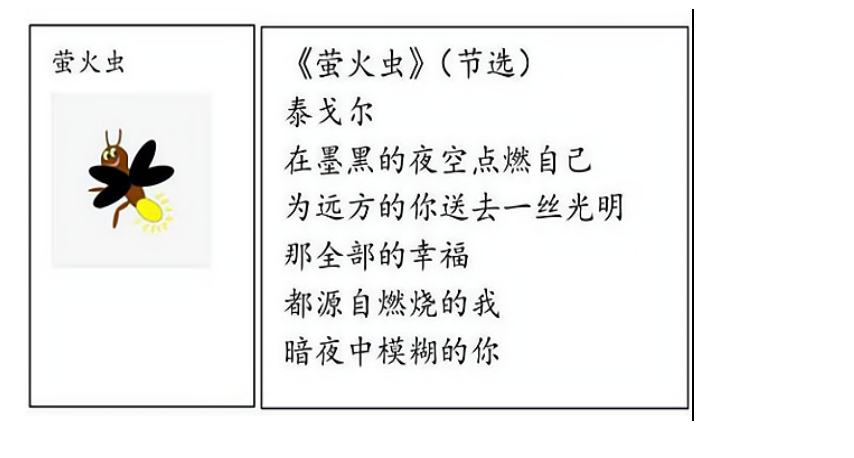
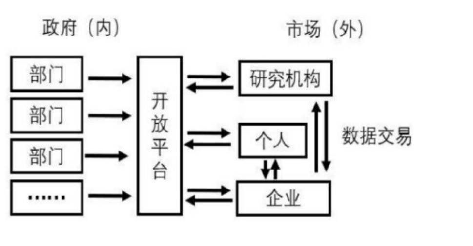

**2021江苏高考思想政治**

**一、单项选择题：共15题，每题只有一个选项最符合题意。**

1\. 教育是民族振兴、社会进步的重要基石。“十四五”期间，我国将以立德树人为根本任务，以推动高质量发展为主题，以深化供给侧结构性改革为主线，以改革创新为根本动力，大力推进高质量教育体系建设。建设高质量教育体系有助于（ ）

A. 保障公民的发展权，更好地服务国家建设

B. 调动公民直接参与教育决策和管理的积极性

C. 实现教育公平，维护公民基本的民主权利

D. 促进教育均衡发展，健全多层次社会保障体系

2\. 会议制度和工作程序。全国人大议事规则规定了全国人大及其常委会的组织制度、会议制度和工作程序。2021年3月11日，十三届全国人大四次会议表决通过了对这两部法律的修改决定，这是两部法律施行30多年后的首次修改。这两部法律的修改（ ）

A. 表明人民代表大会制度符合中国国情和实际

B. 有助于保证人民当家作主和推进全过程民主

C. 丰富了人民群众行驶国家权力的途径和方式

D. 有利于完善社会治理机制，提升社会治理水平

3\. 为进一步做好城市发展规划，践行“人民城市人民建，人民城市为人民”的理念，某地开展了专项问卷调查，其中“企业对政府服务的期望”调查结果如图所示。该检查结果启示政府有关部门需要（ ）

A. 推进政府职能由服务社会向服务企业转变

B. 简政放权，提高基本公共服务均等化水平

C. 深化“放管服”改革，持续优化营商环境

D. 完善宏观经济治理，提高政府科技创新力

4\. 为有效控制温室气体排放，走绿色低碳发展道路，我国建立了碳排放权交易市场，要求年度温室气体排放量达到2.6万吨二氧化碳当量及以上的企业需买入碳排放权配额，碳排放权成为稀缺的要素资产。按目前交易标准，风电和光伏企业可售减碳量能带来每度电0.013—0.074元的额外收益。碳排放权交易对发现碳价格、降低减排成本也会起到显著作用。材料表明（ ）

A. 环境保护作为公共产品导致了市场失灵

B. 市场交易是解决碳排放问题的关键手段

C. 可以利用经济手段解决市场失灵的问题

D. 政府是碳排放权的市场交易者

5\. 构建以国内大循环为主体、国内国际双循环相互促进的新发展格局，需要把满足国内需求作为发展的出发点和落脚点，着力打通生产、分配、流通、消费各个环节，进一步发挥消费在扩大内需中的基础性作用。促进消费要打好组合拳，从供给侧和需求侧同时发力。以下措施中，属于从供给侧发力的有（ ）

①提升城镇化率，促进人均消费水平提高

②实施传统商业数字化转型，提升传统消费

③促进就业增收，提高居民消费能力

④优化消费环境，推进商务信用体系建设

A. ①③ B. ①④ C. ②③ D. ②④

6\. 新疆某县常年气候干燥，一直以红花种植为主导产业，但受制于资金和技术，红花产业始终停留在手工作坊阶段，加工工艺落后，产品附加值低。2016年开始，某国有企业先后投入1000万元，帮助该县建成集标准厂房、仓库、实验室、展厅、晒场为一体的现代红花产业园。当地政府引入红花籽油龙头企业在产业园建设加工厂，实现了红花籽销售渠道稳定、价格稳中有升。材料说明（ ）

A. 民族地区发展的关键是政府扶持

B. 政企合作是民族地区发展的必由之路

C. 国有企业积极承担相应的社会责任

D. 国有企业在民族地区发展中起主导作用

7\. 第七次全国人口普查结果显示，我国人口结构发生较大变化。从年龄结构看，人口老龄化程度进一步加深，15～50岁人口占比63.35%，比2010年下降6.79个百分点；60岁及以上人口占比18.7%，比2010年上升5.44个百分点。从城乡人口结构看，我国居住在城镇的人口超过9亿人，占比63.89%，比2010年上升了4.21个百分点。其他条件不变的情况下，人口老龄化对经济影响的路径是（ ）

A. 人口老龄化→劳动力总量减少→工资水平提高→低端产业加速对外转移

B. 人口老龄化→城镇化程度提高→农村剩余劳动力下降→农业生产水平下降

C. 人口老龄化→消费结构变化→银发经济规模扩大→加速产业结构优化升级

D. 人口老龄化→人口出生率下降→资源约束缓解→经济社会协调发展

8\. 纪录片《奇妙之城》受到了广泛好评。该片有着浓郁烟火气息，不仅探索了不同城市的文化，而且讲述了城市中众多年轻人的故事，描绘出一幅中国青年的奋斗图谱，正式这群积极奋斗的青年，让观众尤其是是年轻人在感受不同城市文化的过程中审视自己、思考人生，从而获得一种精神力量。材料表明（ ）

①城市文化能推动社会实践发展

②优秀文化能给人们提供精神指引

③社会实践是优秀文化作品的源泉

④文化融合可以增强文化的感染力

A. ①③ B. ①④ C. ②③ D. ②④

9\. 春季出游不用“踏绿”而用“踏青”，中国画在古代被称为“丹青”，“稍见青青色，还从柳上归”“东风杨柳欲青青，烟淡雨初晴”“天青色等烟雨”……中国人对青色的喜爱，挥洒在笔墨之间，凝固在瓷器之中。青色传达给人是柔和、安详、深沉、朴素的色彩感受，彰显出东方审美中含蓄、沉静、典雅的文化特质。由此可见，中华文化（ ）

A. 在世界文化百花园中独领风骚

B. 具有强大的生命力和凝聚力

C. 具有鲜明的开放性和包容性

D. 展现了中华民族的精神向往

10\. 敦煌莫高窟是中华文化的瑰宝。当年，东来西往的僧侣、商人和军队在这里歇息、补给，不同国家和地区的宗教、艺术、文化在这里汇聚。这里既有早期印度风格的佛教洞窟，也有带有古希腊爱奥尼柱的建筑绘画。在很多壁画中可以看到鲜卑、粟特、回鹘、党项蒙古等各民族的形象，以及西域传来的各种乐器。由此可见（ ）

①文化发展要注重借鉴与融合

②各民族文化具有普遍的规律

③文化在相互的交流中得到传播

④文化创新要以我为主为我所用

A. ①③ B. ①④ C. ②③ D. ②④

11\. 下图给我们的哲学启示是（ ）

①生物的反应形式是意识产生的前提

②人的意识可以能动地认识世界

③意识对改造客观世界具有指导作用

④人的意识都是对客观存在的反映

A. ①③ B. ①④ C. ②③ D. ②④

12\. 马克思和恩格斯在《共产党宣言》中指出：“当古代世界走向灭亡的时候，古代的各种宗教就被基督教战胜了。当基督教思想在18世纪被启蒙思想击败的时候，封建社会正在同当时革命的资产阶级进行特殊的斗争”。这段话蕴含的道理是（ ）

A. 上层建筑对经济基础具有能动的反作用

B. 新世界的诞生总是伴随着旧思想的瓦解

C. 哲学不仅能解释世界而且能够改造世界

D. 哲学是对时代的实践经验的概括和总结

13\. 有研究表明，人体肠道菌群与社交行为障碍族病存在关联：将自闭症儿童的肠道菌群移植给小鼠，小鼠则表现自闭症的行为特征；而将正常儿童的肠道菌群移植给小鼠，小鼠则没有出现自闭症行为特征。这一发现有助于医生预防和治疗相关疾病，也为人们通过优化饮食和生活方式，保持愉悦心情，养成良好的社交行为提供了理论依据，材料表明（ ）

①实践和认识的循环是一个辩证发展的过程

②认识规律要以发挥人的主观能动性为基础

③实践提高了人识能力促进了认识发展

④对事物的正确认识需要多次反复才能完成

A. ①② B. ①③ C. ②④ D. ③④

14\. 下图漫画《搭档》与下列诗句所体现哲理最相近的是（ ）

A. 横看成岭侧成峰，远近高低各不同

B. 人间四月芳菲尽，山寺桃花始盛开

C. 山重水复疑无路，柳暗花明又一村

D. 两岸猿声啼不住，轻舟已过万重山

15\. 中国科学院院士周光召说：“对每一个科学家而言，其不断增加的一个责任就是准确和有和有效的说明新知识和新发现所可能带来的后果，从而对公众利益有所贡献。他们有义务引导媒体和社会以预防他们的发现被邪恶目的所滥用。同时，他们不应当只为自己的一己私利，在未经仔细核查和安全问题没有得利家全保障的情况下匆忙推出新产品和新技术。这段话蕴含的哲理是（ ）

①价值选择要以坚持和发展真理为宗旨

②一定条件下真理与谬误可以相互转化

③价值选择要考虑广大人民群众的利益

④每一事物内部都有对立统一两方面

A. ①② B. ①③ C. ②④④ D. ③④

**二、非选择题：共4题，共55分。**

16\. “小康不小康，关键看老乡。”中国的发展，最大的短板在农村。新中国成立后，中国共产党领导农民完成了农业的社会主义改造，建立起农村土地集体所有制。改革开放以来，党和政府始终把促进农业农村发展和农民增收摆在重要位置，连续多年出台指导“三农”工作的“一号文件”，农村面貌发生了巨大变化。党的十八大以后，农村改革继续深化，现行标准下近1亿农村贫困人口全部脱贫，农业农村发展取得新的历史性成就。下列美术作品生动反映了我国农村的发展变化。

综合运用经济和政治知识，结合材料说明我国是如何实现农业农村快速发展的。

17\. 材料一 随着数字经济的发展，政府数据开放已经成为当学世界各国的共同趋势。政府将可开放的数据资源面向全社会开放，企业、个人和研究机构可以利用这些数据并将公共数据资源体系的建立健全。

材料二 目前，我国在推进政府数据开放方面做出了一系列积极探索，并将进一步提升国家数据共享交换平台功能，优先推动企业登记监管、卫生、交通、气象等高价值数据集向社会开放，鼓励第三方深化对公共数据的挖掘利用。不过，政府数据开放也面临着公共数据资源概念不清，数据开放与数据共享、数据开放与数据交易的界限模糊等问题，尤其是数据开放的标准规范体系、安全保障体系和法规制度体系还需要进一步完善。

结合材料，回答下列问题：

（1）从《经济生活》角度，说明我推进政府数据开放的意义。

（2）运用唯物辩证法知识，阐述如何更好地推进政府数据开放。

18\. 提升公共文化服务水平是“十四五”规划和2035年远景目标纲要的重要内容。提升公共文化服务水平离不开公共文化空间建构，乡村公共文化空间对满足村民公共生活需要、涵养村民精神生活、传承乡土文化等有着重要意义。以下为一些地方的乡村公共文化空间建设案例。

参考上述案例，就“如何建设乡村公共文化空间”撰写一份建议书。

要求：①结合《文化生活》相关知识。②紧扣主题，建议科学，逻辑清晰，结构合理。③学科术语使用规范,字数在250字左右。

**【选做题】本题包括A、B、C三小题，请选定其中两小题，并在相应****答题区域内作答。若多做，则按作答的前两小题评分。**

A

19\. 【经济全球化与对外开放】

2020年11月4日，第三届中国国际进口博览会在上海开幕。进博会上，一项项高端装备展示创新科技，多种智能产品全球首发，引来国内外媒体关注。2021年5月6日，首届中国国际消费品博览会在海南开幕。消博会聚焦“高、新、优、特”消费精品，彰显了中国市场的巨大发展潜力和吸引力。当前，世界经济发展正面临单边主义、保护主义等严峻挑战，进博会和消博会的举办，传递出中国推进“合作共赢、合作共担、合作共治”的共同开放的声音，体现了中国同世界分享市场机遇、推动世界经济复苏、携手共创人类更加美好未来的真诚愿望。

结合所学知识，说明“合作共赢、合作共担、合作共治”是促进经济全球化健康发展的正确选择。

**B**

20\. 【经济学常识】

甲、乙两国长期开展自由贸易，形成了专业化生产结构，分别生产电视机和电脑芯片两种产品。由于乙国国内反全球化潮流兴起，两国关系恶化，乙国采取贸易限制措施，致使两国贸易完全中断。假设两国的生产和贸易结构如下表：

<table style="width:86%;">
<colgroup>
<col style="width: 14%" />
<col style="width: 17%" />
<col style="width: 17%" />
<col style="width: 17%" />
<col style="width: 17%" />
</colgroup>
<thead>
<tr>
<th rowspan="2" style="text-align: left;"></th>
<th colspan="2" style="text-align: left;">电视机</th>
<th colspan="2" style="text-align: left;">电脑芯片</th>
</tr>
<tr>
<th style="text-align: left;">甲</th>
<th style="text-align: left;">乙</th>
<th style="text-align: left;">甲</th>
<th style="text-align: left;">乙</th>
</tr>
</thead>
<tbody>
<tr>
<td style="text-align: left;">无贸易情况下的各国最优生产</td>
<td style="text-align: left;">300</td>
<td style="text-align: left;">200</td>
<td style="text-align: left;">100</td>
<td style="text-align: left;">200</td>
</tr>
<tr>
<td style="text-align: left;">有贸易情况下的各国最优生产</td>
<td style="text-align: left;">630</td>
<td style="text-align: left;">0</td>
<td style="text-align: left;">0</td>
<td style="text-align: left;">380</td>
</tr>
<tr>
<td style="text-align: left;">正常贸易情况下的产品分配</td>
<td style="text-align: left;">350</td>
<td style="text-align: left;">280</td>
<td style="text-align: left;">150</td>
<td style="text-align: left;">230</td>
</tr>
<tr>
<td style="text-align: left;">贸易中断后的损失</td>
<td style="text-align: left;">50</td>
<td style="text-align: left;">？</td>
<td style="text-align: left;">50</td>
<td style="text-align: left;">？</td>
</tr>
</tbody>
</table>

结合材料，计算贸易中断后乙国的损失并说明造成损失的原因。

**C**

21\. 【国家和国际组织常识】

粮食安全是世界和平与发展的重要保障。中国在立足国内保障粮食基本自给的同时，不断深化粮农领域国际合作。

◆中国与60多个国家和国际组织签署了120多份粮食和农业多双边合作协议、60多份进出口粮食检疫议定书，与140多个国家和地区建立了农业科技交流和经济合作关系。

◆中国严格按照加入世界贸易组织承诺，取消了相关农产品进口配额和许可证等非关税措施，积极与世界主要产粮国分享中国巨大的粮食市场。

◆中国积极响应和参与联合国粮农组织、世界粮食计划署等涉粮国际组织的倡议和活动，积极参与世界粮食安全治理。

结合材料，评价中国与国际组织在世界粮食安全领域的合作。
