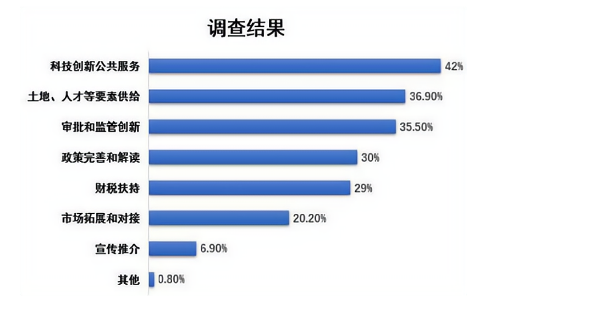
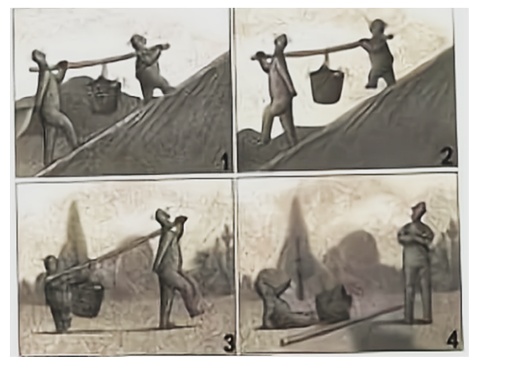
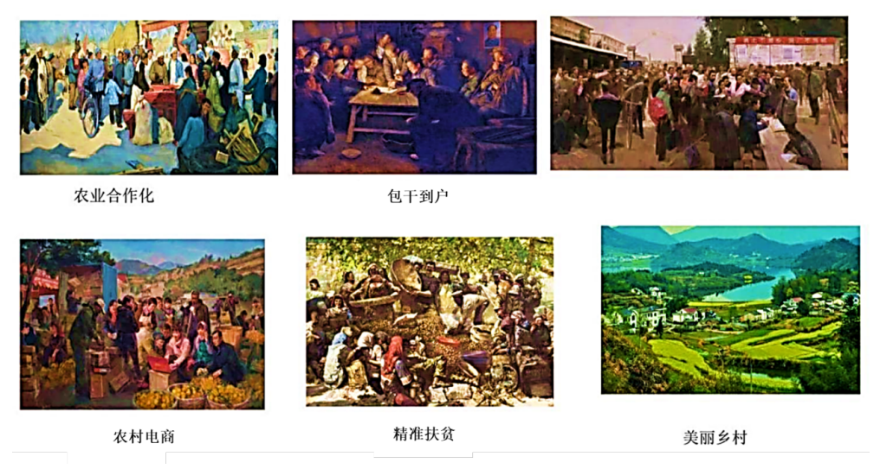
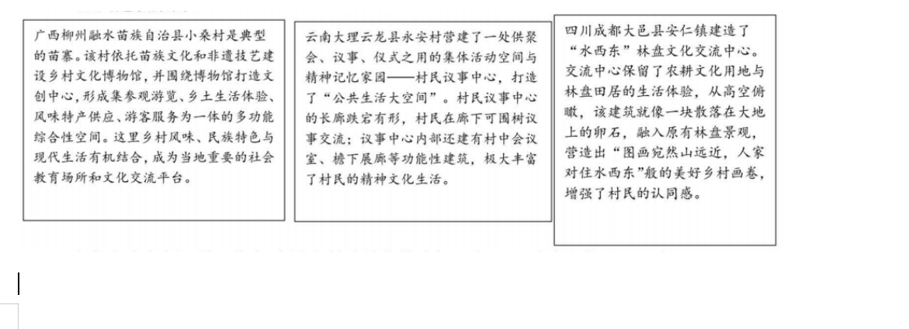

**2021江苏高考思想政治**

**一、单项选择题：共15题，每题只有一个选项最符合题意。**

1\. 教育是民族振兴、社会进步的重要基石。“十四五”期间，我国将以立德树人为根本任务，以推动高质量发展为主题，以深化供给侧结构性改革为主线，以改革创新为根本动力，大力推进高质量教育体系建设。建设高质量教育体系有助于（ ）

A. 保障公民的发展权，更好地服务国家建设

B. 调动公民直接参与教育决策和管理的积极性

C. 实现教育公平，维护公民基本的民主权利

D. 促进教育均衡发展，健全多层次社会保障体系

【答案】A

【解析】

【详解】A.：从题干中“教育是民族振兴、社会进步的重要基石”以及“我国将以立德树人为根本任务，以推动高质量发展为主题，以深化供给侧结构性改革为主线”等内容可以看出，我国建设高质量教育体系主要是通过此举保障公民的发展权，更好地服务于国家建设，故A正确。

B.：在我国，公民并不能直接参与教育决策和管理，故B错误。

C：公民基本的民主权利是选举权和被选举权，而不是教育公平，故C错误。

D. 我国建设高质量教育体系主要是保障公民受教育的权利，服务国家发展，与健全多层次社会保障体系无关，故D错误。

故本题选A。

2\. 会议制度和工作程序。全国人大议事规则规定了全国人大及其常委会的组织制度、会议制度和工作程序。2021年3月11日，十三届全国人大四次会议表决通过了对这两部法律的修改决定，这是两部法律施行30多年后的首次修改。这两部法律的修改（ ）

A 表明人民代表大会制度符合中国国情和实际

B. 有助于保证人民当家作主和推进全过程民主

C. 丰富了人民群众行驶国家权力的途径和方式

D. 有利于完善社会治理机制，提升社会治理水平

【答案】B

【解析】

【详解】A：材料未强调中国国情和实际情况，A排除。

B：全国人大对关于会议制度和工作程序的两部法律施行30多年后进行修改，这有助于保证人民当家作主和推进全过程民主，B符合题意。

CD：两部法律是关于全国人大及其常委会的组织制度、会议制度和工作程序的，不涉及人民群众行使国家权力的途径和方式问题，也不涉及社会治理问题，CD排除。

故本题选B。

3\. 为进一步做好城市发展规划，践行“人民城市人民建，人民城市为人民”的理念，某地开展了专项问卷调查，其中“企业对政府服务的期望”调查结果如图所示。该检查结果启示政府有关部门需要（ ）

A. 推进政府职能由服务社会向服务企业转变

B. 简政放权，提高基本公共服务均等化水平

C. 深化“放管服”改革，持续优化营商环境

D. 完善宏观经济治理，提高政府科技创新力

【答案】C

【解析】

【详解】A：推进政府职能由管理型向服务型转变，推进政府职能由服务社会向服务企业转变说法错误。

B：题干信息强调的是政府要对企业的服务，与提高基本公共服务均等化水平无关，B不符合题意。

C：调查结果显示：企业对政府服务的期望种类较多，体现了政府需要深化“放管服”改革，优化营商环境，C符合题意。

D：提高政府科技创新力说法错误，应该企业提高科技创新能力，D错误。

故本题选C。

4\. 为有效控制温室气体排放，走绿色低碳发展道路，我国建立了碳排放权交易市场，要求年度温室气体排放量达到2.6万吨二氧化碳当量及以上的企业需买入碳排放权配额，碳排放权成为稀缺的要素资产。按目前交易标准，风电和光伏企业可售减碳量能带来每度电0.013—0.074元的额外收益。碳排放权交易对发现碳价格、降低减排成本也会起到显著作用。材料表明（ ）

A. 环境保护作为公共产品导致了市场失灵

B. 市场交易是解决碳排放问题的关键手段

C. 可以利用经济手段解决市场失灵的问题

D. 政府是碳排放权的市场交易者

【答案】B

【解析】

【详解】B：我国通过建立碳排放权交易市场，有效控制温室气体排放，使碳排放权成为稀缺的要素资产，这对抑制碳排放、降低减排成本会起到显著作用。表明市场交易是解决碳排放问题的关键手段，应当把市场机制和宏观调控有机结合起来，B符合题意。

A：市场调节失灵是市场经济固有的，而不是环境保护作为公共产品导致了市场失灵。建立碳排放权交易市场恰恰是发挥了市场在资源配置中的决定性作用，A错误。

C：材料强调通过市场交易能够有效解决碳排放问题，而不是利用经济手段解决市场失灵的问题，C与题意不符。

D：政府是碳排放权的监管者，而不是市场交易者，D错误。

故本题选B。

5\. 构建以国内大循环为主体、国内国际双循环相互促进的新发展格局，需要把满足国内需求作为发展的出发点和落脚点，着力打通生产、分配、流通、消费各个环节，进一步发挥消费在扩大内需中的基础性作用。促进消费要打好组合拳，从供给侧和需求侧同时发力。以下措施中，属于从供给侧发力的有（ ）

①提升城镇化率，促进人均消费水平提高

②实施传统商业数字化转型，提升传统消费

③促进就业增收，提高居民消费能力

④优化消费环境，推进商务信用体系建设

A. ①③ B. ①④ C. ②③ D. ②④

【答案】D

【解析】

【详解】①：该选项是从需求侧发力，①不符合题意。

②④：“实施传统商业数字化转型，提升传统消费”与“优化消费环境，推进商务信用体系建设”，属于从供给侧发力，②④符合题意。

③：“促进就业增收，提高居民消费能力”，属于从需求侧发力，③不符合题意。

故本题选D。

6\. 新疆某县常年气候干燥，一直以红花种植为主导产业，但受制于资金和技术，红花产业始终停留在手工作坊阶段，加工工艺落后，产品附加值低。2016年开始，某国有企业先后投入1000万元，帮助该县建成集标准厂房、仓库、实验室、展厅、晒场为一体的现代红花产业园。当地政府引入红花籽油龙头企业在产业园建设加工厂，实现了红花籽销售渠道稳定、价格稳中有升。材料说明（ ）

A. 民族地区发展的关键是政府扶持

B. 政企合作是民族地区发展的必由之路

C. 国有企业积极承担相应的社会责任

D. 国有企业在民族地区发展中起主导作用

【答案】C

【解析】

【详解】A：政府扶持、民族地区的内生动力是民族地区发展的关键，A错误。

B：政企合作是民族地区发展的重要途径，B错误。

C：国有企业先后投入1000万帮扶新疆某县的发展，说明国有企业积极承担相应的社会责任，C正确。

D：题干信息强调的是国有企业对新疆某县的贡献，而不是强调国有企业的地位，D不符合题意。

故本题选C。

7\. 第七次全国人口普查结果显示，我国人口结构发生较大变化。从年龄结构看，人口老龄化程度进一步加深，15～50岁人口占比63.35%，比2010年下降6.79个百分点；60岁及以上人口占比18.7%，比2010年上升5.44个百分点。从城乡人口结构看，我国居住在城镇的人口超过9亿人，占比63.89%，比2010年上升了4.21个百分点。其他条件不变的情况下，人口老龄化对经济影响的路径是（ ）

A. 人口老龄化→劳动力总量减少→工资水平提高→低端产业加速对外转移

B. 人口老龄化→城镇化程度提高→农村剩余劳动力下降→农业生产水平下降

C. 人口老龄化→消费结构变化→银发经济规模扩大→加速产业结构优化升级

D. 人口老龄化→人口出生率下降→资源约束缓解→经济社会协调发展

【答案】A

【解析】

【详解】A：其他条件不变的情况下，人口老龄化会使劳动力总量减少，这会使劳动力供不应求，从而导致工资水平提高，进而导致低端产业加速对外转移，A传导正确。

B：其他条件不变的情况下，人口老龄化不一定会使城镇化程度提高，B错误。

C：人口老龄化与消费结构变化没有必然联系，银发经济规模扩大也未必加速产业结构优化升级，C错误。

D：人口出生率下降会导致人口老龄化加速，而不是人口老龄化导致人口出生率下降，D错误。

故本题选A。

8\. 纪录片《奇妙之城》受到了广泛好评。该片有着浓郁的烟火气息，不仅探索了不同城市的文化，而且讲述了城市中众多年轻人的故事，描绘出一幅中国青年的奋斗图谱，正式这群积极奋斗的青年，让观众尤其是是年轻人在感受不同城市文化的过程中审视自己、思考人生，从而获得一种精神力量。材料表明（ ）

①城市文化能推动社会实践的发展

②优秀文化能给人们提供精神指引

③社会实践是优秀文化作品的源泉

④文化融合可以增强文化感染力

A. ①③ B. ①④ C. ②③ D. ②④

【答案】C

【解析】

【详解】①：城市文化有积极健康的，也有消极落后腐朽的，并不是所有的城市文化都能推动社会实践的发展，文化创新推动社会实践的发展，①错误。

②③：让观众尤其是是年轻人在感受不同城市文化的过程中审视自己、思考人生，从而获得一种精神力量，这说明优秀文化能给人们提供精神指引，也说明社会实践是优秀文化作品的源泉，②③符合题意。

④：优秀文化可以增强文化的感染力，文化融合不一定增强文化的感染力，④错误。

故本题选C。

9\. 春季出游不用“踏绿”而用“踏青”，中国画在古代被称为“丹青”，“稍见青青色，还从柳上归”“东风杨柳欲青青，烟淡雨初晴”“天青色等烟雨”……中国人对青色的喜爱，挥洒在笔墨之间，凝固在瓷器之中。青色传达给人是柔和、安详、深沉、朴素的色彩感受，彰显出东方审美中含蓄、沉静、典雅的文化特质。由此可见，中华文化（ ）

A. 在世界文化百花园中独领风骚

B. 具有强大的生命力和凝聚力

C. 具有鲜明的开放性和包容性

D. 展现了中华民族的精神向往

【答案】D

【解析】

【详解】D：中国人对青色的喜爱，挥洒在笔墨之间，凝固在瓷器之中。青色传达给人是柔和、安详、深沉、朴素的色彩感受，彰显出东方审美中含蓄、沉静、典雅的文化特质。由此可见，中华文化展现了中华民族的精神向往和美好追求，D符合题意。

A：材料强调中华文学艺术反映人们的精神生活，展示人们的精神世界，不体现在世界文化百花园中独领风骚，A与题意不符。

BC：材料强调中华文化展现了中华民族的精神向往和美好追求，不涉及中华文化具有鲜明的开放性和包容性，也不体现具有强大的生命力和凝聚力，BC与题意不符。

故本题选D。

10\. 敦煌莫高窟是中华文化的瑰宝。当年，东来西往的僧侣、商人和军队在这里歇息、补给，不同国家和地区的宗教、艺术、文化在这里汇聚。这里既有早期印度风格的佛教洞窟，也有带有古希腊爱奥尼柱的建筑绘画。在很多壁画中可以看到鲜卑、粟特、回鹘、党项蒙古等各民族的形象，以及西域传来的各种乐器。由此可见（ ）

①文化发展要注重借鉴与融合

②各民族文化具有普遍的规律

③文化在相互的交流中得到传播

④文化创新要以我为主为我所用

A. ①③ B. ①④ C. ②③ D. ②④

【答案】A

【解析】

【详解】①③：这里既有早期印度风格的佛教洞窟，也有带有古希腊爱奥尼柱的建筑绘画。在很多壁画中可以看到鲜卑、粟特、回鹘、党项蒙古等各民族的形象，以及西域传来的各种乐器。说明了文化发展要注重借鉴与融合，文化在相互的交流中得到传播，故①③符合题意。

②④：材料强调的文化在交流中传播，文化发展要注重借鉴与融合，不涉及文化的共性，也没体现以我为主为我所用，故②④不符合题意。

故本题选A。

11\. 下图给我们的哲学启示是（ ）

①生物的反应形式是意识产生的前提

②人的意识可以能动地认识世界

③意识对改造客观世界具有指导作用

④人的意识都是对客观存在的反映

A. ①③ B. ①④ C. ②③ D. ②④

【答案】D

【解析】

【详解】②④：泰戈尔的《萤火虫》深刻的描述了萤火虫的特点，说明了人的意识可以能动地认识世界，人的意识是对客观存在的反映，故②④正确。

①：材料强调的是人的意识可以能动地认识世界，人的意识是对客观存在的反映，故①不符合题意。

③：正确的意识对改造客观世界具有指导作用，故③错误。

故本题选D。

12\. 马克思和恩格斯在《共产党宣言》中指出：“当古代世界走向灭亡的时候，古代的各种宗教就被基督教战胜了。当基督教思想在18世纪被启蒙思想击败的时候，封建社会正在同当时革命的资产阶级进行特殊的斗争”。这段话蕴含的道理是（ ）

A. 上层建筑对经济基础具有能动的反作用

B. 新世界的诞生总是伴随着旧思想的瓦解

C. 哲学不仅能解释世界而且能够改造世界

D. 哲学是对时代的实践经验的概括和总结

【答案】B

【解析】

【详解】A：材料反映的是一种上层建筑对另一种上层建筑的胜利，而不是强调上层建筑对经济基础具有能动的反作用，A排除。

B：当古代世界走向灭亡的时候，古代的各种宗教就被基督教战胜了。当基督教思想被启蒙思想击败的时候，封建社会正在同当时革命的资产阶级进行特殊的斗争，封建社会被资本主义社会取代了，这说明新世界的诞生总是伴随着旧思想的瓦解，B符合题意。

C：世界分为主观世界和客观世界，认为哲学能够改造世界不妥，C排除。

D：真正的哲学总结和概括了时代的实践经验，D错误。

故本题选B。

13\. 有研究表明，人体肠道菌群与社交行为障碍族病存在关联：将自闭症儿童的肠道菌群移植给小鼠，小鼠则表现自闭症的行为特征；而将正常儿童的肠道菌群移植给小鼠，小鼠则没有出现自闭症行为特征。这一发现有助于医生预防和治疗相关疾病，也为人们通过优化饮食和生活方式，保持愉悦心情，养成良好的社交行为提供了理论依据，材料表明（ ）

①实践和认识的循环是一个辩证发展的过程

②认识规律要以发挥人主观能动性为基础

③实践提高了人的识能力促进了认识发展

④对事物的正确认识需要多次反复才能完成

A. ①② B. ①③ C. ②④ D. ③④

【答案】B

【解析】

【详解】①③：有关自闭症行为特征的小鼠试验研究成果，有助于医生预防和治疗相关疾病，也为人们通过优化饮食和生活方式，保持愉悦心情，养成良好的社交行为提供了理论依据。这表明从实践到认识，再到实践的循环是一个辩证发展的过程，而实践提供新的认识工具提高了人的识能力，促进了认识发展，①③符合题意。

②：发挥人的主观能动性要以认识和把握规律为基础，②错误。

④：材料强调实践提供新的认识工具提高了人的识能力，促进了认识发展，不强调认识具有反复性，④与题意不符。

故本题选B。

14\. 下图漫画《搭档》与下列诗句所体现哲理最相近的是（ ）

A. 横看成岭侧成峰，远近高低各不同

B. 人间四月芳菲尽，山寺桃花始盛开

C. 山重水复疑无路，柳暗花明又一村

D. 两岸猿声啼不住，轻舟已过万重山

【答案】B

【解析】

【详解】A：“横看成岭侧成峰，远近高低各不同”，体现了认识的差异性，题中漫画体现的是矛盾具有特殊性，故A不符合题意。

B：“人间四月芳菲尽，山寺桃花始盛开”，体现了矛盾具有特殊性。漫画《搭档》体现的是在不同场合要采用不同的合作方式，即矛盾具有特殊性，要坚持具体问题具体分析，故B符合题意。

C：“山重水复疑无路，柳暗花明又一村”，诗句体现事物的发展是前进行和曲折性的统一，故C不符合题意。

D：“两岸猿声啼不住，轻舟已过万重山”描写的是作者轻松畅快的心情，不涉及矛盾的特殊性，D不符合题意。

故本题选B。

15\. 中国科学院院士周光召说：“对每一个科学家而言，其不断增加的一个责任就是准确和有和有效的说明新知识和新发现所可能带来的后果，从而对公众利益有所贡献。他们有义务引导媒体和社会以预防他们的发现被邪恶目的所滥用。同时，他们不应当只为自己的一己私利，在未经仔细核查和安全问题没有得利家全保障的情况下匆忙推出新产品和新技术。这段话蕴含的哲理是（ ）

①价值选择要以坚持和发展真理为宗旨

②一定条件下真理与谬误可以相互转化

③价值选择要考虑广大人民群众的利益

④每一事物内部都有对立统一的两方面

A. ①② B. ①③ C. ②④④ D. ③④

【答案】D

【解析】

【详解】③④：周光召院士的话说明每一事物内部都有对立统一的两方面，科学研究成果亦如此，因此科学家有义务引导媒体和社会以预防他们的发现被邪恶目的所滥用，应当准确和有和有效的说明新知识和新发现所可能带来的后果，从而对公众利益有所贡献，③④符合题意。

①：价值选择要以符合人民利益、为人类造福为宗旨，①错误。

②：材料不体现一定条件下真理与谬误可以相互转化，②与题意不符。

故本题选D。

**二、非选择题：共4题，共55分。**

16\. “小康不小康，关键看老乡。”中国的发展，最大的短板在农村。新中国成立后，中国共产党领导农民完成了农业的社会主义改造，建立起农村土地集体所有制。改革开放以来，党和政府始终把促进农业农村发展和农民增收摆在重要位置，连续多年出台指导“三农”工作的“一号文件”，农村面貌发生了巨大变化。党的十八大以后，农村改革继续深化，现行标准下近1亿农村贫困人口全部脱贫，农业农村发展取得新的历史性成就。下列美术作品生动反映了我国农村的发展变化。

综合运用经济和政治知识，结合材料说明我国是如何实现农业农村快速发展的。

【答案】党发挥总揽全局、协调各方的领导核心作用，始终把解决好“三农”问题作为全党工作的重中之重，引领“三农”事业发展的方向。党坚持以人民为中心，践行全心全意为人民服务的根本宗旨，带领和依靠广大农民发展农村经济，不断提高农民生活水平，保障农民的基本权益。党和政府推动农村各项制度改革创新，不断探索农业农村经济社会发展规律，深化农村经营制度改革，壮大农村集体经济，增强农村发展活力，解放和发展农村生产力，推动了农业农村现代化进程。

【解析】

【分析】背景素材：我国实现农业农村快速发展。

考点考查：党的领导核心作用、 党坚持以人民为中心、党的宗旨、科学执政、政府的知识、集体经济的知识。

能力考查：获取和解读信息、调度和运用知识、描述和阐释事物。

核心素养：科学精神、政治认同。

【详解】第一步：审设问。（明确主体、作答范围、问题限定和作答角度。）

本题的设问主体为我国， 需要综合调用经济和政治知识的有关知识，说明我国是如何实现农业农村快速发展的。回答此类问题的具体的解题思路是：定点——联系——梳理——作答。

第二步：审材料。（通过标点符号、段落等，提取材料有效信息。）

有效信息①：党和政府始终把“三农”问题摆在重要位置，连续多年出台指导“三农”工作的“一号文件”，引领“三农”事业发展的方向。→可得出党发挥总揽全局、协调各方的领导核心作用。

有效信息②：党带领和依靠广大农民发展农村经济，不断提高农民生活水平，农村面貌发生了巨大变化。→可联系党坚持以人民为中心，践行全心全意为人民服务的根本宗旨。

有效信息③：精准脱贫、乡村振兴以及美丽乡村建设，党不断探索农业农村经济社会发展规律，继续深化农村改革，推动了农业农村现代化进程。→可得出党和政府推动农村各项制度改革创新，党坚持科学执政，解放和发展农村生产力。

第三步：整合信息，组织答案。

得分点①：党发挥总揽全局、协调各方的领导核心作用+分析材料。

得分点②：党坚持以人民为中心，践行全心全意为人民服务的根本宗旨+分析材料。

得分点③：党和政府推动农村各项制度改革创新，不断探索农业农村经济社会发展规律，党坚持科学执政+分析材料

【点睛】怎么办（对策）类：

【题型特点】此类题的设问一般来讲都是给出了确定的主体，如党、国家、政府、公民、企业、消费者和个人等。并且指定了要回答的某一方面内容。

【解题技巧】可采用定点法，具体的解题思路是：定点——联系——梳理——作答。

定点：确定考核的知识点是什么。

联系：联系所给材料与所学知识。

梳理作答：将材料所给的信息与考核的知识点一一对照，二者相符的就是要点，作答时要做到观点和材料相结合。

政治方面如何做，具体又可从党、国家、公民角度回答。

17\. 材料一 随着数字经济的发展，政府数据开放已经成为当学世界各国的共同趋势。政府将可开放的数据资源面向全社会开放，企业、个人和研究机构可以利用这些数据并将公共数据资源体系的建立健全。

材料二 目前，我国在推进政府数据开放方面做出了一系列积极探索，并将进一步提升国家数据共享交换平台功能，优先推动企业登记监管、卫生、交通、气象等高价值数据集向社会开放，鼓励第三方深化对公共数据的挖掘利用。不过，政府数据开放也面临着公共数据资源概念不清，数据开放与数据共享、数据开放与数据交易的界限模糊等问题，尤其是数据开放的标准规范体系、安全保障体系和法规制度体系还需要进一步完善。

结合材料，回答下列问题：

（1）从《经济生活》角度，说明我推进政府数据开放的意义。

（2）运用唯物辩证法知识，阐述如何更好地推进政府数据开放。

【答案】（1）数据是重要的生产要素，推进政府数据开放有助于培育数据要素市场，加快高标准市场体系建设有助于发挥市场在资源配置中的决定性作用和政府宏观调控作用，促进数据资源优化配置有助于推进创新发展，共享发展，建设现代化经济体系。

（2）①世界是普遍联系的，要求我们用联系的观点看问题，特别是要正确认识和处理整体与部分的辩证关系，掌握系统优化的方法，推进政府数据开放要正确处理政府数据平台和其他市场主体等要素资源联系，用综合的思维方式从整体上构建公共数据体系。\
②主要矛盾与次要矛盾辩证关系原理要求我们坚持两点论和重点论相统一的方法。推进政府数据开放，需要明确公共数据的资源概念，理清数据开放与数据共享，数据开放与数据交易的关系，更要完善数据开放的标准规范，安全保障和法规等体系。

【解析】

【分析】背景素材：数据作为生产要素为背景材料

考点考查：市场在资源配置中的决定性作用、政府宏观调控、联系的普遍性、主要矛盾与次要矛盾辩证关系

能力考查：描述和阐释事物的能力

核心素养：政治认同、科学精神

【小问1详解】

第一步：审设问，明确作答的范围和角度。

本题要求从《经济生活》角度，说明我国推进政府数据开放的意义，考生在解答本题时首先明确数据开放一是发挥政府的作用一是发挥市场的作用。

第二步：审材料，提取关键信息。

有效信息①：政府将可开放的数据资源面向全社会开放，企业、个人和研究机构可以利用这些数据并将公共数据资源体系的建立健全→联系发挥市场在资源配置中的决定性作用和政府宏观调控作用。

有效信息②：我国在推进政府数据开放方面做出了一系列积极探索，并将进一步提升国家数据共享交换平台功能，优先推动企业登记监管、卫生、交通、气象等高价值数据集向社会开放，鼓励第三方深化对公共数据的挖掘利用→联系创新发展，共享发展，建设现代化经济体系。

第三步：整合信息，组织答案。

得分点①：发挥市场在资源配置中的决定性作用和政府宏观调控作用。

得分点②：贯彻创新发展，共享发展，建设现代化经济体系。

【小问2详解】

第一步：审设问，明确作答的范围和角度。

本题要求运用唯物辩证法知识，阐述如何更好地推进政府数据开放。考查的知识点是唯物辩证法。

第二步：审材料，提取关键信息。

有效信息①：优先推动企业登记监管、卫生、交通、气象等高价值数据集向社会开放，鼓励第三方深化对公共数据的挖掘利用→联系世界是普遍联系的，要求我们用联系的观点看问题，注重整体和部分的关系。

有效信息②：政府数据开放也面临着公共数据资源概念不清，数据开放与数据共享、数据开放与数据交易的界限模糊等问题，尤其是数据开放的标准规范体系、安全保障体系和法规制度体系还需要进一步完善→联系主要矛盾与次要矛盾辩证关系，要求我们坚持两点论和重点论相统一的方法。

第三步：整合信息，组织答案。

得分点①：世界是普遍联系的，要求我们用联系的观点看问题，特别是要正确认识和处理整体与部分的辩证关系，掌握系统优化的方法，推进政府数据开放要正确处理政府数据平台和其他市场主体等要素资源联系，用综合的思维方式从整体上构建公共数据体系。

得分点②：主要矛盾与次要矛盾辩证关系原理要求我们坚持两点论和重点论相统一的方法。推进政府数据开放，需要明确公共数据的资源概念，理清数据开放与数据共享，数据开放与数据交易的关系，更要完善数据开放的标准规范，安全保障和法规等体系。

【点睛】意义、影响类主观题

1、题型特点

（1）从考查的方式看，紧扣国家大政方针或现实生活问题，以具体措施、重要决策、典型事件为载体，分析其可能产生的后果。设问方式既有全面影响类(积极意义和消极危害)，又有单一影响类(积极意义或消极影响)；既有针对某一问题的具体影响，又有没有明确指向的系统影响。

（2）从考查的知识看，主要考查经济、政治、文化生活中的作用、影响、意义、优越性等知识，以及国家大政方针的最新表述等。

（3）从考查的能力看，突出考查学生因果分析和推断能力。

2、解答技巧

（1）注意设问的知识范围。看其要求分析的是经济、政治、文化中的哪一个模块的影响或意义，还是围绕着某一点知识去分析影响或意义，甚至是没有限定的综合性的影响。

（2）明确影响或意义分析的起点和落点。①起点就是弄清围绕着“谁”来分析影响或意义，即根据什么样的“因”来分析“果”，如分析哪项具体措施、哪个主体行为的影响或意义。②落点就是弄清分析对“谁”的影响或意义，即根据“因”来分析什么样的“果”，如分析对国家、个人、企业等的影响或意义。

（3）注意设问对影响性质的要求。如果是指向“影响”，需要坚持一分为二的观点，从积极意义和消极影响两个角度分析问题；如果是指向“意义”，只需要分析可能产生的积极效果。

18\. 提升公共文化服务水平是“十四五”规划和2035年远景目标纲要的重要内容。提升公共文化服务水平离不开公共文化空间建构，乡村公共文化空间对满足村民公共生活需要、涵养村民精神生活、传承乡土文化等有着重要意义。以下为一些地方的乡村公共文化空间建设案例。

参考上述案例，就“如何建设乡村公共文化空间”撰写一份建议书。

要求：①结合《文化生活》相关知识。②紧扣主题，建议科学，逻辑清晰，结构合理。③学科术语使用规范,字数在250字左右。

【答案】( 水平1）结合案例，紧扣主题，围绕“尊重文化多样性，继承传统，推陈出新”精神交明建设"等方面提出建议；建议科学。逻辑清晰。结构合理.表达流畅。\
(水平2）结合案例，紧扣主题，围绕上述两个方面提出建议；建议科学。逻辑清晰。结构合理.表达流畅.\
(水平3）结合案例，紧扣主题，围绕上述1个方面提出建议;建议较为科学。逻辑较为清晰。结构较为合理.表达较为流畅.\
(水平4）不能结合案例︰建议不够科学，简单堆叠，逻辑较为混乱\
\
评分细则∶建议书撰写要点\
(1)尊重文化多样性，注重当地特色文化\
(2）维承传统文化，结合时代特点创新\
(3）考虑群众需求，为精神文明建设作责献;\
\
水平1;有三个要点,逻辑清晰，表达完整\
水平2∶有两个要点，逻辑清晰\
水平3∶有一个要点，逻辑较清晰\
分水平4∶简单堆砌，无逻辑

【解析】

【分析】背景素材：提升公共文化服务水平

考点考查：尊重文化多样性、“继承传统、推陈出新”、精神文明建设的有关知识

能力考查：获取和解读信息，调动和运用知识，描述和阐述事物

核心素养：科学精神、实践创新

【详解】第一步：审设问，明确主体、作答范围、问题限定和作答角度。

本题的设问主体为考生，需要调用尊重文化多样性、“继承传统、推陈出新”、精神文明建设的有关知识，就“如何建设乡村公共文化空间”撰写一份建议书。

第二步：审材料，通过标点符号、段落等，提取材料有效信息。

有效信息①：三地乡村文化建设内容和途径不完全相同→可联系尊重文化多样性。

有效信息②：传承乡土文化→可联系“继承传统、推陈出新”。

有效信息③：涵养村民精神生活→可联系精神文明建设。

第三步：整合信息，组织答案。

得分点①：尊重文化多样性+尊重文化多样性的原因、要求。

得分点②：“继承传统、推陈出新”+正确对待传统文化，发挥优秀传统文化作用，继承与发展、文化创新。

得分点③：精神文明建设+发展教育、发展科技、开展精神文明活动。

【点睛】解答开放性试题的一般思路与步骤可以归纳为“四要”。一要精析题意。首先要精析题意包含的关键信息，然后要精析试题要求考生用什么方法回答什么问题。二要回归教材。开放性试题的命题及答案取向是以教材为基础的，解题时必须以课本基础知识为依据。回归教材就是要以问题为中心向教材求索，寻根问宗，找出解答试题的“知识点”来组织答案。三要注重发散。正确运用发散思维是解答开放性试题最为重要的思维武器。四要文字简练。在找到知识要点、确定答题思路后，还要准确完整地组织答案。这既包括答题的一般要求，语言流畅、要点清晰、合乎逻辑等，还包括如何使答案更全面、更深刻。

**【选做题】本题包括A、B、C三小题，请选定其中两小题，并在相应的答题区域内作答。若多做，则按作答的前两小题评分。**

A

19\. 【经济全球化与对外开放】

2020年11月4日，第三届中国国际进口博览会在上海开幕。进博会上，一项项高端装备展示创新科技，多种智能产品全球首发，引来国内外媒体关注。2021年5月6日，首届中国国际消费品博览会在海南开幕。消博会聚焦“高、新、优、特”消费精品，彰显了中国市场的巨大发展潜力和吸引力。当前，世界经济发展正面临单边主义、保护主义等严峻挑战，进博会和消博会的举办，传递出中国推进“合作共赢、合作共担、合作共治”的共同开放的声音，体现了中国同世界分享市场机遇、推动世界经济复苏、携手共创人类更加美好未来的真诚愿望。

结合所学知识，说明“合作共赢、合作共担、合作共治”是促进经济全球化健康发展的正确选择。

【答案】经济全球化符合经济规律，符合各方利益，坚持合作共赢，才能推动经济全球化朝着更加开放、包容、普惠、平衡、共赢的方向发展；\
经济全球化是一把双刀剑，面对当刖世界经济发展面临的各种严峻风险和挑战，坚持合作共担，各国才能共享机遇，互利共赢；\
坚持合作共治，反对单边主义和保护主义，才能不断完善全球经济治理体系，推动世界经济持久发展。

【解析】

【分析】背景素材：第三届中国国际进口博览会相关材料

考点考查：经济全球化的机遇等有关知识

能力考查：描述和阐述事物，论证和探究问题

核心素养：政治认同、科学精神

【详解】第一步：审设问。明确主体、作答范围、问题限定和作答角度。

本题的设问主体为结合所学知识，说明“合作共赢、合作共担、合作共治”是促进经济全球化健康发展的正确选择。答题时需要联系教材有关知识，做到理论与实际相结合。

第二步：审材料，通过标点符号、段落等，提取材料有效信息。

有效信息①：消博会聚焦“高、新、优、特”消费精品，彰显了中国市场的巨大发展潜力和吸引力→可联系经济全球化符合经济规律，符合各方利益。

有效信息②：经济全球化给各国带来了发展机遇，但是世界经济发展正面临单边主义、保护主义等严峻挑战→可联系经济全球化是一把双刀剑。

有效信息③：为了促进经济全球化，是经济全球化的消极影响降到最低→需要各国坚持合作共治，反对单边主义和保护主义，才能不断完善全球经济治理体系，推动世界经济持久发展。

第三步：整合信息，组织答案。

得分点①：经济全球化符合经济规律，符合各方利益，坚持合作共赢，才能推动经济全球化朝着更加开放、包容、普惠、平衡、共赢的方向发展+联系材料。

得分点②：经济全球化是一把双刀剑，面对当刖世界经济发展面临的各种严峻风险和挑战，坚持合作共担，各国才能共享机遇，互利共赢+抓住经济全球化发展机遇，使消极影响降至最低。

得分点③：坚持合作共治，反对单边主义和保护主义，才能不断完善全球经济治理体系，推动世界经济持久发展+联系材料。

【点睛】非选择题的审题要求：

（1）审设问：一是明确题目考查的知识范围和考查意图，正确联想相关知识，形成综合性的信息认识；二是明确设问的指向性和规定性，分清题干要求答题的类别，即回答“是什么”、或“为什么”、或“怎么样”、或“怎样体现”中哪一类。

（2）审主体：明确主体有几个，不同主体的言论和行为各是什么。这些应从解读设问和材料中获取。

（3）审材料：获取材料中有效信息，抓住关键词、关键句子。这样做，一是为了正确联想相关知识，二是进一步明确答题的主体，不同主体的言论和行为各是什么；三是关键的句子要作为“材料语言”写入答案要点中。审材料实质上就是为了进一步证实“审设问和审主体”的正确与否。

**B**

20\. 【经济学常识】

甲、乙两国长期开展自由贸易，形成了专业化生产结构，分别生产电视机和电脑芯片两种产品。由于乙国国内反全球化潮流兴起，两国关系恶化，乙国采取贸易限制措施，致使两国贸易完全中断。假设两国的生产和贸易结构如下表：

<table style="width:86%;">
<colgroup>
<col style="width: 14%" />
<col style="width: 17%" />
<col style="width: 17%" />
<col style="width: 17%" />
<col style="width: 17%" />
</colgroup>
<thead>
<tr>
<th rowspan="2" style="text-align: left;"></th>
<th colspan="2" style="text-align: left;">电视机</th>
<th colspan="2" style="text-align: left;">电脑芯片</th>
</tr>
<tr>
<th style="text-align: left;">甲</th>
<th style="text-align: left;">乙</th>
<th style="text-align: left;">甲</th>
<th style="text-align: left;">乙</th>
</tr>
</thead>
<tbody>
<tr>
<td style="text-align: left;">无贸易情况下的各国最优生产</td>
<td style="text-align: left;">300</td>
<td style="text-align: left;">200</td>
<td style="text-align: left;">100</td>
<td style="text-align: left;">200</td>
</tr>
<tr>
<td style="text-align: left;">有贸易情况下的各国最优生产</td>
<td style="text-align: left;">630</td>
<td style="text-align: left;">0</td>
<td style="text-align: left;">0</td>
<td style="text-align: left;">380</td>
</tr>
<tr>
<td style="text-align: left;">正常贸易情况下的产品分配</td>
<td style="text-align: left;">350</td>
<td style="text-align: left;">280</td>
<td style="text-align: left;">150</td>
<td style="text-align: left;">230</td>
</tr>
<tr>
<td style="text-align: left;">贸易中断后的损失</td>
<td style="text-align: left;">50</td>
<td style="text-align: left;">？</td>
<td style="text-align: left;">50</td>
<td style="text-align: left;">？</td>
</tr>
</tbody>
</table>

结合材料，计算贸易中断后乙国的损失并说明造成损失的原因。

【答案】贸易中断后，乙国的损失为电视机80.电脑芯片30。甲、乙两国分别在电视机、电脑芯片生产上拥有成本优势。在正常贸易的情况下，两国的成本优势得到充分发挥。均可从贸易中获得好处。贸易中断后，市场规模变小，限制了分工的发展，专业化程度降低，资源配置效率受到影响，从而使两国均受到损失，

【解析】

【分析】背景素材：甲乙两国贸易中断

考点考查：经济学常识的有关知识

能力考查：调动和运用知识，描述和阐述事物，论证和探究问题

核心素养：科学精神

【详解】第一步：审设问，明确主体、作答范围、问题限定和作答角度。

本题的设问作答角度是甲乙两国贸易中断给乙国带来的损失， 需要调用经济学常识的有关知识，分析材料所述做法给乙国带来的损失。回答影响类主观题，一般需要先找出两者之间存在的联系，再分析联系中断带来的影响。

第二步：审材料，通过标点符号、段落等，提取材料有效信息。

有效信息①：根据图表可知，贸易中断后，乙国的损失为电视机80.电脑芯片30。

有效信息②：根据图表可知，、乙两国分别在电视机、电脑芯片生产上拥有成本优势→贸易中断后，市场规模变小，限制了分工的发展，专业化程度降低，资源配置效率受到影响，从而使两国均受到损失。

第三步：整合信息，组织答案。

得分点①：根据图表可知，贸易中断后，乙国的损失为电视机80.电脑芯片30。

得分点②：贸易中断后，市场规模变小，限制了分工的发展，专业化程度降低，资源配置效率受到影响，从而使两国均受到损失+根据图表可知，、乙两国分别在电视机、电脑芯片生产上拥有成本优势。

【点睛】图表题答题技巧：三看：（1）看表头，会得到关于图表主体的相关内容（2）看表体，会得到相关主体在一定时间内的变化状况；（3）看小注，会得到其他相关的补充信息；两比：（1）横比，同一时间段内，对不同主体进行对比；（2）纵比，同一主体在不同时间的变化发展；一升华：通过对三看、两比得到的信息进行分析，得到相关的原理。

**C**

21\. 【国家和国际组织常识】

粮食安全是世界和平与发展的重要保障。中国在立足国内保障粮食基本自给的同时，不断深化粮农领域国际合作。

◆中国与60多个国家和国际组织签署了120多份粮食和农业多双边合作协议、60多份进出口粮食检疫议定书，与140多个国家和地区建立了农业科技交流和经济合作关系。

◆中国严格按照加入世界贸易组织承诺，取消了相关农产品进口配额和许可证等非关税措施，积极与世界主要产粮国分享中国巨大的粮食市场。

◆中国积极响应和参与联合国粮农组织、世界粮食计划署等涉粮国际组织的倡议和活动，积极参与世界粮食安全治理。

结合材料，评价中国与国际组织在世界粮食安全领域的合作。

【答案】中国重视国际组织在促进世界和平与发展中的作用，不断深化粮食安全领域国际合作，为维护世界粮食安全作出了重要贡献。中国积极践行自由贸易理念，兑现入世承诺，与国际社会分享中国粮食市场，维护了多边贸易体系，彰显了大国责任。中国维护联合国在全球治理中的核心地位，与联合国专门机构加强世界粮食安全治理合作，在人类和平与发展事业中发挥着建设性作用。

【解析】

【分析】背景素材：中国在立足国内保障粮食基本自给的同时，不断深化粮农领域国际合作。

考点考查：国际组织的作用、中国与联合国等知识。

能力考查：获取和解读信息、调度和运用知识、描述和阐释事物、论证和探究问题

核心素养：政治认同。

【详解】第一步：审设问。（明确主体、作答范围、问题限定和作答角度。）

本题的设问主体为中国， 需要调用《国家和国际组织常识》的有关知识，评价中国与国际组织在世界粮食安全领域的合作。

回答此类问题可按照“判断表态”——“阐述道理”——“明确做法”的解题思路来作答，也可按照“是什么”——“为什么”——“怎么办”的解题思路来作答。

第二步：审材料。（通过标点符号、段落等，提取材料有效信息。）

有效信息①：粮食安全是世界和平与发展的重要保障。中国与国际组织在世界粮食安全领域的展开广泛合作。→可得出中国重视国际组织在促进世界和平与发展中的作用。

有效信息②：中国严格兑现入世承诺，积极与世界主要产粮国分享中国巨大的粮食市场。→可得出中国积极践行自由贸易理念，维护多边贸易体系。

有效信息③：中国积极响应联合国及其专门机构的倡议和活动，参与世界粮食安全治理。→可得出中国维护联合国在全球治理中的核心地位，在人类和平与发展事业中发挥着建设性作用。

第三步：整合信息，组织答案。

得分点①：中国重视国际组织在促进世界和平与发展中的作用，为维护世界粮食安全作出了重要贡献+分析材料。

得分点②：中国积极践行自由贸易理念，维护了多边贸易体系，彰显了大国责任+分析材料。

得分点③：中国维护联合国在全球治理中的核心地位，在人类和平与发展事业中发挥着建设性作用+分析材料。

【点睛】认识（评价）类：

【题型特点】此类题通常是材料先给出一个重大的社会现象，然后要求用所学的知识谈谈对这一现象的认识，常见设问有“如何认识”，“如何看待”“谈谈对某一现象的看法”“分析（评析）某一现象”等。

【解题技巧】此类题可按照“判断表态”——“阐述道理”——“明确做法”的解题思路来作答，也可按照“是什么”——“为什么”——“怎么办”的解题思路来作答。

“是什么”——即题目说（做）的是什么事，或题目观点是对还是错。

“为什么”——即说（做）这件事的依据、重要性、必要性、可能性、不做这件事的危害性。依据——是说（做）这件事的政治、经济、法律的理论依据；重要性——是说（做）这件事的作用、意义、目的、目标等；必要性——是说（做）这件事当前存在的客观实际，即非做不可的原因；可能性——是说（做）这件事存在哪些主客观条件，使做这件事成为可能。危害性——是做或不做这件事将会导致怎样的消极后果。

“怎么办”——即党、国家、公民、企业、消费者、个人等准备怎样做此事，采取哪些具体措施来解决问题。
