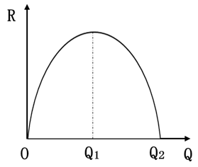
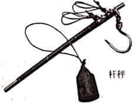

**机密★启用前**

**2021年河北省普通高中学业水平选择性考试**

**思想政治**

**注意事项：**

**1.答卷前，考生务必将自己的姓名、考生号、考场号、座位号填写在答题卡上。**

**2.回答选择题时，选出每小题答案后，用铅笔把答题卡上对应题目的答案标号涂黑，如需改动，用橡皮擦干净后，再选涂其他答案标号。回答非选择题时，将答案写在答题卡上。写在本试卷上无效。**

**3.考试结束后，将本试卷和答题卡一并交回。**

**一、单项选择题：本题共15小题，每小题3分，共45分。在每小题给出的四个选项中，只有一项是符合题目要求的。**

1\. 哈密位于新疆东部，地跨天山，东挽内地，数条铁路和高速公路交会于此，多条航线联结北京、上海等城市和新疆腹地。近年来，为将区位优势转化为经济优势，从“经济通道”迈向“通道经济”，哈密正在加快建设陆港型物流枢纽。哈密发展现代物流业有利于（ ）

①制造业通过缩短流通时间提高单位商品的价值量，促进产业升级

②发挥流通对经济发展的决定性作用，畅通国内大循环

③在更大范围把生产和消费联系起来，推动分工深化

④吸引生产要素和市场主体集聚，扩大经济规模

A. ①② B. ①③ C. ②④ D. ③④

2\. 某企业产品的销售收入（*R*）与销量（*Q*）的关系如下图所示。不考虑其他因素，该企业产品的销量与价格呈反方向变动，如果企业要增加销售收入，应采取的策略是（ ）

①当0\<*Q*\<*Q*1时，适当提高价格

②当0\<*Q*\<*Q*1时，适当降低价格

③当*Q*1\<*Q*\<*Q*2时，适当提高价格

④当*Q*1\<*Q*\<*Q*2时，适当降低价格

A. ①③ B. ①④ C. ②③ D. ②④

3\. 强化监管并有效应对保险业风险是防范化解重大金融风险的重要组成部分。保险具有风险防范的功能，但受各种因素影响，保险公司自身也面临着风险。某市一保险公司提供的服务对当地金融部门、实体经济运作至关重要，且占有很高的市场份额并少有替代品。若因某种原因，该公司风险爆发，那么可能的风险传导或风险化解路径是（ ）

①保险公司关键功能弱化→中断对实体经济保险服务→投保企业管理水平下降

②保险公司经营陷入困境→直接关联的金融机构风险暴露→金融市场异常波动

③保险公司依法破产→破产结算并优先保护投资者利益→防范化解社会风险

④政府与相关优势企业发挥作用→促进保险公司兼并重组→化解金融市场风险

A. ①③ B. ①④ C. ②③ D. ②④

4\. 我国在坚持高质量引进来同时，鼓励高水平走出去，扩大对外直接投资。近年来，我国涌现出一批重要的海外并购项目，如河钢集团成功收购塞尔维亚斯梅代雷沃钢厂，使百年老厂重焕生机。目前我国已成为双向投资大国，对外直接投资多年居全球前三名，吸引外资2020年居全球首位。我国双向投资快速发展的原因包括（ ）

①实现引进外资与对外投资平衡的目标要求

②经济全球化的深入发展与跨国公司生产经营的全球布局

③我国国际产能合作的大力推进与近年来国际经济安全性的不断提高

④发挥我国大市场优势与积极参与多双边区域投资贸易合作机制

A. ①② B. ①③ C. ②④ D. ③④

5\. 重庆九龙坡区的杨永根，30余年牵头调解矛盾纠纷近2500件次，群众亲切地称呼他“老杨”。在老杨带动下，越来越多的党员干部、居民、社工、社会组织等志愿参与社区建设。“老杨”变成“一群杨”，矛盾纠纷在基层得到及时化解和妥善解决，居民的安全感和满意度明显提升。多元力量及志愿参与社区建设（ ）

①体现了公民奉献意识和互助意识的不断增强

②彰显了我国基层群众自治制度的显著优势

③提升了群众参与民主管理和民主监督的能力

④有助于推动共建共治共享基层社会治理格局构建

A. ①② B. ①④ C. ②③ D. ③④

6\. “不为不办找理由，只为办好想办法。”2021年，河北某市市民服务中心新设“办不成事”反映窗口。针对群众反映的“应办未办”事项，限定5个工作日内解决；对于“完全不能办理”的事项，限定3个工作日内回复并说明不能办理的原因。该市政府此举（ ）

①坚持了人民利益至上的价值理念

②提升了公共事业管理水平

③深化机构改革，提升了行政服务效率

④创新工作方法，拓宽了为民服务渠道

A. ①② B. ①④ C. ②③ D. ③④

7\. 走访提案承办单位，是全国政协在重新修订重点提案遴选与督办办法后新增的一种重点提案督办方式。2020年11月27日，全国政协委员高杰就其提交的有关我国优秀文化遗产保护的提案，到国家文物局走访督办，通过与国家文物局有关领导面对面沟通、深度协商，达成一致意见。该督办方式有利于（ ）

①进一步推动提案办理工作提质增效

②通过强化政协委员的质询权，促进提案落实

③更好发挥提案在建言资政和凝聚共识方面的作用

④丰富协商民主形式，开拓多党合作的新路径

A. ①③ B. ①④ C. ②③ D. ②④

8\. 国家主席习近平多次强调：“鞋子合不合脚，自己穿了才知道。”“一个国家的发展道路合不合适，只有这个国家的人民才最有发言权。”2021年3月23日，中俄两国外长在广西桂林发表的联合声明中重申：“民主模式不存在统一的标准。应尊重主权国家自主选择发展道路的正当权利。以‘推进民主’，为借口干涉主权国家内政不可接受。”与上述主张相符的是（ ）

①发展道路的差异是国际交流合作的障碍

②维护国际公平正义，反对霸权主义和强权政治

③中国不“输入”外国模式，也不“输出”中国模式

④维护世界和平稳定是世界各国的共同期待

A. ①② B. ①④ C. ②③ D. ③④

9\. 杆秤曾是中国的主要度量工具之一。秤杆上标志起算点（重量为零）的星叫做定盘星，是确定其他刻度的基础。定准定盘星是做好杆秤的关键，相当于“扣好人生第一粒扣子”。秤杆上的绳纽叫做秤亳。之所以称其为秤亳，是提醒人们：在交易时，要明察秋亳，不能粗心大意；要正心诚意，不能缺斤少两。下列选项与材料主旨一致的是（ ）

①杆秤设计目的是彰显诚信的价值观念

②公平公正是为人处世的重要原则

③日用器物蕴含着一定文化观念

④传统文化是物质资料生产方式的反映

A. ①③ B. ①④ C. ②③ D. ②④

10\. 2021年3月，被誉为“中国画熊猫第一人”的刘中，与关爱熊猫、热爱美术、热心公益的各界人士共同发起设立了“熊猫艺术发展基金”。该基金的用途包括：资助青少年在生态环保美术领域的写生、创作及交流，提高学生美术创作水平；组织熊猫文化国际传播与交流，讲好中国故事、传播好中国声音……该基金支持上述活动（ ）

①有利于丰富青少年的精神世界

②实现了“五育并举”的教育目标

③有助于增强中国国家形象美誉度

④有益于丰富审美教育的形式

A. ①③ B. ①④ C. ②③ D. ②④

11\. 博览典籍故事，读懂典籍思想。中央广播电视总台热播的《典籍里的中国》，曾演绎了一场《天工开物》作者宋应星和“杂交水稻之父”袁隆平两位科学家跨越300余年、共筑“禾下乘凉梦”的奇妙故事。这个故事打动了观众，也让《天工开物》中“此书于功名进取毫不相关也”一语更加深入人心。可见（ ）

①科学家不计功名的奉献精神灿耀古今

②传承发展优秀传统文化需要不断创新形式

③文化发展是扬弃传统文化的过程

④不断推陈出新才能做出正确的文化选择

A. ①② B. ①④ C. ②③ D. ③④

12\. 2021年4月29日11时23分，中国空间站天和核心舱发射升空，准确进入预定轨道。天和核心舱发射成功，标志着我国空间站建造进入全面实施阶段，为后续任务展开奠定了坚实基础。中国空间站由天和核心船、问天实验舱、梦天实验舱三个舱段构成。根据任务安排，空间站计划于2022年完成在轨建造，具备长期开展近地空间有人参与科学实验、技术实验和综合开发利用太空资源能力，转入应用与发展阶段。由此可见（ ）

A. 实践的发展不是一帆风顺的

B. 人的实践活动是历史的发展着的

C. 认识工具决定人的认识水平

D. 科学实验是一种探索世界规律的思维活动

13\. 美学家朱光港说过，我们所居的世界是最完美的，就因为它是最不完美的。假如世界是完美的，件件事都尽善尽美了，自然没有希望发生，更没有努力奋斗的必要。人生最可乐的就是活动所生的感觉，就是奋斗成功而得的快慰。从哲学的角度看，这段话体现了（ ）

①事物的性质由矛盾的主要方面决定

②矛盾推动事物的运动、变化和发展

③矛盾的同一性寓于斗争性之中

④没有矛盾就没有世界

A. ①③ B. ①④ C. ②③ D. ②④

14\. 《史记•滑稽列传》记载，战国时楚军攻打齐国，齐威王派淳于髡（kūn）前往赵国搬救兵，解了被围之困。齐威王大喜之下请淳于髡喝酒。淳于髡说：“酒极则乱，乐极则悲；万事尽然。”齐威王接受了劝诫，决意改掉彻夜饮酒的习惯。下列选项与淳于髡的话蕴含哲理一致的是（ ）

①水满则溢，月盈则亏②相生相克，相辅相成

③绳锯木断，水滴石穿④万物有度，过犹不及

A. ①② B. ①④ C. ②③ D. ③④

15\. 马克思指出：“我们判断一个人不能以他对自己的看法为根据，同样，我们判断这样一个变革时代也不能以它的意识为根据；相反，这个意识必须从物质生活的矛盾中，从社会生产力和生产关系之间的现存冲突中去解释。”这体现了（ ）

①社会意识对社会存在具有依赖性

②思想变革是时代变革的先导

③生产方式对整个社会生活具有决定作用

④社会历史是由有意识的人的活动构成的

A. ①② B. ①③ C. ②④ D. ③④

**二、非选择题：本题共5小题，共55分。**

16\. 阅读材料，完成下列要求。

《中华人民共和国国民经济和社会发展第十四个五年规划和2035年远景目标纲要》提出，要丰富乡村经济业态，发展各具特色的现代乡村富民产业。近年来，各地乡村掀起创新创业热潮，设施农业、农事体验、电商直播等农业新业态蓬勃兴起。2019年，我国休闲农业接待游客32亿人次，营业收入是过8500亿元；农产品网络销售额达4000亿元。

2019年10月至2020年1月，某专业研究机构对3937家农业经营主体的新业态发展情况进行了实地调查。部分调查结果如下图所示：

（1）解读上图所包含的经济信息。

（2）产业兴旺是全面推进乡村振兴的重点。联系材料并运用经济生活知识，谈谈如何进一步推进农业新业态的发展。

17\. 阅读材料，完成下列要求。

党的十八大以来，以习近平同志为核心的党中央把科技创新摆在国家发展全局的核心位置，深入实施创新驱动发展战略，推动国家创新体系整体效能显著提升，为贯彻党中央决策部署，全国人大常委会在充分征求公众意见建议的基础上，修改了专利法等法律，制定了科学技术进步法修改计划。国务院及其有关部门不断改革重大科技项目立项和组织实施方式，改革科研绩效评价机制，加强基础设施建设，推进产学研用一体化。近年来，我国创新型国家建设成果丰硕，在载人航天、探月工程、深海工程、超级计算、量子信息等领域取得一批重大科技成果。

结合材料，运用政治生活知识，说明我国国家治理体系在取得重大科技成果过程中是如何发挥作用的。

18\. 阅读材料，完成下列要求。

材料一 “太阳最早照耀的地方，是东方的建塘；人间最殊胜的地方，是奶子河畔的香格里拉。”香格里拉，雪山环抱、风清月朗、满缀黄花，承载着人们对远离现代文明洪流冲刷的世外桃源的深深期盼。然而，川流不息地涌向香格里拉的人潮车流，使得人与自然的和谐关系面临着被破坏的威胁。

材料二 被喻为“死亡之海”的库布其沙漠已成为全球荒漠化防治的典范；一度严重沙化的科尔沁草原重披绿装；曾经的“不毛之地”毛乌素沙地，筑起了祖国北疆的“绿色长城”……在几代人的努力下，中国实现了从“沙进人退”到“绿进沙退”的历史性转变，创造了一个个生态奇迹！

结合材料，运用联系客观性的知识，阐明在全面建设社会主义现代化国家新征程中如何正确认识和处理人与自然的关系。

19\. 阅读材料，完成下列要求。

“你是中国人吗？你爱中国吗？你愿意中国好吗？”

1935年9月，在南开大学开学典礼上，面对内忧外患的局势和积贫积弱的国家，校长张伯苓提出振聋发聩的“爱国三问”，点燃了师生们的爱国斗志，在无数热血青年心中种下了自强图存的新希望。2019年1月，习近平总书记在南开大学考察时讲到，“爱国三问”既是历史之问，也是时代之问、未来之问，2021年4月，习近平总书记在清华大学考察时强调，当代中国青年要与新时代同向同行，爱国爱民，不断增强做中国人的志气、骨气、底气。

运用文化生活知识，说明“爱国三问”既是历史之问，也是时代之问、未来之问。

20\. 阅读材料，完成下列要求。

党的十九届五中全会明确提出，要推动理想信念教育常态化制度化，加强党史、新中国史、改革开放史、社会主义发展史教育。习近平总书记在党史学习教育动员大会上强调：“学‘四史’要以学习党的历史为重点。”“要发扬马克思主义优良学风，明确学习要求、学习任务，推进内容、形式、方法的创新，不断增强针对性和实效性。”

A中学高一（3）班将于“七一”前夕举办一次以“学‘四史’增强‘四个自信’”为主题的学习教育活动，请你帮助他们做一个活动计划。

要求：①结合学科知识，说明开展此次活动的目的和意义；

②说明活动的具体内容并设计有特色的活动形式；

③150字左右；

④不得透露任何个人信息。
