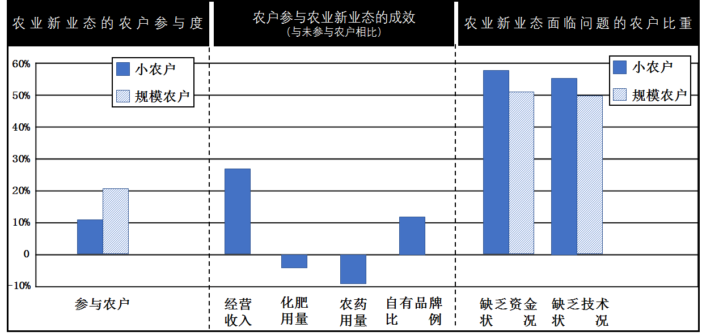

**机密★启用前**

**2021年河北省普通高中学业水平选择性考试**

**思想政治**

**注意事项：**

**1.答卷前，考生务必将自己的姓名、考生号、考场号、座位号填写在答题卡上。**

**2.回答选择题时，选出每小题答案后，用铅笔把答题卡上对应题目的答案标号涂黑，如需改动，用橡皮擦干净后，再选涂其他答案标号。回答非选择题时，将答案写在答题卡上。写在本试卷上无效。**

**3.考试结束后，将本试卷和答题卡一并交回。**

**一、单项选择题：本题共15小题，每小题3分，共45分。在每小题给出的四个选项中，只有一项是符合题目要求的。**

1\. 哈密位于新疆东部，地跨天山，东挽内地，数条铁路和高速公路交会于此，多条航线联结北京、上海等城市和新疆腹地。近年来，为将区位优势转化为经济优势，从“经济通道”迈向“通道经济”，哈密正在加快建设陆港型物流枢纽。哈密发展现代物流业有利于（ ）

①制造业通过缩短流通时间提高单位商品的价值量，促进产业升级

②发挥流通对经济发展的决定性作用，畅通国内大循环

③在更大范围把生产和消费联系起来，推动分工深化

④吸引生产要素和市场主体的集聚，扩大经济规模

A. ①② B. ①③ C. ②④ D. ③④

【答案】D

【解析】

【详解】①：单位商品价值量由生产该商品的社会必要劳动时间决定，而不是商品流通时间，①说法错误。

②：社会再生产四环节包括生产、分配、交换和消费，其中生产起决定性作用，流通是指分配和交换，不起决定性作用，②说法错误。

③：题干中强调加快建设陆港型物流枢纽，有利于把生产与消费联系起来，推动分工深入发展，③符合题意。

④：题干中哈密的区位优势的以发挥，转化为经济优势，表明有利于吸引生产要素和市场主体的聚集，扩大生产，④符合题意。

故本题选D。

2\. 某企业产品的销售收入（*R*）与销量（*Q*）的关系如下图所示。不考虑其他因素，该企业产品的销量与价格呈反方向变动，如果企业要增加销售收入，应采取的策略是（ ）

①当0\<*Q*\<*Q*1时，适当提高价格

②当0\<*Q*\<*Q*1时，适当降低价格

③当*Q*1\<*Q*\<*Q*2时，适当提高价格

④当*Q*1\<*Q*\<*Q*2时，适当降低价格

A. ①③ B. ①④ C. ②③ D. ②④

【答案】C

【解析】

【详解】①②：由图表可知，在0到Q1之间，销售收入和销量呈正方向变动。而不考虑其他因素，该企业产品的销量与价格呈反方向变动。由此可知在0到Q1之间，销售收入和价格呈反方向变动，当企业要增加销售收入时，此时应降低价格。故②入选，①排除。

③④：由图表可知，在Q1到Q2之间，销售收入和销量呈反方向变动。而不考虑其他因素，该企业产品的销量与价格呈反方向变动。由此可知在Q1到Q2之间，销售收入和价格呈正方向变动，当企业要增加销售收入时，此时应提高价格。故③入选，④排除。

故本题选C

3\. 强化监管并有效应对保险业风险是防范化解重大金融风险的重要组成部分。保险具有风险防范的功能，但受各种因素影响，保险公司自身也面临着风险。某市一保险公司提供的服务对当地金融部门、实体经济运作至关重要，且占有很高的市场份额并少有替代品。若因某种原因，该公司风险爆发，那么可能的风险传导或风险化解路径是（ ）

①保险公司关键功能弱化→中断对实体经济保险服务→投保企业管理水平下降

②保险公司经营陷入困境→直接关联的金融机构风险暴露→金融市场异常波动

③保险公司依法破产→破产结算并优先保护投资者利益→防范化解社会风险

④政府与相关优势企业发挥作用→促进保险公司兼并重组→化解金融市场风险

A. ①③ B. ①④ C. ②③ D. ②④

【答案】D

【解析】

【详解】①：中断对实体经济的保险服务会影响企业的风险防范能力，但不会直接影响其管理水平。故①传导错误。

②：保险公司风险爆发会导致其经营陷入困境，直接关联的金融机构也爆发风险，从而引起金融市场波动。故②传导正确。

③：保险公司风险爆发后可依法申请破产，破产结算时，有一定的顺序，投资者作为股东并不是优先保护。故③传导错误。

④：政府和相关优势企业促进保险公司兼并重组有利于稳定金融市场，促进金融市场风险的化解，故④传导正确。

故本题选D。

4\. 我国在坚持高质量引进来的同时，鼓励高水平走出去，扩大对外直接投资。近年来，我国涌现出一批重要的海外并购项目，如河钢集团成功收购塞尔维亚斯梅代雷沃钢厂，使百年老厂重焕生机。目前我国已成为双向投资大国，对外直接投资多年居全球前三名，吸引外资2020年居全球首位。我国双向投资快速发展的原因包括（ ）

①实现引进外资与对外投资平衡的目标要求

②经济全球化的深入发展与跨国公司生产经营的全球布局

③我国国际产能合作的大力推进与近年来国际经济安全性的不断提高

④发挥我国大市场优势与积极参与多双边区域投资贸易合作机制

A. ①② B. ①③ C. ②④ D. ③④

【答案】C

【解析】

【详解】①：实现“吸引外资与对外投资平衡”是我国双向投资快速发展可能达到的结果，而不是原因。①排除。

②：根据材料：我国涌现出一批重要的海外并购项目，这说明我国我国双向投资快速发展是经济全球化的深入发展与跨国公司生产经营的全球布局，②正确。

③：该选项中“近年来国际经济安全性不断提高”与实际情况不符，③排除。

④：目前我国已成为双向投资大国，对外直接投资多年居全球前三名，吸引外资2020年居全球首位，这说明我国我国双向投资快速发展是发挥我国大市场优势与积极参与多边区域投资贸易合作机制，④正确。

故本题选C。

5\. 重庆九龙坡区的杨永根，30余年牵头调解矛盾纠纷近2500件次，群众亲切地称呼他“老杨”。在老杨带动下，越来越多的党员干部、居民、社工、社会组织等志愿参与社区建设。“老杨”变成“一群杨”，矛盾纠纷在基层得到及时化解和妥善解决，居民的安全感和满意度明显提升。多元力量及志愿参与社区建设（ ）

①体现了公民奉献意识和互助意识的不断增强

②彰显了我国基层群众自治制度的显著优势

③提升了群众参与民主管理和民主监督的能力

④有助于推动共建共治共享的基层社会治理格局构建

A. ①② B. ①④ C. ②③ D. ③④

【答案】B

【解析】

【分析】

【详解】①④：在老杨带动下，越来越多的党员干部、居民、社工、社会组织等志愿参与社区建设，“老杨”变成“一群杨”，矛盾纠纷在基层得到及时化解和妥善解决，居民的安全感和满意度明显提升，这说明多元力量志愿参与社区建设体现了公民奉献意识和互助意识的不断增强，有助于推动共建共治共享的基层社会治理格局构建，①④正确。

②：材料不涉及我国基层群众自治制度，②排除。

③：材料不涉及民主监督，③排除。

故本题选B。

【点睛】

6\. “不为不办找理由，只为办好想办法。”2021年，河北某市市民服务中心新设“办不成事”反映窗口。针对群众反映的“应办未办”事项，限定5个工作日内解决；对于“完全不能办理”的事项，限定3个工作日内回复并说明不能办理的原因。该市政府此举（ ）

①坚持了人民利益至上的价值理念

②提升了公共事业管理水平

③深化机构改革，提升了行政服务效率

④创新工作方法，拓宽了为民服务渠道

A. ①② B. ①④ C. ②③ D. ③④

【答案】B

【解析】

【详解】②：该举措提升了市民服务中心的服务水平，而不是公共事业管理水平，②排除。

③：该市民服务中心新设“办不成事”反映窗口并不是深化机构改革的表现，③不符合题意。

①④：“不为不办找理由，只为办好想办法”，为此，该市市民服务中心新设“办不成事”反映窗口，以解决群众反映的“应班未办”事项等，这说明该市政府坚持了人民利益至上理念，创新了工作方法，拓宽了为民服务的渠道，想方设法为人民办实事办好事，①④符合题意。

故本题选B。

7\. 走访提案承办单位，是全国政协在重新修订重点提案遴选与督办办法后新增的一种重点提案督办方式。2020年11月27日，全国政协委员高杰就其提交的有关我国优秀文化遗产保护的提案，到国家文物局走访督办，通过与国家文物局有关领导面对面沟通、深度协商，达成一致意见。该督办方式有利于（ ）

①进一步推动提案办理工作提质增效

②通过强化政协委员的质询权，促进提案落实

③更好发挥提案在建言资政和凝聚共识方面的作用

④丰富协商民主形式，开拓多党合作的新路径

A. ①③ B. ①④ C. ②③ D. ②④

【答案】A

【解析】

【详解】①③：对重点提案承办单位进行走访督办，能推动提案办理工作提质增效，更好发挥提案建议资政凝聚共识的作用，①③符合题意。

②：质询权是人大代表的职权，②错误。

④：该督办方式从协商民主角度来看还是属于政协协商，更未体现多党合作的内容，④不符合题意。

故本题选A。

8\. 国家主席习近平多次强调：“鞋子合不合脚，自己穿了才知道。”“一个国家的发展道路合不合适，只有这个国家的人民才最有发言权。”2021年3月23日，中俄两国外长在广西桂林发表的联合声明中重申：“民主模式不存在统一的标准。应尊重主权国家自主选择发展道路的正当权利。以‘推进民主’，为借口干涉主权国家内政不可接受。”与上述主张相符的是（ ）

①发展道路的差异是国际交流合作的障碍

②维护国际公平正义，反对霸权主义和强权政治

③中国不“输入”外国模式，也不“输出”中国模式

④维护世界和平稳定是世界各国的共同期待

A. ①② B. ①④ C. ②③ D. ③④

【答案】C

【解析】

【详解】①：每个国家都有权自主选择发展道路，发展道路的差异不应该也不会成为国际合作交流的障碍，①错误。

④：以“推进民主”为借口干涉主权国家内政表明维护世界和平稳定不是世界各国的共同期待，④错误。

②③：中国主张尊重主权国家自主选择发展道路的正当权利，反对以“推进民主”为借口干涉主权国家内政表明中国坚持独立自主，维护国际公平正义，反对霸权主义和强权政治，②③符合题意。

故本题选C。

9\. 杆秤曾是中国的主要度量工具之一。秤杆上标志起算点（重量为零）的星叫做定盘星，是确定其他刻度的基础。定准定盘星是做好杆秤的关键，相当于“扣好人生第一粒扣子”。秤杆上的绳纽叫做秤亳。之所以称其为秤亳，是提醒人们：在交易时，要明察秋亳，不能粗心大意；要正心诚意，不能缺斤少两。下列选项与材料主旨一致的是（ ）

①杆秤设计的目的是彰显诚信的价值观念

②公平公正是为人处世的重要原则

③日用器物蕴含着一定的文化观念

④传统文化是物质资料生产方式的反映

A. ①③ B. ①④ C. ②③ D. ②④

【答案】C

【解析】

详解】①：杆秤设计的目的是称重，这其中体现了诚信的价值观念，①错误。

④：材料未体现传统文化对物质资料生产方式的反映，④不符合题意。

②③：杆秤的设计理念体现了公平公平的为人处世原则，也表明日用器物蕴含着文化观念，②③符合题意。

故本题选C。

10\. 2021年3月，被誉为“中国画熊猫第一人”的刘中，与关爱熊猫、热爱美术、热心公益的各界人士共同发起设立了“熊猫艺术发展基金”。该基金的用途包括：资助青少年在生态环保美术领域的写生、创作及交流，提高学生美术创作水平；组织熊猫文化国际传播与交流，讲好中国故事、传播好中国声音……该基金支持上述活动（ ）

①有利于丰富青少年的精神世界

②实现了“五育并举”的教育目标

③有助于增强中国国家形象美誉度

④有益于丰富审美教育的形式

A. ①③ B. ①④ C. ②③ D. ②④

【答案】A

【解析】

【详解】①：基金资助青少年在生态环保美术领域的写生、创作及交流，能丰富青少年的精神世界，①正确。

②：实现了“五育并举”的教育目标夸大了该基金活动的作用，②不符合题意。

③：基金组织熊猫文化国际传播与交流，讲好中国故事、传播好中国声音能增强中国国家形象美誉度，③正确。

④：基金资助青少年在生态环保美术领域的写生、创作及交流属于对审美教育既有形式的物质支持，④不符合题意。

故本题选A。

11\. 博览典籍故事，读懂典籍思想。中央广播电视总台热播的《典籍里的中国》，曾演绎了一场《天工开物》作者宋应星和“杂交水稻之父”袁隆平两位科学家跨越300余年、共筑“禾下乘凉梦”的奇妙故事。这个故事打动了观众，也让《天工开物》中“此书于功名进取毫不相关也”一语更加深入人心。可见（ ）

①科学家不计功名的奉献精神灿耀古今

②传承发展优秀传统文化需要不断创新形式

③文化发展是扬弃传统文化的过程

④不断推陈出新才能做出正确的文化选择

A. ①② B. ①④ C. ②③ D. ③④

【答案】A

【解析】

【分析】

【详解】①②：题干强调通过《典籍里的中国》演绎传统文化与当代文化之间的共鸣，说明科学家不计功名的奉献精神灿耀古今，同时演绎奇妙故事打动观众，说明传承发展优秀传统文化需要不断创新形式，①②符合题意。

③：文化发展的实质是文化创新，文化创新要继承传统，推陈出新，对待传统文化要批判继承，也就是扬弃传统文化，但本题题干强调传统文化与当代文化之间的共鸣，并没有涉及去其糟粕，③说法错误。

④：推陈出新与作出正确的文化选择并没有必然因果关系，本题题干强调传统文化与当代文化之间的共鸣，并没有涉及推陈出新，④说法错误。

故本题选A。

12\. 2021年4月29日11时23分，中国空间站天和核心舱发射升空，准确进入预定轨道。天和核心舱发射成功，标志着我国空间站建造进入全面实施阶段，为后续任务展开奠定了坚实基础。中国空间站由天和核心船、问天实验舱、梦天实验舱三个舱段构成。根据任务安排，空间站计划于2022年完成在轨建造，具备长期开展近地空间有人参与科学实验、技术实验和综合开发利用太空资源能力，转入应用与发展阶段。由此可见（ ）

A. 实践的发展不是一帆风顺的

B. 人的实践活动是历史的发展着的

C. 认识工具决定人的认识水平

D. 科学实验是一种探索世界规律的思维活动

【答案】B

【解析】

【详解】B：天和核心舱发射成功，标志着我国空间站建造进入全面实施阶段，为后续任务展开奠定了坚实基础。中国空间站由天和核心舱、问天实验舱、梦天实验舱三个舱段构成。根据任务安排，空间站计划于2022年完成在轨建造，转入应用与发展阶段，由此可见，人的实践活动是历史的发展着的，故B符合题意。

A：材料中强调的是我国空间站建造的发展，无涉及建造过程经历的曲折历程，故A不符合题意。

C：日益完备的认识工具延伸了人的认识器官，促进人类认识的发展，但不能决定人的认识水平，实践决定认识。故C错误。

D：科学实验是一种探索世界规律的实践活动，而非思维活动，故D错误。

故本题选B。

13\. 美学家朱光港说过，我们所居世界是最完美的，就因为它是最不完美的。假如世界是完美的，件件事都尽善尽美了，自然没有希望发生，更没有努力奋斗的必要。人生最可乐的就是活动所生的感觉，就是奋斗成功而得的快慰。从哲学的角度看，这段话体现了（ ）

①事物的性质由矛盾的主要方面决定

②矛盾推动事物的运动、变化和发展

③矛盾的同一性寓于斗争性之中

④没有矛盾就没有世界

A. ①③ B. ①④ C. ②③ D. ②④

【答案】D

【解析】

【详解】①：事物的性质由主要矛盾的主要方面决定，①错误。

②：事情充斥矛盾，才会有希望发生，才会有努力奋斗的必要，人生才会在奋斗中成功，这说明矛盾推动事物的运动、变化和发展，②正确切题。

③：矛盾的斗争性寓于同一性之中，并为同一性所制约，③错误。

④：“世界是最完美的，就因为它是最不完美的”意味着没有矛盾就没有世界，④正确切题。

故本题选D。

14\. 《史记•滑稽列传》记载，战国时楚军攻打齐国，齐威王派淳于髡（kūn）前往赵国搬救兵，解了被围之困。齐威王大喜之下请淳于髡喝酒。淳于髡说：“酒极则乱，乐极则悲；万事尽然。”齐威王接受了劝诫，决意改掉彻夜饮酒的习惯。下列选项与淳于髡的话蕴含哲理一致的是（ ）

①水满则溢，月盈则亏②相生相克，相辅相成

③绳锯木断，水滴石穿④万物有度，过犹不及

A. ①② B. ①④ C. ②③ D. ③④

【答案】B

【解析】

【详解】题干中淳于髡的话意思是酒喝多了就乱了心性，乐得过了头就生悲，所有的事情都是这样，蕴含的哲理是矛盾双方在一定条件下相互转化。

①：“水满则溢，月盈则亏”，意思是水满了就会向外溢，月圆了就会变缺，蕴含的哲理是矛盾双方在一定条件下相互转化，①符合题意。

②：“相生相克，相辅相成”，意思是双方相互包含又相互克制，蕴含的是矛盾双方既对立又统一，②不符合题意。

③：“绳锯木断，水滴石穿”，意思用绳子不停锯，木头也能被锯断；水不停的滴，石头也能被滴穿，蕴含的是量变是质变的必要准备，质变是量变的必然结果，③不符合题意。

④：“万物有度，过犹不及”，意思是事情做得过头，就跟做得不够一样，都是不合适的，蕴含的哲理是矛盾双方在一定条件下相互转化，④符合题意。

故本题选B。

15\. 马克思指出：“我们判断一个人不能以他对自己的看法为根据，同样，我们判断这样一个变革时代也不能以它的意识为根据；相反，这个意识必须从物质生活的矛盾中，从社会生产力和生产关系之间的现存冲突中去解释。”这体现了（ ）

①社会意识对社会存在具有依赖性

②思想变革是时代变革的先导

③生产方式对整个社会生活具有决定作用

④社会历史是由有意识的人的活动构成的

A. ①② B. ①③ C. ②④ D. ③④

【答案】B

【解析】

【详解】①：马克思指出要从物质生活的矛盾中去解释意识，而不是以意识为依据，表明社会意识对社会存在具有依赖性，①符合题意。

②：思想变革是时代变革的先导，与马克思强调的“判断一个变革时代不能以它的意识为依据”相悖，②不符合题意。

③：生产方式包括生产力与生产关系，马克思指出要从生产力与生产关系之间的冲突中去解释意识，而不是以意识为依据去判断一个变革时代，表明生产方式对整个社会生活具有决定作用，③符合题意。

④：材料强调社会意识离不开社会存在以及生产方式对社会生活的作用，不涉及社会历史的构成，④排除。

故本题选B。

**二、非选择题：本题共5小题，共55分。**

16\. 阅读材料，完成下列要求。

《中华人民共和国国民经济和社会发展第十四个五年规划和2035年远景目标纲要》提出，要丰富乡村经济业态，发展各具特色的现代乡村富民产业。近年来，各地乡村掀起创新创业热潮，设施农业、农事体验、电商直播等农业新业态蓬勃兴起。2019年，我国休闲农业接待游客32亿人次，营业收入是过8500亿元；农产品网络销售额达4000亿元。

2019年10月至2020年1月，某专业研究机构对3937家农业经营主体的新业态发展情况进行了实地调查。部分调查结果如下图所示：

（1）解读上图所包含的经济信息。

（2）产业兴旺是全面推进乡村振兴的重点。联系材料并运用经济生活知识，谈谈如何进一步推进农业新业态的发展。

【答案】（1）参与新业态农户比例上升，规模农户增长比例高出小农户增长近一倍；参与农业新业态农户的经营收入和自有品牌比例均有较大提高，化肥和农药用量均有所下降。这表明农业新业态发展有利于增加农民收入，提高农产品质量安全，促进农业高质量发展。但农业新业态发展仍然面临着农业经营主体参与度低下、资金短缺、技术不足等突出问题。\
（2）①加大农业科学技术的推广和培训服务，深化资金借贷服务、农产品销售服务等社会化服务供给结构，为农业新业态发展提供资金和技术支持，进一步拓展农产品销售渠道。②立足市场需求，鼓励引导农业新业态经营主体进行品质认证和品牌发展，保障农产品安全，增加农产品供给质量。③鼓励乡村创新创业，突出新型农业经营主体对小农户的带动作用，鼓励各经营主体联合发展农业新业态。

【解析】

【分析】此题以我国农业新业态的发展成就和存在的问题为背景材料，考查考生运用经济生活知识分析理解现实生活问题的能力，考查考生获取和解读信息、调动和运用知识、描述和阐释事物能力。培养学生政治认同、公共参与、科学精神等核心素养。

【详解】本题共设置两个问题。

第（1）问要求“解读上图所包含的经济信息。”属于概括类试题。要求考生根据图表，将图表数据进行解读并归纳出数据背后的经济本质。根据图表数据，考生可概括出我国参与新业态农户比例有所上升，参与农业新业态农户的经营收入和自有品牌比例均有较大提高，化肥和农药用量均有所下降，农业新业态发展有利于增加农民收入，提高农产品质量安全，促进农业高质量发展。但同时也存在农业经营主体参与度低下、资金短缺、技术不足等突出问题。

第（2）问要求“产业兴旺是全面推进乡村振兴的里点。联系材料并运用经济生活知识，谈谈如何进一步推进农业新业态的发展。”属措施类试题。考生在解答此题时，首先要明确此题的知识范围为经济生活知识，没有明确具体的知识点，需要考生根据材料进行提炼，属宏观考查。然后结合材料中我国农业新业态发展的成功经验和存在的问题有针对性的进行分析即可。

根据材料信息“近年来，各地乡村掀起创新创业热潮，设施农业、农事体验、电商直播等农业新业态蓬勃兴起”以及农业经营主体参与度低下的问题，考生可从鼓励乡村创新创业，突出新型农业经营主体对小农户的带动作用，鼓励各经营主体联合发展农业新业态进行分析。

根据材料信息“设施农业、农事体验、电商直播等农业新业态蓬勃兴起……农产品网络销售额达4000亿元”及资金短缺、技术不足的问题，考生可从加大农业科学技术的推广和培训服务，深化资金借贷服务、农产品销售服务等社会化服务供给结构，为农业新业态发展提供资金和技术支持，进一步拓展农产品销售渠道角度进行分析。

根据材料图表信息“自有品牌比例上升、化肥用量和农药用量下降”，考生可从立足市场需求，鼓励引导农业新业态经营主体进行品质认证和品牌发展，保障农产品安全，增加农产品有效供给角度进行具体分析即可。

【点睛】“对策或措施（怎么办）类”主观题解答策略

1.题型介绍：

此类题一般先展示某事、某地存在一系列问题，然后问如何解决（如措施、对策、建议、办法等）；或者是展示某地、某人成功的事例，问取得成功的经验或因素以及给我们什么启示等。设问灵活多样，既可以让学生直接提出有关解决问题的措施或对策，也可以让学生给有关主体（如党、国家、企业、消费者等）针对某个需要解决的问题提出建议。知识范围广，涉及经济、政治、文化、哲学等多模块。

2.解题规律:

有四个思路值得借鉴：一是联系课本寻答案。在解答“措施”类题目时首先要做的便是联系课本，看看课本上有没有给我们提供解决这一问题的措施和方法。二是联系材料寻答案。在答题过程中要看看材料给解答这个问题提供了哪些有用的信息，如材料中有没有反映出什么问题，若有，就对症下药提出措施；再如材料中有没有成功的做法。若有，也可借鉴，提出措施，等等。三是落实主体寻答案。在答题过程中可考虑不同的主体在解决某一问题中负有怎样的责任，该做出怎样的努力。四是考虑直接和间接、具体和根本的措施。当然，实际运用中往往需要以上思路的综合运用。

17\. 阅读材料，完成下列要求。

党的十八大以来，以习近平同志为核心的党中央把科技创新摆在国家发展全局的核心位置，深入实施创新驱动发展战略，推动国家创新体系整体效能显著提升，为贯彻党中央决策部署，全国人大常委会在充分征求公众意见建议的基础上，修改了专利法等法律，制定了科学技术进步法修改计划。国务院及其有关部门不断改革重大科技项目立项和组织实施方式，改革科研绩效评价机制，加强基础设施建设，推进产学研用一体化。近年来，我国创新型国家建设成果丰硕，在载人航天、探月工程、深海工程、超级计算、量子信息等领域取得一批重大科技成果。

结合材料，运用政治生活知识，说明我国国家治理体系在取得重大科技成果过程中是如何发挥作用的。

【答案】①党是最高政治领导力量，党的领导是中国特色社会主义最本质的特征，是中国特色社会主义制度的最大优势，要坚持和加强党的全面领导，发挥党总揽全局、协调各方的领导核心作用。以习近平同志为核心的党中央把科技创新摆在国家发展全局的核心位置，深入实施创新驱动发展战略，推动国家创新体系整体效能显著提升，为取得重大科技成果提供坚强的政治支持。

②全国人大是我国最高国家权力机关。全国人大常委会是全国人大的常设机关，是最高国家权力机关的组成部分，在全国人大闭会期间代行其部分职权。全国人大常委会在党的领导下，依法行使立法权、决定权，修改了专利法等法律，制定了科学技术进步法修改计划，为取得重大科技成果提供法律保障和政策支持；坚持民主集中制原则，充分征求公众意见建议，做到科学决策、民主决策，为取得重大科技成果集中民智，提供强大智力支持。

③我国的政府是国家权力机关的执行机关，是国家行政机关，是人民的政府；政府的宗旨是为人民服务；政府工作的原则是对人民负责。政府履行组织社会主义经济建设的职能、组织社会主义文化建设的职能，深化机构改革和行政体制改革，转变政府职能。国务院及其有关部门不断改革重大科技项目立项和组织实施方式，改革科研绩效评价机制，加强基础设施建设，推进产学研用一体化，为取得重大科技成果的相关政策落地、落实提供坚实的基础。

【解析】

【分析】本题以我国国家治理体系推动取得重大科技成果为背景话题，从政治生活的角度，考查学生调动和运用基础知识分析问题和解决问题的能力。解答本题，审设问，题目类型措施类，知识限定政治生活，问题指向说明我国国家治理体系在取得重大科技成果过程中是如何发挥作用的。

【详解】材料中强调以习近平同志为核心党中央把科技创新摆在国家发展全局的核心位置，深入实施创新驱动发展战略，推动国家创新体系整体效能显著提升，说明坚持和加强党的全面领导，发挥党总揽全局、协调各方的领导核心作用；材料中强调全国人大常委会在充分征求公众意见建议的基础上，修改了专利法等法律，制定了科学技术进步法修改计划，说明全国人大常委会在党的领导下，依法行使立法权、决定权，坚持民主集中制原则；材料中强调国务院及其有关部门不断改革重大科技项目立项和组织实施方式，改革科研绩效评价机制，加强基础设施建设，推进产学研用一体化，说明政府履行组织社会主义经济建设的职能、组织社会主义文化建设的职能，深化机构改革和行政体制改革，转变政府职能。

【点睛】全国人大常委会怎样做某事★地位+职权+民主集中制+三统一

①地位：全国人大是我国最高国家权力机关。全国人大常委会是全国人大的常设机关，是最高国家权力机关的组成部分，在全国人大闭会期间代行其部分职权。

②职权：立法权、决定权、任免权、监督权（4职权据材料分开作答）

③组织和活动原则：坚持民主集中制原则，处理好3组关系（据材料用）

④坚持党的领导、人民当家作主、依法治国的有机统一

（注：以“人大及人大常委会”为主体回答如何做某事时，常答要点同上5点，但要注意①地位的准确表述，只有全国人大才用“最高” ）

18\. 阅读材料，完成下列要求。

材料一 “太阳最早照耀的地方，是东方的建塘；人间最殊胜的地方，是奶子河畔的香格里拉。”香格里拉，雪山环抱、风清月朗、满缀黄花，承载着人们对远离现代文明洪流冲刷的世外桃源的深深期盼。然而，川流不息地涌向香格里拉的人潮车流，使得人与自然的和谐关系面临着被破坏的威胁。

材料二 被喻为“死亡之海”的库布其沙漠已成为全球荒漠化防治的典范；一度严重沙化的科尔沁草原重披绿装；曾经的“不毛之地”毛乌素沙地，筑起了祖国北疆的“绿色长城”……在几代人的努力下，中国实现了从“沙进人退”到“绿进沙退”的历史性转变，创造了一个个生态奇迹！

结合材料，运用联系客观性的知识，阐明在全面建设社会主义现代化国家新征程中如何正确认识和处理人与自然的关系。

【答案】①联系具有客观性，要从事物固有的联系中把握事物，切忌主观随意性。全面建设社会主义现代化国家新征程中，必须正确处理人与自然关系，贯彻新发展理念。②人对事物的联系并不是无能为力，人们可以根据事物的固有的联系，改变事物的状态，调整原有的联系，建立新的联系。人们治沙利用客观联系，实现了从“沙进人退”到“绿进沙退”的历史性转变，在全面建设社会主义现代化国家新征程中，创造了一个个生态奇迹！

【解析】

【分析】本题以生态环境为话题设置试题情境，以中国环境治理的成功典范为材料，从《生活与哲学》的知识角度设置问题，考查考生对基础知识的掌握程度，考查考生阅读材料分析材料、描述阐释事物、运用知识解决问题的能力。

【详解】本题要求考生结合材料，运用联系客观性的知识，阐明在全面建设社会主义现代化国家新征程中如何正确认识和处理人与自然的关系。知识限定比较具体，属于微观考查。考生可先回顾联系客观性的相关知识，然后运用这一知识要点结合材料分析，形成答案要点。①知识角度：联想主干知识：联系具有客观性，要从事物固有的联系中把握事物，切忌主观随意性。结合试题材料分析：全面建设社会主义现代化国家新征程中，必须正确处理人与自然关系。②知识角度：联想主干知识：人对事物的联系并不是无能为力，人们可以根据事物的固有的联系，改变事物的状态，调整原有的联系，建立新的联系。结合试题材料分析：人们治沙利用客观联系，实现了从“沙进人退”到“绿进沙退”的历史性转变，在全面建设社会主义现代化国家新征程中，创造了一个个生态奇迹！

【点睛】回答分析说明类问题，主要按以下思路进行：第一步，分析材料，把握主题，联想相关知识（本题知识角度已经给出）。第二步，围绕主题，回归教材，确认知识（细化知识要点并确认）。以试题反映出的问题为中心与教材联系，找出材料与教材的“结合点”。第三步，紧扣题意，合理作答。通常，我们只要将教材中的基本原理与材料一一对应，用理论分析材料即可。

19\. 阅读材料，完成下列要求

“你是中国人吗？你爱中国吗？你愿意中国好吗？”

1935年9月，在南开大学开学典礼上，面对内忧外患的局势和积贫积弱的国家，校长张伯苓提出振聋发聩的“爱国三问”，点燃了师生们的爱国斗志，在无数热血青年心中种下了自强图存的新希望。2019年1月，习近平总书记在南开大学考察时讲到，“爱国三问”既是历史之问，也是时代之问、未来之问，2021年4月，习近平总书记在清华大学考察时强调，当代中国青年要与新时代同向同行，爱国爱民，不断增强做中国人的志气、骨气、底气。

运用文化生活知识，说明“爱国三问”既是历史之问，也是时代之问、未来之问。

【答案】爱国是中华民族的优良传统，是不同时代的中国人都义不容辞的责任。以爱国主义为核心的民族精神是推动中华民族走向繁荣、强大的精神动力。新时代，作为青年学生，要弘扬以爱国主义为核心的民族精神，要加强思想道德建设，增强维护国家利益和人民利益的责任感和使命感，坚定文化自信和爱国之志，自觉成为担当民族复兴大任的时代新人。

【解析】

【分析】本题要求运用文化生活知识，说明“爱国三问”既是历史之问，也是时代之问、未来之问，注重考查学生获取和解读信息，调动和运用知识，描述和阐释事物，论证和探究问题的能力，难度较难。

【详解】本题的知识限定是文化生活知识，属于说明类试题，需要结合材料进行说明。

首先，要说明“爱国三问”是什么？结合材料：1935年9月，在南开大学开学典礼上，面对内忧外患和积贫积弱的国家，校长张伯苓提出振聋发聩的“爱国三问”，点燃了师生们的爱国斗志，在无数的热血青年中种下自强图存的新希望。可回答：爱国是中华民族的优良传统，是不同时代的中国人都义不容辞的责任。

其次，要说明为什么“爱国三问”既是历史之问，也是时代之问、未来之问。可结合基础知识爱国主义和民族精神的重要性来回答。即以爱国主义为核心的民族精神是推动中华民族走向繁荣、强大的精神动力。

最后，要说明怎样实现“爱国三问”。结合材料：2021年习近平总书记在清华大学考察时强调，当代青年要与新时代同向同行，爱国爱民，不断增强中国人的志气、骨气、底气。可知：新时代，作为青年学生，要弘扬以爱国主义为核心的民族精神，要加强思想道德建设，增强维护国家利益和人民利益的责任感和使命感，坚定文化自信和爱国之志，自觉成为担当民族复兴大任的时代新人。

【点睛】分析说明类问题的一般思路，主要按以下思路进行：

一、分析材料，把握主题，联想相关知识；

二、围绕主题回归教材确认认知识。以试题反映出的问题为中心与教材联系，找出课本知识与材料的结合点；

三、紧扣题意合理做答，通常我们只要将教材中的基本原理与材料一一对应，理论分析材料即可。

20\. 阅读材料，完成下列要求。

党的十九届五中全会明确提出，要推动理想信念教育常态化制度化，加强党史、新中国史、改革开放史、社会主义发展史教育。习近平总书记在党史学习教育动员大会上强调：“学‘四史’要以学习党的历史为重点。”“要发扬马克思主义优良学风，明确学习要求、学习任务，推进内容、形式、方法的创新，不断增强针对性和实效性。”

A中学高一（3）班将于“七一”前夕举办一次以“学‘四史’增强‘四个自信’”为主题的学习教育活动，请你帮助他们做一个活动计划。

要求：①结合学科知识，说明开展此次活动的目的和意义；

②说明活动的具体内容并设计有特色的活动形式；

③150字左右；

④不得透露任何个人信息。

【答案】示例：目的和意义：通过此次活动，能够让学生深刻了解党的历史和新中国史、改革开放史和社会主义发展史，引导学生树立正确的历史观、民族观、国家观、文化观，培养担当民族复兴大任的时代新人。通过此次活动，有助于学生坚定道路自信、文化自信、制度自信和理论自信，坚定中国特色社会主义共同理想和共产主义远大理想，坚持学而信、学而思、学而行，把学习成果转化为坚定的意志和自觉的行动，在实现中国梦的生动实践中放飞青春梦想，在为人民利益的不懈奋斗中书写人生华章。\
活动的具体内容和活动形式：观看有关“四史”内容的视频，分小组进行针对所观视频进行讨论，然后每个小组合作共同撰写一篇心得体会。

【解析】

【分析】本题考查学生对开展理想信念的要求、实现人生价值等相关知识的理解和运用，考查学生调动和运用知识、描述和阐释事物、论证和探究问题的能力。

【详解】本题具有开放性，解答本题时，首先要注意本次学习教育活动的主题，然后，根据要求“结合学科知识，说明开展此次活动的目的和意义；说明活动的具体内容并设计有特色的活动形式”，可结合文化生活中“开展理想信念的要求”、哲学生活中“实现人生价值”等知识，从不同的角度回答即可。最后，注意书写但时字数是150字左右，而且不得透露任何个人信息。

【点睛】提高主观题答题能力“四要素”：第一要素:审清主观题的设问,明确试题设问的限制性和规定性,确定答题范围,这是答题的关键。即通过阅读试题的背景材料及设问,确定命题者的考查意图,确保答题的大方向不错。第二要素:学会分析材料、围绕材料提示搜索相关知识点是答题的依据。分析材料,弄清材料的层次,就可以利用材料的暗示,搜索相关知识点组织答案。第三要素:熟练掌握和运用所学知识是解答主观题的基础。需要加强对知识点的归纳整理,使自己所掌握的知识点系统化、条理化,确保自己能够熟练运用相关知识点。第四要素:规范答题。要正确运用政治术语答题;注意多角度思考问题,确保答案的完整性。不要脱离材料、随意发挥、答非所问,防止出现理论和实际相脱离,即“两张皮”现象。
