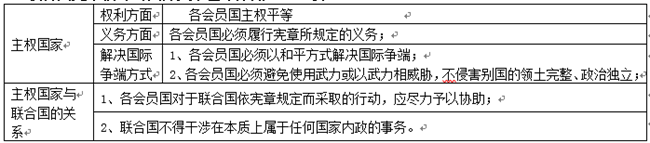

**绝密★启用前**

**2021年6月浙江省普通高校招生选考科目考试**

**思想政治试题**

**姓名：\_\_\_\_\_\_\_\_ 准考证号：\_\_\_\_\_\_\_\_**

**本试卷分选择题和非选择题两部分，共6页，满分100分，考试时间90分钟。**

**考生注意：**

**1.考生答题前，务必将自己的姓名、准考证号用黑色字迹的签字笔或钢笔填写在答题纸上。**

**2.选择题的答案须用2B铅笔将答题纸上对应题目的答案标号涂黑，如要改动，须将原填涂处用橡皮擦净。**

**3.非选择题的答案须用黑色字迹的签字笔或钢笔写在答题纸上相应区域内，作图时可先使用2B铅笔，确定后须用黑色字迹的签字笔或钢笔描黑，答案写在本试卷上无效。**

**一、判断题（本大题共10小题，每小题1分，共10分。判断下列说法是否正确，正确的请将答题纸相应题号后的正确涂黑，错误的请将答题纸相应题号后的错误涂黑）**

1\. 为别人生产的劳动产品是商品。（ ）

【答案】错误

【解析】

【详解】商品是用于交换的劳动产品。“为别人生产的劳动产品”不一定用于交换，故不一定是商品。

故本题说法错误。

2\. 经济过热时，实施紧缩性财政政策有助于抑制总需求、稳定物价。（ ）

【答案】正确

【解析】

【详解】经济过热时，社会总需求大于社会总供给，此时物价上涨，应实施紧缩性财政政策，减少财政支出、提高税率、增加税收等，这有利于抑制总需求，稳定物价。

故本题说法正确。

3\. 差额选举有助于选民了解候选人，有助于充分考虑当选者结构的合理性。（ ）

【答案】错误

【解析】

【详解】等额选举可以比较充分地考虑当选者结构的合理性，差额选举在候选人之间形成竞争，为选民提供了选择的余地。

故本题说法错误。

4\. 坚持中国共产党的领导是多党合作的根本保证。（ ）

【答案】正确

【解析】

【详解】多党合作的首要前提和根本保证是坚持中国共产党的领导。

故本题说法正确。

5\. 中国对某些西方国家的制裁进行反制，宣示了捍卫国家主权、安全和发展利益的决心。（ ）

【答案】正确

【解析】

【详解】维护我国的主权、安全和发展利益，就是维护我国和民族的最高利益，这是我国外交政策的首要目标。中国对某些西方国家的制裁进行反制，体现了捍卫国家主权、安全和发展利益的决心。

故本题说法正确。

6\. 用世界听得懂的语言讲述中国故事，能够增强中华文化的国际影响力。（ ）

【答案】正确

【解析】

【详解】用世界听得懂的语言讲述中国故事，可以推动中华文化走向世界，增强中华文化国际影响力。

故本题说法正确。

7\. 要坚决抵制、依法取缔含有宣扬暴饮暴食等内容的直播节目。（ ）

【答案】错误

【解析】

【详解】对于腐朽文化，要坚决抵制，依法取缔。宣扬暴饮暴食等内容的直播节目属于落后文化，不属于腐朽文化，因此不能坚决抵制、依法取缔。

故本题说法错误。

8\. 群众性的精神文明创建活动有利于加强思想道德建设。（ ）

【答案】正确

【解析】

【详解】深化群众性精神文明创建活动，形成社会风尚，引导人民群众积极投身于精神文明建设的伟大实践，有利于加强和改进思想政治工作，加强思想道德建设。

故本题说法正确。

9\. 唯物主义认为，物质是运动的物质，运动是物质的运动。（ ）

【答案】错误

【解析】

【详解】唯物主义认为：物质是世界本原，先有物质，后有意识，物质决定意识。 马克思主义哲学认为，物质是运动的物质，运动是物质的运动，但并不是所有的唯物主义都坚持该观点。

故本题说法错误。

10\. 巩固和拓展脱贫攻坚成果需要常抓不懈，这强调了抓住时机促成质变的重要性。（ ）

【答案】错误

【解析】

【详解】事物发展总是从量变开始，量变是质变的必要准备。这要求我们积极做好量的积累，为客观事物质变创造条件。题干中强调巩固和拓展脱贫攻坚成果需要常抓不懈，体现了要做好量的积累，而不是促成质变的重要性。

故本题说法错误。

**二、选择题I（本大题共22小题，每小题2分，共44分，每小题列出的四个备选项中只有一个是符合题目要求的，不选、多选、错选均不得分）**

11\. 下表系2019、2020年我国猪肉产量，生猪存栏数据

|       |        |        |         |        |
|:----- |:------:|:------:|:-------:|:------:|
|       | 猪肉产量   | 同比增长   | 年末生猪存栏  | 同比增长   |
| 2019年 | 4255万吨 | -21.3% | 31041万头 | -27.5% |
| 2020年 | 4113万吨 | -3.3%  | 40650万头 | 31.0%  |

注：“同比”是指与上一年同一时间相比。

资料来源：《中华人民共和国2019年国民经济和社会发展统计公报》《中华人民共和国2020年国民经济和社会发展统计公报》

不考虑其他因素，从上表可以推知( )

①2019年，猪肉价格有较大幅度提高

②2019年，牛肉需求量有所降低

③2020年，猪肉饲料生产厂家的利润略有下降

④2021年，猪肉价格有望下降

A. ①② B. ②③ C. ①④ D. ③④

【答案】C

【解析】

【详解】①：供求影响价格，当供给小于需求时，卖方在交易上处于有利地位，商品价格有上升趋势。由表格可知，2019年猪肉产量同比呈现负增长，产量大幅下跌，供给减少，猪肉价格可能会大幅上升。故①符合题意。

④：供求影响价格，当供给大于需求时，买方在交易上处于有利地位，商品价格有下降趋势。由表格可知，2020年末生猪存栏同比呈现正增长，产量将增加，供给将增加，因此2021年猪肉价格有望下降。故④符合题意。

②：由表格可知2019年猪肉价格会大幅上升，而猪肉和牛肉互为替代品，因此在不考虑其他因素的情况下，此时对牛肉的需求量会增加。故②说法错误。

③：2020年年末生猪存栏增加，这会增加对猪饲料的需求，进而促进猪饲料生产厂家扩大生产规模，获得更多的利润。故③说法错误。

故本题选C。

12\. 近年来，网络食品备受消费者青睐，但不少网红食品存在没有证照、生产环境不达标等问题，要让网红食品成为放心食品，需要( )

①引导消费者理性消费，避免盲从 ②提高对网络食品厂家征税的税率

③健全、落实食品生产的准入制度 ④完善相关法律法规，提高食品厂家的违法成本

A. ①② B. ②③ C. ②④ D. ③④

【答案】D

【解析】

【详解】①：“不少网红食品存在没有证照、生产环境不达标等问题”不是消费者引起，与消费者的消费行为无关，①排除。

②：税收具有固定性，税率不能轻易改变，况且“提高对网络食品厂家征税的税率”会导致厂家将多征税款转嫁给消费者，②排除。

③④：针对不少网红食品存在没有证照、生产环境不达标等问题，要让网红食品成为放心食品，需要健全、落实食品生产的准入制度，完善相关法律法规，提高食品厂家的违法成本，③④符合题意。

故本题选D。

13\. 新冠疫情暴发初期，医用口罩、防护服等防疫物资迅速成为紧缺资源，价格急剧飙升。后来越来越多的企业加入防疫物资生产大军，价格迅速回落。由此可见( )

①商品生产所耗费的社会必要劳动时间决定价格

②供求关系变化引起商品价格变化

③市场难以解决公共物品的供给问题

④企业会根据价格变化决定生产什么、生产多少

A. ①② B. ①③ C. ②④ D. ③④

【答案】C

【解析】

【详解】①：商品生产所耗费的社会必要劳动时间决定商品价值量，而价值决定价格，①错误。

②④：医用口罩，防护眼等防疫物资成为紧缺资源，价格急剧飙升，后越来越多的企业加入防疫物资生产大军，供给增加，价格迅速回落，这说明供求关系变化引起商品价格变化，也表明企业会根据价格变化决定生产什么、生产多少，②④符合题意。

③：医用口罩，防护眼等防疫物资并不是公共物品，况且材料反映的是供求与价格的关系，价格与企业生产经营的关系，未体现市场是否难以解决公共物品的供给问题，③排除。

故本题选C。

14\. 2021年3月18日，人力资源和社会保障局等部门向社会正式发布了集成电路工程技术人员、企业合规师、二手车经纪人等18个新职业信息。目前这些新职业整体上处于人才供不应求的状态。下列有关新职业的说法中，正确的有( )

①新职业的出现，是劳动分工进一步发展的产物

②新职业的出现，是就业形式多样化的结果

③向往新职业的劳动者应主动提高相关技能

④从事新职业的劳动者能获得更高报酬

A. ①③ B. ②③ C. ①④ D. ②④

【答案】A

【解析】

【详解】①：随着经济社会的发展，社会分工越来越精细化，出现一批新职业，新职业的出现，是劳动分工进一步发展的产物，①正确切题。

②：新职业的出现会加速就业形式多性化，②因果倒置，排除。

③：新职业整体上处于人才供不应求的状态，会减轻就业压力，但是向往新职业的劳动者也应主动提高相关技能，③正确切题。

④：材料并未涉及报酬情况，况且从事新职业的劳动者也不一定能获得更高报酬，④排除。

故本题选A。

15\. 2021年4月10日，国家市场监督管理总局依法对某集团的垄断行为开出巨额罚单，国家对垄断行为进行处罚( )

①可以防止市场调节的自发性 ②有利于维护国家的整体利益

③旨在维护公平公正的市场秩序 ④是使用经济手段进行宏观调控

A. ①② B. ②③ C. ①④ D. ③④

【答案】B

【解析】

【详解】①：市场调节的自发性是市场调节固有的缺陷，国家对垄断行为进行处罚不能防止市场调节的自发性，①错误。

②③：垄断行为破坏市场竞争，扰乱市场秩序，不利于市场经济的健康发展，国家对垄断行为进行处罚旨在维护公平公正的市场秩序，有利于维护国家的整体利益，②③正确切题。

③④：国家对垄断行为进行处罚是使用行政手段进行宏观调控，而不是“经济手段”，④排除。

故本题选B。

16\. 国家“十四五”规划指出，我们要推动共建“一带一路”高质量发展，建设数字丝绸之路，创新丝绸之路，绿色丝绸之路，健康丝绸之路。推动共建“一带一路”高质量发展( )

①使得我国全方位、宽领域、多层次的对外开放格局逐步形成

②需要加强科技、生态、医疗等多个领域的国际合作

③是发展更高层次开放经济的重要举措

④意味着我国新发展格局要以国际大循环为主体

A. ①② B. ②③ C. ①④ D. ③④

【答案】B

【解析】

【详解】①：1990年，开发开放上海浦东。至此，我国全方位、多层次、宽领域的对外开放格局基本形成，①错误。

②③：建设数字丝绸之路，创新丝绸之路、绿色之丝绸之路、健康丝绸之路，这说明推动共建“一带一路”高质量发展需要强科技、生态、医疗等多个领域国际合作，也是发展高层次开放经济的重要举措，②③正确。

④：我国新发展格局是以国内大循环为主体、国内国际双循环相互促进的新发展格局，④错误。

故本题选B。

17\. 国家互联网信息办公室部署开展2021年“清朗”系列专项行动，进行全网“大扫除”，重点整治互联网盲目模仿、低俗恶搞、浮夸出格等乱象，这意味着( )

①国家保障公民享有政治自由

②政府具有维护国家长治久安的基本职能

③国家利益与个人利益在根本上是一致的

④公民应坚持权利和义务相统一

A. ①② B. ①③ C. ②④ D. ③④

【答案】C

【解析】

【详解】①：我国公民的政治自由包括言论、出版、集会、结社、游行、示威。材料强调的是通过整治互联网乱象，以维护社会稳定、国家的长治久安，与国家保障公民享有政治自由无关，①排除。

②：政府相关部门开展“大扫除”，重点整治互联网盲目模仿低俗恶搞、浮夸出格等乱象，这意味着政府具有维护国家长治久安的基本职能，②正确。

③：在我国，国家利益与个人利益在根本上是一-致的，③排除。

④：材料强调公民有利用互联网的权利，但也应遵守相关的法律法规，体现了公民应坚持权利和义务相统一，④正确。

故本题选C。

18\. 为了让村民及时了解本村的财务开支、自治事务、意见征询与反馈等情况，广西一村民委员会设立了“明白墙”。随着时间的推移，“明白墙”上的明白事越来越多。设立“明白墙”( )

①便于村民直接行使民主权利 ②便于村民有效监督村民委员会的工作

③使村民自治的组织形式得以完善 ④使村民参与本村公共事务的范围得以扩大

A. ①② B. ②③ C. ①④ D. ③④

【答案】A

【解析】

【分析】

【详解】①②：通过设立“明白墙”，让村民及时了解本村的财务开支、自治事务、意见征询与反馈等情况，这说明设立“明白墙”便于村民直接行使民主权利，便于村民有效监督村民委员会的工作，①②正确。

③：村民自治组织形式是村委会。材料中的做法并不能使村民自治的组织形式得以完善，③排除。

④：村民参与本村公共事务的范围是由相关法律法规规定，因此使村民参与本村公共事务的范围得以扩大的说法不正确，④排除。

故本题选A。

【点睛】

19\. 浙江省H市某街道办事处，通过“数字驾驶舱”的建设，推出民勤指数需求清单等项目，对接相关部门，分类派单，精准服务，及时为居民办好每一件“关心小事”。该做法( )

①提高了基层自治的效率 ②体现了为人民服务的宗旨

③方便了公民向权力机关求助 ④创新了政府履职的方式

A. ①② B. ①③ C. ②④ D. ③④

【答案】C

【解析】

【分析】

【详解】①：材料强调的是政府的做法，不涉及基层自治，因此，材料不涉及提高基层自治的效率，①排除。

②④：该街道办事处作为政府的派出机构，通过“数字驾驶舱”的建设，推出民勤指数需求清单等项目，对接相关部门，分类派单，精准服务，及时为居民办好每一件“关心小事”。这体现了该街道办事处坚持为人民服务的宗旨，创新了政府履职的方式，②④正确。

③：我国的权力机关是人大，材料不涉及人大，同时，材料体现的是方便了公民向行政机关求助，③排除。

故本题选C。

【点睛】

20\. 2020年12月，习近平总书记在中央经济工作会议上指出，只要心里始终装着人民，始终把人民利益放在最高位置，就一定能够做出正确决策，确定最优路径，并依靠人民战胜一切艰难险阻。可见，做出正确决策的根本前提是( )

①熟悉民情，提高决策能力②依靠人民，集中群众智慧

③坚持正确的立场和出发点④树立正确的价值观和目标

A. ①② B. ①③ C. ②④ D. ③④

【答案】D

【解析】

【分析】

【详解】①：熟悉民情，提高决策能力，有利于作出正确的决策，但不是根本前提，①排除。

②：设问要求回答做出正确决策的根本前提是什么，依靠人民，集中群众智慧是结果，不是前提，②排除。

③④：只要心里始终装着人民，始终把人民利益放在最高位置，就一定能够做出正确决策。可见，做出正确决策的根本前提是坚持正确的立场和出发点，树立正确的价值观和目标，③④正确。

故本题选D。

【点睛】

21\. 根据人大代表建议，N市政府向市人民代表大会提交了“健全人才安居专用房政策”的议案。经代表们审议修改后，该议案获高票通过。由此可见( )

①人大代表具有决定重大事项的权利 ②政府对人大负责，受人大监督

③人大代表具有审议议案的权利 ④人民代表大会行使决定权

A. ①② B. ①③ C. ②④ D. ③④

【答案】D

【解析】

【分析】

【详解】①：人大具有决定权，具有决定重大事项的权利，而人大代表没有决定权，①排除。

②：材料没体现人大的监督权，不涉及政府对人大负责，受人大监督，②排除。

③④：N市政府向市人民代表大会提交了“健全人才安居专用房政策”的议案。经代表们审议修改后，该议案获高票通过。由此可见人大代表具有审议议案的权利，人民代表大会行使决定权，③④正确。

故本题选D。

【点睛】

22\. 长期以来，中国深度参与全球生态环境治理，倡导共建绿色“一带一路”，为促进全球经济“绿色复苏”不懈努力。这说明，中国( )

①努力促进共同发展 ②积极参与国际竞争

③自觉践行人与自然生命共同体的理念 ④注重向世界展示日益增强的综合国力

A. ①② B. ①③ C. ②④ D. ③④

【答案】B

【解析】

【分析】

【详解】①③：中国深度参与全球生态环境治理，倡导共建绿色“一带一路”，为促进全球经济“绿色复苏”不懈努力。这说明中国努力促进共同发展，自觉践行人与自然生命共同体的理念，①③正确。

②：材料强调的是我国积极促进世界共同发展，没体现积极参与国际竞争，②排除。

④：材料强调的是我国贡献中国方案和中国智慧，积极促进世界共同发展，而不是注重向世界展示日益增强的综合国力，④排除。

故本题选B。

【点睛】

23\. 新冠疫情在冲击实体文化空间发展的同时，促进了数字文化空间的发展，很多博物馆、美术馆、图书馆多年积累的文化艺术资源，借助互联网平台“飞入寻常百姓家”。这说明( )

①现代信息技术的运用促进了文化传播

②社会实践的需要推动了文化创新

③社会实践的发展为传统文化注入新的内容

④文化创新的根本目的是推动社会实践发展

A. ①② B. ①③ C. ②④ D. ③④

【答案】A

【解析】

【分析】

【详解】①：很多博物馆、美术馆、图书馆多年积累的文化艺术资源，借助互联网平台“飞入寻常百姓家”，体现了现代信息的运用促进了文化的传播，故①正确。

②：疫情在冲击实体文化空间发展的同时，也促进了文化的发展，说明社会实践的发展促进了文化创新，故②正确。

③：材料未涉及传统文化的发展，故③不选。

④：材料强调社会实践对文化创新的作用，未涉及文化创新的目的，故④不选。

故本题选A。

24\. 春节档电影回归大银幕、博物馆展览持续上新、剧院舞台好戏不断……各地异彩纷呈的文化活动驱散了就地过年的万千游子内心的寂寞与焦躁，让他们体会到了“此心安处是吾乡”，由此可见，文化( )

①具有维护社会稳定的作用 ②具有推动经济发展的作用

③能让人产生归属感、获得感、幸福感 ④能转变人们的情感认同和行为习惯

A. ①② B. ①③ C. ②④ D. ③④

【答案】B

【解析】

【分析】

【详解】①③：材料中各地文化驱散了就地过年的万千游子内心的寂寞与焦躁，体现了文化具有维护社会稳定的作用，能让人产生归属感、获得感与幸福感，故①③正确。

②：优秀的文化推动经济发展，故②不选。

④：材料强调的是文化对人影响的深远持久，未体现文化转变人们的情感认同与行为习惯，故④不选。

故本题选B。

25\. 世界上年代最早、树株最老的青铜神树，世界上年代最早、最大、最完整的青铜立人像，世界上仅无绝有的青铜纵目面具……三星堆出土的这些古蜀国杰出“作品”，造型奇特、气势恢宏、内涵丰富。这表明，中华文化( )

A. 历久弥新，永不泯灭 B. 各具特色，相互交融

C. 独树一帜，独领风骚 D. 历史悠久，一脉相承

【答案】C

【解析】

分析】

【详解】AD：选项强调的是中华文化的源远流长，材料未体现，故AD不选。

B：材料强调的是文化的多样性而不是相互交融，故B不选。

C：材料中指出中华文化造型独特、内涵丰富，体现了中华文化的独特性，故C正确。

故本题选C

26\. 取材于老一辈亲身经历的扶贫剧《山海情》在一片好评声中收官。该剧让无数在富足年代成长起来的年轻人走入历史场景，见证苦尽甘来的扶贫奋斗史，使许多年少不知“贫”滋味的90后和00后心灵颤动、热泪盈眶。由此可见，该剧的成功在于它( )

①为传统文化注入时代精神②推动影视文化产业的发展

③真实地再现了老一辈的奋斗经历④深深地触动了年轻人的内心情感

A. ①② B. ①③ C. ②④ D. ③④

【答案】D

【解析】

【分析】

【详解】①：材料未涉及传统文化的有关内容，故①不选。

②：选项与设问的因果关系颠倒，故②不选。

③④：材料中指出《山海情》取材于老一辈亲身经历的扶贫剧，该剧让无数在富足年代成长起来的年轻人走人历史场景，见证苦尽甘来的扶贫奋斗史，使许多年少不知“贫”滋味的90后和00后心灵颤动、热泪盈眶，这体现了该剧真实地再现了老一辈的奋斗经历，深深地触动了年轻人的内心情感，故③④正确。

故本题选D。

27\. 全球气候变化已经对人类造成严重的威胁，需要世界各国同舟共济、积极行动。中国提出碳达峰、碳中和气候行动目标，提振了国际社会信心，为推动全球气候治理多边进程，构建人类命运共同体作出了重要贡献。这表明( )

①社会生活在本质上是实践的②人类社会既具有物质性又具有整体性

③全球气候治理是一个长期而曲折的过程④气候治理规律比气候变化规律更难掌握

A. ①② B. ①③ C. ②④ D. ③④

【答案】A

【解析】

【分析】

【详解】①②：面对全球气候的变化，需要世界各国同舟共济、积极行动，中国提出碳达峰，碳中和气候行动目标，提振升了国际社会信心，为推动全球气候治理多边进程，构建人类命运共同体作出了重要贡献，体现了社会生活在本质上是实践的，人类社会既具有物质性又具有整体性，故①②正确。

③：材料未体现全球气候治理是一个长期而曲折的过程，故③不选。

④：材料未体现气候变化的规律难以掌握，而且气候治理规律与气候变化规律二者无法比较哪一个更难掌握，故④不选。

故本题选A。

28\. 许多百岁老人拥有错误OXO3基因，科学家猜测，这可能是他们保持身心活跃的关键因素。研究表明，缺乏该基因的小鼠在压力状态下很快出现脑细胞死亡。新的研究发现，这种基因具有使大脑干细胞在压力状态下留存下来的神奇功能。这佐证( )

①意识活动具有一定的物质基础和前提 ②人的意识是从动物心理发展而来的

③实践是认识的来源和认识发展的动力 ④从认识到实践，从实践到认识的循环永无止境

A. ①② B. ①③ C. ②④ D. ③④

【答案】B

【解析】

【分析】

【详解】①：许多百岁老人拥有OXO3基因，科学家猜测，这可能是他们保持身心活跃的关键因素，体现了意识活动具有一定的物质基础和前提，故①正确。

②：材料未体现意识的发展，故②不选。

③：研究表明，缺乏该基因的小鼠在压力状态下很快出现脑细胞死亡。新的研究发现，这种基因具有使大脑干细胞在压力状态下留存下来的神奇功能，这体现了实践是认识的来源和认识发展的动力，故③正确。

④：从实践到认识，再从认识到实践是一个永无止境的过程，故④不选。

故本题选B。

29\. 当前，实施乡村振兴战略面临点多而广、涉农资金分散等问题，必须统筹整合涉农资金，在不忽视基本面的同时，集中力量办大事，这样才能取得良好效果。这一工作思路( )

①运用了量变质变辩证关系的原理 ②坚持了两点论与重点论的统一

③避免了发展过程中曲折性和反复性 ④实现了自然观、价值观与方法论的融合

A. ①② B. ①③ C. ②④ D. ③④

【答案】A

【解析】

【详解】①：实施乡村振兴战略面临点多而广等问题，该工作思路逐一解决这些问题，运用了量变质变的辩证关系原理，①正确切题。

②：材料强调在不忽视基本面的同时，集中力量办大事，这坚持了两点论与重点论的统一，②正确切题。

③：发展是前进性与曲折性的统一，发展过程中的曲折性和反复性无法避免，③错误。

④：自然观是对自然界的看法，价值观是对价值的看法，材料并未体现自然观、价值观，④不符合题意。

故本题选A。

30\. 漫画《“高”度重视》（作者：于昌伟）意在提示我们( )

①观察事物要仔细 ②安全意识要提高

③群众观念要到位 ④工作方法要对头

A. ①② B. ①③ C. ②④ D. ③④

【答案】D

【解析】

【详解】③④：漫画《“高”度重视》讽刺了该警示牌——小心坑洞并未以方便人们观看的高度设立，这提示我们群众观念要到位，工作方法要对头，③④正确切题。

①②：漫画并未表明观察事物要仔细，也未强调安全意识要提高，①②不符合题意。

故本题选D。

31\. 目前，浙江省正有序推进“整体智治”，即运用数字化思维和技术，全方位、系统性重塑党政机关治理的体制机制、组织流程，整体提升治理能力和治理绩效。这一举措是( )

①系统观念在党政机关治理中的创造性运用

②省域经济社会发展的决定性步骤

③对以往治理模式和治理方法的辩证否定

④对系统优化方法的合理超越

A. ①③ B. ①④ C. ②③ D. ②④

【答案】A

【解析】

【详解】①：材料强调浙江省正有序推进“整体智治”，全方位、系统性重塑党政机关治理的体制机制、组织流程，这一举措显然是系统观念在党政机关治理中的创造性运用，①正确切题。

②：“整体智治”有利于推动省域经济社会发展，但“决定性步骤”夸大了这一举措的作用，②错误。

③：材料中体现的治理模式是对以往治理模式的继承和发展，因此是对以往治理模式和治理方法的辩证否定，正确切题。

④：材料运用了系统优化的方法，并不是对其方法的超越，④排除。

故本题选A。

32\. 做到扶持对象、项目安排、资金使用等“六个精准”，实行发展生产、易地搬迁、社会保障兜底等“五个一批”……中国减贫理论和实践的重大创新，是我们打赢脱贫攻坚战的重要法宝，这表明( )

①批判精神和创新意识是紧密相联的②理论与实践相互促进良性互动

③矛盾普遍性寓于特殊性之中④具体问题具体分析是正确解决矛盾的关键

A. ①② B. ①③ C. ②④ D. ③④

【答案】D

【解析】

【详解】①：材料未体现批判精神和创新意识紧密相联的内容，①不符合题意。

②：理论有正确错误之分，错误理论不能促进实践发展，②错误。

③④：脱贫攻坚是共性，“精准扶贫”是个性，材料体现了矛盾普遍性寓于特殊性之中，具体问题具体分析，③④符合题意。

故本题选D。

**三、选择题Ⅱ（本大题共5小题，每小题3分，共15分。每小题列出的四个备选项中只有一个是符合题目要求的，不选、多选、错选均不得分）**

33\. 随着法国疫情逐渐缓解，2021年4月29日，总统马克龙通过媒体发布了“解封”计划。之后，总理卡斯泰向议会提交落实该计划的相关法案，提请议会准许政府实施“过渡措施”逐步结束卫生紧急状态。由此可见，在法国( )

①一般由总统决定政策走向②总理受议会和总统的双重制约

③行政双头制提升了政府工作效率④议会作为最高权力机关监督政府工作

A. ①② B. ①③ C. ②④ D. ③④

【答案】A

【解析】

【详解】①②：法国总统发布“解封”计划，随后总理向议会提交落实计划的相关法案，提请议会批准表明法国总统负责大政方针，总理听命于总统并对议会负责，①②符合题意。

③：法国总统与总理都有行政权，一般来说，总统掌管大政方针，总理负责具体行政;总统占主导地位，总理听命于总统;总统的施政重点是国防外交，总理的施政重点在内政经济。人们把法国的这种行政领导体制称为“行政双头制”。可见，材料未体现行政双头制提高了政府工作效率，③不符合题意。

④：法国总统是国家权力中心，④错误。

故本题选A。

34\. 拜登政府上台后，先提出总额约为6万亿美元的经济刺激计划，巨大的财政缺口需要通过加税来解决，但是，国会中的共和党人反对大规模加税计划，部分自身税率较高州的议员则要求联邦政府在加税问题上宽免其所在选区。从中可以看出，在美国( )

①执政党与在野党之间相互监督②联邦的征税权高于州的征税权

③国会议员对所在选区选民负责④总统行使权力受到国会的制衡

A. ①② B. ②③ C. ①④ D. ③④

【答案】D

【解析】

【详解】①：美国议会选举中获胜的党为多数党，败北的党为少数党，总统选举中获胜的党为执政党，败北的党为在野党，①错误。

②：美国联邦与州在各自的权力范围内都享有最高权力，②错误。

③：部分议员要求联邦政府在加税问题上宽免其所在选区表明美国议员对所在选区选民负责，③符合题意。

④：拜登提出经济刺激计划但受到一些国会议员的反对表明总统受到国会的制衡，④符合题意。

故本题选D。

35\. 一天傍晚，小明（12周岁）将宠物狗牵出来玩，途经小区公园时，放开了牵引绳，狗在奔跑中将散步的七旬老人张某绊倒，导致张某身体多处骨折，入院治疗一个多月，由此双方产生纠纷，本案中( )

①张某的生命和健康权受到侵犯

②小明的父母应承担赔偿责任

③张某有权请求小明的父母支付医疗费护理费

④小明无需承担责任，小明的父母应承担补偿责任

A. ①② B. ②③ C. ①④ D. ③④

【答案】B

【解析】

【详解】①：张某的健康权受到侵害，但生命权未受到侵害，①错误。

②：小明侵害张某的健康权，小明是限制民事行为能力人，父母作为监护人，应承担赔偿责任，②正确。

③：张某的健康权受到侵害，可以要求小明父母支持医疗费护理费等费用，③正确。

④：小明作为限制民事行为能力人，该民事行为已经超出其年龄智力状况，由其监护人承担民事责任，④排除。

故本题选B。

36\. 王某开发了一款计算机软件，在网上销售，允许用户免费试用十天，十天后需付款获取激活码方可继续使用。李某破译了激活码，以500元永久使用的条件在网购平台上销售该软件。下列说法中错误的是( )

A. 王某可将该软件的信息网络传播权转让给李某

B. 王某可许可李某行使该软件的复制权

C. 王某应向软件登记机构办理登记取得著作权

D. 李某侵犯了王某的知识产权

【答案】C

【解析】

【详解】AB：王某作为软件的著作权人，可以许可、转让软件的著作财产权，这两个选项说法正确，AB不符合题意。

C：著作权的取得以作品的产生为条件，不用办理登记，该选项的说法错误，C符合题意。

D：李某未经过王某的同意破译并销售该软件，侵犯了王某的著作权，该选项的说法正确，D不符合题意。

故本题选C。

37\. 某日城管部门执法人员巡查时发现某酒店厨余垃圾分类不规范，责令整改。该酒店未按期整改，被城管部门处以5000元罚款。酒店若不服可以( )

①提起行政诉讼 ②起诉，法院可以接收酒店的诉状

③申请仲裁 ④免费申请行政复议

A. ①② B. ②③ C. ①④ D. ③④

【答案】C

【解析】

【详解】①④：酒店对城管部门作出的行政行为不服，可以提起行政诉讼或申请行政复议，①④正确。

②：对起诉、自诉，人民法院应当一律接收诉状，②错误。

③：城管和酒店在厨余垃圾处理问题是管理与被管理的关系，不是平等主体，不适用仲裁制度，③不符合题意。

故本题选C。

**四、综合题（本大题共4小题，共31分）**

38\. 改革开放40多年来，我国的经济社会发展取得了举世瞩目的成就，尤其是脱贫攻坚战取得全面胜利，小康社会全面建成。由此，我们进入一个新发展阶段，在这个阶段里要基本实现全体人民共同富裕。当前，我国地区差距、城乡差距和收入差距依然较大。以收入差距为例，按全国居民五等分收入分组，2020年低收入组、中间偏下收入组、中间收入组、中间偏上收入组、高收入组的人均可支配收入分别为7869元、16443元、26249元、41172元和802947元。

结合材料运用《经济生活》中的相关知识，回答下列问题：

（1）运用“走进社会主义市场经济”的知识，说明我国在新发展阶段基本实现全体人民共同富裕的必要性和可能性。

（2）运用“财政与税收”的知识，提2条缩小居民收入差距的具体建议。

【答案】（1）实现共同富裕是社会主义市场经济的根本目标，也是全体人民的共同愿望。目前，地区差距、城乡差距、收入差距仍然较大。社会主义市场经济兼具社会主义基本经济制度的优势和市场经济的长处，其日益完善为基本实现全体人民共同富裕奠定制度基础。改革开放后我国经济社会发展的巨大成就，为完成这一任务奠定物质基础。

（2）健全多层次社会保障体系；提高个人所得税起征点；提高过高收入者个人所得税税率；打击偷税、骗税等违反税法的行为。

【解析】

【分析】本题以改革开放40多年来的成就为背景，主要考查了社会主义市场经济、财政和税收的相关知识，考查学生调动和运用知识、描述和阐释事物的能力。

【详解】（1）本题要求运用“走进社会主义市场经济”的知识，说明我国在新发展阶段基本实现全体人民共同富裕的必要性和可能性。解答本题首先要明确知识限定为“走进社会主义市场经济”，设问属于说明类主观题。然后结合材料和教材知识进行作答。

依据材料可知，改革开放40多年来，我国的经济社会发展取得了举世瞩目的成就，尤其是脱贫攻坚战取得全面胜利，小康社会全面建成。由此，我们进入一个新发展阶段，在这个阶段里，要基本实现全国人民共同富裕。当前，我国地区差距、城乡差距和收入差距依然较大。因此可从以下几个方面作答：①必要性：社会主义市场经济的根本目标是实现共同富裕。

②现实情况：目前我国还存在诸如地区差距、城乡差距、收入差距仍然较大等问题。

③制度基础：社会主义市场经济的优势，成为实现共同富裕的制度基础。

④物质基础：改革开放取得的成就为实现共同富裕奠定物质基础等。

（2）本题要求我们运用“财政与税收”的知识，提2条缩小居民收入差距的具体建议，属于开放性试题。解答本题从缩小居民收入差距这个主题出发，言之有理，表述规范即可。如可利用财政完善社会保障体系；提高个人所得税起征点，减轻居民税收负担等。

【点睛】主观题答题语言规范的基本要求：

（1）语言简练化：语言简约明了，惜墨如金，叙述时要体现一个“简”字，千万不要啰嗦、重复，拖泥带水。答题要运用主干知识和基本观点来组织，可以适当拓宽但不需要过多的解析，以保持语言简练。一个要点的阐释不必过多，但要突出关键词。

（2）表述术语化：要用所学经济生活、政治生活、文化生活、生活与哲学的学科语言进行表述，采用教材政治术语或时政精辟术语，而不能使用自己创造的或生活化语言去答题，切忌口语化、事例化。

（3）编写完整化：在组织答案要点时，注意做到基本原理、基本观点和实际材料有机结合，各要点要支持原理＋方法论、观点＋材料、基础分＋提高分等三个方面的统一（提高分是指联系党和国家的方针政策的最新时政精辟观点，进行创造性答题而争取加分）。

39\. 嘉兴南湖红船、井冈山八角楼革命旧址群、宁夏西宁县将台堡红军长征会师纪念园……一件件实物、一处处旧址、一座座纪念馆，记录着中国革命的伟大历程和革命先烈的感人事迹，承载着革命传统和革命精神。我们对革命先辈足迹的每一次探访，都是一次思想的陶冶和洗礼；与革命文物的每一次相遇，都是一次精神的对话和传承。保护好、管理好、运用好革命文物，传承好红色基因，不仅是党和人民的共识，也成为各地政府和广大群众的切实行动。

结合材料，运用《文化生活》《生活与哲学》中的相关知识，回答下列问题：

（1）从文化特点的角度，说明保护好、管理好、运用好革命文物的理由。

（2）运用社会意识的相关知识，说明为什么要传承好红色基因。

【答案】（1）精神产品凝结在一定的物质载体中，革命文化是传承革命传统和革命精神的重要载体。精神活动离不开物质活动，参观革命文物可以更真切地接受革命传统和革命精神教育。

（2）社会意识具有相对独立性，先进社会意识可以正确的预见社会发展的方向和趋势，对社会发展起积极的推动作用。传统革命、革命精神是中国特色社会主义文化的红色基因。这种红色基因今天依然属于先进的社会意识，对当代中国发展具有积极推动作用。

【解析】

【分析】本题以中国革命纪念馆和旧址的保护、管理和运用为话题，主要考查了文化的特点、社会意识的相关知识，考查学生调动和运用知识、描述和阐释事物的能力。

【详解】（1）本题要求从文化特点的角度，说明保护好、管理好、运用好革命文物的理由。设问属于原因类主观题，知识范围为文化特点。

考生可先回忆文化特点的相关知识，包括：文化是人类社会特有的现象，是人们社会实践的产物；文化素养不是天生的，而是通过对社会生活的体验，特别是通过参与文化活动，接受知识文化教育而逐步培养出来的；人们的精神活动离不开物质活动， 精神产品也凝结在一定的物质载体之中。

接着考生可运用上述知识，结合材料进行分析。依据材料“嘉兴南湖红船、井冈山八角楼革命旧址群、宁夏西宁县将台堡红军长征会师纪念园……一件件实物、一处处旧址、一座座纪念馆，记录着中国革命的伟大历程和革命先烈的感人事迹，承载着革命传统和革命精神”，这体现了精神产品凝结在一定的物质载体中。

依据材料“我们对革命先辈足迹的每一次探访，都是一次思想的陶冶和洗礼；与革命文物的每一次相遇，都是一次精神的对话和传承”，可见探访红色革命基地，与革命文物相遇，可以更真切地接受革命传统和革命精神教育，表明精神活动离不开物质活动。

（2）本题要求运用社会意识的相关知识，说明为什么要传承好红色基因。设问属于原因类主观题，知识范围为社会意识的相关知识，属于微观考查。

考生可先回忆社会意识的相关知识：社会意识具有相对独立性。社会意识有时会落后于社会存在，有时又会先于社会存在而变化发展；社会意识反作用于社会存在。落后的社会意识阻碍社会的发展；先进的社会意识促进社会的发展。

接着运用上述知识，结合材料进行分析。革命传统、革命精神属于先进的社会意识，是中国特色社会主义文化的红色基因，对中国发展具有积极推动作用。因此，要传承好红色基因。

【点睛】“原因”类主观题一般要有选择地答出以下几个方面的内容：

（1）必要性。应从基本规律、时代要求、现状等入手分析。如适应我国国情的需要、是时代发展的要求、是价值规律的必然要求等。答题格式一般用：是……的客观要求，只有……才能……，是……的需要。

（2）重要性。应从说（做）这件事的作用、意义、目的等入手。作答时一般要遵循从小到大、从近到远、由点到面的原则。从小到大：对个人、对自己、对他人，而后对企业、对单位、对集体，然后对社会、对国家、对民族的意义。从近到远：对目前的意义、对长远的意义。由点到面：由一个方面扩散到多个方面，由一个角度联想到多个角度，由一个层次扩展到多个层次来分析和组织答案。有时也要指出不这样做的危害。

（3）可能性。有时还要分析解决问题的可能性，也就是分析能够这么做的条件和社会环境，注意分析主观条件、客观条件，内部条件、外部条件等。

40\. 经过双方多年的共同努力，中国与澳大利亚形成了良好的合作关系，经济文化等方面往来密切。可是，近年来澳大利亚政府基于冷战思维和意识形态偏见，一再制裁中国企业，甚至单方面撕毁中澳“一带一路”合作协议；在涉疆涉港等问题上散布种种不当言论；伙同他国在东海搞针对中国的夺岛军事演习。面对澳方的无理做法，中国政府被迫作出强有力的反击。澳大利亚经济界、学界部分人士对中澳关系现状深表忧虑，一些有识之士明确指出，中国的反击是正当的，澳方应当放弃与中国的对抗，改善对华关系。

结合材料，运用《国家与国际组织常识》中的相关知识，回答下列问题：

（1）分析澳大利亚政府的上述行为违反了联合国宪章倡导的哪些国际关系基本原则。

（2）运用“中国与联合国”的知识说明，澳大利亚政府为什么应该放弃中国的对抗，改善对华关系。

【答案】（1）澳大利亚单方面撕毁两国合作协议，以不平等的态度对待中国，违反了“各会员国主权平等”的原则，伙同他国在东海搞针对中国的夺岛军事演习，利用涉疆涉港等问题干涉中国内政，这违反了“各会员国必须避免使用武力或以武力相威胁，不侵犯别国的领土完整、政治独立”的原则。

（2）中国是当代世界最大的发展中国家，正在成为社会主义现代化强国，也是联合国安理会常任理事国，澳大利亚与中国对抗，不仅不能阻止中国的崛起，反而会延缓自身发展。中国坚决维护联合国宪章的宗旨和原则，坚持以多边主义实现共同安全、以互利合作实现共同繁荣，中国的发展对澳大利亚有利而无害。澳大利亚应该改善对华关系，分享中国发展的红利。

【解析】

【分析】本题以中澳关系为话题设置试题情境，以中澳关系恶化纯系澳方责任为材料，从《国家和国际组织》的知识角度组织两个问题，考查考生对基础知识的掌握程度，考查考生描述阐释事物、运用知识解决问题的能力。

【详解】第（1）问，本题要求考生结合材料，运用《国家与国际组织常识》中的相关知识，分析大利亚政府的上述行为违反了联合国宪章倡导的那些国际关系基本原则。知识的考查比较具体，属于微观层面的考查。考生可先回顾联合国宪章的基本原则的相关知识，然后结合试题设问与知识要点确定答题思路：①材料信息：澳大利亚单方面撕毁两国合作协议。联想知识要点分析：澳方以不平等的态度对待中国，违反了“各会员国主权平等”的原则。②材料信息：在涉疆涉港等问题上散布种种不当言论；伙同他国在东海搞针对中国的夺岛军事演习。联想知识要点分析：澳方无端干涉中国内政，这违法了“各会员国必须避免使用武力或以武力相威胁，不侵犯别国的领土完整、政治独立”的原则。

第（2）问，本题要求考生结合材料，运用“中国与联合国”的知识说明，澳大利亚政府为什么应该与放弃中国的对抗，改善对华关系。知识限定比较具体，属于微观考查。考生可先回顾“中国与联合国”的相关知识，然后运用这些知识要点结合材料分析，形成答案要点。①从中国的国际地位看：联想主干知识：中国是当代世界最大的发展中国家，正在成为社会主义现代化强国，也是联合国安理会常任理事国。结合试题材料分析中澳关系恶化对澳大利亚的危害：澳大利亚与中国对抗，不仅不能阻止中国的崛起，反而会延缓自身发展。②从中国与联合国的关系看：联想主干知识：中国坚决维护联合国宪章的宗旨和原则，坚持以多边主义实现共同安全，以互利合作实现共同繁荣。结合试题材料分析：中国的发展对澳大利亚只有好处没有坏处，澳大利亚能够分享中国发展的红利。③结论：澳大利亚应该改善对华关系。

【点睛】第（1）问，联合国宪章倡导的国际关系基本原则：

第（2）问，回答分析说明类问题，主要按以下思路进行：第一步，分析材料，把握主题，联想相关知识（本题知识角度已经给出）。第二步，围绕主题，回归教材，确认知识（细化知识要点并确认）。以试题反映出的问题为中心与教材联系，找出材料与教材的“结合点”。第三步，紧扣题意，合理作答。通常，我们只要将教材中的基本原理与材料一一对应，用理论分析材料即可。

41\. 2021年1月，按照某公园年卡办理流程和使用说明的店堂告示，退休职工孙某花600元购买了年卡。根据店堂告示规定，孙某一年内可凭年卡和身份证无限次入园游览。3月，该公园修改了店堂告示，并通过手机短信告知孙某入园方式将变更为人脸识别，要求其配合进行人脸激活。孙某认为人脸数据属个人敏感信息不愿变更，因此无法入园，遂向法院起诉，要求按原方式入园，并由公园支付无法入园期间的年卡费用和往来公园交通费。该公园认为已通过告示和短信告知了变更，孙某应按协作履行原则进行人脸激活后入园。

结合本案，运用《生活中的法律常识》的相关知识，回答下列问题：

（1）该公园的说法是否成立？请说明理由。

（2）孙某的要求有无法律依据？请具体阐述理由。

【答案】（1）该公园的说法不成立。孙某根据公园店堂告示的规定购买了公园年卡，双方完成了从要约到承诺的过程，不存在不合理的情形，合同成立并有效。公园应根据全面履行原则，按照约定履行合同义务，公园变更入园方式未经孙某同意，原合同并未发生变更，公园所称协作履行的前提不存在。

（2）孙某的要求有法律依据，该公园单方面变更入园方式构成违约，应当承担继续履行、赔偿损失的违约责任。

【解析】

【分析】该题以孙某和某公园的纠纷为背景材料，从生活中的法律常识角度出题，考查合同相关知识，考查考生教材基本知识的掌握程度，考查考生获取和解读信息能力，运用知识解决实际问题的能力。

【详解】（1）本题要求回答该公园的说法是否成立，请说明理由。从题中可知孙某与公园形成了合同关系，解答本题主要运用合同的订立及变更相关知识，看双方的合同是否成立生效，更改合同是否双方都同意。孙某按办卡流程和使用说明花钱买了年卡，双方完成了要约与承诺，合同成立并生效，公园方应按合同办事。更改入园方式未经过孙某同意，合同未更改，公园说法不成立。

（2）本题要求回答孙某的要求有无法律依据并具体阐述理由。解答本题主要从违约责任的承担方式方面来思考作答，关键看公园方是否违约，及孙某的要求是否合理。公园方单方面更改入园方式，构成违约应承担违约责任，孙某可以要求按原方式入园并承担相应费用。

【点睛】法律题的答案由三部分组成：判定、引用法条及陈述事实。判定简单明确，法条要准确无误，陈述事实要与法理相结合。
