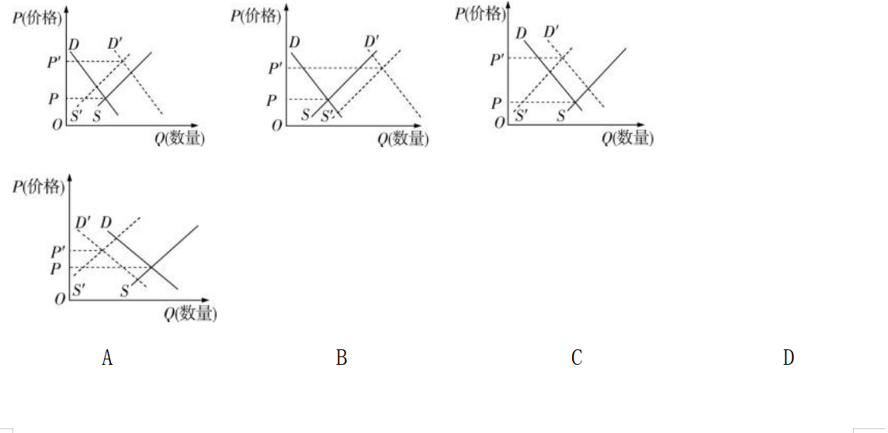

海南省2021年普通高中学业水平选择性考试

政　治

　　本试卷共25小题,满分100分。考试用时75分钟。

　　　　　　 　　　　　 　　　　　

一、选择题:本题共22小题,每小题2分,共44分。在每小题给出的四个选项中,只有一项是最符合题目要求的。

1.以下是某家庭2019年和2020年收支情况(单位:万元)。

<table style="width:100%;">
<colgroup>
<col style="width: 5%" />
<col style="width: 9%" />
<col style="width: 21%" />
<col style="width: 24%" />
<col style="width: 20%" />
<col style="width: 19%" />
</colgroup>
<tbody>
<tr>
<td style="text-align: center;">年份</td>
<td style="text-align: center;">总收入</td>
<td style="text-align: center;">
食品消

费支出
</td>
<td style="text-align: center;">
其他消

费支出
</td>
<td style="text-align: center;">储蓄存款</td>
<td style="text-align: center;">
其他投

资支出
</td>
</tr>
<tr>
<td style="text-align: center;">2019年</td>
<td style="text-align: center;">12</td>
<td style="text-align: center;">3</td>
<td style="text-align: center;">5</td>
<td style="text-align: center;">3</td>
<td style="text-align: center;">1</td>
</tr>
<tr>
<td style="text-align: center;">2020年</td>
<td style="text-align: center;">15</td>
<td style="text-align: center;">3</td>
<td style="text-align: center;">6</td>
<td style="text-align: center;">4</td>
<td style="text-align: center;">2</td>
</tr>
</tbody>
</table>

　　若不考虑其他因素,可以判断出该家庭2020年相比2019年

A.恩格尔系数降低,消费水平降低

B.恩格尔系数升高,消费水平提高

C.恩格尔系数降低,消费水平提高

D.恩格尔系数不变,消费水平不变

2.世界钢铁协会和国家统计局相关数据显示,2020年全球铁矿石需求增长5 060万吨,国际铁矿石供应商发货量下降1 020万吨,供需缺口6 080万吨,导致铁矿石价格大幅上涨。在其他条件不变的情况下,以下图中(*D*、*D*'分别表示变动前后的需求曲线,*S*、*S*'分别表示变动前后的供给曲线)能正确反映这一经济现象的是

   

3.《中华人民共和国2020年国民经济和社会发展统计公报》显示,2020年我国参加基本医疗保险人数超过13.6亿,比上年增加693万人;资助8 990万人参加基本医疗保险,实施直接救助7 300万人次。这表明我国

①医疗保险基本实现全民覆盖　②城乡居民社会福利明显提升　③基本养老保险改革取得成效　④健康服务公平性进一步提高

A.①③ B.①④ C.②③ D.②④

4\. 2020年底召开的中央经济工作会议指出,要紧紧扭住供给侧结构性改革这条主线,注重需求侧管理,贯通生产、分配、流通、消费各个环节,形成需求牵引供给、供给创造需求的更高水平动态平衡。紧紧扭住供给侧结构性改革这条主线是因为

①分配和交换是连接生产和消费的纽带　②消费是物质资料生产的最终目的和动力　③直接生产过程是社会再生产过程中起决定作用的环节　④无效和低端供给不能适应人民日益增长的美好生活需要

A.①② B.①③ C.②④ D.③④

5.闲置多年的乡村公益设施被改造利用,有的成为工厂厂房,有的成为特色民宿和特色观光园……盘活乡村闲置公益设施是海南省发展农村市场主体,壮大农村经济的重要举措。这有利于

①优化资源配置,繁荣农村经济　②降低企业经营成本,提高企业经济效益　③发展特色产业,促进产业融合　④根本解决农民就业难题,增加农民收入

A.①② B.①③ C.②④ D.③④

6.当前,世界各国竞相建立和完善本国的生物安全防线,把防控重大新发突发传染病与应用生物技术安全、人类遗传资源安全等内容纳入国家安全考量,加强生物技术研发,力图在世界格局中占据有利地位。这是因为

①维护共同利益是各国加强技术研发的出发点　②只要率先实现技术突破,就能保障国家安全　③经济和科技实力是综合国力的重要基础　④非传统安全威胁给各国带来了严峻挑战

A.①② B.①③ C.②④ D.③④

7\. 2021年3月11日,第十三届全国人民代表大会第四次会议表决通过了《全国人民代表大会关于完善香港特别行政区选举制度的决定》,自公布之日起施行。该决定为构建符合香港实际情况的民主选举制度提供了根本依据。由此可见

①全国人民代表大会具有最高立法权　②全国人民代表大会具有最高决定权　③该决定的通过标志着“爱国者治港”的稳定局面真正形成　④该决定的施行为落实“爱国者治港”原则提供了制度保障

A.①③ B.①④ C.②③ D.②④

8.“社区通”是上海市某区为精准服务村民而建立的智能化治理系统。“社区通”APP设有“议事厅”“村务公开”等板块,村民在“议事厅”提出议题,村干部“接单”后,发动村民讨论并形成解决方案。该APP自上线以来,已累计回应解决群众问题14万余件。“社区通”APP的应用

①保障了村民直接行使基本民主权利　②调动了村民参与管理的积极性　③有利于村民行使决策权　④提高了服务管理的精准度

A.①② B.①③ C.②④ D.③④

9.近年来,海南省大力推进数字乡村建设,基本实现光纤宽带和无线网络全覆盖,促进了产业发展、公共服务、社会治理等智能化,为乡村振兴注入了强大动力。数字乡村建设有利于

①提升政府部门的行政效率及服务效能　

②完善乡村的基础设施和公共服务体系

③强化政府在跨领域创新中的领导地位　

④促进数字办公方式取代传统办公方式

A.①② B.①③ C.②④ D.③④

10.海南省大力推进网上督查室建设,让政务监督纳入制度化管控。网上督查室运行两年来,接到网民的有效问题线索2 043条,已办结1 766条,得到社会的广泛认可。网上督查室建设有利于

①杜绝政府工作人员不作为、乱作为　

②丰富民主监督的方式,便于公民监督

③推动政府“放管服”改革和职能改变　

④树立政府高效、廉洁和负责任的形象

A.①③ B.①④ C.②③ D.②④

11.为齐心协力把我国“十四五”规划编制好,2020年8月16日至29日,“十四五”规划编制工作开展网上征求意见,广大人民群众踊跃参与,留言100多万条,有关方面从中整理出1 000余条建议,为编制工作提供了有益参考。这体现了

①我国的社会主义民主是最广泛的民主　

②社会主义民主的本质是公民当家作主

③公民通过网络行使提案权共商国是　

④我国公民的政治参与意识不断增强

A.①② B.①④ C.②③ D.③④

12.长期以来,内蒙古自治区坚持民族区域自治制度,各民族和睦相处、共同奋斗。2020年全区经济总量达到1.74万亿元,人均地区生产总值突破1万美元,多项民生指标达到或超过全国平均水平,成为祖国北疆一颗耀眼的明珠。民族区域自治制度有利于

①实现各民族间完全融合　②保障内蒙古人民自主管理本地区事务　③保障民族自治地方享有高度自治权　④促进内蒙古自治区经济繁荣和社会发展

A.①② B.①③ C.②④ D.③④

13.有声阅读越来越受到市场的关注,层出不穷的音频产品不断拓展内容、应用场景的边界,也正改变着人们获取知识、休闲娱乐的方式。越来越多的人在收听有声书中放松身心、吸收精神养料。这表明

①多样的音频产品丰富了人们的精神世界　

②多样化阅读有利于提升人们的文化素养

③阅读方式的变化决定了娱乐方式的变化　

④有声读物日益成为文化传播的重要手段

A.①② B.①③ C.②④ D.③④

14.马克思强调“问题是时代的格言,是表现时代自己内心状态的最实际的呼声”。“真正的哲学”必须捕捉到“一个时代的迫切问题”,并使其升华为理论形态的人类自我意识。这表明,“真正的哲学”必须

①反映时代的任务和要求　②为解决时代问题提供具体方法　③成为推动时代前进的物质力量　④总结和概括时代的实践经验和认识成果

A.①② B.①④ C.②③ D.③④

15.习近平总书记在全国抗击新冠肺炎疫情表彰大会上指出:“‘物有甘苦,尝之者识;道有夷险,履之者知。’在这场波澜壮阔的抗疫斗争中,我们积累了重要经验,收获了深刻启示。”下列选项与上述所引古诗文蕴含的哲理相似的是

A.不要人夸颜色好,只留清气满乾坤

B.些小吾曹州县吏,一枝一叶总关情

C.耳闻之不如目见之,目见之不如足践之

D.利民之事,丝发必兴;厉民之事,毫末必去

16.我国自主研发的北斗系统,已广泛应用于交通运输、农林渔业、公共安全以及共享经济、物联网等众多领域。正如北斗卫星导航系统工程首任总设计师孙家栋院士所言,“北斗的应用只受人类想象力的限制”。对孙院士所言理解正确的是

①北斗的应用是人类想象力的产物

②北斗的广泛应用会不断激发我们的想象力

③人类想象力的无限性决定了北斗应用的多样性

④发挥想象力能推动北斗未来在更多领域的应用

A.①② B.①③ C.②④ D.③④

17.海南省白沙黎族自治县在实施生态移民搬迁过程中,成功探索出村集体土地与国有土地置换新模式,并结合自身实际打造以橡胶业为主、多产业共同支撑的增收体系,实现了搬得出、留得住、能致富和生态修复多赢。这启示我们要

①统筹全局,把握事物联系的多样性　

②树立创新意识,突破客观条件的限制　

③在发挥主观能动性的基础上尊重客观规律　

④坚持共性与个性的统一,走符合自身实际的道路

A.①③ B.①④ C.②③ D.②④

18.在学习了量变和质变的关系之后,甲同学说,“不积跬步,无以至千里”,我们要重视量的积累,积极促成质变;乙同学说,“千里之堤,溃于蚁穴”,我们要控制量的积累,防止发生质变。对以上两位同学的观点分析正确的是

①甲同学肯定了量变是质变的必要准备,乙同学否认了这一点　②乙同学肯定了质变是量变的必然结果,甲同学否认了这一点　③两位同学都承认事物的发展都是从量变开始的　④两位同学都认识到了质变是量变的必然结果

A.①② B.①④ C.②③ D.③④

19.大数据时代,手机个性化服务已成为常态。手机应用越来越“懂我”,方便了用户。不过,随之而来的个人信息泄露风险也大大增加,若不及时加以规范,将对用户造成伤害。这表明

①事物都包含着既对立又统一的两个方面　②矛盾的同一性寓于斗争性之中　③矛盾双方相互贯通

④主要矛盾和次要矛盾在一定条件下相互转化

A.①③ B.①④ C.②③ D.②④

20.“走,一起跑步去!”跑步运动已成为时下一股生活潮流。随着社会的发展,人们的生活理念已悄然发生变化,越来越多的人参与到体育锻炼中去。这表明

①健康的生活理念会促进生活方式的转变　

②生活方式的改变决定于生活理念　

③生活理念会随着社会生活的变化而变化　

④生活方式变化必然伴随着生活理念变化

A.①② B.①③ C.②④ D.③④

21.联合国人权理事会第四十六届会议通过了中国提交的有关“在人权领域促进合作共赢”的决议,呼吁各国在人权领域开展建设性对话与合作。许多国家表示,决议以《联合国宪章》为基础,有利于防止以人权问题为借口干涉别国内政的做法。该决议表明我国

①立足世界发展,维护各国利益　

②捍卫联合国权威,支持联合国各项行动　

③维护联合国宪章宗旨,反对霸权主义　

④尊重国际自决原则,展开国际人权对话

A.①② B.①④ C.②③ D.③④

22\. 2020年9月16日,安倍晋三内阁全体辞职,新内阁宣告成立,自民党总裁菅义伟正式成为新任日本首相,接替安倍余下的任期,直至2021年9月举行新的总裁选举。以下对日本政体认识正确的是

①日本首相掌有实权　

②日本内阁无须向议会负责　

③日本内阁是国家最高行政机关　

④日本的国家元首是经过选举产生的

A.①③ B.①④ C.②③ D.②④

二、非选择题:本题共3小题,共56分。

23.(10分)辨析题。

　　国际组织是国际社会的重要成员,在处理各种国际性问题上发挥着重要作用。美国上一任总统推崇“美国优先”,陆续退出一些重要国际组织,上演了各种“退群”行为。现任总统上台后,高调宣称“美国回来了”,上演了各种“返群”行为。

有人认为,国际组织作用的发挥,并没有因为美国“来,或者不来”而发生任何改变。

结合材料,运用《国家和国际组织常识》中国际组织的相关知识,对此观点加以辨析。

24.(10分)阅读材料,完成下列问题。

　　黎族医药是中国传统医药的瑰宝。早在宋元时期,海南黎族先人就对草药的形态、分布、性味及其功效有了比较全面的认识,并逐渐研制出独具特色的黎族医药。海南黎族医药在蛇虫咬伤、接骨、疟疾等疑难杂症方面疗效显著,至今还在海南黎族村寨发挥着重要作用。

由于海南黎族医药的传承多以口口相传、手手相教,上传下、师带徒的方式进行,致使黎族医药传承链日益脆弱,面临后继乏人、古方失传的危机,抢救与保护黎族医药迫在眉睫。

某班级在学习文化生活的内容时,围绕“黎族医药的未来”这一议题展开学习讨论。请自拟题目,为讨论写一段简短发言稿。

要求:①结合材料和文化生活知识;②主题明确,逻辑清晰;③字数在200字左右。

25.(36分)阅读材料,完成下列问题。

　　我们党的百年历史,就是一部践行党的初心使命的历史,就是一部党与人民心连心、同呼吸、共命运的历史。

　　材料一　1926年2月,在中国共产党领导下,海南最早的党支部——中共琼崖特别支部委员会成立。同年6月,中国共产党琼崖第一次代表大会在海口召开。琼崖人民革命武装在党的领导下,历经土地革命战争、抗日战争和解放战争三个时期艰苦卓绝的斗争,最终接应、配合中国人民解放军,于1950年5月解放了海南岛。

在琼崖革命最艰苦的岁月,共产党人胸怀崇高的革命理想和必胜的坚定信念,忍受着饥饿、疾病等艰难困苦,在敌人的围追堵截下,进行了不屈不挠的斗争,即使与党中央失去联系,仍然坚持孤岛奋战,高高地擎着琼崖革命的红旗。正是一批又一批的革命先辈,用生命与鲜血书写了海南“二十三年红旗不倒”的壮丽史诗。

材料二　2016年初,海南省按照全面建成小康社会的预定目标,启动了5年脱贫攻坚大会战,先后派出8 583名干部组成2 758个工作队,深入每个贫困村庄,与村民同吃同住同劳动,一起修整村路、改造危房、整治人居环境、发展产业……经过5年艰苦奋战,全省5个国家扶贫开发工作重点县全部脱贫摘帽,64.97万建档立卡贫困人口全部脱贫,人民群众的获得感、幸福感、安全感越来越厚实。

在海南脱贫攻坚战中,40名扶贫干部先后倒在扶贫路上,最年轻的仅24岁。他们大多是共产党员,用自己的青春、热血乃至生命,生动诠释了共产党人的初心使命。他们和全省扶贫人一道,为海南书写了一份优异的脱贫答卷。

材料三　2018年4月13日,习近平总书记郑重宣布:党中央决定支持海南全岛建设自由贸易试验区,支持海南逐步探索、稳步推进中国特色自由贸易港建设。

三年来,海南牢记使命重托,把准方向,敢于担当,积极作为,推动党中央这一重大决策部署在海南落地生根;把人民对美好生活的向往作为奋斗目标,打赢了一场又一场硬战;自贸港建设顺利开局、蓬勃展开;营商环境日益优化;现代产业格局正在形成……

一个生机勃勃的海南自由贸易港,正乘风破浪而来!

(1)结合材料二,运用《经济生活》的有关知识,分析海南省是如何贯彻落实共享发展理念的。(12分)

(2)结合上述材料,运用《政治生活》的有关知识,说明中国共产党是怎样践行初心使命的。(12分)

(3)时代在变化,共产党人的初心使命从未改变。运用价值观的有关知识,谈谈上述材料对青年学生实现人生价值有何启示。(12分)

海南省2021年普通高中学业水平选择性考试

　　总评:关注时代热点,如中央经济工作会议、香港选举制度、“十四五”规划、抗击新冠肺炎疫情表彰大会等,引导考生关注时政。题型平稳,包括表格题、曲线图题、古诗文题等,考查关键能力和学科素养。

亮点题:第1题通过表格设置虚拟情境考查恩格尔系数的计算、消费的类型等,体现基础性和应用性;第25题引导考生从百年党史中正确认识我们党的初心和使命,深刻领悟中国共产党为什么能的基本道理,同时引导考生树立正确的价值观。

　　★本卷答案仅供参考

1.C　必备知识:消费、恩格尔系数。

正确项分析:恩格尔系数=食品支出÷家庭消费总支出×100%,故该家庭2019年的恩格尔系数为3÷(3+5)×100%=37.5%,2020年为3÷(3+6)×100%≈33%,由此可见该家庭2020年相比2019年恩格尔系数降低,消费水平提高,C正确。

干扰项分析:一般情况下,恩格尔系数降低,意味着食品支出占家庭消费总支出的比重降低,发展和享受资料消费支出占家庭消费总支出的比重提高,消费水平提高,A错误。

2.A　必备知识:影响价格的因素。

正确项分析:由材料可知,铁矿石的需求增加,供给减少,且需求增加的幅度大于供给减少的幅度,因此铁矿石的需求曲线应该向右移动,供给曲线应该向左移动,且需求曲线的移动幅度大于供给曲线,均衡价格上涨,A符合题意。

错误项分析:B表示供给和需求都增加;C表示供给减少,需求增加,但供给减少的幅度大于需求增加的幅度;D表示供给和需求都减少,均不符合题意。

3.B　必备知识:我国的社会保障。

正确项分析:由2020年我国参加基本医疗保险人数、资助人数、直接救助人次可以看出,我国医疗保险基本实现全民覆盖,健康服务公平性进一步提高,①④正确。

错误项分析:基本医疗保险属于社会保险,不属于社会福利,②不选。材料仅涉及基本医疗保险,未涉及基本养老保险,③不选。

4.D　必备知识:生产与消费。

正确项分析:供给侧是指生产侧,紧紧扭住供给侧结构性改革这条主线是因为直接生产过程是社会再生产过程中起决定作用的环节,无效和低端供给不能适应人民日益增长的美好生活需要,③④正确。

错误项分析:材料强调生产的决定作用,①强调分配和交换的作用,②强调消费的作用,均不符合题意。

5.B　必备知识:促进乡村振兴、优化资源配置。

正确项分析:盘活乡村闲置公益设施有利于优化资源配置,繁荣农村经济,①正确。乡村闲置公益设施被改造成厂房、特色民宿和特色观光园等,有利于发展特色产业,促进产业融合,③正确。

错误项分析:盘活乡村闲置公益设施未必能降低企业经营成本、提高企业经济效益,②不选。夸大作用——此举有利于促进农民就业,但不能根本解决农民就业难题,④错误。

6.D　必备知识:国际竞争。

正确项分析:生物安全属于非传统安全的范畴,世界各国竞相建立和完善本国的生物安全防线,是因为非传统安全威胁给各国带来了严峻挑战,④正确。“加强生物技术研发,力图在世界格局中占据有利地位”说明经济和科技实力是综合国力的重要基础,③正确。

错误项分析:维护本国利益是各国加强技术研发的出发点,国家间的共同利益是国家合作的基础,①错误。表述绝对——率先实现技术突破有利于保障国家安全,“就能”说法绝对,②不选。

7.D　必备知识:全国人大的职权等。

正确项分析:十三届全国人大四次会议表决通过相关决定,表明全国人大具有最高决定权,②正确。该决定为构建符合香港实际情况的民主选举制度提供了根本依据,其施行将为落实“爱国者治港”原则提供制度保障,④正确。

错误项分析:该决定不是法律,不能体现全国人大行使立法权,①不选。该决定的通过并不意味着“爱国者治港”的稳定局面真正形成,③不选。

8.C　必备知识:基层管理。

正确项分析:村民在“社区通”APP“议事厅”板块提出议题,村干部发动村民讨论并形成解决方案,这表明该APP的应用调动了村民参与管理的积极性,提高了服务管理的精准度,②④正确。

错误项分析:公民的基本民主权利是选举权和被选举权,这在材料中未体现,①不选。村民可以参与村务决策,但不具有决策权,③错误。

9.A　必备知识:建设服务型政府。

正确项分析:数字乡村建设促进了产业发展、公共服务、社会治理等智能化,有利于提升政府部门的行政效率及服务效能,完善乡村的基础设施和公共服务体系,①②正确。

错误项分析:政府要在党的领导下依法履职,在跨领域创新中政府并不处于领导地位,③错误。表述绝对——数字办公方式并不能完全取代传统办公方式,④错误。

10.D　必备知识:政府权力的行使与监督。

正确项分析:网上督查室建设丰富了民主监督的方式,其让政务监督纳入制度化管控,有利于政府树立高效、廉洁和负责任的形象,②④正确。

错误项分析:表述绝对——网上督查室建设可以减少但不能杜绝政府工作人员不作为、乱作为,①错误。网上督查室建设并没有改变政府的职能,③错误。

时政链接:　“放管服”改革

“放管服”是简政放权、放管结合、优化服务的简称。“放”即简政放权,降低准入门槛;“管”即公正监管,促进公平竞争;“服”即高效服务,营造便利环境。

11.B　必备知识:社会主义民主的特点、公民的政治参与。

正确项分析:“‘十四五’规划编制工作开展网上征求意见,广大人民群众踊跃参与”说明我国的社会主义民主是最广泛的民主,公民的政治参与意识不断增强,①④正确。

错误项分析:社会主义民主的本质是人民当家作主,不是公民当家作主,②错误。主体行为不搭配——公民没有提案权,材料体现的是公民参与民主决策,③错误。

12.C　必备知识:民族区域自治制度。

正确项分析:内蒙古自治区坚持民族区域自治制度,各民族和睦相处、共同奋斗,经济社会发展取得重大成就,这表明民族区域自治制度有利于保障内蒙古人民自主管理本地区事务,促进内蒙古自治区经济繁荣和社会发展,②④正确。

错误项分析:该制度有利于促进民族融合,“完全融合”说法不妥,①错误。民族自治地方的自治不是高度自治,③错误。

13.A　必备知识:文化对人的影响。

正确项分析:“越来越多的人在收听有声书中放松身心、吸收精神养料”表明多样的音频产品丰富了人们的精神世界,也表明多样化阅读有利于提升人们的文化素养,①②正确。

错误项分析:生产决定消费,阅读方式的变化不能决定娱乐方式的变化,③错误。大众传媒是文化传播的主要手段,有声读物只是大众传媒中的一种,④中“重要手段”说法不妥。

14.B　必备知识:时代精神的精华。

正确项分析:必须捕捉到“一个时代的迫切问题”,说明“真正的哲学”必须反映时代的任务和要求,①正确。“使其升华为理论形态的人类自我意识”表明“真正的哲学”必须总结和概括时代的实践经验和认识成果,④正确。

错误项分析:哲学为解决时代问题提供世界观和方法论的指导,不提供具体方法,②不选。哲学是一种精神力量,③不选。

15.C　必备知识:实践与认识。

正确项分析:“物有甘苦,尝之者识;道有夷险,履之者知”强调实践是认识的来源,要重视实践,“耳闻之不如目见之,目见之不如足践之”也强调实践的重要性,C正确。

错误项分析:A赞扬墨梅不慕虚名、高风亮节,B和D强调要心系人民、维护人民群众的利益,都没有强调实践,不选。

16.C　必备知识:实践与认识、联系的多样性。

正确项分析:材料强调人类想象力是无限发展的,北斗的广泛应用会不断激发我们的想象力,而我们的想象力又能推动北斗未来在更多领域的应用,②④正确。

错误项分析:北斗的应用是人类社会实践的产物,①错误。北斗应用的多样性是由其自身特性决定的,不是由人类想象力决定的,③错误。

17.B　必备知识:联系的多样性、矛盾的普遍性与特殊性。

正确项分析:该地打造出以橡胶业为主、多产业共同支撑的增收体系,这启示我们要统筹全局,把握事物联系的多样性,①正确。该地成功探索出村集体土地与国有土地置换新模式,并结合自身实际打造增收体系,这启示我们要坚持共性与个性的统一,走符合自身实际的道路,④正确。

错误项分析:②中“突破客观条件的限制”说法错误。我们要在尊重客观规律的基础上正确发挥主观能动性,③错误。

18.D　必备知识:量变与质变。

正确项分析:甲乙两位同学引用的古语都强调了量变是质变的必要准备,两人都承认事物的发展都是从量变开始的,③正确。甲同学强调要积极促成质变,乙同学强调要防止发生质变,都认识到了质变是量变的必然结果,④正确。

错误项分析:乙同学强调要控制量的积累,没有否认量变是质变的必要准备,①错误。甲同学强调要积极促成质变,肯定了质变是量变的必然结果,②错误。

19.A　必备知识:矛盾的同一性和斗争性。

正确项分析:手机应用给用户带来了方便,也带来了个人信息泄露的风险,这表明事物都包含着既对立又统一的两个方面,①正确。“若不及时加以规范,将对用户造成伤害”表明矛盾双方相互贯通,在一定条件下可以相互转化,③正确。

错误项分析:矛盾的斗争性寓于同一性之中,②错误。材料强调矛盾双方在一定条件下相互转化,未涉及主次矛盾的转化,④不选。

20.B　必备知识:社会存在与社会意识。

正确项分析:在健康的生活理念的影响下,跑步运动成为时下一股生活潮流,这表明健康的生活理念会促进生活方式的转变,①正确。“随着社会的发展,人们的生活理念已悄然发生变化”表明生活理念会随着社会生活的变化而变化,③正确。

错误项分析:夸大作用——社会存在决定社会意识,②中“决定于”夸大了生活理念的作用,不选。表述绝对——社会意识具有相对独立性,它有时会落后于社会存在,有时又会先于社会存在而变化、发展,④中“必然伴随着”说法绝对。

21.D　必备知识:中国与联合国。

正确项分析:“呼吁各国在人权领域开展建设性对话与合作”“决议以《联合国宪章》为基础,有利于防止以人权问题为借口干涉别国内政的做法”表明我国维护联合国宪章宗旨,反对霸权主义,尊重国际自决原则,展开国际人权对话,③④正确。

错误项分析:维护我国的国家利益是我国对外活动的出发点和落脚点,①错误。我国支持联合国按《联合国宪章》精神所进行的各项工作,②错误。

22.A　必备知识:日本的政体。

正确项分析:日本内阁是国家的最高行政机关,由日本首相及其他国务大臣组成,日本首相掌握实权,①③正确。

错误项分析:日本首相由日本天皇根据国会的提名任命,内阁对国会负责,②错误。日本的国家元首是世袭的,不是经过选举产生的,④错误。

23.该观点说法片面。国际组织具有目的性、自主性等特征,以自身的宗旨为指导开展活动,代表的是各成员的共同利益而不是某个特定成员的单方利益。在一定程度上,国际组织自主开展活动,独立运作,从这个角度看,国际组织作用的发挥,并不会因美国“来,或者不来”而发生太大改变。但是,国际组织参与国际事务受诸多因素制约,有其局限性。有些大国倚仗实力,力图控制国际组织,使之成为其推行强权和霸权的工具。因此,从这个角度看,美国的参与可能会使国际组织成为美国推行强权和霸权的工具,影响国际组织积极作用的发挥。

必备知识:国际组织。

解题思路:本题属于辨析题,解答时首先要表明观点,然后,运用辩证思维对题中观点进行分析:运用国际组织的主要特征的知识,分析这一观点的合理性;运用国际组织的局限性知识,分析这一观点的不妥之处。

24.略

必备知识:文化的传承与发展。

解题思路:本题属于开放性试题,可根据材料与设问要求,结合中华优秀传统文化的作用、文化继承、文化创新等知识组织答案。

25.(1)①共享发展注重的是解决社会公平正义问题,海南省坚决打赢脱贫攻坚战、全面建成小康社会,推动了社会的公平正义。②海南省坚持发展依靠人民,使全体人民在共建共享发展中有更多获得感;坚持发展为了人民,多谋民生之利、多解民生之忧,不断满足人民日益增长的美好生活需要;坚持发展成果由人民共享,朝着共同富裕的方向稳步前进。

(2)①为中国人民谋幸福,为中华民族谋复兴,是中国共产党人的初心和使命。②在革命战争年代,共产党员用鲜血和生命换来了革命胜利和海南解放,为实现人民幸福和民族复兴提供了制度保障;在新时代,共产党员用忠诚和使命换来了贫困人口的全部脱贫和全面小康社会的建成,为实现人民幸福和民族复兴打下了坚实的物质基础;党中央科学谋划、地方党委政府精准施策,推进海南现代化经济体系建设,为实现人民幸福和民族复兴创造更加光明的前景。

\(3\) ①价值观是人生的重要向导,我们要树立坚定的理想信念,坚持正确价值观的指引,坚定地沿着正确的人生道路前进。②人的价值在于创造价值,在于对社会的责任和贡献,我们要积极投身为人民服务的实践,发扬顽强拼搏、自强不息的精神,在劳动与奉献中创造价值,在个人与社会的统一中实现价值。

必备知识:共享发展理念、中国共产党人的初心和使命、价值观等。

解题思路:解答第(1)问,首先简述共享发展理念的知识,然后,结合材料二分析海南省是如何贯彻落实共享发展理念的:与村民同吃同住同劳动→坚持发展依靠人民;修整村路、改造危房、整治人居环境、发展产业→坚持发展为了人民;贫困人口全部脱贫,人民群众的获得感、幸福感、安全感越来越厚实→坚持发展成果由人民共享。解答第(2)问,首先简述党的初心和使命是什么;然后,概括三则材料的内容,分析材料中的党组织和共产党员是如何践行党的初心和使命的。“历经土地革命战争……解放了海南岛”→革命胜利、海南解放,为实现人民幸福和民族复兴提供了制度保障;“用自己的青春、热血乃至生命……为海南书写了一份优异的脱贫答卷”→打赢脱贫攻坚战、全面建成小康社会,为实现人民幸福和民族复兴打下了坚实的物质基础;“党中央……自由贸易试验区……自由贸易港建设”→推进海南现代化经济体系建设,为实现人民幸福和民族复兴创造更加光明的前景。解答第(3)问,首先要对材料中共产党员的表现进行概括,然后运用价值观的有关知识给予解读,从中领悟这些表现对青年学生的启示。“在琼崖革命最艰苦的岁月,共产党人胸怀崇高的革命理想和必胜的坚定信念……革命的红旗”→价值观是人生的重要向导,我们要树立坚定的理想信念,坚持正确价值观的指引,坚定地沿着正确的人生道路前进。“正是一批又一批……的壮丽史诗”“他们大多是共产党员……脱贫答卷”→人的价值在于创造价值,在于对社会的责任和贡献,我们要积极投身为人民服务的实践,发扬顽强拼搏、自强不息的精神,在劳动与奉献中创造价值,在个人与社会的统一中实现价值。
