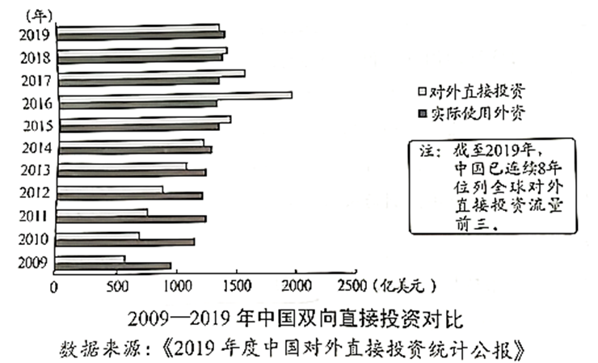

**2021年湖北省普通高中学业水平选择性考试**

**思想政治**

**一、选择题**

1\. 抗日战争时期，中国共产党领导的敌后抗日根据地发行了根据地货币。1938年8月，党中央在给晋察冀边区的信中指出：“边区的纸币数目，不应超过边区市场上的需要数量。这里应该估计到边区之扩大和缩小之可能。”这一材料说明，边区的纸币发行要考虑（ ）

①商品的使用价值

②通货膨胀可能

③边区范围的大小

④货币执行支付手段的职能

A. ①② B. ①④ C. ②③ D. ③④

2\. 国务院四部门联合发布的《支持长江全流域建立横向生态保护补偿机制的实施方案》规定，流域上游承担保护生态环境的责任，同时享有水质改善、水量保障带来利益的权利：流域下游对上游提供良好生态产品付出的努力作出补偿，同时享有水质恶化、上游过度用水的受偿权利。这表明（ ）

①流域下游不承担用水的补偿责任

②流域生态环境保护具有经济效益

③流域生态环境保护主要通过市场调节

④流域上游获得下游的补偿有利于生态环境保护

A. ①② B. ①③ C. ②④ D. ③④

3\. “十三五”时期，我国城镇居民人均可支配收入达到43834元，年均实际增长41.8%；农村居民人均可支配收入达到17131元，年的实际增长6.0%，城镇居民人均消费支出达到27007元，年均实际增长3.8%农村居民人均消费支出达到13713元，年均实际增长5.9%。这表明农村居民（ ）

①消费意愿不断增强②消费受收入增长影响

③消费支出增加大于城镇居民④消费水平的提高带来更快的收入增长

A ①② B. ①④ C. ②③ D. ③④

4\. “十四五”时期，我国人口老帮化程度加深，积极应对人口老龄化上升为国家战略。很多企业看到了老年人在数字经济时代生活、娱乐等需求的变化，对购物、旅游、影音等领城APP(应用程序)进行“适老化”改造，推出“长掌模式”、“关怀模式”，带来了经济发展新的增长空间。由此可见，人口老龄化给经济发展带来积极作用的路径是（ ）

①激发经济发展新动能②增加养老创新主体数量③提升养老导向型创新能力

④加强新型养老服务体系建设⑤扩大新型养老产品消费市场

A. ⑤→④→②→① B. ⑤→②→③→① C. ⑤→③→②→① D. ⑤→③→④→①

5\. 下图反映了2009—2019年中国双向直接投资情况，据此可推断出（ ）

①中国进出口贸易趋于平衡

②中国对世界经济的贡献日益凸显

③中国对外直接投资结构趋于优化

④中国对外直接投资总体呈增长趋势

A. ①② B. ①③ C. ②④ D. ③④

6\. 中国式民主在广泛发扬民主、集思广益的基础上，能够充分调动一切积极因素，有效促进社会生产力的解放和发展。七十多年的实践证明，中国式民主在中国行得通、很管用，中国人民创造了世所罕见的经济快速发展奇迹和社会长期稳定奇迹，决胜全面建成小康社会取得决定性成就。这表明中国式民主（ ）

①实现了发展成果惠及人民的目标②促进了国家机关的协调高效运转

③凝聚了经济社会发展的强大力量④保障了公民直接参加国家事务管理

A. ①② B. ①③ C. ②④ D. ③④

7\. 2021年在节用间，某网友发布视频，“曝光”某商场附近的一辆公务用车疑为公车私用.但经核实，该公务用车是在为防疫工作进行“点对点对接”，针对该“曝光”行为。一些人认为太鲁莽，另一些人则认为不必苛责。从法治的角度看，以下说法正确的是（ ）

①公民的监督权利不受调查结果的影响

②公民享有的监督权利应以事实为依据

③公民有通过网络监督国家工作人员的权利

④公民依法行使监督权利要履行同等的义务

A. ①② B. ①③ C. ②④ D. ③④

8\. 2020年，国务院克服疫情影响等多重困难，创新和完善建议提案办理工作机制，办理全国人大代表建议8108件、全国政协委员提案4115件，分别占建议、提案总数的88.3%和84.9%，并按时办结。这表明（ ）

①通过办理建议提案，政府拓宽了履行职权的渠道

②通过办理建议提案，政府践行了为人民服务的宗旨

③办理建议提案是政府向人大和政协负责的重要形式

④办理建议提案是政府民主决策科学施政的重要途径

A. ①③ B. ①④ C. ②③ D. ②④

9\. 2021年1月，全国人大常委会通过的《中华人民共和国海警法》规定了人民武装警察部队海警部队统一履行海上维权执法职责，包括在我国管辖海域开展巡航警戒、对海上重要目标和重大活动实施安全保卫、实施海上治安管理等，并规定了相应的权限、措施和程序要求。该立法（ ）

①确认了实施海上维权执法的组织体制

②建成了保障海上维权执法的法律体系

③助力了建设强大的海上维权执法力量

④提升了维护主权治理领海实际效能

A. ①② B. ①③ C. ②④ D. ③④

10\. 1961年，大型音乐舞蹈史诗(东方红》创作团队深入江洒采风，把收集到的有关红军的民歌整理马成歌词，以赣离采茶戏等民间曲词为基础，创作了歌曲(十送红军》。半个多世纪来，《十送红军》家喻户晓、传唱不衰，生动诠样了“江山就是人民，人民就是江山”，《十送红军》的创作告诉我们（ ）

①革命文化是对传统文化传承创新②人民群众是文化的创造者和享受者

③文艺创作应真实反映不同时代的差异④社会实践为红色歌曲创作提供了源泉

A. ①② B. ①③ C. ②④ D. ③④

11\. 湖北省博物馆(下图)以“湖畔筑台”为创意，吸收古楚国高台建筑特点，融合现代建筑理论和技术，体现了地域文化特色和现代气息。“湖畔筑台”的创意设计表明（ ）

①古楚国建筑具有持久的艺术魅力

②古楚国建筑彰显了当代文化的价值

③现代建筑复制了古楚国建筑的内容

④现代建筑可从古楚国建筑中汲取灵感

A. ①③ B. ①④ C. ②③ D. ②④

12\. 《中华人民共和国反食品浪费法》规定了政府、企业、个人等各类主体反食品浪费的职资义务，以法治方式在全社会营适浪费可耻、节约为荣的氛围，推动反食品源费形安全民自觉。这种方式旨在（ ）

①弘扬中华民族勤俭节约的传统美德②培育和践行文明健康的新风尚

③运用法律规范替代内在的道德约束④推动良好生活方式的自发形成

A. ①② B. ①④ C. ②③ D. ③④

13\. 湖北武汉素有“九省通衢”之美誉，历史上众多文人墨客在此迎来送往，触景生情，留下了大量广为流传的送别诗篇，如“故人西辞黄鹤楼，烟花三月下扬州”、“鄂渚轻帆须早发，江边明月为君留”等。这表明（ ）

①意识的内容可还原社会生活②意识的根本目的是人的情感需求

③意识是社会历史活动的产物④意识的形式可以由人们主动创造

A. ①② B. ①④ C. ②③ D. ③④

14\. 随着网络信息技术日新月异，越来越多的人在线上开展办公、购物、教育、医疗等活动，出现了许多新的需要、新的职业、新的生活方式，一种新的实践形式——“虚拟实践”应运而生。这表明虚拟实践（ ）

①改变了社会生活的本质②超越了社会运动的规律

③促进了社会主体的发展④突破了地域空间的限制

A. ①② B. ①④ C. ②③ D. ③④

15\. 中共一大代表、党的创始入之一陈潭秋早年在枚学习时接受了马克思主义，随后以极大热情投身革命，为党的事业四处奔波，即使困难重重，也从未停止奋斗的步伐，直至壮烈牺牲。陈潭秋的事迹启示我们（ ）

①个人的价值实现是自觉理论学习的结果②个人的价值选择要顺应历史发展的潮流

③个人的价值选择根源于对社会历史的认识④个人的价值实现必须通过实践为社会服务

A. ①③ B. ①④ C. ②③ D. ②④

16\. 下图漫画主要讽刺的思维方式是（ ）

①只看现象，不看本质②只重共性，不重个性

③只识局部，不识整体④只顾目的，不顾手段

A. ①② B. ①④ C. ②③ D. ③④

**二、非选择题**

17\. 阅读材料，完成下列要求。

1949年10月上旬，上海市场纱布短缺，投机势力趁机抢购囤积、年取暴利，导致纱布价格不断上涨，并波及粮食和其他主要日用消费品，给上海市国民经济的恢复和稳定带来了极大的困难。

为了让处于高位的物价降下来，同时给予投机势力以致命的打击，1949年11月25日，一场平抑涨价风暴的战役正式拉开帷幕。中央财政经济委员会在全国各地调集了充足的纱布、粮食等重要物资，通过上海的国营商业公司抛售。在开市的时候，投机商竞相买进，有的甚至不惜借高利贷继续园货。但国营公司源源不断地抛售，并每小时降一次价，使投机商慌了手脚。由于担心跌价亏本，投机商也跟进抛出，导致市价跌得更快。当天，上海纱布价格下跌了一半，其他主要物资的价格也不断下跌。同时，为了扼住投机商的资金梁道，人民银行提高贷款利率。许多投机商眼看价格直线下跌，急于抛货还贷，越抛货价格越下降，价格越降越急于出手，到后来赔本又付息。授机商企图借钱园货、扰乱市场的阴舌以谋以惨败而告终。

（1）结合材料并运用市场规则知识，评析抢购囤积、牟取暴利这种行为。

（2）结合材料，分析中央财政经济委员会是如何遵循市场规律打赢这场经济战役的。

18\. 阅读材料，完成下列要求。

1930年5月，毛泽东同志到间粤黄三省交界处的寻乌县，进行了一次深入系统的社会经济调查。在调查期间，毛泽东同志除了开调查会，还主动深入各行各业，虚心向群众请教，认真了解群众生活状况，写下了《寻鸟调查》，并在此基础上写了《反对本本主义》，提出“没有调查，就没有发言权”的著名论断，树立了加强调查研究、科学决策的典范。

新时代，调查研究仍然是共产党人做好工作的基本功，为制定“十四五”规划，习近千总书记率先垂范，多次深入地方考察调呀，访农家、进企业，察民情、问良策，亲自主持召开多场专题座谈会，听取企业家、党外人士专家学者、地方党政领导、基层代表等各领域各阶层人士的意见建议。2020年8月16日至29日，党中央首次通过互联网就规划编制向全社会征求意见建议，短短两周时间，累计收到101.8万余条建言。同年10月，在充分吸收广大人民群众和社会各界意见建议的基础上，党的十九届五中全会审议通过了《中共中央关于制定国民经济和社会发展第十四个五年规划和二O三五年远景目标的建议》。“十四五”规划建议从酿到出台深刻诠释了“没有调查，没有发言权”的要义。

结合材料并运用政治生活知识，说明新时代共产党人为什么仍然要练好调查研究基本功，以及如何做好调查研究工作。

19\. 阅读材料，完成下列要求。

近年来，全国各地立足自身实际，多措并举深入挖掘、继承创新优秀传统乡土文化，助力乡村振兴：以乡村节日与习俗活动为抓手，挖掘舞龙灯、彩莲船等民俗资源，丰富乡村文化生活：以传统手工艺与现代设计的深度融合，激活木工制作等乡村传统手工艺“再生”能力：以农村文化礼堂、“村晚”等活动形式，培育良好家风、文明多风、淳朴民风：以修端现代版的村规民约、征集村歌等为手段，倡导向善向美的价值观念，改善村民精神面貌，增强精神力量；以特色乡镇建设为契机，修络、迁建古建筑，保护传统村落民居、历史文化名村名镇，文旅融合、文创结合，盘活历史文化遗存，激发乡村发展活力。

全面推进乡村振兴要深入挖掘、维承创新优秀传统乡土文化。结合材料并运用文化生活知识对此加以说明。

20\. 阅读材料，完成下列要求。

铁路是国家战略性、先导性、关键性重大基础设施，在经济社会发展中的地位和作用至关重要。铁路的发展是一个国家经济社会发展的缩影。

新中国成立之初，我国交通运输非常落后，铁路总里程仅2.18万公里。七十多年来，在党的领导下，我国铁路建设事业迎来翻天覆地的历史性变化。“十三五”期间，全国铁路营业里程已达14.63万公里，其中高铁达3.79万公里。当今的中国已建成世界上最现代化的铁路网和最发达的高铁网。从“绿皮车”到“子弹头”，中国铁路的发展反映了中国经济社会“发展的速度”。

四通八达的铁路，不断满足着中国人民的出行需要和对美好生活的向往。随着铁路系统智能化、数字化的转型升级，电子客票、移动支付等手段极大提升了人们的出行体验。铁路网不仅大大缩短了地区之间的时空距离，也极大带动了沿线的物流货运，为各行各业的发展注入强劲动能，更成为老少边穷地区脱贫致富的发动机，在区域协调发展中发挥了辐射带动作用。从“出行困难”到“说走就走”，中国铁路的发展也折射了中国经济社会“民生温度”。

（1）新中国铁路的发展历程表明，中国经济社会既有“发展的速度”，又有“民生的温度”。结合材料并运用矛盾的同一性知识对此加以说明。

（2）请以新中国铁路发展成就为主题，写两条宣传标语。(每条20字以内)
