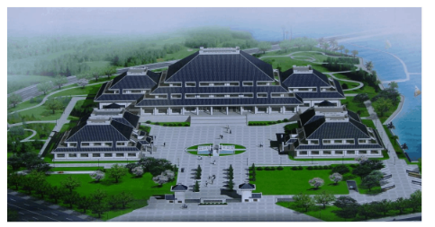

**2021年湖北省普通高中学业水平选择性考试**

**思想政治**

**一、选择题**

1\. 抗日战争时期，中国共产党领导的敌后抗日根据地发行了根据地货币。1938年8月，党中央在给晋察冀边区的信中指出：“边区的纸币数目，不应超过边区市场上的需要数量。这里应该估计到边区之扩大和缩小之可能。”这一材料说明，边区的纸币发行要考虑（ ）

①商品的使用价值

②通货膨胀的可能

③边区范围的大小

④货币执行支付手段的职能

A. ①② B. ①④ C. ②③ D. ③④

【答案】C

【解析】

【详解】②③：纸币的发行量必须以流通中所需要的货币量为限度，如果超出这个限度，就有可能造成通货膨胀，物价上涨，货币贬值，所以边区的纸币发行要考虑商通货膨胀的可能及边区范围的大小，②③符合题意。

①④：商品的使用价值与货币的职能跟纸币发行无关，①④排除。

故本题选C。

2\. 国务院四部门联合发布的《支持长江全流域建立横向生态保护补偿机制的实施方案》规定，流域上游承担保护生态环境的责任，同时享有水质改善、水量保障带来利益的权利：流域下游对上游提供良好生态产品付出的努力作出补偿，同时享有水质恶化、上游过度用水的受偿权利。这表明（ ）

①流域下游不承担用水的补偿责任

②流域生态环境保护具有经济效益

③流域生态环境保护主要通过市场调节

④流域上游获得下游的补偿有利于生态环境保护

A. ①② B. ①③ C. ②④ D. ③④

【答案】C

【解析】

【详解】①③：材料反映流域下游对上游提供良好生态产品付出的努力作出补偿，同时享有水质恶化、上游过度用水的受偿权利，而不是不承担用水的补偿责任；生态环境保护主要通过国家宏观调控，而不是市场调节，故①③错误。

②④：上游承担保护生态环境的责任，同时享有水质改善、水量保障带来利益的权利；流域下游对上游提供良好生态产品付出的努力作出补偿，同时享有水质恶化、上游过度用水的受偿权利，体现了流域生态环境保护具有经济效益，流域上游获得下游的补偿有利于生态环境保护，故②④正确。

故本题选C。

3\. “十三五”时期，我国城镇居民人均可支配收入达到43834元，年均实际增长41.8%；农村居民人均可支配收入达到17131元，年的实际增长6.0%，城镇居民人均消费支出达到27007元，年均实际增长3.8%农村居民人均消费支出达到13713元，年均实际增长5.9%。这表明农村居民（ ）

①消费意愿不断增强②消费受收入增长影响

③消费支出增加大于城镇居民④消费水平的提高带来更快的收入增长

A. ①② B. ①④ C. ②③ D. ③④

【答案】A

【解析】

【详解】③④：材料反映农村居民消费支出率增加大于城镇居民，而不是消费支出增加大于城镇居民；材料没有涉及消费对收入影响，故③④不选。

①②：“十三五”时期，我国城镇居民人均可支配收入达到43834元，年均实际增长41.8%，城镇居民人均消费支出达到27007元，年均实际增长3.8%，农村居民人均消费支出达到13713元，年均实际增长5.9%，表明消费受收入增长影响，农村居民消费意愿不断增强，故①②正确。

故本题选A。

4\. “十四五”时期，我国人口老帮化程度加深，积极应对人口老龄化上升为国家战略。很多企业看到了老年人在数字经济时代生活、娱乐等需求的变化，对购物、旅游、影音等领城APP(应用程序)进行“适老化”改造，推出“长掌模式”、“关怀模式”，带来了经济发展新的增长空间。由此可见，人口老龄化给经济发展带来积极作用的路径是（ ）

①激发经济发展新动能②增加养老创新主体数量③提升养老导向型创新能力

④加强新型养老服务体系建设⑤扩大新型养老产品消费市场

A. ⑤→④→②→① B. ⑤→②→③→① C. ⑤→③→②→① D. ⑤→③→④→①

【答案】B

【解析】

【详解】⑤：我国人口老龄化程度加深，老年人在数字经济时代生活、娱乐等需求的变化，说明老龄化有利于扩大新型养老产品消费市场，故⑤排在第一。

②③：市场扩大，为适应老年人需要，企业对购物、旅游、影音等领城APP(应用程序)进行“适老化”改造，需要企业增加养老创新主体数量，提升养老导向型的创新能力。故②排在第二，③排第三。

①：养老创新能力加强，为经济发展提供新动能，故①排在第四。

④：材料中强调的是企业为满足老龄化市场需求进行产品结构调整升级，未涉及新型养老服务体系的建设，故④不选。

故本题选B。

5\. 下图反映了2009—2019年中国双向直接投资情况，据此可推断出（ ）

①中国进出口贸易趋于平衡

②中国对世界经济的贡献日益凸显

③中国对外直接投资结构趋于优化

④中国对外直接投资总体呈增长趋势

A. ①② B. ①③ C. ②④ D. ③④

【答案】C

【解析】

【详解】②④：从2009—2019年中国双向直接投资的数据可以看出，中国对外直接投资总体呈增长趋势，对世界经济的贡献日益凸显，②④符合题意。

①③：图表反映了中国双向直接投资情况，不反映中国进出口贸易问题，也看不出中国对外直接投资结构趋于优化，①③与题意不符。

故本题选C。

6\. 中国式民主在广泛发扬民主、集思广益的基础上，能够充分调动一切积极因素，有效促进社会生产力的解放和发展。七十多年的实践证明，中国式民主在中国行得通、很管用，中国人民创造了世所罕见的经济快速发展奇迹和社会长期稳定奇迹，决胜全面建成小康社会取得决定性成就。这表明中国式民主（ ）

①实现了发展成果惠及人民的目标②促进了国家机关的协调高效运转

③凝聚了经济社会发展的强大力量④保障了公民直接参加国家事务管理

A. ①② B. ①③ C. ②④ D. ③④

【答案】B

【解析】

【详解】①：七十多年实践证明，中国式民主在中国行得通、很管用，中国人民创造了世所罕见的经济快速发展奇迹和社会长期稳定奇迹，决胜全面建成小康社会取得决定性成就。这表明中国式民主实现了发展成果惠及人民的目标，①符合题意。

③：中国式民主在广泛发扬民主、集思广益的基础上，能够充分调动一切积极因素，有效促进社会生产力的解放和发展。这表明中国式民主凝聚了经济社会发展的强大力量，③符合题意。

②：人民代表大会制度促进了国家机关的协调高效运转，②错误。

④：我国人民是通过选举人大代表间接参加国家事务管理，④错误。

故本题选B。

7\. 2021年在节用间，某网友发布视频，“曝光”某商场附近一辆公务用车疑为公车私用.但经核实，该公务用车是在为防疫工作进行“点对点对接”，针对该“曝光”行为。一些人认为太鲁莽，另一些人则认为不必苛责。从法治的角度看，以下说法正确的是（ ）

①公民的监督权利不受调查结果的影响

②公民享有的监督权利应以事实为依据

③公民有通过网络监督国家工作人员的权利

④公民依法行使监督权利要履行同等的义务

A. ①② B. ①③ C. ②④ D. ③④

【答案】B

【解析】

【详解】②④：公民行使监督权利应以事实为依据；权利与义务具有一致性，但不是公民依法行使监督权利要履行同等的义务，故②④不选。

①③：监督权是指公民对国家机关及其工作人员进行批评、建议、控告或者检举的权利，公民的监督权利由法律规定，不受调查结果的影响，公民有通过网络监督国家工作人员的权利但要正确行使权利，故①③正确。

故本题选B。

8\. 2020年，国务院克服疫情影响等多重困难，创新和完善建议提案办理工作机制，办理全国人大代表建议8108件、全国政协委员提案4115件，分别占建议、提案总数的88.3%和84.9%，并按时办结。这表明（ ）

①通过办理建议提案，政府拓宽了履行职权的渠道

②通过办理建议提案，政府践行了为人民服务的宗旨

③办理建议提案是政府向人大和政协负责的重要形式

④办理建议提案是政府民主决策科学施政的重要途径

A. ①③ B. ①④ C. ②③ D. ②④

【答案】D

【解析】

【详解】①：办理建议提案，本来就是政府履职的体现，并没有拓宽政府履行职权的渠道，①错误。

②④：国务院克服疫情影响等多重困难，创新和完善建议提案办理工作机制，办理全国人大代表建议8108件、全国政协委员提案4115件，分别占建议、提案总数的88.3%和84.9%，并按时办结。这表明办理建议提案是政府民主决策科学施政的重要途径，通过办理建议提案，政府践行了为人民服务的宗旨，②④符合题意。

③：政府向人大负责，不向政协负责，③错误。

故本题选D。

9\. 2021年1月，全国人大常委会通过的《中华人民共和国海警法》规定了人民武装警察部队海警部队统一履行海上维权执法职责，包括在我国管辖海域开展巡航警戒、对海上重要目标和重大活动实施安全保卫、实施海上治安管理等，并规定了相应的权限、措施和程序要求。该立法（ ）

①确认了实施海上维权执法的组织体制

②建成了保障海上维权执法的法律体系

③助力了建设强大海上维权执法力量

④提升了维护主权治理领海的实际效能

A. ①② B. ①③ C. ②④ D. ③④

【答案】B

【解析】

【详解】①③：《中华人民共和国海警法》规定了人民武装警察部队海警部队统一履行海上维权执法职责，以及相应的权限、措施和程序要求，说明了《中华人民共和国海警法》确认了实施海上维权执法的组织体制，助力了建设强大的海上维权执法力量，①③正确。

②：《中华人民共和国海警法》只是规定了人民武装警察部队海警部队统一履行海上维权执法职责，以及相应的权限、措施和程序要求，并没有建成保障海上维权执法的法律体系，②不选。

④：材料没有体现维护主权治理领海的实际效能，④排除。

故本题选B。

10\. 1961年，大型音乐舞蹈史诗(东方红》创作团队深入江洒采风，把收集到的有关红军的民歌整理马成歌词，以赣离采茶戏等民间曲词为基础，创作了歌曲(十送红军》。半个多世纪来，《十送红军》家喻户晓、传唱不衰，生动诠样了“江山就是人民，人民就是江山”，《十送红军》的创作告诉我们（ ）

①革命文化是对传统文化的传承创新②人民群众是文化的创造者和享受者

③文艺创作应真实反映不同时代的差异④社会实践为红色歌曲创作提供了源泉

A. ①② B. ①③ C. ②④ D. ③④

【答案】C

【解析】

【详解】①③：革命文化，是中国共产党领导中国人民在伟大斗争中构建的文化，它以马克思主义为指导，以“革命”为精神内核和价值取向，继承中华优秀传统文化，借鉴世界优秀文明成果，是具有鲜明中国特色的先进文化；材料没有涉及文艺创作反映不同时代的差异，故①③不选。

②④：创作团队深入江洒采风，把收集到的有关红军的民歌整理马成歌词，以赣离采茶戏等民间曲词为基础，创作了歌曲《十送红军》，家喻户晓、传唱不衰，体现了社会实践为红色歌曲创作提供了源泉，人民群众是文化的创造者和享受者，故②④正确。

故本题选C。

11\. 湖北省博物馆(下图)以“湖畔筑台”为创意，吸收古楚国高台建筑特点，融合现代建筑理论和技术，体现了地域文化特色和现代气息。“湖畔筑台”的创意设计表明（ ）

①古楚国建筑具有持久的艺术魅力

②古楚国建筑彰显了当代文化的价值

③现代建筑复制了古楚国建筑的内容

④现代建筑可从古楚国建筑中汲取灵感

A. ①③ B. ①④ C. ②③ D. ②④

【答案】B

【解析】

【详解】①④：吸收古楚国高台建筑特点，融合现代建筑理论和技术，体现了地域文化特色和现代气息，这说明古楚国建筑具有持久的艺术魅力，也说明现代建筑可从古楚国建筑中汲取灵感，①④正确。

②：古楚国建筑属于传统建筑，是历史形成的，不能彰显当代文化的价值，②错误。

③：吸收古楚国高台建筑特点并不意味着复制了古楚国建筑的内容，③错误。

故本题选B。

12\. 《中华人民共和国反食品浪费法》规定了政府、企业、个人等各类主体反食品浪费的职资义务，以法治方式在全社会营适浪费可耻、节约为荣的氛围，推动反食品源费形安全民自觉。这种方式旨在（ ）

①弘扬中华民族勤俭节约的传统美德②培育和践行文明健康的新风尚

③运用法律规范替代内在的道德约束④推动良好生活方式的自发形成

A. ①② B. ①④ C. ②③ D. ③④

【答案】A

【解析】

【详解】③④：依法治国，还需以德治国，法律规范不能替代内在的道德约束；材料中以法治方式在全社会营适浪费可耻、节约为荣的氛围，推动反食品源费形安全民自觉，而不是推动良好生活方式的自发形成，故③④不选。

①②：在全社会营适浪费可耻、节约为荣的氛围，推动反食品源费形安全民自觉，有利于弘扬中华民族勤俭节约的传统美德，培育和践行文明健康的新风尚，故①②正确。

故本题选A。

13\. 湖北武汉素有“九省通衢”之美誉，历史上众多文人墨客在此迎来送往，触景生情，留下了大量广为流传的送别诗篇，如“故人西辞黄鹤楼，烟花三月下扬州”、“鄂渚轻帆须早发，江边明月为君留”等。这表明（ ）

①意识的内容可还原社会生活②意识的根本目的是人的情感需求

③意识是社会历史活动的产物④意识的形式可以由人们主动创造

A. ①② B. ①④ C. ②③ D. ③④

【答案】D

【解析】

【详解】①：从意识的内容看，意识是人们对客观事物的主观映像，因此，意识的内容并不能还原社会生活，①错误。

②：人的情感需求是多种多样的，尤其是有合理的和不合理的需求。因此，意识的根本目的并不是人的情感需求，②错误。

③：湖北武汉素有“九省通衢”之美誉，是通过社会历史体现出来，说明了意识是社会历史活动的产物，③正确。

④：人们通过对湖北武汉的历史的认识，触景生情，留下了大量广为流传的送别诗篇，说明了意识的形式可以由人们主动创造，④正确。

故本题选D。

14\. 随着网络信息技术日新月异，越来越多的人在线上开展办公、购物、教育、医疗等活动，出现了许多新的需要、新的职业、新的生活方式，一种新的实践形式——“虚拟实践”应运而生。这表明虚拟实践（ ）

①改变了社会生活的本质②超越了社会运动的规律

③促进了社会主体的发展④突破了地域空间的限制

A ①② B. ①④ C. ②③ D. ③④

【答案】D

【解析】

【详解】①②：社会生活的本质是实践的，没有被改变；规律具有客观性，不能超越了社会运动的规律，故①②错误。

③④：越来越多的人在线上开展办公、购物、教育、医疗等活动，出现了许多新的需要、新的职业、新的生活方式，“虚拟实践”应运而生，有利于促进社会主体的发展，突破地域空间的限制，故③④正确。

故本题选D。

15\. 中共一大代表、党的创始入之一陈潭秋早年在枚学习时接受了马克思主义，随后以极大热情投身革命，为党的事业四处奔波，即使困难重重，也从未停止奋斗的步伐，直至壮烈牺牲。陈潭秋的事迹启示我们（ ）

①个人的价值实现是自觉理论学习的结果②个人的价值选择要顺应历史发展的潮流

③个人的价值选择根源于对社会历史的认识④个人的价值实现必须通过实践为社会服务

A. ①③ B. ①④ C. ②③ D. ②④

【答案】D

【解析】

【详解】①：“自觉理论学习”属于认识世界的活动，积极投身于为人民服务的实践是实现人生价值的必由之路，是拥有幸福人生的根本途径，①错误。

②④：接受马克思主义，随后以极大热情投身革命，为党的事业四处奔波，即使困难重重，从未停止奋斗的步伐，直至壮烈牺牲，这说明个人的价值选择要顺应历史发展的潮流，也说明个人的价值实现必须通过实践为社会服务，②④正确切题。

③：个人的价值选择根源于社会实践，③错误。

故本题选D。

16\. 下图漫画主要讽刺的思维方式是（ ）

①只看现象，不看本质②只重共性，不重个性

③只识局部，不识整体④只顾目的，不顾手段

A. ①② B. ①④ C. ②③ D. ③④

【答案】A

【解析】

【详解】①②：漫画反映将喇叭花和喇叭混为一谈，禁止鸣笛，把喇叭花剪掉，讽刺只看现象，不看本质，只重共性，不重个性，故①②正确。

③④：材料没有涉及只识局部，不识整体，也没有涉及只顾目的，不顾手段，故③④不选。

故本题选A。

**二、非选择题**

17\. 阅读材料，完成下列要求。

1949年10月上旬，上海市场纱布短缺，投机势力趁机抢购囤积、年取暴利，导致纱布价格不断上涨，并波及粮食和其他主要日用消费品，给上海市国民经济的恢复和稳定带来了极大的困难。

为了让处于高位的物价降下来，同时给予投机势力以致命的打击，1949年11月25日，一场平抑涨价风暴的战役正式拉开帷幕。中央财政经济委员会在全国各地调集了充足的纱布、粮食等重要物资，通过上海的国营商业公司抛售。在开市的时候，投机商竞相买进，有的甚至不惜借高利贷继续园货。但国营公司源源不断地抛售，并每小时降一次价，使投机商慌了手脚。由于担心跌价亏本，投机商也跟进抛出，导致市价跌得更快。当天，上海纱布价格下跌了一半，其他主要物资的价格也不断下跌。同时，为了扼住投机商的资金梁道，人民银行提高贷款利率。许多投机商眼看价格直线下跌，急于抛货还贷，越抛货价格越下降，价格越降越急于出手，到后来赔本又付息。授机商企图借钱园货、扰乱市场的阴舌以谋以惨败而告终。

（1）结合材料并运用市场规则知识，评析抢购囤积、牟取暴利这种行为。

（2）结合材料，分析中央财政经济委员会是如何遵循市场规律打赢这场经济战役的。

【答案】（1）①市场规则是运用法律法规，行业规范，市场道德对市场方方面面做出的规定。

②这是一种投机，非正当竞争和非法行为，违背了诚实守信的交易规则，不合道德的。

③扰乱了市场秩序，危害国民经济的健康发展。

（2）遵循经济规律；科学宏观调控调集物资，增加供给，降价销售，提高贷款利率。

【解析】

【分析】背景素材：平抑涨价风暴战役

考点考查：市场规则的有关知识

能力考查：描述和阐述事物，论证和探究问题

核心素养：政治认同、科学精神

【详解】第一步：审设问，明确主体、作答范围、问题限定和作答角度。本题的设问主体为“考生”， 需要调用“市场规则”的有关知识，评析抢购囤积、牟取暴利这种行为，如何遵循市场规律打赢这场经济战役的。

第二步：审材料，通过标点符号、段落等，提取材料有效信息。

第1问：

总论点：抢购囤积、牟取暴利是违法行为。

论据①：市场规则是运用法律法规，行业规范，市场道德对市场方方面面做出的规定；

论据②：是一种投机，非正当竞争和非法行为，违背了诚实守信的交易规则，不合道德的；

论据③：扰乱了市场秩序，危害国民经济的健康发展。

第2问：

有效信息①：国营公司源源不断地抛售，并每小时降一次价，使投机商慌了手脚→可联系遵循经济规律，科学宏观调控调集物资，增加供给；

有效信息②：人民银行提高贷款利率→联系宏观调控，提高贷款利率。

第三步：整合信息，组织答案。

第1问：

得分点①：市场规则是运用法律法规，行业规范，市场道德对市场方方面面做出的规定。

得分点②：这是一种投机，非正当竞争和非法行为，违背了诚实守信的交易规则，不合道德的。

得分点③：扰乱了市场秩序，危害国民经济的健康发展。

第2问：

得分点①：遵循经济规律

得分点②：科学宏观调控调集物资，增加供给，降价销售，提高贷款利率。

【点睛】审设问：一是明确题目考查的知识范围和考查意图，正确联想相关知识，形成综合性的信息认识；二是明确设问的指向性和规定性，分清题干要求答题的类别，即回答“是什么”、或“为什么”、或“怎么样”、或“怎样体现”中哪一类。

18\. 阅读材料，完成下列要求。

1930年5月，毛泽东同志到间粤黄三省交界处的寻乌县，进行了一次深入系统的社会经济调查。在调查期间，毛泽东同志除了开调查会，还主动深入各行各业，虚心向群众请教，认真了解群众生活状况，写下了《寻鸟调查》，并在此基础上写了《反对本本主义》，提出“没有调查，就没有发言权”的著名论断，树立了加强调查研究、科学决策的典范。

新时代，调查研究仍然是共产党人做好工作的基本功，为制定“十四五”规划，习近千总书记率先垂范，多次深入地方考察调呀，访农家、进企业，察民情、问良策，亲自主持召开多场专题座谈会，听取企业家、党外人士专家学者、地方党政领导、基层代表等各领域各阶层人士的意见建议。2020年8月16日至29日，党中央首次通过互联网就规划编制向全社会征求意见建议，短短两周时间，累计收到101.8万余条建言。同年10月，在充分吸收广大人民群众和社会各界意见建议的基础上，党的十九届五中全会审议通过了《中共中央关于制定国民经济和社会发展第十四个五年规划和二O三五年远景目标的建议》。“十四五”规划建议从酿到出台深刻诠释了“没有调查，没有发言权”的要义。

结合材料并运用政治生活知识，说明新时代共产党人为什么仍然要练好调查研究基本功，以及如何做好调查研究工作。

【答案】①是建设社会主义现代化国家新征程（强国）的需要。

②是尊重人民群众历史创造者，践行全心全意为人民服务宗旨的需要（以人民为中心）。

③是坚持群众路线，汇集群众智慧，增强决策科学性和民主性的需要（科学执政和民族执政）。

④共产党员特别是党的领导干部要率先垂范，坚持党的观点群众观点，践行党的群众路线，深入基层，到群众中去获得第一手资料。

【解析】

分析】背景素材：共产党人要练好调查研究基本功

考点考查：政治生活相关知识

能力考查：获取和解读信息、调动和运用知识、描述和阐释事物

核心素养：政治认同、科学精神、法治意识、公共参与

【详解】第一步：审设问，明确主体、作答范围、问题限定和作答角度。

本题要求结合材料并运用政治生活知识，说明新时代共产党人为什么仍然要练好调查研究基本功，以及如何做好调查研究工作。属于原因类和措施类主观题，知识没有具体限定。解答时，需要考生根据材料内容和设问要求调动教材知识，然后结合材料提取信息，坚持理论与材料相结合。

第二步：审材料，通过标点符号、段落等，提取材料有效信息。

有效信息①：毛泽东提出“没有调查，就没有发言权”的著名论断，树立了加强调查研究、科学决策的典范。新时代，调查研究仍然是共产党人做好工作的基本功，为制定“十四五”规划，习近千总书记率先垂范，多次深入地方考察调呀，访农家、进企业，察民情、问良策，亲自主持召开多场专题座谈会，听取企业家、党外人士专家学者、地方党政领导、基层代表等各领域各阶层人士的意见建议→说明练好调查研究基本功，是建设社会主义现代化国家新征程（强国）的需要；

有效信息②：2020年8月16日至29日，党中央首次通过互联网就规划编制向全社会征求意见建议，短短两周时间，累计收到101.8万余条建言。同年10月，在充分吸收广大人民群众和社会各界意见建议的基础上，党的十九届五中全会审议通过了《中共中央关于制定国民经济和社会发展第十四个五年规划和二O三五年远景目标的建议》→说明练好调查研究基本功，是尊重人民群众历史创造者，践行全心全意为人民服务宗旨的需要；是坚持群众路线，汇集群众智慧，增强决策科学性和民主性的需要。

有效信息③：为制定“十四五”规划，习近千总书记率先垂范，多次深入地方考察调呀，访农家、进企业，察民情、问良策，亲自主持召开多场专题座谈会，听取企业家、党外人士专家学者、地方党政领导、基层代表等各领域各阶层人士的意见建议→说明练好调查研究基本功，需要共产党员特别是党的领导干部要率先垂范，坚持党的群众观点观点，践行党的群众路线，深入基层，到群众中去获得第一手资料。

第三步：整合信息，组织答案。

得分点①：是建设社会主义现代化国家新征程（强国）的需要+新时代新任务新目标。

得分点②：是尊重人民群众历史创造者，践行全心全意为人民服务宗旨的需要+不忘初心，牢记使命。

得分点③：是坚持群众路线，汇集群众智慧，增强决策科学性和民主性的需要+决策符合人民需要。

得分点④：共产党员特别是党的领导干部要率先垂范，坚持党的观点观点，践行党的群众路线+深入基层，到群众中去获得第一手资料。

【点睛】原因类主观题方法及技巧

解答此类试题要坚持理论联系实际的原则。我们不仅要解释某种现象产生的原因，还要说明其影响和意义。对于原因类试题的解答，可以分为三步。

第一步，分析其必然性，即分析这样做的重要现实意义。

第二步，分析为什么要（能）这样做。分析时一定要紧扣题意且联系教材知识，分析得越充分越全面越好，同时还要分析能够这样做的条件和社会环境。

第三步，联系政治生活、经济生活、文化生活、生活与哲学等相关知识，结合材料进行分析。当然要具体情况具体分析，除了回答“这样说”“这样做”的依据、意义（重要性）、必要性、可能性之外，有时还需要回答不这样做的危害。

19\. 阅读材料，完成下列要求。

近年来，全国各地立足自身实际，多措并举深入挖掘、继承创新优秀传统乡土文化，助力乡村振兴：以乡村节日与习俗活动为抓手，挖掘舞龙灯、彩莲船等民俗资源，丰富乡村文化生活：以传统手工艺与现代设计的深度融合，激活木工制作等乡村传统手工艺“再生”能力：以农村文化礼堂、“村晚”等活动形式，培育良好家风、文明多风、淳朴民风：以修端现代版的村规民约、征集村歌等为手段，倡导向善向美的价值观念，改善村民精神面貌，增强精神力量；以特色乡镇建设为契机，修络、迁建古建筑，保护传统村落民居、历史文化名村名镇，文旅融合、文创结合，盘活历史文化遗存，激发乡村发展活力。

全面推进乡村振兴要深入挖掘、维承创新优秀传统乡土文化。结合材料并运用文化生活知识对此加以说明。

【答案】①乡土文化蕴含中华传统美德/人文精神，是涵养社会主义核心价值观的重要源泉(补充民族精神但不太合理)。

②优秀传统乡土文化为实现乡村振兴提供精神力量。

③立足实际，深入挖掘乡土文化的积极合理因素并推动文化的创造性转化与创新性发展。

④提高村民思想道德素质，精神力量(乡民)。

⑤弘扬文明乡凤，家风(材料原话)。

⑥促进乡村产业发展。

【解析】

【分析】背景素材：乡村振兴

考点考查：传统文化等有关知识

能力考查：描述和阐述事物

核心素养：政治认同、科学精神

【详解】第一步：审设问，明确主体、作答范围、问题限定和作答角度。本题的设问主体为“考生”， 需要调用“传统文化”有关知识，分析全面推进乡村振兴要深入挖掘、维承创新优秀传统乡土文化。

第二步：审材料，通过标点符号、段落等，提取材料有效信息。

有效信息①：激活木工制作等乡村传统手工艺“再生”能力→可联系文化的创造性转化与创新性发展；

有效信息②：以农村文化礼堂、“村晚”等活动形式，培育良好家风、文明多风、淳朴民风→联系提高村民思想道德素质，弘扬文明乡风，乡土文化蕴含中华传统美德；

有效信息③：以特色乡镇建设为契机，修络、迁建古建筑，激发乡村发展活力→促进乡村产业发展。

第三步：整合信息，组织答案。

得分点①：乡土文化蕴含中华传统美德。

得分点②：优秀传统乡土文化为实现乡村振兴提供精神力量。

得分点③：立足实际，深入挖掘乡土文化的积极合理因素并推动文化的创造性转化与创新性发展。

得分点④：提高村民思想道德素质

得分点⑤：弘扬文明乡风，促进乡村产业发展

【点睛】审材料：获取材料中有效信息，抓住关键词、关键句子。这样做，一是为了正确联想相关知识，二是进一步明确答题的主体，不同主体的言论和行为各是什么；三是关键的句子要作为“材料语言”写入答案要点中。审材料实质上就是为了进一步证实“审设问和审主体”的正确与否。

20\. 阅读材料，完成下列要求。

铁路是国家战略性、先导性、关键性重大基础设施，在经济社会发展中的地位和作用至关重要。铁路的发展是一个国家经济社会发展的缩影。

新中国成立之初，我国交通运输非常落后，铁路总里程仅2.18万公里。七十多年来，在党的领导下，我国铁路建设事业迎来翻天覆地的历史性变化。“十三五”期间，全国铁路营业里程已达14.63万公里，其中高铁达3.79万公里。当今的中国已建成世界上最现代化的铁路网和最发达的高铁网。从“绿皮车”到“子弹头”，中国铁路的发展反映了中国经济社会“发展的速度”。

四通八达的铁路，不断满足着中国人民的出行需要和对美好生活的向往。随着铁路系统智能化、数字化的转型升级，电子客票、移动支付等手段极大提升了人们的出行体验。铁路网不仅大大缩短了地区之间的时空距离，也极大带动了沿线的物流货运，为各行各业的发展注入强劲动能，更成为老少边穷地区脱贫致富的发动机，在区域协调发展中发挥了辐射带动作用。从“出行困难”到“说走就走”，中国铁路的发展也折射了中国经济社会“民生温度”。

（1）新中国铁路的发展历程表明，中国经济社会既有“发展的速度”，又有“民生的温度”。结合材料并运用矛盾的同一性知识对此加以说明。

（2）请以新中国铁路发展的成就为主题，写两条宣传标语。(每条20字以内)

【答案】（1）答案要点：\
①矛盾双方相互依赖，一方的存在以另一方的存在为前提，双方共处于个统一体中。

②矛盾双方相互贯通，即相互渗透、相互包含，在一定条件下可以相互转化。

材料分析：

①中国经济社会内在包含“发展的速度”和“民生的温度”,二者统一于社会主义的伟大实践中。

②中国大力发展铁路建设，不断满足人民的生活需要。

③民生需要不断满足又产生新的需要，推动铁路建设的进一歩发展。

（2）言之有理即可。

【解析】

【分析】背景材料：新中国铁路的发展历程

考点考查：矛盾的同一性知识

能力考查：调动和运用知识、描述和阐述事物

核心素养：政治认同、科学精神、公共参与

【小问1详解】

第一步，审设问，明确主体、作答范围、问题限定和作答角度。

新中国铁路的发展历程表明，中国经济社会既有“发展的速度”，又有“民生的温度”。结合材料并运用矛盾的同一性知识对此加以说明。此题属于说明类主观题，知识限定范围为矛盾的同一性知识，考生可从矛盾同一性角度进行分析，考生在作答时，应注意结合材料作答。

第二步，审材料，通过标点符号、段落等，提取材料有效信息。

有效信息①：中国经济社会内在包含“发展的速度”和“民生的温度”，二者统一于社会主义的伟大实践中。——矛盾双方相互依赖，一方的存在以另一方的存在为前提，双方共处于个统一体中。

有效信息②：中国大力发展铁路建设，不断满足人民的生活需要。民生需要不断满足又产生新的需要，推动铁路建没的进一歩发展。——矛盾双方相互贯通，即相互渗透、相互包含，在一定条件下可以相互转化。

第三步，整合信息，组织答案。

得分点①：矛盾双方相互依赖，一方的存在以另一方的存在为前提，双方共处于个统一体中。中国经济社会内在包含“发展的速度”和“民生的温度”,二者统一于社会主义的伟大实践中。

得分点②：矛盾双方相互贯通，即相互渗透、相互包含，在一定条件下可以相互转化。中国大力发展铁路建设，不断满足人民的生活需要。民生需要不断满足又产生新的需要，推动铁路建设的进一歩发展。

【小问2详解】

言之有理即可。

【点睛】主观题解题技巧：

①快读材料抓中心。在审材料时首先需要运用快速阅读，边阅读边理解，迅速了解材料所反映的主体对象性质状态、因果关系等。其中最重要的是抓住材料中的关键词语，提炼中心，归纳主题，围绕中心做文章。

②阅读设问抓关键。命题的意图、指向、要求等均在设问中，考生必须仔细审读设问，抓住关键词语，读懂题意，才能准确把握命题意向。

③回归教材选依据。从记忆中搜索那些与材料、设问相关的理论知识，选定解题的依据：括教材中的基本概念、基本原理基本观点和时事知识。

④紧扣题意作解答。要注意把握答题角度，抓住中心和关键，切忌离开材料和设问泛泛而谈，要体现辩证思维，要全面、准确、发展地看问题，要做到观点和材料紧密结合，根据观点分析材料，通过材料推导印证观点。
