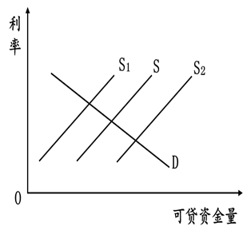

**湖南省2021年普通高中学业水平选择性考试**

**思想政治**

**注意事项：**

**1.答卷前，考生务必将自己的姓名、准考证号填写在本试卷和答题卡上。**

**2.回答选择题时，选出每小题答案后，用铅笔把答题卡上对应题目的答案标号涂黑。如需改动，用橡皮擦干净后，再选涂其他答案标号。回答非选择题时，将答案写在答题卡上。写在本试卷上无效。**

**3.考试结束后，将本试卷和答题卡一并交回。**

**一、选择题：本题共16小题，每小题3分，共48分。在每小题给出的四个选项中，只有一项是符合题目要求的。**

1\. “十三五”期间，我国居民收入水平稳步提高，恩格尔系数整体持续下降，服务消费迅速增长，绿色、智能、健康类商品销售日益红火，居民消费向个性化多样化转变。由此可以推断出（ ）

①居民收入持续增长使食品消费支出不断减少

②服务消费迅速增长能促进消费结构不断优化

③居民消费观念的变化是消费升级的关键因素

④消费升级能为塑造新的经济增长点提供引领

A. ①③ B. ①④ C. ②③ D. ②④

2\. 近年来新疆现代农业发展迅速。作为我国棉花的主产区，2020年全区棉花机械采摘率达到69.83%；“中国薰衣草之乡”伊犁，通过传感器监测、自动化农机耕作，薰衣草品质显著提高：“瓜果之乡”哈密，推广智慧农业云系统，瓜果种植更加精细更具特色。现代农业科技的广泛应用（ ）

①保障了新疆农产品的市场占有率

②提升了新疆农业的规模化集约化水平

③创新了新疆农产品生产和销售模式

④推动了新疆资源优势转化为经济优势

A. ①② B. ①③ C. ②④ D. ③④

3\. 湖南发展先进制造业有基础、有优势。截至2019年底，全省有16家企业和27个项目列入国家智能制造试点示范和专项项目，制造业占工业增加值比重超过90%，对经济增长贡献率超过30%。从“单项冠军”来看，工程机械产业规模连续10年居全国第一，电力机车产品全球市场份额第一。湖南先进制造业（ ）

①突破了关键技术“卡脖子”制约

②筑牢了湖南实体经济的发展基础

③成为了湖南高质量发展的重要引擎

④占据了全球制造业市场的主导地位

A. ①② B. ①④ C. ②③ D. ③④

4\. 假设存在封闭经济，其金融体系只有一个可贷资金市场。所有储蓄者都到这个市场存款，所有借款者都到这个市场贷款。在这个市场上存在一种利率，这个利率既是存款的利率，又是贷款的利率。下图中，S、D分别代表可贷资金供给曲线，需求曲线，其他条件不变时，关于政府预算赤字对可贷资金市场的影响，推断正确的是（ ）

A 政府预算赤字使可贷资金供给曲线由S移动到S1，导致市场利率上升

B. 政府预算赤字使可贷资金供给曲线由S移动到S2，导致市场利率上升

C. 政府预算赤字使可贷资金供给曲线由S移动到S1，导致市场利率下降

D. 政府预算赤字使可贷资金供给曲线由S移动到S2，导致市场利率下降

5\. 某县围绕油菜花做文章，百万亩花海吸引了大批国内外游客前往观光，综合旅游收入大幅增长，养蜂及蜂产品加工业、菜籽油加工业不断发展壮大，产品热销全国并出口海外。该县油菜花产业的发展说明（ ）

①打造市场消费热点，是赢得国内国际市场的关键

②增加供给的多样性，是扩大国际市场的必然选择

③打造全产业链，是促进国内国际双循环的有效路径

④做好基础性产品，是产业发展和市场延伸的有效保证

A. ①② B. ①③ C. ②④ D. ③④

6\. 按照中央要求，各地村（社区）换届中注重选优配强党组织带头人。根据某省数据，截至2021年1月12日，该省村（社区）全部完成换届。同上届相比，当选书记中致富带头人占比从58.3%提高到76.1%，全日制大学毕业生占比从4.6%提高到11.7%。选优配强村（社区）党组织带头人意在（ ）

①完善基层群众自治组织体系

②发挥党建对基层治理的引领作用

③保障基层群众依法正确行使民主权利

④提升基层党组织服务人民的能力和水平

A. ①③ B. ①④ C. ②③ D. ②④

7\. 某市践行新发展理念，专门成立公园城市建设管理局，整合零碎闲置地块，腾挪植绿空间，规划建设绿道，增加了优质生态资源供给，增强了城市环境承载能力。该市的做法旨在（ ）

①优化城市空间格局，提升居民生活品质

②推动城市转型发展，塑造地方政府形象

③增加政府职能权限，推进政府职能转变

④完善政府机构设置，增强城市治理能力

A. ①② B. ①④ C. ②③ D. ③④

8\. 第十三届全国人民代表大会第四次会议对《中华人民共和国全国人民代表大会组织法》作出修改，新增“全国人民代表大会及其常务委员会坚持全过程民主，始终同人民保持密切联系，倾听人民的意见和建议，体现人民意志，保障人民权益”条款。坚持“全过程民主”（ ）

①为人民更好行使国家权力夯实制度基础

②是我国基本政治制度的重大完善和发展

③体现了中国特色社会主义民主的真实性

④为我国民主政治建设提供根本法律保障

A. ①② B. ①③ C. ②④ D. ③④

9\. 2021年1月10日发布的《新时代的中国国际发展合作》白皮书指出，新时代的中国国际发展合作以推动构建人类命运共同体为引领，规模稳步增长，并更多向亚洲、非洲地区最不发达国家和“一带一路”发展中国家倾斜。中国积极开展国际发展合作（ ）

①是用实际行动践行多边主义 ②能够有效维护世界各国的核心利益

③有利于增强发展中国家的自主发展能力 ④保障了发展中国家享有平等的发展权利

A. ①③ B. ①④ C. ②③ D. ②④

10\. 雪景山水画是中国画的一个独特门类。宋代画家范宽的《雪山萧寺图》，寒山紧密相连，以一种坚不可摧、无以撼动的姿态见证着人世沧桑。当代画家傅抱石与关山月合绘的《江山如此多娇》，将“北国风光，千里冰封，万里雪飘”的壮阔场景表现得淋漓尽致，彰显出民族振奋的活力。从中我们可以感受到（ ）

A. 艺术的生命力是民族文化自信的根基

B. 对冰雪世界的钟爱是作者创作的源泉

C. 中华文化在传承与创新中恒久而鲜活

D. 艺术形式的多样性规定着作品的时代内涵

11\. 2020年11月举办的第三届中国国际进口博览会上，中外参观者对中国非物质文化遗产传承人展示的千层底布鞋制作技艺等赞不绝口；来自意大利的55个世界文化遗产被浓缩成5个主题，通过五面氛围大屏展示，给观众带来一场全方位的意式审美体验。中外文化遗产在进博会上的展示说明（ ）

①不同文化凝结着各自民族的智慧 ②文化的价值在于不同文化的交流

③文化与经济的交融增进了文明互鉴 ④文化的内涵因现代科技而不断丰富

A. ①② B. ①③ C. ②④ D. ③④

12\. 马克思说：“任何神话都是用想象和借助想象以征服自然力，支配自然力，把自然力加以形象化；因而，随着这些自然力之实际上被支配，神话也就消失了。”这表明（ ）

①神话作为一种社会意识具有历史性

②神话作为一种虚幻的意识不具有能动性

③神话作为一种主体想象源于主观自由创造

④神话随着人类实践能力的提高而失去存在的基础

A. ①② B. ①④ C. ②③ D. ③④

13\. 野生水稻长在水里，产量并不高。但是，我们的祖先发现，如果在水稻快成熟时突然把水放掉，水稻为了传种接代，会拼命长种子（稻谷），而且一株水稻会长出好几支稻穗。通过这种技术种植水稻，产量会提高，水稻因此成为人类的重要农作物。从水稻的这种生长特点，我们可以领悟出的人生道理有（ ）

①压力是产生动力的根源和条件 ②压力往往是人生成长的重要动力

③挫折能成为人生成长的重要财富 ④人生价值是在应对挫折中实现的

A. ①③ B. ①④ C. ②③ D. ②④

14\. 漫画《谈判的最好结果——让双方都感到自己是赢家》（作者郑辛遥）启示我们（ ）

①谈判双方的利益关系是矛盾关系

②谈判双方的斗争性寓于同一性之中

③谈判双方的思维方式决定着谈判结果

④谈判双方对结果的感觉与实在是一致的

A. ①② B. ①④ C. ②③ D. ③④

15\. 工业机器人的RV减速器核心技术一直被国外垄断。近年来，我国科研人员从源头上进行基础理论创新，通过不断科技攻关，最终掌握了“机器人关节RV减速器设计及制造工艺”的核心技术，并将研究成果成功实现产业化。这一事实佐证了（ ）

①实践基础上的理论创新能够推动科技创新

②创新性思维能够把观念的存在变为现实的存在

③对事物联系多样性的科学认知是理论创新的基础

④把科技成果转化为现实生产力是科技创新重要价值

A. ①② B. ①④ C. ②③ D. ③④

16\. 某校学生深入到一家工厂进行劳动体验。劳动结束后，甲同学说：“工人叔叔们教会了我们很多书本上学不到的知识。”乙同学说：“工厂的劳动让我体会到生产工艺的魅力，今后要努力学好本领，为社会创造更多的财富。”从同学们的感言中，我们认识到（ ）

①实践活动获得的知识总是高于书本知识

②在劳动实践中才能形成正确的价值判断

③劳动是深化和拓展书本知识的重要途径

④劳动是促进人的自由全面发展的重要手段

A. ①② B. ①③ C. ②④ D. ③④

**二、非选择题：共52分。**

17\. 阅读材料，完成下列要求。

全面建设社会主义现代化国家、实现中华民族伟大复兴的中国梦，需要培养更多高素质技术技能人才、能工巧匠、大国工匠。

材料一 改革开放40多年来，我国已建成世界规模最大的职业教育体系——1.13万所职业学校、3088万在校生，全国职业学校共开设1300余个专业和10余万个专业点，基本覆盖了国民经济各领域。当前，全国技能劳动者约1.65亿人，仅占就业人员总量的21.3%，高技能人才4791万人，仅占技能劳动者总数的29%。

材料二 技能报国，人人出彩。职业教育书写了许多“技能改变人生”的精彩故事。

|     |                                                                                                    |
|:--- |:-------------------------------------------------------------------------------------------------- |
| 故事一 | 小陈毕业于某职校机电一体化专业，目前在一家机器人工程有限公司担任项目调试工程师、部门主管。他主持开发的几项新型专利技术，拓展了产品应用空间，带动了公司往航空航天、医疗等机器人应用领域发展。     |
| 故事二 | 小刘通过在某职业学院农业装备应用技术专业的学习，学会了改装收割机、安装农机卫星导航系统、操作植保无人机等。现在，他已成为当地有名的农机能手、种粮大户，并带领村民成立了专业合作社，一起走上致富之路。 |
| 故事三 | 小林毕业于某旅游职校，多年的学习和实践，让她从一个拘谨的小姑娘变成了一个落落大方的优秀导游。深受游客欢迎的她，现在年薪逾10万元，家里的小土房也改建成了三层楼的大房子。               |

（1）根据材料一，概括我国技术技能人才培养的现状。

（2）结合上述材料，运用经济生活知识，说明培养更多高素质技术技能人才对我国经济社会发展的重要意义。

18\. 阅读材料，完成下列要求。

习近平总书记强调，人民群众对立法的期盼，已经不是有没有，而是好不好、管用不管用、能不能解决实际问题。十八大以来，党和国家坚持立法为民理念，更加注重立法质量，一大批反映人民呼声、体现人民利益的法律相继出台。

国家安全法、网络安全法的制定，食品安全法的修订等，坚决维护国家、人民的安全和利益；民法典全方位保障人民群众各项民事权利，守护人民福祉；高空抛物坠物、冒名顶替上大学等入刑，有力地维护社会公平和正义；环境保护法、大气污染防治法的修订，土壤污染防治法的出台等，助力打赢碧水蓝天净土保卫战……2021年立法项目更多于往年，教育法、妇女权益保障法等正在进行修订，法律援助法、社会救助法、突发公共卫生事件应对法等也在制定之中。

积极回应人民群众新要求新期待，不断完善中国特色社会主义法律体系，用法治保障人民安居乐业永远在路上。

结合材料，运用政治生活知识，分析我国新时代立法是如何积极回应人民群众新要求新期待的。

19\. 阅读材料，完成下列要求。

2021年是中国共产党成立一百周年，党的百年历史既是一部顺应时代潮流的历史，也是一部奋发有为的历史。

十月革命胜利，社会主义兴起，中国共产党从这个世界大势中产生，走在了时代前列；抗日战争时期，党从世界反法西斯战争和中国人民抗日救亡强烈愿望的大势出发，团结带领人民贏得了抗日战争伟大胜利；二战后，世界社会主义发展壮大，亚非拉民族解放运动风起云涌，中华人民共和国的成立和巩固正是顺应这一时代大潮的产物。

基于对世界大势和我国国情的深刻洞察，党的十一届三中全会作出党和国家工作中心转移的决策，一往无前拉开了改革开放的历史大幕。十八大以来，党胸怀中华民族伟大复兴战略全局和世界百年未有之大变局，开创了中国特色社会主义事业的新时代，奋力开启了全面建设社会主义现代化国家的新征程。

结合材料，运用社会历史发展的总趋势知识，说明中国共产党在百年历史中是如何顺势而为，推动中国社会进步发展的。

20\. 阅读材料，完成下列要求。

材料一 湖南是一方红色热土，走出了毛泽东、刘少奇、任弼时、彭德怀、贺龙、罗荣桓等老一辈革命家，发生了秋收起义、湘南暴动、通道转兵等重大历史事件，大批共产党人在这片热土谱写了感天动地的英雄壮歌。

“心怀天下，忧国忧民”自古以来就是流传在湖湘大地上的精神禀赋。正是怀着对国家民族前途命运的深重忧患，一批又一批湖南人坚定地走上了革命道路。“砍头不要紧，只要主义真”，无论前路如何凶险，他们始终坚信革命理想高于天。“敢为天下先”，他们对开创农村包围城市、武装夺取政权的革命道路发挥了极其重要的作用。“为有牺牲多壮志，敢教日月换新天”，他们为革命事业作出了巨大的牺牲，贡献了巨大的力量。

红色基因伴随奔腾不息的湘江水深深融入了三湘儿女的精神血脉，在新时代长征路上，“湖南红”将更加熠熠生辉。

结合材料，运用文化生活知识，说明湖南为什么这么“红”。

材料二 湖南红色资源丰富，红色基因厚重。习近平总书记赞誉湖南“十步之内，必有芳草”，多次讲述发生在湖南的“半条被子”和陈树湘“断肠明志”的动人故事。这些红色资源是开展党史学习教育的生动教材。

某中学拟开展党史学习教育研学活动，请你在以下三条研学线路中任选一条，根据所选线路拟定学习主题并说明活动意义，字数在150字左右。

A线：韶山（毛泽东同志故居）——长沙（新民学会旧址、岳麓书院、橘子洲头）

B线：汝城县沙洲村（“半条被子的温暖”专题陈列馆）——道县（陈树湘纪念馆）——通道县（通道转兵纪念馆）

C线：长沙（雷锋纪念馆）一花垣县十八洞村（精准扶贫“首倡地”）
