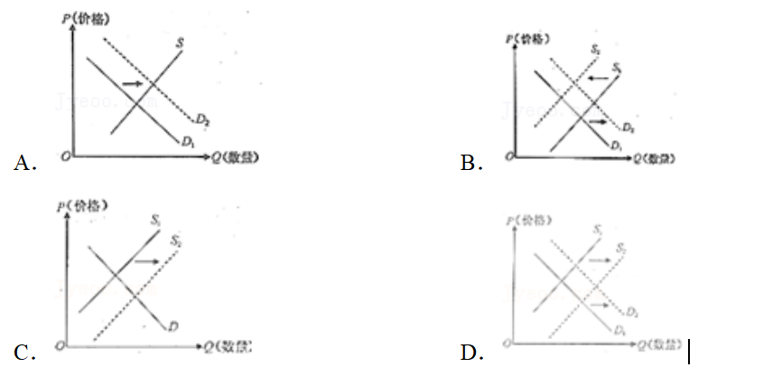
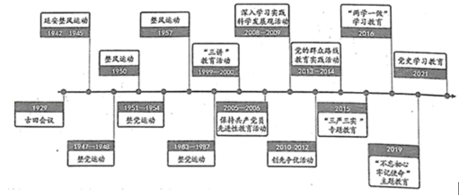

**2021年福建省新高考政治试卷**

**一、选择题：本题共15小题，每小题3分，共48分。在每小题给出的四个选项中，只有一项是最符合题目要求的。**

1．（3分）某国对食糖实施进口关税配额管理，即关税配额量内进口的食糖征收低关税，配额量外进口的食糖征收高关税。2021年，该国某地自由贸易港取消食糖进口关税配额管理，短期内会对当地以进口食糖为原料的甜品市场产生影响。若不考虑其他因素，能正确反映这种影响的图示是（图中D表示需求，S表示供给）（　　）

2．（3分）上世纪90年代以来，沙县小吃凭借风味独特和经济实惠逐步走向全国。几年前，为解决经营中出现的产品标准不一、产能供应不足等问题，沙县小吃从个体分散经营逐步走上集团化、品牌化、产业化的发展道路，实行“总公司、子公司、终端店”运作模式，现已发展成为在全球拥有8.8万家连锁店、年营业额近500亿元的大产业。小吃变成大产业主要得益于（　　）

> ①调整产业定位，主动适应市场变化
> 
> ②扩大经营规模，增加市场占有量
> 
> ③创新管理模式，完善公司组织机构
> 
> ④树立品牌形象，提升产品竞争力

A．①② B．①④ C．②③ D．③④

3．（3分）2021年3月，国家开发银行发行首单碳中和债，这是目前全球金融市场发行金额最大的专项绿色债券，用于助力实现碳达峰、碳中和目标，获得境内外投资机构踊跃认购。碳中和债的发行有利于（　　）

> ①拓宽绿色产业的融资渠道
> 
> ②满足金融市场投资多元化需要
> 
> ③增加绿色项目的投资收益
> 
> ④加快全球金融机构低碳化发展

A．①② B．①④ C．②③ D．③④

4．（3分）2020年中央经济工作会议将“强化反垄断和防止资本无序扩张“确定为2021年的重点任务之一；2021年1月，中央政法工作会议提出“加强反垄断和反不正当竞争执法司法”。国家重视反垄断和反不正当竞争是为了（　　）

> ①维护公平竞争秩序，保障市场主体合法权益
> 
> ②优化自由竞争环境，促进经营者跨越式发展
> 
> ③完善市场法制体系，保护消费者自主选择权
> 
> ④激发全社会创新活力，推动经济高质量发展

A．①② B．①④ C．②③ D．③④

5．（3分）厦门市某社区“对台服务工作法”入选民政部百个优秀社区工作法。该社区立足台商多、台胞多的特点，吸纳台胞加入社区发展理事会，鼓励台胞参与社区志愿服务，开展闽台文化交流活动，为台胞开设医保、子女就学等绿色通道，赢得台胞赞誉。“对台服务工作法”（　　）

> ①探索社区共建共治共享的治理新机制
> 
> ②增进两岸同胞情谊，改善台商的营商环境
> 
> ③调动台胞的积极性，主动参与社区民主选举
> 
> ④创新社区管理的组织形式，维护台胞合法权益

A．①② B．①③ C．②④ D．③④

6．（3分）新疆各民族是中华民族血脉相连的家庭成贵，国家通过产业扶贫、易地搬迁、就业扶贫、教育帮扶等手段帮助新疆各族人民脱贫。2020年11月，新疆维吾尔自治区3666个贫困村、308.9万现行标准下贫困人口全部脱贫，历史性地消除了绝对贫困。新疆全面打赢脱贫攻坚战说明（　　）

> ①国家积极推动新疆各民族平等团结共同繁荣
> 
> ②实现共同富裕能够消除新疆各民族间的差异
> 
> ③国家鼓励新疆各民族优势互补，实现共同发展
> 
> ④我国尊重和保障新疆各族人民的生存权和发展权

A．①② B．①④ C．②③ D．③④

7．（3分）2021年1月，我国政府决定对在涉华问题上严重侵犯中国主权、负有主要责任的28名美方人员实施制裁。这些人及其家属被禁止入境中国内地和香港、澳门，他们及其关联企业、机构也已被限制与中国打交道、做生意。我国政府作出这项制裁决定是基于（　　）

> ①中美两国国家性质和意识形态差异
> 
> ②我国致力于建设新型国际关系的需要
> 
> ③我国独立自主和平外交政策的基本立场
> 
> ④我国捍卫国家主权安全发展利益的决心

A．①② B．①③ C．②③ D．③④

8．（3分）近年来，中国杂技将“木兰从军”的感人故事、《西游记》的奇妙情节、《梁祝》的经典绝唱等融入表演中，实现从“技”到“剧”的转化，又借助现代舞美音乐，把形象美、动作美、情感美、精神美集于一身，摆脱了“单一技巧表演”的刻板印象，深受国内外观众的喜爱，在国际比赛中屡获大奖。中国杂技成功的秘诀在于（　　）

> ①继承传统，提高了技巧的难度系数
> 
> ②古为今用，汲取了传统文化的精华
> 
> ③锐意创新，丰富了节目的表现形式
> 
> ④面向世界，博采各国优秀文化成果

A．①② B．①④ C．②③ D．③④

9．（3分）2000多年前，驼队穿越苍茫大漠，走出了一条连接东西方的丝绸之路。中欧班列开通十年来，似“钢铁驼队”满载货物横跨东西，实现了“海丝”“陆丝”的无缝连接。在新冠肺炎疫情肆虐的“寒冬”里，中欧班列更化身为“救命通道”，把饱含深情厚谊的紧缺抗疫物资输送到沿线各国，为世界抗疫贡献了“中国力量”。中欧班列（　　）

> ①创造了经济与文化融合发展的条件
> 
> ②开辟了世界了解中华文化的新通道
> 
> ③促进不同文化在商贸往来中融为一体
> 
> ④成为世界文化繁荣发展的生动范本

A．①② B．①④ C．②③ D．③④

10．（3分）从第一个五年计划到第十四个五年规划，一以贯之的主题是把我国建设成为社会主义现代化国家。五年规划的编制不仅展现了“中国之治”的巨大魅力，更潜藏着中国实现现代化和经济社会持续健康发展的成功密码。这表明五年规划是（　　）

> ①关于我国不同阶段经济社会的能动反映
> 
> ②有目的有步骤地实现现代化的客观过程
> 
> ③我国对经济社会发展目标自觉选择的结果
> 
> ④指导我国社会主义现代化建设的行动指南

A．①② B．①③ C．②④ D．③④

1926年，福建省第一个中国共产党党支部在厦门大学囊萤楼成立，进步学生罗扬才担任书记。1927年，罗扬才遭国民党反动派逮捕，就义前留言：“为革命而死，我们觉得很光荣很快乐……不必为我悲伤，应踏着我们的血迹前进！”在中共厦大党支部号召下，大批有志青年加入到反帝反封建的斗争中。据此完成11～12题。

11. 1926年，中共厦大党支部成立，短短一个月就在厦门发展了18名党员，仅一年时间就在闽西南地区发展了230名党员，建立了28个党支部，形成了“汇聚囊萤之光，渐成燎原之火”的良好革命形势。从“囊萤之光”发展为“燎原之火”说明（　　）

> ①新事物的出现就实现了社会制度的变革
> 
> ②新事物的实质是抓住时机促成新的质变
> 
> ③新事物的发展总要经历从小到大的过程
> 
> ④新事物的生命力在于符合事物发展规律

A．①② B．①③ C．②④ D．③④

> 12\. 2019年，厦门大学全面启动培养学生党支部书记的“扬才计划”，引导优秀党员学生发挥示范带头作用。该计划以罗扬才的名字命名是为了更好地（　　）
> 
> ①改进教育方法，培育高尚的思想道德品质
> 
> ②传承红色基因，彰显革命精神的时代价值
> 
> ③弘扬时代精神，在学习中转化为物质力量
> 
> ④营造文化氛围，在潜移默化中树立正确人生观

A．①③ B．①④ C．②③ D．②④

13．（3分）获得2020年“最美科技工作者”称号的郝吉明院士，30多年前毅然放弃国外工作机会，回国专注于大气污染防治研究，为我国酸雨控制区面积大幅下降作出了杰出贡献。他说，“为打赢蓝天保卫战贡献力量，是我的专业，也是我的责任”。这启示我们（　　）

> ①要把握人生机遇才能实现自我价值
> 
> ②要把自我价值的实现与社会责任相统一
> 
> ③要把投身科技工作作为创造美好生活的根本途径
> 
> ④要把献身国家和人民事业作为人生的最高价值追求

A．①② B．①③ C．②④ D．③④

14．（3分）一生倾情于大自然的十九世纪思想家梭罗，以极大的热情去追寻各种植物种子的传播之旅，写成了一部传世名著《种子的信仰》。他说：“我相信种子里有强烈的信仰，相信你也同样是一颗种子，我正期待你奇迹的发生。”这表明（　　）

A．对种子的研究可以判断出种子有信仰

B．对种子的研究是相信种子有信仰的基础

C．相信种子有信仰是开展种子研究的最终目的

D．相信种子有信仰是推动种子研究的根本动大

15．（3分）2019年8月，特朗普政府通过了限制向贫困移民发放绿卡的新规。二十个州起诉联邦政府，要求撤回这项规定，其中有三个联邦地区法院对该规定签发临时禁令，禁止执行。2020年1月，联邦最高法院通过裁决，支持特朗普政府的移民新规定。这反映美国（　　）

> ①州政府有权干涉联邦政府事务
> 
> ②司法机关有权对政府的政策进行审查
> 
> ③总统权力必须通过司法裁决得以体现
> 
> ④联邦和州在各自的权限范围内享有最高权力

A．①② B．①③ C．②④ D．③④

16．（3分）为进一步扩大全国人大会议公开事项，增进人民群众对最高国家权力机关行使职权过程的了解，在十三届全国人大四次会议审议通过的全国人大议事规则修订案中，增加了“全国人民代表大会会议议程、日程和会议情况应当公开”“对人大通过的宪法修正案以公告的方式予以公布”等新规定。可见，修改全国人大议事规则是为了（　　）

A．丰富人民民主形式

B．加强宪法的实施和监督

C．坚持和完善人民代表大会制度

D．确立全国人大的组织和活动原则

**二、非选择题：共52分。**

17．（20分）阅读材料，完成下列要求。

> 材料一：数字福建在我省“遍地开花”。“滴滴农业”APP一键连接分散的农机与农户，实现了农忙季节的统一智能调度；“数字茶园”对种植评估、生产监测、终端溯源等进行全流程数字化、自动化和智能化管理，构建“从茶园到茶杯”的品质保障；“农业大数据平台”通过精准分析李果等特色产业的生产数量、价格走势、市场供求等数据，帮助小农户找到大市场；“畅游”微信小程序提供全域旅游720°VR视频观赏，实现线上线下实时互动……随着数字化应用和农业生产的融合日益加深，我省逐步实现了让信息多跑路，让技术多干活，让农户得实惠。\
> 材料二：人才是乡村振兴的关键。乡村振兴既需要掌握现代农业技术的新生代“田秀才”，又需要善于经营管理的先锋派“农创客”；既需要传承乡土文化的能工巧匠，又需要投身乡村建设的文艺爱好者；既需要扎根乡村的教育工作者，又需要推动乡村精神文明建设的农村追梦人……人们越来越意识到，乡村振兴是一篇大文章，需要各类人才共同书写。人才的培养要靠教育，教育无疑是乡村振兴战略的重要支点。\
> （1）结合材料一并运用经济知识，说明数字福建对我省农业现代化的积极作用。\
> （2）结合材料二，运用《文化生活》知识，分析教育为什么是乡村振兴的重要支点。

18．（10分）阅读材料，完成下列要求。

在首个“中国人民警察节”到来之际，“漳州110”被中宣部授予“时代楷模”荣誉称号。30多年来，“漳州110”坚持以人民为中心，始终把群众满意当成最大考量，做好“人民的保护神”，坚持服务群众和维护治安并重，小到送迷路老人回家、为市民找回失窃的电动车，大到徒手夺刀、冒着生命危险与歹徒搏斗……“漳州110”把快速反应作为生命线，推动警种业务从快接、快处到快侦、快破的转型升级，陆续推出24小时屯警街面、网格化巡逻接处警、合成作战警务等机制，在广泛倾听民意的基础上，“漳州110”微信报警正式上线，让群众可以通过微信视频、语音、文字、门牌扫码报警，兼顾了不同人群的实际需要，获得人民群众的好评。\
结合材料，运用《政治生活》知识，说明“漳州110”是如何坚持对人民负责原则的。

19．（6分）阅读材料，完成下列要求。

为了遏制新冠肺炎疫情全球蔓延，世界卫生组织同全球疫苗免疫联盟、流行病预防创新联盟联合推出“新冠疫苗实施计划”，旨在保障每个国家都能公平合理地获得疫苗。目前，全球疫苗分配呈现出国家间不平等且不公正的现象，发展中国家疫苗严重短缺。中国积极响应世卫组织倡议，加入“新冠疫苗实施计划”，尽己所能地推动疫苗成为全球公共产品，并决定向世卫组织提供首批1000万剂疫苗，为确保发展中国家都能够有平等机会获取疫苗作出贡献。\
结合材料，运用《国家和国际组织常识》中的“中国与国际组织”知识，说明中国为什么积极支持世界卫生组织促进疫苗公平分配。

20．（16分）阅读材料，完成下列要求。

> 材料一：先进性和纯洁性是马克思主义政党的本质属性。中国共产党自成立以来，始终把思想建党、理论强党贯穿于党的建设全过程（见图），防止党变质、变色、变味，背离党的宗旨而失去最广大人民支持和拥护。习近平总书记指出，不断增强党自我净化、自我完善、自我革新、自我提高能力，确保党始终成为中国特色社会主义事业的坚强领导核心。

材料二：习近平总书记指出，知史爱党，知史爱国。全国广大青年要深刻了解近代以来中国人民和中华民族不懈奋斗的光荣历史和伟大历程，坚定不移跟着中国共产党走，勇做走在时代前列的奋进者、开拓者、奉献者，让青春在为祖国、为人民、为民族的奉献中焕发出绚丽光彩！
（1）结合材料一，运用“矛盾的主要方面和次要方面的关系”原理，分析加强思想建党有利于保持党的先进性和纯洁性的原因。
（2）根据材料二，请你写一段毕业感言。
要求：①主题鲜明，观点正确，逻辑严谨；
②使用思想政治学科术语；
③严禁抄袭给定材料；
④字数不少于150字。
