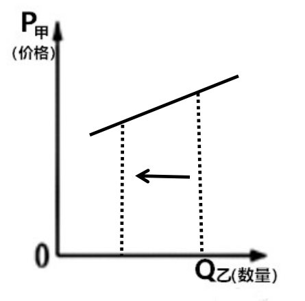
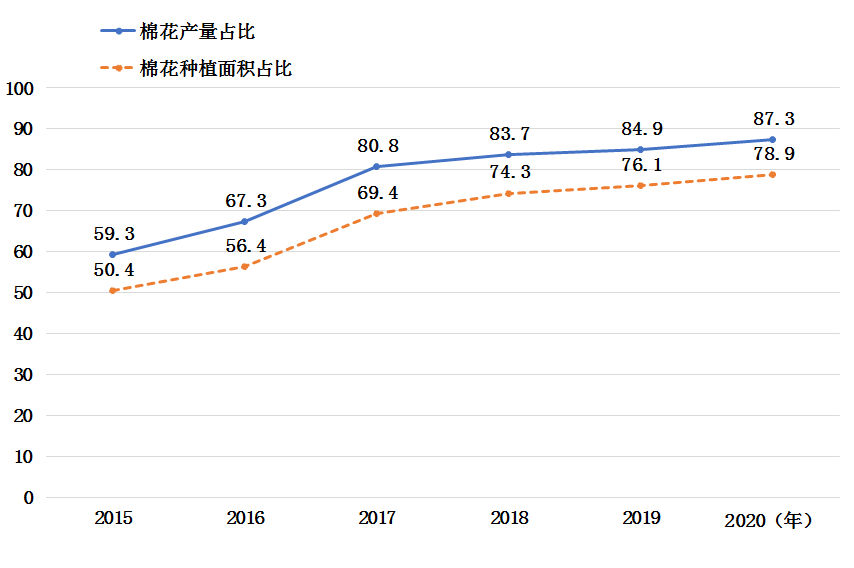
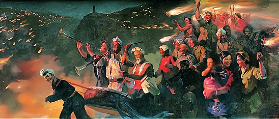

**2021年辽宁省普通高等学校招生选择性考试**

**思想政治**

**一、选择题**

1\. 下图反映了货币随着经济发展而产生发展的过程。对应图中不同阶段，下列经济现象出现的正确顺序是（ ）

①交换媒介出现 ②通货膨胀出现

③买卖行为发生分离 ④使用价值和价值的统一体出现

A. ④①②③ B. ①④②③ C. ④①③② D. ①③④②

2\. 某银行落实国家科技创新支持政策，向生产甲产品的某高科技企业提供低息贷款。若其他条件不变，下列图示能正确反映甲产品供求变化和乙产品（甲产品的替代商品）需求量变化情况的是（图中S表示供给，D表示需求）（ ）

A.  B. 

C.  D. 

3\. 林木产业具有“生产周期长、投资回收慢”的特征，存在资金紧张等问题。2021年4月2日，某银行向所在地林农发放149万元林票质押贷款，用于购买苗木、扩大生产，成为全国落地的首笔林票质押贷款。其意义在于（ ）

①增加林农收益，刺激消费，扩大内需

②利用金融资源配置引导实体经济绿色发展

③促进产业结构优化升级，发展现代产业体系

④打破森林资源流通性差壁垒，实现资源变资产的转换

A. ①③ B. ①④ C. ②③ D. ②④

4\. 某村实行“党支部+土地流转”模式，与多家企业签订承包合同，大力发展蔬菜种植产业。村民们从土地上解放出来，向二三产业转移。如今，“土地租金+工资收入+村集体分红”让村民们的“钱袋子”鼓了起来。该村（ ）

①实行多元要素参与分配，增加村民收入

②通过土地流转实现土地承包权主体转移

③推动农村工业化，实现向非农经济转移

④创新农业经营模式，为村民创造就业机会

A. ①③ B. ①④ C. ②③ D. ②④

5\. 2020年7月，某市市场监管部门利用互联网对餐饮行业进行智慧化监管，使消费者不仅能通过订餐平台实时看到后厨卫生环境及食品加工、制作的过程，还能通过扫描食品监管二维码看到菜品等被检查的情况。这一做法能够（ ）

①营造安全放心消费环境

②实现食品监管信息公开化

③促进餐饮业规范、高效经营

④保障消费者直接参与监管工作

A. ①② B. ①③ C. ②④ D. ③④

6\. 十三届全国人大四次会议表决通过了关于修改《中华人民共和国全国人民代表大会议事规则》的决定。修改后的议事规则增加了合理安排会议日程、推进会议文件资料电子化、采用网络视频方式等内容。上述修改内容有利于（ ）

①提高全国人大议事效率

②确保全国人大工作的正确政治方向

③为全国人大代表履职提供便利和服务

④完善人民代表大会制度的组织和活动原则

A. ①② B. ①③ C. ②④ D. ③④

7\. 受中共中央委托，民革中央开展了为期五年脱贫攻坚专项民主监督。民革中央坚持“寓监督于帮扶之中，寓帮扶于监督之中”的原则，深入调研，向中共中央、国务院报送监督报告，举办民革企业助力产业招商发展大会。此举（ ）

①表明中国共产党和各民主党派是通力合作的亲密友党

②是民主党派围绕脱贫攻坚进行协商、监督的制度安排

③彰显了我国新型政党制度凝聚共识谋大事的独特优势

④为中共中央、国务院进行科学执政和精准施策提供参考

A. ①③ B. ①④ C. ②③ D. ②④

8\. 内蒙古作为“模范自治区”，始终坚持党的领导，各民族守望相助，与党同心，与国同行。进入新时代，内蒙古自治区坚定不移贯彻新发展理念，社会繁荣稳定，成为我国安全稳定屏障和生态安全屏障。这表明（ ）

①建设好民族自治区有利于坚持总体国家安全观

②实现各民族共同繁荣是民族平等、民族团结的前提

③民族分布特点是我国实行民族区域自治的政治基础

④爱民族与爱祖国相统一有利于筑牢中华民族共同体意识

A. ①② B. ①④ C. ②③ D. ③④

9\. 据统计，西方国家的数据资源92%存储在美国，4%存储在欧洲，美国的电商及其社交平台占据欧洲绝大部分市场。2020年底，欧盟就“数字欧洲计划”约75亿欧元预算达成协议，将用于欧盟网络安全和数字基础设施建设等。此举有利于（ ）

①促进国际关系民主化发展

②推进欧盟数字一体化进程

③维护欧盟各成员国的数字主权

④提高在欧洲的互联网平台市场占有率

A. ①② B. ①④ C. ②③ D. ③④

10\. 2021年1月7日，美国国会联席会议确认新一任总统人选。新任总统就职当日签署了多项行政命令。截至1月23日，总统已任命约20名政府要员，而内阁成员尚需参议院完成上任前的确认流程。由此可知，在美国（ ）

①总统要对选民和国会负责

②总统选举结果需经国会认证

③总统有权任命政府的重要行政官员

④总统签署行政命令后由参议院确认

A. ①② B. ①④ C. ②③ D. ③④

11\. 长城是中华民族的代表性符号和中华文明的重要象征，随着时代的发展其内涵不断丰富。长征途中，毛泽东登上六盘山豪迈作词：“不到长城非好汉，屈指行程二万……今日长缨在手，何时缚住苍龙？”这表明，长城（ ）

①代表了先进文化的前进方向

②推动了革命文化交流与传播

③承载着革命理想高于天的长征精神

④被赋予共产党人不畏艰险的英雄气概

A. ①② B. ①④ C. ②③ D. ③④

12\. 国家雪车雪橇中心将承担2022年北京冬奥会相关比赛。秉持“山林场馆、生态冬奥”理念，结合自然地形和赛道要求，中心建成了国内首条符合冬奥会标准的雪车雪橇赛道。赛道如一条“飞龙”，盘旋舞动在崇山峻岭之间，成为中国山水文化与冬奥文化结合的载体。该中心的设计是（ ）

①将预先目的与特定事物相统一的结果

②按照美的规律对设计主题进行的表达

③精神自身以某种特定形式进行的外化

④受人主观因素影响的不确定性的展现

A. ①② B. ①③ C. ②④ D. ③④

13\. 气象观测经历了从经验积累到科学观测的不同阶段。20世纪以来，随着天气雷达、气象卫星等技术不断发展，监测和预警能力不断增强。人们通过对气象目标的探测、识别与评估，能够有效规避危险。这表明（ ）

①对气象的认识是人类建构与自然关系的开始

②气象观测技术的发展源于人类对自然的好奇

③气象观测技术的进步为探究自然提供先进的手段

④气象观测设备作为工具是人类器官的延伸和加强

A. ①② B. ①③ C. ②④ D. ③④

14\. 发酵是红茶加工过程中的关键工序，是通过一系列生化反应，使绿叶变为红色，并产生香气的主要过程。发酵过程中的温度、湿度、时间和通氧量是红茶外形色泽、汤色、香气、滋味等特有品质形成的重要因素。由此可知（ ）

①发酵是各个因素相互作用，共同完成的过程

②发酵是客观事物与外界因素偶然关联的过程

③红茶品质与发酵中各种条件的变化有因果关系

④红茶加工中的发酵是自在事物之间的本质联系

A. ①② B. ①③ C. ②④ D. ③④

15\. 春秋时期的晏婴说：“和如羹焉。水醯（xǐ，醋）醢（hǎi，肉酱）盐梅以烹鱼肉，燀（chǎn，炊煮）之以薪。宰夫和之，齐之以味，济其不及，以泄其过。”习近平总书记曾引用“和羹之美，在于合异”来说明文明因交流而多彩。这说明（ ）

①和羹中各种食材的味道消融，文明在交流中超越文明隔阂

②和羹的同一性制约各种食材的味道，文明以共存超越文化优越

③各种食材的不同规定着羹美的基本趋势，文明以互鉴超越文明冲突

④和羹的同一性是包含差别的具体同一，文明有差异性才能和谐共存

A. ①③ B. ①④ C. ②③ D. ②④

16\. 1950年，沈阳第一机器厂承担了铸造新中国第一枚金属国徽的任务。当时条件艰苦，工人们刻苦攻关，克服重重困难，完成了这项光荣的任务。这枚重达487公斤的国徽悬挂在天安门城楼上见证了历史的变迁和时代的发展。这告诉我们（ ）

①劳动者在劳动中确证并实现自身的价值

②劳动是人类改造自然维持自身生存的活动

③劳动是主体克服客体，为自然立法的活动

④劳动者既是历史的剧中人，又是历史的剧作者

A. ①③ B. ①④ C. ②③ D. ②④

**二、非选择题**

17\. 读材料，完成下列要求。

材料一

2015-2020年某省棉花产量与种植面积占全国比重

材料二 近年来，我国棉花年消费量稳定在750万吨至850万吨，其中有超过200万吨需要依赖进口。该省作为我国最重要的棉花产地，在保障我国棉花供给安全方面发挥重要作用。

近五年，该省棉花产量年均增长超过30万吨，棉花机收水平年均提高近10%，已有61个县市区种植棉花，近一半农户从事棉花生产，来自棉花的收入贡献了农民纯收入的30%。2019年，国家将“每年向该省提供20亿元纺织服装产业发展专项资金”优惠政策执行期延长至2023年。同年，该省开始推广“一主两辅”用种模式，制定和发布适合各地区种植的优良棉花品种目录，引导棉农从中选定1个主品种、2个搭配品种开展棉花种植；通过实施严格的商品种子质量安全认证制度，确保优良棉花品种的推广应用种的推广应用。

（1）解读材料一包含的经济信息。

（2）结合材料并运用经济知识，分析该省在保障我国棉花供给安全方面是如何发挥作用的。

18\. 阅读材料，完成下列要求。

进入新时代，快递业快速发展。习近平总书记多次对快递业作出重要指示，充分肯定快递业在服务经济社会发展和便利民众生活方面的重要作用。近年来，《中华人民共和国邮政法》数次修订，《快递暂行条例》等法规相继出台。

快递小哥不仅是“美好生活的创造者”，而且在国家政治生活中扮演着重要角色。国务院联防联控机制新闻发布会上，快递小哥建议，让快递员进入社区。全国政协邀请快递业等界别群众代表就“确保春运旅客安全便捷出行”话题进行问政。快递小哥在国庆节期间开展“为客户送国旗”活动，在疫情期间组建志愿团队，解决医护人员的出行、生活需求，化身“社区管家”，分担帮扶老人的工作。其中的突出贡献者入选“2020感动中国十大人物”。

快递小哥们说：“青春，有不同的时代召唤和选择，我们很幸运，感恩新时代给了我们人生出彩的机会。”

结合材料并运用政治生活知识，谈谈对“新时代给了快递小哥人生出彩的机会”的理解。

19\. 阅读材料，完成下列要求。

一代代艺术工作者创作的红色题材优秀艺术作品，镌刻着百年来中华民族最深刻的历史记忆，是一部部凝聚精神力量的生动教材。

★延安火炬 照亮前程

《延安火炬》油画1960蔡亮

《延安火炬》是中国美术史上的经典。该作品表现的是延安军民在抗战胜利当天连夜举行的盛大火炬游行场面。画面中八路军搀扶下的白发老妈妈被置于核心，无数舞动的火炬和陕北农民的起劲吹打烘托出欢乐的气氛。作品以画为体、以史为魂，历史大细节和美术作品的小细节相得益彰，表现了中国共产党依靠人民敢于争、敢于胜利的恢宏气派。

创作期间，艺术家反复查阅历史资料，多次前往延安体验生活，访问延安游行现场的亲历者，并从夜晚山间打着火把耕作的场景中获得灵感，最终创作出充满真情实感的作品。作品满足了人们的审美需求，激发了人们的情感共鸣，增强了人们的精神力量。

让美术经典述说党史，让延安火炬照亮前程。

（1）结合材料并运用文化生活知识，分析作品《延安火炬》从何而来。

★回望初心 践行使命

2021年是中国共产党成立100周年。面对中华民族伟大复兴战略全局和世界百年未有之大变局，回望过往的奋斗路，眺望前方的奋进路，必须旗帜鲜明地反对历史虚无主义，加强思想引导和理论辨析，正本清源，固本培元。

电视剧《觉醒年代》是献礼中国共产党百年华诞的精品力作。该剧以新文化运动和五四运动为叙事中心，全景展示近代中国惊心动魄的思想变革，真实再现了马克思主义在中国早期传播、中国共产党在中华大地上孕育和诞生的过程。

该剧在观众中掀起了巨大的情感波澜，让观众更真切地感受到那个时代的青年“为天地立心、为生民立命”的矢志情怀和敢为人先的革命品格；该剧引导人们体悟一代人有一代人的使命、担当，将中华民族的精神标识演绎得饱满动人；该剧述往思来，向史而新，从历史纵深处回望初心，鼓起共产党人迈进新征程、奋进新时代的精气神。

（2）结合材料并运用社会存在与社会意识关系的知识，阐述《觉醒年代》的时代价值。

20\. 阅读材料，完成下列要求。

古有《天工开物》今人继往开来

<table style="width:58%;">
<colgroup>
<col style="width: 57%" />
</colgroup>
<tbody>
<tr>
<td style="text-align: left;">
场景：跨越300年时空的对话

地点：超级杂交水稻试验田

人物：宋应星 明代著名科学家

袁隆平“杂交水稻之父”
</td>
</tr>
</tbody>
</table>

袁：我少年时读过您的《天工开物》，最喜欢里面的农业篇《乃粒》。

宋：我将中国传统农业、手工业的技艺技巧流程编撰成此书！我深入田间研究农业，梦想“五谷丰登，物阜民康”。

袁：“天下富足，禾下乘凉”是我的梦想。如今杂交水稻双季亩产达到1530公斤了。当年您进京赶考半年赶路，如今高铁三个时辰、大飞机一个时辰就深到了。火箭可把月球车载到月亮上了，深潜器可潜入大海万米之深了。

宋：壮哉！妙哉！中华文脉代代相传啊……

－－－－改编自中央电视台《典籍里的中国》之《天工开物》

结合材料并运用文化生活知识，选取对话中所涉及的某一信息作为主题，续写宋应星的感慨。

要求：主题鲜明，表述清晰，逻辑严谨，字数150-200字。
