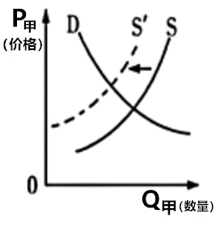
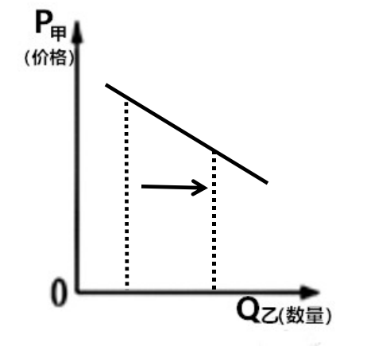
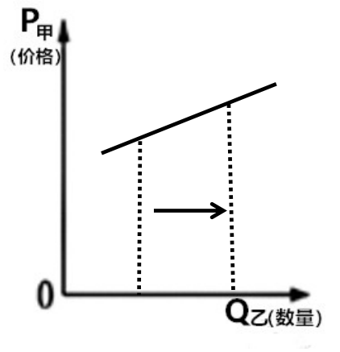
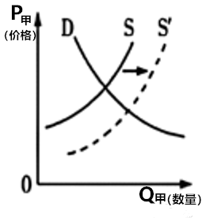
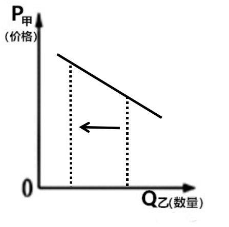

**2021年辽宁省普通高等学校招生选择性考试**

**思想政治**

**一、选择题**

1\. 下图反映了货币随着经济发展而产生发展的过程。对应图中不同阶段，下列经济现象出现的正确顺序是（ ）

①交换媒介出现 ②通货膨胀出现

③买卖行为发生分离 ④使用价值和价值的统一体出现

A. ④①②③ B. ①④②③ C. ④①③② D. ①③④②

【答案】C

【解析】

【分析】

【详解】④：依据图示，物物交换即出现商品，而商品是使用价值和价值的统一体，故④排第一。

①：到二阶段，以一般等价物为媒介的商品交换，则出现了交换媒介，故①排第二。

③：从货币产生的第二阶段开始，出现交换的媒介，商品的买卖行为在时空上发生分离，故③排第三。

②：到纸币的出现，会有通货膨胀现象的发生，故②排第四。

故本题的正确顺序是④①③②。

故本题选C。

2\. 某银行落实国家科技创新支持政策，向生产甲产品的某高科技企业提供低息贷款。若其他条件不变，下列图示能正确反映甲产品供求变化和乙产品（甲产品的替代商品）需求量变化情况的是（图中S表示供给，D表示需求）（ ）

A.  B. 

C.  D. 

【答案】D

【解析】

【分析】

【详解】向生产甲产品的某高科技企业提供低息贷款，这样会调动生产甲产品的积极性，导致甲商品的供给增加，供给曲线向右平移，在甲产品的需求不变情况下，甲商品价格下降；甲商品价格下降，对甲的需求会增加，而甲乙互为替代品，则对乙产品的需求会减少，因此此时甲的价格与乙的需求量成正相关。

A：选项A左图表示甲产品的需求不变，供给减少，甲价格上涨。右图表示甲乙互为替代品，甲的价格与乙的需求量成负相关，故A不选。

B：选项B左图表示甲产品的供给减少，右图表示乙商品的需求增加，故B不选。

C：选项C左图表示甲商品的需求不变，供给增加，价格下降。右图表示甲乙互为替代品，但甲的价格与乙产品的需求成负相关，故C不选。

D：选项D左图表示甲商品的需求不变，的供给增加，价格下降。右图表示甲乙互为替代品，甲的价格与乙的需求量成正相关，故D入选。

故本题选D。

3\. 林木产业具有“生产周期长、投资回收慢”特征，存在资金紧张等问题。2021年4月2日，某银行向所在地林农发放149万元林票质押贷款，用于购买苗木、扩大生产，成为全国落地的首笔林票质押贷款。其意义在于（ ）

①增加林农收益，刺激消费，扩大内需

②利用金融资源配置引导实体经济绿色发展

③促进产业结构优化升级，发展现代产业体系

④打破森林资源流通性差的壁垒，实现资源变资产的转换

A. ①③ B. ①④ C. ②③ D. ②④

【答案】D

【解析】

【详解】①：材料反映银行助力林业产业发展，材料不涉及“刺激消费，扩大内需”，①排除。

②④：林票质押，不仅打破森林资源流通性差的壁垒，完善林票资本权能，实现资源变资产的转换，利用金融资源配置引导实体经济绿色发展，②④正确。

③：材料未涉及产业结构优化升级，③排除。

故本题选D。

4\. 某村实行“党支部+土地流转”模式，与多家企业签订承包合同，大力发展蔬菜种植产业。村民们从土地上解放出来，向二三产业转移。如今，“土地租金+工资收入+村集体分红”让村民们的“钱袋子”鼓了起来。该村（ ）

①实行多元要素参与分配，增加村民收入

②通过土地流转实现土地承包权主体转移

③推动农村工业化，实现向非农经济转移

④创新农业经营模式，为村民创造就业机会

A. ①③ B. ①④ C. ②③ D. ②④

【答案】B

【解析】

【分析】

【详解】①：“土地租金+工资收入+村集体分红”让村民们的“钱袋子”鼓了起来，这表明实行多元要素参与分配，增加村民收入，故①入选。

②：应该是通过土地流转实现土地经营权主体转移，故②不选。

③：材料并未涉及推动农村工业化，故③不选。

④：某村实行“党支部+土地流转”模式，与多家企业签订承包合同，大力发展蔬菜种植产业。村民们从土地上解放出来，向二三产业转移，这表明创新农业经营模式，为村民创造就业机会，故④入选。

故本题选B。

5\. 2020年7月，某市市场监管部门利用互联网对餐饮行业进行智慧化监管，使消费者不仅能通过订餐平台实时看到后厨卫生环境及食品加工、制作的过程，还能通过扫描食品监管二维码看到菜品等被检查的情况。这一做法能够（ ）

①营造安全放心的消费环境

②实现食品监管信息公开化

③促进餐饮业规范、高效经营

④保障消费者直接参与监管工作

A. ①② B. ①③ C. ②④ D. ③④

【答案】A

【解析】

【详解】①：市场监管部门对餐饮行业进行智慧化监管，这有利于营造安全放心的消费环境，①符合题意。

②：消费者不仅能通过订餐平台实时看到后厨卫生环境及食品加工、制作的过程，还能通过扫描食品监管二维码看到菜品等被检查的情况，这说明市场监管部门对餐饮行业进行智慧化监管有利于实现食品监管信息公开化，②符合题意。

③：市场监管部门对餐饮行业进行智慧化监管，有利于促进餐饮业规范经营，但与企业高效经营没有直接必然的联系，③排除。

④：消费者不能直接参与监管工作，④错误。

故本题选A。

6\. 十三届全国人大四次会议表决通过了关于修改《中华人民共和国全国人民代表大会议事规则》的决定。修改后的议事规则增加了合理安排会议日程、推进会议文件资料电子化、采用网络视频方式等内容。上述修改内容有利于（ ）

①提高全国人大议事的效率

②确保全国人大工作的正确政治方向

③为全国人大代表履职提供便利和服务

④完善人民代表大会制度的组织和活动原则

A. ①② B. ①③ C. ②④ D. ③④

【答案】B

【解析】

【分析】

【详解】①③：修改后议事规则增加了合理安排会议日程、推进会议文件资料电子化、采用网络视频方式等内容。这有利于提高全国人大议事的效率，为全国人大代表履职提供便利和服务，故①③入选。

②：材料中并不能确保全国人大工作的正确政治方向，故②不选。

④：人民代表大会制度的组织和活动原则是民主集中制，材料并未涉及完善人民代表大会制度的组织和活动原则，故④不选。

故本题选B。

7\. 受中共中央委托，民革中央开展了为期五年的脱贫攻坚专项民主监督。民革中央坚持“寓监督于帮扶之中，寓帮扶于监督之中”的原则，深入调研，向中共中央、国务院报送监督报告，举办民革企业助力产业招商发展大会。此举（ ）

①表明中国共产党和各民主党派是通力合作的亲密友党

②是民主党派围绕脱贫攻坚进行协商、监督的制度安排

③彰显了我国新型政党制度凝聚共识谋大事的独特优势

④为中共中央、国务院进行科学执政和精准施策提供参考

A. ①③ B. ①④ C. ②③ D. ②④

【答案】A

【解析】

【分析】

【详解】①③：受中共中央委托，民革中央开展了为期五年的脱贫攻坚专项民主监督。深入调研，向中共中央、国务院报送监督报告，举办民革企业助力产业招商发展大会。此举表明中国共产党和各民主党派是通力合作的亲密友党，彰显了我国新型政党制度凝聚共识谋大事的独特优势，故①③入选。

②：材料中的举措并不是制度安排，故②不选。

④：国务院属于行政机关，不能科学执政，故④不选。

故本题选A。

8\. 内蒙古作为“模范自治区”，始终坚持党的领导，各民族守望相助，与党同心，与国同行。进入新时代，内蒙古自治区坚定不移贯彻新发展理念，社会繁荣稳定，成为我国安全稳定屏障和生态安全屏障。这表明（ ）

①建设好民族自治区有利于坚持总体国家安全观

②实现各民族共同繁荣是民族平等、民族团结的前提

③民族分布特点是我国实行民族区域自治的政治基础

④爱民族与爱祖国相统一有利于筑牢中华民族共同体意识

A. ①② B. ①④ C. ②③ D. ③④

【答案】B

【解析】

【分析】

【详解】①④：始终坚持党的领导，各民族守望相助，与党同心，与国同行，坚定不移贯彻新发展理念，社会繁荣稳定，成为我国安全稳定屏障和生态安全屏障。这表明建设好民族自治区有利于坚持总体国家安全观，爱民族与爱祖国相统一有利于筑牢中华民族共同体意识，故①④入选。

②：民族平等、民族团结是实现各民族共同繁荣的前提，故②不选。

③：民族分布特点是我国实行民族区域自治的现实情况，各民族在长期斗争中形成的相互依存的民族关系是实行民族区域自治的社会政治基础，故③不选。

故本题选B。

9\. 据统计，西方国家的数据资源92%存储在美国，4%存储在欧洲，美国的电商及其社交平台占据欧洲绝大部分市场。2020年底，欧盟就“数字欧洲计划”约75亿欧元预算达成协议，将用于欧盟网络安全和数字基础设施建设等。此举有利于（ ）

①促进国际关系民主化发展

②推进欧盟数字一体化进程

③维护欧盟各成员国的数字主权

④提高在欧洲的互联网平台市场占有率

A. ①② B. ①④ C. ②③ D. ③④

【答案】D

【解析】

【详解】①：“数字欧洲计划”与国际关系民主化没有关系，①排除。

②：材料并未反映“推进欧盟数字一体化进程”，②排除。

③④：“西方国家的数据资源92%存储在美国，4%存储在欧洲，美国的电商及其社交平台占据欧洲绝大部分市场”说明欧洲意欲提高在欧洲的互联网平台市场占有率，维护欧盟各成员国的数字主权，③④符合题意。

故本题选D。

10\. 2021年1月7日，美国国会联席会议确认新一任总统人选。新任总统就职当日签署了多项行政命令。截至1月23日，总统已任命约20名政府要员，而内阁成员尚需参议院完成上任前的确认流程。由此可知，在美国（ ）

①总统要对选民和国会负责

②总统选举结果需经国会认证

③总统有权任命政府的重要行政官员

④总统签署行政命令后由参议院确认

A. ①② B. ①④ C. ②③ D. ③④

【答案】D

【解析】

【分析】

【详解】③④：新任总统就职当日签署了多项行政命令。截至1月23日，总统已任命约20名政府要员，而内阁成员尚需参议院完成上任前的确认流程。由此可知，在美国总统有权任命政府的重要行政官员，总统签署行政命令后由参议院确认，故③④入选。

①：总统要对选民和宪法负责，而不是对国会负责，故①不选。

②：总统选举结果无需经国会认证，故②不选。

故本题选D。

11\. 长城是中华民族的代表性符号和中华文明的重要象征，随着时代的发展其内涵不断丰富。长征途中，毛泽东登上六盘山豪迈作词：“不到长城非好汉，屈指行程二万……今日长缨在手，何时缚住苍龙？”这表明，长城（ ）

①代表了先进文化的前进方向

②推动了革命文化的交流与传播

③承载着革命理想高于天的长征精神

④被赋予共产党人不畏艰险的英雄气概

A. ①② B. ①④ C. ②③ D. ③④

【答案】D

【解析】

【分析】

【详解】①：中国共产党代表了先进文化的前进方向，故①不选。

②：材料并未涉及革命文化的交流与传播，故②不选。

③④：“不到长城非好汉，屈指行程二万……今日长缨在手，何时缚住苍龙？”这表明，长城被赋予了文化内涵，承载着革命理想高于天的长征精神，被赋予共产党人不畏艰险的英雄气概，故③④入选。

故本题选D。

12\. 国家雪车雪橇中心将承担2022年北京冬奥会相关比赛。秉持“山林场馆、生态冬奥”理念，结合自然地形和赛道要求，中心建成了国内首条符合冬奥会标准的雪车雪橇赛道。赛道如一条“飞龙”，盘旋舞动在崇山峻岭之间，成为中国山水文化与冬奥文化结合的载体。该中心的设计是（ ）

①将预先目与特定事物相统一的结果

②按照美的规律对设计主题进行的表达

③精神自身以某种特定形式进行的外化

④受人主观因素影响的不确定性的展现

A. ①② B. ①③ C. ②④ D. ③④

【答案】A

【解析】

【分析】

【详解】①②：秉持“山林场馆、生态冬奥”理念，结合自然地形和赛道要求，建成了国内首条符合冬奥会标准的雪车雪橇赛道。赛道如一条“飞龙”，盘旋舞动在崇山峻岭之间，成为中国山水文化与冬奥文化结合的载体。这表明该中心的设计是将预先目的与特定事物相统一的结果，按照美的规律对设计主题进行的表达，故①②入选。

③：该选项夸大了精神自身的作用，该选项的说法犯了唯心主义错误，故③不选。

④：该中心的设计受人主观因素影响，但并不是不确定性的展现，故④不选。

故本题选A。

13\. 气象观测经历了从经验积累到科学观测的不同阶段。20世纪以来，随着天气雷达、气象卫星等技术不断发展，监测和预警能力不断增强。人们通过对气象目标的探测、识别与评估，能够有效规避危险。这表明（ ）

①对气象的认识是人类建构与自然关系的开始

②气象观测技术的发展源于人类对自然的好奇

③气象观测技术的进步为探究自然提供先进的手段

④气象观测设备作为工具是人类器官的延伸和加强

A. ①② B. ①③ C. ②④ D. ③④

【答案】D

【解析】

【分析】

【详解】①：对气象的认识有利于人类建构与自然关系，但不是二者关系的开始，故①不选。

②：气象观测技术的发展源于人类实践，而不是源于对自然的好奇，故②不选。

③④：随着天气雷达、气象卫星等技术不断发展，监测和预警能力不断增强。人们通过对气象目标的探测、识别与评估，能够有效规避危险。这表明气象观测技术的进步为探究自然提供先进的手段，气象观测设备作为工具是人类器官的延伸和加强，故③④入选。

故本题选D。

14\. 发酵是红茶加工过程中的关键工序，是通过一系列生化反应，使绿叶变为红色，并产生香气的主要过程。发酵过程中的温度、湿度、时间和通氧量是红茶外形色泽、汤色、香气、滋味等特有品质形成的重要因素。由此可知（ ）

①发酵是各个因素相互作用，共同完成的过程

②发酵是客观事物与外界因素偶然关联的过程

③红茶品质与发酵中各种条件的变化有因果关系

④红茶加工中的发酵是自在事物之间的本质联系

A. ①② B. ①③ C. ②④ D. ③④

【答案】B

【解析】

【分析】

【详解】①③：发酵过程中的温度、湿度、时间和通氧量是红茶外形色泽、汤色、香气、滋味等特有品质形成的重要因素。由此可知发酵是各个因素相互作用，共同完成的过程，红茶品质与发酵中各种条件的变化有因果关系，故①③入选。

②：发酵是客观事物与外界因素必然关联的过程，而不是偶然关联的过程，故②不选。

④：红茶加工中的发酵是人为事物之间的本质联系，而不是自在事物的联系，故④不选。

故本题选B。

15\. 春秋时期的晏婴说：“和如羹焉。水醯（xǐ，醋）醢（hǎi，肉酱）盐梅以烹鱼肉，燀（chǎn，炊煮）之以薪。宰夫和之，齐之以味，济其不及，以泄其过。”习近平总书记曾引用“和羹之美，在于合异”来说明文明因交流而多彩。这说明（ ）

①和羹中各种食材的味道消融，文明在交流中超越文明隔阂

②和羹的同一性制约各种食材的味道，文明以共存超越文化优越

③各种食材的不同规定着羹美的基本趋势，文明以互鉴超越文明冲突

④和羹的同一性是包含差别的具体同一，文明有差异性才能和谐共存

A. ①③ B. ①④ C. ②③ D. ②④

【答案】B

【解析】

【分析】

【详解】①④：“和羹之美，在于合异”意为羹汤之所以美味可口,在于把各种不同的调料合到了一起。习近平总书记用“和羹之美，在于合异”来说明文明因交流而多彩。这说明和羹中各种食材的味道消融，文明在交流中超越文明隔阂，说明和羹的同一性是包含差别的具体同一，文明有差异性才能和谐共存，故①④入选。

②：材料强调的是矛盾的同一性离不开斗争性，而该选项强调的是斗争性离不开同一性，故②不选。

③：矛盾双方的内在同一性规定着事物发展的基本趋势，故③不选。

故本题选B。

16\. 1950年，沈阳第一机器厂承担了铸造新中国第一枚金属国徽的任务。当时条件艰苦，工人们刻苦攻关，克服重重困难，完成了这项光荣的任务。这枚重达487公斤的国徽悬挂在天安门城楼上见证了历史的变迁和时代的发展。这告诉我们（ ）

①劳动者在劳动中确证并实现自身的价值

②劳动是人类改造自然维持自身生存的活动

③劳动是主体克服客体，为自然立法的活动

④劳动者既是历史的剧中人，又是历史的剧作者

A. ①③ B. ①④ C. ②③ D. ②④

【答案】B

【解析】

【分析】

【详解】①④：沈阳第一机器厂的工人们刻苦攻关，克服重重困难，铸造新中国第一枚金属国徽，这告诉我们劳动者在劳动中确证并实现自身的价值，劳动者既是历史的剧中人，又是历史的剧作者，故①④入选。

②：材料并未涉及人类改造自然，而且劳动不仅仅改造自然界，故②不选。

③：劳动是主体改造客体的活动，并且自然界是客观的，不以人的意志为转移，为自然立法的说法错误，故③不选。

故本题选B。

**二、非选择题**

17\. 读材料，完成下列要求。

材料一

2015-2020年某省棉花产量与种植面积占全国比重

材料二 近年来，我国棉花年消费量稳定在750万吨至850万吨，其中有超过200万吨需要依赖进口。该省作为我国最重要的棉花产地，在保障我国棉花供给安全方面发挥重要作用。

近五年，该省棉花产量年均增长超过30万吨，棉花机收水平年均提高近10%，已有61个县市区种植棉花，近一半农户从事棉花生产，来自棉花的收入贡献了农民纯收入的30%。2019年，国家将“每年向该省提供20亿元纺织服装产业发展专项资金”优惠政策执行期延长至2023年。同年，该省开始推广“一主两辅”用种模式，制定和发布适合各地区种植的优良棉花品种目录，引导棉农从中选定1个主品种、2个搭配品种开展棉花种植；通过实施严格的商品种子质量安全认证制度，确保优良棉花品种的推广应用种的推广应用。

（1）解读材料一包含的经济信息。

（2）结合材料并运用经济知识，分析该省在保障我国棉花供给安全方面是如何发挥作用的。

【答案】（1）2015-2020年某省棉花种植面积和产量占比均逐年提高，随着棉花种植面积的增加，棉花产量逐年提高。

（2）①国家运用经济手段进行宏观调控，发挥财政在优化资源配置方面的作用，增加财政补贴，为其奠定坚实的物质基础，国家将“每年向该省提供20亿元纺织服装产业发展专项资金”优惠政策执行期延长至2023年。

②运用新型用种模式，调整产品结构，提高产品质量，树立良好的信誉和形象该省开始推广“一主两辅”用种模式，制定和发布适合各地区种植的优良棉花品种目录，引导棉农从中选定1个主品种、2个搭配品种开展棉花种植。

③运用行政手段宏观调控实施严格的商品种子质量安全认证制度，提高产品质量标准，通过实施严格的商品种子质量安全认证制度，确保优良棉花品种的推广应用种的推广应用。

【解析】

【分析】背景素材：2015-2020年某省棉花产量与种植面积占全国比重和棉花生产

考点考查：宏观调控、企业经营成功的因素等有关知识

能力考查：获取和解读信息的能力、调动和运用知识的能力，描述和阐述事物的能力

核心素养：政治认同、科学精神

【小问1详解】

第一步：审设问，明确主体、作答范围、问题限定和作答角度。

本题要求解读材料一包含的经济信息。本题属于图表类试题，解答此类试题，应注意把握表头、图表本身以及小注的有关信息。

第二步：审材料，通过标点符号、段落等，提取材料有效信息。

有效信息①：表头是2015-2020年某省棉花产量与种植面积占全国比重，由折线变化可知→可联系棉花种植面积和产量占比均逐年提高，随着棉花种植面积的增加，棉花产量逐年提高。

第三步：整合信息，组织答案。

得分点①：2015-2020年某省棉花种植面积和产量占比均逐年提高，随着棉花种植面积的增加，棉花产量逐年提高+表头是2015-2020年某省棉花产量与种植面积占全国比重，由折线变化。

【小问2详解】

第一步：审设问，明确主体、作答范围、问题限定和作答角度。

本题要求结合材料并运用经济知识，分析该省在保障我国棉花供给安全方面是如何发挥作用的。本题属于措施类试题，理论范围是经济知识，解答时，考生应首先调动教材相关知识，然后结合材料提取有效信息，坚持理论与材料相结合。

第二步：审材料，通过标点符号、段落等，提取材料有效信息。

有效信息①：国家将“每年向该省提供20亿元纺织服装产业发展专项资金”优惠政策执行期延长至2023年→可联系国家运用经济手段进行宏观调控，发挥财政在优化资源配置方面的作用，增加财政补贴，为其奠定坚实的物质基础。

有效信息②：该省开始推广“一主两辅”用种模式，制定和发布适合各地区种植的优良棉花品种目录，引导棉农从中选定1个主品种、2个搭配品种开展棉花种植→可联系运用新型用种模式，调整产品结构，提高产品质量，树立良好的信誉和形象。

有效信息③：通过实施严格的商品种子质量安全认证制度，确保优良棉花品种的推广应用种的推广应用→可联系运用行政手段宏观调控实施严格的商品种子质量安全认证制度，提高产品质量标准。

第三步：整合信息，组织答案。

得分点①：国家运用经济手段进行宏观调控，发挥财政在优化资源配置方面的作用，增加财政补贴，为其奠定坚实的物质基础+国家将“每年向该省提供20亿元纺织服装产业发展专项资金”优惠政策执行期延长至2023年。

得分点②：运用新型用种模式，调整产品结构，提高产品质量，树立良好的信誉和形象+该省开始推广“一主两辅”用种模式，制定和发布适合各地区种植的优良棉花品种目录，引导棉农从中选定1个主品种、2个搭配品种开展棉花种植。

得分点③：运用行政手段宏观调控实施严格的商品种子质量安全认证制度，提高产品质量标准+通过实施严格的商品种子质量安全认证制度，确保优良棉花品种的推广应用种的推广应用。

【点睛】措施类主观题的解题四部曲

> 一、抓主体,措施类的题,解题最关键的是明确谁是措施的实施者(主体),有几个措施的实施者答案就有几个角度,在表述措施的时要以题目设置的情景,站在不同主体角色的视角立场上回答不同内容,所答内容符合角色身份,一定要注意各司其职,切记不要越俎代庖,最后别忘对措施进行综合。
> 
> 二、定范围,要明确答题的范围,是从经济生活中找对策,还是从政治生活、文化生活或是哲学中找对策,确定了范围,才能找到正确的答题方向。
> 
> 三、找措施,从教材中找措施。要认真回想教材相关方面的知识,不能随意乱想。从材料中找措施。①如果材料呈现的是问题,那么材料中问题的反面就是方法。如:种植单一的反面就是多种经营;技术水平低的反面就是发展高新技术,科技创新,科技兴国,用先进科技武装企业和职工;失业现象的反面就是扩大就业。②如果材料呈现的是正确做法,那么只需要对材料中的具体做法加以概括并且结合教材内容组织答案就可以了。从当前时政热点、党和国家重大政策中找措施。
> 
> 四、联材料,明确了主体、答题范围,找到具体措施后,要联系材料,组织答案,教材中的基本理论必须与题的实际材料结合好,体现理论联系实际的能力。

18\. 阅读材料，完成下列要求。

进入新时代，快递业快速发展。习近平总书记多次对快递业作出重要指示，充分肯定快递业在服务经济社会发展和便利民众生活方面的重要作用。近年来，《中华人民共和国邮政法》数次修订，《快递暂行条例》等法规相继出台。

快递小哥不仅是“美好生活的创造者”，而且在国家政治生活中扮演着重要角色。国务院联防联控机制新闻发布会上，快递小哥建议，让快递员进入社区。全国政协邀请快递业等界别群众代表就“确保春运旅客安全便捷出行”话题进行问政。快递小哥在国庆节期间开展“为客户送国旗”活动，在疫情期间组建志愿团队，解决医护人员的出行、生活需求，化身“社区管家”，分担帮扶老人的工作。其中的突出贡献者入选“2020感动中国十大人物”。

快递小哥们说：“青春，有不同的时代召唤和选择，我们很幸运，感恩新时代给了我们人生出彩的机会。”

结合材料并运用政治生活知识，谈谈对“新时代给了快递小哥人生出彩的机会”的理解。

【答案】①中国共产党的领导是中国特色社会主义的最本质特征，是中国特色社会主义制度的最大优势，坚持党的领导，发挥党总揽全局，协调各方的领导核心作用，习近平总书记多次对快递业作出重要指示，充分肯定快递业在服务经济社会发展和便利民众生活方面的重要作用。

②依法治国是党领导人民治理国家的基本方略，通过《中华人民共和国邮政法》数次修订，《快递暂行条例》等法规相继出台为我国快递业的发展提供了法律依据和保障。

③政府依法履职，坚持为人民服务的宗旨和对人民负责的原则，国务院联防联控机制新闻发布会上，快递小哥建议，让快递员进入社区。

④人民政协汇聚了各党派团体、各族各界代表人士，具有独特的政治优势，积极履职，参政议政，发挥其全国政协邀请快递业等界别群众代表就“确保春运旅客安全便捷出行”话题进行问政。

⑤公民坚持权利和义务相统一的原则，坚持个人利益与国家利益相结合的原则，积极履行义务，快递小哥在国庆节期间开展“为客户送国旗”活动，在疫情期间组建志愿团队，解决医护人员的出行、生活需求，化身“社区管家”，分担帮扶老人的工作

【解析】

分析】背景素材：快递业快速发展

考点考查：党的领导、依法治国等有关知识

能力考查：获取和解读信息的能力、调动和运用知识的能力，描述和阐述事物的能力

核心素养：政治认同、科学精神

【详解】第一步：审设问，明确主体、作答范围、问题限定和作答角度。

本题要求结合材料并运用政治生活知识，谈谈对“新时代给了快递小哥人生出彩的机会”的理解。本题属于分析说明类试题，理论范围是政治生活知识。解答时，考生应首先调动教材相关知识，然后结合材料提取有效信息，坚持理论与材料相结合。

第二步：审材料，通过标点符号、段落等，提取材料有效信息。

有效信息①：习近平总书记多次对快递业作出重要指示，充分肯定快递业在服务经济社会发展和便利民众生活方面的重要作用→可联系中国共产党的领导是中国特色社会主义的最本质特征，是中国特色社会主义制度的最大优势，坚持党的领导，发挥党总揽全局，协调各方的领导核心作用。

有效信息②：近年来，《中华人民共和国邮政法》数次修订，《快递暂行条例》等法规相继出台→可联系依法治国是党领导人民治理国家的基本方略，为我国快递业的发展提供了法律依据和保障。

有效信息③：国务院联防联控机制新闻发布会上，快递小哥建议，让快递员进入社区→可联系政府依法履职，坚持为人民服务的宗旨和对人民负责的原则。

有效信息④：全国政协邀请快递业等界别群众代表就“确保春运旅客安全便捷出行”话题进行问政→可联系人民政协汇聚了各党派团体、各族各界代表人士，具有独特的政治优势，积极履职，参政议政。

有效信息⑤：快递小哥在国庆节期间开展“为客户送国旗”活动，在疫情期间组建志愿团队，解决医护人员出行、生活需求，化身“社区管家”，分担帮扶老人的工作→可联系公民坚持权利和义务相统一的原则，坚持个人利益与国家利益相结合的原则，积极履行义务。

第三步：整合信息，组织答案。

得分点①：中国共产党的领导是中国特色社会主义的最本质特征，是中国特色社会主义制度的最大优势，坚持党的领导，发挥党总揽全局，协调各方的领导核心作用+习近平总书记多次对快递业作出重要指示，充分肯定快递业在服务经济社会发展和便利民众生活方面的重要作用。

得分点②：依法治国是党领导人民治理国家的基本方略，为我国快递业的发展提供了法律依据和保障+近年来，《中华人民共和国邮政法》数次修订，《快递暂行条例》等法规相继出台。

得分点③：政府依法履职，坚持为人民服务的宗旨和对人民负责的原则+国务院联防联控机制新闻发布会上，快递小哥建议，让快递员进入社区。

得分点④：人民政协汇聚了各党派团体、各族各界代表人士，具有独特的政治优势，积极履职，参政议政+全国政协邀请快递业等界别群众代表就“确保春运旅客安全便捷出行”话题进行问政。

得分点⑤：公民坚持权利和义务相统一的原则，坚持个人利益与国家利益相结合的原则，积极履行义务+快递小哥在国庆节期间开展“为客户送国旗”活动，在疫情期间组建志愿团队，解决医护人员的出行、生活需求，化身“社区管家”，分担帮扶老人的工作。

【点睛】政治主观题的答题要求

> (1)联想相关知识:通过审设问明确要考查的知识点或知识范围,然后通过审材料,确定要调动和运用哪一个,或哪几个知识点。在联想相关知识时,除了运用设问中所要求的知识点外,还要从该知识点的知识网络中调动一些能解答该题的相关知识点。或者将该知识点分解为几层意思,并以每层意思作为小论点来展开分析,分析中应结合材料中相关信息(即材料语言)。这种情况在解答“怎样体现”类的试题时经常用到。
> 
> (2)拟写提纲:通过审题,明确了答题的类别、设问的主体,以及考查的知识范围和题意后,必须在草稿纸上拟写提纲,这个提纲不要求写出每个要点的完整意思,只要求写出提示性的字或词。然后,依据这个提示性的提纲逐条写出答案要点。
> 
> (3)组织答案要点:整个答案必须是教材语言、材料语言、时政语言的有机结合,但每个答案要点不强求三种语言结合,可以是一种语言,也可以两种语言的结合。

19\. 阅读材料，完成下列要求。

一代代艺术工作者创作的红色题材优秀艺术作品，镌刻着百年来中华民族最深刻的历史记忆，是一部部凝聚精神力量的生动教材。

★延安火炬 照亮前程

《延安火炬》油画1960蔡亮

《延安火炬》是中国美术史上的经典。该作品表现的是延安军民在抗战胜利当天连夜举行的盛大火炬游行场面。画面中八路军搀扶下的白发老妈妈被置于核心，无数舞动的火炬和陕北农民的起劲吹打烘托出欢乐的气氛。作品以画为体、以史为魂，历史大细节和美术作品的小细节相得益彰，表现了中国共产党依靠人民敢于争、敢于胜利的恢宏气派。

创作期间，艺术家反复查阅历史资料，多次前往延安体验生活，访问延安游行现场的亲历者，并从夜晚山间打着火把耕作的场景中获得灵感，最终创作出充满真情实感的作品。作品满足了人们的审美需求，激发了人们的情感共鸣，增强了人们的精神力量。

让美术经典述说党史，让延安火炬照亮前程。

（1）结合材料并运用文化生活知识，分析作品《延安火炬》从何而来。

★回望初心 践行使命

2021年是中国共产党成立100周年。面对中华民族伟大复兴战略全局和世界百年未有之大变局，回望过往的奋斗路，眺望前方的奋进路，必须旗帜鲜明地反对历史虚无主义，加强思想引导和理论辨析，正本清源，固本培元。

电视剧《觉醒年代》是献礼中国共产党百年华诞的精品力作。该剧以新文化运动和五四运动为叙事中心，全景展示近代中国惊心动魄的思想变革，真实再现了马克思主义在中国早期传播、中国共产党在中华大地上孕育和诞生的过程。

该剧在观众中掀起了巨大的情感波澜，让观众更真切地感受到那个时代的青年“为天地立心、为生民立命”的矢志情怀和敢为人先的革命品格；该剧引导人们体悟一代人有一代人的使命、担当，将中华民族的精神标识演绎得饱满动人；该剧述往思来，向史而新，从历史纵深处回望初心，鼓起共产党人迈进新征程、奋进新时代的精气神。

（2）结合材料并运用社会存在与社会意识关系的知识，阐述《觉醒年代》的时代价值。

【答案】（1）社会实践是文化创新的基础，是文化创新的源泉和动力，是文化创新的根本途径。油画《延安火炬》的创作说明文化创新要依赖于社会实践、来自于社会实践。人民群众是文化创作的主体+油画《延安火炬》的创作说明人民群众的社会实践为艺术创作提供了肥沃的土壤。

（2）社会存在决定社会意识。《觉醒年代》再现近代中国惊心动魄的思想变革，真实再现了马克思主义在中国早期传播、中国共产党在中华大地上孕育和诞生的过程，让当代中国人铭记历史、升华民族记忆。社会意识对社会存在具有反作用。先进的社会意识可以正确地预见社会发展的方向和趋势，对社会发展起积极的推动作用。《觉醒年代》能激发文化自觉、凝聚中国力量，迸发爱国情怀，为建设社会主义现代化强国、实现中华民族伟大复兴奉献力量。

【解析】

【分析】背景素材：红色题材优秀艺术作品

考点考查：文化创新的源泉，社会存在与社会意识关系的有关知识，分析《觉醒年代》的创作及其时代价值

能力考查：获取和解读信息，调动和运用知识，描述和阐述事物

核心素养：政治认同、科学精神

【小问1详解】

第一步：审设问，明确主体、作答范围、问题限定和作答角度。

本题的设问主体为艺术工作者， 需要调用社会实践与文化创新的关系的有关知识，分析作品《延安火炬》从何而来。

第二步：审材料，通过标点符号、段落等，提取材料有效信息。

有效信息①：镌刻着百年来中华民族最深刻的历史记忆，历史大细节，中国共产党依靠人民敢于争、敢于胜利，反复查阅历史资料，多次前往延安体验生活，访问延安游行现场的亲历者，并从夜晚山间打着火把耕作的场景中获得灵感→可联系社会实践与文化创新的关系。

有效信息②：中国共产党依靠人民敢于争、敢于胜利，作品满足了人们的审美需求，激发了人们的情感共鸣，增强了人们的精神力量→可联系文化创作的主体。

第三步：整合信息，组织答案。

得分点①：社会实践是文化创新的基础，是文化创新的源泉和动力，是文化创新的根本途径+油画《延安火炬》的创作说明文化创新要依赖于社会实践、来自于社会实践。

得分点②：人民群众是文化创作的主体+油画《延安火炬》的创作说明人民群众的社会实践为艺术创作提供了肥沃的土壤。

【小问2详解】

第一步：审设问，明确主体、作答范围、问题限定和作答角度。

本题的设问主体为国家， 需要调用社会存在与社会意识关系的有关知识，分析《觉醒年代》的时代价值。

第二步：审材料，通过标点符号、段落等，提取材料有效信息。

有效信息①：让观众更真切地感受到那个时代的青年“为天地立心、为生民立命”的矢志情怀和敢为人先的革命品格→可联系社会存在决定社会意识。

有效信息②：该剧引导人们体悟一代人有一代人的使命、担当，将中华民族的精神标识演绎得饱满动人，该剧述往思来，向史而新，从历史纵深处回望初心，鼓起共产党人迈进新征程、奋进新时代的精气神，等等→可联系社会意识的反作用。

第三步：整合信息，组织答案。

得分点①：社会存在决定社会意识+《觉醒年代》再现近代中国惊心动魄的思想变革，真实再现了马克思主义在中国早期传播、中国共产党在中华大地上孕育和诞生的过程，让当代中国人铭记历史、升华民族记忆。

得分点②：社会意识反作用于社会存在。落后的社会意识阻碍社会的发展；先进的社会意识促进社会的发展+《觉醒年代》能激发文化自觉、凝聚中国力量，迸发爱国情怀，为建设社会主义现代化强国、实现中华民族伟大复兴奉献力量。

【点睛】1. 社会实践和文化创新的关系：社会实践是文化创新的基础，是文化创新的源泉和动力，是文化创新的根本途径，是检验文化创新的根本标准，是文化创新的根本目的；文化创新源于社会实践，又引导、制约着社会实践的发展。

2.如何进行文化的创新：（1）立足于社会实践，是文化创新的基本要求，也是文化创新的根本途径。（2）继承传统，推陈出新，这是文化创新的基本途径之一。必须不断为传统文化注入时代精神。（3）面向世界，博采众长，这是文化创新的基本途径之二。必须以世界优秀文化为营养，充分吸收外国文化的有益成果；既要做到以我为主，为我所用，又要做到海纳百川。（4）发挥人民群众的主体作用。文化创造要充分发挥亿万人民群众的积极性、主动性和创造性。（5）坚持正确方向，把握好当代文化与传统文化、民族文化与外来文化的关系，反对“封闭主义”、“守旧主义”，与“民族虚无主义”、“历史虚无主义”的错误倾向。（6）要推动文化内容、体制机制、传播手段创新，解放和发展文化生产力。这是繁荣文化的必由之路。

3.“意义类”主观题，分析时，可思考试题关联的理论依据，语言组织时，理论依据可简写，或不写；“意义”的解答要遵循由近及远，由表及里、由直接到间接的思维顺序，一般用“……有利于……”的句式或者动词（促进、推动、增强、保障，等等）引领的句型表达。解答时要求学生吃透教材的基本观点并具有调动运用知识以及分析和阐述观点的能力，审题的关键是抓住有效信息和设问要求，调动相关知识进行分析作答。

20\. 阅读材料，完成下列要求。

古有《天工开物》今人继往开来

<table style="width:58%;">
<colgroup>
<col style="width: 57%" />
</colgroup>
<tbody>
<tr>
<td style="text-align: left;">
场景：跨越300年时空的对话

地点：超级杂交水稻试验田

人物：宋应星 明代著名科学家

袁隆平“杂交水稻之父”
</td>
</tr>
</tbody>
</table>

袁：我少年时读过您的《天工开物》，最喜欢里面的农业篇《乃粒》。

宋：我将中国传统农业、手工业的技艺技巧流程编撰成此书！我深入田间研究农业，梦想“五谷丰登，物阜民康”。

袁：“天下富足，禾下乘凉”是我的梦想。如今杂交水稻双季亩产达到1530公斤了。当年您进京赶考半年赶路，如今高铁三个时辰、大飞机一个时辰就深到了。火箭可把月球车载到月亮上了，深潜器可潜入大海万米之深了。

宋：壮哉！妙哉！中华文脉代代相传啊……

－－－－改编自中央电视台《典籍里的中国》之《天工开物》

结合材料并运用文化生活知识，选取对话中所涉及的某一信息作为主题，续写宋应星的感慨。

要求：主题鲜明，表述清晰，逻辑严谨，字数150-200字。

【答案】例如：科学技术的进步是推动文化发展的重要因素，是一个民族文明程度的重要标志之一，中国古代科技注重实际运用，具有实用性和整体性的特点，像造纸术、火药、印刷术和指南针、张衡发明的地动仪、南朝祖冲之推算圆周率等都远远早于欧洲，在世界上长期处于世界前列，中国古代科技成就在世界范围内一直处于优势地位，是推动世界文明进步的重要力量，是中国人民勤劳、智慧和艰苦奋斗的结晶，是中华民族生命力、创造力的生动体现。

【解析】

【分析】背景素材：跨越300年时空的对话

考点考查：科技对文化的影响等的有关知识

能力考查：获取和解读信息的能力、调动和运用知识的能力，描述和阐述事物的能力，论证和探究问题的能力

核心素养：政治认同、科学精神

【详解】第一步：审设问，明确主体、作答范围、问题限定和作答角度。

本题要求结合材料并运用文化生活知识，选取对话中所涉及的某一信息作为主题，续写宋应星的感慨。注意要求：主题鲜明，表述清晰，逻辑严谨，字数150-200字。

第二步：审材料，通过标点符号、段落等，提取材料有效信息。

本题属于开放性试题，这类试题的答案不是唯一的，允许考生发表不同的看法，鼓励创造性思维。试题在考查考生表达能力的同时，考查考生创新意识和创新能力。例如：

有效信息①：当年您进京赶考半年赶路，如今高铁三个时辰、大飞机一个时辰就深到了。火箭可把月球车载到月亮上了，深潜器可潜入大海万米之深了→可联系科学技术的进步是推动文化发展的重要因素，是一个民族文明程度的重要标志之一，中国古代科技注重实际运用，具有实用性和整体性的特点，像造纸术、火药、印刷术和指南针、张衡发明的地动仪、南朝祖冲之推算圆周率远远早于欧洲，在世界上长期处于世界前列，中国古代科技成就在世界范围内一直处于优势地位，是推动世界文明进步的重要力量，是中国人民勤劳、智慧和艰苦奋斗的结晶，是中华民族生命力、创造力的生动体现。

第三步：整合信息，组织答案。

得分点①：科学技术的进步是推动文化发展的重要因素，是一个民族文明程度的重要标志之一，中国古代科技注重实际运用，具有实用性和整体性的特点，像造纸术、火药、印刷术和指南针、张衡发明的地动仪、南朝祖冲之推算圆周率等都远远早于欧洲，在世界上长期处于世界前列，中国古代科技成就在世界范围内一直处于优势地位，是推动世界文明进步的重要力量，是中国人民勤劳、智慧和艰苦奋斗的结晶，是中华民族生命力、创造力的生动体现。

+当年您进京赶考半年赶路，如今高铁三个时辰、大飞机一个时辰就深到了。火箭可把月球车载到月亮上了，深潜器可潜入大海万米之深了。

【点睛】政治主观题的答题要求

> (1)联想相关知识:通过审设问明确要考查的知识点或知识范围,然后通过审材料,确定要调动和运用哪一个,或哪几个知识点。在联想相关知识时,除了运用设问中所要求的知识点外,还要从该知识点的知识网络中调动一些能解答该题的相关知识点。或者将该知识点分解为几层意思,并以每层意思作为小论点来展开分析,分析中应结合材料中相关信息(即材料语言)。这种情况在解答“怎样体现”类的试题时经常用到。
> 
> (2)拟写提纲:通过审题,明确了答题的类别、设问的主体,以及考查的知识范围和题意后,必须在草稿纸上拟写提纲,这个提纲不要求写出每个要点的完整意思,只要求写出提示性的字或词。然后,依据这个提示性的提纲逐条写出答案要点。
> 
> (3)组织答案要点:整个答案必须是教材语言、材料语言、时政语言的有机结合,但每个答案要点不强求三种语言结合,可以是一种语言,也可以两种语言的结合。
