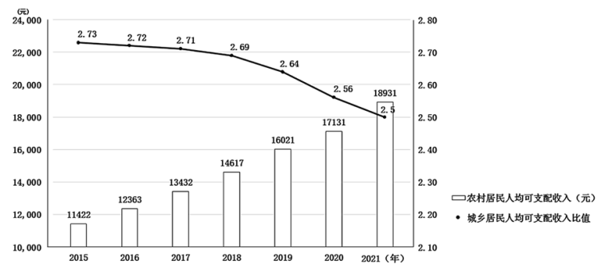
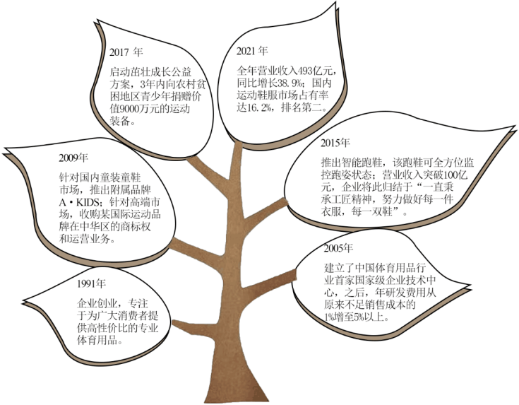

**2022年高考全国甲卷政治真题**

**一、选择题。**

1\. 2021年4月，中共中央办公厅、国务院办公厅印发《关于建立健全生态产品价值实现机制意见》强调，要以保障自然生态系统休养生息为基础，增值自然资本，厚植生态产品价值;充分发挥市场在资源配置中的决定性作用，推动生态产品价值有效转化。这表明（ ）

①生态产品有使用价值，其利用要合理有效

②生态产品有商品属性，其价值必然会实现

③生态产品有价值，价值实现要通过市场途径

④生态产品有稀缺性，休养生息是其价值源泉

A. ①③ B. ①④ C. ②③ D. ②④

【答案】A

【解析】

【详解】①：建立健全生态产品价值实现机制，以保障自然生态系统休养生息为基础，增值自然资本，厚植生态产品价值，这说明生态产品有使用价值，其利用要合理有效，①正确。

②：生态产品有商品属性，其价值能否实现受多种因素制约，“其价值必然会实现”说法过于绝对化，②排除。

③：“充分发挥市场在资源配置中的决定性作用，推动生态产品价值有效转化”意味着生态产品有价值，价值实现要通过市场途径，③正确。

④：生态产品的价值来源于人类劳动，④错误。

故本题选A。

2\. 下图反映2015-2021年我国农村居民人均可支配收入变化情况、城乡居民人均可支配收入比值变化情况。

据此可以推断出（ ）

①城乡居民的支出结构日益趋同

②农村居民的消费潜力不断增大

③城乡居民的恩格尔系数逐年上升

④农村居民人均可支配收入增速快于城镇居民

A. ①② B. ①③ C. ②④ D. ③④

【答案】C

【解析】

【详解】①：图表未显示城乡居民的支出结构，况且城乡居民支出结构趋同的说法错误，①排除。

②④：图表显示城乡居民人均可支配收入比值逐年降低，这意味着农村居民收入增幅大于城镇居民，农村居民人均可支配收入增速快于城镇居民，同时，图表也在显示农民收入逐年增加，这会导致农村居民的消费潜力不断增大，②④正确。

③：图表未显示城乡居民的恩格尔系数变化情况，况且城乡居民的恩格尔系数逐年上升，意味着城乡居民消费水平逐年下降，这不符合事实，③排除。

故本题选C。

3\. 为统筹利用东部地区日益增长的数据算力需求和西部地区丰富的空间资源、自然资源和电力资源优势，我国于2022年2月正式全面启动“东数西算”工程，通过构建一体化新型算力网络体系，把东部地区大量生产生活数据输送到西部地区进行存储、计算、反馈，推动算力资源有序向西转移，促进解决东西部算力供需失衡问题，推动数字经济均衡发展。“东数西算”工程正在吸引企业和资本的积极参与，其经济动因是（ ）

①西部算力具有资源比较优势，成本相对较低

②西部算力供应链完整，数字字经济的优势显著

③西部对算力需求大，资本投入有良好收益预期

④算力市场的供需缺口大，具有广阔的发展空间

A ①③ B. ①④ C. ②③ D. ②④

【答案】B

【解析】

【详解】①④：材料表明，“东数西算”工程是为了统筹利用东部地区日益增长的数据算力需求和西部地区丰富的空间资源、自然资源和电力资源优势，这说明吸引企业和资本的积极参与的经济动因是西部算力具有资源比较优势，成本相对较低；算力市场的供需缺口大，具有广阔的发展空间，①④正确切题。

②：东部算力供应链完整，数字字经济的优势显著，②不选；

③：东部对算力需求大，③不选。

故本题选B。

4\. 据研究预测，2022年欧洲某国国经济增长将大幅放缓，经济增速将从上年的7.5%降至3.9%；2022年二季度该国通货膨胀率将升至8%，比前月的预测高出1个百分点。5月5日，该国中央银行将利率从0.75%提高到1%，这是该国自去年12月以来连续第四次加息。该国加息政策的目标及作用过程是（ ）

A. 提高利率——流通中的货币量增加——促进消费——刺激经济增长

B. 提高利率——流通中的货币量减少——物价下降——抑制通货膨胀

C. 提高利率——储蓄增加——投资规模扩大——商品供给增加——抑制通货膨胀

D. 提高利率——境外资金流入——本币贬值——促进商品出口——刺激经济增长

【答案】B

【解析】

【详解】A：提高利率将会减少流通中的货币量，A排除。

B：提高利率将会减少流通中的货币量，从而平衡供求关系，促使物价下降，进而抑制通货膨胀，B正确。

C：提高利率有利于推动储蓄意愿增加，增加储蓄存款，但投资规模将会缩小，C排除。

D：境外资金流入，会导致本币升值，D排除。

故本题选B。

5\. 某市建立惠企平台，接入税务、社保、市场监管等部门数据，进行数据协同、数据比对、数据审核，实现了企业诉求在线直达、政府服务在线落地、政策绩效在线评价、审批许可在线完成等功能。用“数据跑”代替“企业跑”（ ）

①下放了行政事权，有助于理顺政企关系

②引入了科技手段，有助于提高行政效率

③扩大了监管职能，有助于维护市场秩序

④优化了政务服务，有助于改善营商环境

A. ①③ B. ①④ C. ②③ D. ②④

【答案】D

【解析】

【详解】①：材料强调的是优化政府的管理和服务职能，不涉及行政事权的下放，①排除。

②：用“数据跑”代替“企业跑”通过引入科技手段，有助于提高行政效率，②正确。

③：监管职能不能随意扩大，夸大了其作用，③排除。

④：该市建立惠企平台，实现了企业诉求在线直达、政府服务在线落地、政策绩效在线评价、审批许可在线完成等功能，有利于优化政务服务，进而改善营商环境，④正确。

故本题选D。

6\. 2021年开始施行的《云南省民族团结进步示范区建设条例实施细则》规定，省、州(市)、县(市、区)、乡镇(街道)、村(社区)民族团结进步五级联创，推进民族团结进步创建进机关、进企业、进社区(村)、进乡镇(街道)、进学校、进铁路、进医院、进部队、进宗教活动场所、进出入境边防检查机构等。上述规定（ ）

①有利于统筹推进民族团结进步工作机制的建设

②构成了边疆民族地区强边固防工作的法规基础

③进一步强调全民参与民族团结进步事业的义务和责任

④是民族自治机关根据本地情况贯彻执行国家政策的表现

A. ①② B. ①③ C. ②④ D. ③④

【答案】B

【解析】

【详解】①③：根据材料中开始施行的《云南省民族团结进步示范区建设条例实施细则》规定的内容，可知，上述规定有利于统筹推进民族团结进步工作机制的建设，进一步强调全民参与民族团结进步事业的义务和责任，①③正确。

②：《实施细则》侧重于操作层面，而且仅仅是一个《实施细则》，不能成为“法规基础”，“构成了边疆民族地区强边固防的法规基础”夸大了《实施细则》的作用，②排除。

④：该选项强调的是民族自治地方的自治机关的变通执行权，材料不涉及，④排除。

故本题选B。

7\. 澜湄合作机制成立6年多来，中国和湄公河五国围绕水资源合作召开部长级会议，成立水资源合作中心，举办合作论坛，开展近60场次技术交流活动，招收培养100多名湄公河青年水利人才，实施包括大坝安全、农村安全饮水、水文监测及预报预警等在内的一系列项目。澜湄水资源合作（ ）

①形成了区域经济一体化的新模式

②能够推进流域各国务实合作、巩固政治互信

③反映流域各国坚持相同的对外交流合作政策

④有利于增进流域各国民生福祉、推动可持续发展

A. ①② B. ①③ C. ②④ D. ③④

【答案】C

【解析】

【详解】①：材料不涉及区域经济一体化，而且该选项夸大了澜湄水资源合作的作用，①排除。

③：流域各国对外交流合作政策并不相同，该选项的说法不符合事实，排除③。

②④：澜湄水资源合作能够推进流域各国务实合作、巩固政治互信，有利于增进流域各国民生福祉、推动可持续发展，②④正确。

故本题选C。

8\. 2022年2月举办的北京第二十四届冬季奥林匹克运动会被誉为届“无与伦比”的冬奥会，近3000名中外运动健儿闪耀赛场，18000多名赛会志愿者默默奉献，2项世界纪录和17项冬奥会纪录被刷新，带动中国3亿多人参与冰雪运动，是迄今收视率最高的一届冬奥会，完美演绎了“更快、更高、更强更团结”的奥林匹克格言。这表明（ ）

①体育运动以彰显文化自信为根本价值追求

②人民是体育运动的价值创造者和价值享受者

③体育运动具有塑造人生、促进全面发展的育人功能

④体育运动是消弭文化差异、促进文化融合的重要手段

A. ①② B. ①④ C. ②③ D. ③④

【答案】C

【解析】

【详解】①：体育运动能彰显文化自信，但不是以彰显文化自信为根本价值追求，①错误。

②③：从北京第二十四届冬季奥林匹克运动会的参与者，以及带动中国3亿多人参与冰雪运动来讲，本届冬季奥运有是迄今收视率最高的一届冬奥会， 完美演绎了“更快、更高、更强更团结” 的奥林匹克格言。这表明人民是体育运动的价值创造者和价值享受者，体育运动具有塑造人生、促进全面发展的育人功能，②③正确。

④：文化具有多样性。体育运动消弭文化差异的说法错误，④排除。

故本题选C。

9\. 在抗击新冠肺炎疫情的人民战争中，千百万志愿者投入疫情阻击战。他们忙碌在社区，买菜送药、排查隐患;奔走在街头，维持秩序、义务接送;活跃于网络，辅导学业、疏导情绪，展现了勇于担当、甘于奉献的精神风貌。志愿者的感人事迹（ ）

①赋予集体主义精神新的实践内涵一

②是社会主义核心价值观的生动写照

③表明时代精神根源于中华传统文化

④彰显了根植于多样化实践的文化多样性

A. ①② B. ①④ C. ②③ D. ③④

【答案】A

【解析】

【详解】①②：在抗击新冠肺炎疫情的人民战争中，志愿者友善、爱国，他们的感人事迹诠释了新时代集体主义精神，赋予集体主义精神新的实践内涵，是社会主义核心价值观的生动写照，①②正确切题；

③：时代精神根源于实践，而不是中华传统文化，③不选；

④：材料不涉及文化多样性，④不选。

故本题选A。

10\. 2022年2月27日，以某高校学生为主研制的遥感卫星“启明星”发射升空，学生可以根据需要给卫星发指令获得地球观测数据，用来验证自己的创意是否合理可行。通过研制卫星，学生巩固了专业知识，极大地提升了专业能力。由此获得的启示是（ ）

①认识的目的全在于从实践中获得真理

②亲身参与实践获得的知识才是可靠的知识

③间接经验同直接经验相结合能够深化认识

④只有通过实践才能验证认识的客观真理性

A. ①② B. ①④ C. ②③ D. ③④

【答案】D

【解析】

【详解】①：实践是认识的目的，①错误。

②：亲身参与实践获得的知识不一定是正确的，不一定是可靠的知识，②排除。

③：学生可以根据需要给卫星发指令获得地球观测数据，用来验证自己创意是否合理可行，这说明“只有通过实践才能验证认识的客观真理性”，③正确切题。

④：通过研制卫星，学生巩固了专业知识，极大地提升了专业能力，这明是间接经验同直接经验相结合能够深化认识，④正确切题。

故本题选D。

11\. 《中共中央关于党的百年奋斗重大成就和历史经验的决议》指出，勇于自我革命是中国共产党区别于其他政党的显著标志。自我革命精神是党永葆青春活力的强大支撑。先进的马克思主义政党不是天生的，而是在不断自我革命中淬炼而成的。上述论断的哲学依据是（ ）

①辩证法本质上是批判的和革命的

②辩证否定是事物联系和发展的环节

③具体问题具体分析是马克思主义的活的灵魂

④新事物代替旧事物是事物发展变化的基本状态

A. ①② B. ①③ C. ②④ D. ③④

【答案】A

【解析】

【详解】①③：自我革命精神是党永葆青春活力的强大支撑。先进的马克思主义政党不是天生的，而是在不断自我革命中淬炼而成的，这体现了辩证法本质上是批判的和革命的，辩证否定是事物联系和发展的环节，①③正确。

③：该选项说法正确，但与材料强调的“自我革命”无关，③排除。

④：量变与质变是事物发展变化的基本状态，④说法错误，排除。

故本题选A。

12\. 某市是以铜业为主的资源型城市。近年来，该市抓住国家支持资源型城市转型发展的机遇，持续开展解放思想大讨论，按照“抓住铜、延伸铜，不唯铜、超越铜”的思路，狠抓传统产业升级和新动能培育。如今，不仅铜冶炼技术达到世界领先水平，半导体、新能源汽车、工业互联网等战略性新兴产业也蓬勃发展，千年铜都正迈向“智造新铜都”。该市的转型发展表明（ ）

①实践创新的高度取决于观念更新的程度

②善于抓住机遇是实践创新成功的重要条件

③只有不断创新，才能发挥意识的能动作用

④只有解放思想，才能实事求是、开拓创新

A. ①③ B. ①④ C. ②③ D. ②④

【答案】D

【解析】

【详解】①：该选项的说法夸大了意识的作用，①说发错误，排除。

②④：该市抓住国家支持资源型城市专型发展的机遇，持续开展解放思想大讨论，，按照“抓住铜、延伸铜，不唯铜、超越铜”的思路，狠抓传统产业升级和新动能培育，使千年铜都正迈向“智造新铜都”。这表明善于抓住机遇是实践创新成功的重要条件，只有解放思想，才能实事求是、开拓创新，②④正确。

③：创新能够更好的发挥意识的能动作用，但并不是只有不断创新，才能发挥意识的能动作用，该选项的说法错误，③排除。

故本题选D。

**二、非选择题。**

13\. 阅读材料，完成下列要求。

甲是一家从事设计、开发、制造和行销A品牌运动鞋、服装及配饰等体育用品的中国企业。1991年甲从一家制鞋作坊起步，目前已发展成为国内最大的综合体育用品公司。甲企业的发展历程如下图所示。

2017年：启动苗壮成长公益方案，3年内向农村贫困地区青少年捐赠价值9000万元的运动装备。

2009年：针对国内童装童鞋市场，推出附属品牌A·KIDS；针对高端市场，收购某国际运动品牌在中华区的商标权和运营业务。

1991年：企业创立，专注于为广大消费者提供高性价比的专业体育用品。

2021年：全年营业收入493亿元，同比增长38.9%；国内运动鞋服市场占有率达16.2%，排名第二。

2015年：推出智能跑鞋，该跑鞋可全方位监控跑姿状态；营业收入突破100亿元，企业将此归结于“一直秉承工匠精神，努力做好每一件衣服，每一双鞋”。

2005年：建立了中国体育用品行业首家国家级企业技术中心，之后，年研发费用从原来不足销售成本的1%增至5%以上。

结合材料并运用经济知识，分析甲企业为何能够不断发展壮大。

【答案】① 制定正确的经营战略。该企业创立之初，专注于为广大消费者提供高性价比的专业体育用品，其战略定位准确，顺应了时代发展潮流，为企业的发展插上腾飞的翅膀。\
② 贯彻创新发展理念，提高自主创新能力，依靠技术进步、科学管理等手段，形成自己的竞争优势。该企业自2005年之后，一直注重加大研发投入，为企业发展增添内生动力。\
③ 延伸产业链，上下游融合发展。该企业推出童装童鞋附属品牌，并收购某高端国际运动品牌的商标权和运营业务，有助于扩大企业规模，增强企业整体实力。\
④ 发扬工匠精神，提高产品质量，增加有效供给。该企业调整生产结构，推出智能化跑鞋，满足个性化消费需求，增加了年产值，实现企业高质高效发展。\
⑤企业要承担社会责任，将经济效益和社会效益相结合。该企业通过启动茁壮成长公益方案，为企业树立了良好的社会信誉和形象。\
⑥着力打造本土品牌，立足国内大循环，不断扩大国内市场占有份额，更好满足人们对美好生活需要，为企业的后续发展争取更强劲动力。

【解析】

【分析】背景素材：甲企业的发展历程

考点考查：经济生活有关知识

能力考查：获取和解读信息、调动和运用知识、描述和阐述事物

核心素养：政治认同、科学精神

【详解】第一步：审设问。明确主体，作答范围、问题限定和作答角度。本题的主体是甲企业。需要结合材料并运用经济知识，分析甲企业为何能够不断发展壮大，属于原因类主观题。回答这类主观题，一般需要回答“这样说”“这样做”的具体内容及其带来的重要意义。

第二步：读材料。通过标点符号，特色句式或段落等，提取材料中有效信息。

有效信息①：1991年企业创立之初，专注于为广大消费者提供高性价比的专业体育用品→可联系制定正确的经营战略。

有效信息②：该企业自2005年之后，一直注重加大研发投入，为企业发展增添内生动力→可联系贯彻创新发展理念，提高自主创新能力，依靠技术进步、科学管理等手段，形成自己的竞争优势。

有效信息③：该企业推出童装童鞋附属品牌，并收购某高端国际运动品牌的商标权和运营业务，有助于扩大企业规模，增强企业整体实力→可联系延伸产业链，上下游融合发展。

有效信息④：该企业调整生产结构，推出智能化跑鞋，满足个性化消费需求，增加了年产值，实现企业高质高效发展→可联系发扬工匠精神，提高产品质量，增加有效供给。

有效信息⑤：该企业通过启动茁壮成长公益方案，为企业树立了良好的社会信誉和形象→可联系企业要承担社会责任，将经济效益和社会效益相结合。

有效信息⑥：不断扩大国内市场占有份额，更好满足人们对美好生活需要→可联系着力打造本土品牌，立足国内大循环，不断扩大国内市场占有份额，更好满足人们对美好生活需要，为企业的后续发展争取持续强劲动力。

第三步：整合信息，组织答案。得分点①：企业要制定正确的经营战略+材料分析。

得分点②：贯彻创新发展理念，提高自主创新能力，依靠技术进步、科学管理等手段，形成自己的竞争优势+材料分析。

得分点③：延伸产业链，上下游融合发展+材料分析。

得分点④：发扬工匠精神，提高产品质量，增加有效供给+材料分析。

得分点⑤：企业要承担社会责任，将经济效益和社会效益相结合+材料分析。

得分点⑥：打造本土品牌，立足国内大循环+材料分析。

【点睛】原因类主观题，作答技巧：首先，定点。明确考查的知识点，回顾相关知识点。其次，联系。审读材料，在材料分析时要注意分层次，抓关键句。最后，梳理、作答。将材料信息与考察知识点一一对照，做到观点与材料相结合。

14\. 阅读材料，完成下列要求。

习近平在上海市虹桥街道考察时充分肯定了基层立法联系点在发展全过程人民民主中的重要作用和意义，截至2021年7月，全国人大常委会法工委建立基层立法联系点22个、带动省、市两级人大常委会建立立法联系点4700余个。到2022年1月，全国人大常委会基层立法联系点获得建议11360余条，其中2300余条意见建议被不同程度采纳吸收。

2020年，在某地基层立法联系点就《未成年人保护法（修订草案）》征求意见时，一所中学的学生提出，鉴于未成年人家庭经济条件的差异，建议取消草案中某条款对监护人不依法履行监护职责的行为进行经济处罚的内容，2021年施行的新修订的《未成年人保护法》吸纳了该校学生的建议，同学们表示：“自己的意见不但能得到学校重视，还能得到国家重视，深感自豪、备受鼓舞。”

结合材料并运用政治生活知识，说明公民参与基层立法联系点活动的意义。

【答案】①体现了我国人民民主专政的国家性质，人民是国家的主人。公民参与基层立法联系点活动有利于实现良法善治，更好的维护广大人民群众的合法权益。\
②有利于贯彻、落实全过程人民民主。全过程人民民主是全链条、全方位、全覆盖的民主，为人民行使当家作主权利起到保驾护航作用。习近平在上海考察时充分肯定了基层立法联系点在发展全过程人民民主中的重要作用和意义。\
③有利于科学、民主、依法立法，维护公民知情权、参与权，体现了民主的真实性、广泛性。全国人大常委会不同程度采纳通过基层立法联系点收集的建议，体现了充分尊重反映民意，贯彻了民主集中制，体现了协商民主。\
④有利于形成全民守法风尚，更好推动法治中国建设。通过基层立法联系点，公民的意见受到国家重视，提高了他们的主人翁意识和政治参与热情，增强对国家法律的理解、支持，从而有助于更好的推动法律的实施。\
⑤有利于更好地把坚持党的领导、人民当家作主和依法治国相统一。

【解析】

【分析】背景素材：基层立法联系点

考点考查：政治生活有关知识

能力考查：获取和解读信息、调动和运用知识、描述和阐述事物

核心素养：政治认同、科学精神

【详解】第一步：审设问。明确主体，作答范围、问题限定和作答角度。

本题的主体是公民。需要结合材料并运用政治生活相关知识，说明公民参与基层立法联系点活动的意义，属于意义、作用类主观题。回答这类主观题，一般需要回答“这样说”“这样做”的具体内容及其带来的重要影响。

第二步：读材料。通过标点符号，特色句式或段落等，提取材料中有效信息。

有效信息①：全国人大常委会法工委建立基层立法联系点22个、带动省、市两级人大常委会建立立法联系点4700余个→可联系人民民主专政的国家性质，人民是国家的主人；实现良法善治，更好的维护广大人民群众的合法权益。

有效信息②：习近平在上海市虹桥街道考察时充分肯定了基层立法联系点在发展全过程人民民主中的重要作用和意义→可联系全过程人民民主是全链条、全方位、全覆盖的民主，为人民行使当家作主权利起到保驾护航作用。

有效信息③：全国人大常委会基层立法联系点获得建议11360余条，其中2300余条意见建议被不同程度采纳吸收→可联系有利于科学、民主、依法立法，维护公民知情权、参与权，体现了民主的真实性、广泛性，体现了协商民主。

有效信息④：同学们表示：“自己的意见不但能得到学校重视，还能得到国家重视，深感自豪、备受鼓舞。”→可联系有利于形成全民守法风尚，更好推动法治中国建设。

有效信息⑤：国家广泛设立基层立法联系点，公民广泛参与基层立法联系点活动→可联系有利于更好地把坚持党的领导、人民当家作主和依法治国相统一。

第三步：整合信息，组织答案。

得分点①：体现了人民民主专政的国家性质，人民是国家的主人；实现良法善治，更好的维护广大人民群众的合法权益+材料分析。

得分点②：有利于贯彻、落实全过程人民民主，为人民行使当家作主权利起到保驾护航作用+材料分析。

得分点③：有利于科学、民主、依法立法，维护公民知情权、参与权，体现了民主的真实性、广泛性，体现了协商民主+材料分析。

得分点④：有助于形成全民守法风尚，更好推动法治中国建设+材料分析。

得分点⑤：有利于把坚持党的领导、人民当家作主和依法治国相统一。

【点睛】意义、作用类主观题可采用“定点﹣透联﹣作答”的三步解答法。

定点：研读设问的具体限制的指向，确定应该研究和利用的材料内容，确定可用的知识范围。透联：分别分层次和从总体上研究所定材料内容，概括、采集材料的有效信息点。运用透过现象看本质、联想、对比等思维方法，逐一找出所采集到的各材料信息点所联系、对应的符合设问限制的有效知识点，实现材料信息与有效知识点之间的正确联结。

作答：将透联的过程和结果书面化，形成答案。

15\. 阅读材料，完成下列要求。

中国共产党始终把为中国人民谋幸福、为中华民族谋复兴作为自己的初心使命，始终坚持共产主义理想和社会主义信念。

心中有信仰，脚下有力量、“敌人只能砍下我们的头颅，决不能动摇我们的信仰”，这是方志敏牺牲前留下的铮铮誓言；夏明翰视死如归，写下“砍头不要紧，只要主义真”；“宁肯少活二十年，拼命也要拿下大油田”是王进喜崇高人生的写照；在脱贫攻坚第一线献出年轻生命的驻村第一书记黄文秀，下定“不获全胜，决不收兵”的决心……一代又一代的共产党人以自己的奋斗牺牲，彰显了对马克思主义的信仰、对社会主义和共产主义的信念的无限忠诚。

江山就是人民，人民就是江山，长征途中红军战士“半条被子”的故事使老百姓认识到“共产党是只有一床被子也要分一半给你的好人”。中共七大通过的党章强调“中国共产党人必须具有全心全意为中国人民服务的精神”，新中国的第一部宪法明确“一切权力属于人民”。改革开放以来，我们党坚持“把人民拥护不拥护、赞成不赞成、高兴不高兴、答应不答应作为衡量一切工作得失的根本标准”。进入新时代，我们党提出“人民对美好生活的向往，就是我们的奋斗目标”，中国共产党始终以人民为标尺，持之以恒答好人民考卷，赢得了广大人民群众的衷心拥护和支持，中华民族迎来了从站起来、富起来到强起来的伟大飞跃。

（1）坚定理想信念是共产党人经受住任何考验的精神支柱，运用文化生活的知识并结合材料加以说明。

（2）运用党的群众观点的知识并结合材料，阐明为什么中国共产党能赢得广大人民群众的衷心拥护和支持。

（3）班级举行“请党放心，强国有我”主题班会，请列举两个发言要点。（要求主旨鲜明，朗朗上口，每个要点在15个字以内。）

【答案】（1）①理想信念作为一种精神力量，影响人的认识活动、实践活动和思维方式。一代代的共产党人始终坚定理想信念，树立正确的历史观、民族观、国家观，经受了各种考验，推动社会进步发展。②优秀的文化增强人的精神力量。崇高的理想信念，始终是共产党人保持先进性的精神动力、精神支撑，他们坚持不忘初心、不移其志，披荆斩棘、奋力前行，为实现中华民族伟大复兴接续奋斗。③理想指引人生方向，信念决定事业成败，理想信念是中国共产党人的政治灵魂，无数共产党员为了理想信念，高扬爱国主义为核心的民族精神，不畏牺牲，无私奉献，推动实现民族振兴、国家富强。

（2）人民群众是社会历史的主体，要求我们坚持群众观点，相信人民群众自己解放自己，全心全意为人民服务，一切向人民群众负责，虚心向人民群众学习。之所以能赢得广大人民群众的衷心拥护和支持，就在于中国共产党牢记使命，全心全心全意为人民服务，关心掌握群众生产、生活情况，坚持人民利益至上；始终以人民为标尺，答好人民的考卷，真正做到了一切向人民群众负责；满足人民的关切、期待，深人群众调查研究，虚心向人民群众学习，从群众中获取智慧和办法；坚持人民主体地位、相信依靠人民群众，带领人民群众迎来了从站起来、富起来到强起来的伟大飞跃。

（3）传承红色基因，争做红色传人；坚定理想信念，主动担当作为；努力学习科学文化知识，全面提高个人素质；锤炼品德修养，打牢道德根基。

【解析】

分析】背景素材：党坚定理想信念、坚守人民立场

考点考查：文化对人的影响、理想信念、群众观点等

能力考查：获取和解读信息、调动和运用知识、描述和阐述事物

核心素养：政治认同

【小问1详解】

第一步：审设问。（明确主体、作答范围、问题限定和作答角度。）

本题需要调用文化生活的有关知识，说明坚定理想信念是共产党人经受任何考验的精神支柱。回答此类问题一般按照“必要性+重要性+意义”作答。

第二步：审材料。（通过标点符号、段落等，提取材料有效信息。）

有效信息①：不同时期共产党人相同的奉献、牺牲事迹。→可联系理想信念作为一种精神力量，影响人的认识活动、实践活动和思维方式。

有效信息②：理想鼓舞共产党人奋斗前行。→可联系优秀的文化增强人的精神力量。

有效信息③：为了理想经得住各种考验。→可得出 理想信念、民族精神作用。

第三步：整合信息，组织答案。

得分点①： 理想信念作为一种精神力量，影响人的认识活动、实践活动和思维方式+分析材料。

得分点②： 优秀的文化增强人的精神力量+分析材料。

得分点③： 理想信念、民族精神作用+分析材料。

【小问2详解】

第一步：审设问。（明确主体、作答范围、问题限定和作答角度。）

本题需要调用党的群众观点的知识并结合材料，阐明为什么中国共产党能赢得广大人民群众的衷心拥护和支持。回答为什么能这类问题可用定点法，具体可按定点、联系、梳理、作答四个环节完成。

第二步：审材料。（通过标点符号、段落等，提取材料有效信息。）

有效信息①：设问要求群众观点。→可联系人民群众是社会历史的主体，要求我们坚持群众观点，相信人民群众自己解放自己，全心全意为人民服务，一切向人民群众负责，虚心向人民群众学习。

有效信息②：关心掌握群众生产、生活情况。→可联系全心全心全意为人民服务。

有效信息③：以人民为标尺，答好人民的考卷。→可得出 一切向人民群众负责。

有效信息④：从群众中获取智慧和办法。→可得出虚心向人民群众学习。

有效信息⑤：带领人民群众迎来了从站起来、富起来到强起来的伟大飞跃。→可得出相信依靠人民群众。

第三步：整合信息，组织答案。

得分点①： 人民群众是社会历史的主体，要求我们坚持群众观点，相信人民群众自己解放自己，全心全意为人民服务，一切向人民群众负责，虚心向人民群众学习。

得分点②： 全心全心全意为人民服务+分析材料。

得分点③： 一切向人民群众负责+分析材料。

得分点④： 虚心向人民群众学习+分析材料。

得分点⑤：相信依靠人民群众+分析材料。

【小问3详解】

第一步：审设问，明确主体、作答范围、问题限定和作答角度。

本题的设问是某班准备开展“强国有我，请党放心”主题班会，请你列出两条发言要点。

本小问是一道开放性试题，只要言之有理，不出现知识性错误即可。

第二步：整合信息，组织答案。

得分点①：传承红色基因，争做红色传人或坚定理想信念，主动担当作为。

得分点②：努力学习科学文化知识，全面提高个人素质或锤炼品德修养，打牢道德根基。

【点睛】开放性试题：

对开放性题目，要用好发散思维方式。

解答好开放题切记要从多角度思考问题，联系社会生活实际，从教材内外知识的结合上来回答问题，要有自己的见解和创新。

教材知识主要是理论知识，自己的见解和创新可以是自己的生活累积，也可是学习的感悟，等等
